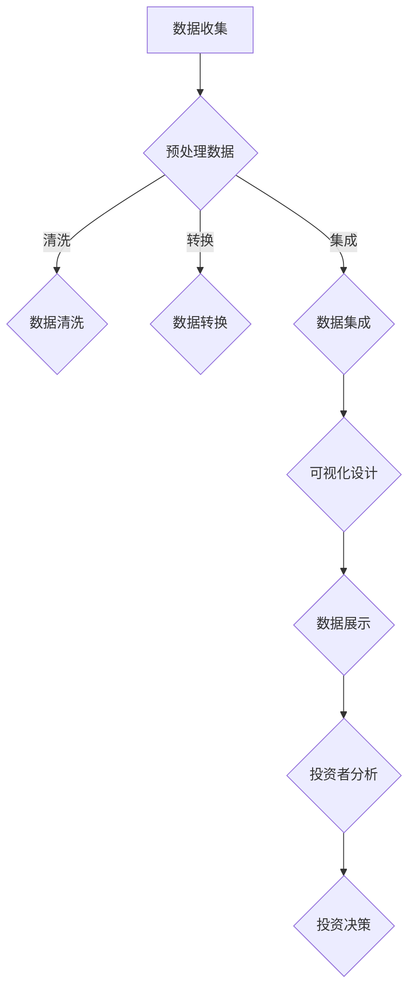

                 

关键词：数据可视化、融资效果、投资者关系、数据展示、信息传达

> 摘要：数据可视化作为一种强有力的沟通工具，能够通过图形和图表直观地展示数据，帮助投资者快速理解企业价值和潜力。本文将探讨如何利用数据可视化技术来提升融资效果，包括其核心概念、操作步骤、数学模型、实际应用案例和未来展望。

## 1. 背景介绍

在当今竞争激烈的市场环境中，企业融资成为了一项至关重要的任务。而如何有效地与投资者沟通，让他们理解企业的价值、前景和潜在收益，成为了决定融资成败的关键。数据可视化技术作为一种新兴的工具，正逐渐成为企业吸引投资的重要手段。通过数据可视化，企业可以直观地展示其运营状况、市场趋势、盈利能力等关键指标，从而增强投资者的信心和兴趣。

### 1.1 数据可视化的定义

数据可视化是指通过图形、图表、地图和其他视觉元素来表示数据，帮助人们更直观地理解和分析数据。它不仅包含了数据的呈现方式，还涉及到数据的组织、分析和解释。

### 1.2 数据可视化的重要性

- **提高信息传达效率**：通过视觉化的方式，使复杂的数据变得容易理解和记忆。
- **增强数据说服力**：图表和图形能够更直观地展示数据的趋势和关系，增强数据的可信度和说服力。
- **促进决策制定**：数据可视化可以帮助企业快速识别问题和机会，从而做出更明智的决策。

## 2. 核心概念与联系

### 2.1 数据可视化与融资的关联

数据可视化与融资之间存在紧密的联系。投资者在做出投资决策时，往往会关注企业的财务状况、市场地位、增长潜力等因素。而数据可视化技术能够将这些关键信息以直观、清晰的方式展示出来，帮助投资者快速评估企业的价值。

### 2.2 数据可视化技术的基本原理

数据可视化技术主要依赖于计算机图形学和交互设计。其基本原理包括：

- **数据预处理**：对原始数据进行清洗、转换和集成，使其适合可视化。
- **数据映射**：将数据映射到视觉元素上，如颜色、形状、大小等。
- **交互设计**：提供用户与可视化数据的互动，如筛选、排序、缩放等。

### 2.3 Mermaid 流程图

以下是一个简单的 Mermaid 流程图，展示了数据可视化在融资过程中的应用：



## 3. 核心算法原理 & 具体操作步骤

### 3.1 算法原理概述

数据可视化技术涉及多种算法原理，包括但不限于：

- **统计图表算法**：用于生成条形图、折线图、饼图等常见图表。
- **交互式可视化算法**：用于实现数据筛选、过滤、动态更新等功能。
- **数据映射算法**：用于将数据映射到视觉元素上。

### 3.2 算法步骤详解

1. **数据收集**：从企业内部和外部来源收集数据，包括财务报表、市场研究、客户反馈等。
2. **数据预处理**：清洗、转换和集成数据，使其适合可视化。
3. **可视化设计**：选择合适的图表类型和设计风格，将数据可视化。
4. **数据展示**：将可视化结果展示给投资者，提供交互式体验。

### 3.3 算法优缺点

**优点**：

- **直观易懂**：通过视觉化的方式，使复杂的数据变得容易理解和记忆。
- **增强说服力**：图表和图形能够更直观地展示数据的趋势和关系，增强数据的可信度和说服力。
- **促进决策制定**：数据可视化可以帮助企业快速识别问题和机会，从而做出更明智的决策。

**缺点**：

- **数据准确性**：如果数据预处理不当，可能会导致可视化结果的偏差。
- **技术门槛**：需要一定的技术知识和技能，才能有效地进行数据可视化。

### 3.4 算法应用领域

数据可视化技术广泛应用于各个领域，包括金融、医疗、市场营销等。在融资过程中，数据可视化技术可以帮助企业更好地与投资者沟通，提高融资成功率。

## 4. 数学模型和公式 & 详细讲解 & 举例说明

### 4.1 数学模型构建

在数据可视化过程中，常用的数学模型包括：

- **回归分析**：用于分析数据之间的关系。
- **聚类分析**：用于将数据分组，以便更好地理解数据。
- **时间序列分析**：用于分析时间序列数据，预测未来的趋势。

### 4.2 公式推导过程

以下是一个简单的回归分析公式的推导过程：

$$
y = \beta_0 + \beta_1x + \epsilon
$$

其中，$y$ 是因变量，$x$ 是自变量，$\beta_0$ 和 $\beta_1$ 是回归系数，$\epsilon$ 是误差项。

### 4.3 案例分析与讲解

假设我们要分析一家企业的销售数据，并预测其未来的销售趋势。我们可以使用回归分析方法，通过以下步骤进行：

1. **数据收集**：收集企业的历史销售数据。
2. **数据预处理**：清洗和转换数据，使其适合回归分析。
3. **模型构建**：使用回归分析方法，构建预测模型。
4. **模型评估**：评估模型的准确性和可靠性。
5. **预测**：使用模型预测未来的销售趋势。

## 5. 项目实践：代码实例和详细解释说明

### 5.1 开发环境搭建

在 Python 中，我们可以使用 Matplotlib 和 Pandas 等库进行数据可视化。

### 5.2 源代码详细实现

以下是一个简单的数据可视化示例：

```python
import matplotlib.pyplot as plt
import pandas as pd

# 加载数据
data = pd.read_csv('sales_data.csv')

# 绘制折线图
plt.plot(data['date'], data['sales'])
plt.xlabel('Date')
plt.ylabel('Sales')
plt.title('Sales Trend')
plt.show()
```

### 5.3 代码解读与分析

- `import matplotlib.pyplot as plt`：导入 Matplotlib 库。
- `import pandas as pd`：导入 Pandas 库。
- `data = pd.read_csv('sales_data.csv')`：加载数据。
- `plt.plot(data['date'], data['sales'])`：绘制折线图。
- `plt.xlabel('Date')`：设置 x 轴标签。
- `plt.ylabel('Sales')`：设置 y 轴标签。
- `plt.title('Sales Trend')`：设置图表标题。
- `plt.show()`：显示图表。

### 5.4 运行结果展示

运行上述代码后，将显示一个折线图，展示销售数据的趋势。

## 6. 实际应用场景

### 6.1 财务分析

企业可以利用数据可视化技术，将财务报表、盈利能力、现金流等关键指标以直观的方式展示给投资者，帮助他们快速理解企业的财务状况。

### 6.2 市场分析

通过数据可视化，企业可以展示市场趋势、竞争对手分析、客户分布等数据，帮助投资者了解市场前景和企业竞争优势。

### 6.3 项目评估

在项目评估过程中，数据可视化技术可以帮助企业展示项目的成本、收益、风险等关键指标，帮助投资者做出更明智的决策。

## 7. 未来应用展望

随着数据可视化和人工智能技术的发展，未来数据可视化在融资中的应用将更加广泛和深入。以下是几个未来应用展望：

- **智能化可视化**：利用人工智能技术，实现自动化的数据可视化和智能推荐。
- **多维度分析**：结合大数据和云计算技术，进行多维度、跨领域的数据分析。
- **个性化定制**：根据投资者的需求和偏好，提供个性化的数据可视化服务。

## 8. 总结：未来发展趋势与挑战

### 8.1 研究成果总结

本文探讨了如何利用数据可视化技术提升融资效果，包括其核心概念、操作步骤、数学模型和实际应用案例。

### 8.2 未来发展趋势

未来，数据可视化技术将在融资领域发挥更大的作用，实现智能化、个性化、多维度的发展。

### 8.3 面临的挑战

数据可视化技术在融资应用中面临的挑战包括数据准确性、技术门槛、用户隐私保护等。

### 8.4 研究展望

未来研究应关注如何提高数据可视化技术在融资中的应用效果，降低技术门槛，保护用户隐私。

## 9. 附录：常见问题与解答

### 9.1 数据可视化技术是否适用于所有企业？

数据可视化技术适用于所有类型的企业，尤其是那些需要与投资者进行沟通和展示的企业。

### 9.2 如何选择合适的可视化工具？

选择可视化工具时，应考虑企业的需求、技术能力、数据量等因素。常见的可视化工具有 Matplotlib、D3.js、Tableau 等。

### 9.3 数据可视化技术是否会影响投资决策？

数据可视化技术可以提高投资者对企业的理解和信心，从而影响投资决策。但最终决策仍取决于投资者的个人判断和偏好。

----------------------------------------------------------------

本文由“禅与计算机程序设计艺术 / Zen and the Art of Computer Programming”撰写。希望本文能为读者在利用数据可视化技术提升融资效果方面提供有价值的参考和启示。如果您有任何疑问或建议，欢迎留言讨论。

