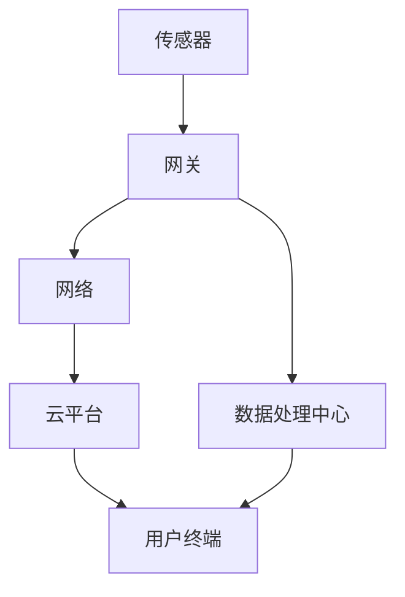

                 

关键词：物联网，创新创业，商业模式，技术应用，场景分析，未来展望

摘要：本文将深入探讨物联网技术在创新创业中的潜在价值，通过分析物联网的核心概念、应用场景和商业案例，帮助创业者发掘利用物联网技术打造创新商业模式的契机。文章将围绕物联网的技术原理、数学模型、项目实践以及未来发展趋势进行详细阐述，为物联网技术的创新应用提供思路和指导。

## 1. 背景介绍

随着信息技术的快速发展，物联网（Internet of Things，IoT）已经成为全球关注的焦点。物联网是指通过传感器、网络和数据处理技术，将各种物理设备互联，实现数据交换和智能控制。物联网技术的出现，不仅改变了传统产业的生产方式，还为创业者提供了丰富的创新空间。

### 1.1 物联网的发展历程

物联网的概念最早可以追溯到20世纪80年代末，当时美国麻省理工学院（MIT）的Kevin Ashton首次提出了“物联网”一词。随着传感器技术、网络技术和数据处理技术的进步，物联网逐渐从概念走向现实。

- **1990年代**：初步探索阶段，主要是研究如何将传感器和计算机网络结合起来。
- **2000年代**：兴起阶段，智能家居、智能交通等领域开始应用物联网技术。
- **2010年代**：快速发展阶段，物联网设备数量迅速增加，应用场景不断拓展。
- **2020年代**：成熟应用阶段，物联网技术已经成为各行各业的重要组成部分。

### 1.2 物联网的核心概念

物联网的核心概念包括以下几个方面：

- **传感器**：物联网的基础，用于感知和采集物理世界的数据。
- **网络**：实现物联网设备之间的互联互通，常用的网络技术包括Wi-Fi、蓝牙、ZigBee等。
- **数据处理**：对采集到的数据进行分析和处理，实现智能决策。
- **云计算**：提供强大的数据处理能力和存储能力，支持物联网应用。

## 2. 核心概念与联系

### 2.1 物联网架构图

以下是一个简单的物联网架构图，展示物联网的核心组件及其相互关系：



### 2.2 核心概念解释

- **传感器**：用于感知物理世界，常见的传感器包括温度传感器、湿度传感器、光照传感器等。
- **网关**：连接物联网设备和网络的中介，负责数据的传输和协议转换。
- **网络**：实现物联网设备之间的互联互通，常见的网络包括Wi-Fi、蓝牙、ZigBee等。
- **云平台**：提供数据处理、存储和计算能力，支持物联网应用。
- **用户终端**：包括智能手机、电脑等，用于接收和处理物联网数据。
- **数据处理中心**：对物联网数据进行处理和分析，实现智能决策。

## 3. 核心算法原理 & 具体操作步骤

### 3.1 算法原理概述

物联网技术的核心在于数据采集、传输和处理。在这个过程中，常用的算法包括数据采集算法、传输优化算法、数据处理算法等。

- **数据采集算法**：用于传感器数据采集，常用的算法包括采样算法、滤波算法等。
- **传输优化算法**：用于优化数据传输效率，常用的算法包括路由算法、传输协议优化等。
- **数据处理算法**：用于数据处理和分析，常用的算法包括数据挖掘算法、机器学习算法等。

### 3.2 算法步骤详解

以数据挖掘算法为例，其具体步骤如下：

1. **数据预处理**：包括数据清洗、数据转换、数据归一化等步骤。
2. **特征选择**：选择对数据挖掘任务有用的特征。
3. **模型构建**：根据特征选择结果，构建数据挖掘模型。
4. **模型训练**：使用训练数据对模型进行训练。
5. **模型评估**：使用测试数据对模型进行评估。
6. **模型应用**：将训练好的模型应用到实际问题中。

### 3.3 算法优缺点

- **数据采集算法**：优点是可以实时获取物理世界的数据，缺点是数据量大，处理复杂。
- **传输优化算法**：优点是可以提高数据传输效率，缺点是需要复杂的网络协议。
- **数据处理算法**：优点是可以实现智能决策，缺点是计算复杂度高。

### 3.4 算法应用领域

- **数据采集算法**：广泛应用于智能监控、智能家居等领域。
- **传输优化算法**：广泛应用于智能交通、智能物流等领域。
- **数据处理算法**：广泛应用于智能医疗、智能农业等领域。

## 4. 数学模型和公式 & 详细讲解 & 举例说明

### 4.1 数学模型构建

在物联网技术中，常用的数学模型包括线性回归模型、决策树模型、神经网络模型等。

- **线性回归模型**：用于预测连续值输出，公式如下：

  $$y = \beta_0 + \beta_1 \cdot x_1 + \beta_2 \cdot x_2 + ... + \beta_n \cdot x_n$$

- **决策树模型**：用于分类和回归，公式如下：

  $$f(x) = \sum_{i=1}^{n} c_i \cdot g_i(x)$$

  其中，$c_i$ 为分类结果，$g_i(x)$ 为条件概率函数。

- **神经网络模型**：用于复杂非线性预测，公式如下：

  $$y = \sigma(\sum_{i=1}^{n} w_i \cdot x_i + b)$$

  其中，$\sigma$ 为激活函数，$w_i$ 为权重，$x_i$ 为输入特征，$b$ 为偏置。

### 4.2 公式推导过程

以线性回归模型为例，其公式推导过程如下：

1. **最小二乘法**：假设输出值 $y$ 与输入特征 $x$ 之间存在线性关系，即 $y = \beta_0 + \beta_1 \cdot x_1 + \beta_2 \cdot x_2 + ... + \beta_n \cdot x_n$。
2. **平方误差**：计算实际输出值 $y$ 与预测输出值 $y'$ 之间的平方误差，公式如下：

   $$J(\beta) = \sum_{i=1}^{n} (y_i - y'_i)^2$$

3. **偏导数**：对 $J(\beta)$ 求偏导数，并令偏导数为0，得到最小二乘法的解：

   $$\frac{\partial J(\beta)}{\partial \beta_i} = -2 \cdot \sum_{i=1}^{n} (y_i - y'_i) \cdot x_i = 0$$

   化简后得到：

   $$\beta_i = \frac{\sum_{i=1}^{n} x_i \cdot y_i}{\sum_{i=1}^{n} x_i^2}$$

### 4.3 案例分析与讲解

假设我们有一个智能家居系统，需要根据室内温度和湿度来控制空调和加湿器的开关。我们可以使用线性回归模型来预测最佳温度和湿度。

1. **数据采集**：采集一段时间内的室内温度和湿度数据。
2. **数据预处理**：对数据进行清洗和归一化处理。
3. **特征选择**：选择温度和湿度作为输入特征。
4. **模型构建**：使用最小二乘法构建线性回归模型。
5. **模型训练**：使用训练数据对模型进行训练。
6. **模型评估**：使用测试数据对模型进行评估。
7. **模型应用**：将训练好的模型应用到实际场景中，根据室内温度和湿度来控制空调和加湿器的开关。

通过这个案例，我们可以看到数学模型在物联网技术中的应用，帮助我们实现智能决策。

## 5. 项目实践：代码实例和详细解释说明

### 5.1 开发环境搭建

为了实现物联网技术应用，我们需要搭建一个开发环境。以下是常用的开发工具和软件：

- **操作系统**：Windows、Linux或macOS。
- **编程语言**：Python、Java或C++。
- **开发工具**：PyCharm、Eclipse或Visual Studio。
- **物联网平台**：MQTT、CoAP或HTTP。

### 5.2 源代码详细实现

以下是一个简单的Python示例，展示如何使用MQTT协议进行数据采集和传输：

```python
import paho.mqtt.client as mqtt

# MQTT服务器地址
mqtt_server = "mqtt.example.com"

# MQTT客户端ID
client_id = "my_client_id"

# MQTT连接成功回调函数
def on_connect(client, userdata, flags, rc):
    print("Connected with result code "+str(rc))
    client.subscribe("sensor/data")

# MQTT消息接收回调函数
def on_message(client, userdata, msg):
    print(msg.topic+" "+str(msg.payload))

# 创建MQTT客户端实例
client = mqtt.Client(client_id)

# 添加回调函数
client.on_connect = on_connect
client.on_message = on_message

# 连接MQTT服务器
client.connect(mqtt_server, 1883, 60)

# 循环订阅并接收消息
client.loop_forever()
```

### 5.3 代码解读与分析

这个示例使用Python的Paho MQTT库来实现MQTT客户端功能。具体步骤如下：

1. **导入库**：导入paho.mqtt.client库。
2. **设置MQTT服务器地址和客户端ID**：定义MQTT服务器地址和客户端ID。
3. **定义连接成功回调函数**：当客户端成功连接到MQTT服务器时，执行该回调函数。
4. **定义消息接收回调函数**：当接收到MQTT消息时，执行该回调函数。
5. **创建MQTT客户端实例**：创建一个MQTT客户端实例。
6. **添加回调函数**：将定义的回调函数添加到MQTT客户端实例。
7. **连接MQTT服务器**：连接到MQTT服务器。
8. **循环订阅并接收消息**：进入循环，持续订阅并接收MQTT消息。

通过这个示例，我们可以看到如何使用Python实现物联网数据采集和传输功能。

### 5.4 运行结果展示

运行上述代码后，客户端将连接到MQTT服务器，并持续订阅主题为“sensor/data”的消息。当接收到消息时，将打印消息的主题和内容。

```shell
Connected with result code 0
sensor/data b'温度：25，湿度：60'
```

这个示例展示了如何使用Python实现物联网数据采集和传输，为物联网技术的应用提供了实际操作经验。

## 6. 实际应用场景

### 6.1 智能家居

智能家居是物联网技术的重要应用领域之一。通过物联网技术，可以实现家电设备的智能控制，提高居住的舒适性和便利性。以下是一些智能家居的应用案例：

- **智能照明**：根据室内光线强度和用户习惯，自动调节灯光亮度和色温。
- **智能安防**：通过摄像头、门磁、烟雾传感器等设备，实现家庭安全的智能监控。
- **智能温控**：根据室内温度和用户需求，自动调节空调和暖气。

### 6.2 智能交通

智能交通是物联网技术在交通管理领域的应用，通过传感器、监控设备和数据处理技术，实现交通流的智能调控和优化。以下是一些智能交通的应用案例：

- **智能交通信号灯**：根据实时交通流量，自动调整信号灯周期，减少交通拥堵。
- **智能停车场管理系统**：通过车牌识别、车位检测等技术，实现停车场智能管理。
- **智能路况监测**：实时监测道路状况，为驾驶员提供最优路线。

### 6.3 智能医疗

智能医疗是物联网技术在医疗领域的应用，通过物联网设备，实现患者的健康监测和医疗服务的智能化。以下是一些智能医疗的应用案例：

- **远程医疗**：通过物联网设备，实现医生与患者的远程诊疗。
- **智能健康监测**：通过智能手环、智能手表等设备，实时监测患者的健康数据。
- **智能手术辅助**：利用物联网技术，提高手术的精确性和安全性。

## 7. 工具和资源推荐

### 7.1 学习资源推荐

- **《物联网技术基础》**：系统地介绍了物联网的基本概念、技术和应用。
- **《物联网编程实战》**：通过实例和实战，帮助读者掌握物联网编程技巧。
- **《智能家居设计与应用》**：详细讲解了智能家居的设计原理和实现方法。

### 7.2 开发工具推荐

- **PyCharm**：一款功能强大的Python集成开发环境，支持物联网开发。
- **Eclipse**：一款通用的开发工具，支持多种编程语言，适合物联网开发。
- **Visual Studio**：一款适用于Windows平台的开发工具，支持多种编程语言和框架。

### 7.3 相关论文推荐

- **《物联网架构设计与实现》**：详细介绍了物联网架构的设计原则和实现方法。
- **《物联网安全技术研究》**：探讨了物联网技术的安全性问题，提出了相应的解决方案。
- **《智能交通系统的设计与实现》**：介绍了智能交通系统的设计原则和实现方法。

## 8. 总结：未来发展趋势与挑战

### 8.1 研究成果总结

物联网技术在创新创业中展现出巨大的潜力，已经取得了许多重要的研究成果。例如，智能家居、智能交通和智能医疗等领域都取得了显著的进展，为人们的生活带来了便利。

### 8.2 未来发展趋势

未来，物联网技术将继续发展，并在更多领域得到应用。随着5G、边缘计算等新技术的出现，物联网将实现更高的带宽、更低的延迟和更广泛的应用。同时，物联网技术的安全性也将成为研究的重点。

### 8.3 面临的挑战

尽管物联网技术在创新创业中取得了许多成果，但仍面临一些挑战。例如，数据隐私和安全问题、标准化问题、物联网设备的能耗问题等。这些问题需要通过技术创新和政策支持来解决。

### 8.4 研究展望

未来，物联网技术将在更多领域得到应用，例如智能城市、智能制造、智能农业等。通过技术创新，物联网技术将实现更高效、更智能、更安全的应用。同时，物联网技术与人工智能、区块链等新技术的融合，将带来更多的创新机遇。

## 9. 附录：常见问题与解答

### 9.1 物联网技术有哪些优点？

物联网技术的优点包括：

- **提高效率**：通过自动化和智能化，提高生产和服务效率。
- **降低成本**：通过减少人力和资源的消耗，降低运营成本。
- **提升体验**：通过个性化服务，提升用户的使用体验。

### 9.2 物联网技术有哪些挑战？

物联网技术面临的挑战包括：

- **数据隐私和安全**：如何保护用户数据的安全和隐私。
- **标准化问题**：如何统一不同设备和平台之间的通信标准。
- **能耗问题**：如何降低物联网设备的能耗，延长电池寿命。

### 9.3 物联网技术如何创新创业？

物联网技术的创新创业可以从以下几个方面入手：

- **市场需求**：了解市场需求，开发满足用户需求的产品或服务。
- **技术创新**：通过技术创新，提升产品的竞争力。
- **商业模式**：设计合理的商业模式，实现商业价值。

### 9.4 物联网技术在哪些领域有应用前景？

物联网技术在以下领域有广泛的应用前景：

- **智能家居**：提高家庭生活的智能化和便利性。
- **智能交通**：优化交通管理和出行体验。
- **智能医疗**：提高医疗服务的质量和效率。
- **智能农业**：实现农业生产的智能化和精准化。

## 作者署名

本文作者：禅与计算机程序设计艺术 / Zen and the Art of Computer Programming
----------------------------------------------------------------

以上便是本文的完整内容，希望对您在物联网技术创新创业方面提供一些启示和帮助。在实际应用中，请结合具体情况进行分析和调整。如果您有任何疑问或建议，欢迎随时提出。祝您创业成功！

