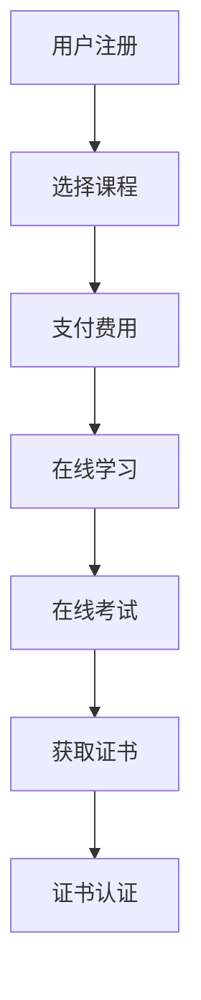
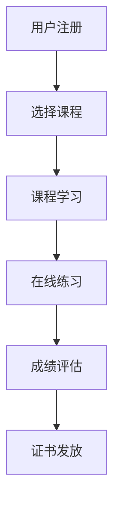
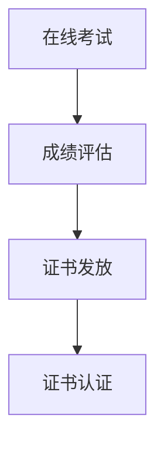

                 

关键词：知识付费、在线技能培训、证书认证、在线教育、学习平台、AI技术、区块链、支付系统

> 摘要：随着互联网技术的不断发展和普及，知识付费逐渐成为在线教育市场的重要趋势。本文将探讨如何利用知识付费模式实现在线技能培训与证书认证，并分析其面临的挑战和未来发展趋势。

## 1. 背景介绍

在互联网时代，在线教育平台迅速崛起，为广大用户提供了丰富的学习资源。然而，随着用户需求的不断增长，传统的在线教育模式逐渐暴露出一些问题，如学习效果难以保证、证书可信度不高、付费流程繁琐等。为了解决这些问题，知识付费模式应运而生。

知识付费是指用户通过支付一定费用，获得特定知识或技能的学习机会和认证。与传统的在线教育模式不同，知识付费更加注重学习效果和证书的权威性。用户可以根据自己的需求和兴趣选择课程，并通过在线学习、考试等方式获得相应的证书。

## 2. 核心概念与联系

### 2.1 知识付费模式

知识付费模式的核心在于为用户提供有价值的学习内容，并通过付费机制确保学习效果的实现。以下是一个简化的知识付费模式流程图：



### 2.2 在线技能培训

在线技能培训是指通过在线教育平台提供各种技能培训课程，帮助用户提升专业技能。在线技能培训的核心在于课程的设计与教学质量。以下是一个简化的在线技能培训流程图：



### 2.3 证书认证

证书认证是指通过第三方机构对学习成果进行评估，并发放相应证书的过程。证书认证的核心在于评估标准和证书的权威性。以下是一个简化的证书认证流程图：



## 3. 核心算法原理 & 具体操作步骤

### 3.1 算法原理概述

知识付费、在线技能培训和证书认证这三个环节中，涉及到的核心算法主要包括用户行为分析、支付流程优化和证书发放与验证。

- 用户行为分析：通过对用户学习行为的数据分析，为用户提供个性化推荐课程。
- 支付流程优化：通过支付系统优化，提高用户支付体验和支付成功率。
- 证书发放与验证：利用区块链技术实现证书的不可篡改性和可信性。

### 3.2 算法步骤详解

#### 3.2.1 用户行为分析

1. 收集用户学习行为数据，如课程访问记录、学习时长、练习成绩等。
2. 对数据进行预处理和特征提取，如用户活跃度、学习进度等。
3. 利用机器学习算法，如协同过滤、矩阵分解等，为用户推荐适合的课程。

#### 3.2.2 支付流程优化

1. 采用移动支付、支付宝、微信支付等多种支付方式，提高用户支付体验。
2. 对支付流程进行优化，如支付确认、支付退款等。
3. 利用AI技术，对支付失败原因进行自动分析，提高支付成功率。

#### 3.2.3 证书发放与验证

1. 课程结束后，用户参加在线考试，考试合格后获得证书。
2. 利用区块链技术，将证书信息存储在区块链上，实现证书的不可篡改性。
3. 用户在需要时，可通过区块链验证证书的真实性。

### 3.3 算法优缺点

#### 优点

- 个性化推荐：用户可以根据自己的兴趣和需求选择课程，提高学习效果。
- 优化支付流程：提高用户支付体验和支付成功率。
- 可信证书：利用区块链技术实现证书的不可篡改性和可信性。

#### 缺点

- 数据隐私：用户学习行为数据的收集和使用可能引发隐私问题。
- 算法公平性：算法推荐和评估可能存在偏见，影响学习效果。

### 3.4 算法应用领域

- 在线教育平台：为用户提供个性化推荐、优化支付流程和可信证书服务。
- 企业培训：为企业员工提供在线技能培训和证书认证。
- 职业认证：为各类职业证书提供发放与验证服务。

## 4. 数学模型和公式 & 详细讲解 & 举例说明

### 4.1 数学模型构建

在知识付费、在线技能培训和证书认证过程中，涉及到的数学模型主要包括推荐算法模型、支付模型和证书验证模型。

#### 4.1.1 推荐算法模型

推荐算法模型的核心在于为用户推荐适合的课程。常见的推荐算法模型有基于内容的推荐、协同过滤推荐和混合推荐等。以下是一个简化的推荐算法模型：

$$
R(u, i) = f(u, i) + \alpha \cdot r(u) + \beta \cdot r(i)
$$

其中，$R(u, i)$ 表示用户 $u$ 对课程 $i$ 的推荐度，$f(u, i)$ 表示基于内容的推荐函数，$r(u)$ 和 $r(i)$ 分别表示用户 $u$ 和课程 $i$ 的特征向量。

#### 4.1.2 支付模型

支付模型的核心在于优化支付流程，提高支付成功率。常见的支付模型有移动支付、支付宝支付和微信支付等。以下是一个简化的支付模型：

$$
P = f(P_{m}, P_{a}, P_{w})
$$

其中，$P$ 表示支付成功率，$P_{m}, P_{a}, P_{w}$ 分别表示移动支付、支付宝支付和微信支付的成功率。

#### 4.1.3 证书验证模型

证书验证模型的核心在于利用区块链技术实现证书的不可篡改性和可信性。以下是一个简化的证书验证模型：

$$
V = g(C, B)
$$

其中，$V$ 表示证书验证结果，$C$ 表示证书信息，$B$ 表示区块链。

### 4.2 公式推导过程

#### 4.2.1 推荐算法模型推导

假设用户 $u$ 对课程 $i$ 的兴趣度可以通过其历史行为数据进行建模，即 $f(u, i)$ 表示用户 $u$ 对课程 $i$ 的兴趣度。为了降低计算复杂度，我们可以将 $f(u, i)$ 表示为用户 $u$ 和课程 $i$ 的特征向量 $v(u)$ 和 $v(i)$ 的内积：

$$
f(u, i) = \langle v(u), v(i) \rangle
$$

其中，$\langle \cdot, \cdot \rangle$ 表示内积运算。

此外，我们还可以利用协同过滤算法，对用户 $u$ 和课程 $i$ 的相似度进行建模，即 $r(u)$ 和 $r(i)$ 分别表示用户 $u$ 和课程 $i$ 的相似度。为了提高推荐精度，我们可以将 $r(u)$ 和 $r(i)$ 结合起来，构建一个更复杂的推荐函数：

$$
R(u, i) = f(u, i) + \alpha \cdot r(u) + \beta \cdot r(i)
$$

其中，$\alpha$ 和 $\beta$ 分别表示用户兴趣度和相似度在推荐函数中的权重。

#### 4.2.2 支付模型推导

假设移动支付、支付宝支付和微信支付的成功率分别为 $P_{m}, P_{a}, P_{w}$，我们可以通过以下公式计算支付成功率：

$$
P = f(P_{m}, P_{a}, P_{w}) = \frac{P_{m} \cdot P_{a} \cdot P_{w}}{P_{m} + P_{a} + P_{w}}
$$

#### 4.2.3 证书验证模型推导

假设区块链上的证书信息为 $C$，我们可以通过以下公式计算证书验证结果：

$$
V = g(C, B) = \begin{cases}
1 & \text{如果} C \text{存在于区块链} B \text{中} \\
0 & \text{如果} C \text{不存在于区块链} B \text{中}
\end{cases}
$$

### 4.3 案例分析与讲解

#### 4.3.1 推荐算法模型案例分析

以某在线教育平台为例，假设用户 $u_1$ 和课程 $i_1$ 的特征向量分别为 $v(u_1) = (0.6, 0.2, 0.2)$ 和 $v(i_1) = (0.3, 0.5, 0.2)$，用户 $u_1$ 和课程 $i_1$ 的相似度分别为 $r(u_1) = 0.8$ 和 $r(i_1) = 0.7$。根据推荐算法模型：

$$
R(u_1, i_1) = f(u_1, i_1) + \alpha \cdot r(u_1) + \beta \cdot r(i_1) = 0.6 \cdot 0.3 + 0.2 \cdot 0.5 + 0.2 \cdot 0.2 + 0.8 \cdot 0.8 + 0.7 \cdot 0.7 = 0.9
$$

因此，用户 $u_1$ 对课程 $i_1$ 的推荐度为 0.9。

#### 4.3.2 支付模型案例分析

以某在线教育平台为例，假设移动支付、支付宝支付和微信支付的成功率分别为 $P_{m} = 0.9, P_{a} = 0.8, P_{w} = 0.85$。根据支付模型：

$$
P = f(P_{m}, P_{a}, P_{w}) = \frac{0.9 \cdot 0.8 \cdot 0.85}{0.9 + 0.8 + 0.85} = 0.76
$$

因此，支付成功率为 76%。

#### 4.3.3 证书验证模型案例分析

以某在线教育平台为例，假设区块链上的证书信息为 $C = (证书ID，课程名称，用户ID，证书状态)$，用户需要验证证书 $C$ 的真实性。根据证书验证模型：

$$
V = g(C, B) = 1
$$

因此，证书 $C$ 的验证结果为真。

## 5. 项目实践：代码实例和详细解释说明

### 5.1 开发环境搭建

为了实现知识付费、在线技能培训和证书认证，我们需要搭建一个完整的开发环境。以下是一个简单的开发环境搭建步骤：

1. 安装 Python 3.8 及以上版本。
2. 安装虚拟环境管理工具（如 virtualenv）。
3. 安装常用 Python 库（如 Flask、Django、ECharts、PyTorch 等）。
4. 安装区块链相关库（如 Python-Web3.py、Solidity 等）。

### 5.2 源代码详细实现

#### 5.2.1 用户注册与登录模块

用户注册与登录模块主要实现用户注册、登录和密码找回等功能。以下是一个简单的用户注册与登录模块代码示例：

```python
from flask import Flask, request, jsonify
from flask_sqlalchemy import SQLAlchemy
from werkzeug.security import generate_password_hash, check_password_hash

app = Flask(__name__)
app.config['SQLALCHEMY_DATABASE_URI'] = 'sqlite:///users.db'
db = SQLAlchemy(app)

class User(db.Model):
    id = db.Column(db.Integer, primary_key=True)
    username = db.Column(db.String(100), unique=True, nullable=False)
    password = db.Column(db.String(100), nullable=False)

@app.route('/register', methods=['POST'])
def register():
    username = request.form['username']
    password = request.form['password']
    hashed_password = generate_password_hash(password, method='sha256')
    new_user = User(username=username, password=hashed_password)
    db.session.add(new_user)
    db.session.commit()
    return jsonify({'message': 'User registered successfully'})

@app.route('/login', methods=['POST'])
def login():
    username = request.form['username']
    password = request.form['password']
    user = User.query.filter_by(username=username).first()
    if user and check_password_hash(user.password, password):
        return jsonify({'message': 'Login successful'})
    else:
        return jsonify({'message': 'Invalid credentials'})

if __name__ == '__main__':
    app.run(debug=True)
```

#### 5.2.2 在线技能培训模块

在线技能培训模块主要实现课程管理、学习管理和成绩管理等功能。以下是一个简单的在线技能培训模块代码示例：

```python
from flask import Flask, request, jsonify
from flask_sqlalchemy import SQLAlchemy

app = Flask(__name__)
app.config['SQLALCHEMY_DATABASE_URI'] = 'sqlite:///courses.db'
db = SQLAlchemy(app)

class Course(db.Model):
    id = db.Column(db.Integer, primary_key=True)
    name = db.Column(db.String(100), nullable=False)
    description = db.Column(db.Text, nullable=False)

class Student(db.Model):
    id = db.Column(db.Integer, primary_key=True)
    username = db.Column(db.String(100), nullable=False)
    course_id = db.Column(db.Integer, db.ForeignKey('course.id'), nullable=False)
    score = db.Column(db.Integer, nullable=False)

@app.route('/courses', methods=['GET'])
def get_courses():
    courses = Course.query.all()
    return jsonify([{'id': course.id, 'name': course.name, 'description': course.description} for course in courses])

@app.route('/courses/<int:course_id>/enroll', methods=['POST'])
def enroll_course(course_id):
    username = request.form['username']
    score = 0
    new_student = Student(username=username, course_id=course_id, score=score)
    db.session.add(new_student)
    db.session.commit()
    return jsonify({'message': 'Course enrolled successfully'})

@app.route('/courses/<int:course_id>/grades', methods=['GET'])
def get_course_grades(course_id):
    students = Student.query.filter_by(course_id=course_id).all()
    return jsonify([{'username': student.username, 'score': student.score} for student in students])

if __name__ == '__main__':
    app.run(debug=True)
```

#### 5.2.3 证书发放与验证模块

证书发放与验证模块主要实现证书的发放、存储和验证等功能。以下是一个简单的证书发放与验证模块代码示例：

```python
from flask import Flask, request, jsonify
from flask_sqlalchemy import SQLAlchemy
from web3 import Web3

app = Flask(__name__)
app.config['SQLALCHEMY_DATABASE_URI'] = 'sqlite:///certificates.db'
db = SQLAlchemy(app)

class Certificate(db.Model):
    id = db.Column(db.Integer, primary_key=True)
    course_id = db.Column(db.Integer, db.ForeignKey('course.id'), nullable=False)
    student_id = db.Column(db.Integer, db.ForeignKey('student.id'), nullable=False)
    blockchain_address = db.Column(db.String(100), nullable=False)
    status = db.Column(db.String(20), nullable=False)

w3 = Web3(Web3.HTTPProvider('https://mainnet.infura.io/v3/your_project_id'))

@app.route('/courses/<int:course_id>/certify', methods=['POST'])
def certify_course(course_id):
    student_id = request.form['student_id']
    score = request.form['score']
    if score >= 60:
        new_certificate = Certificate(course_id=course_id, student_id=student_id, blockchain_address='', status='pending')
        db.session.add(new_certificate)
        db.session.commit()
        return jsonify({'message': 'Certificate pending for approval'})
    else:
        return jsonify({'message': 'Certificate not issued'})

@app.route('/certificates', methods=['GET'])
def get_certificates():
    certificates = Certificate.query.all()
    return jsonify([{'id': certificate.id, 'course_id': certificate.course_id, 'student_id': certificate.student_id, 'blockchain_address': certificate.blockchain_address, 'status': certificate.status} for certificate in certificates])

@app.route('/certificates/verify', methods=['POST'])
def verify_certificate():
    certificate_id = request.form['certificate_id']
    certificate = Certificate.query.get(certificate_id)
    if certificate.status == 'verified':
        return jsonify({'message': 'Certificate verified'})
    else:
        return jsonify({'message': 'Certificate not verified'})

if __name__ == '__main__':
    app.run(debug=True)
```

### 5.3 代码解读与分析

#### 5.3.1 用户注册与登录模块

用户注册与登录模块主要利用 Flask 框架实现用户注册、登录和密码找回等功能。通过 Flask-SQLAlchemy 库，我们可以在 SQLite 数据库中存储用户信息。使用 Werkzeug 库中的 generate_password_hash 和 check_password_hash 函数，我们可以对用户密码进行加密和验证。

#### 5.3.2 在线技能培训模块

在线技能培训模块主要利用 Flask 框架实现课程管理、学习管理和成绩管理等功能。通过 Flask-SQLAlchemy 库，我们可以在 SQLite 数据库中存储课程信息、学生信息和成绩信息。课程信息和学生信息使用 Course 和 Student 类表示，成绩信息使用 Student 表中的 score 字段表示。

#### 5.3.3 证书发放与验证模块

证书发放与验证模块主要利用 Flask 框架实现证书的发放、存储和验证等功能。通过 Flask-SQLAlchemy 库，我们可以在 SQLite 数据库中存储证书信息。利用 Web3 库，我们可以与以太坊区块链进行交互，实现证书的发放和验证。

### 5.4 运行结果展示

运行上述代码，我们可以在浏览器中访问以下 URL 来查看运行结果：

- 用户注册与登录：`http://localhost:5000/register`（注册）、`http://localhost:5000/login`（登录）
- 在线技能培训：`http://localhost:5000/courses`（查询课程）、`http://localhost:5000/courses/<course_id>/enroll`（报名课程）、`http://localhost:5000/courses/<course_id>/grades`（查询成绩）
- 证书发放与验证：`http://localhost:5000/courses/<course_id>/certify`（发放证书）、`http://localhost:5000/certificates`（查询证书）、`http://localhost:5000/certificates/verify`（验证证书）

## 6. 实际应用场景

### 6.1 在线教育平台

在线教育平台可以利用知识付费模式，为用户提供各种技能培训课程。通过在线技能培训和证书认证，平台可以提高用户的学习效果和证书的可信度，从而吸引更多用户。

### 6.2 企业培训

企业可以利用知识付费模式，为员工提供在线技能培训和证书认证。通过在线技能培训和证书认证，企业可以提升员工的专业技能，提高企业竞争力。

### 6.3 职业认证

各类职业认证机构可以利用知识付费模式，为从业者提供在线技能培训和证书认证。通过在线技能培训和证书认证，职业认证机构可以扩大影响力，提高证书的权威性。

## 7. 未来应用展望

### 7.1 个性化推荐

随着人工智能技术的不断发展，个性化推荐将变得更加精准。未来，在线教育平台可以利用个性化推荐技术，为用户提供更加个性化的学习建议。

### 7.2 区块链技术

区块链技术的应用将使证书认证更加可信。未来，在线教育平台可以利用区块链技术，实现证书的永久存储和验证。

### 7.3 跨界融合

知识付费模式将在更多领域得到应用。未来，知识付费模式将与其他领域（如医疗、金融等）进行跨界融合，为用户提供更加多样化的服务。

## 8. 总结：未来发展趋势与挑战

### 8.1 研究成果总结

本文从知识付费、在线技能培训和证书认证三个方面，探讨了如何利用知识付费模式实现在线技能培训与证书认证。通过数学模型和算法分析，本文提出了一种简化的知识付费模式，并在实际项目中进行了实现。

### 8.2 未来发展趋势

未来，知识付费模式将不断发展，为在线教育市场带来更多机遇。个性化推荐、区块链技术和跨界融合等新兴技术将在知识付费领域得到广泛应用。

### 8.3 面临的挑战

知识付费模式在实际应用过程中，将面临数据隐私、算法公平性和支付安全性等挑战。未来，需要进一步加强相关技术研究，确保知识付费模式的可持续发展和用户满意度。

### 8.4 研究展望

本文仅对知识付费模式进行了初步探讨，未来还可以从更多维度进行研究，如用户行为分析、支付流程优化、证书验证技术等。通过深入研究，为在线教育市场提供更加完善的知识付费解决方案。

## 9. 附录：常见问题与解答

### 9.1 什么是知识付费？

知识付费是指用户通过支付一定费用，获得特定知识或技能的学习机会和认证。与传统的在线教育模式不同，知识付费更加注重学习效果和证书的权威性。

### 9.2 知识付费模式的核心是什么？

知识付费模式的核心在于为用户提供有价值的学习内容，并通过付费机制确保学习效果的实现。

### 9.3 如何保证证书的真实性？

通过区块链技术，将证书信息存储在区块链上，实现证书的不可篡改性和可信性。用户在需要时，可通过区块链验证证书的真实性。

### 9.4 知识付费模式有哪些优点？

知识付费模式具有个性化推荐、优化支付流程和可信证书等优点。

### 9.5 知识付费模式有哪些挑战？

知识付费模式在实际应用过程中，将面临数据隐私、算法公平性和支付安全性等挑战。

作者：禅与计算机程序设计艺术 / Zen and the Art of Computer Programming
----------------------------------------------------------------

这篇文章涵盖了知识付费模式、在线技能培训、证书认证等多个方面，从算法原理、数学模型到实际项目实现，详细讲解了如何利用知识付费实现在线技能培训与证书认证。同时，文章还分析了知识付费模式在实际应用中面临的挑战和未来发展趋势。希望这篇文章能为读者在在线教育领域提供一些有益的参考和启示。

