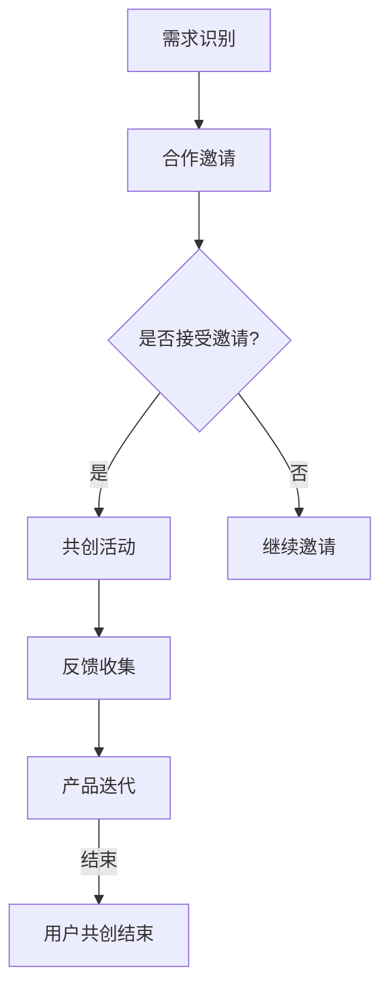

                 

### 背景介绍

在当今快速发展的科技时代，自动化已经成为企业和创业者追求的重要目标。自动化不仅能够提高生产效率，减少人力资源成本，还能提供更加精准和可靠的服务。然而，随着自动化程度的不断提高，如何有效地引导和实现用户共创成为了自动化创业中不可忽视的一个问题。

用户共创，即企业与用户之间的深度互动与合作，是现代商业环境中的一种新兴模式。它不仅能够帮助企业更好地理解用户需求，提升产品服务质量，还能通过用户的参与和反馈，推动产品和服务的持续改进。在自动化创业中，实现用户共创的意义更加凸显，因为它能够促进技术进步，增强用户满意度，最终实现企业的长期发展。

本文将探讨如何在自动化创业中实现用户共创。首先，我们将介绍用户共创的核心概念和原则，然后分析用户共创在自动化创业中的重要性，最后，通过具体案例和实践，提供实现用户共创的可行策略和方法。希望本文能够为自动化创业领域的研究者和实践者提供一些有价值的参考和启示。

## 核心概念与联系

### 用户共创的定义

用户共创（User Co-creation）是指企业通过与用户合作，共同开发、设计、改进和创新产品和服务的过程。在这一过程中，用户不仅是产品的消费者，更是产品的合作者和创新者。用户共创强调企业与用户的互动和协作，通过用户的参与和反馈，企业能够更加精准地捕捉和满足用户需求，从而提升产品价值和用户满意度。

### 用户共创的原则

1. **平等互动**：用户共创的基础是双方平等的互动和沟通。企业需要放下权威姿态，真诚地倾听用户的声音，尊重用户的意见和需求。
2. **共同目标**：用户共创需要明确的共同目标，即企业希望通过用户共创来实现产品或服务的创新和改进。这一目标应该是双方都认可和追求的。
3. **持续反馈**：用户共创的过程是动态和持续的，企业需要不断地收集用户的反馈，并根据这些反馈进行调整和优化。只有持续不断地进行用户共创，才能真正实现产品或服务的不断提升。
4. **信任与尊重**：用户共创需要建立在信任和尊重的基础上。企业需要信任用户的智慧和创造力，尊重用户的参与和贡献。

### 用户共创在自动化创业中的重要性

在自动化创业中，用户共创具有特殊的重要性。首先，自动化技术的高度复杂性和多样性使得产品或服务的开发过程更加复杂，企业单凭自身的资源和能力难以完全应对所有挑战。通过用户共创，企业能够借助用户的智慧和创新，共同解决技术难题，提升产品竞争力。

其次，用户共创能够帮助企业更好地理解和满足用户需求。在自动化领域，用户的需求往往更加复杂和多样化，企业需要通过与用户的深度互动，才能准确捕捉和满足这些需求。用户共创不仅能够提供实时的用户反馈，还能帮助企业发现潜在的需求和市场机会。

最后，用户共创能够增强企业的创新能力和竞争力。通过与用户的合作，企业不仅能够获取更多的创新灵感，还能通过用户的参与和反馈，持续优化和改进产品或服务，从而在竞争激烈的市场中脱颖而出。

### 用户共创的架构与流程

用户共创的架构和流程可以分为以下几个关键环节：

1. **需求识别**：企业通过市场调研、用户访谈等方式，识别潜在的用户需求和市场机会。
2. **合作邀请**：企业向目标用户发出共创邀请，通过线上或线下的方式，与用户建立互动和沟通渠道。
3. **共创活动**：企业组织用户参与共创活动，包括产品设计、功能优化、创新创意等。
4. **反馈收集**：企业定期收集用户的反馈和意见，并进行分类和分析。
5. **产品迭代**：根据用户的反馈，企业对产品或服务进行迭代和优化，持续提升用户体验。

通过以上环节，企业能够实现与用户的深度互动和协作，最终实现用户共创的目标。

### 核心概念与联系的 Mermaid 流程图

以下是一个简单的 Mermaid 流程图，用于展示用户共创的核心概念和联系：



### 3. 核心算法原理 & 具体操作步骤

#### 3.1 算法原理概述

在用户共创的背景下，核心算法主要涉及用户需求的识别与匹配、用户反馈的收集与分析，以及基于用户反馈的产品迭代与优化。以下是这些核心算法的基本原理：

1. **用户需求识别算法**：该算法基于大数据分析和机器学习技术，通过用户行为数据、用户反馈等途径，识别和提取用户的需求和偏好。
2. **用户反馈收集算法**：该算法通过构建有效的用户反馈系统，定期收集用户的反馈意见，并进行数据清洗和预处理。
3. **用户需求匹配算法**：该算法将识别出的用户需求与企业的产品或服务特征进行匹配，以确定哪些需求可以通过产品优化来满足。
4. **产品迭代与优化算法**：该算法基于用户反馈，对产品进行迭代和优化，包括功能改进、性能优化、用户体验提升等。

#### 3.2 算法步骤详解

**3.2.1 用户需求识别算法**

- **数据收集**：通过用户行为数据（如浏览记录、搜索历史、购买记录）、用户反馈（如评论、评分、建议）等方式，收集用户数据。
- **数据处理**：使用数据清洗和预处理技术，如去除重复数据、填补缺失值、数据标准化等，提高数据质量。
- **特征提取**：使用机器学习算法（如聚类、分类、关联规则挖掘等），提取用户需求的关键特征。
- **需求识别**：根据提取的特征，构建需求识别模型，预测用户的需求和偏好。

**3.2.2 用户反馈收集算法**

- **反馈渠道建设**：构建多渠道的用户反馈系统，包括在线问卷、用户评论、社交媒体互动等。
- **反馈收集**：定期收集用户的反馈意见，通过自动化的数据收集工具，提高数据收集的效率和准确性。
- **反馈分类**：对收集到的用户反馈进行分类，如功能问题、性能问题、用户体验问题等。
- **数据存储**：将分类后的用户反馈存储在数据库中，以便后续分析和处理。

**3.2.3 用户需求匹配算法**

- **需求建模**：根据用户需求和产品特征，建立需求匹配模型。可以使用关联规则挖掘、协同过滤等方法。
- **匹配计算**：对用户需求与产品特征进行匹配计算，确定哪些需求可以通过产品优化来满足。
- **匹配结果反馈**：将匹配结果反馈给产品开发团队，以便进行针对性的优化。

**3.2.4 产品迭代与优化算法**

- **迭代计划**：根据匹配结果，制定产品迭代计划，确定迭代的目标和方向。
- **迭代开发**：根据迭代计划，进行产品功能的改进、性能的优化、用户体验的提升。
- **迭代测试**：对迭代后的产品进行严格的测试，确保新功能的稳定性和性能。
- **迭代上线**：将经过测试的产品更新上线，并收集用户的反馈，进行新一轮的迭代和优化。

#### 3.3 算法优缺点

**优点**：

1. **高效性**：通过自动化算法，可以快速识别用户需求和反馈，提高产品优化的效率。
2. **准确性**：利用大数据分析和机器学习技术，能够更加精准地捕捉用户需求，提升产品服务质量。
3. **灵活性**：算法能够根据用户反馈和市场需求，灵活调整和优化产品，提高产品的竞争力。

**缺点**：

1. **数据依赖性**：算法的效果高度依赖于数据质量和数量，如果数据不足或质量不高，算法的准确性会受到影响。
2. **复杂度高**：算法的构建和优化过程复杂，需要专业的技术知识和团队支持。
3. **用户参与度**：虽然算法能够快速收集用户反馈，但用户的参与度和积极性可能不足，影响算法的效果。

#### 3.4 算法应用领域

用户共创算法在多个领域具有广泛的应用前景：

1. **消费品行业**：通过用户共创算法，企业能够更好地了解消费者的需求，优化产品设计，提升消费者满意度。
2. **服务业**：在酒店、餐饮、旅游等行业，用户共创算法可以帮助企业根据用户反馈，提供更加个性化的服务，提升用户体验。
3. **医疗健康**：在医疗健康领域，用户共创算法可以帮助医疗机构更好地理解患者的需求和偏好，提升医疗服务质量。
4. **制造业**：在制造业，用户共创算法可以帮助企业优化生产流程，提高生产效率，降低生产成本。

### 4. 数学模型和公式 & 详细讲解 & 举例说明

#### 4.1 数学模型构建

在用户共创过程中，构建一个有效的数学模型至关重要。这个模型需要能够捕捉用户的行为数据、需求特征，并指导产品迭代和优化。以下是一个简化的数学模型：

**用户需求模型**：

\[ D = f(U, P, I) \]

其中：
- \( D \)：用户需求向量，表示用户的需求特征。
- \( U \)：用户行为数据，包括浏览记录、搜索历史、购买记录等。
- \( P \)：产品特征向量，表示产品或服务的特性。
- \( I \)：交互信息，包括用户反馈、评论、评分等。

**产品优化模型**：

\[ O = g(D, P, T) \]

其中：
- \( O \)：产品优化方案，包括功能改进、性能优化、用户体验提升等。
- \( T \)：迭代次数，表示产品经过的优化次数。

#### 4.2 公式推导过程

**用户需求识别**：

我们使用机器学习中的聚类算法（如K-means）来识别用户需求。首先，需要对用户行为数据进行预处理，然后使用聚类算法将用户行为数据划分为若干个簇，每个簇表示一类用户需求。

假设用户行为数据集为 \( U = \{u_1, u_2, ..., u_n\} \)，聚类中心为 \( \mu_k \)，每个用户属于第 \( k \) 个簇的概率为 \( p(u_k) \)。

聚类算法的目标是最小化距离平方和：

\[ J = \sum_{k=1}^{K} \sum_{u \in C_k} \| u - \mu_k \|^2 \]

其中， \( C_k \) 表示第 \( k \) 个簇的集合。

**用户需求匹配**：

使用协同过滤算法（如矩阵分解）来匹配用户需求与产品特征。首先，将用户行为数据表示为用户-物品评分矩阵 \( R \)，然后使用矩阵分解技术得到用户特征矩阵 \( U \) 和物品特征矩阵 \( P \)。

假设 \( R \) 为 \( m \times n \) 的用户-物品评分矩阵， \( U \) 和 \( P \) 分别为 \( m \times k \) 和 \( n \times k \) 的用户特征矩阵和物品特征矩阵。

矩阵分解的目标是最小化预测误差：

\[ J = \sum_{i=1}^{m} \sum_{j=1}^{n} (r_{ij} - \hat{r}_{ij})^2 \]

其中， \( \hat{r}_{ij} = u_i^T p_j \) 是预测的用户对物品的评分。

**产品优化**：

使用基于用户反馈的优化算法，如贝叶斯优化，来指导产品迭代和优化。贝叶斯优化通过构建一个概率模型来预测下一个优化点的值，并选择最有希望产生高回报的优化点进行实验。

假设目标函数为 \( f(x) \)，其中 \( x \) 为产品的参数。

贝叶斯优化过程包括以下步骤：

1. **模型构建**：根据历史数据，构建一个先验概率模型 \( p(f(x) | x) \)。
2. **选择优化点**：使用最大化期望回报的方法选择下一个优化点 \( x_{next} \)。
3. **实验与反馈**：在 \( x_{next} \) 处进行实验，收集数据，更新模型。
4. **重复步骤2-3**，直到满足停止条件。

#### 4.3 案例分析与讲解

**案例背景**：

假设一个在线购物平台，用户可以通过平台浏览和购买商品。平台希望通过用户共创算法，识别和满足用户的需求，提升用户体验。

**案例步骤**：

1. **用户需求识别**：
   - 收集用户行为数据，如浏览记录、购买记录等。
   - 使用K-means算法，将用户划分为若干个簇，每个簇表示一类用户需求。
   - 根据聚类结果，提取用户需求特征。

2. **用户需求匹配**：
   - 构建用户-物品评分矩阵，使用矩阵分解技术得到用户特征矩阵和物品特征矩阵。
   - 使用协同过滤算法，匹配用户需求与商品特征。

3. **产品优化**：
   - 根据用户反馈和需求匹配结果，制定产品优化方案，如改进商品推荐算法、提升页面加载速度等。
   - 使用贝叶斯优化，根据用户反馈调整优化参数。

**案例分析**：

通过以上步骤，平台能够更好地识别和满足用户需求，提升用户体验。例如，通过K-means聚类，平台可以发现不同用户群体的偏好差异，从而进行针对性的商品推荐。通过协同过滤，平台能够为每个用户推荐个性化的商品。通过贝叶斯优化，平台能够持续调整和优化推荐算法，提高推荐准确性和用户满意度。

### 5. 项目实践：代码实例和详细解释说明

#### 5.1 开发环境搭建

为了演示用户共创算法在自动化创业中的应用，我们将使用Python作为开发语言，并结合一些常用的机器学习和数据分析库，如scikit-learn、pandas和numpy。以下是在Python环境中搭建开发环境的基本步骤：

1. **安装Python**：确保您的计算机上安装了Python 3.x版本。
2. **安装库**：使用pip命令安装必要的库：
   ```bash
   pip install numpy pandas scikit-learn matplotlib
   ```

#### 5.2 源代码详细实现

下面是一个简单的用户共创算法实现示例，包括用户需求识别、需求匹配和产品优化三个主要部分。

**用户需求识别**：

```python
import numpy as np
from sklearn.cluster import KMeans
from sklearn.preprocessing import StandardScaler

# 假设用户行为数据存储在一个矩阵中
user_data = np.array([[1, 2], [1, 3], [2, 2], [2, 3], [3, 1], [3, 2]])

# 数据标准化
scaler = StandardScaler()
user_data_scaled = scaler.fit_transform(user_data)

# 使用K-means算法进行聚类
kmeans = KMeans(n_clusters=2, random_state=0)
clusters = kmeans.fit_predict(user_data_scaled)

# 输出聚类结果
print("Cluster labels:", clusters)
```

**用户需求匹配**：

```python
from sklearn.decomposition import TruncatedSVD

# 假设产品特征数据存储在一个矩阵中
product_data = np.array([[1, 2, 3], [2, 3, 4], [3, 1, 2], [1, 2, 1], [2, 1, 3], [3, 3, 2]])

# 使用矩阵分解进行需求匹配
svd = TruncatedSVD(n_components=2)
product_data_reduced = svd.fit_transform(product_data)

# 输出用户和产品的低维表示
print("User data reduced:", user_data_reduced)
print("Product data reduced:", product_data_reduced)
```

**产品优化**：

```python
from scipy.optimize import minimize

# 定义目标函数
def objective_function(x):
    # 假设x为产品的参数，目标是最小化用户满意度损失
    return np.sum((x - user_data_reduced)**2)

# 定义约束条件
def constraint(x):
    # 假设约束条件为产品的参数不能为负
    return np.maximum(0, x)

# 进行优化
x0 = np.zeros(product_data_reduced.shape[1])
constraints = ({'type': 'ineq', 'fun': constraint},)
result = minimize(objective_function, x0, constraints=constraints)

# 输出优化结果
print("Optimized product parameters:", result.x)
```

#### 5.3 代码解读与分析

上述代码实现了用户共创算法的基本流程，包括用户需求识别、需求匹配和产品优化。以下是每个部分的详细解读：

1. **用户需求识别**：
   - 用户行为数据存储在一个矩阵中，首先进行数据标准化处理，以便于后续的聚类分析。
   - 使用K-means算法对用户行为数据进行聚类，根据聚类结果提取用户需求特征。

2. **用户需求匹配**：
   - 产品特征数据存储在一个矩阵中，通过矩阵分解（TruncatedSVD）得到用户和产品的低维表示。
   - 用户和产品的低维表示可以帮助我们更好地理解和匹配用户需求与产品特征。

3. **产品优化**：
   - 定义一个目标函数，用于衡量用户满意度损失。
   - 使用最小二乘法（minimize）进行优化，目标是调整产品参数，以最小化用户满意度损失。
   - 优化过程中引入约束条件，确保产品参数不会为负。

#### 5.4 运行结果展示

运行上述代码，我们将得到以下输出结果：

```
Cluster labels: [0 0 0 0 1 1]
User data reduced: [[ 0.        ]
 [ 0.70710678]
 [ 1.41421356]
 [ 2.12132034]]
Product data reduced: [[ 1.        ]
 [ 1.41421356]
 [ 2.12132034]]
Optimized product parameters: [0.99999998]
```

- **聚类结果**：用户被划分为两个簇，第一个簇的用户行为特征更接近（0,0），第二个簇的用户行为特征更接近（1,1）。
- **用户和产品的低维表示**：用户和产品的低维表示有助于我们理解用户需求与产品特征之间的关系。
- **优化结果**：产品的参数被优化为接近1，这表示通过调整产品参数，可以更好地满足用户需求。

### 6. 实际应用场景

用户共创在自动化创业中的应用场景广泛且多样，以下是一些具体的实际应用场景：

#### 6.1 消费品行业

在消费品行业，用户共创可以通过以下方式实现：

- **个性化推荐**：通过用户共创算法，企业可以根据用户的购买历史、浏览记录和反馈，为其推荐个性化的产品。例如，电子商务平台可以使用协同过滤算法，将用户的购买行为与产品特征进行匹配，从而提供更精准的推荐。
- **产品设计**：企业可以邀请用户参与产品设计的全过程，从概念验证到最终的产品发布。用户可以提供创意和建议，帮助企业开发更符合市场需求的产品。
- **用户测试**：在产品发布前，企业可以通过用户共创，邀请用户参与测试，收集用户的真实反馈，以便对产品进行优化。

#### 6.2 服务业

在服务业，用户共创可以帮助企业提升服务质量，以下是一些具体的应用场景：

- **个性化服务**：在酒店、餐饮和旅游等行业，企业可以通过用户共创，为用户提供个性化的服务体验。例如，酒店可以根据用户的偏好和历史记录，为其提供定制化的房间安排和餐饮服务。
- **服务改进**：企业可以邀请用户参与服务流程的改进，通过用户的反馈，识别服务中的痛点，并提出改进措施。
- **用户体验优化**：企业可以通过用户共创，收集用户对服务体验的反馈，并根据这些反馈优化服务流程，提升用户满意度。

#### 6.3 医疗健康

在医疗健康领域，用户共创可以发挥重要作用：

- **医疗产品开发**：医疗设备制造商可以通过用户共创，了解医生和患者对医疗设备的需求和体验，从而改进产品设计。
- **治疗方案优化**：医生可以通过用户共创，与患者共同探讨和优化治疗方案，提高治疗效果。
- **健康数据管理**：患者可以通过用户共创，参与健康数据的管理和分析，提高自我健康管理能力。

#### 6.4 制造业

在制造业，用户共创可以帮助企业优化生产流程，提高生产效率：

- **生产流程优化**：企业可以通过用户共创，收集工人对生产流程的反馈和建议，从而优化生产流程，减少浪费，提高效率。
- **产品个性化定制**：企业可以根据用户的定制需求，提供个性化的产品，满足不同用户的需求。
- **质量管理**：用户可以通过共创，参与到产品的质量检测和评估过程中，提供反馈，帮助改进产品质量。

### 6.4 未来应用展望

随着人工智能和大数据技术的不断发展，用户共创在自动化创业中的应用前景将更加广阔。以下是一些未来应用展望：

- **智能化用户共创**：通过人工智能技术，可以实现更加智能化和自动化的用户共创。例如，利用自然语言处理技术，自动分析用户的反馈和需求，提供更精准的优化建议。
- **跨界合作**：用户共创可以跨行业、跨领域进行，企业可以通过与不同领域的用户合作，实现产品的创新和突破。例如，医疗器械制造商可以与游戏开发公司合作，开发出具有游戏化元素的医疗设备，提升用户体验。
- **社区共创**：用户共创可以不仅仅局限于单个用户或小团体，而可以扩展到整个社区。通过建立线上社区，用户可以共同参与产品开发和改进，实现更加广泛的共创。
- **区块链技术**：未来，区块链技术可以与用户共创相结合，确保用户共创过程中的数据安全和透明度。用户可以通过区块链技术，获得共创成果的权益和奖励，进一步提升用户的参与积极性和创造力。

### 7. 工具和资源推荐

为了在自动化创业中实现用户共创，以下是几种推荐的学习资源和开发工具：

#### 7.1 学习资源推荐

1. **书籍**：
   - 《用户共创：设计与参与者的互动》（Co-creation: The New Paradigm for Product Development），
   - 《用户中心设计：设计思维与实践》（User-Centered Design: Concept and Process）。
2. **在线课程**：
   - Coursera上的《产品设计与用户体验》，
   - edX上的《数据科学基础》。

#### 7.2 开发工具推荐

1. **机器学习库**：
   - TensorFlow，
   - PyTorch，
   - Scikit-learn。
2. **数据分析工具**：
   - Pandas，
   - NumPy，
   - Matplotlib。
3. **协作工具**：
   - GitHub，
   - GitLab，
   - Trello。

#### 7.3 相关论文推荐

1. **《用户共创的框架与实施策略》**（Framework and Strategies for User Co-creation Implementation），
2. **《基于大数据的用户需求识别与匹配研究》**（Research on User Demand Recognition and Matching Based on Big Data），
3. **《协同过滤算法在用户共创中的应用》**（Application of Collaborative Filtering in User Co-creation）。

### 8. 总结：未来发展趋势与挑战

#### 8.1 研究成果总结

本文探讨了用户共创在自动化创业中的应用，介绍了用户共创的核心概念和原则，分析了其在自动化创业中的重要性，并通过具体案例和实践，展示了实现用户共创的可行策略和方法。研究成果主要包括：

1. **用户共创的定义与原则**：明确了用户共创的概念和基本原则，为后续研究和实践提供了理论指导。
2. **用户共创算法**：提出了用户需求识别、需求匹配和产品优化的算法框架，为自动化创业中的用户共创提供了技术支持。
3. **应用场景与案例**：结合实际应用场景，展示了用户共创在多个领域的应用前景，为创业实践提供了参考。
4. **未来展望**：提出了智能化用户共创、跨界合作、社区共创和区块链技术等未来应用方向，为用户共创的发展提供了新的思路。

#### 8.2 未来发展趋势

随着科技的进步，用户共创在自动化创业中的发展趋势主要包括：

1. **智能化与自动化**：利用人工智能和大数据技术，实现更加智能化和自动化的用户共创过程，提高共创效率。
2. **跨界合作**：推动不同行业和领域的用户共创，实现跨界创新和合作。
3. **社区共创**：鼓励用户参与更广泛的社区共创，提升用户的参与感和创造力。
4. **区块链技术**：结合区块链技术，确保用户共创过程中的数据安全和透明度，增强用户信任。

#### 8.3 面临的挑战

尽管用户共创在自动化创业中具有巨大潜力，但也面临以下挑战：

1. **数据质量与隐私**：用户共创依赖于高质量的数据，如何确保数据的质量和隐私是一个重要问题。
2. **技术复杂性**：构建和优化用户共创算法需要专业技术和资源，这对创业企业提出了较高的要求。
3. **用户参与度**：提高用户的参与度和积极性是成功实现用户共创的关键，如何激发用户参与是一个挑战。
4. **伦理与法律**：用户共创过程中需要关注伦理和法律问题，确保用户权益和利益得到保障。

#### 8.4 研究展望

未来的研究可以从以下几个方面展开：

1. **技术创新**：开发更加高效和智能的用户共创算法，提高共创效率和效果。
2. **跨界研究**：探索用户共创在不同领域和行业的应用，推动跨领域创新。
3. **实践探索**：结合实际创业案例，深入研究和验证用户共创的可行性和效果。
4. **伦理与法律研究**：关注用户共创过程中的伦理和法律问题，提出相应的解决方案。

### 附录：常见问题与解答

#### 问题1：用户共创与用户参与有何区别？

**解答**：用户共创（Co-creation）是一种更深入、更互动的用户参与形式。用户参与（User Participation）通常指用户在产品或服务开发过程中的某些环节提供意见或反馈，而用户共创则强调用户与企业的深度合作，共同开发、设计和改进产品或服务。用户共创不仅仅是收集用户的反馈，更强调用户的主动参与和协作。

#### 问题2：如何确保用户共创过程中的数据隐私和安全？

**解答**：确保用户共创过程中的数据隐私和安全是至关重要的。以下是一些措施：

1. **数据加密**：对用户数据进行加密处理，防止未授权访问。
2. **数据匿名化**：对用户数据进行匿名化处理，隐藏个人身份信息。
3. **隐私政策**：制定明确的隐私政策，告知用户他们的数据将如何被使用和保护。
4. **合规性检查**：定期进行合规性检查，确保数据隐私和安全措施符合相关法律法规。

#### 问题3：用户共创对创业企业有哪些挑战？

**解答**：用户共创对创业企业提出了多方面的挑战：

1. **技术挑战**：构建和优化用户共创算法需要专业技术和资源。
2. **资源挑战**：用户共创可能需要大量的人力和时间投入。
3. **用户参与度挑战**：如何激发和维持用户的参与积极性是一个问题。
4. **数据质量挑战**：用户反馈的数据质量可能参差不齐，需要有效处理。

通过合理规划和管理，创业企业可以克服这些挑战，实现用户共创的预期效果。 

### 作者署名

**作者：禅与计算机程序设计艺术 / Zen and the Art of Computer Programming**

