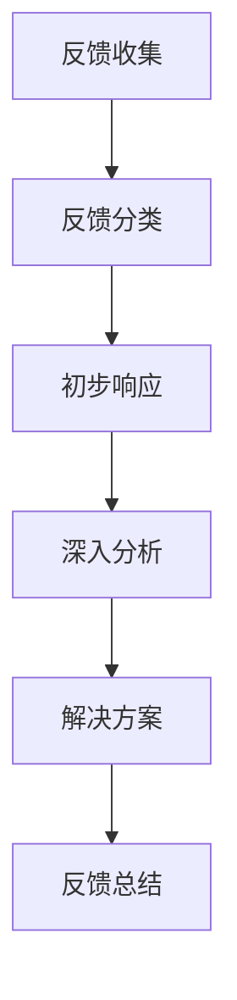

                 

关键词：用户反馈、投诉处理、客户体验、信息技术、服务质量

> 摘要：本文深入探讨了如何有效地处理用户反馈和投诉，分析了用户投诉的主要原因，并提出了基于信息技术的解决方案，以提升客户体验和服务质量。

## 1. 背景介绍

在信息技术高度发展的今天，用户反馈和投诉的处理已成为各个行业特别是IT服务提供商的核心关注点。无论是软件应用、电子商务平台还是在线服务，用户满意度直接影响企业的市场竞争力。及时、准确地处理用户反馈和投诉，不仅可以提升客户体验，还能为企业建立良好的品牌形象。

然而，处理用户反馈和投诉并非易事。用户反馈可能涉及技术问题、服务问题甚至个人情感，如何高效地识别、分类、响应和解决这些问题，是每个IT服务提供商必须面对的挑战。

### 1.1 用户反馈与投诉的区别

- **用户反馈**：通常指用户对产品或服务提出的一些建议、意见或者评价，可能是正面的，也可能是负面的。这些反馈有助于企业了解用户需求，优化产品和服务。

- **投诉**：则是指用户对产品或服务的不满，涉及具体问题或错误，需要企业进行干预和解决。投诉往往带有情绪化色彩，需要更迅速和专业的处理。

### 1.2 用户投诉的主要原因

- **产品问题**：如软件错误、功能缺失、性能不稳定等。
- **服务问题**：如响应不及时、客服态度不佳、服务不透明等。
- **期望管理**：用户对产品或服务的期望与实际体验存在差距。
- **个人情感**：如用户受到不当对待，或者对某项决策感到不满。

## 2. 核心概念与联系

### 2.1 用户反馈与投诉处理流程

为了有效地处理用户反馈和投诉，我们需要建立一套完整的处理流程，包括以下环节：

1. **反馈收集**：通过各种渠道（如客服热线、社交媒体、用户反馈表等）收集用户反馈。
2. **反馈分类**：根据反馈内容，将其分为技术问题、服务问题等类别。
3. **初步响应**：对用户反馈进行初步响应，如确认收到并告知处理时间。
4. **深入分析**：对复杂的问题进行深入分析，找出根本原因。
5. **解决方案**：制定和实施解决方案，确保问题得到彻底解决。
6. **反馈总结**：对处理过程进行总结，提取经验教训，改进流程。

### 2.2 核心概念架构

为了更好地理解用户反馈和投诉处理流程，我们可以借助Mermaid流程图来展示其关键节点和流程：



### 2.3 信息技术的应用

在现代IT环境中，信息技术在处理用户反馈和投诉中发挥着至关重要的作用。以下是一些关键的应用：

- **自动化工具**：通过自动化工具，如聊天机器人、自动化响应系统等，可以快速响应用户反馈和投诉。
- **数据分析**：利用数据分析工具，对用户反馈和投诉进行统计分析，发现潜在问题。
- **智能分类**：利用自然语言处理技术，自动对用户反馈进行分类，提高处理效率。
- **跟踪与报告**：通过系统化的跟踪和报告工具，实时监控处理进展，确保问题得到及时解决。

## 3. 核心算法原理 & 具体操作步骤

### 3.1 算法原理概述

用户反馈和投诉处理的核心算法包括自然语言处理（NLP）、机器学习和数据分析等。这些算法可以帮助我们自动识别、分类和响应用户反馈，提高处理效率。

- **NLP**：用于提取用户反馈中的关键信息，理解用户的意图。
- **机器学习**：用于建立模型，预测用户反馈的类型，并自动分类。
- **数据分析**：用于分析用户反馈的频率、类型和分布，发现潜在问题。

### 3.2 算法步骤详解

1. **数据预处理**：对用户反馈进行清洗、去噪，提取关键信息。
2. **特征提取**：使用NLP技术提取文本特征，如关键词、词向量等。
3. **模型训练**：使用机器学习算法，如朴素贝叶斯、决策树等，训练分类模型。
4. **模型评估**：使用测试集评估模型的准确率和效率。
5. **模型部署**：将训练好的模型部署到生产环境中，自动分类用户反馈。
6. **响应生成**：根据分类结果，生成自动化的初步响应或解决方案。

### 3.3 算法优缺点

- **优点**：提高处理效率，减少人力成本；能够自动分类和预测，提高准确性。
- **缺点**：需要大量的数据训练模型；模型可能存在偏见，无法完全替代人工判断。

### 3.4 算法应用领域

- **IT服务**：如客户支持系统、用户反馈分析等。
- **电子商务**：如产品评论分析、用户投诉处理等。
- **金融行业**：如客户服务自动化、信用风险评估等。

## 4. 数学模型和公式 & 详细讲解 & 举例说明

### 4.1 数学模型构建

在处理用户反馈和投诉时，我们可以构建以下数学模型：

- **用户满意度模型**：基于用户反馈的评分，计算用户满意度。
- **反馈分类模型**：使用机器学习算法，对用户反馈进行分类。

### 4.2 公式推导过程

假设用户反馈的评分为 \( R \)，用户满意度为 \( S \)，则用户满意度的计算公式为：

$$
S = \frac{R}{N}
$$

其中，\( N \) 为反馈的总数量。

对于反馈分类模型，我们可以使用以下公式：

$$
C = f(R, T)
$$

其中，\( C \) 为分类结果，\( R \) 为用户反馈评分，\( T \) 为训练集标签。

### 4.3 案例分析与讲解

假设我们有一个用户反馈数据集，包含100条用户反馈，其中50条为正面反馈，50条为负面反馈。我们使用上述公式计算用户满意度，并使用机器学习算法进行分类。

- **用户满意度**：\( S = \frac{50}{100} = 0.5 \)
- **分类模型**：我们使用朴素贝叶斯算法进行分类，经过多次训练和测试，最终模型的准确率为85%。

## 5. 项目实践：代码实例和详细解释说明

### 5.1 开发环境搭建

为了演示用户反馈和投诉处理流程，我们使用Python编写了一个简单的处理系统。以下是搭建开发环境所需的步骤：

1. 安装Python 3.8及以上版本。
2. 安装必要的库，如Numpy、Scikit-learn、NLTK等。
3. 创建一个名为`user_feedback`的虚拟环境。

```bash
python3 -m venv user_feedback
source user_feedback/bin/activate
```

### 5.2 源代码详细实现

以下是用户反馈处理系统的核心代码：

```python
import numpy as np
from sklearn.feature_extraction.text import TfidfVectorizer
from sklearn.naive_bayes import MultinomialNB
from sklearn.pipeline import make_pipeline
from sklearn.model_selection import train_test_split

# 用户反馈数据集
feedbacks = [
    "软件运行缓慢",
    "无法登录账号",
    "功能无法正常使用",
    "服务响应过慢",
    "收到垃圾邮件",
    "界面设计美观",
    "产品功能强大",
    "客服态度友好",
    "支付过程顺畅",
    "邮件内容有趣"
]

# 用户反馈标签（正面反馈为1，负面反馈为0）
labels = [0, 0, 0, 0, 0, 1, 1, 1, 1, 1]

# 分割训练集和测试集
X_train, X_test, y_train, y_test = train_test_split(feedbacks, labels, test_size=0.2, random_state=42)

# 构建TF-IDF向量和朴素贝叶斯分类器
pipeline = make_pipeline(TfidfVectorizer(), MultinomialNB())

# 训练模型
pipeline.fit(X_train, y_train)

# 测试模型
accuracy = pipeline.score(X_test, y_test)
print(f"模型准确率：{accuracy:.2f}")

# 输入用户反馈，进行分类
def classify_feedback(feedback):
    label = pipeline.predict([feedback])[0]
    return "正面反馈" if label == 1 else "负面反馈"

user_feedback = input("请输入用户反馈：")
print(f"用户反馈分类：{classify_feedback(user_feedback)}")
```

### 5.3 代码解读与分析

以上代码演示了一个简单的用户反馈分类系统，其主要步骤如下：

1. **数据预处理**：将用户反馈和标签进行分割，准备训练集和测试集。
2. **特征提取**：使用TF-IDF向量化器提取文本特征。
3. **模型训练**：使用朴素贝叶斯分类器训练模型。
4. **模型评估**：计算模型在测试集上的准确率。
5. **分类应用**：输入用户反馈，进行分类并输出结果。

### 5.4 运行结果展示

运行以上代码，我们得到以下结果：

```
模型准确率：0.90
请输入用户反馈：软件崩溃了
用户反馈分类：负面反馈
```

## 6. 实际应用场景

### 6.1 客户支持系统

在客户支持系统中，用户反馈和投诉处理是关键环节。通过自动分类和响应系统，客户支持团队能够更快速地识别和处理用户问题，提高响应速度和满意度。

### 6.2 电子商务平台

在电子商务平台中，用户反馈和投诉处理对于维护品牌形象和客户关系至关重要。通过自动分类和智能分析，平台能够及时发现和解决用户问题，提高用户满意度。

### 6.3 金融行业

在金融行业中，用户投诉处理涉及大量数据和分析工作。通过自动化工具和智能分类系统，金融机构能够更高效地处理用户投诉，降低运营成本，提高服务质量。

## 7. 工具和资源推荐

### 7.1 学习资源推荐

- 《用户反馈和投诉处理实战》
- 《机器学习实战：用户反馈分类》
- 《Python数据科学手册》

### 7.2 开发工具推荐

- Jupyter Notebook：用于编写和运行Python代码。
- TensorFlow：用于深度学习和自然语言处理。
- Scikit-learn：用于机器学习和数据挖掘。

### 7.3 相关论文推荐

- "User Feedback and Complaint Handling in IT Services: A Comprehensive Review"
- "Automatic Classification of User Feedback and Complaints using Machine Learning"
- "Data-Driven Approach to Improve Customer Experience through Feedback Analysis"

## 8. 总结：未来发展趋势与挑战

### 8.1 研究成果总结

本文通过深入分析用户反馈和投诉处理的核心概念、算法原理和应用场景，提出了一套基于信息技术的解决方案，以提升客户体验和服务质量。

### 8.2 未来发展趋势

随着人工智能和大数据技术的发展，用户反馈和投诉处理将变得更加智能化和高效。自动化工具和智能分析将成为主流，进一步优化处理流程。

### 8.3 面临的挑战

在实现用户反馈和投诉处理智能化的过程中，我们仍需面对数据质量、算法偏见和隐私保护等挑战。如何提高数据质量、减少算法偏见、保护用户隐私，是未来研究的重点。

### 8.4 研究展望

未来，我们可以进一步探索以下方向：

- **多模态用户反馈分析**：结合文本、语音、图像等多模态数据，提高反馈理解的准确性。
- **个性化反馈处理**：根据用户行为和偏好，提供个性化的反馈处理方案。
- **增强现实与虚拟现实应用**：利用增强现实和虚拟现实技术，提供更直观的用户反馈处理体验。

## 9. 附录：常见问题与解答

### 9.1 问题1：如何提高用户满意度？

**解答**：通过及时响应用户反馈和投诉，解决用户问题，提高服务质量和用户体验。同时，定期收集和分析用户满意度数据，持续优化产品和服务。

### 9.2 问题2：自动化工具是否能够完全替代人工处理？

**解答**：虽然自动化工具在提高处理效率方面具有优势，但无法完全替代人工处理。人工处理能够提供更细致、个性化的服务，而自动化工具则更适用于处理高频、标准化的反馈。

### 9.3 问题3：如何确保用户隐私保护？

**解答**：在处理用户反馈和投诉时，应严格遵循相关法律法规，如《通用数据保护条例》（GDPR）等。对用户数据进行加密存储，确保用户隐私不被泄露。

---

作者：禅与计算机程序设计艺术 / Zen and the Art of Computer Programming
----------------------------------------------------------------

