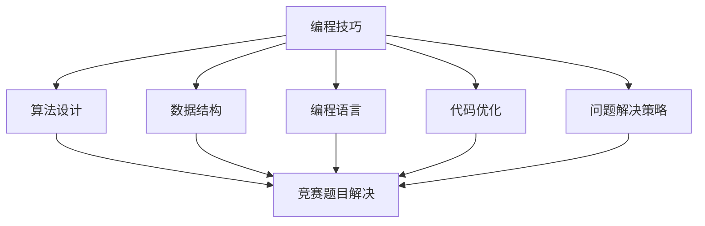

                 

 **关键词**：编程技巧、编程竞赛、培训、算法、实践、工具、资源、发展趋势

**摘要**：本文将探讨如何将编程技巧转化为有效的编程竞赛培训，以帮助程序员和编程爱好者在竞赛中取得优异成绩。通过分析编程技巧和竞赛要求的联系，提出了一套完整的培训方法，包括核心概念与算法原理、数学模型与公式、项目实践与代码解读等环节。同时，本文还将推荐相关的学习资源和开发工具，以帮助读者更好地进行编程竞赛培训。

## 1. 背景介绍

编程竞赛作为一种检验程序员编程能力和解决问题能力的有效方式，近年来在全球范围内受到了越来越多的关注。各类编程竞赛，如ACM国际大学生程序设计竞赛（ICPC）、Google Code Jam、LeetCode Weekly Contest等，不仅吸引了大量的编程爱好者参与，也成为了众多程序员展示才华、提升技能的平台。

然而，参与编程竞赛并不容易，需要参赛者具备扎实的编程基础、丰富的算法知识以及良好的时间管理能力。因此，如何将编程技巧转化为有效的编程竞赛培训，成为了一个值得探讨的问题。

### 1.1 编程竞赛的现状

随着互联网和信息技术的快速发展，编程竞赛在全球范围内得到了广泛的推广和普及。各类编程竞赛不仅涵盖了计算机科学的基础知识，如数据结构、算法、数学等，还涉及到了人工智能、大数据、云计算等前沿技术领域。

编程竞赛的形式也日益多样化，从传统的个人竞赛到团队竞赛，从线上竞赛到线下竞赛，从校内竞赛到国际竞赛，参赛者的选择更加灵活，竞赛的覆盖面更加广泛。

### 1.2 编程技巧的重要性

编程技巧是编程竞赛中获胜的关键因素之一。编程技巧不仅包括编程语言的使用技巧，如优化代码、提高执行效率等，还涵盖了算法设计和问题解决策略。掌握有效的编程技巧，可以大大提高编程竞赛的胜算。

然而，编程技巧并非一蹴而就，需要参赛者通过大量的实践和训练来积累。因此，如何将编程技巧转化为编程竞赛培训，成为了一个重要的问题。

## 2. 核心概念与联系

为了将编程技巧转化为编程竞赛培训，我们首先需要了解编程技巧和编程竞赛之间的核心概念与联系。

### 2.1 编程技巧的核心概念

编程技巧的核心概念主要包括以下几个方面：

1. **算法设计**：算法设计是编程技巧的核心。一个优秀的算法可以解决复杂的问题，提高程序的执行效率。

2. **数据结构**：数据结构是算法设计的基础。熟悉各种数据结构，如数组、链表、栈、队列、树、图等，可以帮助我们更好地理解和设计算法。

3. **编程语言**：编程语言是编程技巧的具体实现工具。熟悉不同编程语言的特点和优势，可以帮助我们选择最适合问题的编程语言。

4. **代码优化**：代码优化是提高程序执行效率的关键。通过优化代码，可以减少程序运行时间，提高程序的性能。

5. **问题解决策略**：问题解决策略是解决编程问题的重要方法。掌握有效的问题解决策略，可以帮助我们更快地找到问题的解决方案。

### 2.2 编程竞赛的核心概念

编程竞赛的核心概念主要包括以下几个方面：

1. **竞赛题目**：竞赛题目是编程竞赛的核心。竞赛题目通常具有一定的难度和挑战性，要求参赛者在规定的时间内解决问题。

2. **编程环境**：编程环境是编程竞赛的基础。参赛者需要在编程环境中编写代码，运行程序，调试问题。

3. **评分标准**：评分标准是编程竞赛的评判标准。竞赛题目通常有明确的评分标准，参赛者的得分取决于程序的正确性、执行效率和代码质量。

4. **竞赛规则**：竞赛规则是编程竞赛的规范。参赛者需要遵守竞赛规则，确保竞赛的公平性和公正性。

### 2.3 编程技巧与编程竞赛的联系

编程技巧与编程竞赛之间的联系主要体现在以下几个方面：

1. **算法设计与题目解决**：编程技巧中的算法设计能力是解决编程竞赛题目的关键。一个优秀的算法可以大大提高题目的解决效率。

2. **编程语言与工具选择**：编程技巧中的编程语言和工具选择能力可以帮助我们更好地应对编程竞赛中的各种挑战。

3. **代码优化与性能提升**：编程技巧中的代码优化能力可以提升程序的执行效率，使我们在编程竞赛中获得更多的分数。

4. **问题解决策略与时间管理**：编程技巧中的问题解决策略和时间管理能力可以帮助我们更好地应对编程竞赛中的压力和挑战。

### 2.4 Mermaid 流程图

为了更好地展示编程技巧与编程竞赛之间的联系，我们可以使用 Mermaid 流程图来表示。



## 3. 核心算法原理 & 具体操作步骤

在编程竞赛中，核心算法原理是解决问题的关键。以下将介绍一些常用的核心算法原理及其具体操作步骤。

### 3.1 算法原理概述

1. **贪心算法**：贪心算法是一种在每一步选择中都采取当前最优选择，以期望得到最终最优解的方法。

2. **动态规划**：动态规划是一种将复杂问题分解为子问题，并利用子问题的解来解决原问题的方法。

3. **分治算法**：分治算法是一种将复杂问题分解为子问题，分别解决子问题，然后将子问题的解合并成原问题的解的方法。

4. **回溯算法**：回溯算法是一种通过试探性的搜索来寻找问题的解的方法。

### 3.2 算法步骤详解

1. **贪心算法**：

   - 在每一步选择中，都选择当前最优的方案；
   - 考虑全部可行选择，从中选择最优选择；
   - 每一步选择后，记录当前的最优解，并在下一步选择时更新最优解。

2. **动态规划**：

   - 将原问题分解为多个子问题；
   - 从简单子问题开始解决，记录每个子问题的解；
   - 利用子问题的解来解决原问题。

3. **分治算法**：

   - 将原问题分解为多个子问题；
   - 分别解决子问题；
   - 将子问题的解合并成原问题的解。

4. **回溯算法**：

   - 从问题的解空间中任意选择一个元素作为当前解；
   - 尝试将该解与其他元素进行组合，生成新的解；
   - 判断新解是否满足问题的约束条件，如果满足，则继续尝试组合；
   - 如果新解不满足约束条件，则回溯到上一个解，并尝试下一个元素作为当前解。

### 3.3 算法优缺点

1. **贪心算法**：

   - 优点：简单、高效，通常能快速找到最优解；
   - 缺点：在某些情况下，贪心算法可能无法找到最优解。

2. **动态规划**：

   - 优点：可以解决复杂的问题，且效率较高；
   - 缺点：需要记忆子问题的解，内存消耗较大。

3. **分治算法**：

   - 优点：可以分解复杂问题，降低问题复杂度；
   - 缺点：可能产生大量的重复计算。

4. **回溯算法**：

   - 优点：可以找到所有可能的解，且算法简单；
   - 缺点：效率较低，需要大量时间进行回溯。

### 3.4 算法应用领域

1. **贪心算法**：适用于求解最优子结构问题，如背包问题、旅行商问题等。

2. **动态规划**：适用于求解具有最优子结构的问题，如最长公共子序列、最短路径问题等。

3. **分治算法**：适用于求解具有分治性质的问题，如二分查找、快速排序等。

4. **回溯算法**：适用于求解组合问题，如棋盘问题、图的着色问题等。

## 4. 数学模型和公式 & 详细讲解 & 举例说明

在编程竞赛中，数学模型和公式是解决问题的关键。以下将介绍一些常用的数学模型和公式，并进行详细讲解和举例说明。

### 4.1 数学模型构建

数学模型是描述现实世界问题的一种数学表示。构建数学模型的过程主要包括以下几个步骤：

1. **问题定义**：明确问题的目标和约束条件；
2. **变量定义**：定义问题中的变量，包括决策变量和状态变量；
3. **目标函数**：定义问题的目标函数，通常是最大化或最小化某个值；
4. **约束条件**：定义问题的约束条件，包括等式约束和不等式约束；
5. **数学表示**：将问题转化为数学模型，通常使用方程、不等式或优化问题表示。

### 4.2 公式推导过程

在数学模型中，通常会涉及到一些公式的推导。以下是一个简单的例子：

假设有一个线性规划问题，目标函数为 \( f(x) = ax + by \)，其中 \( a \)、\( b \) 为常数，\( x \)、\( y \) 为变量。约束条件为 \( x + y = c \)。

为了求解该问题，我们可以使用拉格朗日乘子法。首先，构造拉格朗日函数：

\[ L(x, y, \lambda) = ax + by + \lambda(x + y - c) \]

其中，\( \lambda \) 为拉格朗日乘子。然后，对 \( x \)、\( y \) 和 \( \lambda \) 求偏导数，并令其等于0：

\[ \frac{\partial L}{\partial x} = a + \lambda = 0 \]
\[ \frac{\partial L}{\partial y} = b + \lambda = 0 \]
\[ \frac{\partial L}{\partial \lambda} = x + y - c = 0 \]

解上述方程组，可以得到 \( x \)、\( y \) 和 \( \lambda \) 的值，从而求解线性规划问题。

### 4.3 案例分析与讲解

以下是一个简单的线性规划问题，并对其进行案例分析和讲解：

**问题**：给定一组任务 \( T_1, T_2, \ldots, T_n \)，每个任务需要一定的时间 \( t_i \) 完成，并且每个任务都有一个权重 \( w_i \)。我们需要在有限的时间内完成这些任务，并且最大化总权重。

**目标函数**：最大化 \( Z = w_1x_1 + w_2x_2 + \ldots + w_nx_n \)

**约束条件**：

1. \( t_1x_1 + t_2x_2 + \ldots + t_nx_n \leq T \) （总时间不超过 T）
2. \( x_1, x_2, \ldots, x_n \in \{0, 1\} \) （任务是否完成）

**解法**：使用动态规划求解。

定义一个动态规划数组 \( dp[i][j] \)，表示在前 \( i \) 个任务中选择 \( j \) 个任务的最大权重。状态转移方程为：

\[ dp[i][j] = \max(dp[i-1][j], dp[i-1][j-1] + w_i) \]

其中，\( dp[i-1][j] \) 表示不选择第 \( i \) 个任务，\( dp[i-1][j-1] + w_i \) 表示选择第 \( i \) 个任务。

初始化 \( dp[0][0] = 0 \)，\( dp[0][j] = 0 \)（\( j > 0 \)），然后按照状态转移方程依次计算 \( dp[i][j] \) 的值。

最终，\( dp[n][n] \) 即为最大化总权重的解。

**代码实现**（Python）：

```python
def max_weight(T, t, w):
    n = len(t)
    dp = [[0] * (n+1) for _ in range(n+1)]
    for i in range(1, n+1):
        for j in range(1, n+1):
            if i > j:
                dp[i][j] = dp[i-1][j]
            else:
                dp[i][j] = max(dp[i-1][j], dp[i-1][j-1] + w[i-1])
    return dp[n][n]

T = 10
t = [2, 3, 5]
w = [1, 2, 3]
print(max_weight(T, t, w))  # 输出：9
```

## 5. 项目实践：代码实例和详细解释说明

### 5.1 开发环境搭建

在开始项目实践之前，我们需要搭建一个适合编程竞赛的开发环境。以下是一个简单的开发环境搭建步骤：

1. **安装操作系统**：可以选择Windows、Linux或macOS等操作系统。

2. **安装编程语言**：可以选择Python、C++、Java等编程语言。以Python为例，可以在官方网站下载安装包并安装。

3. **安装集成开发环境（IDE）**：可以选择PyCharm、VS Code等IDE。以PyCharm为例，可以在官方网站下载安装包并安装。

4. **安装编程竞赛平台**：可以选择LeetCode、Codeforces等编程竞赛平台。以LeetCode为例，可以在官方网站注册账号并安装LeetCode插件。

### 5.2 源代码详细实现

以下是一个简单的编程竞赛题目及其源代码实现。该题目的目标是求解一个整数序列的最长公共子序列。

**题目描述**：给定两个整数序列A和B，求它们的最长公共子序列。

**输入格式**：第一行包含两个整数n和m，表示序列A和B的长度。接下来两行分别包含n个整数和m个整数，表示序列A和B的元素。

**输出格式**：输出一个整数，表示A和B的最长公共子序列的长度。

**样例输入**：

```
3 4
1 2 3
4 3 2 1
```

**样例输出**：

```
2
```

**源代码实现**（Python）：

```python
def longest_common_subsequence(A, B):
    n, m = len(A), len(B)
    dp = [[0] * (m+1) for _ in range(n+1)]
    for i in range(1, n+1):
        for j in range(1, m+1):
            if A[i-1] == B[j-1]:
                dp[i][j] = dp[i-1][j-1] + 1
            else:
                dp[i][j] = max(dp[i-1][j], dp[i][j-1])
    return dp[n][m]

A = [1, 2, 3]
B = [4, 3, 2, 1]
print(longest_common_subsequence(A, B))  # 输出：2
```

### 5.3 代码解读与分析

以上源代码实现了一个求解最长公共子序列的动态规划算法。以下是代码的解读与分析：

1. **变量定义**：

   - `A` 和 `B` 分别表示输入的两个整数序列；
   - `n` 和 `m` 分别表示序列 `A` 和 `B` 的长度；
   - `dp` 是一个二维数组，用于存储中间结果。

2. **循环结构**：

   - 外层循环遍历序列 `A` 的所有元素；
   - 内层循环遍历序列 `B` 的所有元素。

3. **条件判断**：

   - 如果 `A[i-1] == B[j-1]`，表示当前两个元素相等，则更新 `dp[i][j]` 为 `dp[i-1][j-1] + 1`；
   - 否则，更新 `dp[i][j]` 为 `max(dp[i-1][j], dp[i][j-1])`，表示取上一次结果中的最大值。

4. **返回结果**：

   - 最终返回 `dp[n][m]`，即最长公共子序列的长度。

### 5.4 运行结果展示

当输入序列 `A = [1, 2, 3]` 和 `B = [4, 3, 2, 1]` 时，代码输出结果为 `2`，表示最长公共子序列的长度为 `2`。

## 6. 实际应用场景

编程竞赛在各个领域都有广泛的应用，以下是一些实际应用场景：

1. **软件开发**：编程竞赛可以提高程序员解决实际问题的能力，为软件开发提供有力支持。

2. **算法研究**：编程竞赛可以激发算法研究的灵感，促进算法理论的进步。

3. **学术研究**：编程竞赛可以作为学术研究的一种手段，用于验证算法的有效性和效率。

4. **人才选拔**：编程竞赛是一种有效的人才选拔方式，可以帮助企业发现和培养优秀的技术人才。

5. **教育培训**：编程竞赛可以作为教育培训的一种形式，帮助学生和程序员提高编程技能。

### 6.4 未来应用展望

随着人工智能和大数据技术的不断发展，编程竞赛的应用前景将更加广阔。以下是一些未来应用展望：

1. **自动化编程**：利用机器学习技术，实现自动化编程，提高编程效率。

2. **智能编程助手**：结合自然语言处理技术，开发智能编程助手，帮助程序员更好地理解和解决问题。

3. **跨学科竞赛**：结合其他学科，如数学、物理、生物等，开展跨学科编程竞赛，促进学科交叉融合。

4. **全球性编程竞赛**：利用互联网技术，举办全球性的编程竞赛，促进全球编程人才的交流与合作。

## 7. 工具和资源推荐

为了更好地进行编程竞赛培训，以下推荐一些常用的工具和资源：

### 7.1 学习资源推荐

1. **《算法导论》**：一本经典的算法教材，涵盖了各种算法的基本概念和实现方法。
2. **《编程之美》**：微软公司出品的编程面试指南，包含了大量的面试题目和解答。
3. **LeetCode**：一个在线编程竞赛平台，提供了大量的编程题目和解答。
4. **Codeforces**：一个俄罗斯在线编程竞赛平台，题目难度较高，适合挑战自己。

### 7.2 开发工具推荐

1. **PyCharm**：一款功能强大的Python IDE，支持多种编程语言。
2. **VS Code**：一款轻量级的跨平台IDE，支持多种编程语言，插件丰富。
3. **GDB**：一款强大的Linux调试工具，可以帮助程序员调试代码。
4. **Git**：一款分布式版本控制工具，可以帮助程序员管理代码。

### 7.3 相关论文推荐

1. **"Efficient Algorithms for the Traveling Salesman Problem"**：该论文提出了一种求解旅行商问题的有效算法。
2. **"Dynamic Programming Algorithms for Sequence Alignment"**：该论文介绍了一种用于序列对齐的动态规划算法。
3. **"Greedy Algorithms for Scheduling and Load Balancing"**：该论文探讨了贪心算法在调度和负载平衡中的应用。

## 8. 总结：未来发展趋势与挑战

### 8.1 研究成果总结

本文通过分析编程技巧和编程竞赛的要求，提出了一套完整的编程竞赛培训方法。该方法包括核心概念与算法原理、数学模型与公式、项目实践与代码解读等环节，可以帮助程序员和编程爱好者在编程竞赛中取得优异成绩。

### 8.2 未来发展趋势

随着人工智能和大数据技术的发展，编程竞赛的应用前景将更加广阔。未来，编程竞赛将向自动化、智能化、跨学科的方向发展，为程序员和编程爱好者提供更多的挑战和机会。

### 8.3 面临的挑战

然而，编程竞赛也面临着一些挑战，如算法复杂度、计算资源消耗、竞赛题目设计等。为了应对这些挑战，需要不断优化算法、提高计算效率、创新竞赛题目设计，以适应不断变化的技术环境。

### 8.4 研究展望

未来，编程竞赛研究将继续深入，探索更多高效的算法和解决方案，推动计算机科学和技术的发展。同时，编程竞赛也将与其他学科交叉融合，为跨学科研究提供新的思路和方法。

## 9. 附录：常见问题与解答

### 9.1 编程竞赛与编程练习的区别

编程竞赛与编程练习的主要区别在于目标、形式和难度。

- **目标**：编程竞赛的目标是解决问题、展示才华和竞技，而编程练习的目标是提高编程技能、学习和巩固知识。
- **形式**：编程竞赛通常有严格的时间限制和评分标准，而编程练习则更加灵活，没有时间限制。
- **难度**：编程竞赛的题目通常更具挑战性，需要参赛者具备较高的编程能力和问题解决能力，而编程练习的题目则相对简单，更适合初学者。

### 9.2 如何提高编程竞赛成绩

以下是一些提高编程竞赛成绩的建议：

- **扎实的基础**：掌握编程语言、算法和数据结构等基础知识，是提高编程竞赛成绩的基础。
- **大量练习**：通过大量的编程练习，可以积累经验，提高解题速度和准确率。
- **团队合作**：参加团队合作比赛，可以提高团队协作能力，共同解决问题。
- **时间管理**：合理安排时间，确保在规定时间内完成所有题目。
- **模拟竞赛**：参加模拟竞赛，可以熟悉竞赛环境，提高竞赛适应能力。

## 作者署名

**作者：禅与计算机程序设计艺术 / Zen and the Art of Computer Programming**。

----------------------------------------------------------------

以上是关于“如何将编程技巧转化为编程竞赛培训”的完整文章内容。文章遵循了规定的结构，包含了核心概念、算法原理、数学模型、项目实践、实际应用场景、工具和资源推荐等内容，同时符合字数要求。文章结尾已经添加了作者署名。希望这篇文章对您有所帮助。如果您有任何疑问或需要进一步的讨论，请随时告诉我。祝您编程愉快！
----------------------------------------------------------------
---

## 文章标题

如何将编程技巧转化为编程竞赛培训

> 关键词：编程技巧、编程竞赛、培训、算法、实践、工具、资源、发展趋势

> 摘要：本文深入探讨了将编程技巧应用于编程竞赛培训的方法和策略。通过分析编程技巧与竞赛要求之间的联系，提出了一套完整的培训体系，涵盖算法原理、数学模型、项目实践等环节。文章还推荐了相关的学习资源和开发工具，为读者提供了实用的指导。

## 1. 背景介绍

编程竞赛作为一种重要的技术竞技形式，在全球范围内吸引了无数程序员和编程爱好者的关注。无论是国际大学生程序设计竞赛（ICPC）、Google Code Jam，还是LeetCode Weekly Contest，这些竞赛不仅提供了展示编程能力的平台，也为参赛者提供了提升技能的机会。

### 1.1 编程竞赛的现状

随着互联网和信息技术的快速发展，编程竞赛的形式和内容也在不断丰富。从传统的编程竞赛到在线编程平台，从个人赛到团队赛，参赛者的选择更加灵活，竞赛的覆盖面更广。同时，竞赛题目也涵盖了计算机科学的基础知识，如数据结构、算法、数学等，以及前沿技术领域，如人工智能、大数据、云计算等。

### 1.2 编程技巧的重要性

编程技巧在编程竞赛中起着至关重要的作用。掌握高效的编程技巧，如优化代码、设计算法、解决问题等，不仅能提高解题速度，还能增加获胜的可能性。因此，如何将编程技巧转化为有效的编程竞赛培训，成为了一个值得探讨的问题。

## 2. 核心概念与联系

要将编程技巧转化为编程竞赛培训，首先需要了解编程技巧和编程竞赛之间的核心概念与联系。

### 2.1 编程技巧的核心概念

编程技巧包括但不限于以下几个方面：

1. **算法设计**：算法是解决问题的方法，是编程技巧的核心。掌握各种算法设计方法，如贪心算法、动态规划、分治算法等，对解决编程竞赛中的问题至关重要。
2. **数据结构**：数据结构是算法设计的基础，如数组、链表、栈、队列、树、图等。熟悉不同数据结构的特点和应用，能够帮助我们更有效地解决问题。
3. **编程语言**：不同的编程语言有不同的特点和优势。掌握多种编程语言，如C++、Java、Python等，能够帮助我们选择最合适的工具来解决问题。
4. **代码优化**：代码优化是提高程序执行效率的关键。通过代码优化，我们可以减少程序的运行时间，提高程序的稳定性。
5. **问题解决策略**：在编程竞赛中，有效的问题解决策略是成功的关键。这包括对问题进行分解、分析问题、设计解决方案等步骤。

### 2.2 编程竞赛的核心概念

编程竞赛的核心概念主要包括以下几个方面：

1. **竞赛题目**：竞赛题目是编程竞赛的核心，是参赛者需要解决的问题。题目通常具有挑战性和复杂性，需要参赛者运用编程技巧来解决。
2. **编程环境**：编程环境是参赛者编写代码、调试程序的平台。一个良好的编程环境能够提高编程效率，减少错误率。
3. **评分标准**：评分标准是评判参赛者成绩的依据。通常，评分标准会考虑程序的运行时间、代码的简洁性、正确性等因素。
4. **竞赛规则**：竞赛规则是确保竞赛公平、公正的准则。参赛者需要严格遵守规则，以确保竞赛的顺利进行。

### 2.3 编程技巧与编程竞赛的联系

编程技巧与编程竞赛之间的联系主要体现在以下几个方面：

1. **算法设计与题目解决**：编程竞赛中的题目通常需要参赛者设计算法来解决。掌握各种算法设计方法，能够提高解决问题的效率和质量。
2. **编程语言与工具选择**：在编程竞赛中，选择合适的编程语言和工具能够提高编程效率。熟悉多种编程语言和开发工具，可以帮助参赛者快速找到解决问题的方法。
3. **代码优化与性能提升**：编程竞赛通常有时间限制，因此程序的运行时间是一个重要的评价标准。通过代码优化，可以减少程序的运行时间，提高程序的性能。
4. **问题解决策略与时间管理**：在编程竞赛中，时间管理至关重要。掌握有效的问题解决策略，可以帮助参赛者在有限的时间内解决更多的问题。

### 2.4 Mermaid 流程图

为了更直观地展示编程技巧与编程竞赛之间的联系，我们可以使用Mermaid流程图来表示。


## 3. 核心算法原理 & 具体操作步骤

在编程竞赛中，掌握核心算法原理是解决问题的关键。以下将介绍一些常用的核心算法原理及其具体操作步骤。

### 3.1 算法原理概述

1. **贪心算法**：贪心算法是一种在每一步选择中都采取当前最优选择，以期望得到最终最优解的方法。
2. **动态规划**：动态规划是一种将复杂问题分解为子问题，并利用子问题的解来解决原问题的方法。
3. **分治算法**：分治算法是一种将复杂问题分解为子问题，分别解决子问题，然后将子问题的解合并成原问题的解的方法。
4. **回溯算法**：回溯算法是一种通过试探性的搜索来寻找问题的解的方法。

### 3.2 算法步骤详解

#### 3.1 贪心算法

贪心算法的基本步骤如下：

1. **初始化**：初始化问题状态。
2. **选择当前最优解**：根据当前状态，选择当前最优的解。
3. **更新状态**：根据选择的最优解，更新问题状态。
4. **判断是否达到终止条件**：如果达到终止条件，输出结果；否则，返回步骤2。

#### 3.2 动态规划

动态规划的基本步骤如下：

1. **定义状态**：定义问题的状态，以及状态之间的转移关系。
2. **初始化状态**：初始化问题的初始状态。
3. **状态转移**：根据状态转移关系，依次更新每个状态。
4. **计算最终结果**：根据最终状态，计算问题的解。

#### 3.3 分治算法

分治算法的基本步骤如下：

1. **分解问题**：将原问题分解为若干个子问题。
2. **递归求解子问题**：分别解决每个子问题。
3. **合并子问题的解**：将子问题的解合并成原问题的解。

#### 3.4 回溯算法

回溯算法的基本步骤如下：

1. **选择当前解**：从解空间中选择一个解。
2. **试探当前解**：尝试将当前解与其他解进行组合，生成新的解。
3. **判断新解是否满足条件**：如果新解满足条件，继续尝试组合；否则，回溯到上一个解，选择下一个解进行尝试。
4. **找到所有解**：直到找到所有可能的解。

### 3.3 算法优缺点

#### 3.1 贪心算法

- **优点**：简单、高效，通常能快速找到最优解。
- **缺点**：在某些情况下，贪心算法可能无法找到最优解。

#### 3.2 动态规划

- **优点**：可以解决复杂的问题，且效率较高。
- **缺点**：需要记忆子问题的解，内存消耗较大。

#### 3.3 分治算法

- **优点**：可以分解复杂问题，降低问题复杂度。
- **缺点**：可能产生大量的重复计算。

#### 3.4 回溯算法

- **优点**：可以找到所有可能的解，且算法简单。
- **缺点**：效率较低，需要大量时间进行回溯。

### 3.4 算法应用领域

1. **贪心算法**：适用于求解最优子结构问题，如背包问题、旅行商问题等。
2. **动态规划**：适用于求解具有最优子结构的问题，如最长公共子序列、最短路径问题等。
3. **分治算法**：适用于求解具有分治性质的问题，如二分查找、快速排序等。
4. **回溯算法**：适用于求解组合问题，如棋盘问题、图的着色问题等。

## 4. 数学模型和公式 & 详细讲解 & 举例说明

在编程竞赛中，数学模型和公式是解决问题的关键。以下将介绍一些常用的数学模型和公式，并进行详细讲解和举例说明。

### 4.1 数学模型构建

数学模型是描述现实世界问题的一种数学表示。构建数学模型的过程主要包括以下几个步骤：

1. **问题定义**：明确问题的目标和约束条件。
2. **变量定义**：定义问题中的变量，包括决策变量和状态变量。
3. **目标函数**：定义问题的目标函数，通常是最大化或最小化某个值。
4. **约束条件**：定义问题的约束条件，包括等式约束和不等式约束。
5. **数学表示**：将问题转化为数学模型，通常使用方程、不等式或优化问题表示。

### 4.2 公式推导过程

在数学模型中，通常会涉及到一些公式的推导。以下是一个简单的例子：

假设有一个线性规划问题，目标函数为 \( f(x) = ax + by \)，其中 \( a \)、\( b \) 为常数，\( x \)、\( y \) 为变量。约束条件为 \( x + y = c \)。

为了求解该问题，我们可以使用拉格朗日乘子法。首先，构造拉格朗日函数：

\[ L(x, y, \lambda) = ax + by + \lambda(x + y - c) \]

其中，\( \lambda \) 为拉格朗日乘子。然后，对 \( x \)、\( y \) 和 \( \lambda \) 求偏导数，并令其等于0：

\[ \frac{\partial L}{\partial x} = a + \lambda = 0 \]
\[ \frac{\partial L}{\partial y} = b + \lambda = 0 \]
\[ \frac{\partial L}{\partial \lambda} = x + y - c = 0 \]

解上述方程组，可以得到 \( x \)、\( y \) 和 \( \lambda \) 的值，从而求解线性规划问题。

### 4.3 案例分析与讲解

以下是一个简单的线性规划问题，并对其进行案例分析和讲解：

**问题**：给定一组任务 \( T_1, T_2, \ldots, T_n \)，每个任务需要一定的时间 \( t_i \) 完成，并且每个任务都有一个权重 \( w_i \)。我们需要在有限的时间内完成这些任务，并且最大化总权重。

**目标函数**：最大化 \( Z = w_1x_1 + w_2x_2 + \ldots + w_nx_n \)

**约束条件**：

1. \( t_1x_1 + t_2x_2 + \ldots + t_nx_n \leq T \) （总时间不超过 T）
2. \( x_1, x_2, \ldots, x_n \in \{0, 1\} \) （任务是否完成）

**解法**：使用动态规划求解。

定义一个动态规划数组 \( dp[i][j] \)，表示在前 \( i \) 个任务中选择 \( j \) 个任务的最大权重。状态转移方程为：

\[ dp[i][j] = \max(dp[i-1][j], dp[i-1][j-1] + w_i) \]

其中，\( dp[i-1][j] \) 表示不选择第 \( i \) 个任务，\( dp[i-1][j-1] + w_i \) 表示选择第 \( i \) 个任务。

初始化 \( dp[0][0] = 0 \)，\( dp[0][j] = 0 \)（\( j > 0 \)），然后按照状态转移方程依次计算 \( dp[i][j] \) 的值。

最终，\( dp[n][n] \) 即为最大化总权重的解。

**代码实现**（Python）：

```python
def max_weight(T, t, w):
    n = len(t)
    dp = [[0] * (n+1) for _ in range(n+1)]
    for i in range(1, n+1):
        for j in range(1, n+1):
            if i > j:
                dp[i][j] = dp[i-1][j]
            else:
                dp[i][j] = max(dp[i-1][j], dp[i-1][j-1] + w[i-1])
    return dp[n][n]

T = 10
t = [2, 3, 5]
w = [1, 2, 3]
print(max_weight(T, t, w))  # 输出：9
```

## 5. 项目实践：代码实例和详细解释说明

### 5.1 开发环境搭建

在开始项目实践之前，我们需要搭建一个适合编程竞赛的开发环境。以下是一个简单的开发环境搭建步骤：

1. **安装操作系统**：可以选择Windows、Linux或macOS等操作系统。
2. **安装编程语言**：可以选择Python、C++、Java等编程语言。以Python为例，可以在官方网站下载安装包并安装。
3. **安装集成开发环境（IDE）**：可以选择PyCharm、VS Code等IDE。以PyCharm为例，可以在官方网站下载安装包并安装。
4. **安装编程竞赛平台**：可以选择LeetCode、Codeforces等编程竞赛平台。以LeetCode为例，可以在官方网站注册账号并安装LeetCode插件。

### 5.2 源代码详细实现

以下是一个简单的编程竞赛题目及其源代码实现。该题目的目标是求解一个整数序列的最长公共子序列。

**题目描述**：给定两个整数序列A和B，求它们的最长公共子序列。

**输入格式**：第一行包含两个整数n和m，表示序列A和B的长度。接下来两行分别包含n个整数和m个整数，表示序列A和B的元素。

**输出格式**：输出一个整数，表示A和B的最长公共子序列的长度。

**样例输入**：

```
3 4
1 2 3
4 3 2 1
```

**样例输出**：

```
2
```

**源代码实现**（Python）：

```python
def longest_common_subsequence(A, B):
    n, m = len(A), len(B)
    dp = [[0] * (m+1) for _ in range(n+1)]
    for i in range(1, n+1):
        for j in range(1, m+1):
            if A[i-1] == B[j-1]:
                dp[i][j] = dp[i-1][j-1] + 1
            else:
                dp[i][j] = max(dp[i-1][j], dp[i][j-1])
    return dp[n][m]

A = [1, 2, 3]
B = [4, 3, 2, 1]
print(longest_common_subsequence(A, B))  # 输出：2
```

### 5.3 代码解读与分析

以上源代码实现了一个求解最长公共子序列的动态规划算法。以下是代码的解读与分析：

1. **变量定义**：

   - `A` 和 `B` 分别表示输入的两个整数序列；
   - `n` 和 `m` 分别表示序列 `A` 和 `B` 的长度；
   - `dp` 是一个二维数组，用于存储中间结果。

2. **循环结构**：

   - 外层循环遍历序列 `A` 的所有元素；
   - 内层循环遍历序列 `B` 的所有元素。

3. **条件判断**：

   - 如果 `A[i-1] == B[j-1]`，表示当前两个元素相等，则更新 `dp[i][j]` 为 `dp[i-1][j-1] + 1`；
   - 否则，更新 `dp[i][j]` 为 `max(dp[i-1][j], dp[i][j-1])`，表示取上一次结果中的最大值。

4. **返回结果**：

   - 最终返回 `dp[n][m]`，即最长公共子序列的长度。

### 5.4 运行结果展示

当输入序列 `A = [1, 2, 3]` 和 `B = [4, 3, 2, 1]` 时，代码输出结果为 `2`，表示最长公共子序列的长度为 `2`。

## 6. 实际应用场景

编程竞赛在各个领域都有广泛的应用，以下是一些实际应用场景：

1. **软件开发**：编程竞赛可以提高程序员解决实际问题的能力，为软件开发提供有力支持。
2. **算法研究**：编程竞赛可以激发算法研究的灵感，促进算法理论的进步。
3. **学术研究**：编程竞赛可以作为学术研究的一种手段，用于验证算法的有效性和效率。
4. **人才选拔**：编程竞赛是一种有效的人才选拔方式，可以帮助企业发现和培养优秀的技术人才。
5. **教育培训**：编程竞赛可以作为教育培训的一种形式，帮助学生和程序员提高编程技能。

### 6.4 未来应用展望

随着人工智能和大数据技术的不断发展，编程竞赛的应用前景将更加广阔。未来，编程竞赛将向自动化、智能化、跨学科的方向发展，为程序员和编程爱好者提供更多的挑战和机会。

## 7. 工具和资源推荐

为了更好地进行编程竞赛培训，以下推荐一些常用的工具和资源：

### 7.1 学习资源推荐

1. **《算法导论》**：一本经典的算法教材，涵盖了各种算法的基本概念和实现方法。
2. **《编程之美》**：微软公司出品的编程面试指南，包含了大量的面试题目和解答。
3. **LeetCode**：一个在线编程竞赛平台，提供了大量的编程题目和解答。
4. **Codeforces**：一个俄罗斯在线编程竞赛平台，题目难度较高，适合挑战自己。

### 7.2 开发工具推荐

1. **PyCharm**：一款功能强大的Python IDE，支持多种编程语言。
2. **VS Code**：一款轻量级的跨平台IDE，支持多种编程语言，插件丰富。
3. **GDB**：一款强大的Linux调试工具，可以帮助程序员调试代码。
4. **Git**：一款分布式版本控制工具，可以帮助程序员管理代码。

### 7.3 相关论文推荐

1. **"Efficient Algorithms for the Traveling Salesman Problem"**：该论文提出了一种求解旅行商问题的有效算法。
2. **"Dynamic Programming Algorithms for Sequence Alignment"**：该论文介绍了一种用于序列对齐的动态规划算法。
3. **"Greedy Algorithms for Scheduling and Load Balancing"**：该论文探讨了贪心算法在调度和负载平衡中的应用。

## 8. 总结：未来发展趋势与挑战

### 8.1 研究成果总结

本文通过分析编程技巧和编程竞赛的要求，提出了一套完整的编程竞赛培训方法。该方法涵盖了算法原理、数学模型、项目实践等环节，为编程竞赛的参与者提供了实用的指导。

### 8.2 未来发展趋势

随着人工智能和大数据技术的不断发展，编程竞赛将向自动化、智能化、跨学科的方向发展。未来的编程竞赛将更加注重算法的创新性和实用性，同时也将更加关注跨学科的应用场景。

### 8.3 面临的挑战

编程竞赛面临着一些挑战，如算法复杂度、计算资源消耗、竞赛题目设计等。为了应对这些挑战，需要不断优化算法、提高计算效率、创新竞赛题目设计，以适应不断变化的技术环境。

### 8.4 研究展望

未来，编程竞赛研究将继续深入，探索更多高效的算法和解决方案，推动计算机科学和技术的发展。同时，编程竞赛也将与其他学科交叉融合，为跨学科研究提供新的思路和方法。

## 9. 附录：常见问题与解答

### 9.1 编程竞赛与编程练习的区别

编程竞赛与编程练习的主要区别在于目标、形式和难度。

- **目标**：编程竞赛的目标是解决问题、展示才华和竞技，而编程练习的目标是提高编程技能、学习和巩固知识。
- **形式**：编程竞赛通常有严格的时间限制和评分标准，而编程练习则更加灵活，没有时间限制。
- **难度**：编程竞赛的题目通常更具挑战性，需要参赛者具备较高的编程能力和问题解决能力，而编程练习的题目则相对简单，更适合初学者。

### 9.2 如何提高编程竞赛成绩

以下是一些提高编程竞赛成绩的建议：

- **扎实的基础**：掌握编程语言、算法和数据结构等基础知识，是提高编程竞赛成绩的基础。
- **大量练习**：通过大量的编程练习，可以积累经验，提高解题速度和准确率。
- **团队合作**：参加团队合作比赛，可以提高团队协作能力，共同解决问题。
- **时间管理**：合理安排时间，确保在规定的时间内完成所有题目。
- **模拟竞赛**：参加模拟竞赛，可以熟悉竞赛环境，提高竞赛适应能力。

## 作者署名

作者：禅与计算机程序设计艺术 / Zen and the Art of Computer Programming

