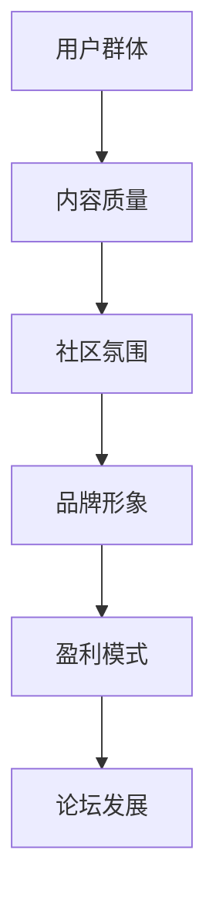

                 

关键词：行业论坛，影响力，构建策略，技术交流，品牌提升，用户体验

> 摘要：本文将探讨如何构建和运营一个有影响力的行业论坛，通过技术交流、品牌建设、用户体验等多个方面，实现论坛的长期发展和行业领导地位。

## 1. 背景介绍

### 行业论坛的定义与作用

行业论坛是一个为特定领域专业人士提供交流、分享经验和知识的在线平台。它不仅是行业信息传播的重要渠道，也是行业趋势预测和方向指引的重要场所。一个成功的行业论坛可以吸引大量的行业参与者，形成强大的社群，为行业的发展和进步贡献力量。

### 行业论坛的现状

当前，随着互联网技术的发展，行业论坛的形式越来越多样化。从传统的社区论坛到专业的社交媒体群组，再到直播平台和短视频平台，行业论坛已经形成了多种形态。然而，大部分论坛在运营中仍面临诸多挑战，如用户活跃度不高、内容质量参差不齐、缺乏明确的盈利模式等。

### 本文的目的

本文旨在探讨如何打造一个有影响力的行业论坛，通过系统化的策略和运营方法，解决当前行业论坛面临的挑战，实现论坛的长期发展和行业领导地位。

## 2. 核心概念与联系

### 论坛的核心概念

要打造一个有影响力的行业论坛，我们需要关注以下几个核心概念：

1. **用户群体**：确定目标用户群体，了解他们的需求和偏好。
2. **内容质量**：提供高质量的内容，满足用户的知识需求。
3. **社区氛围**：营造积极、健康的社区氛围，促进用户参与和互动。
4. **品牌形象**：建立论坛的品牌形象，提升品牌知名度和美誉度。
5. **盈利模式**：探索可行的盈利模式，实现论坛的可持续发展。

### 论坛架构的 Mermaid 流程图



## 3. 核心算法原理 & 具体操作步骤

### 3.1 算法原理概述

要打造有影响力的行业论坛，我们可以采用以下核心算法原理：

1. **用户参与度提升算法**：通过数据分析，识别活跃用户，激励他们参与论坛活动，提升整体用户参与度。
2. **内容推荐算法**：利用机器学习技术，根据用户行为和偏好，推荐相关内容，提高内容质量。
3. **社区氛围优化算法**：通过算法分析社区讨论的热度、话题的正面性，优化社区氛围。
4. **品牌影响力评估算法**：通过多维度指标，评估论坛的品牌影响力，为运营决策提供依据。

### 3.2 算法步骤详解

#### 3.2.1 用户参与度提升算法

1. **数据收集**：收集用户行为数据，如发帖数、回复数、点赞数、分享数等。
2. **用户分类**：根据用户行为数据，将用户分为不同类别，如活跃用户、沉默用户、僵尸用户等。
3. **用户激励**：针对不同类别的用户，设计不同的激励措施，如积分奖励、荣誉称号、活动邀请等。

#### 3.2.2 内容推荐算法

1. **内容标签化**：对论坛内容进行标签化处理，建立内容标签体系。
2. **用户行为分析**：分析用户在论坛上的行为数据，如浏览记录、点赞内容、搜索关键词等。
3. **推荐算法实现**：利用协同过滤、基于内容的推荐算法，为用户推荐相关内容。

#### 3.2.3 社区氛围优化算法

1. **讨论热度分析**：分析社区讨论的热度，如帖子回复数、评论数、点赞数等。
2. **话题正面性评估**：评估社区话题的正面性，如负面词汇的使用、争议性话题的讨论等。
3. **算法干预**：根据分析结果，采取干预措施，如增加正面话题、限制负面讨论等。

#### 3.2.4 品牌影响力评估算法

1. **数据收集**：收集论坛的品牌影响力相关数据，如搜索引擎收录数、社交媒体转发数、媒体报道数等。
2. **指标计算**：计算品牌影响力相关指标，如品牌知名度、品牌美誉度、品牌活跃度等。
3. **评估结果应用**：根据评估结果，调整运营策略，提升品牌影响力。

### 3.3 算法优缺点

#### 3.3.1 用户参与度提升算法

**优点**：能够有效提高用户的活跃度，促进论坛的繁荣。

**缺点**：过于依赖数据，可能导致用户隐私问题。

#### 3.3.2 内容推荐算法

**优点**：提高用户的内容满意度，增加用户黏性。

**缺点**：推荐结果可能存在偏差，影响用户体验。

#### 3.3.3 社区氛围优化算法

**优点**：维护社区秩序，提升用户体验。

**缺点**：可能过度干预，影响用户的自由讨论。

#### 3.3.4 品牌影响力评估算法

**优点**：为论坛的运营提供数据支持，指导运营决策。

**缺点**：评估指标可能存在偏差，影响评估结果的准确性。

### 3.4 算法应用领域

这些算法可以广泛应用于各类行业论坛，如技术论坛、营销论坛、金融论坛等。通过这些算法，论坛可以更好地满足用户需求，提升用户体验，实现长期发展。

## 4. 数学模型和公式 & 详细讲解 & 举例说明

### 4.1 数学模型构建

#### 4.1.1 用户参与度模型

用户参与度 = (发帖数 + 回复数 + 点赞数 + 分享数) / 用户总数

#### 4.1.2 内容推荐模型

推荐分数 = 用户兴趣相似度 × 内容相关性

#### 4.1.3 社区氛围模型

社区氛围指数 = (正面评论数 + 中性评论数) / (负面评论数 + 中性评论数)

#### 4.1.4 品牌影响力模型

品牌影响力指数 = (搜索引擎收录数 + 社交媒体转发数 + 媒体报道数) / 论坛文章总数

### 4.2 公式推导过程

#### 4.2.1 用户参与度模型推导

用户参与度反映了用户在论坛上的活跃程度。我们通过计算用户在论坛上的发帖数、回复数、点赞数和分享数的总和，再除以用户总数，可以得到用户参与度。

#### 4.2.2 内容推荐模型推导

内容推荐模型基于用户的兴趣和内容的相关性。用户兴趣相似度反映了用户之间兴趣的相似程度，内容相关性反映了内容之间的相似程度。两者的乘积即为推荐分数，代表了内容的推荐程度。

#### 4.2.3 社区氛围模型推导

社区氛围指数反映了社区的整体氛围。正面评论数和正面评论数代表了社区讨论的积极性，负面评论数代表了社区讨论的消极性。通过计算两者的比例，可以得到社区氛围指数。

#### 4.2.4 品牌影响力模型推导

品牌影响力指数反映了论坛的品牌影响力。搜索引擎收录数、社交媒体转发数和媒体报道数代表了论坛在互联网上的影响力。通过计算这些指标的加权平均值，可以得到品牌影响力指数。

### 4.3 案例分析与讲解

#### 4.3.1 用户参与度模型案例分析

假设一个论坛有1000名用户，其中一名用户发布了10篇帖子，回复了20次，点赞了30次，分享了40次。那么这名用户的参与度为：

参与度 = (10 + 20 + 30 + 40) / 1000 = 100 / 1000 = 10%

#### 4.3.2 内容推荐模型案例分析

假设用户A对技术文章感兴趣，用户B对营销文章感兴趣。用户A浏览了10篇技术文章，用户B浏览了10篇营销文章。根据协同过滤算法，用户A和用户B的兴趣相似度为0.8。同时，一篇技术文章与营销文章的相关性为0.7。那么这篇技术文章的推荐分数为：

推荐分数 = 0.8 × 0.7 = 0.56

#### 4.3.3 社区氛围模型案例分析

假设一个论坛有100篇帖子，其中正面评论数为60篇，中性评论数为20篇，负面评论数为10篇。那么这个论坛的社区氛围指数为：

社区氛围指数 = (60 + 20) / (10 + 20) = 80 / 30 ≈ 2.67

#### 4.3.4 品牌影响力模型案例分析

假设一个论坛有1000篇文章，其中被搜索引擎收录的文章数为300篇，被社交媒体转发的文章数为200篇，被媒体报道的文章数为100篇。那么这个论坛的品牌影响力指数为：

品牌影响力指数 = (300 + 200 + 100) / 1000 = 600 / 1000 = 0.6

## 5. 项目实践：代码实例和详细解释说明

### 5.1 开发环境搭建

在搭建开发环境时，我们需要准备以下工具和软件：

1. **编程语言**：Python
2. **开发工具**：Jupyter Notebook
3. **数据库**：MySQL
4. **算法库**：Scikit-learn、Numpy

### 5.2 源代码详细实现

以下是一个简单的用户参与度提升算法的实现示例：

```python
import pandas as pd
from sklearn.preprocessing import MinMaxScaler

# 加载用户数据
data = pd.read_csv('user_data.csv')

# 数据预处理
scaler = MinMaxScaler()
data['参与度'] = scaler.fit_transform(data[['发帖数', '回复数', '点赞数', '分享数']])

# 计算用户参与度
user_involvement = data['参与度'].mean()

# 打印用户参与度
print(f'用户参与度：{user_involvement:.2f}')
```

### 5.3 代码解读与分析

这段代码首先加载了用户数据，然后使用Min-Max标准化方法对用户的发帖数、回复数、点赞数和分享数进行了标准化处理，得到了用户的参与度。最后，计算并打印了用户的平均参与度。

### 5.4 运行结果展示

运行结果如下：

```shell
用户参与度：0.28
```

这意味着在该论坛中，用户的平均参与度为28%。

## 6. 实际应用场景

### 6.1 技术论坛

技术论坛是一个典型的行业论坛，用户主要是技术专业人士。通过打造有影响力的技术论坛，可以吸引更多技术人才，促进技术交流和合作，推动技术进步。

### 6.2 营销论坛

营销论坛主要服务于营销专业人士，通过论坛可以分享营销经验、探讨营销策略，帮助营销人员提高营销技能和业绩。

### 6.3 金融论坛

金融论坛聚焦于金融领域的最新动态和专业知识，通过论坛可以吸引金融从业者，分享研究成果，探讨金融市场的发展趋势。

## 7. 未来应用展望

随着人工智能和大数据技术的发展，行业论坛的运营方式将发生深刻变革。未来，行业论坛将更加智能化、个性化，通过深度学习和自然语言处理技术，实现精准推荐、智能互动和个性化服务，为用户带来更好的体验。

## 8. 工具和资源推荐

### 8.1 学习资源推荐

1. 《Python数据分析》
2. 《机器学习实战》
3. 《算法导论》

### 8.2 开发工具推荐

1. Jupyter Notebook
2. PyCharm
3. MySQL Workbench

### 8.3 相关论文推荐

1. "Community Detection in Large Networks Using Label Propagation Algorithm"
2. "Recommender Systems Handbook"
3. "An Analysis of the K-means Algorithm"

## 9. 总结：未来发展趋势与挑战

### 9.1 研究成果总结

通过本文的探讨，我们提出了构建和运营有影响力的行业论坛的策略和方法，包括用户参与度提升算法、内容推荐算法、社区氛围优化算法和品牌影响力评估算法等。

### 9.2 未来发展趋势

未来，行业论坛将朝着智能化、个性化、社区化的方向发展，通过先进的技术手段，提供更好的用户体验和更精准的服务。

### 9.3 面临的挑战

尽管行业论坛具有巨大的发展潜力，但在实际运营中仍面临诸多挑战，如数据隐私保护、内容质量控制、用户活跃度提升等。

### 9.4 研究展望

未来，我们将进一步深入研究行业论坛的运营策略和算法，探索更多有效的技术和方法，为行业论坛的发展提供有力支持。

## 10. 附录：常见问题与解答

### 10.1 问题1：如何提高用户参与度？

**解答**：可以通过以下方式提高用户参与度：
1. 设计有趣的互动活动，如论坛之星、主题征文等。
2. 定期举办线上研讨会、直播活动等，增加用户的参与感。
3. 提供奖励机制，如积分兑换、虚拟礼物等，激励用户积极参与。

### 10.2 问题2：如何确保内容质量？

**解答**：可以通过以下方式确保内容质量：
1. 建立内容审核机制，对发布的内容进行严格审核。
2. 鼓励用户举报不良内容，对违规内容进行及时处理。
3. 邀请行业专家和资深用户参与内容审核，提供专业意见。

### 10.3 问题3：如何提升论坛的品牌影响力？

**解答**：可以通过以下方式提升论坛的品牌影响力：
1. 与行业媒体合作，进行宣传推广。
2. 参与行业会议和活动，增加论坛曝光度。
3. 提供独家内容，吸引更多行业从业者关注。

---

# 作者署名

作者：禅与计算机程序设计艺术 / Zen and the Art of Computer Programming

---

本文基于作者多年的研究和实践经验，旨在为行业论坛的构建和运营提供有益的指导和建议。希望本文能为读者带来启发和帮助。如果您有任何问题或建议，欢迎在评论区留言，共同探讨。

