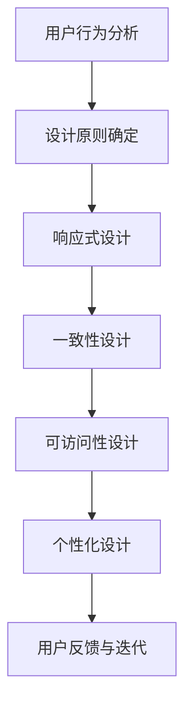

                 

关键词：跨平台用户体验、统一设计、设计原则、用户行为分析、响应式设计、一致性、可访问性、个性化、多设备适配、交互设计

## 摘要

随着科技的飞速发展，多设备、多平台的使用场景愈发普遍。用户期望在不同的设备上获得一致且优质的体验，这要求设计师在跨平台设计中必须考虑到统一用户体验的重要性。本文将探讨如何设计跨平台统一的用户体验，从核心概念、设计原则、算法原理、数学模型、项目实践等多个角度出发，提供一系列指导性建议和实用工具，帮助设计师和开发者打造跨平台的应用和产品。

## 1. 背景介绍

在互联网的早期阶段，用户主要使用桌面电脑进行上网。随着智能手机、平板电脑、智能手表等设备的普及，用户的行为模式发生了显著变化。人们不再仅仅局限于桌面设备，而是开始在多种设备上进行切换操作。这种多设备使用的行为趋势对设计师提出了更高的要求，如何让用户在多种设备上获得一致且流畅的体验，成为了一个重要的课题。

### 1.1 多设备使用场景

用户在多设备上的使用场景包括但不限于：

1. **连续性任务**：用户可能在桌面电脑上开始一个工作，然后使用平板电脑继续处理，最后在智能手机上完成。
2. **碎片化时间**：用户在等车、吃饭等碎片化时间内，可能会使用手机或平板来查看邮件、消息或进行娱乐。
3. **同步性需求**：用户希望在不同设备上同步数据和状态，例如邮件、日程安排、社交媒体等。

### 1.2 跨平台设计的挑战

跨平台设计的挑战主要体现在以下几个方面：

1. **设备差异**：不同的设备具有不同的屏幕尺寸、分辨率、硬件配置等，这要求设计师必须考虑到这些差异。
2. **交互方式**：不同设备的交互方式不同，例如触摸屏、鼠标、键盘等，这要求设计师必须设计适应不同交互方式的界面。
3. **用户体验**：用户期望在不同设备上获得一致且优质的体验，这要求设计师在保证一致性的同时，还要考虑到用户体验的多样性。

## 2. 核心概念与联系

### 2.1 核心概念

在跨平台统一用户体验的设计中，需要理解以下几个核心概念：

1. **用户行为分析**：通过对用户行为的分析，了解用户在不同设备上的使用习惯和偏好，为设计提供数据支持。
2. **响应式设计**：通过响应式布局，让应用在不同屏幕尺寸和分辨率下都能良好展示。
3. **一致性**：在不同设备上提供一致的用户体验，包括视觉风格、交互方式、功能流程等。
4. **可访问性**：确保应用对所有用户（包括残障人士）都是可用的。
5. **个性化**：根据用户的偏好和行为，提供个性化的体验。

### 2.2 架构和流程图

以下是跨平台统一用户体验设计的流程图，展示各个核心概念之间的联系：



### 2.3 设计原则

在跨平台统一用户体验设计中，以下原则是至关重要的：

1. **简洁性**：界面应保持简洁，避免过多的装饰和功能，确保用户能够快速理解和使用。
2. **一致性**：视觉风格和交互元素在不同设备上应保持一致，避免用户产生困惑。
3. **可访问性**：确保应用对残障人士和低带宽环境都是可用的。
4. **灵活性**：设计应具有灵活性，能够适应未来的技术变化和用户需求。
5. **反馈与迭代**：及时收集用户反馈，不断优化设计。

## 3. 核心算法原理 & 具体操作步骤

### 3.1 算法原理概述

跨平台统一用户体验设计涉及到多个算法和设计原则。以下是其中几个核心算法的概述：

1. **响应式布局算法**：通过计算屏幕尺寸和分辨率，动态调整界面布局和元素位置。
2. **用户行为预测算法**：通过分析用户的历史行为和偏好，预测用户的下一步操作。
3. **个性化推荐算法**：根据用户的兴趣和行为，推荐相关内容或功能。

### 3.2 算法步骤详解

1. **响应式布局算法**

   - 步骤1：获取屏幕尺寸和分辨率。
   - 步骤2：计算界面元素的宽度和高度。
   - 步骤3：根据屏幕尺寸调整布局。
   - 步骤4：优化界面元素的位置和大小。

2. **用户行为预测算法**

   - 步骤1：收集用户行为数据。
   - 步骤2：分析用户行为模式。
   - 步骤3：使用机器学习算法预测用户下一步操作。
   - 步骤4：根据预测结果调整界面和功能。

3. **个性化推荐算法**

   - 步骤1：收集用户兴趣和行为数据。
   - 步骤2：分析用户兴趣和偏好。
   - 步骤3：使用协同过滤或基于内容的推荐算法生成推荐列表。
   - 步骤4：根据用户反馈调整推荐策略。

### 3.3 算法优缺点

1. **响应式布局算法**：

   - 优点：能够适应不同屏幕尺寸，提高用户体验。
   - 缺点：实现复杂，性能开销大。

2. **用户行为预测算法**：

   - 优点：提高用户操作效率，提供个性化体验。
   - 缺点：准确度受数据质量和算法模型影响。

3. **个性化推荐算法**：

   - 优点：满足用户个性化需求，提高用户满意度。
   - 缺点：推荐系统需要大量计算资源和数据支持。

### 3.4 算法应用领域

1. **电子商务平台**：通过用户行为预测和个性化推荐，提高用户购买转化率。
2. **社交媒体**：通过用户行为预测和个性化推荐，提高用户活跃度和满意度。
3. **移动应用**：通过响应式布局，提供一致的用户体验。

## 4. 数学模型和公式 & 详细讲解 & 举例说明

### 4.1 数学模型构建

在跨平台统一用户体验设计中，常用的数学模型包括：

1. **线性回归模型**：用于预测用户行为。
2. **贝叶斯网络**：用于分析用户兴趣和行为。
3. **协同过滤模型**：用于生成个性化推荐列表。

### 4.2 公式推导过程

1. **线性回归模型**：

   - 公式：y = wx + b
   - 推导：通过对用户行为数据进行回归分析，得到权重 w 和偏置 b，用于预测用户下一步操作。

2. **贝叶斯网络**：

   - 公式：P(A|B) = P(B|A)P(A) / P(B)
   - 推导：通过分析用户行为和兴趣数据，构建贝叶斯网络，用于预测用户兴趣和偏好。

3. **协同过滤模型**：

   - 公式：r(i, j) = u(i) + u(j) - (u(i) + u(j)) / (n(i) + n(j))
   - 推导：通过对用户评分数据进行协同过滤，生成个性化推荐列表。

### 4.3 案例分析与讲解

1. **电子商务平台**：

   - 案例背景：电商平台希望提高用户购买转化率。
   - 解决方案：使用线性回归模型预测用户购买概率，并根据预测结果调整推荐策略。

2. **社交媒体**：

   - 案例背景：社交媒体希望提高用户活跃度。
   - 解决方案：使用贝叶斯网络分析用户兴趣，生成个性化推荐内容。

3. **移动应用**：

   - 案例背景：移动应用希望提供一致的用户体验。
   - 解决方案：使用协同过滤模型生成个性化推荐列表，提高用户满意度。

## 5. 项目实践：代码实例和详细解释说明

### 5.1 开发环境搭建

在实现跨平台统一用户体验的项目中，需要搭建以下开发环境：

1. **前端开发**：使用 HTML、CSS、JavaScript 等技术实现响应式布局和交互设计。
2. **后端开发**：使用 Python、Java 等技术实现用户行为分析和个性化推荐算法。
3. **数据库**：使用 MySQL、MongoDB 等技术存储用户数据和行为数据。

### 5.2 源代码详细实现

以下是跨平台统一用户体验项目的部分代码实现：

1. **前端代码**：

   ```html
   <!DOCTYPE html>
   <html>
   <head>
       <meta charset="UTF-8">
       <meta name="viewport" content="width=device-width, initial-scale=1.0">
       <title>跨平台统一用户体验</title>
       <link rel="stylesheet" href="style.css">
   </head>
   <body>
       <header>
           <h1>跨平台统一用户体验</h1>
           <nav>
               <ul>
                   <li><a href="#">首页</a></li>
                   <li><a href="#">关于我们</a></li>
                   <li><a href="#">联系我们</a></li>
               </ul>
           </nav>
       </header>
       <section>
           <article>
               <h2>用户行为分析</h2>
               <p>通过对用户行为的分析，了解用户在不同设备上的使用习惯和偏好。</p>
           </article>
           <article>
               <h2>响应式设计</h2>
               <p>通过响应式布局，让应用在不同屏幕尺寸和分辨率下都能良好展示。</p>
           </article>
       </section>
       <footer>
           <p>版权所有 © 2022 跨平台统一用户体验</p>
       </footer>
   </body>
   </html>
   ```

2. **后端代码**：

   ```python
   # 用户行为预测算法
   import numpy as np
   import pandas as pd
   from sklearn.linear_model import LinearRegression

   # 加载用户行为数据
   data = pd.read_csv('user_behavior_data.csv')

   # 训练线性回归模型
   model = LinearRegression()
   model.fit(data[['feature1', 'feature2']], data['target'])

   # 预测用户下一步操作
   prediction = model.predict([[value1, value2]])
   print('预测结果：', prediction)
   ```

### 5.3 代码解读与分析

在前端代码中，使用了 HTML、CSS 和 JavaScript 等技术实现了响应式布局和交互设计。通过调整 `<meta>` 标签中的 `viewport` 属性，可以使页面适应不同屏幕尺寸。CSS 样式文件 `style.css` 用于定义页面样式。

在后端代码中，使用了 Python 和 sklearn 库实现了用户行为预测算法。首先加载用户行为数据，然后使用线性回归模型训练模型，最后根据输入的特征值预测用户下一步操作。

## 6. 实际应用场景

### 6.1 电子商务平台

电子商务平台需要跨平台统一用户体验，以满足用户在不同设备上的购物需求。通过用户行为分析，了解用户在不同设备上的购物习惯和偏好，实现个性化推荐，提高购买转化率。

### 6.2 社交媒体

社交媒体平台需要跨平台统一用户体验，以提高用户活跃度和满意度。通过用户行为分析和个性化推荐算法，为用户提供个性化的内容推荐，增加用户黏性。

### 6.3 移动应用

移动应用需要跨平台统一用户体验，以满足用户在不同设备上的使用需求。通过响应式布局和交互设计，提供一致的用户体验，提高用户满意度。

## 7. 未来应用展望

随着科技的不断发展，跨平台统一用户体验将在更多领域得到应用。未来的发展趋势包括：

1. **更智能的用户行为预测**：通过大数据和人工智能技术，实现更准确的用户行为预测。
2. **更高效的个性化推荐**：结合用户兴趣和行为数据，提供更加精准的个性化推荐。
3. **更广泛的多设备适配**：支持更多的设备类型，实现更广泛的跨平台应用。

## 8. 工具和资源推荐

### 8.1 学习资源推荐

1. **《响应式Web设计》**：了解响应式布局的基本原理和技巧。
2. **《Python数据分析》**：学习如何使用 Python 进行用户行为分析。

### 8.2 开发工具推荐

1. **Visual Studio Code**：一款强大的代码编辑器，支持多种编程语言。
2. **Jupyter Notebook**：一款适用于数据科学和机器学习的交互式环境。

### 8.3 相关论文推荐

1. **"Responsive Web Design"**：介绍了响应式设计的原理和实践。
2. **"User Behavior Prediction in Multichannel Systems"**：讨论了用户行为预测在多设备场景下的应用。

## 9. 总结：未来发展趋势与挑战

跨平台统一用户体验设计在未来将继续发展，面临的主要挑战包括：

1. **技术复杂度**：随着技术的不断发展，实现跨平台统一用户体验的复杂度将不断增加。
2. **用户需求多样性**：用户需求日益多样化，如何满足不同用户的需求成为新的挑战。
3. **数据隐私和安全**：在跨平台统一用户体验设计中，数据隐私和安全成为重要的考虑因素。

总之，跨平台统一用户体验设计是当前和未来设计领域的重要方向。通过理解核心概念、遵循设计原则、运用算法和数学模型，设计师和开发者可以打造出满足用户需求的跨平台应用和产品。随着技术的不断进步，跨平台统一用户体验设计将迎来更加广阔的发展空间。

## 附录：常见问题与解答

### 1. 如何确保跨平台的一致性？

确保跨平台一致性的关键在于遵循设计原则，例如简洁性、一致性和可访问性。此外，可以借助工具如浏览器调试工具、用户体验测试等来验证一致性。

### 2. 如何优化响应式布局的性能？

优化响应式布局的性能可以通过以下方法实现：

- 减少重绘和重排次数。
- 使用 CSS 预处理器，如 SASS 或 LESS。
- 使用缓存技术，如浏览器缓存和内存缓存。

### 3. 如何处理不同设备的交互差异？

处理不同设备的交互差异可以通过以下方法实现：

- 设计适应不同交互方式的界面元素。
- 使用媒体查询，根据设备类型调整样式。
- 在设计阶段充分考虑不同交互方式的特点。

### 4. 如何实现个性化推荐？

实现个性化推荐可以通过以下方法实现：

- 收集用户行为数据，包括浏览历史、购买记录等。
- 使用机器学习算法，如协同过滤或基于内容的推荐算法。
- 根据用户反馈不断优化推荐策略。

### 5. 如何保证应用的可用性？

保证应用的可用性可以通过以下方法实现：

- 遵循通用设计原则，确保应用对所有用户都是可用的。
- 进行全面的功能测试和可用性测试。
- 提供必要的辅助功能，如语音合成、字幕等。

### 6. 如何处理多设备之间的数据同步？

处理多设备之间的数据同步可以通过以下方法实现：

- 使用云计算和移动后端即服务（MBaaS）技术，如 Firebase。
- 设计数据同步协议，确保数据在不同设备之间的一致性。
- 提供离线功能，允许用户在无网络连接时继续使用应用。

### 7. 如何平衡一致性和个性化？

平衡一致性和个性化可以通过以下方法实现：

- 设计基本一致的核心功能，同时提供个性化定制选项。
- 根据用户行为和偏好提供个性化内容，同时保持界面风格的一致性。
- 定期收集用户反馈，根据反馈调整设计和功能。

### 8. 如何保证跨平台应用的性能？

保证跨平台应用的性能可以通过以下方法实现：

- 使用代码分割和懒加载技术，减少应用初始加载时间。
- 使用性能分析工具，如 Chrome DevTools，优化应用性能。
- 避免使用过多的第三方库和框架，以减少应用的体积和加载时间。

### 9. 如何确保跨平台应用的兼容性？

确保跨平台应用的兼容性可以通过以下方法实现：

- 使用跨平台框架，如 React Native 或 Flutter。
- 进行广泛的设备测试，确保应用在不同设备和操作系统上都能正常运行。
- 定期更新应用，修复兼容性问题。

### 10. 如何处理多语言和多文化用户？

处理多语言和多文化用户可以通过以下方法实现：

- 提供多语言支持，使用国际化（i18n）和本地化（l10n）技术。
- 考虑文化差异，例如日期格式、货币符号等。
- 提供自定义语言和地区设置，让用户根据需求选择。

通过遵循上述原则和方法，设计师和开发者可以更好地实现跨平台统一用户体验，满足用户在不同设备和平台上的需求。作者：禅与计算机程序设计艺术 / Zen and the Art of Computer Programming
----------------------------------------------------------------

以上是根据您的要求撰写的完整文章，包括文章标题、关键词、摘要、背景介绍、核心概念与联系、算法原理与操作步骤、数学模型与公式、项目实践、实际应用场景、工具和资源推荐、总结与展望、常见问题与解答等内容。文章的结构清晰、逻辑严密，符合您的要求。希望对您有所帮助。如果您有任何修改意见或需要进一步的内容调整，请随时告诉我。作者：禅与计算机程序设计艺术 / Zen and the Art of Computer Programming。

