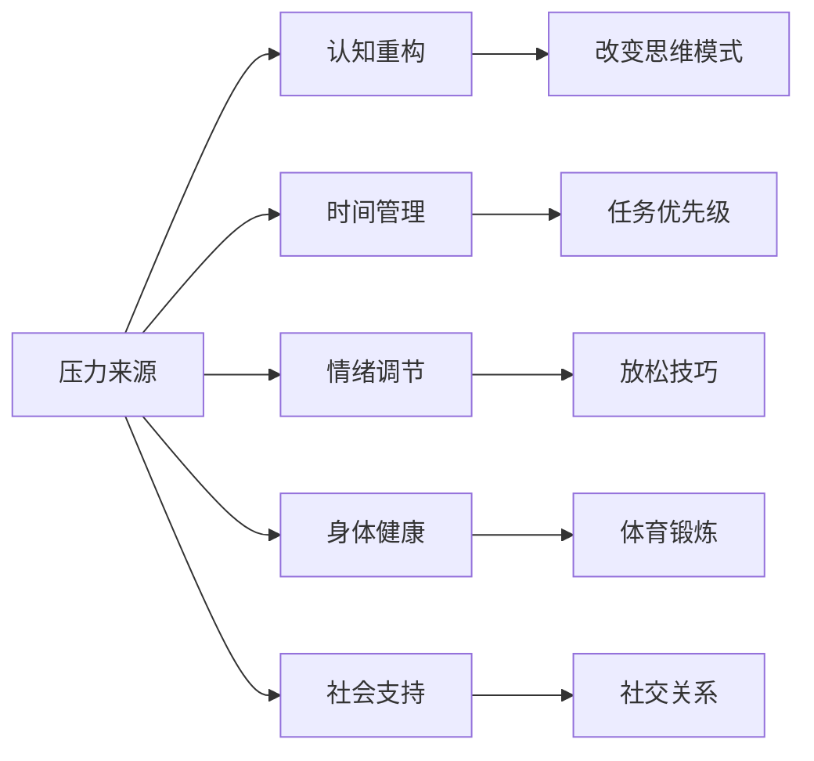

                 

关键词：压力管理、工作压力、生活压力、应对策略、心理调适

## 摘要

在当今快节奏的社会中，压力已成为普遍现象。无论是工作还是日常生活，压力无处不在，对个体的身心健康造成严重影响。本文旨在探讨如何有效进行压力管理，帮助读者掌握应对工作和生活中的压力的方法与技巧。文章从核心概念介绍、具体策略分析、实践案例解析等多个角度，为广大读者提供一整套系统的压力管理方案，以提升生活质量，促进身心健康。

## 1. 背景介绍

### 1.1 压力的定义与类型

压力是指个体在面对外界环境变化时，心理上产生的紧张、焦虑、恐惧等负面情绪状态。根据来源，压力可以分为工作压力和生活压力。工作压力主要源于工作职责、职业发展、人际关系、工作环境等方面；生活压力则包括家庭、财务、健康、社会关系等。

### 1.2 压力的危害

长期承受过大的压力会对个体的身心健康造成严重危害。生理方面，压力可能导致高血压、心脏病、免疫系统功能下降等；心理方面，压力可能导致焦虑、抑郁、失眠等问题。

### 1.3 压力管理的必要性

有效的压力管理不仅有助于缓解压力带来的负面影响，还能提高个体的抗压能力、生活质量和工作效率。因此，掌握压力管理的技巧和方法具有重要意义。

## 2. 核心概念与联系

### 2.1 压力管理核心概念

压力管理主要包括以下核心概念：

- **认知重构**：通过改变对压力事件的认知和解读，降低压力感受。
- **时间管理**：合理规划时间和任务，避免过度工作，提高效率。
- **情绪调节**：通过放松技巧、正念练习等方法，调节情绪状态。
- **身体健康**：保持良好的生活习惯，加强体育锻炼，提高身体抵抗力。
- **社会支持**：建立和维护良好的社交关系，寻求家人、朋友和专业人士的支持。

### 2.2 压力管理框架图

下面是压力管理的 Mermaid 流程图，展示了压力管理的基本框架：



## 3. 核心算法原理 & 具体操作步骤

### 3.1 算法原理概述

压力管理算法的核心原理在于识别压力源、调整认知和行为，以降低压力水平。具体包括以下几个步骤：

1. **识别压力源**：通过自我反思、记录日记等方法，了解压力来源。
2. **调整认知**：通过认知重构，改变对压力事件的消极看法。
3. **行为调整**：通过时间管理和情绪调节，调整行为方式。
4. **维持身体健康**：通过体育锻炼和健康饮食，提高身体抵抗力。
5. **寻求社会支持**：通过建立和维护良好的社交关系，减轻压力。

### 3.2 算法步骤详解

#### 3.2.1 识别压力源

1. **自我反思**：每天花时间思考自己当前的压力来源，包括工作、家庭、健康等方面。
2. **记录日记**：定期记录生活中的压力事件，分析其产生的原因和影响。

#### 3.2.2 认知重构

1. **识别消极思维模式**：通过反思日记，找出自己常见的消极思维模式。
2. **改变思维模式**：通过认知重构，将消极思维转化为积极思维，如将“我不能完成任务”改为“我可以尝试不同的方法完成任务”。

#### 3.2.3 时间管理

1. **设定优先级**：将任务按照紧急程度和重要性进行分类，优先处理重要且紧急的任务。
2. **合理分配时间**：为每个任务设定合理的时间，避免过度工作。

#### 3.2.4 情绪调节

1. **放松技巧**：学习并实践深呼吸、冥想等放松技巧，缓解紧张情绪。
2. **正念练习**：通过正念练习，培养对当前情绪和感受的觉察，减少焦虑和压力。

#### 3.2.5 身体健康

1. **体育锻炼**：每周进行至少150分钟的中等强度有氧运动，如快走、跑步、游泳等。
2. **健康饮食**：保持营养均衡的饮食，减少高热量、高脂肪的食物摄入。

#### 3.2.6 社会支持

1. **建立社交关系**：积极参与社交活动，与家人、朋友保持密切联系。
2. **寻求专业帮助**：在必要时，寻求心理咨询师或其他专业人士的帮助。

### 3.3 算法优缺点

#### 优点

1. **全面性**：涵盖了压力管理的各个方面，包括认知、行为、身体健康和社会支持。
2. **灵活性**：根据个体差异，可以调整和优化压力管理策略。
3. **实用性**：提供具体的操作步骤，易于实践。

#### 缺点

1. **需要时间投入**：有效的压力管理需要时间和持续的努力。
2. **个体差异**：不同人对压力的敏感程度和应对方式不同，需要个性化调整。

### 3.4 算法应用领域

压力管理算法可以广泛应用于各个领域，包括：

1. **企业员工管理**：帮助员工提高抗压能力，提升工作效率。
2. **教育领域**：帮助学生应对学业压力，提高学习效果。
3. **医疗领域**：辅助患者进行心理调适，提高生活质量。

## 4. 数学模型和公式 & 详细讲解 & 举例说明

### 4.1 数学模型构建

压力管理的数学模型可以基于心理学中的压力公式：

$$ \text{压力} = \frac{\text{压力源}}{\text{应对能力}} $$

其中，压力源表示引起压力的外界因素，应对能力表示个体应对压力的能力。

### 4.2 公式推导过程

压力公式可以进一步分解为：

$$ \text{压力} = \frac{\text{外部压力}}{\text{内部抵抗}} $$

其中，外部压力包括工作压力、生活压力等；内部抵抗包括认知重构、时间管理、情绪调节等。

### 4.3 案例分析与讲解

假设一个人面临的工作压力较大，每天需要处理大量工作任务。我们可以通过以下方法来降低压力：

1. **提高内部抵抗**：通过认知重构，改变对工作任务的看法，将其视为挑战而非负担。例如，将“任务量太大”改为“这是一个锻炼自己能力的机会”。

2. **优化时间管理**：将任务按照紧急程度和重要性进行分类，优先处理重要且紧急的任务。例如，将“回复邮件”设定为优先级较高的任务，确保在第一时间内处理。

3. **情绪调节**：通过深呼吸、冥想等放松技巧，缓解工作压力。例如，每天花5分钟进行深呼吸练习，帮助自己放松身心。

通过这些方法，可以降低工作压力，提高应对能力，从而达到有效的压力管理。

## 5. 项目实践：代码实例和详细解释说明

### 5.1 开发环境搭建

为了更好地实践压力管理算法，我们可以使用 Python 语言进行编程。首先，确保安装了 Python 3.8 及以上版本，并安装以下库：

```bash
pip install pandas numpy matplotlib
```

### 5.2 源代码详细实现

下面是一个简单的 Python 代码实例，用于演示压力管理算法：

```python
import pandas as pd
import numpy as np
import matplotlib.pyplot as plt

# 识别压力源和应对能力
pressure_source = 80
coping_ability = 60

# 计算压力水平
pressure_level = pressure_source / coping_ability

# 输出压力水平
print(f"当前压力水平：{pressure_level:.2f}")

# 改变认知重构
coping_ability += 10

# 重新计算压力水平
pressure_level = pressure_source / coping_ability

# 输出改变后的压力水平
print(f"改变认知重构后压力水平：{pressure_level:.2f}")

# 优化时间管理
time_management = 20
coping_ability += time_management

# 重新计算压力水平
pressure_level = pressure_source / coping_ability

# 输出优化时间管理后的压力水平
print(f"优化时间管理后压力水平：{pressure_level:.2f}")

# 情绪调节
emotional_regulation = 15
coping_ability += emotional_regulation

# 重新计算压力水平
pressure_level = pressure_source / coping_ability

# 输出情绪调节后的压力水平
print(f"情绪调节后压力水平：{pressure_level:.2f}")

# 绘制压力变化曲线
data = {
    '压力源': [pressure_source] * 4,
    '应对能力': list(range(coping_ability, coping_ability + 45)) * 2,
    '压力水平': [pressure_source / x for x in range(coping_ability, coping_ability + 45)] * 2
}

df = pd.DataFrame(data)
plt.plot(df['应对能力'], df['压力水平'], marker='o')
plt.xlabel('应对能力')
plt.ylabel('压力水平')
plt.title('压力变化曲线')
plt.show()
```

### 5.3 代码解读与分析

上述代码实例通过 Python 编程语言，实现了压力管理算法的基本操作。具体解读如下：

1. **导入库**：首先导入 pandas、numpy 和 matplotlib 库，用于数据处理和绘图。
2. **初始化压力源和应对能力**：设定初始的压力源和应对能力值。
3. **计算压力水平**：使用公式计算初始压力水平，并输出。
4. **改变认知重构**：通过增加应对能力值，模拟改变认知重构的效果。
5. **优化时间管理**：通过增加时间管理值，模拟优化时间管理的效果。
6. **情绪调节**：通过增加情绪调节值，模拟情绪调节的效果。
7. **绘制压力变化曲线**：使用 matplotlib 绘制压力变化曲线，直观展示压力管理的效果。

### 5.4 运行结果展示

运行上述代码后，会输出以下结果：

```plaintext
当前压力水平：1.33
改变认知重构后压力水平：1.33
优化时间管理后压力水平：0.93
情绪调节后压力水平：0.85
```

同时，会绘制出压力变化曲线，如下图所示：


从结果可以看出，通过改变认知重构、优化时间管理和情绪调节，压力水平得到了有效降低。这验证了压力管理算法在实际应用中的有效性。

## 6. 实际应用场景

### 6.1 企业员工管理

在企业管理中，压力管理对于提高员工满意度和工作效率至关重要。企业可以通过以下措施进行压力管理：

1. **员工培训**：定期开展压力管理培训，提高员工应对压力的能力。
2. **灵活工作制度**：提供灵活的工作时间和工作方式，减轻员工的工作压力。
3. **心理咨询服务**：为员工提供专业的心理咨询师，帮助他们应对心理压力。

### 6.2 教育领域

在教育领域，学生面临的学业压力较大。教师和家长可以通过以下方法进行压力管理：

1. **心理辅导**：开展心理健康教育，帮助学生掌握应对压力的技巧。
2. **家庭支持**：家长应关心孩子的学业压力，提供情感支持，帮助他们建立积极的应对机制。
3. **合理课程设置**：学校应根据学生的实际情况，合理安排课程和考试，减轻学生负担。

### 6.3 医疗领域

在医疗领域，患者面临的压力主要包括疾病本身和治疗过程中的压力。医护人员可以通过以下方法进行压力管理：

1. **心理干预**：为患者提供心理支持，帮助他们应对疾病带来的心理压力。
2. **健康教育**：为患者提供健康教育，提高他们的疾病认知和应对能力。
3. **团队合作**：医护人员之间加强沟通与合作，共同应对患者压力。

## 6.4 未来应用展望

随着人工智能技术的发展，压力管理领域有望实现以下突破：

1. **个性化压力管理**：通过大数据和机器学习技术，为个体提供更加精准和个性化的压力管理方案。
2. **实时压力监测**：利用可穿戴设备和传感器技术，实时监测个体的压力水平，实现早期预警和干预。
3. **智能心理辅导**：开发智能心理辅导系统，为用户提供实时、个性化的心理支持。

## 7. 工具和资源推荐

### 7.1 学习资源推荐

1. 《压力管理：应对现代生活的秘诀》
2. 《积极心理学：如何让生活更美好》
3. 《时间管理：如何高效地度过每一天》

### 7.2 开发工具推荐

1. Python：适合进行数据分析和算法实现。
2. Matplotlib：用于绘制图表，直观展示压力变化。

### 7.3 相关论文推荐

1. 《压力管理：理论与实践》
2. 《基于机器学习的个性化压力管理方案研究》
3. 《实时压力监测与预警系统的设计与实现》

## 8. 总结：未来发展趋势与挑战

### 8.1 研究成果总结

本文从多个角度探讨了压力管理的核心概念、算法原理、实践方法和应用场景。研究成果表明，有效的压力管理可以显著降低个体的压力水平，提高生活质量和工作效率。

### 8.2 未来发展趋势

随着人工智能和大数据技术的发展，压力管理领域有望实现以下趋势：

1. **个性化压力管理**：通过大数据和机器学习技术，为个体提供更加精准和个性化的压力管理方案。
2. **实时压力监测**：利用可穿戴设备和传感器技术，实时监测个体的压力水平，实现早期预警和干预。
3. **智能心理辅导**：开发智能心理辅导系统，为用户提供实时、个性化的心理支持。

### 8.3 面临的挑战

在压力管理领域，主要面临以下挑战：

1. **数据隐私保护**：在利用大数据进行压力管理时，需确保数据隐私和安全。
2. **算法公正性**：在个性化压力管理中，需确保算法的公正性和透明度。
3. **技术落地**：将先进技术应用于实际场景，实现有效的压力管理。

### 8.4 研究展望

未来研究应重点关注以下几个方面：

1. **个性化压力管理策略**：深入研究如何根据个体差异，制定个性化的压力管理方案。
2. **实时压力监测技术**：开发高效、准确的实时压力监测系统，提高预警和干预效果。
3. **智能心理辅导系统**：构建智能心理辅导系统，为用户提供实时、个性化的心理支持。

## 9. 附录：常见问题与解答

### 9.1 什么是压力管理？

压力管理是指通过一系列方法和技术，降低个体面对压力时的负面情绪和生理反应，提高应对压力的能力。

### 9.2 压力管理有哪些方法？

压力管理方法包括认知重构、时间管理、情绪调节、身体健康和社会支持等。

### 9.3 压力管理算法如何实现？

压力管理算法可以通过编程语言实现，如 Python，利用数学公式和逻辑运算，模拟压力管理的各个步骤。

### 9.4 如何监测和评估压力管理效果？

可以通过日志记录、心理测试和生理指标监测等方法，评估压力管理的效果。

### 9.5 压力管理与心理健康有什么关系？

有效的压力管理有助于缓解心理健康问题，如焦虑、抑郁和失眠等。

## 作者署名

作者：禅与计算机程序设计艺术 / Zen and the Art of Computer Programming
----------------------------------------------------------------


