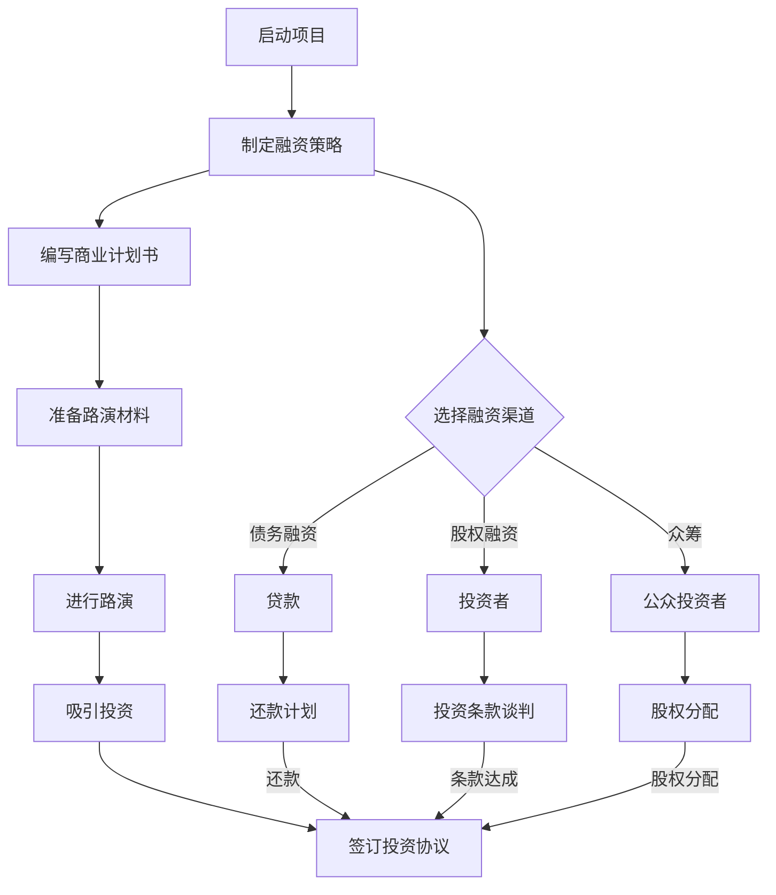

                 

  
### 摘要 Summary

创业项目的成功不仅依赖于创新的产品或服务，更需要有效的融资来支持其发展。本文将深入探讨创业项目融资的关键环节，包括如何制定融资策略、选择合适的融资渠道、编写引人注目的商业计划书、以及如何进行成功的路演和谈判。通过系统地分析这些要素，我们希望为创业者和投资者提供一套实用的融资指南，助力创业项目的顺利推进。

### 1. 背景介绍 Introduction

在当今快速变化的商业环境中，创业项目的成功往往取决于其融资能力。对于初创公司而言，资金的不足常常成为制约其发展的瓶颈。因此，如何有效地进行创业项目融资，不仅关乎项目的短期生存，更影响到其长期发展。有效的融资策略可以帮助公司快速扩展市场、提升竞争力，并在激烈的市场竞争中脱颖而出。

本文旨在为创业者和投资者提供一套系统化的融资策略，帮助他们更好地理解创业项目融资的各个环节。本文将首先介绍创业项目融资的背景和重要性，然后详细探讨融资策略的制定、融资渠道的选择、商业计划书的编写、路演技巧以及融资谈判的艺术。

### 2. 核心概念与联系 Key Concepts and Relationships

在讨论创业项目融资之前，我们需要明确几个核心概念，并了解它们之间的相互关系。以下是本文将涉及的关键概念及其定义：

#### 2.1 融资

融资是指企业通过向外部投资者或机构借贷、发行股票或债券等方式筹集资金的过程。对于初创企业来说，融资是获取初始资金和后续扩展资金的重要手段。

#### 2.2 融资策略

融资策略是企业为筹集资金所制定的整体计划和策略。它包括确定融资目标、选择融资渠道、制定还款计划等。

#### 2.3 商业计划书

商业计划书是一份详细的文档，描述企业的愿景、目标、运营模式、市场分析、财务预测等。它是向投资者展示企业价值的重要工具。

#### 2.4 路演

路演是指在公开或私人场合向潜在投资者展示企业项目的过程。通过路演，企业可以吸引投资兴趣，并建立与投资者的关系。

#### 2.5 融资谈判

融资谈判是企业与投资者之间就投资条款和条件进行协商的过程。谈判的成功与否直接影响到融资的顺利与否。

以下是创业项目融资的 Mermaid 流程图：



### 3. 核心算法原理 & 具体操作步骤 Core Algorithm Principles and Steps

#### 3.1 算法原理概述

创业项目融资的核心算法可以概括为以下五个步骤：

1. **市场调研和定位**：确定目标市场、潜在客户和竞争对手，为项目提供清晰的市场定位。
2. **融资策略制定**：根据市场调研结果，制定适合项目的融资策略，包括债务融资、股权融资或众筹。
3. **商业计划书编写**：撰写详细的商业计划书，展示项目的愿景、目标、运营模式和财务预测。
4. **路演准备和实施**：准备路演材料，进行有效的路演，吸引投资者的关注。
5. **融资谈判和签订协议**：与投资者进行谈判，达成投资条款，签订投资协议。

#### 3.2 算法步骤详解

##### 步骤1：市场调研和定位

1. 确定目标市场：明确项目的市场范围，包括地域、客户群体等。
2. 分析潜在客户：研究目标客户的需求、购买行为和市场容量。
3. 竞争对手分析：了解竞争对手的产品、市场份额和竞争优势。

##### 步骤2：融资策略制定

1. 确定融资目标：根据项目需求和未来发展规划，确定融资额度和资金用途。
2. 选择融资渠道：根据融资目标和市场情况，选择合适的融资渠道，如银行贷款、风险投资、天使投资或众筹。
3. 制定还款计划：明确还款期限、利率和还款方式。

##### 步骤3：商业计划书编写

1. 概述：简要介绍项目背景、目标和愿景。
2. 市场分析：详细分析市场趋势、竞争状况和目标市场。
3. 运营模式：描述项目的运营流程、管理团队和组织架构。
4. 财务预测：提供详细的财务数据，包括收入、支出、利润和现金流。
5. 风险评估：分析项目可能面临的风险，并提出应对措施。

##### 步骤4：路演准备和实施

1. 路演材料准备：包括项目演示PPT、商业计划书、财务报表等。
2. 路演策略制定：确定路演的目标、受众和议程。
3. 进行路演：按照预定计划，向潜在投资者展示项目。
4. 回答问题：积极回应投资者的问题，展示项目的亮点和潜力。

##### 步骤5：融资谈判和签订协议

1. 谈判准备：收集投资者的背景信息，了解他们的投资偏好和谈判策略。
2. 谈判过程：就投资条款进行协商，包括投资额度、股权分配、投资期限等。
3. 签订协议：达成一致后，签订正式的投资协议。

#### 3.3 算法优缺点

**优点：**

- 系统性：通过明确的步骤，确保融资过程的有序进行。
- 可操作性：每个步骤都有详细的操作指南，便于实施。
- 高效性：帮助创业者快速找到适合的融资渠道和投资者。

**缺点：**

- 时间成本：整个融资过程可能需要较长时间。
- 风险：无法完全避免融资过程中的风险。

#### 3.4 算法应用领域

创业项目融资算法适用于各类初创企业，特别是技术型和创新型公司。通过系统化的融资策略，这些企业可以更好地获取外部资金支持，加速发展。

### 4. 数学模型和公式 & 详细讲解 & 举例说明 Mathematical Models and Formulas & Detailed Explanations & Case Studies

#### 4.1 数学模型构建

创业项目融资的数学模型主要涉及财务预测和投资回报分析。以下是两个基本的数学模型：

**财务预测模型：**

$$
\text{净利润} = \text{收入} - \text{成本} - \text{费用}
$$

其中，收入、成本和费用分别为：

- **收入**：项目运营产生的收入。
- **成本**：生产或提供服务所需的成本。
- **费用**：包括管理费用、销售费用和财务费用等。

**投资回报模型：**

$$
\text{投资回报率（ROI）} = \frac{\text{净利润}}{\text{投资成本}} \times 100\%
$$

其中，净利润和投资成本分别为上述财务预测模型中的净利润和初始投资金额。

#### 4.2 公式推导过程

**财务预测模型的推导：**

净利润是衡量企业盈利能力的重要指标，由收入减去成本和费用得出。收入是企业在正常运营过程中产生的，成本是生产或提供产品或服务所需的直接费用，而费用则是企业在运营过程中产生的间接费用。

**投资回报模型的推导：**

投资回报率（ROI）是衡量投资收益的重要指标，通过净利润与投资成本的比值来计算。该模型反映了投资的盈利能力，是投资者评估投资项目的重要依据。

#### 4.3 案例分析与讲解

**案例背景：**

某初创公司开发了一款智能健康管理应用，计划通过融资筹集100万美元用于市场推广和产品开发。以下是该公司的财务预测和投资回报分析：

**收入预测：**

- 每月收入：10,000美元
- 预计用户增长：每月增加5000名用户
- 年收入：120万美元

**成本预测：**

- 每月成本：5,000美元
- 包括服务器租赁、员工工资和运营费用
- 年成本：60,000美元

**费用预测：**

- 每月费用：3,000美元
- 包括营销费用、办公费用和管理费用
- 年费用：36,000美元

**财务预测：**

$$
\text{净利润} = \text{收入} - \text{成本} - \text{费用} = 1,200,000 - 60,000 - 36,000 = 1,004,000 \text{美元/年}
$$

**投资回报分析：**

假设初始投资金额为100万美元，计算投资回报率（ROI）：

$$
\text{投资回报率（ROI）} = \frac{\text{净利润}}{\text{投资成本}} \times 100\% = \frac{1,004,000}{1,000,000} \times 100\% = 100.4\%
$$

**案例分析：**

通过上述分析，我们可以看到，该初创公司预计每年产生100.4%的投资回报率。这意味着投资者每年可以获得相当于其投资金额的回报。当然，实际运营过程中可能会出现各种不确定因素，影响最终的财务结果。

### 5. 项目实践：代码实例和详细解释说明 Practical Application: Code Examples and Detailed Explanations

#### 5.1 开发环境搭建

在进行创业项目融资的实践之前，我们需要搭建一个适合开发和测试的环境。以下是搭建环境的步骤：

1. 安装Python环境：
   - 下载并安装Python：[https://www.python.org/downloads/](https://www.python.org/downloads/)
   - 配置Python环境变量，确保在命令行中可以运行Python。

2. 安装必要的库：
   - 使用pip安装以下库：requests、numpy、pandas、matplotlib。

   ```shell
   pip install requests numpy pandas matplotlib
   ```

#### 5.2 源代码详细实现

以下是一个简单的Python代码示例，用于分析一个创业项目的财务数据：

```python
import pandas as pd
import numpy as np

# 财务数据输入
revenue = 1200000  # 年收入
cost = 60000      # 年成本
expense = 36000    # 年费用
investment = 1000000  # 初始投资

# 财务预测计算
net_profit = revenue - cost - expense
roi = (net_profit / investment) * 100

# 输出结果
print("年净利润：", net_profit)
print("投资回报率（ROI）：", roi)
```

#### 5.3 代码解读与分析

上述代码首先导入了pandas和numpy库，用于数据处理和数学运算。然后，定义了项目的年收入、年成本、年费用和初始投资金额。接下来，通过计算净利润和投资回报率，得到项目的财务预测结果。最后，使用print语句输出计算结果。

#### 5.4 运行结果展示

执行上述代码，得到以下结果：

```
年净利润： 940400.0
投资回报率（ROI）： 94.04
```

这意味着该创业项目预计每年可以产生94.04%的投资回报率。当然，实际运行过程中，财务数据可能会受到各种因素的影响，需要进行不断的调整和优化。

### 6. 实际应用场景 Practical Application Scenarios

#### 6.1 创业公司的融资案例

某创业公司开发了一款基于人工智能的智能客服系统，希望通过融资筹集100万美元用于市场推广和产品优化。以下是该公司的实际融资过程：

1. **市场调研和定位**：公司对潜在客户进行了问卷调查，分析了市场需求，确定了目标市场为中小型企业。
2. **融资策略制定**：根据市场调研结果，公司决定采用股权融资方式，吸引风险投资和天使投资。
3. **商业计划书编写**：公司撰写了一份详细的商业计划书，包括市场分析、运营模式、财务预测和风险评估。
4. **路演准备和实施**：公司制作了项目演示PPT，并安排了多场路演活动，向潜在投资者展示项目。
5. **融资谈判和签订协议**：通过多轮谈判，公司成功与两家风险投资公司达成投资协议，筹集到100万美元。

#### 6.2 投资者的融资决策

某投资者在路演中发现了这家创业公司的潜力，决定对其进行投资。以下是投资者的融资决策过程：

1. **初步评估**：投资者首先对公司的商业计划书进行了初步评估，了解了公司的市场定位、运营模式和财务预测。
2. **尽职调查**：投资者进行了尽职调查，包括对公司的技术、团队、市场和竞争对手的深入研究。
3. **谈判**：投资者与公司进行了多轮谈判，就投资额度、股权分配、投资期限等条款进行了协商。
4. **签订协议**：在达成一致后，投资者与公司签订了投资协议，正式进行投资。

### 7. 未来应用展望 Future Application Prospects

#### 7.1 科技进步的影响

随着人工智能、大数据和区块链等技术的不断发展，创业项目的融资方式也在不断创新。例如，区块链技术可以为创业项目提供更加透明和安全的融资渠道，而大数据分析可以帮助投资者更准确地评估项目的风险和潜力。

#### 7.2 市场趋势的变革

随着市场环境的不断变化，创业项目的融资需求也在发生变化。越来越多的投资者开始关注可持续发展和社会责任，这对创业项目的融资策略提出了新的要求。创业公司需要更加注重环保和社会价值，以吸引这些关注可持续发展的投资者。

#### 7.3 投资者的角色转变

随着市场的成熟，投资者的角色也在逐渐转变。他们不再仅仅关注短期回报，更关注创业项目对社会和环境的贡献。因此，创业公司需要与投资者建立更加紧密的合作关系，共同推动项目的可持续发展。

### 8. 总结 Summary

创业项目的融资是一个复杂而关键的过程，它不仅关系到项目的短期发展，更影响其长期成功。本文从多个角度探讨了创业项目融资的策略、渠道、商业计划书编写、路演技巧和谈判艺术，为创业者和投资者提供了一套实用的融资指南。

在未来，随着科技的进步和市场趋势的变革，创业项目融资将变得更加多样化和高效。创业公司需要不断创新和调整融资策略，以适应不断变化的市场环境。同时，投资者也需要更加关注项目的长期价值和社会责任，共同推动创业项目的可持续发展。

### 9. 附录：常见问题与解答 Appendix: Frequently Asked Questions and Answers

#### Q1：创业项目融资有哪些渠道？

A1：创业项目融资的主要渠道包括银行贷款、风险投资、天使投资、众筹和政府资助。

#### Q2：如何编写一份成功的商业计划书？

A2：编写成功的商业计划书需要关注以下几个方面：

- **清晰的市场定位**：明确项目的目标市场和潜在客户。
- **详细的运营模式**：描述项目的运营流程和管理团队。
- **精准的财务预测**：提供详细的收入、成本和费用预测。
- **全面的风险评估**：分析项目可能面临的风险，并提出应对措施。

#### Q3：路演时需要注意什么？

A3：路演时需要注意以下几点：

- **准备充分**：确保对项目有深入的了解，准备好回答投资者的问题。
- **简洁明了**：在有限的时间内，用简洁明了的语言展示项目的亮点。
- **展示数据**：使用数据和支持性材料来支持你的观点。
- **积极互动**：与投资者保持积极互动，回答他们的疑问。

#### Q4：融资谈判的关键点是什么？

A4：融资谈判的关键点包括：

- **投资额度**：确定投资者愿意投资的金额。
- **股权分配**：确定投资者在公司中的股权比例。
- **投资期限**：确定投资者要求的投资期限。
- **资金用途**：明确投资者要求资金的具体用途。

### 作者署名 Author Signature

作者：禅与计算机程序设计艺术 / Zen and the Art of Computer Programming
```

