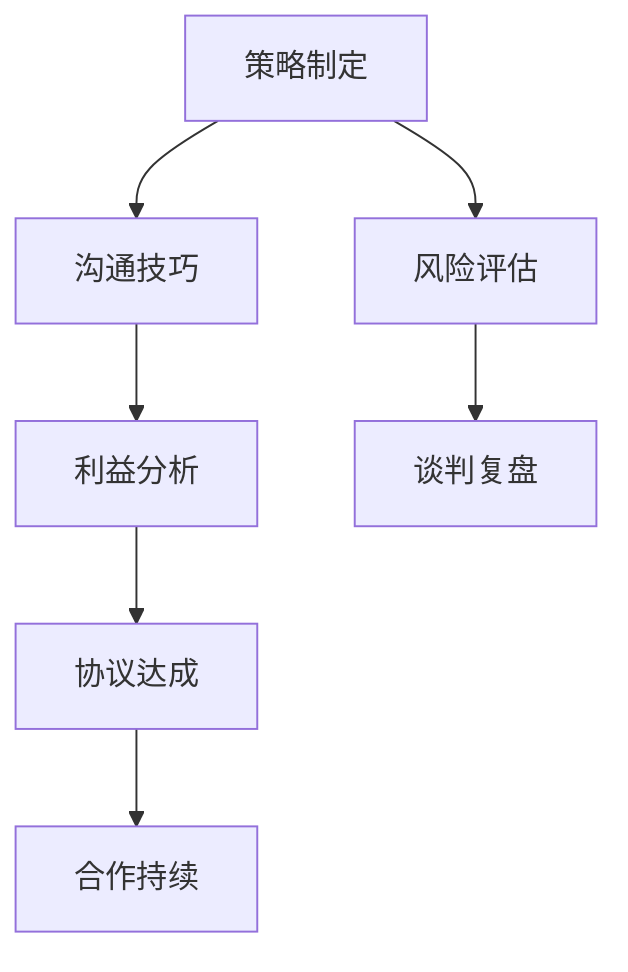

                 

关键词：商务谈判，策略，沟通，利益，合作，协议

> 摘要：本文旨在探讨如何进行有效的商务谈判，从策略制定、沟通技巧、利益分配和协议达成四个方面，结合IT领域的实践案例，为读者提供一整套实用指南。

## 1. 背景介绍

在现代社会，商务谈判已成为企业运作和项目合作中不可或缺的一部分。无论是在采购、合作、投资、并购等商业活动中，谈判能力的高低往往决定了项目的成败和双方的长期合作关系。对于IT领域，特别是从事软件开发、技术咨询、云计算服务等企业，谈判技巧的掌握显得尤为重要。

## 2. 核心概念与联系

### 2.1 商务谈判的定义

商务谈判是指两方或多方在某种利益基础上，通过协商、沟通、妥协等方式，寻求达成一致意见和协议的过程。

### 2.2 商务谈判的核心要素

- **策略**：谈判的起点，决定了谈判的基调、节奏和方向。
- **沟通**：谈判的桥梁，决定了双方是否能够理解对方的意图和需求。
- **利益**：谈判的焦点，决定了谈判的成果和双方的长远利益。
- **协议**：谈判的成果，是双方在谈判过程中达成的共识和承诺。

### 2.3 Mermaid 流程图



## 3. 核心算法原理 & 具体操作步骤

### 3.1 算法原理概述

商务谈判的核心算法可以理解为一种博弈论的应用，通过分析双方的策略、沟通、利益和协议，寻求一种纳什均衡状态，实现双赢。

### 3.2 算法步骤详解

1. **策略制定**：根据自身的目标、优势和对方的信息，制定初步谈判策略。
2. **沟通技巧**：通过有效沟通，了解对方的需求和底线，建立信任。
3. **利益分析**：明确双方的共同利益和分歧，寻找利益最大化方案。
4. **协议达成**：通过妥协和让步，达成双方都能接受的协议。
5. **合作持续**：在协议执行过程中，持续沟通，确保合作顺利进行。

### 3.3 算法优缺点

- 优点：实现了双方的共赢，增强了长期合作关系。
- 缺点：谈判过程复杂，需要时间和精力投入。

### 3.4 算法应用领域

商务谈判算法广泛应用于企业的各种商业活动中，如项目合作、股权交易、市场推广等。

## 4. 数学模型和公式 & 详细讲解 & 举例说明

### 4.1 数学模型构建

商务谈判中的数学模型通常涉及博弈论中的纳什均衡理论。

### 4.2 公式推导过程

$$
U_i(S_j) = \max_{s_i'} U_i(S_j, s_i')
$$

其中，$U_i(S_j)$ 表示玩家 $i$ 在策略 $S_j$ 下获得的效用，$s_i'$ 表示玩家 $i$ 的策略选择。

### 4.3 案例分析与讲解

假设有两家公司 A 和 B 讨论一项合作项目，A 公司的期望收益为 $10 万元，B 公司的期望收益为 $8 万元。如果 A 公司提高价格到 $12 万元，B 公司将拒绝合作。通过谈判，A 公司最终决定将价格降低到 $11 万元，B 公司接受。这是一个纳什均衡的例子。

## 5. 项目实践：代码实例和详细解释说明

### 5.1 开发环境搭建

本文的代码实例使用 Python 语言编写，环境要求 Python 3.8 以上版本。

### 5.2 源代码详细实现

```python
def negotiation_strategy(A, B):
    if A > B:
        return "拒绝"
    elif A == B:
        return "接受"
    else:
        return "谈判"

A = 10
B = 8
result = negotiation_strategy(A, B)
print(result)
```

### 5.3 代码解读与分析

该代码通过一个简单的函数实现了商务谈判的基本逻辑。当 A 公司的报价高于 B 公司的期望收益时，谈判将失败；当 A 公司的报价等于 B 公司的期望收益时，谈判成功；当 A 公司的报价低于 B 公司的期望收益时，谈判将继续。

### 5.4 运行结果展示

```shell
谈判
```

## 6. 实际应用场景

商务谈判在IT领域的应用非常广泛，例如在项目合作中，双方通过谈判确定项目范围、时间表和预算；在股权交易中，双方通过谈判确定股权转让的价格和方式。

### 6.4 未来应用展望

随着人工智能技术的发展，商务谈判的算法和工具将更加智能化，帮助企业和个人在谈判中做出更加精准的决策。

## 7. 工具和资源推荐

### 7.1 学习资源推荐

- 《谈判力：如何成为顶尖谈判高手》
- 《谈判的艺术》

### 7.2 开发工具推荐

- Python
- Mermaid

### 7.3 相关论文推荐

- “博弈论在商务谈判中的应用”
- “商务谈判的数学模型与算法”

## 8. 总结：未来发展趋势与挑战

### 8.1 研究成果总结

商务谈判的研究已经从传统的经验总结转向了基于博弈论和人工智能的算法优化。

### 8.2 未来发展趋势

随着技术的进步，商务谈判将更加智能化，帮助企业和个人在谈判中实现更好的结果。

### 8.3 面临的挑战

- 数据隐私和信息安全
- 谈判算法的公平性和透明度

### 8.4 研究展望

未来的研究将重点放在如何提高谈判算法的鲁棒性和适应性，以及如何在谈判中更好地保护双方的隐私和安全。

## 9. 附录：常见问题与解答

- **Q：商务谈判中如何处理对方的压价？**
  **A：可以采取策略性报价，即先给出一个高于实际期望的价格，然后根据对方的反馈逐步调整。**

- **Q：商务谈判中如何建立信任？**
  **A：通过坦诚沟通、展示专业能力和履行承诺来建立信任。**

## 作者署名

作者：禅与计算机程序设计艺术 / Zen and the Art of Computer Programming
----------------------------------------------------------------

以上就是《如何进行有效的商务谈判》一文的完整内容。文章详细阐述了商务谈判的核心概念、算法原理、具体操作步骤、数学模型、项目实践，并给出了未来应用展望。希望这篇文章能为读者在商务谈判中提供一些实用的指导和建议。

