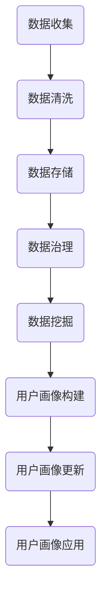

                 

关键词：用户画像、数据更新、数据治理、机器学习、用户行为分析、个性化推荐

> 摘要：本文将探讨如何有效地进行用户画像的更新，包括用户画像的定义、核心概念、算法原理、数学模型以及实际应用场景。通过详细分析用户画像的更新策略，读者可以更好地理解如何利用技术手段提高用户画像的准确性和实用性。

## 1. 背景介绍

在数字化时代，用户画像作为一种重要的数据分析工具，被广泛应用于市场营销、用户行为分析、个性化推荐等多个领域。用户画像通过收集和分析用户在互联网上的行为数据，构建出一个全面的用户行为模型，从而帮助企业更好地理解用户需求，提供更精准的服务和产品推荐。

用户画像的构建是一个动态的过程，随着时间的推移和数据量的增加，用户画像需要不断地更新和优化，以确保其准确性和实用性。有效的用户画像更新不仅能够提高用户的满意度，还能为企业带来更大的商业价值。

本文将围绕如何进行有效的用户画像更新进行探讨，包括核心概念、算法原理、数学模型以及实际应用场景。希望通过本文的阐述，读者能够更好地掌握用户画像更新的方法和技术。

## 2. 核心概念与联系

### 2.1 用户画像的定义

用户画像是指通过收集用户在互联网上的行为数据，构建出一个反映用户特征和行为的模型。用户画像通常包含用户的基本信息、兴趣爱好、行为习惯、消费能力等多个维度。

### 2.2 核心概念

- **数据来源**：用户画像的数据来源主要包括用户行为数据、社交网络数据、用户反馈数据等。
- **数据质量**：数据质量是用户画像准确性的基础。高质量的数据能够提高用户画像的准确性和实用性。
- **数据治理**：数据治理是指对数据进行管理、控制和维护的过程。良好的数据治理能够确保用户画像数据的可靠性和一致性。
- **数据更新频率**：数据更新频率是指用户画像更新的速度。合适的更新频率能够保证用户画像的实时性和准确性。

### 2.3 Mermaid 流程图

下面是一个简单的 Mermaid 流程图，展示了用户画像更新的核心概念和流程。



## 3. 核心算法原理 & 具体操作步骤

### 3.1 算法原理概述

用户画像更新主要依赖于数据挖掘和机器学习技术。具体来说，包括以下步骤：

1. **数据收集**：收集用户在互联网上的行为数据，包括浏览记录、搜索历史、消费记录等。
2. **数据清洗**：清洗数据，去除重复、错误和缺失的数据，确保数据质量。
3. **数据存储**：将清洗后的数据存储到数据库中，以便后续处理。
4. **数据治理**：对数据进行管理和控制，确保数据的一致性和可靠性。
5. **数据挖掘**：使用机器学习算法对数据进行挖掘，提取用户特征和行为模式。
6. **用户画像构建**：根据挖掘结果构建用户画像，包括基本信息、兴趣爱好、行为习惯等。
7. **用户画像更新**：定期更新用户画像，以反映用户的最新行为和需求。

### 3.2 算法步骤详解

#### 3.2.1 数据收集

数据收集是用户画像更新的第一步。常用的数据来源包括：

- 用户行为数据：如浏览记录、搜索历史、消费记录等。
- 社交网络数据：如微博、微信等社交平台的行为数据。
- 用户反馈数据：如用户评价、反馈等。

#### 3.2.2 数据清洗

数据清洗是保证数据质量的关键步骤。主要包括以下内容：

- 去重：去除重复的数据，避免重复计算。
- 填补缺失值：使用统计方法或预测模型填补缺失值。
- 错误修正：修正数据中的错误，如格式错误、拼写错误等。

#### 3.2.3 数据存储

数据存储是将清洗后的数据存储到数据库中，以便后续处理。常用的数据库包括关系型数据库和NoSQL数据库。

#### 3.2.4 数据治理

数据治理是对数据进行管理和控制，确保数据的一致性和可靠性。主要包括以下内容：

- 数据标准：制定数据标准和规范，确保数据的一致性。
- 数据权限：设置数据权限，确保数据的安全性和隐私性。
- 数据审计：定期审计数据，确保数据的准确性和完整性。

#### 3.2.5 数据挖掘

数据挖掘是使用机器学习算法对数据进行挖掘，提取用户特征和行为模式。常用的算法包括聚类分析、关联规则挖掘、分类算法等。

#### 3.2.6 用户画像构建

根据数据挖掘的结果构建用户画像，包括基本信息、兴趣爱好、行为习惯等。用户画像通常以数据结构的形式存储，如JSON、XML等。

#### 3.2.7 用户画像更新

用户画像更新是定期更新用户画像，以反映用户的最新行为和需求。更新策略包括：

- 定期更新：根据用户行为数据的时间戳，定期更新用户画像。
- 实时更新：对于关键用户或高价值用户，采用实时更新策略，及时反映用户行为变化。

### 3.3 算法优缺点

#### 优点：

- 提高数据利用率：通过用户画像，企业可以更好地利用用户数据，提供更精准的服务和产品推荐。
- 提高用户满意度：通过准确的用户画像，企业可以更好地满足用户需求，提高用户满意度。
- 提高运营效率：用户画像可以帮助企业更有效地进行用户管理和运营。

#### 缺点：

- 数据隐私问题：用户画像涉及到用户的隐私数据，需要妥善处理数据隐私问题。
- 数据质量问题：用户画像的准确性依赖于数据质量，需要确保数据质量。
- 算法复杂度高：用户画像更新涉及到多种算法和技术，算法复杂度较高。

### 3.4 算法应用领域

用户画像更新算法广泛应用于以下领域：

- 市场营销：通过用户画像，企业可以更精准地定位目标用户，提高营销效果。
- 个性化推荐：通过用户画像，企业可以提供更个性化的产品和服务推荐。
- 用户行为分析：通过用户画像，企业可以更深入地了解用户行为，优化产品和服务。

## 4. 数学模型和公式 & 详细讲解 & 举例说明

### 4.1 数学模型构建

用户画像更新主要依赖于机器学习算法，其中常用的算法包括聚类分析、关联规则挖掘、分类算法等。下面以聚类分析为例，介绍数学模型的构建。

#### 4.1.1 聚类分析算法

聚类分析是一种无监督学习算法，用于将数据集划分为若干个簇，使得同一个簇内的数据点之间的相似度较高，而不同簇之间的相似度较低。

常用的聚类算法包括K-Means、DBSCAN、层次聚类等。其中，K-Means算法是最常用的算法之一。

#### 4.1.2 K-Means算法

K-Means算法的基本步骤如下：

1. **初始化**：随机选择K个数据点作为初始聚类中心。
2. **分配**：计算每个数据点到各个聚类中心的距离，将数据点分配到距离最近的聚类中心所在的簇。
3. **更新**：根据新分配的数据点，重新计算聚类中心。
4. **迭代**：重复步骤2和步骤3，直到聚类中心不再发生显著变化。

#### 4.1.3 数学模型

K-Means算法的数学模型如下：

假设数据集D={x1, x2, ..., xn}，其中xi为第i个数据点，聚类中心为c1, c2, ..., ck。对于每个数据点xi，定义其到聚类中心cj的距离为：

$$
d(x_i, c_j) = \sqrt{\sum_{k=1}^{d} (x_{i,k} - c_{j,k})^2}
$$

其中，d为数据点的维度。

对于每个数据点xi，分配其到距离最近的聚类中心cj所在的簇：

$$
C_j = \{ x_i | d(x_i, c_j) \leq d(x_i, c_k) \forall k \neq j \}
$$

根据新分配的数据点，重新计算聚类中心：

$$
c_j = \frac{\sum_{x_i \in C_j} x_i}{|C_j|}
$$

重复步骤2和步骤3，直到聚类中心不再发生显著变化。

### 4.2 公式推导过程

K-Means算法的核心在于最小化目标函数：

$$
J = \sum_{i=1}^{n} \sum_{j=1}^{k} d(x_i, c_j)^2
$$

其中，d(x_i, c_j)表示数据点xi到聚类中心cj的距离。

对于每个数据点xi，选择距离其最近的聚类中心cj，使得：

$$
d(x_i, c_j) \leq d(x_i, c_k) \forall k \neq j
$$

这意味着，每个数据点xi只会被一次分配，即：

$$
\sum_{i=1}^{n} \sum_{j=1}^{k} d(x_i, c_j)^2 = \sum_{j=1}^{k} \sum_{i \in C_j} d(x_i, c_j)^2
$$

现在，我们需要最小化目标函数J：

$$
\frac{\partial J}{\partial c_j} = 0
$$

对于每个聚类中心cj，我们有：

$$
\frac{\partial J}{\partial c_j} = \sum_{i \in C_j} \frac{\partial}{\partial c_j} d(x_i, c_j)^2 = 2 \sum_{i \in C_j} (x_i - c_j)
$$

由于目标函数J是关于聚类中心cj的二次函数，其导数为零意味着：

$$
\sum_{i \in C_j} (x_i - c_j) = 0
$$

这意味着每个簇内的数据点的均值等于聚类中心：

$$
c_j = \frac{\sum_{i \in C_j} x_i}{|C_j|}
$$

### 4.3 案例分析与讲解

假设我们有一个数据集D={x1, x2, ..., xn}，其中每个数据点xi是一个二维向量，表示用户的行为特征。我们使用K-Means算法将数据集划分为两个簇。

#### 4.3.1 初始化

随机选择两个数据点作为初始聚类中心：

$$
c_1 = x_5, c_2 = x_9
$$

#### 4.3.2 分配

计算每个数据点到两个聚类中心的距离：

$$
d(x_1, c_1) = \sqrt{(1-5)^2 + (2-9)^2} = \sqrt{16 + 49} = \sqrt{65}
$$

$$
d(x_1, c_2) = \sqrt{(1-9)^2 + (2-5)^2} = \sqrt{64 + 9} = \sqrt{73}
$$

由于$d(x_1, c_1) < d(x_1, c_2)$，数据点x1被分配到簇C1。

#### 4.3.3 更新

根据新分配的数据点，重新计算聚类中心：

$$
c_1 = \frac{x_1 + x_5}{2} = \frac{(1, 2) + (5, 9)}{2} = (3, 5.5)
$$

#### 4.3.4 迭代

重复步骤2和步骤3，直到聚类中心不再发生显著变化。

经过多次迭代后，聚类中心稳定下来，得到最终的簇分配和聚类中心。

## 5. 项目实践：代码实例和详细解释说明

### 5.1 开发环境搭建

在进行用户画像更新项目之前，需要搭建一个合适的开发环境。这里我们使用Python作为主要编程语言，并依赖以下库：

- NumPy：用于数据操作和数学计算。
- Pandas：用于数据处理和分析。
- Matplotlib：用于数据可视化。
- Scikit-learn：用于机器学习和数据挖掘。

确保安装以上库之后，即可开始编写代码。

### 5.2 源代码详细实现

下面是一个简单的K-Means算法实现，用于用户画像的更新。

```python
import numpy as np
import matplotlib.pyplot as plt
from sklearn.cluster import KMeans

# 生成模拟数据
np.random.seed(0)
data = np.random.rand(100, 2)

# 使用KMeans算法
kmeans = KMeans(n_clusters=2, random_state=0).fit(data)

# 显示聚类结果
plt.scatter(data[:, 0], data[:, 1], c=kmeans.labels_, cmap='viridis')
centers = kmeans.cluster_centers_
plt.scatter(centers[:, 0], centers[:, 1], s=300, c='red', marker='s', zorder=10)
plt.title('K-Means Clustering')
plt.show()
```

### 5.3 代码解读与分析

- **数据生成**：我们使用NumPy生成一个包含100个二维数据点的模拟数据集。
- **KMeans算法**：我们使用Scikit-learn的KMeans算法对数据进行聚类。这里我们选择两个簇，并设置随机种子以确保结果的可重复性。
- **聚类结果**：我们使用Matplotlib绘制聚类结果，每个数据点根据其所属的簇被标记为不同的颜色。聚类中心以红色“+”标记显示。
- **可视化**：通过可视化，我们可以直观地看到数据点是如何被划分为不同簇的。

### 5.4 运行结果展示

运行上述代码后，我们会看到一个散点图，其中数据点根据它们所属的簇被标记为不同的颜色。聚类中心用红色“+”标记，直观地展示了K-Means算法对数据集的聚类效果。

## 6. 实际应用场景

用户画像更新在多个实际应用场景中具有重要价值。以下是几个典型的应用场景：

### 6.1 市场营销

通过用户画像更新，企业可以更精准地定位目标用户，提高营销效果。例如，电商企业可以根据用户的购买行为、浏览历史等信息，为其推荐相关的商品，提高销售额。

### 6.2 个性化推荐

用户画像更新有助于提高个性化推荐系统的准确性和实用性。例如，音乐平台可以根据用户的听歌习惯、评价等信息，为其推荐个性化的音乐。

### 6.3 用户行为分析

用户画像更新可以帮助企业更深入地了解用户行为，优化产品和服务。例如，游戏公司可以根据用户的游戏行为，优化游戏体验，提高用户留存率。

### 6.4 未来应用展望

随着技术的不断发展，用户画像更新将在更多领域得到应用。例如，智能医疗、智能教育等领域，用户画像更新将有助于提供更精准、个性化的服务。同时，随着数据隐私保护意识的提高，如何平衡数据利用与隐私保护将成为用户画像更新的重要挑战。

## 7. 工具和资源推荐

### 7.1 学习资源推荐

- 《Python数据分析基础教程》：详细介绍了Python在数据分析中的应用，适合初学者。
- 《机器学习实战》：通过实际案例，讲解了多种机器学习算法的应用，包括用户画像相关算法。

### 7.2 开发工具推荐

- Jupyter Notebook：方便进行数据分析和机器学习实验。
- PyCharm：强大的Python集成开发环境，适合进行复杂的机器学习项目。

### 7.3 相关论文推荐

- "User Modeling and User-Adapted Interaction"：这是一本关于用户建模和自适应交互的经典论文集，涵盖了用户画像相关的研究。
- "Personalized Recommendation Systems: The State of the Art": 涵盖了个性化推荐系统领域的研究进展，包括用户画像的应用。

## 8. 总结：未来发展趋势与挑战

### 8.1 研究成果总结

用户画像更新技术近年来取得了显著进展，包括数据收集、数据清洗、数据挖掘和用户画像构建等环节。通过机器学习和数据挖掘技术，用户画像的准确性和实用性得到了大幅提升。

### 8.2 未来发展趋势

未来，用户画像更新技术将朝着更加精准、智能和个性化的方向发展。随着大数据和人工智能技术的不断发展，用户画像更新将更加依赖于实时数据处理和深度学习算法。

### 8.3 面临的挑战

尽管用户画像更新技术取得了显著进展，但仍面临一些挑战，包括：

- 数据隐私保护：用户画像涉及到用户的隐私数据，如何平衡数据利用与隐私保护是一个重要问题。
- 数据质量：高质量的数据是用户画像准确性的基础，如何确保数据质量是一个重要挑战。
- 算法复杂度：用户画像更新涉及到多种算法和技术，算法复杂度较高，如何优化算法性能是一个重要问题。

### 8.4 研究展望

未来，用户画像更新技术将朝着更加智能化、自适应化和个性化的方向发展。同时，研究者需要关注数据隐私保护和数据质量管理等问题，为用户画像更新技术的可持续发展奠定基础。

## 9. 附录：常见问题与解答

### 9.1 用户画像更新频率如何设定？

用户画像更新的频率取决于业务需求和数据变化速度。对于高频变化的用户行为数据，如电商平台的用户购买行为，可能需要每天或每周更新一次；而对于变化较慢的数据，如社交媒体用户的兴趣爱好，可能每月或每季度更新一次。

### 9.2 如何处理用户画像更新中的数据质量问题？

处理数据质量问题主要包括数据清洗、数据验证和数据填补。数据清洗可以去除重复、错误和缺失的数据；数据验证可以确保数据的一致性和准确性；数据填补可以使用统计方法或预测模型填补缺失值。

### 9.3 用户画像更新算法如何选择？

选择用户画像更新算法需要考虑数据特点、业务需求和计算资源。常见的算法包括K-Means、DBSCAN、层次聚类等。在实际应用中，可以通过实验比较不同算法的性能，选择最适合的算法。

### 9.4 用户画像更新与用户隐私如何平衡？

用户画像更新需要在数据利用和用户隐私之间寻找平衡。可以通过以下措施实现平衡：数据匿名化处理、数据最小化收集、用户隐私政策制定等。同时，确保用户有权了解和使用自己的数据，增加透明度。

### 9.5 用户画像更新在哪些行业应用广泛？

用户画像更新在市场营销、个性化推荐、用户行为分析等领域应用广泛。例如，电商平台、社交媒体、金融机构等领域都广泛应用用户画像更新技术，以提高业务效率和用户满意度。

### 9.6 用户画像更新面临的未来挑战是什么？

未来用户画像更新面临的挑战包括数据隐私保护、数据质量管理、算法复杂度等。随着技术的发展，如何平衡数据利用与隐私保护、如何确保数据质量、如何优化算法性能将是重要的研究方向。

以上是关于如何进行有效的用户画像更新的详细探讨。通过本文的阐述，读者可以更好地理解用户画像更新的核心概念、算法原理、数学模型和实际应用场景。希望本文能够为读者在用户画像更新领域的实践提供有价值的参考。  
 
作者：禅与计算机程序设计艺术 / Zen and the Art of Computer Programming
----------------------------------------------------------------


