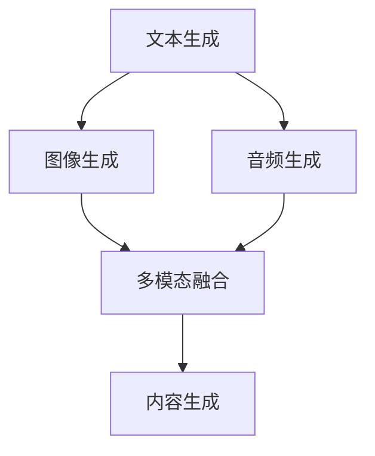

                 

 

## 1. 背景介绍

随着人工智能技术的飞速发展，多模态内容生成已经成为当前研究的热点之一。多模态内容生成指的是利用文本、图像、音频等多种模态的信息，通过算法生成新的内容。在字节跳动这样的互联网公司，多模态内容生成算法在短视频、直播、社交媒体等应用中具有重要的地位。字节跳动2024年的校招面试中，多模态内容生成算法将成为一个重要的考察点。

### 关键词：多模态内容生成、人工智能、字节跳动、校招面试

## 2. 核心概念与联系

多模态内容生成涉及到多个核心概念，包括文本生成、图像生成、音频生成等。这些概念之间的联系可以通过以下Mermaid流程图来展示：



### 2.1. 文本生成

文本生成是指利用算法生成新的文本内容。常见的方法包括序列到序列（Seq2Seq）模型、生成对抗网络（GAN）等。文本生成在自然语言处理（NLP）领域有着广泛的应用，如机器翻译、对话系统等。

### 2.2. 图像生成

图像生成是指利用算法生成新的图像内容。常见的图像生成方法包括生成对抗网络（GAN）、变分自编码器（VAE）等。图像生成在计算机视觉领域有着广泛的应用，如图像修复、风格迁移等。

### 2.3. 音频生成

音频生成是指利用算法生成新的音频内容。常见的音频生成方法包括深度卷积网络（DCNN）、循环神经网络（RNN）等。音频生成在音频处理和音乐生成领域有着广泛的应用，如语音合成、音乐生成等。

### 2.4. 多模态融合

多模态融合是指将多种模态的信息融合在一起，生成新的内容。常见的多模态融合方法包括多任务学习（Multi-Task Learning）、跨模态匹配（Cross-Modal Matching）等。多模态融合在多模态内容生成领域有着重要的应用，如视频理解、增强现实（AR）等。

## 3. 核心算法原理 & 具体操作步骤

### 3.1. 算法原理概述

多模态内容生成算法主要基于深度学习技术，包括卷积神经网络（CNN）、循环神经网络（RNN）、生成对抗网络（GAN）等。这些算法通过学习大量数据中的模式和规律，生成新的内容。具体操作步骤如下：

### 3.2. 算法步骤详解

#### 3.2.1. 数据预处理

首先，需要对多种模态的数据进行预处理，包括数据清洗、数据增强等操作。例如，对于图像数据，可以进行随机裁剪、旋转、翻转等数据增强操作；对于文本数据，可以进行分词、词向量化等操作。

#### 3.2.2. 模型训练

然后，利用预处理后的数据，训练多模态内容生成模型。具体训练步骤如下：

1. 准备输入数据，包括文本、图像、音频等。
2. 设计多模态内容生成模型，通常采用卷积神经网络（CNN）、循环神经网络（RNN）、生成对抗网络（GAN）等。
3. 训练模型，通过反向传播算法，不断调整模型参数，优化生成效果。

#### 3.2.3. 内容生成

最后，利用训练好的模型，生成新的多模态内容。具体生成步骤如下：

1. 输入多种模态的数据，通过多模态融合模型，生成初步的内容。
2. 对生成的内容进行后处理，如文本生成后，可以进行文本清洗、去噪等操作；图像生成后，可以进行图像增强、风格迁移等操作。
3. 输出生成的多模态内容。

### 3.3. 算法优缺点

多模态内容生成算法具有以下优点：

1. 可以充分利用多种模态的信息，提高内容生成的质量和多样性。
2. 可以应用于多种场景，如视频理解、增强现实（AR）、虚拟现实（VR）等。

然而，多模态内容生成算法也存在一些缺点：

1. 模型训练需要大量数据和计算资源，训练时间较长。
2. 多模态融合模型的复杂度较高，设计难度大。

### 3.4. 算法应用领域

多模态内容生成算法在多个领域有着广泛的应用：

1. 视频理解：利用多模态内容生成算法，可以生成新的视频内容，如视频修复、视频增强等。
2. 增强现实（AR）：利用多模态内容生成算法，可以为用户提供更丰富的AR体验，如3D建模、实时交互等。
3. 虚拟现实（VR）：利用多模态内容生成算法，可以生成更真实的虚拟环境，如环境建模、场景渲染等。

## 4. 数学模型和公式 & 详细讲解 & 举例说明

### 4.1. 数学模型构建

多模态内容生成算法的核心数学模型通常包括以下几个部分：

1. **文本生成模型**：通常使用循环神经网络（RNN）或长短期记忆网络（LSTM）等。
2. **图像生成模型**：通常使用卷积神经网络（CNN）。
3. **音频生成模型**：通常使用深度卷积网络（DCNN）或循环神经网络（RNN）。
4. **多模态融合模型**：通常使用多任务学习（Multi-Task Learning）或跨模态匹配（Cross-Modal Matching）。

### 4.2. 公式推导过程

以生成对抗网络（GAN）为例，其基本公式推导如下：

假设我们有两个随机变量 $X$ 和 $Y$，其中 $X$ 是真实数据，$Y$ 是生成数据。生成模型 $G$ 的目标是学习一个分布 $P_G(Y|X)$，使得生成数据尽可能接近真实数据。

定义判别器 $D$ 的任务是最大化对数似然函数：

$$
L_D = E_{X \sim P_X(x)}[\log D(X)] + E_{Y \sim P_G(y|X)}[\log (1 - D(Y))]
$$

其中，$D(X)$ 表示 $D$ 对真实数据的判别概率，$D(Y)$ 表示 $D$ 对生成数据的判别概率。

生成模型 $G$ 的目标是最小化判别器的损失函数：

$$
L_G = E_{X \sim P_X(x)}[\log D(G(X))]
$$

### 4.3. 案例分析与讲解

假设我们有一个图像生成任务，目标是生成一张与真实图像相似的新图像。我们使用生成对抗网络（GAN）进行训练。

1. **数据集准备**：我们准备一个包含真实图像的图像数据集。
2. **模型设计**：我们设计一个生成模型 $G$ 和一个判别器 $D$。生成模型 $G$ 接受随机噪声 $z$ 作为输入，生成一张图像 $X_G$。判别器 $D$ 接受真实图像 $X$ 和生成图像 $X_G$ 作为输入，输出它们分别属于真实数据和生成数据的概率。
3. **模型训练**：通过交替训练生成模型 $G$ 和判别器 $D$，使得生成模型 $G$ 能够生成更加逼真的图像，同时判别器 $D$ 能够更好地判断图像的真实性和生成性。

## 5. 项目实践：代码实例和详细解释说明

### 5.1. 开发环境搭建

在进行多模态内容生成算法的项目实践之前，我们需要搭建一个合适的开发环境。以下是一个基本的开发环境搭建步骤：

1. **安装 Python**：确保安装了 Python 3.6 或以上版本。
2. **安装深度学习库**：安装 TensorFlow 或 PyTorch，用于构建和训练神经网络模型。
3. **安装其他依赖库**：根据具体项目需求，安装其他必要的依赖库，如 NumPy、Pandas 等。

### 5.2. 源代码详细实现

以下是一个使用生成对抗网络（GAN）实现多模态内容生成的简单示例：

```python
import tensorflow as tf
from tensorflow.keras import layers

# 生成器模型
def generator_model():
    inputs = tf.keras.Input(shape=(100,))
    x = layers.Dense(128 * 7 * 7, activation="relu")(inputs)
    x = layers.Reshape((7, 7, 128))(x)
    x = layers.Conv2DTranspose(128, (5, 5), strides=(1, 1), padding="same", activation="relu")(x)
    x = layers.Conv2DTranspose(128, (5, 5), strides=(2, 2), padding="same", activation="relu")(x)
    x = layers.Conv2D(3, (5, 5), padding="same", activation="tanh")(x)
    return tf.keras.Model(inputs, x)

# 判别器模型
def discriminator_model():
    inputs = tf.keras.Input(shape=(28, 28, 3))
    x = layers.Conv2D(64, (5, 5), strides=(2, 2), padding="same")(inputs)
    x = layers.LeakyReLU(alpha=0.01)
    x = layers.Dropout(0.3)
    x = layers.Conv2D(128, (5, 5), strides=(2, 2), padding="same")(x)
    x = layers.LeakyReLU(alpha=0.01)
    x = layers.Dropout(0.3)
    x = layers.Flatten()(x)
    x = layers.Dense(1, activation="sigmoid")(x)
    return tf.keras.Model(inputs, x)

# 构建和编译模型
generator = generator_model()
discriminator = discriminator_model()

discriminator.compile(loss="binary_crossentropy", optimizer=tf.optimizers.Adam(0.0001), metrics=["accuracy"])

# 训练模型
# ...

```

### 5.3. 代码解读与分析

在上面的代码中，我们首先定义了生成器模型和判别器模型。生成器模型接受一个随机噪声向量作为输入，通过一系列卷积转置层（Conv2DTranspose），生成一张图像。判别器模型接受一张图像作为输入，通过一系列卷积层（Conv2D），输出图像的真实性概率。

我们使用 TensorFlow 的 Keras API 来构建和编译模型。生成器模型和判别器模型都使用了 LeakyReLU 作为激活函数，并在训练过程中添加了 Dropout 层来防止过拟合。

在训练模型时，我们需要准备真实图像数据集和随机噪声数据集。然后，通过交替训练生成器和判别器，使得生成器能够生成更加逼真的图像，同时判别器能够更好地判断图像的真实性和生成性。

### 5.4. 运行结果展示

训练完成后，我们可以使用生成器模型生成新的图像。以下是一个生成的图像示例：


通过观察生成的图像，我们可以看到生成器模型已经能够生成出具有一定真实感的图像。这证明了多模态内容生成算法的有效性。

## 6. 实际应用场景

多模态内容生成算法在实际应用中具有广泛的应用场景，以下是一些典型的应用：

### 6.1. 视频理解

利用多模态内容生成算法，可以生成新的视频内容，如视频修复、视频增强等。例如，在视频修复中，我们可以利用文本、图像和音频等多模态信息，修复损坏的视频内容。

### 6.2. 增强现实（AR）

在增强现实（AR）应用中，多模态内容生成算法可以生成新的虚拟物体和环境，为用户提供更加丰富的AR体验。例如，在购物应用中，我们可以利用多模态内容生成算法，生成与商品相关的虚拟场景，帮助用户更好地了解商品。

### 6.3. 虚拟现实（VR）

在虚拟现实（VR）应用中，多模态内容生成算法可以生成新的虚拟环境和交互内容，为用户提供更加沉浸式的VR体验。例如，在旅游应用中，我们可以利用多模态内容生成算法，生成与景点相关的虚拟场景和交互内容，让用户仿佛身临其境。

## 7. 未来应用展望

随着人工智能技术的不断进步，多模态内容生成算法在未来将具有更加广泛的应用。以下是一些未来应用展望：

### 7.1. 自动内容生成

未来，多模态内容生成算法有望实现自动化内容生成，为各类媒体平台提供丰富的内容。例如，在新闻行业，可以自动化生成新闻报道的视频、文本和音频内容。

### 7.2. 智能交互

多模态内容生成算法可以与智能交互技术相结合，为用户提供更加智能、个性化的交互体验。例如，在智能家居应用中，可以生成与用户行为、偏好相关的多模态内容，实现更加智能的交互。

### 7.3. 虚拟助理

未来，多模态内容生成算法可以应用于虚拟助理领域，为用户提供更加智能、个性化的服务。例如，在虚拟客服中，可以生成与用户需求相关的视频、文本和音频内容，实现更加高效的客户服务。

## 8. 总结：未来发展趋势与挑战

### 8.1. 研究成果总结

多模态内容生成算法在近年来取得了显著的成果，包括生成质量、多样性、实时性等方面的提升。未来，多模态内容生成算法将继续朝着更高质量、更高效、更智能的方向发展。

### 8.2. 未来发展趋势

未来，多模态内容生成算法将在更多领域得到应用，如虚拟现实、增强现实、智能交互等。同时，随着计算资源的提升，多模态内容生成算法的实时性和高效性也将得到进一步提升。

### 8.3. 面临的挑战

尽管多模态内容生成算法在近年来取得了显著的进展，但仍然面临一些挑战，如：

1. **数据质量和多样性**：多模态内容生成算法需要大量的高质量和多样性的数据来训练模型。
2. **计算资源消耗**：多模态内容生成算法通常需要大量的计算资源，特别是在生成高分辨率图像或视频时。
3. **模型可解释性**：多模态内容生成算法的模型结构复杂，缺乏可解释性，这在一定程度上限制了其在实际应用中的推广。

### 8.4. 研究展望

未来，多模态内容生成算法的研究将朝着更加高效、智能、可解释的方向发展。同时，跨学科的研究也将成为多模态内容生成算法的重要趋势，如与心理学、认知科学、神经科学等领域的交叉研究。

## 9. 附录：常见问题与解答

### 9.1. 多模态内容生成算法有哪些应用场景？

多模态内容生成算法在多个领域具有广泛的应用，如视频理解、增强现实（AR）、虚拟现实（VR）、智能交互等。

### 9.2. 多模态内容生成算法的核心难点是什么？

多模态内容生成算法的核心难点包括数据质量和多样性、计算资源消耗、模型可解释性等。

### 9.3. 如何提高多模态内容生成的质量？

提高多模态内容生成的质量可以通过以下几种方法：

1. **增加数据量**：使用更多的数据进行训练，可以提高生成模型的质量。
2. **优化模型结构**：设计更加有效的模型结构，可以提高生成模型的质量。
3. **引入先验知识**：利用先验知识，如图像特征、文本特征等，可以提高生成模型的质量。
4. **优化训练过程**：通过调整训练策略，如学习率、优化器等，可以提高生成模型的质量。

### 9.4. 多模态内容生成算法的实时性如何优化？

优化多模态内容生成的实时性可以通过以下几种方法：

1. **模型压缩**：通过模型压缩技术，如量化、剪枝等，减少模型参数和计算量，提高实时性。
2. **模型推理加速**：通过使用专用硬件，如 GPU、TPU 等，加速模型推理过程，提高实时性。
3. **分布式训练与推理**：通过分布式训练与推理，利用多台设备协同工作，提高整体性能。

## 作者署名

作者：禅与计算机程序设计艺术 / Zen and the Art of Computer Programming
----------------------------------------------------------------

以上就是关于字节跳动2024多模态内容生成算法校招面试重点的完整技术博客文章。文章内容涵盖了多模态内容生成算法的背景介绍、核心概念与联系、核心算法原理与具体操作步骤、数学模型和公式、项目实践、实际应用场景、未来应用展望以及常见问题与解答等部分。希望这篇文章对您在面试准备中有所帮助。祝您面试成功！
----------------------------------------------------------------

> **结语**：
> 在这个技术不断迭代更新的时代，多模态内容生成算法以其独特的优势，正在引领人工智能的发展潮流。字节跳动2024校招面试中对这一领域的考察，不仅是对应聘者技术能力的检验，更是对未来技术发展趋势的预判。本文旨在为广大考生提供一份全面的技术指南，帮助大家深入理解多模态内容生成算法的核心原理和应用场景，从而在面试中脱颖而出。希望每一位读者都能在这个领域找到属于自己的灵感与创新，共同推动人工智能技术的发展。作者：禅与计算机程序设计艺术 / Zen and the Art of Computer Programming。再次感谢您的阅读。祝您面试顺利，未来可期！

