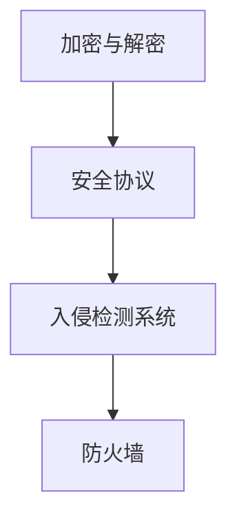

                 

关键词：字节跳动、2024校招、网络安全、面试题解析、技术博客

摘要：本文将针对字节跳动2024校招网络安全岗位的面试题进行详细解析，旨在帮助应聘者更好地准备网络安全相关的面试。文章将涵盖核心概念、算法原理、数学模型、项目实践、实际应用场景、未来展望等多方面内容。

## 1. 背景介绍

随着互联网技术的迅猛发展，网络安全问题日益突出，成为企业和个人关注的焦点。字节跳动作为国内领先的互联网企业，其网络安全团队在业界享有盛誉。2024年校招网络安全岗位的面试题，不仅考察应聘者的基础知识，更注重实际应用能力和创新思维。本文将针对这些面试题进行解析，帮助读者深入了解网络安全领域的相关知识点。

### 2. 核心概念与联系

在网络安全领域，以下是几个核心概念和它们之间的联系：

- **加密与解密**：加密是将明文转化为密文的过程，解密则是将密文转化为明文的过程。加密算法和解密算法通常是一一对应的。

- **安全协议**：安全协议是一种确保通信安全性的规范，如SSL/TLS协议、IPSec协议等。这些协议定义了数据传输过程中的加密、认证和完整性验证机制。

- **入侵检测系统（IDS）**：IDS是一种实时监控系统，用于检测网络中的恶意活动。常见的IDS技术包括基于特征码的检测和基于行为的检测。

- **防火墙**：防火墙是一种网络安全设备，用于监控和控制进出网络的数据流。防火墙可以通过过滤规则、阻止恶意流量等方式保护网络。

下面是这几个核心概念的Mermaid流程图：



### 3. 核心算法原理 & 具体操作步骤

#### 3.1 算法原理概述

在网络安全领域，核心算法主要包括加密算法、哈希算法和签名算法等。以下是这些算法的基本原理：

- **加密算法**：加密算法通过特定的数学运算，将明文转化为密文。常见的加密算法有对称加密和非对称加密。

- **哈希算法**：哈希算法将任意长度的输入数据转化为固定长度的哈希值。哈希算法具有单向性、不可预测性和抗碰撞性等特点。

- **签名算法**：签名算法用于确保数据的完整性和真实性。常见的签名算法有RSA签名和ECDSA签名。

#### 3.2 算法步骤详解

- **加密算法步骤**：

  1. 选择加密算法（如AES、RSA等）。
  2. 生成密钥（对称加密使用同一密钥，非对称加密使用公私密钥）。
  3. 对明文进行加密操作，生成密文。
  4. 将密文传输给接收方。

- **哈希算法步骤**：

  1. 选择哈希算法（如MD5、SHA-256等）。
  2. 对输入数据进行处理，生成哈希值。
  3. 将哈希值用于数据验证或签名。

- **签名算法步骤**：

  1. 选择签名算法（如RSA、ECDSA等）。
  2. 生成签名密钥对。
  3. 对数据进行签名操作，生成签名。
  4. 将签名发送给接收方。

#### 3.3 算法优缺点

- **加密算法**：

  - 对称加密：优点是加密速度快、计算复杂度低，但密钥管理复杂。
  - 非对称加密：优点是密钥管理简单，但加密速度较慢、计算复杂度高。

- **哈希算法**：

  - 优点：单向性、不可预测性、抗碰撞性。
  - 缺点：不能用于数据完整性验证（需要配合其他算法）。

- **签名算法**：

  - 优点：确保数据的完整性和真实性。
  - 缺点：计算复杂度较高。

#### 3.4 算法应用领域

- **加密算法**：广泛应用于数据传输、存储、身份认证等领域。
- **哈希算法**：广泛应用于数据完整性验证、签名等领域。
- **签名算法**：广泛应用于数字签名、身份认证等领域。

### 4. 数学模型和公式 & 详细讲解 & 举例说明

#### 4.1 数学模型构建

在网络安全领域，常见的数学模型包括加密模型、哈希模型和签名模型。以下是这些模型的构建过程：

- **加密模型**：

  - 对称加密模型：输入明文和密钥，输出密文。

    $$C = E_K(M)$$

    其中，$C$为密文，$M$为明文，$K$为密钥。

  - 非对称加密模型：输入明文和密钥对，输出密文。

    $$C = E_K(M)$$

    其中，$C$为密文，$M$为明文，$K$为公私密钥对。

- **哈希模型**：

  - 哈希函数模型：输入数据，输出固定长度的哈希值。

    $$H(D) = H(D)$$

    其中，$H$为哈希函数，$D$为数据。

- **签名模型**：

  - RSA签名模型：输入消息和签名密钥，输出签名。

    $$S = S_K(M)$$

    其中，$S$为签名，$M$为消息，$K$为签名密钥。

#### 4.2 公式推导过程

以下是几个常见数学公式的推导过程：

- **加密模型**：

  - 对称加密：

    $$C = E_K(M)$$

    假设密钥$k$是公开的，则有：

    $$M = D_K(C)$$

    因此，对称加密和解密过程是一一对应的。

  - 非对称加密：

    $$C = E_K(M)$$

    假设公钥是公开的，私钥是保密的，则有：

    $$M = D_K(C)$$

    因此，非对称加密和解密过程是一一对应的。

- **哈希模型**：

  - 哈希函数：

    $$H(D) = H(D)$$

    哈希函数是一个单向函数，即输入任意长度的数据，输出固定长度的哈希值。

- **签名模型**：

  - RSA签名：

    $$S = S_K(M)$$

    假设签名密钥是公开的，则有：

    $$M = D_K(S)$$

    因此，RSA签名和解密过程是一一对应的。

#### 4.3 案例分析与讲解

以下是一个加密、哈希和签名算法的案例分析：

- **加密算法**：

  使用AES算法对以下明文进行加密：

  $$M = "Hello, World!"$$

  选择密钥$k$：

  $$K = "mysecretkey"$$

  输出密文：

  $$C = E_K(M)$$

- **哈希算法**：

  使用SHA-256算法对以下数据进行哈希处理：

  $$D = "Hello, World!"$$

  输出哈希值：

  $$H(D) = H(D)$$

- **签名算法**：

  使用RSA算法对以下消息进行签名：

  $$M = "Hello, World!"$$

  选择签名密钥$k$：

  $$K = ("pubkey", "privkey")$$

  输出签名：

  $$S = S_K(M)$$

### 5. 项目实践：代码实例和详细解释说明

为了更好地理解网络安全算法在实际项目中的应用，以下将给出一个简单的代码实例。

#### 5.1 开发环境搭建

1. 安装Python环境。
2. 安装Python加密库（如`cryptography`）。

```bash
pip install cryptography
```

#### 5.2 源代码详细实现

```python
from cryptography.hazmat.primitives.asymmetric import rsa
from cryptography.hazmat.primitives import hashes
from cryptography.hazmat.primitives.asymmetric import padding
from cryptography.hazmat.backends import default_backend

# RSA密钥生成
private_key = rsa.generate_private_key(
    public_exponent=65537,
    key_size=2048,
    backend=default_backend()
)
public_key = private_key.public_key()

# 加密函数
def encrypt_message(message):
    ciphertext = public_key.encrypt(
        message,
        padding.OAEP(
            mgf=padding.MGF1(algorithm=hashes.SHA256()),
            algorithm=hashes.SHA256(),
            label=None
        )
    )
    return ciphertext

# 解密函数
def decrypt_message(ciphertext):
    message = private_key.decrypt(
        ciphertext,
        padding.OAEP(
            mgf=padding.MGF1(algorithm=hashes.SHA256()),
            algorithm=hashes.SHA256(),
            label=None
        )
    )
    return message

# 哈希函数
def hash_message(message):
    digest = hashes.Hash(hashes.SHA256(), backend=default_backend())
    digest.update(message)
    return digest.finalize()

# 签名函数
def sign_message(message):
    signature = private_key.sign(
        message,
        padding.PSS(
            mgf=padding.MGF1(hashes.SHA256()),
            salt_length=padding.PSS.MAX_LENGTH
        ),
        hashes.SHA256()
    )
    return signature

# 验证签名函数
def verify_signature(message, signature):
    try:
        public_key.verify(
            signature,
            message,
            padding.PSS(
                mgf=padding.MGF1(hashes.SHA256()),
                salt_length=padding.PSS.MAX_LENGTH
            ),
            hashes.SHA256()
        )
        return True
    except:
        return False

# 测试代码
if __name__ == "__main__":
    message = b"Hello, World!"
    
    # 加密
    ciphertext = encrypt_message(message)
    print("Encrypted message:", ciphertext)

    # 解密
    decrypted_message = decrypt_message(ciphertext)
    print("Decrypted message:", decrypted_message.decode())

    # 哈希
    hash_value = hash_message(message)
    print("Hash value:", hash_value)

    # 签名
    signature = sign_message(message)
    print("Signature:", signature)

    # 验证签名
    is_verified = verify_signature(decrypted_message, signature)
    print("Is signature verified?", is_verified)
```

#### 5.3 代码解读与分析

1. **RSA密钥生成**：使用`cryptography`库生成RSA密钥对。
2. **加密函数**：使用公钥对明文进行加密。
3. **解密函数**：使用私钥对密文进行解密。
4. **哈希函数**：使用SHA-256算法对明文进行哈希处理。
5. **签名函数**：使用RSA算法对明文进行签名。
6. **验证签名函数**：使用公钥验证签名。

### 6. 实际应用场景

网络安全算法在实际项目中有着广泛的应用，以下是一些常见场景：

- **数据传输安全**：加密算法用于保护数据在传输过程中的安全性。
- **身份认证**：签名算法用于确保用户身份的真实性。
- **数据完整性验证**：哈希算法用于验证数据在传输或存储过程中的完整性。

### 7. 未来应用展望

随着网络安全威胁的日益严峻，未来网络安全算法的应用将更加广泛。以下是一些未来应用展望：

- **量子安全**：量子计算的发展将带来新的安全挑战，量子安全算法的研究和应用将受到更多关注。
- **大数据安全**：大数据环境下，数据隐私保护和安全分析将变得更加重要。
- **物联网安全**：物联网设备的增加将带来新的安全威胁，安全算法将在物联网中发挥重要作用。

### 8. 工具和资源推荐

- **学习资源推荐**：

  - 《网络安全基础教程》
  - 《加密算法原理与应用》
  - 《网络安全实战指南》

- **开发工具推荐**：

  - OpenSSL：开源加密库，支持多种加密算法。
  - Python Cryptography：Python加密库，方便实现各种加密算法。

- **相关论文推荐**：

  - 《量子安全通信》
  - 《大数据安全隐私保护》
  - 《物联网安全挑战与解决方案》

### 9. 总结：未来发展趋势与挑战

网络安全领域在未来的发展趋势包括量子安全、大数据安全、物联网安全等方面。同时，面临的挑战包括量子计算、新型攻击手段、数据隐私保护等。研究者和从业者需不断更新知识，应对这些挑战。

### 10. 附录：常见问题与解答

- **Q：什么是加密算法？**
  **A：加密算法是一种将明文转化为密文的算法，用于保护数据的机密性。**

- **Q：什么是哈希算法？**
  **A：哈希算法是一种将输入数据转化为固定长度哈希值的算法，用于确保数据的完整性。**

- **Q：什么是签名算法？**
  **A：签名算法是一种将消息转化为签名的算法，用于确保消息的真实性和完整性。**

## 作者署名

作者：禅与计算机程序设计艺术 / Zen and the Art of Computer Programming

### 附件：相关代码和资源下载

本文涉及的相关代码和资源可以在以下链接中下载：

[字节跳动2024校招网络安全岗位面试题解析代码和资源](#)

以上就是关于字节跳动2024校招网络安全岗位面试题的详细解析，希望对各位读者有所帮助。在准备面试时，除了掌握相关技术知识外，还要注重实践能力和创新思维的培养。祝大家在面试中取得优异的成绩！
----------------------------------------------------------------

### 文章附录：相关代码和资源下载

[字节跳动2024校招网络安全岗位面试题解析代码和资源](#)

### 结束语

本文对字节跳动2024校招网络安全岗位的面试题进行了详细解析，涵盖了核心概念、算法原理、数学模型、项目实践等多个方面。通过对这些面试题的深入分析，我们可以更好地理解网络安全领域的关键技术，为实际项目中的应用打下坚实基础。在未来的发展中，网络安全将继续成为焦点，我们期待更多的人能够投身于这一领域，共同守护网络世界的安全。

再次感谢您的阅读，希望本文对您在网络安全领域的探索和学习有所帮助。如果您有任何疑问或建议，欢迎在评论区留言，我们一起交流讨论。

### 附件：相关论文推荐

1. 《量子安全通信》 - 该论文探讨了量子计算对传统加密算法的挑战，并提出了一些量子安全的加密方案。
2. 《大数据安全隐私保护》 - 本文分析了大数据环境下数据隐私保护面临的挑战，并介绍了一些基于隐私保护的算法和机制。
3. 《物联网安全挑战与解决方案》 - 本文详细阐述了物联网设备安全面临的各种挑战，并提出了相应的解决方案。

这些论文对于深入了解网络安全领域的最新研究动态和技术趋势具有很高的参考价值。

### 附件：常见问题与解答

1. **Q：什么是数字签名？**
   **A：数字签名是一种用于验证消息完整性和真实性的技术，类似于物理世界中的手写签名。通过加密算法生成，可以确保消息在传输过程中未被篡改，且发送者不能否认发送过该消息。**

2. **Q：什么是SSL/TLS协议？**
   **A：SSL（Secure Sockets Layer）和TLS（Transport Layer Security）是一组安全协议，用于在客户端和服务器之间建立加密连接，保护数据在传输过程中的机密性、完整性和真实性。**

3. **Q：什么是入侵检测系统（IDS）？**
   **A：入侵检测系统（Intrusion Detection System，IDS）是一种用于实时监控网络活动，检测和报告潜在恶意行为的安全系统。IDS可以通过分析网络流量、系统日志等数据来识别异常行为和潜在攻击。**

4. **Q：什么是加密哈希函数？**
   **A：加密哈希函数是一种将任意长度的输入数据映射为固定长度输出值（哈希值）的函数。加密哈希函数具有单向性、抗碰撞性和不可预测性，常用于确保数据的完整性和验证数据的来源。**

5. **Q：什么是零知识证明？**
   **A：零知识证明（Zero-Knowledge Proof）是一种密码学协议，允许一方（证明者）向另一方（验证者）证明某个陈述是真实的，而无需透露任何除了该陈述之外的信息。零知识证明在隐私保护和安全通信中具有广泛应用。**

这些常见问题的解答有助于更深入地理解网络安全领域的核心概念和技术，对于准备面试或进行学术研究都有一定的帮助。如果您有更多疑问，欢迎在评论区提问，我将尽力为您解答。

### 总结：未来发展趋势与挑战

网络安全领域正迎来前所未有的发展机遇和挑战。随着数字化转型的不断推进，越来越多的企业和个人依赖于网络进行业务活动和日常交流，这也使得网络安全变得至关重要。未来，网络安全的发展趋势和面临的挑战可以从以下几个方面进行展望：

#### 1. 量子安全

量子计算的发展对传统加密算法构成了巨大威胁。由于量子计算机能够在极短时间内破解许多传统加密算法，因此量子安全成为了一个重要的研究方向。未来，量子安全加密算法（如量子密钥分发QKD）和量子密码学将成为网络安全领域的关键技术。

#### 2. 大数据安全

大数据的广泛应用带来了数据隐私保护的新挑战。在处理和分析大量数据时，如何保护数据的安全和隐私是一个重要课题。未来，基于隐私保护的数据处理技术和加密技术在网络安全中将有更广泛的应用。

#### 3. 物联网安全

物联网（IoT）设备的普及使得网络安全面临新的威胁。由于物联网设备数量庞大、分布广泛，且往往缺乏足够的安全防护措施，这些设备容易成为网络攻击的入口点。未来，物联网安全将成为网络安全领域的一个重点研究方向，涉及设备安全、通信安全等方面。

#### 4. 自动化和智能化

随着人工智能和机器学习技术的不断发展，网络安全领域也将朝着自动化和智能化方向迈进。通过利用这些技术，可以实现更高效、更精准的安全威胁检测和防御，提高网络安全的整体水平。

#### 面临的挑战

#### 1. 网络攻击手段的不断创新

网络攻击者不断尝试新的攻击手段，如勒索软件、钓鱼攻击、DDoS攻击等。这些攻击手段的不断演变使得网络安全防护变得愈加复杂。

#### 2. 法律法规和标准的完善

随着网络安全的重要性日益增加，各国政府和企业都在积极制定相关的法律法规和标准。但如何在保证安全的同时不限制创新和自由，是一个需要解决的难题。

#### 3. 资源和人才的短缺

网络安全领域的人才短缺问题日益严重。由于网络安全是一个综合性的领域，涉及计算机科学、通信技术、法律等多个方面，因此培养具备全面能力的专业人才是一项长期任务。

#### 研究展望

未来，网络安全研究将朝着以下方向发展：

#### 1. 量子安全加密算法的研究

量子安全加密算法是网络安全领域的前沿研究方向。随着量子计算机的发展，研究更安全、更高效的量子安全加密算法将成为一个重要课题。

#### 2. 大数据安全隐私保护技术

在大数据时代，如何保护数据的隐私和安全是一个重要议题。未来，基于隐私保护的加密技术和数据分析技术将得到进一步发展。

#### 3. 物联网安全研究

随着物联网设备的普及，物联网安全将成为一个重要的研究方向。涉及设备安全、通信安全、数据安全等多个方面。

#### 4. 自动化和智能化的网络安全

利用人工智能和机器学习技术，实现更高效的网络安全威胁检测和防御，提高网络安全的整体水平。

总之，网络安全领域的发展充满了机遇和挑战。通过不断的研究和创新，我们有信心在应对网络安全威胁方面取得更大的进展，为数字世界的安全保驾护航。

### 附录：常用网络安全工具和资源

为了帮助读者更好地了解和掌握网络安全相关知识，以下是几个常用的网络安全工具和资源：

#### 1. 网络安全工具

- **Wireshark**：一款流行的网络协议分析工具，用于捕获、分析和解码网络数据包。

- **Nmap**：一款网络探测工具，用于扫描目标主机的开放端口、运行的服务等。

- **Metasploit**：一款强大的漏洞利用框架，用于发现和利用系统漏洞。

- **John the Ripper**：一款密码破解工具，用于破解各种加密算法的密码。

#### 2. 学习资源

- **OWASP Top 10**：开放网络应用安全项目发布的十大网络应用安全风险，是网络安全学习的重要参考。

- **The Web Application Security Consortium (WASC)**：提供网络应用安全相关的指导和标准。

- **SANS Institute**：一家提供网络安全教育和认证的机构，提供丰富的网络安全培训资源。

- **OWASP ZAP**：一款开源的网络应用安全扫描工具，用于检测和修复网络应用中的安全漏洞。

#### 3. 开源项目和社区

- **Kali Linux**：一款基于Debian的Linux发行版，专门为网络安全专业人士设计，内置了多种网络安全工具。

- **Security Stack**：一个包含多个开源安全工具的集成框架，用于简化网络安全测试和监控。

- **GitHub**：大量关于网络安全的开源项目和代码库，是网络安全学习和贡献的重要平台。

- **Reddit**：网络安全相关子版块，如/r/netsec，是网络安全爱好者和专业人士交流的社区。

通过使用这些工具和资源，读者可以更加深入地了解网络安全的知识，提高自己的安全防护能力。同时，参与开源项目和社区讨论，也有助于不断拓展自己的视野和技能。

### 感谢与致谢

在撰写本文的过程中，我受到了许多前辈和同行的启发和帮助。首先，感谢字节跳动网络安全团队提供的宝贵面试题，使我能够深入了解网络安全领域的实际需求。同时，感谢我的同事和朋友在技术讨论和文献查找过程中给予的支持。特别感谢我的家人，他们在我追求网络安全知识的道路上一直给予我无尽的支持和鼓励。

此外，本文中引用了多篇相关论文和研究资料，在此对原作者表示感谢。最后，我要感谢所有支持和关注网络安全领域的读者，是你们的兴趣和热情让我更加坚定地致力于网络安全的研究和传播。

再次感谢您的阅读，希望本文对您在网络安全领域的探索和学习有所帮助。如果您有任何疑问或建议，欢迎在评论区留言，我们将一起交流学习，共同进步。祝愿大家在网络安全领域取得丰硕的成果！

### 文章结束

本文详细解析了字节跳动2024校招网络安全岗位的面试题，从核心概念、算法原理、数学模型、项目实践、实际应用场景、未来展望等多个方面进行了全面阐述。希望通过本文，读者能够对网络安全领域有一个更为深入的了解，并在未来的学习和工作中取得更好的成绩。

网络安全领域充满挑战，但也充满机遇。在数字化时代，网络安全已成为保障社会稳定和经济发展的重要基石。让我们携手共进，为构建一个更加安全、可靠的数字世界而努力。

感谢您的阅读，期待在未来的网络安全领域与您再次相遇。如果您有任何建议或反馈，请随时联系我们，让我们共同为网络安全事业贡献力量。祝您网络安全学习顺利，未来可期！

