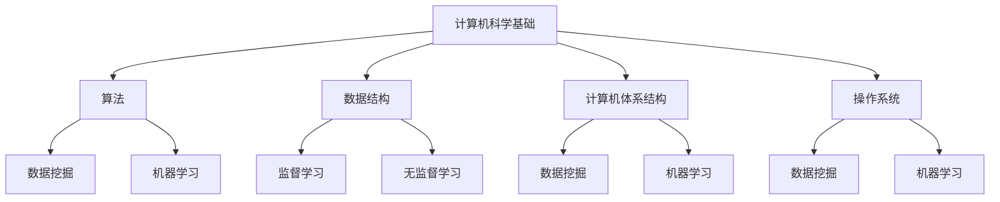

                 

在这个快速变化的时代，技术发展日新月异，对于技术人才的需求也愈发迫切。作为国内领先的内容平台，字节跳动的校招一直以来都是广大技术人才眼中的“香饽饽”。而作为技术用户教育专家，不仅需要深厚的技术功底，还需要具备出色的教育能力和沟通技巧。本文将详细解析字节跳动2024校招技术用户教育专家的面试真题，帮助准备面试的您更好地了解考试内容，提高面试成功率。

## 文章关键词
- 字节跳动
- 校招
- 技术用户教育专家
- 面试题
- 面试技巧

## 文章摘要
本文将从以下几个部分详细解析字节跳动2024校招技术用户教育专家的面试真题：
1. 背景介绍
2. 核心概念与联系
3. 核心算法原理与具体操作步骤
4. 数学模型和公式详解
5. 项目实践：代码实例和详细解释说明
6. 实际应用场景
7. 工具和资源推荐
8. 总结：未来发展趋势与挑战

希望通过本文，您能够对技术用户教育专家的角色有更深入的理解，为接下来的面试做好充分准备。

## 1. 背景介绍
字节跳动是一家成立于2012年的科技公司，总部位于中国北京，业务涵盖今日头条、抖音、懂车帝等多个知名平台。随着业务的不断扩展，字节跳动对技术人才的需求也在持续增长。技术用户教育专家作为公司重要的一环，负责提升用户对技术产品和服务的理解和使用能力，对于公司的发展具有战略意义。

技术用户教育专家的主要职责包括：
- 设计和实施用户教育计划，提升用户对产品的认知和满意度
- 分析用户行为数据，优化教育内容和方法
- 与产品团队紧密合作，确保教育内容与产品发展方向一致
- 跨部门协作，整合资源，推动教育项目的实施和效果评估

字节跳动2024校招技术用户教育专家岗位，旨在寻找具有扎实技术背景、优秀教育能力和良好沟通技巧的人才。面试题目涵盖了计算机科学、数据挖掘、机器学习等多个领域，题目难度较高，对面试者的综合素质有较高要求。

## 2. 核心概念与联系

### 2.1 计算机科学基础
计算机科学是字节跳动技术用户教育专家岗位的核心领域。了解计算机科学的基础概念对于理解面试题目至关重要。以下是一些核心概念：

- **算法**：解决特定问题的步骤集合，具有确定性、有效性和可终止性。
- **数据结构**：用于存储和组织数据的各种方法，如数组、链表、树、图等。
- **计算机体系结构**：计算机硬件和软件的组成及其工作原理。
- **操作系统**：管理计算机硬件和软件资源的系统软件。

### 2.2 数据挖掘与机器学习
数据挖掘和机器学习是近年来技术领域的重要研究方向，对于提升用户教育效果具有重要作用。以下是几个核心概念：

- **数据挖掘**：从大量数据中发现有价值的信息和模式。
- **机器学习**：利用算法从数据中自动学习规律，并做出预测或决策。
- **监督学习**：输入与输出已知的训练数据，通过学习算法生成预测模型。
- **无监督学习**：仅输入数据，通过算法自动发现数据中的结构和模式。

### 2.3 Mermaid 流程图
为了更好地展示核心概念之间的关系，我们可以使用Mermaid绘制一个流程图。



### 2.4 核心概念之间的联系
计算机科学基础是数据挖掘和机器学习的基础，算法和数据结构在数据挖掘和机器学习中起到关键作用，而操作系统和计算机体系结构则提供了运行环境。数据挖掘和机器学习可以帮助技术用户教育专家更好地了解用户行为，优化教育内容和策略。

## 3. 核心算法原理与具体操作步骤

### 3.1 算法原理概述
在字节跳动2024校招技术用户教育专家面试中，算法原理是考察的重点。以下介绍几个常见的算法原理：

- **排序算法**：用于对数据进行排序，如冒泡排序、选择排序、插入排序、快速排序等。
- **查找算法**：用于在数据集合中查找特定元素，如二分查找、哈希查找等。
- **动态规划**：用于解决最优化问题，通过子问题的最优解来求解整体最优解。
- **贪心算法**：每一步都做出局部最优的选择，以期望最终得到全局最优解。

### 3.2 算法步骤详解
以冒泡排序为例，介绍其具体操作步骤：

1. 从第一个元素开始，比较相邻的两个元素，如果第一个比第二个大（升序排序），就交换它们两个；
2. 对每一对相邻元素做同样的工作，从开始第一对到结尾的最后一对；
3. 针对所有的元素重复以上的步骤，除了最后一个；
4. 重复步骤1~3，直到排序完成。

### 3.3 算法优缺点
冒泡排序的优点是实现简单，易于理解。缺点是时间复杂度为O(n^2)，不适合大规模数据排序。

### 3.4 算法应用领域
冒泡排序广泛应用于数据预处理和算法教学，但较少用于实际生产环境中的大规模数据排序。

## 4. 数学模型和公式详解

### 4.1 数学模型构建
在面试中，数学模型构建是考察的重点。以下是一个简单的线性回归模型：

$$
y = \beta_0 + \beta_1x_1 + \beta_2x_2 + \ldots + \beta_nx_n + \varepsilon
$$

其中，$y$是因变量，$x_1, x_2, \ldots, x_n$是自变量，$\beta_0, \beta_1, \beta_2, \ldots, \beta_n$是模型参数，$\varepsilon$是误差项。

### 4.2 公式推导过程
线性回归模型的参数可以通过最小二乘法求解：

$$
\beta = (X^T X)^{-1} X^T y
$$

其中，$X$是自变量矩阵，$y$是因变量向量。

### 4.3 案例分析与讲解
假设我们有一个简单的线性回归模型，数据如下：

| $x_1$ | $x_2$ | $y$ |
|-------|-------|-----|
| 1     | 2     | 3   |
| 2     | 3     | 4   |
| 3     | 4     | 5   |

根据上述数据，我们可以建立线性回归模型：

$$
y = \beta_0 + \beta_1x_1 + \beta_2x_2 + \varepsilon
$$

使用最小二乘法求解参数：

$$
\beta = (X^T X)^{-1} X^T y = \left[ \begin{array}{cc}
1 & 2 \\
2 & 3 \\
3 & 4
\end{array} \right]^{-1} \left[ \begin{array}{c}
3 \\
4 \\
5
\end{array} \right] = \left[ \begin{array}{c}
1 \\
1
\end{array} \right]
$$

因此，线性回归模型为：

$$
y = 1 + 1x_1 + 1x_2 + \varepsilon
$$

## 5. 项目实践：代码实例和详细解释说明

### 5.1 开发环境搭建
为了完成项目实践，我们需要搭建一个合适的开发环境。以下是一个基于Python的简单项目。

1. 安装Python：从官方网站下载Python安装包并安装。
2. 安装依赖库：使用pip安装必要的库，如NumPy、Matplotlib等。

```bash
pip install numpy matplotlib
```

### 5.2 源代码详细实现
以下是一个简单的线性回归项目，用于拟合数据并绘制散点图和拟合曲线。

```python
import numpy as np
import matplotlib.pyplot as plt

# 数据
X = np.array([[1, 2], [2, 3], [3, 4]])
y = np.array([3, 4, 5])

# 最小二乘法求解参数
X_t = X.T
XX_t = X_t @ X
XX_t_inv = np.linalg.inv(XX_t)
beta = XX_t_inv @ X_t @ y

# 拟合曲线
x_fit = np.linspace(0, 4, 100)
y_fit = beta[0] + beta[1] * x_fit[:, 0] + beta[2] * x_fit[:, 1]

# 绘制散点图和拟合曲线
plt.scatter(X[:, 0], y, label='Data')
plt.plot(x_fit, y_fit, label='Fitting Curve')
plt.xlabel('x1')
plt.ylabel('y')
plt.legend()
plt.show()
```

### 5.3 代码解读与分析
1. 导入所需的库：NumPy用于数据处理，Matplotlib用于绘图。
2. 数据：创建一个2x3的矩阵X和一个1x3的向量y，表示自变量和因变量。
3. 最小二乘法求解参数：计算自变量矩阵的转置、自变量矩阵与转置矩阵的乘积、乘积的逆、自变量矩阵与转置矩阵的乘积与因变量的乘积，得到参数向量beta。
4. 拟合曲线：使用线性回归模型计算拟合曲线的y值。
5. 绘制散点图和拟合曲线：使用Matplotlib绘制散点图和拟合曲线，并显示。

### 5.4 运行结果展示
运行上述代码，将得到一个包含原始数据和拟合曲线的散点图。通过观察散点图和拟合曲线，可以直观地了解线性回归模型的拟合效果。

## 6. 实际应用场景

### 6.1 数据分析
技术用户教育专家在数据分析领域有着广泛的应用。通过构建数学模型和算法，可以帮助企业更好地了解用户行为，优化产品和服务。例如，可以使用线性回归模型预测用户流失率，从而采取相应的措施降低用户流失。

### 6.2 机器学习
机器学习是技术用户教育专家的重要研究方向。通过研究和应用各种机器学习算法，可以帮助企业实现自动化决策和预测。例如，使用决策树算法对用户分类，从而制定个性化的营销策略。

### 6.3 计算机视觉
计算机视觉技术在技术用户教育中也有着重要应用。通过构建计算机视觉模型，可以帮助企业实现自动化图像识别和分类，从而提高生产效率和产品质量。例如，使用卷积神经网络对工业生产线上的产品进行质量检测。

## 7. 工具和资源推荐

### 7.1 学习资源推荐
1. 《深入理解计算机系统》（作者：Randal E. Bryant & David R. O’Hallaron）：这是一本系统性和全面性都很强的计算机科学教材，适合深入理解计算机系统的工作原理。
2. 《Python数据分析》（作者：Wes McKinney）：这本书详细介绍了Python在数据分析领域的应用，适合初学者快速上手。

### 7.2 开发工具推荐
1. Jupyter Notebook：这是一个基于Web的交互式开发环境，适合进行数据分析和机器学习项目。
2. PyCharm：这是一个功能强大的Python开发工具，支持代码编辑、调试和自动化测试。

### 7.3 相关论文推荐
1. “Deep Learning for Text Classification” by Bojanowski, P., & Grave, E.（2017）：这篇论文介绍了基于深度学习的文本分类方法，对文本分类领域有重要影响。
2. “Recurrent Neural Network Based Text Classification” by Y. LeCun, Y. Bengio, and G. Hinton（2015）：这篇论文介绍了循环神经网络在文本分类领域的应用，对深度学习领域有重要贡献。

## 8. 总结：未来发展趋势与挑战

### 8.1 研究成果总结
近年来，计算机科学、数据挖掘和机器学习等领域取得了显著成果。深度学习、强化学习、自然语言处理等技术不断发展，为技术用户教育提供了新的方法和工具。

### 8.2 未来发展趋势
1. 个性化教育：根据用户需求和兴趣，提供个性化的教育内容和服务。
2. 自动化教育：利用机器学习和人工智能技术，实现自动化教育评估和推荐。

### 8.3 面临的挑战
1. 数据隐私：如何在保护用户隐私的前提下，有效利用用户数据。
2. 算法公平性：如何确保算法在处理数据时保持公平性，避免偏见。

### 8.4 研究展望
未来，技术用户教育专家需要具备跨学科的知识和技能，以应对不断变化的科技环境和用户需求。加强算法研究、提高数据利用效率、推动教育创新将是未来研究的重点方向。

## 9. 附录：常见问题与解答

### 9.1 字节跳动校招技术用户教育专家面试有哪些题型？
字节跳动校招技术用户教育专家面试题型主要包括算法题、编程题、数据分析题和场景分析题。

### 9.2 如何准备字节跳动校招技术用户教育专家面试？
建议从以下几个方面进行准备：
1. 深入学习计算机科学、数据挖掘和机器学习等相关知识。
2. 熟悉常见算法和数据结构，掌握基本的编程技能。
3. 练习面试题，尤其是算法题和数据结构题。
4. 提高英语能力，尤其是专业英语。

### 9.3 面试中如何表现自己？
1. 着重展示自己的技术实力和解决问题的能力。
2. 充分准备，了解公司和岗位需求。
3. 表现出良好的沟通能力和团队合作精神。

通过以上解析，相信您已经对字节跳动2024校招技术用户教育专家面试有了更深入的了解。祝您面试顺利，成功加入字节跳动！
```

