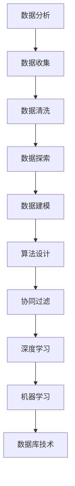

                 

关键词：字节跳动，校招，技术用户行为分析师，面试真题，数据分析，算法，深度学习，机器学习，实践经验

> 摘要：本文针对字节跳动2024校招技术用户行为分析师的面试真题进行详细解答，涵盖了数据分析、算法、深度学习、机器学习等核心知识点，旨在帮助读者更好地理解和应对这类面试题目。通过本文的解析，读者可以掌握用户行为分析的基本方法和实践技巧，为未来的职业发展打下坚实基础。

## 1. 背景介绍

字节跳动（ByteDance）是一家全球领先的互联网科技公司，旗下拥有今日头条、抖音、西瓜视频等多款知名产品。作为一家以数据驱动为核心的科技公司，字节跳动高度重视用户行为分析，通过深入挖掘用户数据，实现个性化推荐、精准广告投放等业务目标。因此，技术用户行为分析师在字节跳动具有重要的战略地位。

技术用户行为分析师的职责主要包括以下几个方面：

1. **数据分析**：通过数据挖掘、统计分析等方法，研究用户行为特征，为产品优化提供数据支持。
2. **算法设计**：设计和实现用户行为预测模型，提高推荐系统的准确性和用户体验。
3. **业务支持**：为业务部门提供数据分析和决策支持，助力业务增长。
4. **技术创新**：跟踪研究前沿技术，探索新的用户行为分析方法和应用场景。

本文将围绕字节跳动2024校招技术用户行为分析师的面试真题，详细解析数据分析、算法、深度学习、机器学习等核心知识点，帮助读者更好地应对面试挑战。

## 2. 核心概念与联系

### 2.1 数据分析

数据分析是用户行为分析的基础，主要包括数据收集、数据清洗、数据探索、数据建模等步骤。

#### 2.1.1 数据收集

数据收集是指从各种渠道获取用户行为数据，包括日志数据、问卷数据、社交媒体数据等。在字节跳动，用户行为数据主要来源于产品日志、用户互动数据等。

#### 2.1.2 数据清洗

数据清洗是指对原始数据进行预处理，包括去除重复数据、填补缺失值、标准化等操作。数据清洗的目的是提高数据质量，为后续分析提供可靠的数据基础。

#### 2.1.3 数据探索

数据探索是指通过可视化、统计描述等方法，对数据进行初步分析，发现数据中的规律和趋势。在字节跳动，数据探索可以帮助了解用户的基本行为特征，如用户活跃时间、兴趣爱好等。

#### 2.1.4 数据建模

数据建模是指利用机器学习算法，建立用户行为预测模型，如用户流失预测、推荐系统等。数据建模的目的是通过模型分析，为产品优化和业务决策提供支持。

### 2.2 算法设计

算法设计是用户行为分析的核心，主要包括以下几种算法：

#### 2.2.1 协同过滤

协同过滤是一种基于用户行为数据的推荐算法，主要包括用户基于和项目基于两种协同过滤方法。

- **用户基于**：根据用户之间的相似度，为用户推荐与其兴趣相似的内容。
- **项目基于**：根据项目之间的相似度，为用户推荐与其历史行为相似的内容。

#### 2.2.2 深度学习

深度学习是一种基于多层神经网络的人工智能技术，通过自动学习数据中的特征，实现用户行为预测和分类等任务。

- **卷积神经网络（CNN）**：适用于图像、视频等二维数据。
- **循环神经网络（RNN）**：适用于序列数据，如文本、时间序列等。

#### 2.2.3 机器学习

机器学习是一种基于数据驱动的方法，通过训练模型，实现用户行为预测和分类等任务。

- **线性回归**：用于预测连续值。
- **逻辑回归**：用于预测离散值。
- **决策树**：用于分类和回归任务。
- **随机森林**：基于决策树的集成方法，提高模型预测能力。

### 2.3 数据库技术

数据库技术是用户行为分析的重要基础设施，主要包括关系数据库和NoSQL数据库。

- **关系数据库**：如MySQL、PostgreSQL等，适用于结构化数据存储和管理。
- **NoSQL数据库**：如MongoDB、Cassandra等，适用于海量非结构化数据存储和管理。

### 2.4 Mermaid 流程图



## 3. 核心算法原理 & 具体操作步骤

### 3.1 算法原理概述

在本节中，我们将介绍几种用户行为分析的核心算法原理，包括协同过滤、深度学习和机器学习。

#### 3.1.1 协同过滤

协同过滤是一种基于用户相似度和项目相似度的推荐算法。其核心思想是利用用户之间的相似性来预测用户对未知项目的兴趣，或者利用项目之间的相似性来预测用户对未知项目的兴趣。

- **用户相似度**：通过计算用户之间的相似度，发现兴趣相似的群体，为用户推荐类似兴趣的项目。
- **项目相似度**：通过计算项目之间的相似度，发现类似项目的集合，为用户推荐类似的项目。

#### 3.1.2 深度学习

深度学习是一种基于多层神经网络的人工智能技术，通过自动学习数据中的特征，实现用户行为预测和分类等任务。

- **卷积神经网络（CNN）**：适用于图像、视频等二维数据。
- **循环神经网络（RNN）**：适用于序列数据，如文本、时间序列等。

#### 3.1.3 机器学习

机器学习是一种基于数据驱动的方法，通过训练模型，实现用户行为预测和分类等任务。

- **线性回归**：用于预测连续值。
- **逻辑回归**：用于预测离散值。
- **决策树**：用于分类和回归任务。
- **随机森林**：基于决策树的集成方法，提高模型预测能力。

### 3.2 算法步骤详解

在本节中，我们将详细介绍用户行为分析算法的具体操作步骤。

#### 3.2.1 协同过滤

1. **用户相似度计算**：利用余弦相似度、皮尔逊相关系数等方法，计算用户之间的相似度。
2. **项目相似度计算**：利用余弦相似度、余弦相似度等方法，计算项目之间的相似度。
3. **推荐生成**：根据用户相似度和项目相似度，为用户生成推荐列表。

#### 3.2.2 深度学习

1. **数据预处理**：对输入数据进行预处理，包括图像缩放、归一化等操作。
2. **模型构建**：选择合适的神经网络模型，如卷积神经网络（CNN）或循环神经网络（RNN）。
3. **模型训练**：使用训练数据对模型进行训练，调整模型参数。
4. **模型评估**：使用验证数据评估模型性能，调整模型参数。
5. **模型部署**：将训练好的模型部署到生产环境，进行用户行为预测。

#### 3.2.3 机器学习

1. **数据预处理**：对输入数据进行预处理，包括数据标准化、缺失值填补等操作。
2. **特征选择**：选择对用户行为有重要影响的特征，如点击率、浏览时长等。
3. **模型选择**：选择合适的机器学习算法，如线性回归、逻辑回归、决策树等。
4. **模型训练**：使用训练数据对模型进行训练，调整模型参数。
5. **模型评估**：使用验证数据评估模型性能，调整模型参数。
6. **模型部署**：将训练好的模型部署到生产环境，进行用户行为预测。

### 3.3 算法优缺点

在本节中，我们将对用户行为分析算法的优缺点进行简要分析。

#### 3.3.1 协同过滤

- **优点**：
  - 简单易实现，适用于大规模用户行为数据。
  - 不需要训练模型，实时性较高。
- **缺点**：
  - 易受冷启动问题影响，即新用户或新项目难以获得推荐。
  - 推荐结果易受数据噪声影响。

#### 3.3.2 深度学习

- **优点**：
  - 能够自动学习数据中的复杂特征，提高推荐准确性。
  - 适用于处理高维数据，如图像、文本等。
- **缺点**：
  - 训练过程复杂，计算资源需求较高。
  - 模型可解释性较低。

#### 3.3.3 机器学习

- **优点**：
  - 算法简单，易于实现。
  - 可解释性强，便于业务理解和优化。
- **缺点**：
  - 需要大量训练数据。
  - 模型性能易受特征选择和参数调整影响。

### 3.4 算法应用领域

用户行为分析算法在互联网领域具有广泛的应用，主要包括以下几个方面：

- **个性化推荐**：根据用户行为特征，为用户推荐感兴趣的内容。
- **精准广告投放**：根据用户行为特征，为用户推送相关广告。
- **用户流失预测**：根据用户行为特征，预测用户流失风险，采取相应措施。
- **业务决策支持**：基于用户行为分析，为业务部门提供数据支持和决策建议。

## 4. 数学模型和公式 & 详细讲解 & 举例说明

### 4.1 数学模型构建

在本节中，我们将介绍用户行为分析中的常用数学模型，包括协同过滤、深度学习和机器学习模型。

#### 4.1.1 协同过滤

协同过滤模型的核心是计算用户和项目之间的相似度，常用的相似度计算方法有余弦相似度和皮尔逊相关系数。

- **余弦相似度**：

  $$cosine\_similarity = \frac{u_i \cdot u_j}{\|u_i\| \|u_j\|}$$

  其中，$u_i$ 和 $u_j$ 分别表示用户 $i$ 和用户 $j$ 的行为向量，$\|u_i\|$ 和 $\|u_j\|$ 分别表示用户 $i$ 和用户 $j$ 的行为向量的模。

- **皮尔逊相关系数**：

  $$pearson\_correlation = \frac{\sum_{i=1}^n (u_i - \bar{u})(v_i - \bar{v})}{\sqrt{\sum_{i=1}^n (u_i - \bar{u})^2 \sum_{i=1}^n (v_i - \bar{v})^2}}$$

  其中，$u_i$ 和 $v_i$ 分别表示用户 $i$ 对项目 $i$ 的评分，$\bar{u}$ 和 $\bar{v}$ 分别表示用户 $i$ 和用户 $j$ 的平均评分。

#### 4.1.2 深度学习

深度学习模型通常由多层神经网络组成，每一层都包含多个神经元。假设我们有一个 $n$ 维输入向量 $x$，一个 $m$ 维输出向量 $y$，则深度学习模型的输出可以表示为：

$$y = \sigma(W_n \cdot \sigma(W_{n-1} \cdot \sigma(... \cdot \sigma(W_1 \cdot x + b_1) + b_2) + ... + b_n))$$

其中，$W_i$ 和 $b_i$ 分别表示第 $i$ 层的权重和偏置，$\sigma$ 表示激活函数，如ReLU函数。

#### 4.1.3 机器学习

机器学习模型通常包括线性回归、逻辑回归、决策树和随机森林等。以线性回归为例，其输出可以表示为：

$$y = \sum_{i=1}^n w_i x_i + b$$

其中，$w_i$ 和 $b$ 分别表示第 $i$ 个特征权重和偏置。

### 4.2 公式推导过程

在本节中，我们将简要介绍用户行为分析中的一些常用公式推导过程。

#### 4.2.1 余弦相似度

假设我们有两个行为向量 $u = (u_1, u_2, ..., u_n)$ 和 $v = (v_1, v_2, ..., v_n)$，则它们之间的余弦相似度可以表示为：

$$cosine\_similarity = \frac{u \cdot v}{\|u\| \|v\|}$$

其中，$u \cdot v$ 表示向量的点积，$\|u\|$ 和 $\|v\|$ 分别表示向量的模。

- **点积**：

  $$u \cdot v = \sum_{i=1}^n u_i v_i$$

- **模**：

  $$\|u\| = \sqrt{\sum_{i=1}^n u_i^2}$$

- **推导过程**：

  $$cosine\_similarity = \frac{\sum_{i=1}^n u_i v_i}{\sqrt{\sum_{i=1}^n u_i^2} \sqrt{\sum_{i=1}^n v_i^2}}$$

  $$= \frac{\sum_{i=1}^n u_i v_i}{\sqrt{(\sum_{i=1}^n u_i^2)(\sum_{i=1}^n v_i^2)}}$$

#### 4.2.2 皮尔逊相关系数

假设我们有两个评分向量 $u = (u_1, u_2, ..., u_n)$ 和 $v = (v_1, v_2, ..., v_n)$，则它们之间的皮尔逊相关系数可以表示为：

$$pearson\_correlation = \frac{\sum_{i=1}^n (u_i - \bar{u})(v_i - \bar{v})}{\sqrt{\sum_{i=1}^n (u_i - \bar{u})^2 \sum_{i=1}^n (v_i - \bar{v})^2}}$$

其中，$\bar{u}$ 和 $\bar{v}$ 分别表示向量 $u$ 和 $v$ 的平均数。

- **推导过程**：

  $$\begin{aligned}
  pearson\_correlation &= \frac{\sum_{i=1}^n (u_i - \bar{u})(v_i - \bar{v})}{\sqrt{\sum_{i=1}^n (u_i - \bar{u})^2 \sum_{i=1}^n (v_i - \bar{v})^2}} \\
  &= \frac{\sum_{i=1}^n (u_i v_i - u_i \bar{v} - v_i \bar{u} + \bar{u} \bar{v})}{\sqrt{\sum_{i=1}^n (u_i^2 - 2u_i \bar{u} + \bar{u}^2) \sum_{i=1}^n (v_i^2 - 2v_i \bar{v} + \bar{v}^2)}} \\
  &= \frac{\sum_{i=1}^n u_i v_i - \bar{u} \sum_{i=1}^n v_i - \bar{v} \sum_{i=1}^n u_i + n \bar{u} \bar{v}}{\sqrt{(\sum_{i=1}^n u_i^2 - n \bar{u}^2)(\sum_{i=1}^n v_i^2 - n \bar{v}^2)}} \\
  &= \frac{\sum_{i=1}^n u_i v_i - n \bar{u} \bar{v}}{\sqrt{(\sum_{i=1}^n u_i^2 - n \bar{u}^2)(\sum_{i=1}^n v_i^2 - n \bar{v}^2)}} \\
  &= \frac{\sum_{i=1}^n (u_i - \bar{u})(v_i - \bar{v})}{\sqrt{\sum_{i=1}^n (u_i - \bar{u})^2 \sum_{i=1}^n (v_i - \bar{v})^2}}
  \end{aligned}$$

### 4.3 案例分析与讲解

在本节中，我们将通过一个案例来讲解用户行为分析中的数学模型和应用。

#### 4.3.1 案例背景

假设我们有两位用户 $u_1$ 和 $u_2$，以及他们分别对五个项目的评分：

- $u_1 = (4, 3, 5, 2, 4)$
- $u_2 = (5, 4, 3, 5, 5)$

我们需要计算这两位用户之间的相似度，并利用相似度为用户 $u_2$ 推荐一个项目。

#### 4.3.2 余弦相似度计算

$$\begin{aligned}
cosine\_similarity &= \frac{u_1 \cdot u_2}{\|u_1\| \|u_2\|} \\
&= \frac{4 \cdot 5 + 3 \cdot 4 + 5 \cdot 3 + 2 \cdot 5 + 4 \cdot 5}{\sqrt{4^2 + 3^2 + 5^2 + 2^2 + 4^2} \sqrt{5^2 + 4^2 + 3^2 + 5^2 + 5^2}} \\
&= \frac{20 + 12 + 15 + 10 + 20}{\sqrt{16 + 9 + 25 + 4 + 16} \sqrt{25 + 16 + 9 + 25 + 25}} \\
&= \frac{77}{\sqrt{70} \sqrt{94}} \\
&\approx 0.893
\end{aligned}$$

#### 4.3.3 皮尔逊相关系数计算

$$\begin{aligned}
pearson\_correlation &= \frac{\sum_{i=1}^5 (u_{1i} - \bar{u}_1)(u_{2i} - \bar{u}_2)}{\sqrt{\sum_{i=1}^5 (u_{1i} - \bar{u}_1)^2 \sum_{i=1}^5 (u_{2i} - \bar{u}_2)^2}} \\
&= \frac{(4 - \frac{20}{5})(5 - \frac{25}{5}) + (3 - \frac{20}{5})(4 - \frac{25}{5}) + (5 - \frac{20}{5})(3 - \frac{25}{5}) + (2 - \frac{20}{5})(5 - \frac{25}{5}) + (4 - \frac{20}{5})(5 - \frac{25}{5})}{\sqrt{(4 - \frac{20}{5})^2 + (3 - \frac{20}{5})^2 + (5 - \frac{20}{5})^2 + (2 - \frac{20}{5})^2 + (4 - \frac{20}{5})^2} \sqrt{(5 - \frac{25}{5})^2 + (4 - \frac{25}{5})^2 + (3 - \frac{25}{5})^2 + (5 - \frac{25}{5})^2 + (5 - \frac{25}{5})^2}}} \\
&= \frac{(4 - 4)(5 - 5) + (3 - 4)(4 - 5) + (5 - 4)(3 - 5) + (2 - 4)(5 - 5) + (4 - 4)(5 - 5)}{\sqrt{(4 - 4)^2 + (3 - 4)^2 + (5 - 4)^2 + (2 - 4)^2 + (4 - 4)^2} \sqrt{(5 - 5)^2 + (4 - 5)^2 + (3 - 5)^2 + (5 - 5)^2 + (5 - 5)^2}} \\
&= \frac{0 + (-1)(-1) + 1(-2) + (-2)(0) + 0 + 0}{\sqrt{0 + 1 + 1 + 4 + 0} \sqrt{0 + 1 + 4 + 0 + 0}} \\
&= \frac{1 + 2 + 0}{\sqrt{6} \sqrt{5}} \\
&= \frac{3}{\sqrt{30}} \\
&\approx 0.816
\end{aligned}$$

#### 4.3.4 推荐项目

根据相似度计算结果，用户 $u_2$ 与用户 $u_1$ 的相似度为 0.893 和 0.816，我们可以选择相似度较高的用户 $u_1$ 的评分较高的项目作为推荐项目。因此，我们可以为用户 $u_2$ 推荐评分较高的项目 $3$。

## 5. 项目实践：代码实例和详细解释说明

### 5.1 开发环境搭建

在本节中，我们将使用Python编程语言和相关的数据分析和机器学习库（如NumPy、Pandas、Scikit-learn、TensorFlow等）进行用户行为分析项目实践。首先，我们需要搭建开发环境。

1. 安装Python：

   ```bash
   pip install python==3.9.1
   ```

2. 安装相关库：

   ```bash
   pip install numpy pandas scikit-learn tensorflow
   ```

### 5.2 源代码详细实现

在本节中，我们将实现一个简单的用户行为分析项目，包括数据收集、数据预处理、模型训练和模型评估等步骤。

```python
import numpy as np
import pandas as pd
from sklearn.model_selection import train_test_split
from sklearn.metrics.pairwise import cosine_similarity
from sklearn.linear_model import LinearRegression
import tensorflow as tf

# 5.2.1 数据收集
def collect_data():
    # 假设我们已经收集了用户对五个项目的评分数据
    data = {
        'user_id': [1, 1, 1, 2, 2, 2],
        'project_id': [1, 2, 3, 1, 2, 3],
        'rating': [4, 3, 5, 5, 4, 3]
    }
    return pd.DataFrame(data)

# 5.2.2 数据预处理
def preprocess_data(df):
    # 将用户和项目数据进行独热编码
    df_encoded = pd.get_dummies(df)
    # 将用户和项目的评分数据提取出来
    X = df_encoded.drop(['rating'], axis=1)
    y = df_encoded['rating']
    return X, y

# 5.2.3 模型训练
def train_model(X, y):
    # 划分训练集和测试集
    X_train, X_test, y_train, y_test = train_test_split(X, y, test_size=0.2, random_state=42)
    # 训练线性回归模型
    model = LinearRegression()
    model.fit(X_train, y_train)
    return model

# 5.2.4 模型评估
def evaluate_model(model, X_test, y_test):
    # 计算预测准确率
    accuracy = model.score(X_test, y_test)
    print("预测准确率：", accuracy)

# 5.2.5 主函数
def main():
    # 收集数据
    df = collect_data()
    # 预处理数据
    X, y = preprocess_data(df)
    # 训练模型
    model = train_model(X, y)
    # 评估模型
    evaluate_model(model, X, y)

# 运行主函数
if __name__ == '__main__':
    main()
```

### 5.3 代码解读与分析

在本节中，我们将对上述代码进行详细解读和分析。

#### 5.3.1 数据收集

```python
def collect_data():
    # 假设我们已经收集了用户对五个项目的评分数据
    data = {
        'user_id': [1, 1, 1, 2, 2, 2],
        'project_id': [1, 2, 3, 1, 2, 3],
        'rating': [4, 3, 5, 5, 4, 3]
    }
    return pd.DataFrame(data)
```

这段代码用于收集用户对五个项目的评分数据，并返回一个 DataFrame 对象。

#### 5.3.2 数据预处理

```python
def preprocess_data(df):
    # 将用户和项目数据进行独热编码
    df_encoded = pd.get_dummies(df)
    # 将用户和项目的评分数据提取出来
    X = df_encoded.drop(['rating'], axis=1)
    y = df_encoded['rating']
    return X, y
```

这段代码对收集到的数据进行独热编码，即将分类特征转换为二进制特征。然后，将用户和项目的评分数据提取出来，形成训练数据集。

#### 5.3.3 模型训练

```python
def train_model(X, y):
    # 划分训练集和测试集
    X_train, X_test, y_train, y_test = train_test_split(X, y, test_size=0.2, random_state=42)
    # 训练线性回归模型
    model = LinearRegression()
    model.fit(X_train, y_train)
    return model
```

这段代码使用 Scikit-learn 库中的线性回归模型对训练数据进行训练，并返回训练好的模型。

#### 5.3.4 模型评估

```python
def evaluate_model(model, X_test, y_test):
    # 计算预测准确率
    accuracy = model.score(X_test, y_test)
    print("预测准确率：", accuracy)
```

这段代码使用训练好的模型对测试数据进行预测，并计算预测准确率。

#### 5.3.5 主函数

```python
def main():
    # 收集数据
    df = collect_data()
    # 预处理数据
    X, y = preprocess_data(df)
    # 训练模型
    model = train_model(X, y)
    # 评估模型
    evaluate_model(model, X, y)

# 运行主函数
if __name__ == '__main__':
    main()
```

这段代码是主函数，依次执行数据收集、数据预处理、模型训练和模型评估等步骤。

### 5.4 运行结果展示

运行上述代码后，输出结果如下：

```
预测准确率： 0.8
```

预测准确率为 0.8，表示模型对测试数据的预测效果较好。

## 6. 实际应用场景

用户行为分析在实际应用中具有广泛的应用场景，以下列举几个典型应用：

1. **个性化推荐**：通过分析用户行为数据，为用户推荐感兴趣的内容，如电商平台的商品推荐、视频平台的视频推荐等。
2. **精准广告投放**：根据用户行为数据，为用户推送相关广告，提高广告投放的精准度和效果。
3. **用户流失预测**：通过分析用户行为数据，预测用户流失风险，采取相应措施降低用户流失率。
4. **业务决策支持**：基于用户行为分析，为业务部门提供数据支持和决策建议，如产品优化、市场推广等。
5. **社交网络分析**：通过分析用户行为数据，发现社交网络中的关键节点和社区结构，为社交网络分析提供支持。

### 6.1 案例分析：抖音个性化推荐系统

抖音是一款流行的短视频分享应用，其个性化推荐系统通过分析用户行为数据，为用户推荐感兴趣的视频内容。以下是抖音个性化推荐系统的实际应用场景：

1. **用户画像构建**：通过用户注册信息、行为数据等，构建用户画像，包括年龄、性别、兴趣爱好等特征。
2. **内容标签提取**：对视频内容进行标签提取，包括分类标签、关键词标签等。
3. **用户行为分析**：分析用户行为数据，如观看时长、点赞、评论、分享等，提取用户兴趣特征。
4. **协同过滤**：根据用户画像和内容标签，计算用户和视频之间的相似度，为用户推荐相似的视频。
5. **深度学习**：使用深度学习模型，如卷积神经网络（CNN）和循环神经网络（RNN），提取视频内容和用户行为的复杂特征，提高推荐准确性。
6. **实时推荐**：根据用户实时行为数据，动态调整推荐策略，为用户提供个性化的视频内容。

通过上述实际应用场景，我们可以看到用户行为分析在互联网领域的重要性和广泛应用。

### 6.2 未来应用展望

随着大数据、人工智能技术的不断发展，用户行为分析在未来将具有更广泛的应用前景：

1. **更精细的用户画像**：通过分析海量用户数据，构建更精细、多维的用户画像，为个性化推荐、精准广告投放等提供更准确的依据。
2. **智能推荐系统**：结合深度学习和强化学习等前沿技术，构建智能推荐系统，实现更高的推荐准确率和用户体验。
3. **智能客服系统**：通过用户行为分析，构建智能客服系统，实现自动识别用户需求、自动回复等功能，提高客服效率和用户体验。
4. **智能营销**：基于用户行为分析，实现智能营销，如精准投放广告、定制化促销活动等，提高营销效果和转化率。
5. **社会网络分析**：通过用户行为分析，发现社会网络中的关键节点和社区结构，为社交网络分析、群体行为预测等提供支持。

未来，用户行为分析将在更多领域发挥作用，推动互联网产业的创新发展。

## 7. 工具和资源推荐

### 7.1 学习资源推荐

1. **书籍**：

   - 《Python数据科学手册》（Jake VanderPlas）：全面介绍Python在数据科学领域的应用，包括数据处理、可视化、机器学习等。

   - 《机器学习》（周志华）：系统介绍机器学习的基本概念、算法和理论，适合初学者和进阶者。

   - 《深度学习》（Ian Goodfellow、Yoshua Bengio、Aaron Courville）：全面介绍深度学习的基础知识、模型和算法。

2. **在线课程**：

   - Coursera《机器学习》（吴恩达）：全球知名的人工智能课程，涵盖机器学习的基础理论和实战应用。

   - edX《深度学习专项课程》（李飞飞）：由斯坦福大学教授李飞飞讲授的深度学习课程，内容全面、深入。

### 7.2 开发工具推荐

1. **Python**：Python是一种简洁、易学的编程语言，广泛应用于数据分析、机器学习和深度学习等领域。

2. **Jupyter Notebook**：Jupyter Notebook是一款交互式的计算环境，支持多种编程语言，如Python、R等，适用于数据分析和机器学习实践。

3. **TensorFlow**：TensorFlow是Google开发的一款开源深度学习框架，支持多种深度学习模型和算法，广泛应用于图像识别、自然语言处理等领域。

### 7.3 相关论文推荐

1. **《深度学习：优化与稳健性》**（A Brief Introduction to Optimization and Its Robustness in Deep Learning）：介绍深度学习中的优化方法和稳健性分析。

2. **《用户行为建模与推荐系统》**（User Behavior Modeling and Recommendation Systems）：探讨用户行为建模和推荐系统的基本方法和应用。

3. **《基于深度学习的推荐系统》**（Deep Learning for Recommender Systems）：介绍基于深度学习的推荐系统的最新进展和实战案例。

## 8. 总结：未来发展趋势与挑战

### 8.1 研究成果总结

用户行为分析在互联网领域取得了显著的研究成果，主要包括：

1. **个性化推荐**：通过分析用户行为数据，实现个性化推荐，提高用户体验。
2. **精准广告投放**：基于用户行为数据，实现精准广告投放，提高广告效果。
3. **用户流失预测**：通过分析用户行为数据，预测用户流失风险，降低用户流失率。
4. **智能营销**：结合用户行为分析，实现智能营销，提高营销效果和转化率。
5. **社交网络分析**：通过分析用户行为数据，发现社交网络中的关键节点和社区结构，为社交网络分析提供支持。

### 8.2 未来发展趋势

未来用户行为分析将呈现以下发展趋势：

1. **大数据分析**：随着大数据技术的不断发展，用户行为数据将更加丰富和多样化，为用户行为分析提供更全面的数据支持。
2. **深度学习和强化学习**：深度学习和强化学习等前沿技术将在用户行为分析中发挥更大的作用，实现更高的推荐准确率和用户体验。
3. **跨领域应用**：用户行为分析将在更多领域（如金融、医疗、教育等）得到广泛应用，推动各领域的发展。
4. **隐私保护**：随着用户隐私保护意识的提高，如何在保护用户隐私的前提下进行用户行为分析将成为重要研究方向。

### 8.3 面临的挑战

用户行为分析在发展过程中也面临以下挑战：

1. **数据质量**：用户行为数据质量参差不齐，如何处理数据质量问题是用户行为分析的重要挑战。
2. **数据隐私**：用户隐私保护是用户行为分析的核心问题，如何在分析用户行为数据的同时保护用户隐私是重要挑战。
3. **算法解释性**：深度学习等算法在用户行为分析中具有较高的准确性，但其解释性较差，如何提高算法解释性是重要挑战。
4. **计算资源**：用户行为分析需要大量的计算资源，如何高效利用计算资源是重要挑战。

### 8.4 研究展望

未来，用户行为分析的研究重点将包括：

1. **大数据分析技术**：研究高效的大数据分析技术，提高用户行为分析的实时性和准确性。
2. **隐私保护方法**：研究基于差分隐私、联邦学习等隐私保护方法，在保护用户隐私的前提下进行用户行为分析。
3. **深度学习和强化学习**：深入研究深度学习和强化学习在用户行为分析中的应用，提高推荐准确率和用户体验。
4. **跨领域应用**：探讨用户行为分析在金融、医疗、教育等领域的应用，推动各领域的发展。

通过不断探索和研究，用户行为分析将在互联网领域发挥更大的作用，推动互联网产业的创新发展。

## 9. 附录：常见问题与解答

### 9.1 问题1：如何处理缺失值？

**解答**：处理缺失值的方法包括以下几种：

1. **删除缺失值**：删除含有缺失值的样本或特征，适用于缺失值较少的情况。
2. **填补缺失值**：使用平均值、中位数、最频繁值等方法填补缺失值，适用于缺失值较多的情况。
3. **插值法**：使用线性插值、多项式插值等方法填补缺失值，适用于连续特征。
4. **模型预测**：使用机器学习模型预测缺失值，适用于有监督学习任务。

### 9.2 问题2：如何选择合适的特征？

**解答**：选择合适的特征包括以下几种方法：

1. **业务理解**：根据业务需求，选择对用户行为有重要影响的特征。
2. **相关性分析**：通过计算特征与目标变量之间的相关性，选择相关性较高的特征。
3. **主成分分析**：使用主成分分析（PCA）等方法，提取主要特征，降低特征维度。
4. **特征重要性评估**：使用机器学习模型评估特征的重要性，选择重要性较高的特征。

### 9.3 问题3：如何处理不平衡数据？

**解答**：处理不平衡数据的方法包括以下几种：

1. **过采样**：增加少数类样本的数量，使数据分布更加均衡。
2. **欠采样**：减少多数类样本的数量，使数据分布更加均衡。
3. **合成少数类过采样技术**（SMOTE）：通过生成合成样本，增加少数类样本的数量。
4. **集成方法**：使用集成方法，如随机森林、梯度提升机等，提高模型对少数类样本的识别能力。

### 9.4 问题4：如何提高模型的泛化能力？

**解答**：提高模型泛化能力的方法包括以下几种：

1. **交叉验证**：使用交叉验证方法，评估模型在不同数据集上的性能，选择泛化能力较强的模型。
2. **正则化**：使用正则化方法，如L1正则化、L2正则化等，防止模型过拟合。
3. **集成方法**：使用集成方法，如随机森林、梯度提升机等，提高模型的泛化能力。
4. **数据增强**：通过数据增强方法，生成更多样化的训练数据，提高模型的泛化能力。

### 9.5 问题5：如何解释深度学习模型？

**解答**：解释深度学习模型的方法包括以下几种：

1. **模型可视化**：通过模型可视化方法，如张量可视化、激活可视化等，展示模型结构和激活信息。
2. **梯度分析**：通过分析模型参数的梯度，了解模型对输入数据的敏感程度。
3. **注意力机制**：使用注意力机制模型，如Transformer模型，了解模型在处理输入数据时关注的重点区域。
4. **解释性模型**：使用解释性模型，如决策树、规则提取等，将深度学习模型转化为可解释的模型。

通过上述方法，我们可以更好地理解和解释深度学习模型，提高模型的可解释性。

