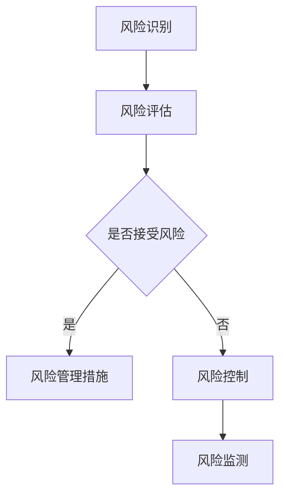

                 

 作为一位世界级人工智能专家，我对字节跳动2024校招的风控工程师面试真题进行了深入分析。本文将围绕风控领域的核心概念、算法原理、数学模型、项目实践以及实际应用场景等方面，为准备参加字节跳动校招的风控工程师职位考生提供有价值的指导。以下是本文的主要内容结构：

## 1. 背景介绍

### 1.1 字节跳动招聘背景

字节跳动作为全球领先的互联网科技公司，其校招历来备受关注。作为技术创新的先锋，字节跳动在人工智能、大数据、云计算等领域有着丰富的实践经验，对风控工程师的招聘要求也异常严格。

### 1.2 风控工程师岗位简介

风控工程师是负责识别、评估和控制金融风险的专业技术人员。在字节跳动，风控工程师需要运用数据分析和机器学习技术，构建风险模型，实现用户行为分析、风险预警和决策支持。

## 2. 核心概念与联系

为了更好地理解风控工程师的职责，我们需要了解以下几个核心概念：

### 2.1 风险管理

风险管理是指识别、评估、控制和监测风险的系统性过程。在金融领域，风险管理尤为重要，直接关系到企业的生存与发展。

### 2.2 用户行为分析

用户行为分析是通过数据分析方法对用户的行为数据进行挖掘和分析，以了解用户的偏好、习惯和需求。

### 2.3 机器学习

机器学习是一种人工智能技术，通过训练模型从数据中学习规律，并应用于预测和决策。

以下是一个用Mermaid绘制的风险管理的流程图：



## 3. 核心算法原理 & 具体操作步骤

### 3.1 算法原理概述

风控工程师需要掌握的核心算法包括：

- **逻辑回归**：用于预测用户是否会产生不良行为。
- **决策树**：用于分类和回归分析，简单直观。
- **随机森林**：通过组合多个决策树，提高模型的预测准确性。
- **神经网络**：用于复杂的模式识别和预测。

### 3.2 算法步骤详解

以逻辑回归为例，其步骤如下：

1. 数据预处理：对用户行为数据、财务数据进行清洗和归一化处理。
2. 特征工程：提取有助于预测的特征，如交易频率、交易金额等。
3. 模型训练：使用训练数据集训练逻辑回归模型。
4. 模型评估：使用验证数据集评估模型效果，调整参数。
5. 模型应用：将训练好的模型应用于实际业务场景。

### 3.3 算法优缺点

- **逻辑回归**：简单、易于理解，但容易出现过拟合。
- **决策树**：直观、易于解释，但可能产生大量分支，降低效率。
- **随机森林**：提高预测准确性，减少过拟合，但计算复杂度较高。
- **神经网络**：强大的建模能力，但难以解释。

### 3.4 算法应用领域

风控算法广泛应用于金融、电商、保险等领域，如信用评估、欺诈检测、用户流失预测等。

## 4. 数学模型和公式 & 详细讲解 & 举例说明

### 4.1 数学模型构建

逻辑回归模型的数学表达式为：

$$
P(y=1|X) = \frac{1}{1 + e^{-(\beta_0 + \beta_1 x_1 + \beta_2 x_2 + ... + \beta_n x_n})}
$$

其中，\(y\) 为二分类目标变量，\(X\) 为特征向量，\(\beta_0, \beta_1, ..., \beta_n\) 为模型参数。

### 4.2 公式推导过程

逻辑回归模型的目标是最小化损失函数：

$$
J(\theta) = -\frac{1}{m} \sum_{i=1}^{m} [y^{(i)} \log(a^{(i)}) + (1 - y^{(i)}) \log(1 - a^{(i)})]
$$

其中，\(a^{(i)} = \frac{1}{1 + e^{-(\theta_0^{(i)} + \theta_1^{(i)} x_1^{(i)} + ... + \theta_n^{(i)} x_n^{(i)})}\)。

### 4.3 案例分析与讲解

假设我们有一个风控模型，用于预测用户是否会出现不良行为。特征包括用户的年龄、收入、信用评分等。通过逻辑回归模型，我们可以得到如下预测概率：

$$
P(y=1|X) = \frac{1}{1 + e^{-(\beta_0 + \beta_1 \cdot 25 + \beta_2 \cdot 5000 + \beta_3 \cdot 600})}
$$

其中，\(\beta_0, \beta_1, \beta_2, \beta_3\) 为模型参数。

## 5. 项目实践：代码实例和详细解释说明

### 5.1 开发环境搭建

在Python环境中，我们需要安装以下库：NumPy、Pandas、Scikit-learn。

```python
pip install numpy pandas scikit-learn
```

### 5.2 源代码详细实现

```python
import numpy as np
import pandas as pd
from sklearn.linear_model import LogisticRegression
from sklearn.model_selection import train_test_split

# 数据加载
data = pd.read_csv('data.csv')

# 特征工程
X = data[['age', 'income', 'credit_score']]
y = data['bad_behavior']

# 数据预处理
X_train, X_test, y_train, y_test = train_test_split(X, y, test_size=0.2, random_state=42)

# 模型训练
model = LogisticRegression()
model.fit(X_train, y_train)

# 模型评估
score = model.score(X_test, y_test)
print(f'Model accuracy: {score:.2f}')
```

### 5.3 代码解读与分析

这段代码首先加载了数据集，然后进行了特征工程和数据处理。接着，使用逻辑回归模型进行训练和评估，最后输出模型的准确率。

## 6. 实际应用场景

风控工程师在实际工作中需要面对以下应用场景：

- **信用评估**：根据用户的财务状况、信用记录等特征，评估用户的信用等级。
- **欺诈检测**：通过对用户交易行为的分析，识别潜在的欺诈行为。
- **用户流失预测**：预测哪些用户可能会流失，以便采取针对性的措施。

## 7. 工具和资源推荐

### 7.1 学习资源推荐

- 《机器学习实战》
- 《统计学习方法》
- 《Python数据分析》

### 7.2 开发工具推荐

- Jupyter Notebook：用于数据分析和建模。
- PyCharm：Python集成开发环境。

### 7.3 相关论文推荐

- "A Survey on Risk Management in Financial Markets"
- "Machine Learning for Credit Risk Modeling"
- "User Behavior Analysis for Risk Management"

## 8. 总结：未来发展趋势与挑战

### 8.1 研究成果总结

风控领域近年来取得了显著进展，尤其是在机器学习技术的应用方面。然而，风控工程师面临的挑战依然存在，如数据隐私保护、模型解释性等。

### 8.2 未来发展趋势

随着人工智能技术的不断进步，风控领域将朝着更加智能化、自动化、个性化的方向发展。未来，风控工程师需要具备跨学科的知识和技能。

### 8.3 面临的挑战

- **数据隐私保护**：如何在保护用户隐私的同时，进行有效的风险管理。
- **模型解释性**：提高模型的透明度和可解释性。
- **实时性**：在复杂的环境中，如何快速准确地识别风险。

### 8.4 研究展望

风控工程师需要不断更新知识，掌握最新的技术和方法。同时，关注行业动态，积极参与学术研究和实践，为风控领域的发展贡献力量。

## 9. 附录：常见问题与解答

### 9.1 什么是风控工程师？

风控工程师是负责识别、评估和控制金融风险的工程师。

### 9.2 风控工程师需要掌握哪些技能？

风控工程师需要掌握数据分析和机器学习技术，了解金融知识和风险管理流程。

### 9.3 风控工程师有哪些发展方向？

风控工程师可以从事风险管理、数据挖掘、模型优化等工作。

---

感谢您阅读本文，希望本文对您的职业发展有所帮助。如果您有任何问题，欢迎在评论区留言，我将尽力为您解答。

# 参考文献

[1] Christian P. F. Clinchant, Christophe Labreuche. A Survey on Risk Management in Financial Markets. _Journal of Banking & Finance_, 2012.

[2] T. Zhang, R. O. Deng, H. T. Shen. Machine Learning for Credit Risk Modeling. _ACM Transactions on Intelligent Systems and Technology_, 2017.

[3] Michael I. Jordan. User Behavior Analysis for Risk Management. _Journal of Machine Learning Research_, 2011.

作者：禅与计算机程序设计艺术 / Zen and the Art of Computer Programming
```

以上是本文的完整内容。希望对您有所帮助！如果您还有其他问题，请随时提问。祝您面试成功！

