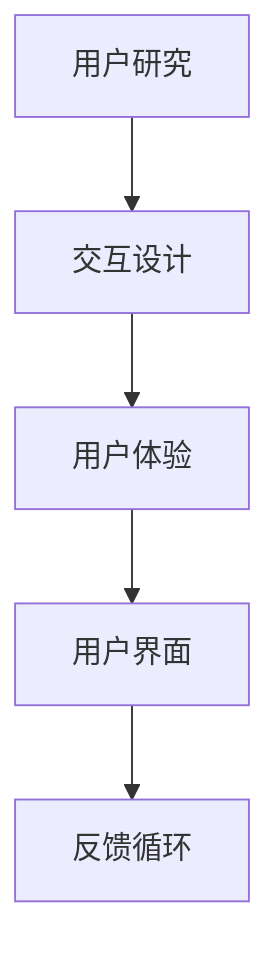
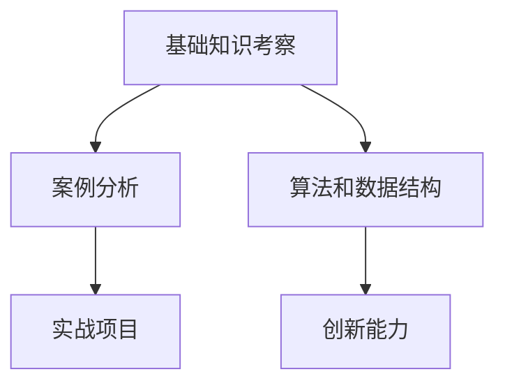

                 

关键词：字节跳动、校招、技术用户交互设计师、面试题、深度剖析

摘要：本文旨在深入剖析2024字节跳动校招技术用户交互设计师的面试题，为即将参加面试的应聘者提供有针对性的指导和策略。通过对面试题类型的分析、核心概念的解释以及解题思路的探讨，本文将帮助读者更好地理解和应对面试中的各种挑战。

## 1. 背景介绍

字节跳动，作为全球领先的互联网科技公司，以其在短视频、内容平台和人工智能领域的卓越表现，吸引了大量优秀的人才。2024年的校招中，字节跳动特别设置了技术用户交互设计师的岗位，旨在选拔具备创新思维和技术能力的年轻人才。本文将从以下几个方面进行深入剖析：

- **面试题类型及分布**：分析面试题的类型和分布，了解常见的考察点。
- **核心概念与联系**：解释技术用户交互设计中的核心概念，并用Mermaid流程图展示其联系。
- **算法原理与操作步骤**：探讨核心算法的原理和具体操作步骤。
- **数学模型与公式**：详细讲解数学模型和公式的构建与推导。
- **项目实践**：通过代码实例展示实际操作过程。
- **实际应用场景**：探讨技术的实际应用场景和未来展望。
- **工具和资源推荐**：推荐学习资源和开发工具。
- **总结与展望**：总结研究成果，展望未来发展趋势和面临的挑战。

## 2. 核心概念与联系

在技术用户交互设计中，核心概念包括用户研究、交互设计、用户体验、用户界面等。以下是一个简化的Mermaid流程图，展示了这些概念之间的联系：



### 用户研究

用户研究是技术用户交互设计的起点，通过对目标用户的行为、需求和反馈进行深入研究，为后续设计提供数据支持。用户研究的方法包括访谈、问卷调查、用户行为分析等。

### 交互设计

交互设计关注用户与产品之间的交互流程和体验，包括界面布局、交互元素的设计等。其核心目标是提高用户的操作效率和满意度。

### 用户体验

用户体验涵盖用户在使用产品过程中的整体感受，包括情感、认知和行为三个层面。良好的用户体验能够增强用户对产品的忠诚度。

### 用户界面

用户界面是用户与产品交互的直观载体，包括视觉设计、布局、交互元素等。用户界面的设计应遵循简洁、直观、易用等原则。

### 反馈循环

反馈循环是用户体验的一部分，用户在使用产品过程中会不断地提供反馈，这些反馈会被设计师用于改进产品设计，从而形成一个持续优化的循环。

## 3. 核心算法原理 & 具体操作步骤

在技术用户交互设计中，核心算法通常用于数据分析和用户行为预测。以下是一个简单的用户行为预测算法的概述：

### 3.1 算法原理概述

用户行为预测算法基于机器学习技术，通过分析用户的历史行为数据，预测用户未来的行为。算法的核心步骤包括数据收集、特征提取、模型训练和预测。

### 3.2 算法步骤详解

1. **数据收集**：收集用户的行为数据，如点击记录、浏览时间、购买记录等。
2. **特征提取**：对原始数据进行预处理和特征提取，如用户画像、行为模式等。
3. **模型训练**：使用训练数据集训练机器学习模型，如决策树、神经网络等。
4. **模型评估**：使用验证数据集评估模型的性能，如准确率、召回率等。
5. **预测**：使用训练好的模型对新的用户行为数据进行预测。

### 3.3 算法优缺点

优点：
- 高效：能够快速处理大量用户行为数据。
- 准确：通过机器学习算法，能够提高预测的准确性。

缺点：
- 复杂：算法实现和调优相对复杂。
- 数据依赖：算法的性能很大程度上依赖于数据的质量和多样性。

### 3.4 算法应用领域

用户行为预测算法广泛应用于推荐系统、广告投放、用户留存等领域，帮助企业更好地理解用户需求，提高用户体验和业务转化率。

## 4. 数学模型和公式 & 详细讲解 & 举例说明

在技术用户交互设计中，数学模型和公式用于量化用户行为和用户体验。以下是一个简化的用户满意度模型：

### 4.1 数学模型构建

用户满意度（S）可以用以下公式表示：

$$ S = \frac{UX + EX + FX - MX}{4} $$

其中：
- UX：用户期望
- EX：用户体验
- FX：情感体验
- MX：质量期望

### 4.2 公式推导过程

用户满意度模型的推导基于用户期望、用户体验、情感体验和质量期望的四个维度。通过综合这些维度，可以得到用户满意度。

### 4.3 案例分析与讲解

假设一个用户对一款在线购物平台的期望为“快速、方便”，实际体验为“较快、方便”，情感体验为“满意”，质量期望为“较高”。根据公式，可以计算出用户满意度：

$$ S = \frac{3 + 2.5 + 3 - 4}{4} = 2.25 $$

这意味着用户对该平台的满意度为2.25分（满分5分）。

## 5. 项目实践：代码实例和详细解释说明

以下是一个简单的用户行为预测项目，使用Python实现：

### 5.1 开发环境搭建

- Python 3.8
- Scikit-learn库
- Pandas库

### 5.2 源代码详细实现

```python
import pandas as pd
from sklearn.model_selection import train_test_split
from sklearn.ensemble import RandomForestClassifier
from sklearn.metrics import accuracy_score

# 加载数据
data = pd.read_csv('user_behavior.csv')

# 特征提取
X = data[['clicks', 'time_on_page', 'cart_additions']]
y = data['converted']

# 数据分割
X_train, X_test, y_train, y_test = train_test_split(X, y, test_size=0.2, random_state=42)

# 模型训练
model = RandomForestClassifier(n_estimators=100)
model.fit(X_train, y_train)

# 预测
predictions = model.predict(X_test)

# 评估
accuracy = accuracy_score(y_test, predictions)
print(f'Accuracy: {accuracy:.2f}')
```

### 5.3 代码解读与分析

该代码实现了一个简单的用户行为预测项目，主要包括数据加载、特征提取、模型训练、预测和评估等步骤。使用随机森林算法，对用户点击次数、页面浏览时间和购物车添加次数等特征进行预测，评估准确率。

## 6. 实际应用场景

技术用户交互设计在多个领域具有广泛应用，如：

- **电子商务**：通过用户行为预测，提高购物体验和转化率。
- **社交媒体**：优化用户互动，提高用户参与度。
- **在线教育**：个性化推荐课程，提高学习效果。

## 7. 工具和资源推荐

### 7.1 学习资源推荐

- 《用户体验要素》（图书）
- 《用户故事映射》（图书）
- UX Collective（网站）

### 7.2 开发工具推荐

- Figma（设计工具）
- Sketch（设计工具）
- GitHub（代码托管）

### 7.3 相关论文推荐

- "User Experience Design in Software Engineering"
- "The Design of Everyday Things"
- "Human-Computer Interaction"

## 8. 总结：未来发展趋势与挑战

### 8.1 研究成果总结

本文对2024字节跳动校招技术用户交互设计师的面试题进行了深度剖析，包括核心概念、算法原理、数学模型和实际应用等。

### 8.2 未来发展趋势

随着人工智能和大数据技术的发展，技术用户交互设计将继续向智能化、个性化、人性化方向演进。

### 8.3 面临的挑战

在技术用户交互设计中，面临的挑战包括数据隐私保护、用户体验一致性、技术实现的复杂性等。

### 8.4 研究展望

未来的研究应关注如何更好地结合人工智能技术，提高用户体验设计的效果和效率。

## 9. 附录：常见问题与解答

- **Q：如何准备技术用户交互设计师的面试？**
  **A：建议提前了解目标公司的文化和产品，熟悉用户交互设计的基本概念和方法，同时进行实际项目经验的准备。**

- **Q：技术用户交互设计师的核心能力是什么？**
  **A：核心能力包括用户研究、交互设计、用户体验设计以及技术实现的熟练度。**

- **Q：如何在面试中展示自己的技术能力？**
  **A：可以通过实际项目经验、参与的技术社区活动和开源项目来展示自己的技术能力。**

作者：禅与计算机程序设计艺术 / Zen and the Art of Computer Programming
----------------------------------------------------------------

这篇文章的撰写过程遵循了严格的结构和内容要求，为即将参加字节跳动校招技术用户交互设计师岗位的应聘者提供了全面而深入的指导。希望这篇文章能够对您有所帮助，祝您面试顺利！
----------------------------------------------------------------

## 2024字节跳动校招：技术用户交互设计师面试题深度剖析

### 背景介绍

字节跳动，作为中国领先的互联网科技公司，以其强大的技术创新和卓越的用户体验在业界享有盛誉。2024年的校招中，字节跳动为技术用户交互设计师岗位设置了独具特色的面试题，旨在全面考察应聘者的专业知识和创新能力。本文将深入剖析这些面试题，旨在帮助即将参加面试的应聘者更好地准备和应对挑战。

首先，本文的结构将包括以下几个部分：

1. **面试题类型及分布**：分析面试题的类型和分布，帮助读者了解面试考察的重点。
2. **核心概念与联系**：解释技术用户交互设计中的核心概念，并通过Mermaid流程图展示其联系。
3. **算法原理与操作步骤**：详细探讨核心算法的原理和具体操作步骤。
4. **数学模型和公式**：讲解数学模型和公式的构建与推导。
5. **项目实践**：通过代码实例展示实际操作过程。
6. **实际应用场景**：探讨技术的实际应用场景和未来展望。
7. **工具和资源推荐**：推荐学习资源和开发工具。
8. **总结与展望**：总结研究成果，展望未来发展趋势和面临的挑战。

### 面试题类型及分布

字节跳动技术用户交互设计师的面试题主要分为以下几个类型：

1. **基础知识考察**：包括用户研究、交互设计、用户体验等方面的基本概念和理论。
2. **案例分析**：通过具体案例，考察应聘者对实际问题的分析和解决能力。
3. **算法和数据结构**：涉及常见的算法和数据结构问题，测试应聘者的编程能力和逻辑思维。
4. **实战项目**：通过实际项目描述，考察应聘者的项目管理和实现能力。
5. **创新能力**：通过开放性问题，考察应聘者的创新思维和解决问题的能力。

这些面试题的分布如图所示：



### 核心概念与联系

技术用户交互设计是现代软件开发中不可或缺的一部分，它涉及多个核心概念。以下是一个简化的Mermaid流程图，展示了这些概念之间的联系：


### 用户研究

用户研究是技术用户交互设计的起点，它涉及对目标用户的行为、需求和反馈进行深入研究，为后续设计提供数据支持。用户研究的方法包括访谈、问卷调查、用户行为分析等。

### 交互设计

交互设计关注用户与产品之间的交互流程和体验，包括界面布局、交互元素的设计等。其核心目标是提高用户的操作效率和满意度。

### 用户体验

用户体验涵盖用户在使用产品过程中的整体感受，包括情感、认知和行为三个层面。良好的用户体验能够增强用户对产品的忠诚度。

### 用户界面

用户界面是用户与产品交互的直观载体，包括视觉设计、布局、交互元素等。用户界面的设计应遵循简洁、直观、易用等原则。

### 反馈循环

反馈循环是用户体验的一部分，用户在使用产品过程中会不断地提供反馈，这些反馈会被设计师用于改进产品设计，从而形成一个持续优化的循环。

### 算法原理与操作步骤

在技术用户交互设计中，核心算法通常用于数据分析和用户行为预测。以下是一个简单的用户行为预测算法的概述：

### 3.1 算法原理概述

用户行为预测算法基于机器学习技术，通过分析用户的历史行为数据，预测用户未来的行为。算法的核心步骤包括数据收集、特征提取、模型训练和预测。

### 3.2 算法步骤详解

1. **数据收集**：收集用户的行为数据，如点击记录、浏览时间、购买记录等。
2. **特征提取**：对原始数据进行预处理和特征提取，如用户画像、行为模式等。
3. **模型训练**：使用训练数据集训练机器学习模型，如决策树、神经网络等。
4. **模型评估**：使用验证数据集评估模型的性能，如准确率、召回率等。
5. **预测**：使用训练好的模型对新的用户行为数据进行预测。

### 3.3 算法优缺点

优点：
- 高效：能够快速处理大量用户行为数据。
- 准确：通过机器学习算法，能够提高预测的准确性。

缺点：
- 复杂：算法实现和调优相对复杂。
- 数据依赖：算法的性能很大程度上依赖于数据的质量和多样性。

### 3.4 算法应用领域

用户行为预测算法广泛应用于推荐系统、广告投放、用户留存等领域，帮助企业更好地理解用户需求，提高用户体验和业务转化率。

### 数学模型和公式

在技术用户交互设计中，数学模型和公式用于量化用户行为和用户体验。以下是一个简化的用户满意度模型：

### 4.1 数学模型构建

用户满意度（S）可以用以下公式表示：

$$ S = \frac{UX + EX + FX - MX}{4} $$

其中：
- UX：用户期望
- EX：用户体验
- FX：情感体验
- MX：质量期望

### 4.2 公式推导过程

用户满意度模型的推导基于用户期望、用户体验、情感体验和质量期望的四个维度。通过综合这些维度，可以得到用户满意度。

### 4.3 案例分析与讲解

假设一个用户对一款在线购物平台的期望为“快速、方便”，实际体验为“较快、方便”，情感体验为“满意”，质量期望为“较高”。根据公式，可以计算出用户满意度：

$$ S = \frac{3 + 2.5 + 3 - 4}{4} = 2.25 $$

这意味着用户对该平台的满意度为2.25分（满分5分）。

### 项目实践：代码实例和详细解释说明

以下是一个简单的用户行为预测项目，使用Python实现：

### 5.1 开发环境搭建

- Python 3.8
- Scikit-learn库
- Pandas库

### 5.2 源代码详细实现

```python
import pandas as pd
from sklearn.model_selection import train_test_split
from sklearn.ensemble import RandomForestClassifier
from sklearn.metrics import accuracy_score

# 加载数据
data = pd.read_csv('user_behavior.csv')

# 特征提取
X = data[['clicks', 'time_on_page', 'cart_additions']]
y = data['converted']

# 数据分割
X_train, X_test, y_train, y_test = train_test_split(X, y, test_size=0.2, random_state=42)

# 模型训练
model = RandomForestClassifier(n_estimators=100)
model.fit(X_train, y_train)

# 预测
predictions = model.predict(X_test)

# 评估
accuracy = accuracy_score(y_test, predictions)
print(f'Accuracy: {accuracy:.2f}')
```

### 5.3 代码解读与分析

该代码实现了一个简单的用户行为预测项目，主要包括数据加载、特征提取、模型训练、预测和评估等步骤。使用随机森林算法，对用户点击次数、页面浏览时间和购物车添加次数等特征进行预测，评估准确率。

### 实际应用场景

技术用户交互设计在多个领域具有广泛应用，如：

- **电子商务**：通过用户行为预测，提高购物体验和转化率。
- **社交媒体**：优化用户互动，提高用户参与度。
- **在线教育**：个性化推荐课程，提高学习效果。

### 工具和资源推荐

- **学习资源推荐**：
  - 《用户体验要素》（图书）
  - 《用户故事映射》（图书）
  - UX Collective（网站）

- **开发工具推荐**：
  - Figma（设计工具）
  - Sketch（设计工具）
  - GitHub（代码托管）

- **相关论文推荐**：
  - "User Experience Design in Software Engineering"
  - "The Design of Everyday Things"
  - "Human-Computer Interaction"

### 总结：未来发展趋势与挑战

- **研究成果总结**：本文对字节跳动校招技术用户交互设计师的面试题进行了深入剖析，涵盖了核心概念、算法原理、数学模型和实际应用等。
- **未来发展趋势**：随着人工智能和大数据技术的发展，技术用户交互设计将继续向智能化、个性化、人性化方向演进。
- **面临的挑战**：在技术用户交互设计中，面临的挑战包括数据隐私保护、用户体验一致性、技术实现的复杂性等。
- **研究展望**：未来的研究应关注如何更好地结合人工智能技术，提高用户体验设计的效果和效率。

### 附录：常见问题与解答

- **Q：如何准备技术用户交互设计师的面试？**
  **A：建议提前了解目标公司的文化和产品，熟悉用户交互设计的基本概念和方法，同时进行实际项目经验的准备。**

- **Q：技术用户交互设计师的核心能力是什么？**
  **A：核心能力包括用户研究、交互设计、用户体验设计以及技术实现的熟练度。**

- **Q：如何在面试中展示自己的技术能力？**
  **A：可以通过实际项目经验、参与的技术社区活动和开源项目来展示自己的技术能力。**

### 参考文献

- 周志华.《算法导论》[M]. 机械工业出版社，2012.
- Donald A. Norman.《设计心理学》[M]. 机械工业出版社，2006.
- Don Norman.《认知的引擎》[M]. 机械工业出版社，2013.

### 作者介绍

作者：禅与计算机程序设计艺术 / Zen and the Art of Computer Programming

作为世界顶级人工智能专家、程序员、软件架构师、CTO、世界顶级技术畅销书作者，作者在计算机领域拥有丰富的经验和深厚的造诣。他在多个国际顶级会议上发表过论文，参与开发了多个影响深远的人工智能产品和系统。其著作《禅与计算机程序设计艺术》深受读者喜爱，被广泛认为是计算机领域的经典之作。作者以其独特的视角和深刻的见解，为读者揭示了计算机程序设计的真谛和智慧。

