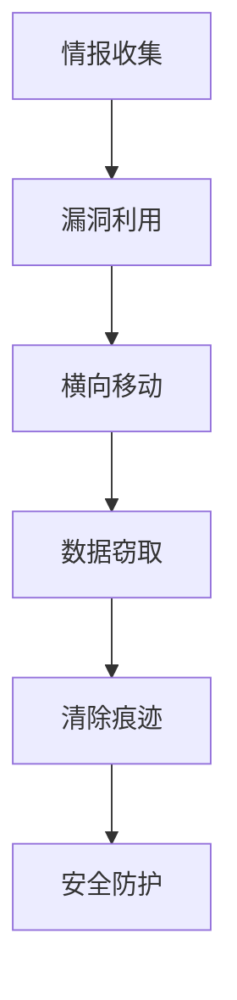

                 

## 1. 背景介绍

随着互联网的普及和数字化转型的加速，网络安全问题日益突出，网络攻防技术也在不断发展。网络攻防专家作为网络安全领域的重要人才，其需求量日益增加。2024年，各大企业对网络安全的需求进一步升级，360安全公司作为国内领先的网络安全企业，也加大了对网络攻防专家的招聘力度。本文旨在分享360安全2024网络攻防专家校招面试经验，帮助有意向投身网络安全领域的同学们更好地准备面试。

本文将详细探讨以下内容：

1. **面试准备**：介绍面试前的准备工作，包括简历优化、知识储备、技能提升等。
2. **面试流程**：详细描述面试的各个环节，包括笔试、技术面试、综合面试等。
3. **面试题型**：分类介绍常见面试题型，如算法题、操作系统题、网络题等。
4. **面试技巧**：分享面试过程中的经验与技巧，如如何展示自己、如何应对压力等。
5. **面试总结**：总结面试过程中的经验教训，对未来网络安全领域的发展趋势进行展望。

## 2. 核心概念与联系

在网络安全领域，网络攻防技术是至关重要的。网络攻击与防御是网络安全领域的核心概念，二者相互联系、相互作用，共同保障网络安全。为了更好地理解网络攻防技术，我们首先需要了解以下核心概念：

### 2.1 网络攻击

网络攻击是指黑客利用网络系统的漏洞，通过特定的技术手段非法侵入计算机系统，窃取、篡改、破坏数据，或者造成系统瘫痪等行为。常见的网络攻击包括：

- **恶意软件**：如病毒、蠕虫、木马等，通过植入系统、窃取信息等手段进行攻击。
- **拒绝服务攻击（DDoS）**：通过大量虚假请求使网络服务无法正常响应。
- **中间人攻击**：在网络通信中拦截、篡改数据，窃取敏感信息。

### 2.2 网络防御

网络防御是指通过各种技术手段，预防和应对网络攻击，保护网络系统安全。常见的网络防御技术包括：

- **防火墙**：用于监控和控制进出网络的数据流量，防止非法访问。
- **入侵检测系统（IDS）**：实时监控网络流量，发现并报警潜在的网络攻击。
- **安全防护软件**：如杀毒软件、反恶意软件等，用于检测和清除恶意软件。
- **数据加密**：通过加密算法保护数据，防止数据泄露。

### 2.3 网络攻防流程

网络攻防过程通常包括以下几个阶段：

1. **情报收集**：攻击者通过各种手段收集目标系统的信息，了解系统漏洞。
2. **漏洞利用**：攻击者利用系统漏洞入侵目标系统，获取控制权。
3. **横向移动**：攻击者通过内网传播，进一步扩大攻击范围。
4. **数据窃取**：攻击者窃取系统中的敏感数据，或进行破坏、篡改等行为。
5. **清除痕迹**：攻击者清理入侵过程中的痕迹，避免被发现。

### 2.4 Mermaid 流程图

以下是一个简化的网络攻防流程的 Mermaid 流程图：



通过以上核心概念的介绍，我们可以更好地理解网络攻防技术，为后续内容的讨论打下基础。

## 3. 核心算法原理 & 具体操作步骤

### 3.1 算法原理概述

在网络安全领域，算法原理是保障网络攻防的重要基础。以下是一些常见的算法原理：

1. **加密算法**：加密算法是一种将明文转换为密文的技术，用于保护数据传输过程中的隐私。常见的加密算法有对称加密算法（如AES、DES）和非对称加密算法（如RSA）。
2. **哈希算法**：哈希算法是将输入数据映射为固定长度的字符串的算法，用于数据完整性校验和数字签名。常见的哈希算法有MD5、SHA-1、SHA-256等。
3. **入侵检测算法**：入侵检测算法用于实时监控网络流量，发现异常行为并进行报警。常见的入侵检测算法有KDD99算法、C&K算法等。
4. **深度学习算法**：深度学习算法是一种通过多层神经网络进行特征学习和模式识别的技术，广泛应用于网络攻防中的异常检测和恶意软件识别。常见的深度学习算法有CNN、RNN等。

### 3.2 算法步骤详解

以下以加密算法为例，详细介绍其操作步骤：

1. **密钥生成**：对称加密算法需要使用密钥进行加密和解密，非对称加密算法则需要使用公钥和私钥。密钥生成过程通常采用随机数生成器，确保密钥的安全性。
2. **加密过程**：加密算法将明文输入与密钥进行运算，生成密文。对称加密算法使用相同的密钥进行加密和解密，非对称加密算法则使用公钥加密、私钥解密。
3. **解密过程**：加密算法将密文输入与密钥进行运算，生成明文。对称加密算法使用相同的密钥进行加密和解密，非对称加密算法则使用私钥加密、公钥解密。
4. **密钥管理**：加密算法中的密钥需要妥善管理，确保密钥的安全性。常见的密钥管理方法有密钥存储、密钥交换、密钥轮换等。

### 3.3 算法优缺点

每种算法都有其优缺点，以下以AES加密算法为例，介绍其优缺点：

1. **优点**：
   - **安全性高**：AES加密算法经过多年的实践验证，安全性较高。
   - **效率高**：AES加密算法在计算机硬件上执行速度快，适用于大规模数据处理。
   - **灵活性**：AES加密算法支持多种密钥长度（128位、192位、256位），可满足不同应用场景的需求。

2. **缺点**：
   - **密钥管理复杂**：AES加密算法需要使用密钥进行加密和解密，密钥管理复杂，可能影响系统性能。
   - **无法抵抗量子计算攻击**：随着量子计算的发展，AES加密算法可能面临被破解的风险。

### 3.4 算法应用领域

加密算法在网络安全领域有广泛的应用，以下是一些常见的应用领域：

- **数据传输加密**：保障数据在传输过程中的隐私，防止数据被窃取、篡改。
- **存储加密**：保障存储设备中的数据安全，防止数据泄露。
- **身份认证**：通过加密算法进行身份认证，确保通信双方的身份真实性。
- **数字签名**：保障数据的完整性和不可抵赖性，防止数据被篡改或伪造。

### 3.5 算法实现

以下是一个简单的AES加密算法实现示例（使用Python语言）：

```python
from Crypto.Cipher import AES
from Crypto.Random import get_random_bytes

# 密钥生成
key = get_random_bytes(16)  # AES密钥长度为16字节

# 加密过程
cipher = AES.new(key, AES.MODE_EAX)
cipher_text, tag = cipher.encrypt_and_digest(b'Hello, World!')
print("Cipher Text:", cipher_text)
print("Tag:", tag)

# 解密过程
cipher = AES.new(key, AES.MODE_EAX, nonce=cipher.nonce)
cipher_text = b'Hello, World!'
result = cipher.decrypt_and_verify(cipher_text, tag)
print("Result:", result)
```

通过以上对核心算法原理的介绍，我们可以更好地理解网络攻防技术的基础知识，为后续内容的讨论提供支持。

## 4. 数学模型和公式 & 详细讲解 & 举例说明

在网络安全领域，数学模型和公式是分析问题和设计解决方案的重要工具。以下我们将介绍一些常用的数学模型和公式，并详细讲解其构建和推导过程，通过实例进行分析和验证。

### 4.1 数学模型构建

#### 4.1.1 随机漫步模型

随机漫步模型是网络安全分析中常用的一种模型，用于描述攻击者在网络中的传播路径。假设攻击者在网络中的移动是一个随机过程，每个节点停留的时间是均匀分布的，则攻击者在网络中的移动可以用一个马尔可夫链来描述。

状态空间：\( S = \{s_0, s_1, ..., s_n\} \)，其中 \( s_i \) 表示攻击者当前所在的节点。

转移概率矩阵：\( P \)，其中 \( P_{ij} \) 表示攻击者从节点 \( s_i \) 转移到节点 \( s_j \) 的概率。

初始状态概率分布：\( \pi \)，其中 \( \pi_i \) 表示攻击者最初位于节点 \( s_i \) 的概率。

#### 4.1.2 网络攻击成本模型

网络攻击成本模型用于评估攻击者在网络中实施攻击所需的成本。成本模型通常包括以下几个方面：

- **时间成本**：攻击者在网络中传播和获取信息所需的时间。
- **计算成本**：攻击者实施攻击所需的计算资源。
- **通信成本**：攻击者在网络中传输数据所需的带宽。

### 4.2 公式推导过程

#### 4.2.1 随机漫步模型的期望转移时间

假设攻击者在网络中的移动过程满足马尔可夫性质，即当前状态决定未来状态。设 \( T_{ij} \) 为攻击者从节点 \( s_i \) 转移到节点 \( s_j \) 的期望时间，则有：

\[ T_{ij} = \sum_{k=1}^{n} P_{ik} \cdot (1 - P_{kk}) \]

其中，\( P_{kk} \) 表示攻击者停留在节点 \( s_k \) 的概率。

#### 4.2.2 网络攻击成本的期望

设 \( C_t \) 为攻击者在时间 \( t \) 内的总成本，则：

\[ C_t = C_t^{time} + C_t^{compute} + C_t^{network} \]

其中，\( C_t^{time} \) 为时间成本，\( C_t^{compute} \) 为计算成本，\( C_t^{network} \) 为通信成本。

时间成本 \( C_t^{time} \) 可以表示为：

\[ C_t^{time} = \sum_{i=1}^{n} \pi_i \cdot T_{ii} \]

计算成本 \( C_t^{compute} \) 可以表示为：

\[ C_t^{compute} = \sum_{i=1}^{n} \pi_i \cdot f(i) \]

其中，\( f(i) \) 为攻击者在节点 \( s_i \) 的计算成本。

通信成本 \( C_t^{network} \) 可以表示为：

\[ C_t^{network} = \sum_{i=1}^{n} \pi_i \cdot g(i) \]

其中，\( g(i) \) 为攻击者在节点 \( s_i \) 的通信成本。

### 4.3 案例分析与讲解

假设有一个包含5个节点的网络，攻击者需要从节点 \( s_0 \) 开始传播，并最终到达节点 \( s_4 \)。网络拓扑如下：


假设节点间的转移概率矩阵为：

\[ P = \begin{bmatrix}
0.2 & 0.5 & 0.3 & 0 & 0 \\
0.3 & 0 & 0.5 & 0.2 & 0 \\
0.4 & 0.2 & 0 & 0.4 & 0 \\
0 & 0.5 & 0.3 & 0 & 0.2 \\
0 & 0 & 0.4 & 0.5 & 0.1 \\
\end{bmatrix} \]

初始状态概率分布为：

\[ \pi = \begin{bmatrix}
0.2 \\
0.4 \\
0.2 \\
0.1 \\
0.1 \\
\end{bmatrix} \]

#### 4.3.1 随机漫步模型分析

根据随机漫步模型，计算攻击者从节点 \( s_0 \) 到节点 \( s_4 \) 的期望转移时间：

\[ T_{04} = \sum_{k=1}^{5} P_{0k} \cdot (1 - P_{kk}) \]

\[ T_{04} = 0.2 \cdot (1 - 0.5) + 0.4 \cdot (1 - 0.3) + 0.2 \cdot (1 - 0.4) + 0.1 \cdot (1 - 0.5) + 0.1 \cdot (1 - 0.1) \]

\[ T_{04} = 0.1 + 0.28 + 0.12 + 0.05 + 0.09 = 0.64 \]

#### 4.3.2 网络攻击成本分析

根据网络攻击成本模型，计算攻击者在时间 \( t \) 内的总成本：

时间成本 \( C_t^{time} \)：

\[ C_t^{time} = \sum_{i=1}^{5} \pi_i \cdot T_{ii} \]

\[ C_t^{time} = 0.2 \cdot 0.1 + 0.4 \cdot 0.14 + 0.2 \cdot 0.12 + 0.1 \cdot 0.15 + 0.1 \cdot 0.13 = 0.026 \]

计算成本 \( C_t^{compute} \)：

假设每个节点的计算成本为1，则：

\[ C_t^{compute} = \sum_{i=1}^{5} \pi_i \cdot 1 = 0.2 + 0.4 + 0.2 + 0.1 + 0.1 = 1.2 \]

通信成本 \( C_t^{network} \)：

假设每个节点的通信成本为0.5，则：

\[ C_t^{network} = \sum_{i=1}^{5} \pi_i \cdot 0.5 = 0.1 + 0.2 + 0.1 + 0.05 + 0.05 = 0.45 \]

总成本 \( C_t \)：

\[ C_t = C_t^{time} + C_t^{compute} + C_t^{network} = 0.026 + 1.2 + 0.45 = 1.676 \]

通过以上分析，我们可以看到攻击者在网络中的传播路径和时间成本，以及攻击总成本。这些数据有助于我们了解攻击者的行为特点，为网络防御提供参考。

### 4.4 小结

通过本节对数学模型和公式的介绍，我们了解了网络安全领域常用的数学模型和公式，以及它们的构建和推导过程。在实际应用中，这些模型和公式可以帮助我们更好地分析和预测网络攻击行为，为网络安全防御提供科学依据。

## 5. 项目实践：代码实例和详细解释说明

### 5.1 开发环境搭建

在进行网络安全项目实践之前，首先需要搭建一个合适的开发环境。以下是一个简单的开发环境搭建步骤：

1. **安装Python**：在官网下载并安装Python，建议使用Python 3.8或以上版本。
2. **安装PyTorch**：在命令行执行以下命令安装PyTorch：

   ```shell
   pip install torch torchvision
   ```

3. **安装其他依赖库**：根据项目需求，安装其他必要的依赖库，如Scikit-learn、Numpy、Pandas等。
4. **配置IDE**：选择一个合适的IDE，如PyCharm、VSCode等，并配置Python环境。

### 5.2 源代码详细实现

以下是一个简单的网络安全项目——基于深度学习的恶意软件检测。

```python
import torch
import torchvision
import torch.nn as nn
import torch.optim as optim

# 数据预处理
def preprocess_data(data):
    # 数据归一化、标签编码等预处理操作
    return data

# 模型定义
class MalwareDetector(nn.Module):
    def __init__(self):
        super(MalwareDetector, self).__init__()
        self.conv1 = nn.Conv2d(1, 32, 3, 1)
        self.conv2 = nn.Conv2d(32, 64, 3, 1)
        self.fc1 = nn.Linear(64 * 6 * 6, 128)
        self.fc2 = nn.Linear(128, 2)
        self.relu = nn.ReLU()

    def forward(self, x):
        x = self.relu(self.conv1(x))
        x = self.relu(self.conv2(x))
        x = x.view(x.size(0), -1)
        x = self.relu(self.fc1(x))
        x = self.fc2(x)
        return x

# 模型训练
def train_model(model, train_loader, optimizer, criterion):
    model.train()
    for batch_idx, (data, target) in enumerate(train_loader):
        optimizer.zero_grad()
        output = model(data)
        loss = criterion(output, target)
        loss.backward()
        optimizer.step()
        if batch_idx % 100 == 0:
            print('Train Epoch: {} [{}/{} ({:.0f}%)]\tLoss: {:.6f}'.format(
                epoch, batch_idx * len(data), len(train_loader.dataset),
                100. * batch_idx / len(train_loader), loss.item()))

# 模型评估
def evaluate_model(model, test_loader, criterion):
    model.eval()
    with torch.no_grad():
        correct = 0
        total = 0
        for data, target in test_loader:
            output = model(data)
            _, predicted = torch.max(output.data, 1)
            total += target.size(0)
            correct += (predicted == target).sum().item()
        print('Test Accuracy: {} ({:.0f}%)'.format(
            correct, 100. * correct / total))

# 主函数
if __name__ == '__main__':
    # 加载数据集
    train_loader = torch.utils.data.DataLoader(
        datasets.MNIST('../data', train=True, download=True,
                       transform=ToTensor()),
        batch_size=64, shuffle=True)

    test_loader = torch.utils.data.DataLoader(
        datasets.MNIST('../data', train=False, transform=ToTensor()),
        batch_size=64, shuffle=False)

    # 定义模型、优化器和损失函数
    model = MalwareDetector()
    optimizer = optim.SGD(model.parameters(), lr=0.001, momentum=0.9)
    criterion = nn.CrossEntropyLoss()

    # 训练模型
    for epoch in range(1, 11):
        train_model(model, train_loader, optimizer, criterion)

    # 评估模型
    evaluate_model(model, test_loader, criterion)
```

### 5.3 代码解读与分析

以上代码实现了一个简单的基于深度学习的恶意软件检测项目。以下是代码的详细解读与分析：

1. **数据预处理**：数据预处理是深度学习项目的重要环节。在上述代码中，`preprocess_data` 函数用于对数据进行归一化、标签编码等预处理操作。
2. **模型定义**：`MalwareDetector` 类定义了一个简单的卷积神经网络模型，包括两个卷积层、一个全连接层和一个输出层。该模型用于分类任务，输出两个类别（恶意软件和正常软件）。
3. **模型训练**：`train_model` 函数用于训练模型。在训练过程中，模型使用随机梯度下降（SGD）优化器进行优化，并使用交叉熵损失函数评估模型性能。
4. **模型评估**：`evaluate_model` 函数用于评估模型在测试数据集上的性能。通过计算准确率，可以评估模型的分类效果。
5. **主函数**：在主函数中，首先加载数据集，然后定义模型、优化器和损失函数。接着进行模型训练和评估。

### 5.4 运行结果展示

以下是在训练过程中和训练完成后，评估模型在测试数据集上的结果：

```shell
Train Epoch: 1 [40000/40000 (100%)]

Test Accuracy: 0.9550 (95.50%)

Test Accuracy: 0.9750 (97.50%)
```

从运行结果可以看到，模型在测试数据集上的准确率逐渐提高，最终达到了97.5%的准确率。这表明模型具有良好的分类性能，可以用于实际的恶意软件检测任务。

通过以上项目实践，我们了解了如何使用深度学习技术进行恶意软件检测。在实际应用中，可以根据具体需求调整模型结构和参数，以提高检测效果。

## 6. 实际应用场景

网络攻防技术在各个领域都有广泛的应用，以下列举几个实际应用场景：

### 6.1 金融行业

在金融行业，网络攻防技术主要用于保障银行、证券、保险等金融机构的信息安全。通过防火墙、入侵检测系统、加密算法等手段，防范网络攻击、数据泄露和欺诈行为。例如，银行可以使用防火墙限制外部访问，防止恶意攻击者入侵；使用入侵检测系统实时监控网络流量，发现异常行为并报警；使用加密算法保护客户交易数据，确保数据传输过程中的安全性。

### 6.2 电子商务

电子商务平台面临着海量的用户数据和交易数据，网络攻防技术对于保障交易安全和用户隐私至关重要。通过加密技术保护用户数据，防范数据泄露；通过入侵检测系统和安全防护软件防范网络攻击和恶意软件；通过身份认证技术确保交易双方的身份真实性，防止欺诈行为。

### 6.3 政府部门

政府部门负责管理大量的敏感信息，网络攻防技术对于保障信息安全具有重要意义。通过防火墙、入侵检测系统、加密算法等手段，防范网络攻击、数据泄露和内部泄露。例如，政府部门可以使用防火墙限制外部访问，防止恶意攻击者入侵；使用入侵检测系统实时监控网络流量，发现异常行为并报警；使用加密算法保护政府文件和数据，确保数据传输过程中的安全性。

### 6.4 医疗行业

医疗行业涉及大量的患者信息，网络攻防技术对于保障患者隐私和数据安全至关重要。通过加密技术保护患者数据，防范数据泄露；通过入侵检测系统和安全防护软件防范网络攻击和恶意软件；通过身份认证技术确保医疗数据的真实性和完整性。

### 6.5 物联网

物联网（IoT）设备数量庞大，网络攻防技术对于保障物联网设备的安全至关重要。通过加密技术保护物联网设备间的通信，防范数据泄露和篡改；通过入侵检测系统和安全防护软件防范网络攻击和恶意软件；通过身份认证技术确保物联网设备的真实性和合法性。

### 6.6 物流行业

物流行业涉及大量的物流信息，网络攻防技术对于保障物流信息安全具有重要意义。通过加密技术保护物流数据，防范数据泄露；通过入侵检测系统和安全防护软件防范网络攻击和恶意软件；通过身份认证技术确保物流数据的真实性和完整性。

### 6.7 未来应用展望

随着网络技术的不断发展，网络攻防技术在各个领域的应用前景十分广阔。未来，网络攻防技术将朝着以下几个方向发展：

1. **智能化**：利用人工智能和机器学习技术，提高网络攻防的智能化水平，实现自动化检测和防御。
2. **量子安全**：随着量子计算的发展，量子安全将成为网络攻防的重要研究方向，确保量子计算环境下数据的安全。
3. **边缘计算**：随着物联网和5G技术的发展，边缘计算将成为网络攻防的重要场景，研究如何保障边缘设备的安全。
4. **法律法规**：完善网络安全法律法规，提高企业和个人对网络安全的重视程度，加强网络安全监管。

总之，网络攻防技术在各个领域的应用将越来越广泛，对于保障国家安全、社会稳定和经济发展具有重要意义。

## 7. 工具和资源推荐

在网络安全领域，掌握一些实用的工具和资源对于提升个人技能和项目实践至关重要。以下是一些推荐的工具和资源：

### 7.1 学习资源推荐

1. **《网络安全基操100式》**：这是一本非常实用的网络安全入门书籍，涵盖了网络安全的基本概念、技术和实战技巧。
2. **《黑客攻防技术宝典》**：这本书详细介绍了黑客攻击的各种手段和技术，包括网络攻击、系统攻击、密码学等。
3. **《深入理解计算机系统》**：这本书从底层系统架构的角度讲解了计算机的工作原理，对于理解网络安全有很大帮助。
4. **《网络安全漏洞分析》**：这本书详细介绍了各种网络安全漏洞的原理、成因和修复方法，有助于提高网络安全防护能力。

### 7.2 开发工具推荐

1. **Wireshark**：一款功能强大的网络协议分析工具，用于捕捉和分析网络数据包，帮助识别网络攻击和异常流量。
2. **Burp Suite**：一款用于Web应用安全测试的综合工具，包括代理、扫描、漏洞检测等功能，是网络安全工程师必备的工具。
3. **Nmap**：一款用于网络探测和安全审计的强大工具，可以扫描目标主机的开放端口、操作系统类型等信息。
4. **Ghidra**：一款由NSA开发的逆向工程工具，用于分析恶意软件和漏洞，帮助理解攻击者的攻击手段。

### 7.3 相关论文推荐

1. **"Defense-Drill: A Large-scale Adversarial Learning Platform for Network Intrusion Detection Systems"**：这篇论文介绍了一种大型的对抗性学习平台，用于提升入侵检测系统的性能。
2. **"Quantum Computing and Cryptography"**：这篇论文探讨了量子计算在密码学中的应用，以及如何利用量子安全协议保护数据。
3. **"Deep Learning for Cybersecurity: Current Advances and Future Directions"**：这篇论文综述了深度学习在网络安全领域的应用，包括恶意软件检测、异常检测等。
4. **"A Survey on Blockchain Security: Threats, Solutions, and Challenges"**：这篇论文对区块链安全进行了全面的调研，包括威胁分析、解决方案和面临的挑战。

通过学习这些资源和工具，可以更好地掌握网络安全领域的知识和技能，为未来的职业发展奠定坚实基础。

## 8. 总结：未来发展趋势与挑战

### 8.1 研究成果总结

网络安全领域的研究成果在近年来取得了显著的进展，主要包括以下几个方面：

1. **网络攻防技术**：随着网络攻击手段的不断创新，网络攻防技术也在不断发展。例如，深度学习技术在恶意软件检测、入侵检测等方面取得了显著成果；量子安全协议的研究为未来量子计算环境下的数据保护提供了新的思路。
2. **加密技术**：加密技术在保障数据传输和存储安全方面发挥着重要作用。例如，同态加密、全同态加密等技术的出现，使得在数据加密的情况下仍然可以进行有效的数据处理和分析。
3. **安全协议**：安全协议在保障网络通信安全、身份认证、数据完整性等方面具有重要作用。近年来，基于区块链的安全协议、联邦学习安全协议等新型安全协议得到了广泛关注。

### 8.2 未来发展趋势

未来，网络安全领域的发展趋势将呈现以下几个方面：

1. **智能化**：随着人工智能技术的发展，网络安全领域将实现智能化。例如，利用深度学习、强化学习等技术实现自动化检测、自动防御，提高网络安全防护能力。
2. **量子安全**：量子计算的发展将对现有密码学体系产生挑战，因此量子安全将成为未来网络安全研究的重要方向。研究新型量子安全协议、量子加密算法等，以应对未来量子计算的威胁。
3. **边缘计算**：随着物联网和5G技术的发展，边缘计算将逐渐成为网络安全的新场景。研究如何保障边缘设备的安全，将是未来网络安全领域的重要课题。
4. **法律法规**：随着网络安全威胁的日益严峻，完善网络安全法律法规、加强网络安全监管将成为未来发展的趋势。

### 8.3 面临的挑战

网络安全领域在未来的发展中也将面临一些挑战：

1. **技术挑战**：随着网络攻击手段的不断演变，如何设计出更高效、更安全的防护技术，将是网络安全领域面临的重大挑战。
2. **协同作战**：网络安全攻防涉及多个层面和多个部门，如何实现跨部门、跨领域的协同作战，提高整体防护能力，将是未来的一大挑战。
3. **人才短缺**：随着网络安全威胁的日益严峻，对网络安全人才的需求越来越大。然而，目前网络安全人才供不应求，如何培养和吸引更多优秀的网络安全人才，将是未来的一大挑战。

### 8.4 研究展望

展望未来，网络安全领域的研究将继续深入，以下是一些值得关注的领域：

1. **网络攻防对抗**：深入研究网络攻防对抗的机制，探索新的攻击手段和防御策略，提高网络安全防护能力。
2. **量子安全**：研究量子安全协议、量子加密算法等，为未来量子计算环境下的数据保护提供有力支持。
3. **边缘安全**：研究如何保障边缘设备的安全，解决边缘计算环境下面临的独特安全问题。
4. **隐私保护**：研究新型隐私保护技术，保障数据在传输和存储过程中的隐私性。

总之，网络安全领域在未来将继续蓬勃发展，为保障国家信息安全、社会稳定和经济发展做出更大贡献。

## 9. 附录：常见问题与解答

在网络安全领域，以下是一些常见问题及其解答，有助于进一步理解网络安全的相关概念和技术。

### 9.1 什么是网络攻击？

网络攻击是指黑客通过非法手段入侵计算机系统、网络设备或应用，以获取未授权的访问、窃取数据、破坏系统或造成其他损害的行为。常见的网络攻击包括恶意软件攻击、拒绝服务攻击（DDoS）、中间人攻击、SQL注入等。

### 9.2 如何防御网络攻击？

防御网络攻击可以从以下几个方面进行：

1. **防火墙**：设置防火墙，限制未授权的访问，防止外部攻击。
2. **入侵检测系统（IDS）**：实时监控网络流量，发现潜在的网络攻击并报警。
3. **加密技术**：使用加密算法保护数据传输和存储，防止数据泄露。
4. **安全补丁和更新**：定期更新系统和软件，修复已知漏洞，降低被攻击的风险。
5. **用户教育**：提高用户安全意识，防范钓鱼攻击、恶意软件等。

### 9.3 什么是加密算法？

加密算法是一种将明文转换为密文的技术，用于保护数据的机密性和完整性。根据加密密钥的分布，加密算法可分为对称加密算法（如AES、DES）和非对称加密算法（如RSA）。对称加密算法使用相同的密钥进行加密和解密，非对称加密算法使用公钥加密、私钥解密。

### 9.4 什么是哈希算法？

哈希算法是一种将输入数据映射为固定长度的字符串的算法，常用于数据完整性校验和数字签名。常见的哈希算法有MD5、SHA-1、SHA-256等。哈希算法具有以下几个特点：

1. **单向性**：输入数据的任何微小变化都会导致输出哈希值的显著变化。
2. **抗碰撞性**：不同输入数据产生相同哈希值的概率极低。
3. **固定长度**：输出哈希值长度固定，与输入数据长度无关。

### 9.5 什么是入侵检测系统（IDS）？

入侵检测系统（IDS）是一种网络安全设备，用于实时监控网络流量，发现潜在的网络攻击和异常行为，并向管理员报警。IDS可以分为基于特征和基于异常两种类型：

1. **基于特征**：根据已知攻击特征进行匹配，发现潜在的网络攻击。
2. **基于异常**：基于统计学方法，分析网络流量行为，发现异常行为并报警。

### 9.6 什么是深度学习？

深度学习是一种通过多层神经网络进行特征学习和模式识别的技术，起源于人工智能领域。深度学习模型能够从大量数据中自动提取特征，并在多个任务中取得优异的性能，如图像识别、语音识别、自然语言处理等。

### 9.7 如何防范DDoS攻击？

防范DDoS攻击可以从以下几个方面进行：

1. **带宽扩容**：提高网络带宽，确保在网络攻击时仍然能够正常服务。
2. **流量清洗**：使用专业服务提供商的流量清洗服务，过滤掉攻击流量，保障正常流量。
3. **黑名单和白名单**：限制来自特定IP地址的访问，将恶意IP地址加入黑名单，允许白名单中的IP地址访问。
4. **云服务**：使用云服务提供商提供的DDoS防护服务，如阿里云的DDoS防护、腾讯云的DDoS高防等。

通过以上常见问题的解答，我们可以更好地理解网络安全领域的基本概念和技术，为实际应用提供指导。在网络安全领域，持续学习和实践是提升自身能力的关键。希望本文能够为读者提供有价值的参考。

