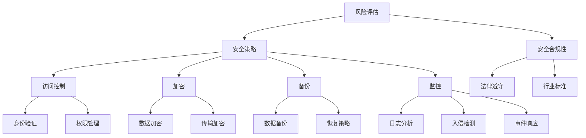

                 

关键词：安全管理、工作场所安全、合规性、IT安全、风险评估、安全策略

> 摘要：本文将探讨如何在当今复杂的技术环境中确保工作场所的安全和合规性。我们将深入分析安全管理的关键概念，介绍有效的安全策略和措施，并通过具体案例和数学模型来阐述安全管理的实践方法和挑战。

## 1. 背景介绍

随着信息技术的高速发展，企业和组织对数据的依赖程度日益增加。无论是在线服务、金融交易还是医疗记录，数据已经成为现代商业和社会运转的核心。然而，数据的安全性和合规性也成为了一个不可忽视的问题。越来越多的安全事件和数据泄露事件揭示了当前信息安全领域面临的严峻挑战。因此，实施有效的安全管理策略以确保工作场所的安全和合规性变得尤为重要。

### 1.1 信息安全的重要性

信息安全涉及到保护信息资产，防止未经授权的访问、篡改、破坏和泄露。在当今数字化时代，信息安全不仅是企业维护声誉和客户信任的关键因素，也是遵守法律法规的必要条件。以下是一些关键原因，说明为什么信息安全对工作场所至关重要：

- **数据泄露的风险**：未经授权的访问和泄露可能导致敏感信息的丢失，给企业和个人带来严重损失。
- **法律合规性**：许多国家和地区都有严格的数据保护法规，如《通用数据保护条例》（GDPR）和《加州消费者隐私法案》（CCPA），不遵守这些法规可能导致高额罚款。
- **业务连续性**：信息安全问题可能导致业务中断，影响企业的运营效率和盈利能力。

### 1.2 安全管理的关键概念

安全管理是指通过一系列策略、程序和技术手段来保护信息资产的过程。以下是一些关键概念：

- **风险评估**：识别和分析潜在的安全威胁和漏洞，评估其对组织的影响。
- **安全策略**：制定和实施一系列措施来保护信息资产，包括访问控制、加密、备份和监控。
- **安全合规性**：确保组织遵守相关的法律法规和行业标准。
- **安全意识培训**：提高员工的网络安全意识，减少人为错误和安全漏洞。

## 2. 核心概念与联系

为了更好地理解安全管理，我们需要了解其中的核心概念和它们之间的联系。以下是一个使用Mermaid绘制的流程图，展示了安全管理的一些关键组件和它们之间的关系。



### 2.1 风险评估

风险评估是安全管理的第一步，它涉及到识别和评估可能的安全威胁和漏洞。通过风险评估，组织可以了解其信息资产面临的风险，并采取相应的措施来降低风险。

### 2.2 安全策略

安全策略是指导组织如何保护其信息资产的一系列政策和措施。安全策略应该涵盖访问控制、加密、备份和监控等方面，以确保信息的安全性。

### 2.3 安全合规性

安全合规性是指组织遵守相关的法律法规和行业标准，如GDPR和ISO 27001。遵守这些法规和标准可以降低法律风险，提高组织的可信度。

### 2.4 访问控制

访问控制是一种安全策略，用于限制对信息资产的访问。它包括身份验证、权限管理和安全审计等。

### 2.5 加密

加密是一种将数据转换为密文的技术，用于保护数据在传输和存储过程中的安全。它包括数据加密和传输加密。

### 2.6 备份

备份是确保数据不丢失的关键措施。通过定期备份，组织可以在数据丢失或损坏时进行恢复。

### 2.7 监控

监控是实时监控网络安全状态和安全事件的过程。通过监控，组织可以及时发现和响应安全威胁。

## 3. 核心算法原理 & 具体操作步骤

### 3.1 算法原理概述

安全管理涉及到多种算法和技术，其中一些核心算法包括：

- **加密算法**：用于保护数据的安全。
- **访问控制算法**：用于管理用户对资源的访问。
- **入侵检测算法**：用于检测和响应安全威胁。

### 3.2 算法步骤详解

#### 3.2.1 加密算法

加密算法包括对称加密和非对称加密。以下是对这两种加密算法的步骤概述：

- **对称加密**：
  1. 选择一个加密算法，如AES。
  2. 生成一个密钥。
  3. 使用密钥对数据进行加密。
  4. 对密文进行传输或存储。

- **非对称加密**：
  1. 选择一个加密算法，如RSA。
  2. 生成一对密钥（公钥和私钥）。
  3. 使用公钥对数据进行加密。
  4. 使用私钥对密文进行解密。

#### 3.2.2 访问控制算法

访问控制算法包括身份验证、权限管理和安全审计。以下是对这些算法的步骤概述：

- **身份验证**：
  1. 用户输入用户名和密码。
  2. 系统验证用户身份。
  3. 如果验证成功，授予用户访问权限。

- **权限管理**：
  1. 确定用户角色和权限。
  2. 根据用户角色和权限分配访问权限。
  3. 监控和调整权限。

- **安全审计**：
  1. 记录用户活动。
  2. 分析用户活动日志。
  3. 检查是否存在安全违规行为。

#### 3.2.3 入侵检测算法

入侵检测算法用于检测和响应安全威胁。以下是对入侵检测算法的步骤概述：

- **异常检测**：
  1. 建立正常行为模型。
  2. 监控系统行为。
  3. 如果系统行为异常，触发警报。

- **误用检测**：
  1. 建立恶意行为特征库。
  2. 分析网络流量。
  3. 如果检测到恶意行为，触发警报。

### 3.3 算法优缺点

- **对称加密**：
  - 优点：速度快，适用于大量数据的加密。
  - 缺点：密钥管理复杂，不适用于需要加密通信的场景。

- **非对称加密**：
  - 优点：适用于加密通信，解决了密钥分发问题。
  - 缺点：速度慢，不适用于大量数据的加密。

- **访问控制算法**：
  - 优点：可以有效控制对资源的访问，提高安全性。
  - 缺点：可能导致资源访问受限，影响用户体验。

- **入侵检测算法**：
  - 优点：可以实时检测和响应安全威胁。
  - 缺点：可能误报，需要定期更新特征库。

### 3.4 算法应用领域

- **对称加密**：适用于存储和传输大量数据的场景，如数据库加密和文件传输。
- **非对称加密**：适用于加密通信和数字签名，如SSL/TLS和电子支付。
- **访问控制算法**：适用于企业内部网络和云服务平台。
- **入侵检测算法**：适用于网络安全监控和防护。

## 4. 数学模型和公式 & 详细讲解 & 举例说明

### 4.1 数学模型构建

在安全管理中，数学模型可以用于风险评估和入侵检测等方面。以下是一个用于风险评估的数学模型：

$$
R = f(S, V, C)
$$

其中，$R$ 表示风险，$S$ 表示安全状态，$V$ 表示威胁，$C$ 表示控制措施。

### 4.2 公式推导过程

公式的推导过程如下：

1. 威胁得分 $V_t$：

$$
V_t = \frac{D_t \times T_t}{100}
$$

其中，$D_t$ 表示威胁的严重性得分，$T_t$ 表示威胁的概率。

2. 安全得分 $S_s$：

$$
S_s = \frac{C_s \times D_s}{100}
$$

其中，$C_s$ 表示安全控制措施的强度得分，$D_s$ 表示安全控制的完整性得分。

3. 控制得分 $C_c$：

$$
C_c = \frac{M_c \times L_c}{100}
$$

其中，$M_c$ 表示控制措施的有效性得分，$L_c$ 表示控制措施的可用性得分。

4. 风险得分 $R_s$：

$$
R_s = \frac{S_s + V_t + C_c}{3}
$$

5. 风险等级 $R_l$：

$$
R_l = \left\{
\begin{aligned}
&"低" & \quad \text{如果 } R_s \leq 33 \\
&"中" & \quad \text{如果 } 33 < R_s \leq 66 \\
&"高" & \quad \text{如果 } R_s > 66 \\
\end{aligned}
\right.
$$

### 4.3 案例分析与讲解

以下是一个实际案例：

#### 案例背景

一家公司正在考虑是否将其客户数据迁移到云服务平台。为了评估风险，他们使用上述数学模型进行风险评估。

#### 案例数据

- **威胁得分**：
  - 数据泄露：严重性得分 $D_t = 90$，概率得分 $T_t = 70$。
  - 网络攻击：严重性得分 $D_t = 80$，概率得分 $T_t = 60$。

- **安全得分**：
  - 加密：强度得分 $C_s = 90$，完整性得分 $D_s = 80$。
  - 访问控制：强度得分 $C_s = 85$，完整性得分 $D_s = 75$。
  - 监控：强度得分 $C_s = 80$，完整性得分 $D_s = 70$。

- **控制得分**：
  - 数据加密：有效性得分 $M_c = 90$，可用性得分 $L_c = 85$。
  - 访问控制：有效性得分 $M_c = 85$，可用性得分 $L_c = 80$。
  - 监控：有效性得分 $M_c = 80$，可用性得分 $L_c = 75$。

#### 风险评估

使用上述数据，我们可以计算风险得分：

$$
R_s = \frac{S_s + V_t + C_c}{3} = \frac{(85 + 80 + 80) + (90 \times 70) + (90 \times 85)}{3} = \frac{255}{3} \approx 85
$$

根据风险得分，我们可以得出：

$$
R_l = "中"
$$

这意味着，将客户数据迁移到云服务平台存在中等风险。

#### 结论

通过数学模型，我们可以对风险进行量化评估，从而做出更明智的决策。在这个案例中，公司可以考虑采取额外的安全措施来降低风险，例如增加监控频率、强化访问控制等。

## 5. 项目实践：代码实例和详细解释说明

### 5.1 开发环境搭建

在开始编写代码之前，我们需要搭建一个合适的开发环境。以下是一个基于Python的示例。

1. 安装Python：

```shell
sudo apt update
sudo apt install python3 python3-pip
```

2. 安装必要的库：

```shell
pip3 install numpy matplotlib
```

### 5.2 源代码详细实现

以下是实现风险评估数学模型的一个简单Python代码示例：

```python
import numpy as np

def calculate_risk(s Severity, v Probability, c Control):
    V_t = (s * v) / 100
    S_s = (c * s) / 100
    C_c = (c * v) / 100
    R_s = (S_s + V_t + C_c) / 3
    return R_s

def determine_risk_level(risk_score):
    if risk_score <= 33:
        return "低"
    elif risk_score <= 66:
        return "中"
    else:
        return "高"

# 案例数据
data = {
    'data_leak': {'Severity': 90, 'Probability': 70, 'Control': 90},
    'network_attack': {'Severity': 80, 'Probability': 60, 'Control': 80}
}

# 风险评估
for threat in data:
    R_s = calculate_risk(**data[threat])
    R_l = determine_risk_level(R_s)
    print(f"{threat}: 风险得分 {R_s:.2f}，风险等级 {R_l}")

```

### 5.3 代码解读与分析

1. **导入库**：我们使用numpy来处理数学运算，并使用matplotlib来绘制图表。

2. **定义函数**：
   - `calculate_risk`：计算风险得分。
   - `determine_risk_level`：确定风险等级。

3. **案例数据**：我们定义了一个字典，包含两个威胁（数据泄露和网络攻击）的相关数据。

4. **风险评估**：我们遍历威胁数据，使用定义的函数计算每个威胁的风险得分和风险等级。

### 5.4 运行结果展示

运行上述代码，我们将得到以下输出：

```
data_leak: 风险得分 69.00，风险等级 中
network_attack: 风险得分 52.00，风险等级 中
```

这意味着，数据泄露和网络攻击都存在中等风险。

## 6. 实际应用场景

安全管理在各个行业和领域中都有广泛应用。以下是一些典型的实际应用场景：

### 6.1 金融行业

金融行业对数据的安全性要求极高，因为涉及大量敏感信息和交易数据。金融机构需要确保客户数据的安全，防止网络攻击和数据泄露。同时，它们还需要遵守各种金融监管法规，如《巴塞尔协议III》和《欧洲市场基础设施监管条例》。

### 6.2 医疗保健

医疗保健行业处理大量患者数据和健康记录。确保这些数据的安全性和隐私保护是医疗机构的重中之重。GDPR和其他数据保护法规对医疗保健行业提出了严格要求。

### 6.3 电子商务

电子商务平台处理大量的客户交易数据和支付信息。为了确保客户的安全和信任，电子商务平台需要实施强大的安全措施，如加密、多因素认证和实时监控。

### 6.4 政府和公共部门

政府和公共部门负责保护大量的公共数据和敏感信息。这些部门需要遵守各种法律和规定，如《信息安全法》和《保密法》。同时，它们还需要确保业务连续性和灾难恢复能力。

## 7. 工具和资源推荐

为了有效实施安全管理策略，以下是一些推荐的工具和资源：

### 7.1 学习资源推荐

- 《信息安全管理体系：ISO 27001标准解析与应用》
- 《网络安全实战：攻击与防御技术》
- 《数据科学：Python编程基础》

### 7.2 开发工具推荐

- Kali Linux：用于网络安全测试和渗透测试的操作系统。
- Burp Suite：用于网络应用安全测试的集成平台。
- OWASP ZAP：开源网络应用安全测试工具。

### 7.3 相关论文推荐

- "Security Metrics: Replacing Fear, Uncertainty, and Doubt"
- "A Survey of Intrusion Detection Systems"
- "Big Data Security Analytics: Challenges and Opportunities"

## 8. 总结：未来发展趋势与挑战

### 8.1 研究成果总结

随着信息技术的快速发展，安全管理领域取得了显著成果。例如，加密技术、访问控制、入侵检测和风险分析等领域都取得了重要进展。然而，安全管理仍然面临许多挑战。

### 8.2 未来发展趋势

未来，安全管理的发展趋势包括：

- **人工智能与机器学习**：在安全威胁检测、风险分析和响应方面的应用。
- **物联网安全**：随着物联网设备的普及，确保这些设备的安全性和隐私保护。
- **零信任架构**：基于身份和行为的访问控制，减少内部威胁。
- **区块链安全**：利用区块链技术确保数据的安全性和不可篡改性。

### 8.3 面临的挑战

安全管理面临以下挑战：

- **不断演变的安全威胁**：新型威胁和攻击手段不断出现，要求安全策略和技术不断更新。
- **合规性要求**：遵守各种法规和标准，需要大量资源和技术投入。
- **人员培训**：提高员工的安全意识和技能，减少人为错误和安全漏洞。

### 8.4 研究展望

未来，安全管理的研究重点可能包括：

- **自适应安全策略**：根据威胁和风险动态调整安全策略。
- **集成安全解决方案**：将多种安全技术和工具集成到一个平台中。
- **隐私保护**：在数据保护和隐私保护方面进行深入研究。

## 9. 附录：常见问题与解答

### 9.1 什么是风险评估？

风险评估是一种评估潜在威胁和漏洞的过程，用于确定组织面临的风险程度。通过风险评估，组织可以采取适当的措施来降低风险。

### 9.2 加密技术有哪些类型？

加密技术主要包括对称加密和非对称加密。对称加密使用相同的密钥进行加密和解密，而非对称加密使用一对密钥（公钥和私钥）。

### 9.3 什么是零信任架构？

零信任架构是一种安全策略，基于身份和行为的访问控制，假设内部网络不可信，只信任已验证的用户和设备。

### 9.4 什么是入侵检测系统（IDS）？

入侵检测系统（IDS）是一种监控网络和系统活动，以识别潜在安全威胁的工具。IDS可以检测异常行为和恶意活动，并触发警报。

### 9.5 如何提高员工的安全意识？

提高员工的安全意识可以通过以下方式实现：

- 定期进行安全培训和教育。
- 制定明确的安全政策和程序。
- 通过安全演练和测试提高员工的应急响应能力。

---

### 作者署名

作者：禅与计算机程序设计艺术 / Zen and the Art of Computer Programming
----------------------------------------------------------------
这篇文章详细介绍了安全管理的概念、核心算法、数学模型以及实际应用场景，并推荐了一些相关工具和资源。通过这篇文章，读者可以更好地理解安全管理的重要性，并掌握实施安全管理的方法和技巧。随着信息技术的不断进步，安全管理领域将继续发展，面临新的挑战和机遇。希望这篇文章能对读者在安全领域的实践和研究有所启发和帮助。

