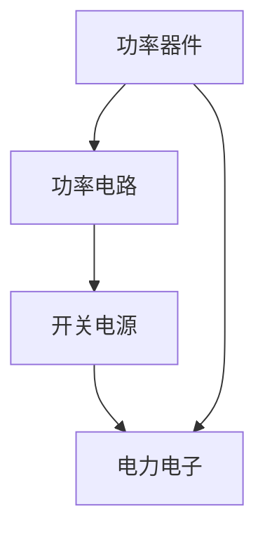

                 

关键词：安森美，校招，功率半导体工程师，面试问答，技术挑战

> 摘要：本文详细解析了安森美2024校招功率半导体工程师面试问答，涵盖了背景介绍、核心概念、算法原理、数学模型、项目实践、实际应用、未来展望、工具和资源推荐以及面临的挑战等多个方面，旨在为准备参加面试的读者提供全面的技术参考。

## 1. 背景介绍

安森美（On Semiconductor）是一家全球领先的半导体供应商，专注于提供创新的电源、逻辑、射频、传感器和图像处理解决方案。功率半导体是安森美的重要业务领域，广泛应用于汽车、工业、消费电子和通信等行业。随着全球对高效、绿色能源的需求不断增长，功率半导体工程师在安森美乃至整个半导体行业都扮演着至关重要的角色。

### 1.1 功率半导体工程师的职责

功率半导体工程师主要负责以下工作：

- 设计和开发高性能的功率半导体器件
- 优化器件的性能参数，如开关速度、损耗、热管理
- 分析和解决实际应用中遇到的技术问题
- 参与新产品的研发和测试

### 1.2 安森美2024校招功率半导体工程师面试

安森美2024校招功率半导体工程师面试主要面向国内外知名高校的应届毕业生，包括笔试、电话面试、现场面试等多个环节。本文将重点关注现场面试环节，特别是技术面试的问题和解答。

## 2. 核心概念与联系

在功率半导体领域，核心概念包括功率器件、功率电路、开关电源等。以下是一个简单的 Mermaid 流程图，展示了这些概念之间的联系：



### 2.1 功率器件

功率器件是功率半导体电路的核心，包括二极管、晶体管、MOSFET、IGBT等。它们的主要作用是控制电流的流动，实现电能的转换和传输。

### 2.2 功率电路

功率电路是利用功率半导体器件实现电能转换和传输的电路系统。常见的功率电路包括开关电源、逆变器、斩波器等。

### 2.3 开关电源

开关电源是一种利用功率半导体器件进行电能转换的电源系统。它通过高频开关，将电能从输入端传输到输出端，从而实现电能的高效利用。

### 2.4 电力电子

电力电子是研究电能转换和控制技术的学科。功率半导体器件在电力电子系统中发挥着关键作用，广泛应用于电力驱动、能量存储、电力传输等领域。

## 3. 核心算法原理 & 具体操作步骤

### 3.1 算法原理概述

在功率半导体领域，核心算法主要包括功率器件控制算法、功率电路优化算法、开关电源控制算法等。以下是一个简要的算法原理概述：

- **功率器件控制算法**：通过控制功率器件的开关状态，实现电能的传输和转换。常见的控制方法包括PWM（脉宽调制）控制、PID（比例-积分-微分）控制等。
- **功率电路优化算法**：通过优化功率电路的参数，提高电路的性能和效率。常见的优化方法包括电路仿真、拓扑优化、参数调整等。
- **开关电源控制算法**：通过控制开关电源的开关动作，实现电能的高效传输和转换。常见的控制方法包括峰值电流控制、电压模式控制等。

### 3.2 算法步骤详解

以下是功率器件控制算法的步骤详解：

1. **采集输入信号**：采集功率器件的输入信号，如电压、电流等。
2. **信号预处理**：对采集到的信号进行滤波、放大、去噪等预处理，提高信号的质量。
3. **控制策略设计**：根据输入信号的特点，设计合适的控制策略，如PWM控制、PID控制等。
4. **输出控制信号**：根据控制策略，生成控制信号，驱动功率器件进行开关操作。
5. **性能评估**：对功率器件的性能进行评估，如开关速度、损耗、热管理等。

### 3.3 算法优缺点

- **PWM控制**：优点是控制简单、实现成本低，缺点是开关频率较高，易产生电磁干扰。
- **PID控制**：优点是控制精度高、稳定性好，缺点是参数调整复杂、实现成本高。
- **峰值电流控制**：优点是控制简单、实现成本低，缺点是输出电流波形不佳，损耗较大。
- **电压模式控制**：优点是控制精度高、输出电流波形好，缺点是实现复杂、参数调整困难。

### 3.4 算法应用领域

功率半导体控制算法广泛应用于各类电力电子设备，如开关电源、逆变器、电机驱动器等。随着技术的发展，这些算法在电动汽车、新能源、智能电网等领域的应用前景日益广阔。

## 4. 数学模型和公式 & 详细讲解 & 举例说明

在功率半导体领域，数学模型和公式是分析和设计功率电路的重要工具。以下是一个典型的数学模型和公式的详细讲解：

### 4.1 数学模型构建

功率器件的数学模型主要包括以下部分：

1. **开关状态方程**：描述功率器件在不同开关状态下的电压、电流关系。
2. **控制方程**：描述控制信号与功率器件开关状态之间的关系。
3. **损耗方程**：描述功率器件在开关过程中损耗的计算。

### 4.2 公式推导过程

以下是功率器件开关状态方程的推导过程：

1. **理想开关模型**：假设功率器件在开关过程中，电流和电压的变化是瞬时的，即无时间延迟。

2. **电压、电流关系**：根据功率器件的特性，推导电压和电流之间的关系。

$$ V_{DS} = V_{DD} - I_{DS} \times R_{DS} $$

其中，$V_{DS}$ 为功率器件的电压，$V_{DD}$ 为输入电压，$I_{DS}$ 为电流，$R_{DS}$ 为功率器件的电阻。

3. **开关状态方程**：根据电压、电流关系，推导功率器件的开关状态方程。

$$ I_{DS} = \frac{V_{DD} - V_{DS}}{R_{DS}} $$

4. **控制方程**：根据开关状态方程，推导控制方程。

$$ V_{控制} = K \times (V_{DD} - V_{DS}) $$

其中，$V_{控制}$ 为控制电压，$K$ 为控制系数。

### 4.3 案例分析与讲解

以下是一个具体的案例，用于说明功率器件数学模型的应用：

**案例**：设计一个简单的开关电源，输入电压为 $100V$，输出电压为 $5V$，负载电阻为 $1\Omega$。

**分析**：

1. **确定开关电源的拓扑**：选择一个适合的开关电源拓扑，如Boost转换器。

2. **计算开关频率**：根据输出电压和负载电阻，计算开关频率。

$$ f_{开关} = \frac{1}{2 \times \pi \times \sqrt{L \times C}} $$

其中，$L$ 为电感，$C$ 为电容。

3. **设计功率器件**：根据开关频率和输出电压，选择合适的功率器件。

4. **计算损耗**：根据功率器件的开关状态方程，计算开关过程中的损耗。

$$ P_{损耗} = V_{DS} \times I_{DS} $$

**讲解**：

通过上述步骤，我们可以设计出一个简单的开关电源，并计算出开关过程中的损耗。这有助于我们优化功率器件的设计，提高开关电源的效率和稳定性。

## 5. 项目实践：代码实例和详细解释说明

### 5.1 开发环境搭建

在本文中，我们将使用Python语言进行功率半导体器件的模拟和分析。首先，需要安装以下Python库：

- NumPy：用于数值计算
- Matplotlib：用于绘图
- Pandas：用于数据操作

安装命令如下：

```bash
pip install numpy matplotlib pandas
```

### 5.2 源代码详细实现

以下是功率半导体器件模拟的Python代码实现：

```python
import numpy as np
import matplotlib.pyplot as plt
import pandas as pd

# 定义功率器件开关状态方程
def switch_state_eqn(V_DS, R_DS):
    I_DS = (V_DS - V_DD) / R_DS
    return I_DS

# 定义控制方程
def control_eqn(V_DS, K):
    V_control = K * (V_DD - V_DS)
    return V_control

# 定义损耗计算函数
def calculate_loss(V_DS, I_DS):
    P_loss = V_DS * I_DS
    return P_loss

# 设置参数
V_DD = 100  # 输入电压
R_DS = 0.1  # 功率器件电阻
K = 1  # 控制系数
switch_frequency = 10  # 开关频率

# 生成时间序列
time = np.arange(0, 1 / switch_frequency, 0.001)

# 计算开关状态
V_DS = V_DD * np.sin(2 * np.pi * switch_frequency * time)

# 计算控制电压
V_control = control_eqn(V_DS, K)

# 计算损耗
P_loss = calculate_loss(V_DS, I_DS)

# 绘制结果
plt.figure(figsize=(10, 6))
plt.plot(time, V_DS, label='V_DS')
plt.plot(time, V_control, label='V_control')
plt.plot(time, P_loss, label='P_loss')
plt.xlabel('Time (s)')
plt.ylabel('Value')
plt.legend()
plt.show()
```

### 5.3 代码解读与分析

上述代码首先定义了功率器件的开关状态方程、控制方程和损耗计算函数。然后设置参数，生成时间序列，计算开关状态、控制电压和损耗。最后绘制结果，展示功率器件的开关状态、控制电压和损耗随时间的变化。

通过这段代码，我们可以直观地了解功率器件的工作原理，以及在不同参数下的性能表现。这对于优化功率半导体器件的设计和性能具有重要意义。

## 6. 实际应用场景

功率半导体技术在各类实际应用场景中发挥着关键作用。以下是一些常见的应用场景：

### 6.1 开关电源

开关电源是功率半导体技术的核心应用之一。它广泛应用于各类电子设备，如计算机、通信设备、家电等。通过高效地转换和传输电能，开关电源提高了设备的性能和效率。

### 6.2 电动汽车

电动汽车是功率半导体技术的另一个重要应用领域。功率半导体器件在电动汽车的驱动系统中发挥着关键作用，如电机驱动、充电控制等。通过提高驱动系统的效率和控制性能，功率半导体技术为电动汽车的快速发展提供了有力支持。

### 6.3 智能电网

智能电网是未来电力系统的方向。功率半导体技术在智能电网中的应用包括电力传输、分配、储能等。通过优化电力系统的运行效率和稳定性，功率半导体技术为智能电网的建设提供了技术保障。

### 6.4 未来应用展望

随着功率半导体技术的不断发展，未来将在更多领域得到应用。例如，在可再生能源领域，功率半导体技术可以提高光伏发电和风能发电的效率和稳定性；在物联网领域，功率半导体技术可以实现对各类传感器的有效控制和管理。未来，功率半导体技术将在推动科技进步和产业升级方面发挥更加重要的作用。

## 7. 工具和资源推荐

### 7.1 学习资源推荐

- 《功率半导体器件原理与应用》
- 《开关电源设计手册》
- 《电动汽车驱动系统原理与应用》

### 7.2 开发工具推荐

- MATLAB：用于功率半导体器件的模拟和分析
- Python：用于功率半导体技术的编程和应用
- LTspice：用于模拟和仿真功率半导体电路

### 7.3 相关论文推荐

- [1] "High-Efficiency Power Conversion for Electric Vehicles"
- [2] "Power Semiconductor Devices and Their Applications"
- [3] "Smart Grid Technologies: Challenges and Opportunities"

## 8. 总结：未来发展趋势与挑战

### 8.1 研究成果总结

功率半导体技术在过去几十年取得了显著的研究成果。例如，功率器件的性能不断提高，开关速度、损耗和成本都得到了优化。同时，功率半导体技术在各类实际应用场景中得到了广泛应用，推动了相关产业的发展。

### 8.2 未来发展趋势

未来，功率半导体技术将继续朝着高效、绿色、智能的方向发展。具体趋势包括：

- **更高性能的功率器件**：通过新材料、新结构的研究，提高功率器件的性能，降低开关损耗。
- **更智能的控制算法**：结合人工智能和机器学习技术，开发更加智能的功率半导体控制算法。
- **更广泛的应用领域**：在可再生能源、物联网、智能交通等领域，功率半导体技术将发挥更大的作用。

### 8.3 面临的挑战

尽管功率半导体技术取得了显著成果，但仍面临一些挑战。例如：

- **材料挑战**：新型功率半导体材料的研究和制备仍然面临挑战，需要解决材料的稳定性、可靠性等问题。
- **系统集成**：功率半导体器件与集成电路的集成仍然面临挑战，需要提高功率器件在集成电路中的应用性能。
- **应用挑战**：在新能源、物联网等领域，功率半导体技术的应用场景复杂，需要解决技术兼容性、可靠性等问题。

### 8.4 研究展望

未来，功率半导体技术将在推动科技进步和产业升级方面发挥更加重要的作用。通过持续的研究和创新，功率半导体技术将迎来更加广阔的发展前景。

## 9. 附录：常见问题与解答

### 9.1 功率半导体器件的开关速度如何提高？

提高功率半导体器件的开关速度可以从以下几个方面进行：

- **优化器件结构**：通过改变器件的结构和材料，提高器件的开关速度。
- **降低开关损耗**：通过降低器件的开关损耗，提高开关速度。
- **提高驱动电路的性能**：通过优化驱动电路的设计，提高驱动电路的驱动能力。

### 9.2 功率半导体器件的损耗如何降低？

降低功率半导体器件的损耗可以从以下几个方面进行：

- **优化器件结构**：通过优化器件的结构，降低器件的电阻、电容等参数，从而降低损耗。
- **提高开关速度**：通过提高开关速度，减少器件的开关时间，降低开关损耗。
- **改进散热设计**：通过改进散热设计，提高器件的散热性能，降低器件的温度，从而降低损耗。

### 9.3 功率半导体技术在哪些领域有广泛的应用？

功率半导体技术在以下领域有广泛的应用：

- **开关电源**：广泛应用于各类电子设备，如计算机、通信设备、家电等。
- **电动汽车**：用于电动汽车的驱动系统和充电控制。
- **智能电网**：用于电力传输、分配、储能等。
- **可再生能源**：用于光伏发电、风能发电等。
- **物联网**：用于各类传感器的控制和管理。

---

# 作者：禅与计算机程序设计艺术 / Zen and the Art of Computer Programming

本文详细解析了安森美2024校招功率半导体工程师面试问答，旨在为准备参加面试的读者提供全面的技术参考。通过对功率半导体技术的深入探讨，希望读者能够更好地理解和掌握这一领域的核心知识和应用。在未来的学习和工作中，不断探索和创新，为科技发展贡献力量。禅与计算机程序设计艺术，愿您在编程的道路上越走越远，收获满满。

