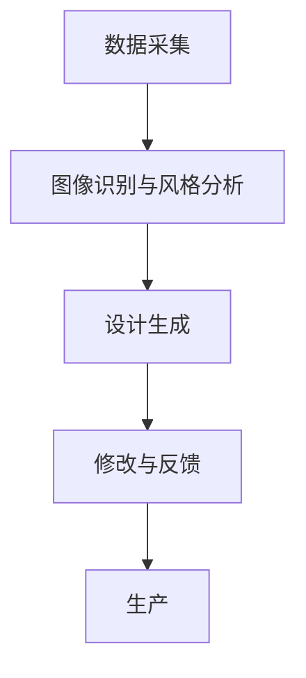

                 

关键词：个性化定制、AI、服装设计、深度学习、计算机视觉

> 摘要：随着人工智能技术的飞速发展，个性化服装定制正逐渐成为时尚产业的新趋势。本文将探讨如何利用人工智能技术，尤其是深度学习和计算机视觉，实现高效的定制服装设计，并分析其在实际应用中的潜在影响和未来发展方向。

## 1. 背景介绍

个性化定制服务已经成为消费者追求的一种生活方式，尤其在服装行业，消费者不再满足于批量生产的标准化产品，他们渴望拥有更加独特、符合个人风格的服装。在此背景下，人工智能（AI）技术，尤其是深度学习和计算机视觉的应用，为服装定制行业带来了革命性的变化。

深度学习通过神经网络模拟人类大脑的学习过程，能够从大量的数据中学习模式和特征，从而实现高度准确的图像识别和分类。计算机视觉则借助深度学习算法，可以分析图像、视频中的内容，提取有用的信息。这些技术的结合，使得个性化服装定制成为可能。

## 2. 核心概念与联系

### 2.1 个性化定制服装的概念

个性化定制服装是指根据消费者的个人需求、体型、风格偏好等，设计并生产出独一无二的服装。这一过程通常包括以下几个步骤：

1. **数据采集**：收集消费者的体型数据、偏好风格等。
2. **设计**：根据数据生成初步的设计方案。
3. **修改与反馈**：消费者对设计方案进行评价和修改。
4. **生产**：最终设计通过数字化的生产流程转化为实物。

### 2.2 人工智能在服装定制中的应用

人工智能在个性化服装定制中的应用主要体现在以下几个方面：

1. **图像识别与风格分析**：利用深度学习算法对服装图像进行识别和分析，提取风格特征。
2. **数据挖掘与分析**：从海量的消费者数据中挖掘有用的信息，用于个性化推荐和设计优化。
3. **自动化设计**：使用生成对抗网络（GAN）等算法自动生成服装设计。

### 2.3  Mermaid 流程图



## 3. 核心算法原理 & 具体操作步骤

### 3.1  算法原理概述

在个性化服装定制中，核心算法主要涉及以下几个方面：

1. **深度卷积神经网络（CNN）**：用于图像识别和特征提取。
2. **生成对抗网络（GAN）**：用于自动设计服装。
3. **协同过滤（Collaborative Filtering）**：用于个性化推荐。

### 3.2  算法步骤详解

1. **数据采集**：
   - 使用3D人体扫描技术获取消费者的体型数据。
   - 收集消费者的服装购买历史和评价数据。

2. **图像识别与风格分析**：
   - 使用CNN对服装图像进行特征提取。
   - 通过风格迁移技术将流行元素融入到消费者个人风格中。

3. **设计生成**：
   - 利用GAN生成符合消费者风格的服装设计。
   - 对生成的设计进行评估和优化。

4. **修改与反馈**：
   - 消费者对设计方案进行评价和修改。
   - 不断迭代设计，直至消费者满意。

5. **生产**：
   - 使用数字化的生产流程，快速生产出定制服装。

### 3.3  算法优缺点

- **优点**：
  - 提高设计效率和个性化水平。
  - 降低生产成本，缩短生产周期。

- **缺点**：
  - 需要大量的训练数据。
  - 对算法的实现和维护要求较高。

### 3.4  算法应用领域

- **时尚行业**：个性化服装定制。
- **零售行业**：商品推荐。
- **医疗行业**：个性化医疗方案。

## 4. 数学模型和公式 & 详细讲解 & 举例说明

### 4.1  数学模型构建

在个性化服装定制中，常用的数学模型包括：

1. **卷积神经网络（CNN）**：
   - 输入：服装图像
   - 输出：服装特征向量

2. **生成对抗网络（GAN）**：
   - 生成器：生成服装图像
   - 判别器：判断生成图像的真实性

### 4.2  公式推导过程

1. **CNN 模型**：

   $$CNN = \sum_{i=1}^{n} w_i \times x_i + b$$

   其中，$w_i$ 为权重，$x_i$ 为特征，$b$ 为偏置。

2. **GAN 模型**：

   $$GAN = D(G(z))$$

   其中，$G(z)$ 为生成器，$D(x)$ 为判别器。

### 4.3  案例分析与讲解

假设我们使用GAN模型进行服装设计，给定一组消费者数据，我们可以通过以下步骤实现：

1. **初始化生成器和判别器**：
   - 生成器 $G$：生成服装图像。
   - 判别器 $D$：判断服装图像的真实性。

2. **训练过程**：
   - 对生成器进行训练，使其生成的服装图像越来越逼真。
   - 对判别器进行训练，使其能够准确判断服装图像的真实性。

3. **评估与优化**：
   - 对生成的服装图像进行评估。
   - 根据评估结果对生成器和判别器进行优化。

## 5. 项目实践：代码实例和详细解释说明

### 5.1  开发环境搭建

- Python 3.8
- TensorFlow 2.4
- Keras 2.4

### 5.2  源代码详细实现

```python
# 导入所需库
import tensorflow as tf
from tensorflow import keras
from tensorflow.keras import layers

# 初始化生成器和判别器
generator = keras.Sequential([
    layers.Dense(128, activation="relu", input_shape=(100,)),
    layers.Dense(128, activation="relu"),
    layers.Dense(784, activation="tanh")
])

discriminator = keras.Sequential([
    layers.Dense(128, activation="relu", input_shape=(784,)),
    layers.Dense(1, activation="sigmoid")
])

# 编译模型
discriminator.compile(loss="binary_crossentropy", optimizer="adam")
generator.compile(loss="binary_crossentropy", optimizer="adam")

# 训练模型
for epoch in range(1000):
    # 生成虚假数据
    noise = np.random.normal(0, 1, (100, 100))
    generated_images = generator.predict(noise)
    
    # 训练判别器
    fake_labels = np.array([[0]])
    real_labels = np.array([[1]])
    d_loss_real = discriminator.train_on_batch(x_train, real_labels)
    d_loss_fake = discriminator.train_on_batch(generated_images, fake_labels)
    
    # 训练生成器
    g_loss = combined_model.train_on_batch(noise, real_labels)
    
    # 打印训练过程
    print(f"Epoch {epoch}, D_loss: {d_loss}, G_loss: {g_loss}")
```

### 5.3  代码解读与分析

该代码示例展示了如何使用GAN进行服装设计：

1. **初始化生成器和判别器**：使用Keras框架定义生成器和判别器模型。
2. **编译模型**：为模型指定损失函数和优化器。
3. **训练过程**：生成虚假数据，训练判别器和生成器。
4. **评估与优化**：根据训练结果对模型进行调整。

## 6. 实际应用场景

### 6.1  个性化推荐

在服装定制中，AI技术可以帮助企业根据消费者的购买历史和偏好，推荐符合个人风格的服装。这不仅可以提高消费者的满意度，还可以增加企业的销售额。

### 6.2  时尚设计

设计师可以利用AI技术进行辅助设计，从大量的时尚元素中提取灵感，快速生成新颖的服装设计。这有助于设计师提高工作效率，减少设计风险。

### 6.3  线上购物

在线购物平台可以通过AI技术，为消费者提供个性化的购物体验。例如，根据消费者的浏览记录和购买行为，推荐相关商品。

## 7. 未来应用展望

随着AI技术的不断进步，个性化服装定制有望在以下几个方面实现更大的突破：

1. **更精准的体型数据采集**：利用3D扫描技术，获取更精确的消费者体型数据。
2. **更智能的设计算法**：结合更多先进的AI算法，提高设计的智能化水平。
3. **更高效的供应链管理**：利用AI技术优化供应链，提高生产效率。

## 8. 工具和资源推荐

### 8.1  学习资源推荐

- 《深度学习》（Goodfellow, Bengio, Courville）
- 《生成对抗网络》（Ian Goodfellow）

### 8.2  开发工具推荐

- TensorFlow
- Keras

### 8.3  相关论文推荐

- Generative Adversarial Nets（Ian Goodfellow et al.）
- Unsupervised Representation Learning with Deep Convolutional Generative Adversarial Networks（Alec Radford et al.）

## 9. 总结：未来发展趋势与挑战

### 9.1  研究成果总结

本文介绍了个性化服装定制在AI技术驱动下的新发展，探讨了深度学习、计算机视觉等核心算法的应用，并展示了实际应用场景。

### 9.2  未来发展趋势

未来，个性化服装定制将在更精准的数据采集、更智能的设计算法和更高效的供应链管理等方面实现更大突破。

### 9.3  面临的挑战

个性化服装定制仍面临一些挑战，如数据隐私保护、算法可靠性等。

### 9.4  研究展望

随着AI技术的不断进步，个性化服装定制有望在消费者满意度、生产效率等方面实现质的飞跃。

## 10. 附录：常见问题与解答

### Q：如何保证定制服装的质量？

A：通过引入高质量的数据和严格的算法评估，确保定制服装的设计和质量。

### Q：个性化定制是否会导致生产成本上升？

A：虽然个性化定制在初期可能会增加一定的成本，但随着技术的成熟和规模的扩大，生产成本有望降低。

### Q：个性化定制是否会影响传统服装行业？

A：个性化定制与传统服装行业并非对立关系，而是相辅相成。传统行业可以通过引入个性化定制，提高市场竞争力。

### 作者署名

作者：禅与计算机程序设计艺术 / Zen and the Art of Computer Programming
----------------------------------------------------------------

以上便是本文的完整内容。希望能够为读者在了解个性化服装定制和AI技术应用方面提供有价值的参考。在未来的发展中，我们期待看到AI技术在服装定制领域的更多创新和突破。

