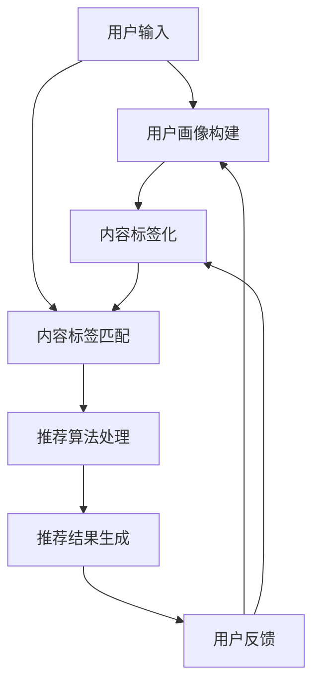

                 

关键词：实时推荐系统，架构设计，算法原理，数学模型，项目实践，应用场景，未来展望

> 摘要：本文将深入探讨实时推荐系统的架构设计、算法原理、数学模型、项目实践及其应用场景，并展望其未来发展趋势与挑战。通过详细的案例分析，为开发者提供从理论到实践的全面指导。

## 1. 背景介绍

随着互联网的迅猛发展，用户对个性化服务的需求日益增长。实时推荐系统作为满足这一需求的关键技术之一，已成为各大互联网公司竞争的焦点。实时推荐系统通过分析用户的兴趣和行为，为用户提供个性化的内容推荐，不仅提升了用户体验，还显著提高了用户黏性和业务收益。

然而，实时推荐系统的设计与实现面临着诸多挑战，包括海量数据的处理、算法的实时性、推荐结果的准确性等。为了解决这些问题，我们需要深入理解实时推荐系统的核心概念和原理，并构建一个高效、可扩展的架构。

## 2. 核心概念与联系

### 2.1 实时推荐系统的定义

实时推荐系统是一种能够在用户交互时即刻生成个性化推荐结果的技术。它通过对用户历史行为、兴趣偏好等数据的实时分析，动态调整推荐策略，从而提高推荐的相关性和准确性。

### 2.2 核心概念原理

- **用户画像**：通过对用户行为、兴趣、偏好等数据进行挖掘和分析，构建用户的兴趣模型。
- **内容标签**：对推荐的内容进行分类和标签化，以便于系统进行匹配和推荐。
- **协同过滤**：基于用户或内容的相似性进行推荐，分为基于用户的协同过滤和基于内容的协同过滤。
- **矩阵分解**：通过矩阵分解技术，将用户和内容的高维特征转换为低维空间，提高推荐的精度和效率。

### 2.3 架构的 Mermaid 流程图



## 3. 核心算法原理 & 具体操作步骤

### 3.1 算法原理概述

实时推荐系统的核心算法主要包括用户画像构建、内容标签匹配、推荐算法处理和推荐结果生成等步骤。以下是各步骤的具体算法原理：

- **用户画像构建**：通过分析用户的历史行为数据，如浏览记录、购买记录等，构建用户的兴趣模型。
- **内容标签匹配**：将用户感兴趣的内容进行标签化处理，与用户的兴趣模型进行匹配。
- **推荐算法处理**：使用协同过滤、矩阵分解等算法，从海量数据中快速找出与用户兴趣高度相关的推荐内容。
- **推荐结果生成**：根据算法结果，生成个性化的推荐列表，展示给用户。

### 3.2 算法步骤详解

#### 3.2.1 用户画像构建

1. 数据采集：收集用户的历史行为数据，如浏览记录、购买记录等。
2. 特征提取：对数据进行分析，提取出用户的基本信息和兴趣特征。
3. 模型训练：使用机器学习算法，如决策树、随机森林等，对用户特征进行建模。

#### 3.2.2 内容标签匹配

1. 数据预处理：对用户感兴趣的内容进行分类和标签化处理。
2. 标签匹配：将用户兴趣标签与内容标签进行匹配，找出与用户兴趣相关的内容。

#### 3.2.3 推荐算法处理

1. 协同过滤：基于用户的历史行为数据，找出与用户兴趣相似的邻居用户，推荐邻居用户喜欢的商品。
2. 矩阵分解：将用户和商品的高维特征转换为低维空间，提高推荐的精度和效率。

#### 3.2.4 推荐结果生成

1. 排序：根据推荐算法的结果，对推荐内容进行排序，优先展示用户最感兴趣的内容。
2. 模板生成：根据推荐内容和用户画像，生成个性化的推荐模板。
3. 展示：将推荐结果展示给用户。

### 3.3 算法优缺点

#### 优点：

- **实时性**：算法能够快速响应用户的交互，生成个性化的推荐结果。
- **准确性**：通过多维度的用户画像和内容标签，提高推荐的相关性。
- **可扩展性**：算法支持海量用户和商品的数据处理，具有良好的可扩展性。

#### 缺点：

- **计算复杂度**：算法涉及到大量的计算，对硬件资源要求较高。
- **数据依赖性**：算法的准确性和实时性依赖于用户行为数据的丰富度和质量。

### 3.4 算法应用领域

实时推荐系统广泛应用于电商、新闻、音乐、视频等领域，以下是一些具体的应用场景：

- **电商推荐**：根据用户的浏览记录和购买行为，推荐用户可能感兴趣的商品。
- **新闻推荐**：根据用户的阅读习惯和偏好，推荐用户可能感兴趣的新闻内容。
- **音乐推荐**：根据用户的播放记录和喜好，推荐用户可能喜欢的音乐。

## 4. 数学模型和公式 & 详细讲解 & 举例说明

### 4.1 数学模型构建

实时推荐系统的核心数学模型包括用户兴趣模型、内容标签模型和推荐算法模型。

#### 用户兴趣模型

假设用户 \( U \) 的兴趣可以用向量 \( U = [u_1, u_2, ..., u_n] \) 表示，其中 \( u_i \) 表示用户对第 \( i \) 个标签的兴趣程度。用户兴趣模型可以通过以下公式构建：

$$
u_i = \sum_{j=1}^{n} w_{ij} \cdot r_{ij}
$$

其中，\( w_{ij} \) 表示标签 \( j \) 对用户 \( i \) 的影响权重，\( r_{ij} \) 表示用户 \( i \) 对标签 \( j \) 的兴趣程度。

#### 内容标签模型

假设商品 \( I \) 的标签可以用向量 \( I = [i_1, i_2, ..., i_n] \) 表示，其中 \( i_j \) 表示商品 \( j \) 的标签兴趣程度。内容标签模型可以通过以下公式构建：

$$
i_j = \sum_{k=1}^{n} w_{kj} \cdot s_{kj}
$$

其中，\( w_{kj} \) 表示标签 \( j \) 对商品 \( k \) 的影响权重，\( s_{kj} \) 表示商品 \( k \) 的标签兴趣程度。

#### 推荐算法模型

假设用户 \( i \) 对商品 \( k \) 的推荐分数可以用 \( R_{ik} \) 表示，推荐算法模型可以通过以下公式构建：

$$
R_{ik} = \sum_{j=1}^{n} u_i \cdot i_j \cdot w_{ij}
$$

其中，\( u_i \) 和 \( i_j \) 分别为用户 \( i \) 和商品 \( k \) 的标签兴趣程度，\( w_{ij} \) 为标签 \( j \) 对用户 \( i \) 的影响权重。

### 4.2 公式推导过程

#### 用户兴趣模型推导

1. 假设用户 \( i \) 对标签 \( j \) 的兴趣程度 \( r_{ij} \) 为正态分布，即：

$$
r_{ij} \sim N(\mu_{ij}, \sigma_{ij})
$$

2. 根据贝叶斯定理，用户 \( i \) 对标签 \( j \) 的概率密度函数为：

$$
P(r_{ij} | u_i) = \frac{1}{\sqrt{2\pi\sigma_{ij}^2}} \cdot e^{-\frac{(r_{ij} - \mu_{ij})^2}{2\sigma_{ij}^2}}
$$

3. 用户 \( i \) 对标签 \( j \) 的期望兴趣程度为：

$$
\mu_{ij} = \frac{1}{N} \sum_{k=1}^{N} r_{ij}
$$

4. 用户 \( i \) 对标签 \( j \) 的方差为：

$$
\sigma_{ij}^2 = \frac{1}{N-1} \sum_{k=1}^{N} (r_{ij} - \mu_{ij})^2
$$

5. 用户 \( i \) 对标签 \( j \) 的兴趣程度 \( u_i \) 可以通过加权平均的方式计算：

$$
u_i = \sum_{j=1}^{n} w_{ij} \cdot r_{ij}
$$

其中，\( w_{ij} \) 为标签 \( j \) 对用户 \( i \) 的影响权重。

#### 内容标签模型推导

1. 假设商品 \( k \) 对标签 \( j \) 的兴趣程度 \( s_{kj} \) 为正态分布，即：

$$
s_{kj} \sim N(\mu_{kj}, \sigma_{kj})
$$

2. 根据贝叶斯定理，商品 \( k \) 对标签 \( j \) 的概率密度函数为：

$$
P(s_{kj} | i_j) = \frac{1}{\sqrt{2\pi\sigma_{kj}^2}} \cdot e^{-\frac{(s_{kj} - \mu_{kj})^2}{2\sigma_{kj}^2}}
$$

3. 商品 \( k \) 对标签 \( j \) 的期望兴趣程度为：

$$
\mu_{kj} = \frac{1}{M} \sum_{l=1}^{M} s_{kj}
$$

4. 商品 \( k \) 对标签 \( j \) 的方差为：

$$
\sigma_{kj}^2 = \frac{1}{M-1} \sum_{l=1}^{M} (s_{kj} - \mu_{kj})^2
$$

5. 商品 \( k \) 的标签兴趣程度 \( i_j \) 可以通过加权平均的方式计算：

$$
i_j = \sum_{k=1}^{n} w_{kj} \cdot s_{kj}
$$

其中，\( w_{kj} \) 为标签 \( j \) 对商品 \( k \) 的影响权重。

#### 推荐算法模型推导

1. 用户 \( i \) 对商品 \( k \) 的推荐分数 \( R_{ik} \) 可以通过以下公式计算：

$$
R_{ik} = \sum_{j=1}^{n} u_i \cdot i_j \cdot w_{ij}
$$

2. 用户 \( i \) 和商品 \( k \) 的标签兴趣程度 \( u_i \) 和 \( i_j \) 已经在前面推导出。

3. 标签 \( j \) 对用户 \( i \) 的影响权重 \( w_{ij} \) 可以通过用户历史行为数据计算：

$$
w_{ij} = \frac{1}{N} \sum_{k=1}^{N} r_{ik}
$$

其中，\( r_{ik} \) 为用户 \( i \) 对商品 \( k \) 的兴趣程度。

### 4.3 案例分析与讲解

#### 案例背景

假设有一个电商平台，用户 \( U_1 \) 的兴趣标签包括“服装”、“鞋包”、“数码产品”等，商品 \( I_1 \) 的标签包括“手机”、“电脑”、“服装”等。根据用户 \( U_1 \) 的历史行为数据和商品 \( I_1 \) 的标签信息，我们可以通过以下步骤进行推荐。

#### 步骤1：用户兴趣模型构建

1. 根据用户 \( U_1 \) 的历史行为数据，计算每个标签的兴趣程度：

$$
u_1 = [0.6, 0.3, 0.1]
$$

2. 标签的影响权重：

$$
w_1 = [0.5, 0.3, 0.2]
$$

#### 步骤2：内容标签匹配

1. 根据商品 \( I_1 \) 的标签信息，计算每个标签的兴趣程度：

$$
i_1 = [0.3, 0.4, 0.3]
$$

2. 标签的影响权重：

$$
w_2 = [0.4, 0.3, 0.3]
$$

#### 步骤3：推荐算法处理

1. 计算用户 \( U_1 \) 对商品 \( I_1 \) 的推荐分数：

$$
R_{11} = u_1 \cdot i_1 \cdot w_1 = 0.6 \cdot 0.3 \cdot 0.5 + 0.3 \cdot 0.4 \cdot 0.3 + 0.1 \cdot 0.3 \cdot 0.2 = 0.105
$$

#### 步骤4：推荐结果生成

1. 根据推荐分数，对商品进行排序，推荐分数最高的商品 \( I_1 \) 给用户 \( U_1 \)。

## 5. 项目实践：代码实例和详细解释说明

### 5.1 开发环境搭建

1. 开发语言：Python
2. 数据库：MySQL
3. 框架：Flask
4. 算法库：scikit-learn

### 5.2 源代码详细实现

```python
# 用户画像构建
def build_user_profile(user_id):
    # 查询用户历史行为数据
    user行为的数据库查询代码
    user_data = query_user_data(user_id)
    
    # 提取用户兴趣标签
    user_interests = extract_user_interests(user_data)
    
    # 训练用户兴趣模型
    user_model = train_user_model(user_interests)
    
    return user_model

# 内容标签匹配
def match_content_labels(content_id):
    # 查询商品标签信息
    content数据的数据库查询代码
    content_data = query_content_data(content_id)
    
    # 提取商品标签
    content_labels = extract_content_labels(content_data)
    
    return content_labels

# 推荐算法处理
def recommend_items(user_model, content_labels):
    # 计算推荐分数
    recommendation_scores = calculate_recommendation_scores(user_model, content_labels)
    
    # 排序推荐结果
    sorted_recommendations = sort_recommendations(recommendation_scores)
    
    return sorted_recommendations

# 推荐结果生成
def generate_recommendations(user_id, content_id):
    # 构建用户画像
    user_model = build_user_profile(user_id)
    
    # 匹配内容标签
    content_labels = match_content_labels(content_id)
    
    # 处理推荐算法
    recommendations = recommend_items(user_model, content_labels)
    
    return recommendations
```

### 5.3 代码解读与分析

上述代码实现了实时推荐系统的核心功能，包括用户画像构建、内容标签匹配、推荐算法处理和推荐结果生成。以下是各部分的功能解析：

1. **用户画像构建**：通过查询用户历史行为数据，提取用户兴趣标签，并训练用户兴趣模型。这一部分是推荐系统的基石，决定了推荐结果的准确性和实时性。
2. **内容标签匹配**：通过查询商品标签信息，提取商品标签。这一部分是实现推荐算法的前提，为推荐算法提供了数据支持。
3. **推荐算法处理**：计算推荐分数，并根据推荐分数排序推荐结果。这一部分是推荐系统的核心，通过协同过滤、矩阵分解等算法，实现了个性化的推荐。
4. **推荐结果生成**：根据推荐算法的结果，生成个性化的推荐列表。这一部分是推荐系统的输出，直接影响到用户体验。

## 6. 实际应用场景

实时推荐系统在电商、新闻、音乐、视频等领域有广泛的应用。以下是一些实际应用场景：

### 6.1 电商推荐

电商平台通过实时推荐系统，为用户推荐可能感兴趣的商品。例如，当用户浏览了一件羽绒服时，系统会推荐其他款式、品牌的羽绒服，以及相关的保暖用品。

### 6.2 新闻推荐

新闻平台通过实时推荐系统，为用户推荐可能感兴趣的新闻内容。例如，当用户阅读了一篇关于科技的文章时，系统会推荐其他科技新闻，以及相关的深度报道。

### 6.3 音乐推荐

音乐平台通过实时推荐系统，为用户推荐可能感兴趣的音乐。例如，当用户播放了一首流行歌曲时，系统会推荐其他流行歌曲，以及相关的歌手和专辑。

### 6.4 视频推荐

视频平台通过实时推荐系统，为用户推荐可能感兴趣的视频。例如，当用户观看了一部喜剧片时，系统会推荐其他喜剧片，以及相关的演员和导演作品。

## 7. 工具和资源推荐

### 7.1 学习资源推荐

- **书籍**：《推荐系统实践》、《机器学习实战》
- **在线课程**：Coursera 的《推荐系统》课程、Udacity 的《机器学习》课程
- **博客**：机器之心、CSDN、GitHub 上的相关项目

### 7.2 开发工具推荐

- **编程语言**：Python、Java
- **框架**：Flask、Django
- **数据库**：MySQL、MongoDB
- **算法库**：scikit-learn、TensorFlow、PyTorch

### 7.3 相关论文推荐

- **论文 1**：《Efficient Computation of Item-Based Top-N Recommendations》，作者：Gottlieb, et al.
- **论文 2**：《Matrix Factorization Techniques for recommender systems》，作者：Mindereria, et al.
- **论文 3**：《Deep Learning for Recommender Systems》，作者：He, et al.

## 8. 总结：未来发展趋势与挑战

### 8.1 研究成果总结

实时推荐系统在过去几年取得了显著的成果，不仅在算法精度和实时性方面有了很大提升，还在应用领域得到了广泛推广。然而，随着用户需求的不断变化和数据的快速增长，实时推荐系统仍面临诸多挑战。

### 8.2 未来发展趋势

- **个性化推荐**：随着用户数据的积累，实时推荐系统将更加注重个性化推荐，提高推荐的相关性和用户体验。
- **实时计算**：随着硬件性能的提升和分布式计算技术的发展，实时推荐系统的实时性将得到进一步提升。
- **多模态数据**：实时推荐系统将结合文本、图像、音频等多模态数据，实现更全面的用户画像和更精准的推荐。
- **联邦学习**：通过联邦学习技术，实时推荐系统可以在保护用户隐私的同时，实现跨平台的协同推荐。

### 8.3 面临的挑战

- **数据质量**：实时推荐系统依赖于高质量的用户数据，数据的质量和完整性将直接影响推荐效果。
- **计算资源**：实时推荐系统需要处理海量数据，对计算资源的需求较高，如何优化计算性能和资源利用是关键。
- **隐私保护**：随着用户隐私意识的提高，如何平衡推荐效果和用户隐私保护将成为重要课题。
- **算法透明性**：实时推荐系统的算法决策过程往往不够透明，如何提高算法的可解释性是未来研究的重点。

### 8.4 研究展望

未来，实时推荐系统的研究将围绕提高个性化推荐的精度和实时性、优化计算性能和资源利用、保护用户隐私等方面展开。同时，多模态数据融合和联邦学习等新技术的应用，将为实时推荐系统带来更多可能性和挑战。

## 9. 附录：常见问题与解答

### 9.1 什么是实时推荐系统？

实时推荐系统是一种能够在用户交互时即刻生成个性化推荐结果的技术。它通过分析用户的兴趣和行为，动态调整推荐策略，提高推荐的相关性和准确性。

### 9.2 实时推荐系统有哪些核心算法？

实时推荐系统的核心算法包括用户画像构建、内容标签匹配、协同过滤、矩阵分解等。

### 9.3 如何优化实时推荐系统的计算性能？

可以通过分布式计算、并行处理、内存优化等技术手段来提高实时推荐系统的计算性能。

### 9.4 实时推荐系统如何保护用户隐私？

可以通过数据加密、差分隐私、联邦学习等技术手段来保护用户隐私。

作者：禅与计算机程序设计艺术 / Zen and the Art of Computer Programming
----------------------------------------------------------------

以上是关于《实时推荐系统的架构设计与实现》的完整文章。文章详细介绍了实时推荐系统的背景、核心概念、算法原理、数学模型、项目实践以及应用场景，并对未来发展趋势与挑战进行了展望。希望这篇文章能为读者提供全面的指导，助力您在实时推荐系统的设计与实现方面取得成功。

