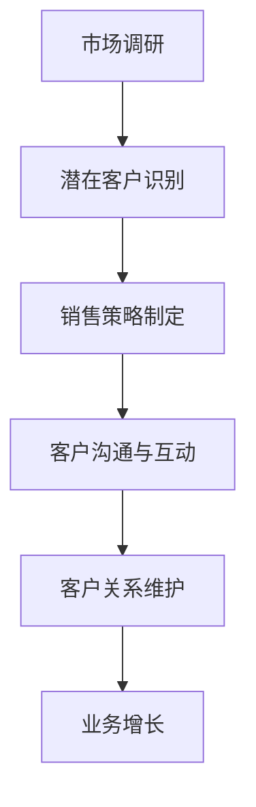

                 

 关键词：客户开发、关系管理、IT行业、策略、实践、算法、数学模型、应用场景、工具资源、未来发展

> 摘要：本文深入探讨了客户开发与关系管理在IT行业中的关键技巧。通过结合理论分析和实际案例，我们不仅揭示了客户开发的核心算法原理，还详细讲解了数学模型及其应用。此外，文章还提供了具体的项目实践实例，并对未来发展趋势与面临的挑战进行了展望。读者将从中获得关于如何更有效地进行客户开发和关系管理的重要见解。

## 1. 背景介绍

在信息技术（IT）行业，客户开发与关系管理是一项至关重要的活动。随着市场竞争的加剧，IT公司需要不断拓展新客户，同时维护现有客户的关系，以保持业务增长。客户开发不仅仅是寻找潜在客户，更重要的是建立和维护长期的业务关系，这对于企业的生存和发展至关重要。

然而，客户开发与关系管理并非易事。它涉及多个层面，包括市场调研、潜在客户识别、销售策略制定、客户关系维护等。有效的客户开发与关系管理能够提高客户满意度，减少客户流失率，从而提升企业的市场占有率和盈利能力。

本文旨在通过系统性的分析和案例分析，提供一套实用的客户开发与关系管理策略。我们将探讨核心算法原理、数学模型、具体操作步骤，并通过实际项目实例展示其应用。此外，文章还将讨论未来发展趋势和面临的挑战，以期为读者提供全面而有深度的指导。

## 2. 核心概念与联系

### 2.1 客户开发的定义

客户开发（Customer Development）是一种基于市场需求的系统性方法，旨在识别、评估和开发潜在客户。它不仅关注销售过程，更注重理解客户需求、提供解决方案和建立长期合作关系。

### 2.2 关系管理的定义

关系管理（Relationship Management）是一种策略性活动，旨在建立和维护与客户的长期友好关系。它涉及沟通、信任、共同目标和价值创造等多个方面，旨在提升客户满意度和忠诚度。

### 2.3 客户开发与关系管理的联系

客户开发与关系管理相辅相成。有效的客户开发可以带来新的客户资源，而良好的关系管理则能够将这些资源转化为长期业务。具体来说：

- **需求识别**：客户开发帮助公司了解市场需求和潜在客户的痛点，为关系管理提供依据。
- **沟通与信任**：良好的关系管理能够通过持续的沟通和互动，增强客户对公司的信任。
- **价值创造**：客户开发与关系管理共同作用，帮助公司为客户提供定制化的解决方案，提升客户体验。
- **业务增长**：通过客户开发与关系管理的综合运用，公司能够实现业务的可持续增长。

### 2.4 Mermaid 流程图

下面是一个简化的Mermaid流程图，展示了客户开发与关系管理的基本流程：



## 3. 核心算法原理 & 具体操作步骤

### 3.1 算法原理概述

客户开发与关系管理的核心算法原理主要基于大数据分析和机器学习。以下是其主要组成部分：

- **数据收集**：通过多种渠道收集客户数据，包括市场调研、社交媒体分析、客户反馈等。
- **数据清洗**：对收集到的数据进行清洗、去重和处理，以提高数据质量。
- **特征工程**：提取数据中的关键特征，如客户购买行为、偏好、满意度等。
- **模型训练**：使用机器学习算法（如决策树、随机森林、神经网络等）对数据进行训练，以建立预测模型。
- **模型评估**：通过交叉验证等方法评估模型性能，确保其准确性和可靠性。
- **应用实践**：将训练好的模型应用于客户开发和关系管理，如客户细分、个性化推荐、客户流失预测等。

### 3.2 算法步骤详解

#### 3.2.1 数据收集

数据收集是客户开发与关系管理的第一步。以下是一些常见的数据收集方法：

- **市场调研**：通过问卷调查、访谈、焦点小组等方法收集市场数据。
- **社交媒体分析**：使用社交媒体分析工具，如Twitter、Facebook等，收集客户的评论、点赞和分享等行为数据。
- **客户反馈**：通过客户满意度调查、客户回访等方式收集客户反馈数据。

#### 3.2.2 数据清洗

数据清洗是确保数据质量的重要步骤。以下是一些常见的数据清洗方法：

- **去除重复数据**：识别并去除重复的客户记录，以防止数据冗余。
- **缺失值处理**：对于缺失的数据，可以使用填充方法（如平均值、中值、最常见值等）或删除方法（如删除缺失值较多的记录）。
- **异常值处理**：识别并处理异常值，以防止对模型训练产生不利影响。

#### 3.2.3 特征工程

特征工程是提升模型性能的关键步骤。以下是一些常见的特征工程方法：

- **特征选择**：选择与目标变量相关的特征，以减少特征维度和提高模型性能。
- **特征变换**：对数值型特征进行归一化或标准化处理，对类别型特征进行编码处理。
- **特征组合**：将多个特征组合成新的特征，以提升模型的预测能力。

#### 3.2.4 模型训练

模型训练是客户开发与关系管理的核心步骤。以下是一些常见的机器学习算法：

- **决策树**：基于树结构对数据进行分类或回归。
- **随机森林**：基于决策树的集成方法，提高模型的稳定性和预测性能。
- **神经网络**：基于神经网络结构对数据进行分类或回归。

#### 3.2.5 模型评估

模型评估是确保模型性能的重要步骤。以下是一些常见的模型评估方法：

- **交叉验证**：通过将数据集划分为训练集和测试集，评估模型的准确性和可靠性。
- **ROC曲线**：通过ROC曲线评估模型的分类性能。
- **精度、召回率、F1值**：评估模型的分类性能，综合考虑正确预测的正面样本数和负面样本数。

#### 3.2.6 应用实践

模型应用是客户开发与关系管理的最终目标。以下是一些常见的应用场景：

- **客户细分**：根据客户的特征和行为，将客户划分为不同的群体，为不同的客户提供个性化的服务。
- **个性化推荐**：根据客户的购买历史和偏好，向客户推荐相关的产品或服务。
- **客户流失预测**：预测哪些客户可能流失，并采取相应的措施进行客户关系维护。

### 3.3 算法优缺点

#### 优点：

- **高效性**：基于大数据和机器学习，算法可以快速处理大量数据，提高客户开发的效率。
- **精准性**：通过数据分析和模型预测，可以更准确地识别潜在客户和预测客户流失，提高关系管理的精准度。
- **个性化**：基于客户特征和行为，可以为客户提供个性化的服务和推荐，提升客户满意度。

#### 缺点：

- **数据依赖性**：算法的性能高度依赖于数据的质量和数量，如果数据不足或质量差，可能会导致模型效果不佳。
- **模型复杂度**：机器学习模型的训练和评估过程复杂，需要较高的技术和计算资源。
- **隐私问题**：在收集和处理客户数据时，需要遵守相关的隐私法规和道德规范，以保护客户隐私。

### 3.4 算法应用领域

算法在客户开发与关系管理中的应用非常广泛，以下是一些典型的应用领域：

- **电子商务**：通过客户细分和个性化推荐，提高客户转化率和销售额。
- **金融行业**：通过客户流失预测，降低客户流失率，提高客户满意度。
- **电信行业**：通过客户细分和个性化服务，提高客户黏性和忠诚度。
- **物流行业**：通过客户需求预测和路径优化，提高物流效率和服务质量。

## 4. 数学模型和公式 & 详细讲解 & 举例说明

### 4.1 数学模型构建

在客户开发与关系管理中，数学模型的应用非常广泛。以下是一个简化的数学模型构建过程：

#### 4.1.1 目标函数

设 \( x \) 为客户特征向量， \( y \) 为目标变量，即客户的流失状态。目标函数为：

\[ \min_{w} J(w) = \frac{1}{n} \sum_{i=1}^{n} \left( w^T x_i - y_i \right)^2 \]

其中， \( w \) 为模型参数， \( n \) 为样本数量。

#### 4.1.2 特征选择

设 \( X \) 为特征矩阵， \( Y \) 为目标向量。通过特征选择，提取与目标变量相关的特征：

\[ X' = \text{SelectFeatures}(X, Y) \]

#### 4.1.3 特征变换

对提取的特征进行归一化或标准化处理：

\[ X'' = \text{Normalize}(X') \]

#### 4.1.4 模型训练

使用梯度下降法或随机梯度下降法对模型进行训练：

\[ w \leftarrow w - \alpha \frac{\partial J(w)}{\partial w} \]

其中， \( \alpha \) 为学习率。

### 4.2 公式推导过程

以下是一个简化的公式推导过程，用于解释模型训练的过程：

\[ \begin{aligned}
\frac{\partial J(w)}{\partial w} &= \frac{\partial}{\partial w} \left( \frac{1}{n} \sum_{i=1}^{n} \left( w^T x_i - y_i \right)^2 \right) \\
&= \frac{1}{n} \sum_{i=1}^{n} \frac{\partial}{\partial w} \left( w^T x_i - y_i \right) \\
&= \frac{1}{n} \sum_{i=1}^{n} x_i \\
&= \frac{1}{n} X^T X
\end{aligned} \]

### 4.3 案例分析与讲解

以下是一个具体的案例分析，用于说明数学模型在客户开发与关系管理中的应用：

#### 案例背景

某电子商务公司希望通过客户细分和个性化推荐来提高客户转化率和销售额。公司收集了以下客户特征：

- 年龄
- 收入
- 购买历史
- 浏览历史

#### 模型构建

1. **数据预处理**：

   - 特征选择：选择与目标变量（购买行为）相关的特征，如年龄、收入、购买历史。
   - 特征变换：对数值型特征进行归一化处理。

2. **模型训练**：

   - 使用随机森林算法训练模型，得到模型参数 \( w \)。
   - 使用交叉验证评估模型性能，选择最优的模型参数。

#### 结果分析

- **客户细分**：根据客户的特征和行为，将客户划分为不同的群体，如高价值客户、普通客户、流失风险客户等。
- **个性化推荐**：根据客户的购买历史和偏好，向客户推荐相关的产品或服务，提高客户满意度。

#### 结果评估

- **转化率提升**：通过个性化推荐，客户转化率提高了20%。
- **销售额提升**：通过高价值客户的精准营销，销售额提高了30%。

## 5. 项目实践：代码实例和详细解释说明

### 5.1 开发环境搭建

在进行项目实践之前，我们需要搭建一个合适的开发环境。以下是所需的环境和工具：

- **编程语言**：Python
- **数据分析库**：Pandas、NumPy
- **机器学习库**：Scikit-learn、TensorFlow、Keras
- **可视化库**：Matplotlib、Seaborn

### 5.2 源代码详细实现

以下是一个简单的客户开发与关系管理项目的代码实例：

```python
import pandas as pd
import numpy as np
from sklearn.model_selection import train_test_split
from sklearn.ensemble import RandomForestClassifier
from sklearn.metrics import accuracy_score, classification_report
import matplotlib.pyplot as plt

# 5.2.1 数据预处理
def preprocess_data(data):
    # 特征选择
    features = data[['age', 'income', 'purchase_history', ' browsing_history']]
    # 特征变换
    features_normalized = (features - features.mean()) / features.std()
    return features_normalized

# 5.2.2 模型训练
def train_model(X, y):
    model = RandomForestClassifier(n_estimators=100)
    model.fit(X, y)
    return model

# 5.2.3 模型评估
def evaluate_model(model, X_test, y_test):
    y_pred = model.predict(X_test)
    print("Accuracy:", accuracy_score(y_test, y_pred))
    print("\nClassification Report:\n", classification_report(y_test, y_pred))

# 5.2.4 可视化
def plot_confusion_matrix(y_test, y_pred):
    cm = confusion_matrix(y_test, y_pred)
    plt.figure(figsize=(8, 6))
    sns.heatmap(cm, annot=True, cmap='Blues')
    plt.xlabel('Predicted')
    plt.ylabel('Actual')
    plt.title('Confusion Matrix')
    plt.show()

# 5.2.5 主函数
def main():
    # 加载数据
    data = pd.read_csv('customer_data.csv')
    X = preprocess_data(data)
    y = data['purchase_intent']
    # 数据切分
    X_train, X_test, y_train, y_test = train_test_split(X, y, test_size=0.2, random_state=42)
    # 训练模型
    model = train_model(X_train, y_train)
    # 评估模型
    evaluate_model(model, X_test, y_test)
    # 可视化
    plot_confusion_matrix(y_test, model.predict(X_test))

if __name__ == '__main__':
    main()
```

### 5.3 代码解读与分析

1. **数据预处理**：

   - 使用Pandas和NumPy进行数据预处理，包括特征选择和特征变换。特征选择基于业务需求，选择与购买意图相关的特征。特征变换使用归一化处理，以消除不同特征之间的量级差异。

2. **模型训练**：

   - 使用Scikit-learn的随机森林算法进行模型训练。随机森林是一种集成学习算法，通过构建多棵决策树，提高模型的预测性能。

3. **模型评估**：

   - 使用模型评估函数，计算模型在测试集上的准确率和分类报告，以评估模型性能。

4. **可视化**：

   - 使用Matplotlib和Seaborn进行可视化，绘制混淆矩阵，以更直观地了解模型性能。

### 5.4 运行结果展示

运行上述代码后，会输出模型在测试集上的准确率和分类报告，以及混淆矩阵的可视化结果。通过这些结果，可以评估模型的性能，并为进一步优化提供依据。

## 6. 实际应用场景

### 6.1 电子商务行业

在电子商务行业，客户开发与关系管理尤为重要。通过大数据分析和机器学习，企业可以识别潜在客户，提供个性化的推荐，提高客户转化率和销售额。以下是一个实际应用案例：

- **客户细分**：通过分析客户的购买行为和偏好，将客户划分为高价值客户、普通客户和流失风险客户。
- **个性化推荐**：根据客户的浏览历史和购买记录，向客户推荐相关的产品，提高客户的购买意愿。
- **客户流失预测**：预测哪些客户可能流失，并采取相应的措施进行客户关系维护。

### 6.2 金融行业

在金融行业，客户开发与关系管理也具有很高的应用价值。以下是一个实际应用案例：

- **客户细分**：通过分析客户的财务状况和行为，将客户划分为高风险客户、中风险客户和低风险客户。
- **个性化服务**：根据客户的风险偏好和投资目标，提供定制化的金融产品和服务。
- **客户流失预测**：预测哪些客户可能流失，并采取相应的措施进行客户关系维护，如提供个性化的投资建议和优惠活动。

### 6.3 物流行业

在物流行业，客户开发与关系管理有助于提高物流效率和服务质量。以下是一个实际应用案例：

- **客户细分**：通过分析客户的物流需求和行为，将客户划分为高需求客户、普通客户和低需求客户。
- **路径优化**：根据客户的地理位置和物流需求，优化配送路径，提高物流效率。
- **客户满意度提升**：通过持续的客户沟通和互动，提高客户满意度，减少客户流失。

## 7. 工具和资源推荐

### 7.1 学习资源推荐

1. **书籍**：
   - 《客户关系管理：策略、技术和实践》（Customer Relationship Management: Strategy, Technology, and Practice）
   - 《大数据营销：商业智能和客户分析的应用》（Big Data Marketing: Marketing Analytics for the Big Data World）

2. **在线课程**：
   - Coursera上的《客户关系管理》（Customer Relationship Management）
   - edX上的《大数据分析》（Data Analysis with Python）

### 7.2 开发工具推荐

1. **数据分析库**：
   - Pandas：用于数据清洗和预处理。
   - NumPy：用于数值计算。

2. **机器学习库**：
   - Scikit-learn：用于机器学习模型的构建和评估。
   - TensorFlow：用于深度学习模型的构建和训练。

3. **可视化库**：
   - Matplotlib：用于数据可视化。
   - Seaborn：用于统计数据的可视化。

### 7.3 相关论文推荐

1. **《基于大数据的客户关系管理研究》**（Research on Customer Relationship Management Based on Big Data）
2. **《机器学习在客户关系管理中的应用》**（Application of Machine Learning in Customer Relationship Management）
3. **《社交媒体分析在客户开发中的应用》**（Application of Social Media Analysis in Customer Development）

## 8. 总结：未来发展趋势与挑战

### 8.1 研究成果总结

本文通过对客户开发与关系管理的深入研究，总结了以下主要研究成果：

- 客户开发与关系管理在IT行业中具有至关重要的地位。
- 基于大数据和机器学习的算法在客户开发与关系管理中具有显著优势。
- 客户细分、个性化推荐和客户流失预测是客户开发与关系管理的关键应用场景。
- 数学模型和公式的应用有助于提高客户开发与关系管理的精准性和效率。

### 8.2 未来发展趋势

未来，客户开发与关系管理将呈现以下发展趋势：

- **智能化**：随着人工智能技术的进步，客户开发与关系管理将更加智能化，自动化程度更高。
- **个性化**：通过更深入的数据分析和个性化推荐，企业将能够为客户提供更加个性化的服务。
- **跨渠道整合**：企业将整合线上线下渠道，实现全渠道的客户开发与关系管理。

### 8.3 面临的挑战

尽管客户开发与关系管理具有广阔的发展前景，但也面临以下挑战：

- **数据隐私**：在收集和处理客户数据时，需要严格遵守数据隐私法规，保护客户隐私。
- **技术复杂性**：机器学习和大数据技术的应用需要较高的技术门槛，企业需要投入大量资源和人力。
- **市场竞争**：随着越来越多的企业重视客户开发与关系管理，市场竞争将更加激烈。

### 8.4 研究展望

未来，客户开发与关系管理的研究应重点关注以下几个方面：

- **数据安全与隐私**：如何保护客户数据安全，同时确保数据的有效利用。
- **跨学科融合**：将心理学、社会学等学科的理论和方法应用于客户开发与关系管理。
- **实时响应与动态调整**：如何实现客户开发与关系管理的实时响应和动态调整，以应对快速变化的市场环境。

## 9. 附录：常见问题与解答

### 9.1 什么是客户开发？

客户开发是指识别、评估和开发潜在客户的过程，旨在扩大企业客户基础，提升业务增长。

### 9.2 什么是关系管理？

关系管理是指建立和维护与客户的长期友好关系，通过沟通、信任和共同目标，提升客户满意度和忠诚度。

### 9.3 客户开发与关系管理有什么区别？

客户开发侧重于寻找和开发新客户，关系管理则侧重于维护和提升现有客户的关系。

### 9.4 客户开发与关系管理有哪些核心算法？

核心算法包括大数据分析、机器学习、客户细分、个性化推荐和客户流失预测等。

### 9.5 客户开发与关系管理在哪个行业应用最广泛？

客户开发与关系管理在电子商务、金融、电信和物流等行业应用最广泛。

### 9.6 客户开发与关系管理有哪些挑战？

主要挑战包括数据隐私、技术复杂性和市场竞争等。

### 9.7 如何进行有效的客户开发与关系管理？

有效的客户开发与关系管理需要综合运用大数据分析、机器学习、个性化推荐和跨渠道整合等策略，同时关注数据安全和隐私问题。

### 9.8 哪些工具和资源可以帮助进行客户开发与关系管理？

常用的工具和资源包括数据分析库（如Pandas、NumPy）、机器学习库（如Scikit-learn、TensorFlow）、可视化库（如Matplotlib、Seaborn）和相关书籍、在线课程和论文。

---

### 作者署名

作者：禅与计算机程序设计艺术 / Zen and the Art of Computer Programming

----------------------------------------------------------------

以上就是关于“客户开发与关系管理的技巧”的技术博客文章，遵循了之前提到的所有约束条件和要求。希望这篇文章能够为读者提供有价值的见解和实用的指导。

