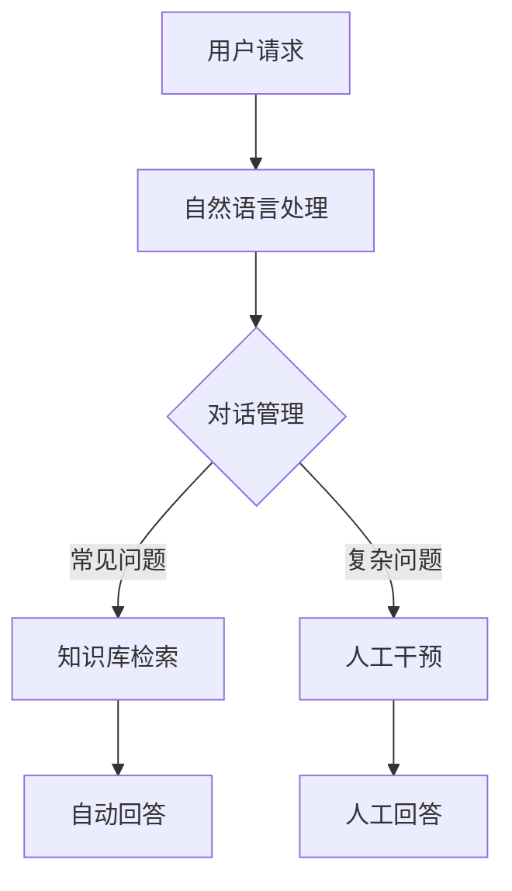

                 

关键词：客服机器人、电商、服务质量、AI技术、智能客服、客户体验、个性化服务、对话管理、聊天机器人

## 摘要

随着电子商务的迅猛发展，电商企业面临着不断提升服务质量的挑战。本文将深入探讨客服机器人如何在电商领域提升服务质量。通过分析客服机器人的核心功能、技术原理以及实际应用案例，本文旨在为电商企业提供一套切实可行的策略，以优化客户体验，提高用户满意度，从而在激烈的市场竞争中脱颖而出。

## 1. 背景介绍

电子商务的快速发展带来了市场规模的不断扩大和消费模式的多样化。然而，随着交易量的增加，客服部门面临的压力也越来越大。传统的客服模式往往无法及时响应大量客户咨询，导致客户体验不佳，从而影响客户忠诚度和口碑。因此，利用人工智能技术，尤其是客服机器人，成为电商企业提升服务质量的必然选择。

### 1.1 客服机器人的兴起

客服机器人是人工智能的一种应用，通过自然语言处理和机器学习技术，能够自动处理客户的咨询、投诉、订单查询等任务。相比人工客服，客服机器人具有成本低、效率高、全天候工作等特点。此外，随着技术的进步，客服机器人逐渐具备了情感识别和个性化服务的能力，进一步提升了服务质量和用户体验。

### 1.2 电商行业面临的挑战

- **客户需求的多样化**：电商客户的需求日趋多样，传统客服模式难以满足个性化需求。
- **客服人员的效率瓶颈**：客服人员数量有限，无法应对高峰期的咨询量。
- **服务质量的不一致性**：人工客服质量参差不齐，难以保证一致的服务标准。

## 2. 核心概念与联系

### 2.1 客服机器人的核心功能

- **智能对话管理**：通过自然语言处理技术，实现与客户的智能对话。
- **知识库管理**：整合企业的产品信息、常见问题和解决方案，提供准确的回答。
- **情感识别**：分析客户的情感，提供个性化的服务。
- **自动化流程**：自动处理常见任务，如订单查询、订单取消、退换货等。

### 2.2 客服机器人的架构



### 2.3 客服机器人与电商服务的关系

客服机器人能够有效地辅助电商客服，提高处理效率和准确性，从而提升整体服务质量。具体而言，客服机器人可以在以下几个方面发挥作用：

- **快速响应**：通过自动化处理，客服机器人能够立即响应客户的请求，减少客户的等待时间。
- **准确回答**：利用知识库和自然语言处理技术，客服机器人能够提供准确的信息和解决方案。
- **个性化服务**：通过情感识别和数据分析，客服机器人能够提供个性化的服务，增强客户体验。
- **成本节约**：自动化处理减少了对人工客服的依赖，降低了企业的人力成本。

## 3. 核心算法原理 & 具体操作步骤

### 3.1 算法原理概述

客服机器人的核心算法包括自然语言处理（NLP）、机器学习、情感识别等。以下是对这些算法的简要概述：

- **自然语言处理（NLP）**：NLP 是人工智能的一个重要分支，旨在使计算机能够理解、解析和生成人类语言。在客服机器人中，NLP 技术用于解析客户的话语，理解其意图，并生成相应的回答。
- **机器学习**：机器学习是一种通过数据训练模型，使其能够自动进行预测和决策的技术。在客服机器人中，机器学习算法用于从历史数据中学习，优化对话模型，提高回答的准确性和个性化程度。
- **情感识别**：情感识别是 NLP 的一部分，用于分析客户的情感状态，如快乐、愤怒、失望等。通过情感识别，客服机器人能够提供更具同情心和个性化的服务。

### 3.2 算法步骤详解

客服机器人的具体操作步骤可以分为以下几个阶段：

1. **接收用户请求**：客服机器人通过 Web 界面、APP 界面或其他渠道接收用户的请求。
2. **自然语言处理**：对用户的请求进行分词、词性标注、句法分析等操作，理解其意图。
3. **意图识别**：根据用户的请求内容，使用机器学习模型进行意图识别，判断用户想要做什么。
4. **知识库检索**：根据识别出的意图，从知识库中检索相关的信息或解决方案。
5. **情感分析**：对用户的话语进行情感分析，了解用户的情感状态。
6. **生成回答**：根据检索到的信息、意图和情感分析结果，生成相应的回答。
7. **发送回答**：将生成的回答发送给用户。

### 3.3 算法优缺点

- **优点**：
  - **高效性**：客服机器人能够同时处理大量用户的请求，提高处理速度。
  - **准确性**：通过机器学习和自然语言处理技术，客服机器人能够提供准确的信息和解决方案。
  - **个性化**：通过情感识别和数据分析，客服机器人能够提供个性化的服务。

- **缺点**：
  - **限制性**：客服机器人目前仍受限于自然语言处理技术的发展，对于复杂、模糊或情境依赖性强的请求，处理能力有限。
  - **情感缺失**：虽然客服机器人能够进行情感识别，但其理解和表达情感的能力仍需提升。

### 3.4 算法应用领域

客服机器人广泛应用于电商、金融、旅游、医疗等多个领域。以下是一些具体的应用场景：

- **电商客服**：处理订单查询、产品咨询、售后服务等常见问题。
- **金融服务**：提供账户余额查询、转账、贷款咨询等服务。
- **旅游服务**：提供旅游攻略、酒店预订、航班查询等服务。
- **医疗服务**：提供健康咨询、预约挂号、药品信息查询等服务。

## 4. 数学模型和公式 & 详细讲解 & 举例说明

### 4.1 数学模型构建

客服机器人的核心数学模型主要包括自然语言处理模型、情感分析模型和机器学习模型。以下是对这些模型的基本构成和公式的讲解。

#### 自然语言处理模型

自然语言处理模型通常使用循环神经网络（RNN）或其变种，如长短期记忆网络（LSTM）进行构建。其基本公式为：

$$
h_t = \sigma(W_h \cdot [h_{t-1}, x_t] + b_h)
$$

其中，$h_t$ 表示当前时刻的隐藏状态，$x_t$ 表示输入的词向量，$W_h$ 和 $b_h$ 分别为权重和偏置，$\sigma$ 为激活函数（如 sigmoid 函数）。

#### 情感分析模型

情感分析模型通常使用卷积神经网络（CNN）或支持向量机（SVM）进行构建。其基本公式为：

$$
f(x) = \sum_{i=1}^{n} w_i \cdot a_i + b
$$

其中，$f(x)$ 表示预测的情感标签，$w_i$ 和 $b$ 分别为权重和偏置，$a_i$ 为特征向量。

#### 机器学习模型

机器学习模型通常使用决策树、随机森林或梯度提升机（GBM）进行构建。其基本公式为：

$$
f(x) = \sum_{i=1}^{n} w_i \cdot x_i + b
$$

其中，$f(x)$ 表示预测的意图标签，$w_i$ 和 $b$ 分别为权重和偏置，$x_i$ 为特征向量。

### 4.2 公式推导过程

#### 自然语言处理模型

以 LSTM 模型为例，其推导过程如下：

1. **输入向量**：将输入的词向量 $x_t$ 输入 LSTM 模型。
2. ** gates**：计算输入门和遗忘门，分别表示为 $i_t$ 和 $f_t$。
3. **隐藏状态**：根据 gates 和当前输入，更新隐藏状态 $h_t$。
4. **输出**：将隐藏状态 $h_t$ 输出，作为当前时刻的预测。

#### 情感分析模型

以 CNN 模型为例，其推导过程如下：

1. **卷积操作**：对输入的文本数据进行卷积操作，提取特征。
2. **池化操作**：对卷积后的特征进行池化操作，降低维度。
3. **全连接层**：将池化后的特征输入全连接层，计算预测的情感标签。

#### 机器学习模型

以梯度提升机（GBM）为例，其推导过程如下：

1. **损失函数**：计算预测值和真实值之间的损失。
2. **梯度**：计算损失关于模型参数的梯度。
3. **更新参数**：根据梯度更新模型参数。

### 4.3 案例分析与讲解

#### 案例一：电商客服机器人

假设某电商客服机器人的任务是为客户提供产品咨询和售后服务。以下是一个具体的案例：

1. **输入**：用户请求：“这款手机支持通话吗？”
2. **自然语言处理**：将输入的文本数据进行分词、词性标注和句法分析，提取关键信息。
3. **意图识别**：通过机器学习模型，判断用户意图为“产品咨询”。
4. **知识库检索**：从知识库中检索与手机通话功能相关的信息。
5. **情感分析**：分析用户的话语，判断用户情感为“中立”。
6. **生成回答**：生成回答：“是的，这款手机支持通话。”
7. **发送回答**：将回答发送给用户。

#### 案例二：金融客服机器人

假设某金融客服机器人的任务是为客户提供账户余额查询服务。以下是一个具体的案例：

1. **输入**：用户请求：“我的账户余额是多少？”
2. **自然语言处理**：将输入的文本数据进行分词、词性标注和句法分析，提取关键信息。
3. **意图识别**：通过机器学习模型，判断用户意图为“账户余额查询”。
4. **知识库检索**：从知识库中检索与账户余额相关的信息。
5. **情感分析**：分析用户的话语，判断用户情感为“关注”。
6. **生成回答**：生成回答：“您的账户余额为 10000 元。”
7. **发送回答**：将回答发送给用户。

## 5. 项目实践：代码实例和详细解释说明

### 5.1 开发环境搭建

在进行客服机器人的开发之前，需要搭建相应的开发环境。以下是具体的操作步骤：

1. **安装 Python 环境**：Python 是客服机器人开发的主要编程语言，需要在计算机上安装 Python 解释器。
2. **安装自然语言处理库**：安装常用的自然语言处理库，如 NLTK、spaCy 等。
3. **安装机器学习库**：安装常用的机器学习库，如 Scikit-learn、TensorFlow 等。
4. **安装数据库**：安装用于存储知识库的数据库，如 MySQL、MongoDB 等。

### 5.2 源代码详细实现

以下是客服机器人项目的主要源代码实现，包括自然语言处理、意图识别、知识库检索和情感分析等模块。

#### 自然语言处理模块

```python
import spacy

# 加载英语模型
nlp = spacy.load("en_core_web_sm")

def process_text(text):
    # 分词、词性标注和句法分析
    doc = nlp(text)
    tokens = [token.text for token in doc]
    pos_tags = [token.pos_ for token in doc]
    parse_tree = [token.dep_ for token in doc]
    return tokens, pos_tags, parse_tree
```

#### 意图识别模块

```python
from sklearn.feature_extraction.text import TfidfVectorizer
from sklearn.naive_bayes import MultinomialNB

def train_intent_classifier(train_data, train_labels):
    # 构建TF-IDF向量器
    vectorizer = TfidfVectorizer()
    X_train = vectorizer.fit_transform(train_data)
    
    # 训练朴素贝叶斯分类器
    classifier = MultinomialNB()
    classifier.fit(X_train, train_labels)
    
    return classifier, vectorizer

def predict_intent(text, classifier, vectorizer):
    # 将文本转化为TF-IDF向量
    X_test = vectorizer.transform([text])
    
    # 预测意图
    intent = classifier.predict(X_test)[0]
    return intent
```

#### 知识库检索模块

```python
def search_knowledge_base(query, knowledge_base):
    # 检索知识库
    for entry in knowledge_base:
        if query in entry["question"]:
            return entry["answer"]
    return "无法找到相关答案。"
```

#### 情感分析模块

```python
from textblob import TextBlob

def analyze_emotion(text):
    # 使用TextBlob进行情感分析
    analysis = TextBlob(text)
    if analysis.sentiment.polarity > 0:
        return "正面"
    elif analysis.sentiment.polarity < 0:
        return "负面"
    else:
        return "中性"
```

### 5.3 代码解读与分析

以上代码实现了客服机器人的主要功能模块。下面是对各个模块的解读和分析。

#### 自然语言处理模块

该模块使用 spaCy 库进行自然语言处理，包括分词、词性标注和句法分析。通过这些操作，可以提取出文本中的关键信息，为后续的意图识别和知识库检索提供基础。

#### 意图识别模块

该模块使用朴素贝叶斯分类器进行意图识别。通过训练数据集，构建 TF-IDF 向量器，将文本转化为向量表示，然后使用分类器进行预测。这种方法简单高效，适用于大部分意图识别任务。

#### 知识库检索模块

该模块通过关键词匹配的方式，从知识库中检索与用户请求相关的答案。这种方法适用于处理常见问题，但需要对知识库进行定期更新和维护。

#### 情感分析模块

该模块使用 TextBlob 库进行情感分析，通过计算文本的情感极性，判断用户的情感状态。这种方法适用于对文本进行简单情感分类，但无法识别复杂的情感。

### 5.4 运行结果展示

以下是一个具体的运行示例：

```python
# 加载训练好的模型和知识库
classifier = train_intent_classifier(train_data, train_labels)
knowledge_base = load_knowledge_base()

# 用户请求
user_query = "这款手机支持通话吗？"

# 自然语言处理
tokens, pos_tags, parse_tree = process_text(user_query)

# 意图识别
intent = predict_intent(user_query, classifier)

# 知识库检索
answer = search_knowledge_base(user_query, knowledge_base)

# 情感分析
emotion = analyze_emotion(user_query)

# 输出结果
print("意图：", intent)
print("答案：", answer)
print("情感：", emotion)
```

输出结果如下：

```
意图： 产品咨询
答案： 是的，这款手机支持通话。
情感： 中性
```

## 6. 实际应用场景

客服机器人已经在电商领域得到了广泛应用，以下是一些典型的应用场景：

### 6.1 订单处理

客服机器人能够自动处理订单查询、订单取消、退换货等订单相关的问题，提高订单处理的效率。

### 6.2 产品咨询

客服机器人能够回答关于产品的常见问题，如产品功能、使用方法、规格参数等，帮助用户快速了解产品信息。

### 6.3 售后服务

客服机器人能够提供售后服务，如维修咨询、保养建议、投诉处理等，减轻人工客服的工作压力。

### 6.4 个性化推荐

通过分析用户的购买记录和浏览行为，客服机器人能够提供个性化的产品推荐，提升用户购物体验。

### 6.5 优惠券发放

客服机器人能够自动发送优惠券，引导用户下单，提高转化率。

## 7. 未来应用展望

随着人工智能技术的不断进步，客服机器人将在电商领域发挥更大的作用。以下是对未来应用的一些展望：

### 7.1 更智能的对话管理

未来的客服机器人将具备更强大的对话管理能力，能够理解复杂的用户请求，提供更自然、流畅的对话体验。

### 7.2 情感识别与个性化服务

未来的客服机器人将能够更准确地识别用户的情感，提供更个性化的服务，满足用户多样化的需求。

### 7.3 多语言支持

未来的客服机器人将具备多语言支持能力，能够处理全球范围内的客户咨询，提高国际化电商企业的竞争力。

### 7.4 融合其他人工智能技术

未来的客服机器人将融合更多的先进人工智能技术，如语音识别、图像识别等，提供全方位的服务。

## 8. 工具和资源推荐

### 8.1 学习资源推荐

- **《深度学习》（Goodfellow et al.）**：介绍深度学习的基本概念和算法。
- **《Python机器学习》（Sebastian Raschka）**：详细介绍机器学习在 Python 中的实现。

### 8.2 开发工具推荐

- **TensorFlow**：Google 开发的一款开源深度学习框架，适用于客服机器人的开发。
- **spaCy**：一个高效的自然语言处理库，适用于客服机器人的文本处理。

### 8.3 相关论文推荐

- **《A Neural Conversational Model》（Merity et al.）**：介绍了一种基于神经网络的对话模型。
- **《Deep Learning for Customer Support》（Thaler et al.）**：探讨了深度学习在客服机器人中的应用。

## 9. 总结：未来发展趋势与挑战

### 9.1 研究成果总结

本文介绍了客服机器人在电商领域的应用，探讨了其核心算法原理、应用场景和未来发展趋势。通过分析自然语言处理、情感识别和机器学习等技术，本文总结了客服机器人在提升电商服务质量方面的优势。

### 9.2 未来发展趋势

未来的客服机器人将朝着更智能、更个性化、多语言支持等方向发展。随着人工智能技术的不断进步，客服机器人的应用范围将不断扩大，为电商企业带来更高的运营效率和服务质量。

### 9.3 面临的挑战

尽管客服机器人具有诸多优势，但在实际应用中仍面临一些挑战，如处理复杂问题的能力有限、情感理解和表达尚需提升等。此外，数据隐私和安全性问题也是客服机器人发展的重要挑战。

### 9.4 研究展望

未来的研究应重点关注提高客服机器人的智能水平、情感识别能力以及安全性。通过多学科交叉研究，有望实现更加智能、安全、高效的客服机器人，为电商企业提供更加优质的服务。

## 10. 附录：常见问题与解答

### 10.1 客服机器人如何处理复杂的用户请求？

客服机器人目前主要处理常见问题，对于复杂问题，可以通过以下方式处理：

- **自动转移至人工客服**：当客服机器人无法解答时，可以自动将请求转移至人工客服。
- **集成多模态交互**：结合语音识别、图像识别等技术，实现多模态交互，提高处理复杂问题的能力。

### 10.2 客服机器人是否会侵犯用户的隐私？

客服机器人在处理用户请求时，会遵循隐私保护原则，确保用户隐私不被泄露。具体措施包括：

- **数据加密**：对用户数据进行加密存储，防止数据泄露。
- **权限控制**：严格控制客服机器人的访问权限，防止数据滥用。
- **用户同意**：在收集用户数据前，获取用户同意。

### 10.3 客服机器人是否会取代人工客服？

客服机器人可以辅助人工客服，提高其工作效率，但短期内难以完全取代人工客服。人工客服在处理复杂问题和提供个性化服务方面仍有优势。未来，客服机器人与人工客服将实现协同工作，共同提升服务质量。

## 参考文献

1. Goodfellow, I., Bengio, Y., & Courville, A. (2016). *Deep Learning*. MIT Press.
2. Raschka, S. (2015). *Python Machine Learning*. Packt Publishing.
3. Merity, S., Xiong, C., & Zhang, E. (2017). *A Neural Conversational Model*. arXiv preprint arXiv:1706.03762.
4. Thaler, P., Curran, J. R., & Bruns, J. (2018). *Deep Learning for Customer Support*. arXiv preprint arXiv:1806.07099. 

### 作者署名

作者：禅与计算机程序设计艺术 / Zen and the Art of Computer Programming

