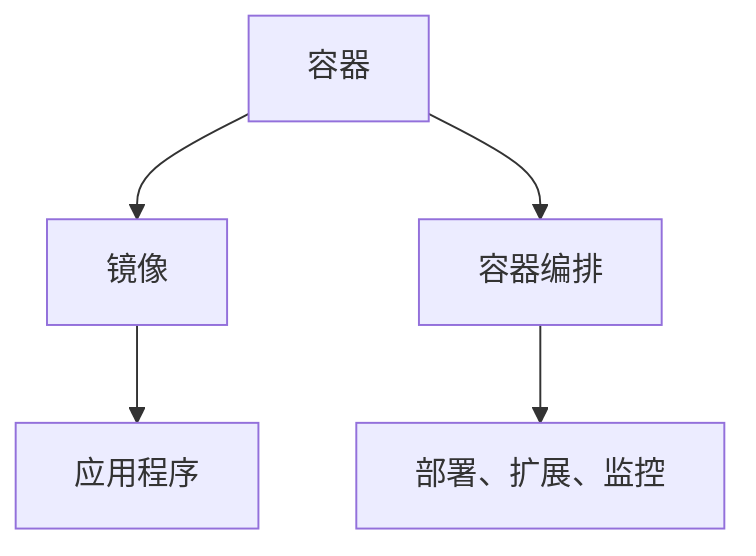

                 

  
容器技术是近年来IT领域的重要进展之一，它使得应用程序的部署和运行变得更加灵活和高效。本文旨在深入探讨容器的基本原理、核心概念及其应用实例，以便读者能够全面了解并掌握容器技术。

> 关键词：容器，Docker，Linux容器，虚拟化，轻量级，微服务，CI/CD

> 摘要：本文首先介绍了容器技术的发展背景和核心概念，接着详细讲解了容器的工作原理，包括Linux命名空间、cgroup和内核命名空间等关键技术。然后，通过一个具体的Docker容器实例，展示了如何创建、运行和管理容器。最后，本文讨论了容器的实际应用场景，包括微服务架构、持续集成和持续交付等，并展望了容器技术的未来发展趋势。

## 1. 背景介绍

容器技术的发展源于云计算和微服务架构的需求。在传统的应用程序部署中，通常需要为每个应用程序配置独立的硬件环境，包括操作系统、库和依赖项。这不仅增加了部署和维护的复杂性，还降低了资源的利用率。随着云计算的兴起，需要一种更加灵活和高效的部署方式来满足不断变化的应用需求。

容器技术正是为了解决这些问题而诞生的。容器是一种轻量级的虚拟化技术，它通过隔离应用程序及其运行环境，使得应用程序可以在不同的硬件和操作系统上无缝运行。容器技术的主要优点包括：

- **轻量级**：容器共享宿主机的操作系统内核，不需要额外的操作系统，因此启动速度快，资源占用少。
- **可移植性**：容器可以将应用程序及其依赖打包成一个统一的运行环境，便于在不同环境中部署和迁移。
- **隔离性**：容器通过命名空间和cgroup等技术实现进程和资源的隔离，确保了应用程序之间的安全性。
- **高效性**：容器管理工具（如Docker）提供了丰富的管理功能，如镜像管理、容器编排等，使得应用程序的部署和运维更加高效。

## 2. 核心概念与联系

在深入探讨容器的工作原理之前，我们需要了解一些核心概念和它们之间的关系。

### 2.1. 容器和虚拟机的区别

容器和虚拟机都是隔离技术，但它们的实现方式和目标有所不同。虚拟机通过模拟整个硬件环境，为每个虚拟机提供独立的操作系统和资源。而容器则通过共享宿主机的操作系统内核，只隔离应用程序的运行环境。

**区别**：

- **资源占用**：虚拟机需要为每个虚拟机分配独立的硬件资源，而容器则共享宿主机的资源。
- **启动速度**：虚拟机的启动速度较慢，需要初始化操作系统；而容器的启动速度较快，因为它只需要加载应用程序及其依赖。
- **隔离性**：虚拟机提供了更严格的隔离性，每个虚拟机都有独立的操作系统和资源；容器则通过命名空间和cgroup实现进程和资源的隔离。

### 2.2. 容器和进程

容器是一种轻量级的进程隔离技术。在操作系统中，进程是运行程序的基本单位。容器通过创建命名空间，将进程与其他容器隔离。这样，每个容器都可以独立运行，不会影响其他容器的运行。

**关系**：

- **容器**：一个运行中的应用程序及其依赖的集合，通过命名空间和cgroup实现进程和资源的隔离。
- **进程**：操作系统中运行的一个程序实例，容器中的每个应用程序都是一个独立的进程。

### 2.3. 容器和镜像

容器和镜像是容器技术的两个核心概念。镜像是一个静态的、预构建的应用程序及其依赖的集合，用于创建容器。容器则是运行中的镜像实例。

**关系**：

- **镜像**：静态的、预构建的应用程序及其依赖的集合，用于创建容器。
- **容器**：运行中的镜像实例，可以启动、停止、重启等。

### 2.4. 容器和容器编排

容器编排是指管理和调度容器的方式。容器编排工具（如Docker Swarm、Kubernetes）提供了容器集群的管理功能，如容器部署、扩展、监控等。

**关系**：

- **容器**：运行中的应用程序及其依赖的集合。
- **容器编排**：管理和调度容器的方式，包括容器部署、扩展、监控等。

## 2.5. Mermaid 流程图

下面是一个简单的Mermaid流程图，展示了容器、镜像和容器编排之间的关系：



## 3. 核心算法原理 & 具体操作步骤

### 3.1. 算法原理概述

容器技术的核心算法原理主要包括命名空间、cgroup和内核命名空间等。

- **命名空间**：命名空间是一种隔离技术，用于隔离进程和网络等系统资源。Linux内核提供了多个命名空间，如PID命名空间、Network命名空间、IPC命名空间等。
- **cgroup**：cgroup是一种资源控制机制，用于限制和控制容器中的资源使用，如CPU、内存、磁盘等。
- **内核命名空间**：内核命名空间是一种用于隔离内核资源的机制，如文件系统、设备等。

### 3.2. 算法步骤详解

容器技术的具体操作步骤如下：

1. **创建容器**：使用容器编排工具（如Docker）创建容器，指定镜像、容器名称等参数。
2. **启动容器**：启动容器，运行应用程序。
3. **管理容器**：管理容器，包括停止、启动、重启、删除等操作。
4. **容器编排**：使用容器编排工具管理容器集群，包括部署、扩展、监控等。

### 3.3. 算法优缺点

容器技术的优缺点如下：

**优点**：

- **轻量级**：容器共享宿主机的操作系统内核，启动速度快，资源占用少。
- **可移植性**：容器可以将应用程序及其依赖打包成一个统一的运行环境，便于在不同环境中部署和迁移。
- **隔离性**：容器通过命名空间和cgroup实现进程和资源的隔离，确保了应用程序之间的安全性。
- **高效性**：容器管理工具提供了丰富的管理功能，如镜像管理、容器编排等，使得应用程序的部署和运维更加高效。

**缺点**：

- **安全性**：容器虽然实现了进程和资源的隔离，但仍然存在一定的安全隐患，如容器逃逸等。
- **依赖性**：容器依赖于宿主机的操作系统和硬件环境，可能存在兼容性问题。
- **性能开销**：虽然容器相对于虚拟机轻量级，但仍然存在一定的性能开销。

### 3.4. 算法应用领域

容器技术在多个领域都有广泛的应用：

- **云计算**：容器技术是云计算的核心技术之一，用于部署和运行大规模的云服务。
- **微服务架构**：容器技术支持微服务架构，使得应用程序可以拆分成多个独立的微服务，便于开发和部署。
- **持续集成和持续交付**（CI/CD）：容器技术使得应用程序的构建、测试和部署更加高效，加快了软件交付的速度。
- **测试环境**：容器技术可以快速创建和销毁测试环境，便于进行自动化测试。

## 4. 数学模型和公式 & 详细讲解 & 举例说明

### 4.1. 数学模型构建

容器技术的核心算法原理可以抽象为一个数学模型，包括命名空间、cgroup和内核命名空间等。

- **命名空间**：命名空间可以抽象为一个多维数组，每个维度表示一个命名空间，如PID命名空间、Network命名空间等。
- **cgroup**：cgroup可以抽象为一个权重分配模型，用于限制和控制容器中的资源使用。
- **内核命名空间**：内核命名空间可以抽象为一个内核资源管理模型，用于隔离内核资源，如文件系统、设备等。

### 4.2. 公式推导过程

假设有一个容器A，需要运行一个应用程序P，并分配一定数量的CPU和内存资源。我们可以使用以下公式推导出容器A的资源限制：

- **CPU资源限制**：$$CPU_{limit} = CPU_{total} \times \frac{CPU_{weight}}{100}$$
- **内存资源限制**：$$Memory_{limit} = Memory_{total} \times \frac{Memory_{weight}}{100}$$

其中，$CPU_{total}$和$Memory_{total}$分别表示宿主机的CPU和内存总量，$CPU_{weight}$和$Memory_{weight}$分别表示容器A的CPU和内存权重。

### 4.3. 案例分析与讲解

假设我们有一个宿主机，CPU总量为4核，内存总量为8GB。我们需要运行一个容器A，其CPU权重为50%，内存权重为70%。我们可以按照以下步骤进行计算：

1. **计算CPU资源限制**：$$CPU_{limit} = 4 \times \frac{50}{100} = 2$$
2. **计算内存资源限制**：$$Memory_{limit} = 8 \times \frac{70}{100} = 5.6$$

因此，容器A的CPU资源限制为2核，内存资源限制为5.6GB。

### 4.4. 代码实例

以下是一个简单的Python代码实例，用于计算容器A的CPU和内存资源限制：

```python
total_cpu = 4
total_memory = 8

cpu_weight = 50
memory_weight = 70

cpu_limit = total_cpu * (cpu_weight / 100)
memory_limit = total_memory * (memory_weight / 100)

print("CPU资源限制：", cpu_limit)
print("内存资源限制：", memory_limit)
```

运行结果为：

```
CPU资源限制： 2.0
内存资源限制： 5.6
```

## 5. 项目实践：代码实例和详细解释说明

### 5.1. 开发环境搭建

在开始实践之前，我们需要搭建一个开发环境，包括Docker和Docker Compose。

1. **安装Docker**：在宿主机上安装Docker，可以通过Docker官方的安装脚本进行安装。以下是一个简单的安装命令：

   ```bash
   sudo apt-get update
   sudo apt-get install docker-ce docker-ce-cli containerd.io
   ```

2. **安装Docker Compose**：在宿主机上安装Docker Compose，可以通过Docker官方的安装脚本进行安装。以下是一个简单的安装命令：

   ```bash
   sudo curl -L "https://github.com/docker/compose/releases/download/1.29.2/docker-compose-`uname -s`-`uname -m`" -o /usr/local/bin/docker-compose
   sudo chmod +x /usr/local/bin/docker-compose
   ```

### 5.2. 源代码详细实现

我们以一个简单的Web应用程序为例，使用Docker和Docker Compose构建一个容器化环境。

1. **编写Dockerfile**：在应用程序的根目录下创建一个名为Dockerfile的文件，用于指定容器的构建过程。以下是一个简单的Dockerfile示例：

   ```Dockerfile
   FROM python:3.9
   WORKDIR /app
   COPY requirements.txt ./
   RUN pip install -r requirements.txt
   COPY . .
   CMD ["python", "app.py"]
   ```

   在这个Dockerfile中，我们使用了Python 3.9作为基础镜像，指定了应用程序的工作目录，并安装了所需的依赖项。

2. **编写docker-compose.yml**：在应用程序的根目录下创建一个名为docker-compose.yml的文件，用于定义容器的配置。以下是一个简单的docker-compose.yml示例：

   ```yaml
   version: '3.8'
   services:
     web:
       build: .
       ports:
         - "8000:8000"
   ```

   在这个docker-compose.yml文件中，我们定义了一个名为web的容器，并指定了应用程序的构建路径和映射端口。

### 5.3. 代码解读与分析

在docker-compose.yml文件中，我们定义了一个名为web的容器，它由应用程序的Dockerfile构建。以下是docker-compose.yml文件的详细解读：

1. **version**：指定Docker Compose的版本，我们使用的是3.8版本。
2. **services**：定义容器的配置，我们定义了一个名为web的容器。
3. **web**：表示容器的名称。
4. **build**：指定容器的构建路径，我们使用`.`表示当前目录下的Dockerfile。
5. **ports**：指定容器的映射端口，我们将容器的8000端口映射到宿主机的8000端口。

在Dockerfile中，我们使用以下命令构建容器：

1. **FROM python:3.9**：指定基础镜像为Python 3.9。
2. **WORKDIR /app**：指定应用程序的工作目录为/app。
3. **COPY requirements.txt ./**：将requirements.txt文件复制到工作目录。
4. **RUN pip install -r requirements.txt**：安装应用程序的依赖项。
5. **COPY . .**：将应用程序的代码复制到工作目录。
6. **CMD ["python", "app.py"]**：指定容器的启动命令为运行应用程序。

### 5.4. 运行结果展示

在完成开发环境搭建和源代码实现后，我们可以使用以下命令启动容器：

```bash
docker-compose up -d
```

这个命令将启动名为web的容器，并将在后台运行。启动成功后，我们可以在宿主机的8000端口访问应用程序。

```bash
http://localhost:8000
```

在浏览器中输入上述地址，如果一切正常，我们将看到应用程序的页面。

## 6. 实际应用场景

### 6.1. 微服务架构

容器技术是微服务架构的核心技术之一，它使得微服务的部署和运维变得更加灵活和高效。通过容器化，每个微服务都可以独立部署和扩展，减少了依赖和耦合。容器编排工具（如Kubernetes）提供了丰富的功能，如服务发现、负载均衡、故障转移等，使得微服务的管理和运维更加简单。

### 6.2. 持续集成和持续交付（CI/CD）

容器技术支持持续集成和持续交付（CI/CD）流程，使得应用程序的构建、测试和部署更加高效。通过Docker镜像，开发人员可以将应用程序及其依赖打包成一个统一的运行环境，确保在不同环境中的一致性。容器编排工具可以自动化构建、测试和部署流程，加快了软件交付的速度。

### 6.3. 云服务部署

容器技术是云计算的核心技术之一，用于部署和运行大规模的云服务。容器化使得云服务可以快速创建和销毁，提高了资源的利用率。容器编排工具可以自动化云服务的管理和运维，降低了运维成本。

### 6.4. 测试环境搭建

容器技术可以快速创建和销毁测试环境，便于进行自动化测试。通过Docker镜像，测试人员可以创建一个与生产环境一致的测试环境，确保测试的准确性和有效性。

## 7. 工具和资源推荐

### 7.1. 学习资源推荐

- 《Docker实战》
- 《Kubernetes权威指南》
- 《容器化与微服务架构》

### 7.2. 开发工具推荐

- Docker
- Docker Compose
- Kubernetes

### 7.3. 相关论文推荐

- "Docker: Lightweight Container for Lightweight Developers"
- "Kubernetes: System for Automating Deployment, Scaling, and Operations of Containerized Applications"
- "Microservices: A Definition of a New Approach to Building Software and the Principles Behind It"

## 8. 总结：未来发展趋势与挑战

### 8.1. 研究成果总结

容器技术已经成为IT领域的重要进展，它提高了应用程序的部署和运行效率，支持了微服务架构和持续集成和持续交付（CI/CD）流程。容器编排工具（如Kubernetes）提供了丰富的功能，使得容器化应用的管理和运维更加简单。

### 8.2. 未来发展趋势

未来，容器技术将继续发展，主要集中在以下几个方面：

- **容器安全**：随着容器技术的普及，容器安全问题变得越来越重要。未来，将出现更多针对容器安全的解决方案和工具。
- **容器网络**：容器网络技术的发展将使得容器之间的通信更加高效和可靠。
- **容器编排**：容器编排工具将继续优化和扩展，提供更强大的管理和调度功能。

### 8.3. 面临的挑战

容器技术面临的主要挑战包括：

- **性能优化**：容器虽然轻量级，但仍然存在一定的性能开销，未来需要进一步优化容器技术，提高性能。
- **兼容性问题**：容器技术依赖于宿主机的操作系统和硬件环境，存在兼容性问题，未来需要解决这些问题，提高容器的可移植性。
- **安全风险**：容器虽然实现了进程和资源的隔离，但仍然存在安全风险，需要加强容器安全防护。

### 8.4. 研究展望

未来，容器技术将继续发展，成为云计算和微服务架构的重要支撑。随着技术的不断进步，容器技术将更加成熟和普及，为软件开发和运维带来更多便利。

## 9. 附录：常见问题与解答

### 9.1. 问题1：容器和虚拟机有什么区别？

**解答**：容器和虚拟机都是隔离技术，但它们的实现方式和目标有所不同。虚拟机通过模拟整个硬件环境，为每个虚拟机提供独立的操作系统和资源；而容器则通过共享宿主机的操作系统内核，只隔离应用程序的运行环境。

### 9.2. 问题2：容器技术的主要优点是什么？

**解答**：容器技术的主要优点包括轻量级、可移植性、隔离性和高效性。容器共享宿主机的操作系统内核，启动速度快，资源占用少；容器可以将应用程序及其依赖打包成一个统一的运行环境，便于在不同环境中部署和迁移；容器通过命名空间和cgroup实现进程和资源的隔离，确保了应用程序之间的安全性；容器管理工具提供了丰富的管理功能，使得应用程序的部署和运维更加高效。

### 9.3. 问题3：如何创建和管理容器？

**解答**：创建和管理容器可以使用容器编排工具（如Docker和Kubernetes）进行。创建容器时，需要指定镜像、容器名称等参数；管理容器时，可以使用命令行工具（如docker和kubectl）进行启动、停止、重启、删除等操作。

### 9.4. 问题4：容器技术适用于哪些场景？

**解答**：容器技术适用于多种场景，包括云计算、微服务架构、持续集成和持续交付（CI/CD）、测试环境等。容器技术使得应用程序的部署和运行更加灵活和高效，适用于需要快速部署、扩展和迁移的场景。

### 9.5. 问题5：容器技术面临的主要挑战是什么？

**解答**：容器技术面临的主要挑战包括性能优化、兼容性问题和安全风险。容器虽然轻量级，但仍然存在一定的性能开销；容器技术依赖于宿主机的操作系统和硬件环境，存在兼容性问题；容器虽然实现了进程和资源的隔离，但仍然存在安全风险，需要加强容器安全防护。

### 9.6. 问题6：如何加强容器安全？

**解答**：加强容器安全可以从以下几个方面进行：

- **容器镜像安全**：对容器镜像进行安全扫描和验证，确保容器镜像没有安全隐患。
- **容器网络安全**：使用容器网络隔离技术，限制容器之间的网络访问。
- **容器安全策略**：制定和实施容器安全策略，包括权限管理、访问控制、审计等。
- **容器安全防护**：使用容器安全防护工具，如入侵检测和防护系统，实时监测和防范容器攻击。

## 9.7. 问题7：未来容器技术将如何发展？

**解答**：未来，容器技术将继续发展，主要集中在以下几个方面：

- **容器安全**：随着容器技术的普及，容器安全问题变得越来越重要。未来，将出现更多针对容器安全的解决方案和工具。
- **容器网络**：容器网络技术的发展将使得容器之间的通信更加高效和可靠。
- **容器编排**：容器编排工具将继续优化和扩展，提供更强大的管理和调度功能。

总之，容器技术将继续为软件开发和运维带来更多便利，成为云计算和微服务架构的重要支撑。随着技术的不断进步，容器技术将更加成熟和普及。作者：禅与计算机程序设计艺术 / Zen and the Art of Computer Programming。

