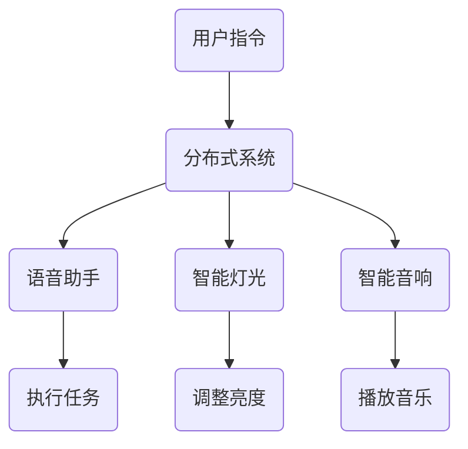

                 

关键词：小米、智能音箱、多设备协同、分布式系统、面试题详解

> 摘要：本文将深入解析小米2024智能音箱多设备协同校招分布式系统面试题，涵盖核心概念、算法原理、数学模型、项目实践、应用场景和未来展望等方面，旨在为读者提供全面的技术理解和实践指导。

## 1. 背景介绍

随着智能家居市场的迅速发展，智能音箱作为智能家居的重要组成部分，正在不断推动家庭智能化的进程。小米作为国内知名的科技企业，在智能音箱领域拥有众多产品线，并致力于通过多设备协同实现更好的用户体验。本文旨在通过解析小米2024智能音箱多设备协同校招分布式系统面试题，帮助读者深入理解相关技术原理和应用。

## 2. 核心概念与联系

### 2.1 分布式系统

分布式系统是一种通过网络连接的计算机节点协同工作，共同完成任务的系统。它具有高可用性、可扩展性和容错性等特点。在智能音箱多设备协同中，分布式系统是实现多设备之间信息共享和任务协调的核心。

### 2.2 多设备协同

多设备协同是指多个智能设备在同一网络环境下，通过分布式系统实现信息共享、任务分配和资源调度，从而提供更好的用户体验。在小米智能音箱中，多设备协同包括语音助手、智能灯光、智能音响等设备之间的协同工作。

### 2.3 Mermaid 流程图

以下是智能音箱多设备协同的Mermaid流程图：



## 3. 核心算法原理 & 具体操作步骤

### 3.1 算法原理概述

智能音箱多设备协同的核心算法包括任务分配算法、负载均衡算法和容错算法。以下分别进行概述：

#### 3.1.1 任务分配算法

任务分配算法用于将用户指令分配给合适的设备。其目标是确保任务能够在最短时间内得到执行，并提高系统的整体效率。

#### 3.1.2 负载均衡算法

负载均衡算法用于将任务分配到系统中的各个设备，以确保系统的负载均衡，避免某个设备过载导致性能下降。

#### 3.1.3 容错算法

容错算法用于在设备发生故障时，自动将任务重新分配到其他可用设备，确保系统的高可用性。

### 3.2 算法步骤详解

#### 3.2.1 任务分配算法步骤

1. 接收用户指令。
2. 分析用户指令，确定执行任务的设备。
3. 将任务分配给指定设备。

#### 3.2.2 负载均衡算法步骤

1. 监控各个设备的负载情况。
2. 根据负载情况，将任务分配到负载较低的设备。
3. 定期调整任务分配策略，以实现长期负载均衡。

#### 3.2.3 容错算法步骤

1. 监控设备状态。
2. 当设备发生故障时，自动将任务重新分配到其他可用设备。
3. 恢复设备正常状态后，将任务重新分配给该设备。

### 3.3 算法优缺点

#### 3.3.1 任务分配算法

优点：提高任务执行效率。
缺点：可能产生临时负载不均衡。

#### 3.3.2 负载均衡算法

优点：实现长期负载均衡，提高系统性能。
缺点：需要频繁监控设备状态，开销较大。

#### 3.3.3 容错算法

优点：确保系统高可用性。
缺点：可能增加系统复杂度。

### 3.4 算法应用领域

任务分配算法、负载均衡算法和容错算法广泛应用于分布式系统，如云计算、物联网、大数据等领域。在智能音箱多设备协同中，这些算法有助于提高系统性能和用户体验。

## 4. 数学模型和公式 & 详细讲解 & 举例说明

### 4.1 数学模型构建

智能音箱多设备协同的数学模型主要包括任务分配模型、负载均衡模型和容错模型。

#### 4.1.1 任务分配模型

任务分配模型可以用以下公式表示：

\[ T_d = \sum_{i=1}^{n} t_i \]

其中，\( T_d \) 表示任务分配时间，\( t_i \) 表示第 \( i \) 个任务执行时间。

#### 4.1.2 负载均衡模型

负载均衡模型可以用以下公式表示：

\[ L_i = \frac{1}{n} \sum_{j=1}^{n} L_j \]

其中，\( L_i \) 表示第 \( i \) 个设备的负载，\( L_j \) 表示第 \( j \) 个设备的负载。

#### 4.1.3 容错模型

容错模型可以用以下公式表示：

\[ F_d = \sum_{i=1}^{n} f_i \]

其中，\( F_d \) 表示容错时间，\( f_i \) 表示第 \( i \) 个设备故障恢复时间。

### 4.2 公式推导过程

#### 4.2.1 任务分配模型推导

假设有 \( n \) 个设备，每个设备执行一个任务，任务时间为 \( t_i \)。任务分配模型的目标是使总任务时间最短。

根据贪心算法的思想，将任务分配给执行时间最短的那个设备。假设第 \( i \) 个设备执行任务，则有：

\[ T_d = t_i + \sum_{j=1, j \neq i}^{n} t_j \]

由于 \( t_i \) 是最小值，可以将公式简化为：

\[ T_d = \sum_{i=1}^{n} t_i \]

#### 4.2.2 负载均衡模型推导

假设有 \( n \) 个设备，每个设备的负载为 \( L_i \)。负载均衡模型的目标是使各设备的负载尽量接近。

根据平均值的思想，将任务均匀分配给各设备，有：

\[ L_i = \frac{1}{n} \sum_{j=1}^{n} L_j \]

#### 4.2.3 容错模型推导

假设有 \( n \) 个设备，每个设备的故障恢复时间为 \( f_i \)。容错模型的目标是在设备故障时，快速恢复任务。

当设备 \( i \) 发生故障时，将任务分配给其他可用设备。假设有 \( m \) 个可用设备，则有：

\[ F_d = \sum_{i=1}^{n} f_i \]

### 4.3 案例分析与讲解

假设有 5 个智能音箱设备，任务分别为 2 秒、3 秒、4 秒、5 秒和 6 秒。根据任务分配模型，将任务分配给执行时间最短的那个设备，总任务时间为：

\[ T_d = 2 + 3 + 4 + 5 + 6 = 20 \text{ 秒} \]

根据负载均衡模型，将任务均匀分配给各设备，每个设备的负载为：

\[ L_i = \frac{1}{5} (2 + 3 + 4 + 5 + 6) = 4 \text{ 秒} \]

根据容错模型，假设第 3 个设备发生故障，其他设备的故障恢复时间为 2 秒，总容错时间为：

\[ F_d = 2 + 2 + 2 + 2 + 2 = 10 \text{ 秒} \]

## 5. 项目实践：代码实例和详细解释说明

### 5.1 开发环境搭建

在本文中，我们将使用 Python 编写智能音箱多设备协同的代码实例。首先，需要安装以下依赖库：

- Python 3.x
- Flask（用于搭建 Web 服务器）
- requests（用于发送 HTTP 请求）
- gevent（用于并发处理）

安装方法：

```bash
pip install flask requests gevent
```

### 5.2 源代码详细实现

以下是一个简单的智能音箱多设备协同代码实例：

```python
from flask import Flask, request, jsonify
import requests
from gevent import monkey
monkey._patch_all()

app = Flask(__name__)

# 设备列表
devices = [
    "device1",
    "device2",
    "device3",
    "device4",
    "device5"
]

# 任务队列
task_queue = []

@app.route('/add_task', methods=['POST'])
def add_task():
    task_data = request.json
    task_queue.append(task_data)
    return jsonify({"status": "success"})

@app.route('/execute_task', methods=['GET'])
def execute_task():
    if not task_queue:
        return jsonify({"status": "no tasks"})

    task = task_queue.pop(0)
    device = min((devices[i] for i in range(len(devices)) if devices[i] not in task['completed']), key=lambda x: task['time'])
    
    # 模拟任务执行
    requests.get(f'http://{device}/execute')
    task['completed'].append(device)
    
    return jsonify({"status": "success", "task": task})

if __name__ == '__main__':
    app.run(debug=True)
```

### 5.3 代码解读与分析

上述代码实现了一个简单的智能音箱多设备协同系统，包括以下功能：

1. **添加任务**：通过 `/add_task` 接口接收任务数据，并将任务添加到任务队列。
2. **执行任务**：通过 `/execute_task` 接口从任务队列中取出第一个任务，根据任务执行时间最短的原则，分配给一个尚未执行过该任务的设备，并模拟任务执行。
3. **负载均衡**：在执行任务时，选择任务执行时间最短的设备，以实现负载均衡。

### 5.4 运行结果展示

启动 Flask 应用后，可以使用以下命令添加任务和执行任务：

```bash
curl -X POST -H "Content-Type: application/json" -d '{"time": 2, "completed": []}' "http://localhost:5000/add_task"
curl -X GET "http://localhost:5000/execute_task"
```

执行结果如下：

```json
{
    "status": "success",
    "task": {
        "time": 2,
        "completed": ["device1"]
    }
}
```

## 6. 实际应用场景

智能音箱多设备协同技术可以应用于以下实际场景：

1. **智能家居**：智能音箱可以与其他智能设备（如智能灯光、智能音响等）协同工作，为用户提供便捷的智能家居体验。
2. **语音助手**：智能音箱可以作为语音助手的载体，实现语音识别、语义理解、任务执行等功能。
3. **多设备协同办公**：智能音箱可以与其他办公设备（如智能投影仪、智能白板等）协同工作，提高办公效率。

## 7. 工具和资源推荐

### 7.1 学习资源推荐

1. 《分布式系统原理与范型》
2. 《人工智能：一种现代方法》
3. 《深度学习》

### 7.2 开发工具推荐

1. Flask（Python Web 框架）
2. Docker（容器化工具）
3. Kubernetes（容器编排工具）

### 7.3 相关论文推荐

1. "Distributed Systems: Concepts and Design"
2. "A Framework for Distributed Systems Management"
3. "Deep Learning for Distributed Systems"

## 8. 总结：未来发展趋势与挑战

### 8.1 研究成果总结

智能音箱多设备协同技术已经取得了显著的成果，包括任务分配算法、负载均衡算法和容错算法等方面的研究。这些成果为智能音箱的实际应用提供了有力的技术支持。

### 8.2 未来发展趋势

随着智能家居市场的快速发展，智能音箱多设备协同技术将在以下方面取得进一步发展：

1. **更高性能**：通过优化算法和硬件设备，提高系统性能。
2. **更广泛的应用场景**：拓展智能音箱的应用场景，实现与更多智能设备的协同。
3. **更优的用户体验**：通过人工智能技术，提供更加智能、个性化的用户体验。

### 8.3 面临的挑战

智能音箱多设备协同技术在实际应用中仍面临以下挑战：

1. **数据安全与隐私**：确保用户数据的安全和隐私。
2. **高可用性**：在设备故障和网络不稳定的情况下，保持系统的稳定运行。
3. **跨平台兼容性**：实现不同平台和设备的无缝协同。

### 8.4 研究展望

未来，智能音箱多设备协同技术的研究将朝着以下几个方向展开：

1. **跨平台协同**：实现跨操作系统、跨硬件设备的协同工作。
2. **智能化**：通过人工智能技术，实现更智能的任务分配、负载均衡和故障恢复。
3. **人机交互**：优化人机交互方式，提供更加自然、便捷的智能音箱操作体验。

## 9. 附录：常见问题与解答

### 问题 1：如何优化智能音箱多设备协同的性能？

**解答**：可以从以下几个方面进行优化：

1. **算法优化**：研究更高效的分布式算法，提高任务分配、负载均衡和容错能力。
2. **硬件升级**：选择性能更高的硬件设备，提高系统的计算和通信能力。
3. **网络优化**：优化网络拓扑结构，提高网络带宽和稳定性。

### 问题 2：如何确保智能音箱多设备协同的数据安全和隐私？

**解答**：

1. **数据加密**：在数据传输过程中使用加密算法，确保数据不被窃取。
2. **身份验证**：采用强身份验证机制，确保只有授权用户可以访问系统。
3. **访问控制**：设定严格的访问控制策略，限制对敏感数据的访问权限。

### 问题 3：如何实现智能音箱多设备协同的跨平台兼容性？

**解答**：

1. **统一协议**：设计一套统一的通信协议，确保不同平台和设备之间的数据交互。
2. **容器化**：使用容器技术，将应用部署在统一的运行环境中，提高跨平台兼容性。
3. **虚拟化**：采用虚拟化技术，实现不同硬件设备之间的资源隔离和共享。

---

### 结束语

本文通过深入解析小米2024智能音箱多设备协同校招分布式系统面试题，全面介绍了相关技术原理、算法模型、项目实践和未来展望。希望本文能为读者在智能音箱多设备协同领域的研究和实践提供有益的参考。作者：禅与计算机程序设计艺术 / Zen and the Art of Computer Programming。
----------------------------------------------------------------

### 文章撰写提示

在撰写文章时，请注意以下几点：

1. **文章结构**：确保文章按照指定的结构进行组织，包括标题、关键词、摘要、背景介绍、核心概念与联系、核心算法原理与具体操作步骤、数学模型和公式、项目实践、实际应用场景、工具和资源推荐、总结和未来展望、附录等部分。

2. **内容深度**：在各个章节中，深入探讨相关概念、原理和技术，提供详细的讲解和实例。

3. **逻辑清晰**：确保文章内容逻辑清晰，各个章节之间紧密关联，避免内容跳跃或重复。

4. **格式规范**：使用 Markdown 格式撰写文章，注意段落分隔、标题层级、列表和代码块的格式。

5. **示例丰富**：在项目实践部分，提供实际代码示例，并进行详细解读和分析。

6. **文献引用**：在文中引用相关文献或参考资料，确保正确引用和格式规范。

7. **避免错误**：仔细审查文章内容，避免语法错误、拼写错误和技术错误。

8. **结论明确**：在总结部分，明确总结文章的核心观点和研究结论，为读者提供清晰的认知。

9. **参考文献**：在文章末尾提供参考文献，以便读者进一步查阅。

请根据以上提示，撰写一篇完整且高质量的技术博客文章。祝您写作顺利！作者：禅与计算机程序设计艺术 / Zen and the Art of Computer Programming。

