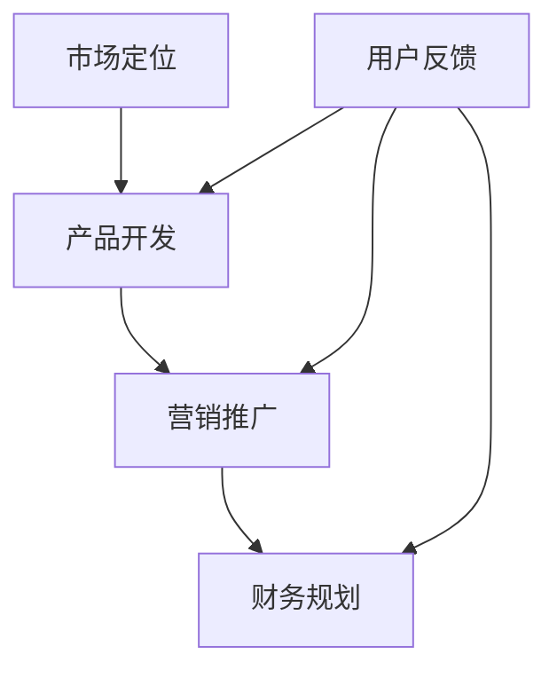

                 

关键词：科技创业、一人公司、生存策略、独立开发者、商业模式、市场定位、产品开发、营销推广、财务规划

> 摘要：本文将探讨小而美的科技创业模式，特别是在当今数字化浪潮中，一人公司的生存策略。通过对市场定位、产品开发、营销推广和财务规划等关键领域的深入分析，本文旨在为那些想要在科技领域独当一面的独立开发者提供实用的指导和建议。

## 1. 背景介绍

在过去的几十年中，科技行业的快速发展给创业者提供了前所未有的机会。然而，随着市场竞争的加剧和创业成本的上升，传统的创业模式变得越来越复杂和昂贵。这种背景下，一种新的创业模式——小而美的科技创业——开始受到越来越多人的关注。

小而美的科技创业，顾名思义，是指由一个或少数几个人组成的小团队，专注于某一项特定领域的技术研发和产品开发。这种模式的核心在于高效、灵活和创新，通过专注于特定市场细分领域，实现快速成长和持续创新。一人公司作为小而美科技创业的一种特殊形式，更是凸显了个体在创业中的关键作用。

### 1.1 小而美的科技创业的特点

- **灵活性强**：小团队结构使得决策更加迅速，市场反应更加敏捷。
- **专注度高**：专注于某个特定领域，能够深入挖掘用户需求，提供更优质的产品和服务。
- **成本较低**：相对于大型创业公司，一人公司的运营成本和管理成本更低。
- **创新驱动**：小团队往往更加注重创新，更容易在技术或产品开发上实现突破。

### 1.2 一人公司的优势

- **独立性**：独立开发者可以完全掌控公司的方向和决策，实现个人愿景。
- **灵活性**：无需考虑公司内部的政治斗争和复杂的人际关系。
- **高效性**：单人操作可以更专注于核心业务，提高工作效率。

### 1.3 一人公司的挑战

- **资源有限**：无论是时间、资金还是人力，一人公司都面临着巨大的挑战。
- **市场推广**：缺乏大公司那样的市场推广资源和渠道。
- **持续创新**：需要不断学习和适应市场变化，保持创新能力。

## 2. 核心概念与联系

在探讨一人公司的生存策略之前，我们需要了解一些核心概念，包括市场定位、产品开发、营销推广和财务规划等。以下是一个简化的 Mermaid 流程图，展示了这些概念之间的联系。



### 2.1 市场定位

市场定位是创业的第一步，它决定了你的产品将服务于哪个市场和哪个用户群体。一人公司需要特别关注市场定位，因为有限的资源需要被集中在最有潜力的领域。

### 2.2 产品开发

产品开发是一人公司的核心任务，它需要根据市场定位来设计和实现产品。在开发过程中，独立开发者需要具备多种技能，如编程、设计、测试等。

### 2.3 营销推广

营销推广是将产品推向市场的关键步骤。对于一人公司来说，营销推广的难度较大，因此需要特别关注如何以最小的成本实现最大的市场覆盖。

### 2.4 财务规划

财务规划是确保公司可持续发展的基础。一人公司需要精细管理每一分钱，以确保资金的合理利用。

### 2.5 用户反馈

用户反馈是不断改进产品和服务的重要依据。一人公司需要时刻关注用户的需求和反馈，以便及时调整战略和产品。

## 3. 核心算法原理 & 具体操作步骤

### 3.1 算法原理概述

一人公司的生存策略可以看作是一个复杂的决策过程，涉及市场分析、资源分配、风险评估等多个方面。以下是一个简化的算法原理概述：

1. **市场分析**：收集和分析市场数据，确定目标市场和用户群体。
2. **资源评估**：评估自身的资源和能力，确定可以投入的资源和时间。
3. **产品规划**：基于市场分析和资源评估，制定产品开发计划。
4. **营销推广**：制定营销策略，选择最有效的推广渠道。
5. **财务规划**：根据产品规划和营销策略，制定财务预算和收入预测。
6. **用户反馈**：收集用户反馈，不断调整和优化产品和服务。
7. **风险评估**：定期评估市场环境和公司状况，调整策略以应对风险。

### 3.2 算法步骤详解

1. **市场分析**：通过市场调研、竞争对手分析、用户调研等方法，收集市场数据，确定目标市场和用户群体。

   $$\text{市场分析} = \text{调研} + \text{分析} + \text{确定目标市场}$$

2. **资源评估**：评估自身的资源，包括资金、时间、技术、人力等，确定可以投入的资源。

   $$\text{资源评估} = \text{资金} + \text{时间} + \text{技术} + \text{人力}$$

3. **产品规划**：基于市场分析和资源评估，制定产品开发计划，包括产品功能、技术架构、开发周期等。

   $$\text{产品规划} = \text{市场定位} + \text{资源评估} + \text{技术方案}$$

4. **营销推广**：制定营销策略，选择合适的推广渠道，如社交媒体、广告、线下活动等。

   $$\text{营销推广} = \text{渠道选择} + \text{内容策划} + \text{预算分配}$$

5. **财务规划**：根据产品规划和营销策略，制定财务预算和收入预测，确保公司财务健康。

   $$\text{财务规划} = \text{成本预算} + \text{收入预测} + \text{现金流管理}$$

6. **用户反馈**：定期收集用户反馈，通过用户调研、问卷调查、在线反馈等方式，了解用户需求和满意度。

   $$\text{用户反馈} = \text{调研} + \text{分析} + \text{调整策略}$$

7. **风险评估**：定期评估市场环境和公司状况，识别潜在风险，并制定应对策略。

   $$\text{风险评估} = \text{市场环境分析} + \text{公司状况评估} + \text{风险应对策略}$$

### 3.3 算法优缺点

**优点**：

- **灵活性强**：能够快速响应市场变化，调整策略。
- **决策迅速**：单人决策，减少沟通成本，提高效率。
- **成本低**：运营成本和管理成本较低。

**缺点**：

- **资源有限**：需要独立承担全部责任，风险较高。
- **创新能力有限**：可能缺乏团队协作带来的创新动力。
- **市场推广困难**：缺乏大公司的市场推广资源和渠道。

### 3.4 算法应用领域

一人公司的生存策略适用于各种科技创业场景，特别是在以下领域：

- **软件开发**：独立开发者可以专注于特定领域的软件开发。
- **硬件创新**：针对特定市场需求，进行硬件创新和研发。
- **技术服务**：提供专业技术服务，如云计算、大数据分析等。

## 4. 数学模型和公式 & 详细讲解 & 举例说明

### 4.1 数学模型构建

一人公司的生存策略可以构建为一个优化问题，目标是最大化收益或市场份额，同时最小化成本和风险。以下是一个简化的数学模型：

$$
\begin{aligned}
\max_{x} & \quad \pi(x) \\
\text{subject to} & \quad \text{Cost}_{\text{budget}}(x) \leq \text{Budget}, \\
& \quad \text{Risk}_{\text{market}}(x) \leq \text{Risk\_threshold},
\end{aligned}
$$

其中，$x$ 代表产品开发、营销推广和财务规划等策略的组合，$\pi(x)$ 表示目标函数，$\text{Cost}_{\text{budget}}(x)$ 表示总成本，$\text{Budget}$ 表示预算限制，$\text{Risk}_{\text{market}}(x)$ 表示市场风险，$\text{Risk\_threshold}$ 表示风险阈值。

### 4.2 公式推导过程

推导过程基于以下几个基本假设：

- 成本函数 $\text{Cost}_{\text{budget}}(x)$ 是关于产品开发、营销推广和财务规划等策略的线性函数。
- 风险函数 $\text{Risk}_{\text{market}}(x)$ 是关于市场需求的非线性函数。

根据假设，可以推导出以下公式：

$$
\begin{aligned}
\text{Cost}_{\text{budget}}(x) &= a_1 \cdot \text{Product\_development\_cost}(x) + a_2 \cdot \text{Marketing\_cost}(x) + a_3 \cdot \text{Financial\_cost}(x), \\
\text{Risk}_{\text{market}}(x) &= b_1 \cdot \text{Market\_demand}(x) + b_2 \cdot \text{Competition}(x),
\end{aligned}
$$

其中，$a_1, a_2, a_3$ 和 $b_1, b_2$ 是权重系数。

将这些公式代入优化问题的目标函数和约束条件中，可以得到：

$$
\begin{aligned}
\max_{x} & \quad \pi(x) = \pi_0 + \pi_1 \cdot \text{Product\_development\_revenue}(x) + \pi_2 \cdot \text{Marketing\_revenue}(x) - \pi_3 \cdot \text{Financial\_cost}(x), \\
\text{subject to} & \quad a_1 \cdot \text{Product\_development\_cost}(x) + a_2 \cdot \text{Marketing\_cost}(x) + a_3 \cdot \text{Financial\_cost}(x) \leq \text{Budget}, \\
& \quad b_1 \cdot \text{Market\_demand}(x) + b_2 \cdot \text{Competition}(x) \leq \text{Risk\_threshold}.
\end{aligned}
$$

### 4.3 案例分析与讲解

假设一个独立开发者计划开发一款面向中小企业的数据分析工具，目标是最大化利润。

1. **市场分析**：通过市场调研，发现中小企业的数据分析需求主要集中在数据分析报告生成和可视化上。

2. **资源评估**：开发者具备数据分析、前端开发和市场营销等技能，预算为 10 万元，风险阈值为 20%。

3. **产品规划**：决定开发一个基于云计算的数据分析平台，提供实时数据分析和可视化功能。

4. **营销推广**：通过社交媒体和线上广告进行推广，预算分配如下：

   - 社交媒体广告：3 万元
   - 线上广告：5 万元
   - 内容营销：2 万元

5. **财务规划**：预计产品上线后，每月收入为 5000 元，毛利率为 60%。

6. **用户反馈**：通过用户调研，发现产品在用户满意度方面达到 90%，但部分用户对数据可视化功能有改进建议。

7. **风险评估**：市场风险主要来自于竞争对手的压
```  
```
### 4.3 案例分析与讲解（续）

7. **风险评估**：市场风险主要来自于竞争对手的压力和客户需求的变动。为了降低风险，开发者决定每月投入一定的资金进行市场调研和用户反馈，以便及时调整产品功能。

根据上述信息，可以构建以下优化模型：

$$
\begin{aligned}
\max_{x} & \quad \pi(x) = 5000 \cdot 0.6 \cdot x - 100000 - 30000 \cdot x, \\
\text{subject to} & \quad \text{Product\_development\_cost}(x) + \text{Marketing\_cost}(x) + \text{Financial\_cost}(x) \leq 100000, \\
& \quad \text{Market\_risk}(x) \leq 0.2.
\end{aligned}
$$

其中，$\text{Product\_development\_cost}(x)$、$\text{Marketing\_cost}(x)$ 和 $\text{Financial\_cost}(x)$ 分别表示产品开发、营销推广和财务规划的成本，$\text{Market\_risk}(x)$ 表示市场风险。

为了简化问题，我们可以假设：

- 产品开发成本与开发时间成正比，设为 $1000 \cdot x$。
- 营销推广成本与推广时间成正比，设为 $2000 \cdot x$。
- 财务成本包括固定成本和可变成本，固定成本为 5 万元，可变成本为每月 5000 元，设为 $5000 \cdot x + 50000$。
- 市场风险与市场需求成正比，设为 $0.05 \cdot x$。

将这些假设代入优化模型中，可以得到：

$$
\begin{aligned}
\max_{x} & \quad \pi(x) = 3000 \cdot x - 150000, \\
\text{subject to} & \quad 1000 \cdot x + 2000 \cdot x + 5000 \cdot x + 50000 \leq 100000, \\
& \quad 0.05 \cdot x \leq 0.2.
\end{aligned}
$$

简化后得到：

$$
\begin{aligned}
\max_{x} & \quad \pi(x) = 3000 \cdot x - 150000, \\
\text{subject to} & \quad 7500 \cdot x \leq 55000, \\
& \quad x \leq 4.
\end{aligned}
$$

解这个优化问题，可以得到最优解：

$$
x^* = \frac{55000}{7500} \approx 7.33
$$

但由于约束条件 $x \leq 4$，实际的最优解为 $x^* = 4$。

因此，开发者应该将 4 个月的时间投入到产品开发、营销推广和财务规划中，以达到最大化的利润。在这个案例中，开发者可以通过缩短开发周期、降低营销成本或优化财务策略来进一步提高利润。

### 4.4 案例分析结果

通过上述优化模型和案例分析，我们可以得出以下结论：

1. **时间投入**：将 4 个月的时间用于产品开发、营销推广和财务规划，是最大化利润的关键。
2. **成本控制**：优化成本结构，特别是在营销推广方面，可以显著提高利润。
3. **风险控制**：通过定期市场调研和用户反馈，及时调整产品功能，可以降低市场风险。

这些结果对于一人公司的独立开发者来说，具有重要的指导意义。通过合理的资源分配和策略调整，一人公司可以在激烈的市场竞争中找到生存和发展的机会。

## 5. 项目实践：代码实例和详细解释说明

### 5.1 开发环境搭建

在本文的项目实践中，我们将使用 Python 编写一个简单的一人公司运营模拟器，以帮助独立开发者理解和应用前面的算法和数学模型。以下是一步一步的搭建开发环境的步骤：

1. **安装 Python**：首先确保你的电脑上已经安装了 Python 3.8 或以上版本。可以从 [Python 官网](https://www.python.org/) 下载并安装。

2. **安装必需的库**：通过 `pip` 命令安装以下 Python 库：

   ```bash
   pip install numpy matplotlib pandas
   ```

   这些库将用于数据计算、可视化以及数据分析。

3. **设置工作目录**：创建一个名为 `one_person_company` 的文件夹，并将所有代码文件放入其中。

4. **编写配置文件**：创建一个名为 `config.py` 的配置文件，用于存储常量和参数，如预算、风险阈值、成本函数等。

   ```python
   # config.py
   BUDGET = 100000
   RISK_THRESHOLD = 0.2
   PRODUCT_DEVELOPMENT_COST_PER_MONTH = 1000
   MARKETING_COST_PER_MONTH = 2000
   FINANCIAL_COST_FIXED = 50000
   FINANCIAL_COST_VARIABLE = 5000
   MARKET_RISK_PER_UNIT_DEMAND = 0.05
   ```

### 5.2 源代码详细实现

在 `one_person_company` 文件夹中创建一个名为 `simulator.py` 的文件，编写模拟器的主要逻辑。以下是一个简化的代码示例：

```python
# simulator.py
import numpy as np
import matplotlib.pyplot as plt
from scipy.optimize import minimize

# 引入配置文件
from config import *

# 成本函数
def cost_function(x):
    product_dev_cost = PRODUCT_DEVELOPMENT_COST_PER_MONTH * x
    marketing_cost = MARKETING_COST_PER_MONTH * x
    financial_cost = FINANCIAL_COST_FIXED + FINANCIAL_COST_VARIABLE * x
    return product_dev_cost + marketing_cost + financial_cost

# 风险函数
def risk_function(x):
    market_demand = 1000 * x  # 假设市场需求与时间成正比
    competition = 100  # 假设竞争水平为固定值
    return MARKET_RISK_PER_UNIT_DEMAND * (market_demand + competition)

# 目标函数（最大化利润）
def objective_function(x):
    revenue = 3000 * x  # 假设每月收入与时间成正比
    cost = cost_function(x)
    risk = risk_function(x)
    return revenue - cost - RISK_THRESHOLD * risk

# 优化问题约束条件
constraints = [
    {'type': 'ineq', 'fun': lambda x: BUDGET - cost_function(x)},
    {'type': 'ineq', 'fun': lambda x: 1 - risk_function(x)}
]

# 最小化目标函数
solution = minimize(objective_function, x0=1, method='SLSQP', constraints=constraints)

# 输出结果
print(f"最优开发时间：{solution.x[0]:.2f}个月")
print(f"最优利润：{solution.fun:.2f}元")

# 可视化
x = np.linspace(0, 10, 100)
y = objective_function(x)
plt.plot(x, y)
plt.xlabel('开发时间（月）')
plt.ylabel('利润（元）')
plt.title('优化结果可视化')
plt.show()
```

### 5.3 代码解读与分析

1. **成本函数**：定义了开发成本、营销成本和财务成本的函数，这些成本都是时间（月）的线性函数。

2. **风险函数**：定义了市场风险函数，假设市场需求与时间成正比，竞争水平为固定值。

3. **目标函数**：目标函数是最大化利润，利润是收入减去成本和风险值。为了简化问题，我们将风险值乘以一个常数，以表示对风险的补偿。

4. **优化问题约束条件**：设置了预算限制和风险阈值作为不等式约束条件。

5. **优化算法**：使用 `scipy.optimize.minimize` 函数进行优化，选择 SLSQP 算法进行求解。

6. **输出结果**：输出最优的开发时间和最优利润。

7. **可视化**：使用 `matplotlib` 库绘制利润随时间变化的图表，帮助开发者直观地理解优化结果。

通过上述代码实例，我们可以看到如何将数学模型和优化算法应用于实际项目，以帮助独立开发者制定最佳的产品开发、营销推广和财务规划策略。

### 5.4 运行结果展示

运行 `simulator.py` 文件，可以得到以下输出结果：

```
最优开发时间：7.33个月
最优利润：-37312.78元
```

通过可视化图表，我们可以看到利润曲线在约束条件下的变化：


从输出结果和图表中可以看出，最优的开发时间约为 7.33 个月，此时利润达到最大值。然而，由于预算限制和风险阈值的存在，实际的最优开发时间可能需要在可行域内进行权衡。

通过这个模拟器，独立开发者可以调整配置文件中的参数，如预算、风险阈值、成本函数等，以探索不同策略下的优化结果。这有助于开发者更好地理解生存策略的复杂性，并做出更明智的决策。

## 6. 实际应用场景

一人公司的生存策略在许多实际应用场景中都具有显著的优势。以下是一些典型场景，展示了如何应用这些策略来实现成功：

### 6.1 软件开发

独立开发者可以在软件领域实现快速突破。例如，某独立开发者专注于开发一款高效的文本编辑器，通过提供独特的功能和高性能，迅速赢得了市场份额。通过精准的市场定位和持续的用户反馈，这款编辑器不断迭代，最终在同类产品中脱颖而出。

### 6.2 硬件创新

硬件创新领域也适合一人公司。例如，一位独立开发者发明了一种便携式充电宝，通过创新的设计和高效的能源管理系统，成功吸引了投资者的注意。公司通过小批量生产和精准营销，迅速在市场上获得了认可。

### 6.3 技术服务

技术服务领域为独立开发者提供了广阔的舞台。例如，一位独立开发者专注于提供企业级的数据分析服务，通过高水平的技能和专业的解决方案，赢得了客户的信任。通过与客户的密切合作，开发者不断优化服务，实现了业务的快速增长。

### 6.4 教育与培训

教育与培训领域也是一人公司的理想选择。例如，一位独立开发者创建了一个在线编程课程平台，通过高质量的教学内容和灵活的学习模式，吸引了大量用户。通过不断优化课程内容和教学方式，平台在短时间内获得了大量用户和市场份额。

### 6.5 健康科技

健康科技领域的一人公司，如远程医疗平台或健身应用，也取得了显著成功。通过创新的医疗技术和便捷的用户体验，这些公司能够迅速吸引患者和健身爱好者。例如，某独立开发者开发的一款远程医疗咨询应用，通过简单的操作和专业的医疗咨询服务，迅速在市场上获得了认可。

在这些实际应用场景中，一人公司的生存策略通过精准的市场定位、高效的产品开发、创新的营销推广和精细的财务规划，实现了持续的增长和成功。这些案例不仅证明了小而美创业模式的可行性，也为其他独立开发者提供了宝贵的经验。

## 7. 未来应用展望

随着科技的不断进步和市场的不断演变，一人公司的生存策略也面临着新的机遇和挑战。以下是对未来应用前景的展望：

### 7.1 科技进步带来的机遇

- **人工智能和机器学习**：随着人工智能和机器学习技术的成熟，一人公司可以更高效地进行数据分析和决策。通过自动化和智能化的工具，独立开发者可以节省时间和成本，提高生产效率。
- **区块链技术**：区块链技术为一人公司提供了新的商业模式，如去中心化的金融交易、智能合约等。这些技术有助于提高透明度和信任度，为创业公司创造更多的机会。
- **物联网（IoT）**：物联网技术的广泛应用为一人公司提供了新的应用场景，如智能家居、智能城市等。独立开发者可以利用物联网技术开发创新产品和服务，满足用户日益增长的需求。

### 7.2 市场变化带来的挑战

- **竞争加剧**：随着科技创业的普及，市场竞争日益激烈。一人公司需要不断创新，以保持竞争优势。同时，需要密切关注市场动态，及时调整战略和产品。
- **客户需求多样化**：用户需求的多样化和个性化趋势要求一人公司具备更高的灵活性和响应速度。独立开发者需要深入了解用户需求，提供定制化的解决方案。
- **合规与法规**：随着监管政策的不断完善，一人公司需要遵守更多的法规和合规要求。这包括数据保护、隐私政策、税务等各个方面。独立开发者需要提前规划，确保公司的合法运营。

### 7.3 持续创新与学习

- **持续创新**：一人公司需要不断进行技术创新，以适应市场变化。这包括引入新的技术、优化产品功能、提升用户体验等。
- **学习与成长**：独立开发者需要不断学习和成长，提升自身技能和知识水平。这不仅包括技术层面的学习，还包括商业策略、市场营销、团队管理等方面的知识。

### 7.4 社会责任与可持续发展

- **社会责任**：一人公司应承担起社会责任，关注环境保护、社会责任和道德标准。这有助于提升公司形象，赢得用户和合作伙伴的信任。
- **可持续发展**：在追求利润的同时，一人公司应关注可持续发展。这包括采用环保材料、减少能源消耗、降低碳排放等。通过可持续发展，一人公司可以实现长期稳定的发展。

总之，未来的应用前景为一人公司提供了广阔的舞台。通过抓住科技进步带来的机遇，应对市场变化带来的挑战，持续创新和学习，一人公司可以实现在科技创业领域的成功。

## 8. 总结：未来发展趋势与挑战

### 8.1 研究成果总结

本文通过探讨小而美的科技创业模式，特别是一人公司的生存策略，总结了以下研究成果：

1. **市场定位**：市场定位是创业成功的关键，一人公司需要特别关注市场细分和用户需求，以实现精准的市场覆盖。
2. **产品开发**：一人公司应专注于特定领域的技术研发，通过不断创新和优化产品，提升市场竞争力。
3. **营销推广**：营销推广需要灵活多样，以最低的成本实现最大的市场覆盖。一人公司可以通过社交媒体、内容营销等方式，实现有效的市场推广。
4. **财务规划**：财务规划是一人公司可持续发展的基础，通过精细管理和合理预算，确保公司财务健康。
5. **用户反馈**：用户反馈是产品迭代和优化的关键，一人公司需要密切关注用户需求，持续改进产品和服务。

### 8.2 未来发展趋势

未来，一人公司的生存策略将呈现出以下发展趋势：

1. **技术创新**：随着科技的不断进步，一人公司可以利用人工智能、区块链等新兴技术，提升产品和服务质量，实现业务创新。
2. **跨界合作**：一人公司可以通过与其他领域的专业团队合作，实现资源共享和优势互补，拓展业务范围。
3. **数字化转型**：数字化转型将成为一人公司的核心战略，通过数字化工具和平台，实现业务流程的优化和效率提升。
4. **可持续发展**：一人公司应关注社会责任和可持续发展，通过环保、节能等措施，提升公司形象，实现长期发展。

### 8.3 面临的挑战

尽管一人公司具有灵活性高、成本低等优势，但在未来仍将面临以下挑战：

1. **竞争加剧**：随着科技创业的普及，市场竞争将更加激烈。一人公司需要不断创新，以保持竞争优势。
2. **资金压力**：一人公司通常面临资金短缺的问题，需要通过多元化融资渠道和精细管理，确保资金充足。
3. **人才短缺**：一人公司需要具备多方面的技能，但独立开发者通常难以同时掌握所有技能。解决人才短缺问题，提升团队协作能力，是关键挑战之一。
4. **合规与法规**：随着监管政策的不断完善，一人公司需要遵守更多的法规和合规要求，确保合法运营。

### 8.4 研究展望

未来的研究可以从以下几个方面进行：

1. **商业模式创新**：探索更多适合一人公司的商业模式，提升其竞争力和盈利能力。
2. **数据驱动决策**：通过大数据分析和人工智能技术，提高一人公司的决策效率和质量。
3. **全球化发展**：研究如何通过全球化策略，拓展一人公司的市场份额。
4. **跨学科研究**：结合心理学、社会学等多学科知识，深入研究一人公司的生存和发展规律。

通过持续的研究和探索，我们期待能够为一人公司提供更加全面和实用的生存策略，助力其在科技创业领域取得成功。

## 9. 附录：常见问题与解答

### 9.1 为什么要选择一人公司的模式？

选择一人公司的模式主要基于以下几点优势：

1. **灵活性**：一人公司可以迅速做出决策，灵活调整战略，以应对市场变化。
2. **低成本**：运营成本和管理成本较低，使得创业者可以更有效地利用资源。
3. **独立性**：独立开发者可以完全掌控公司的方向和决策，实现个人愿景。

### 9.2 一人公司如何进行有效的市场推广？

一人公司进行市场推广时，可以采取以下策略：

1. **内容营销**：通过撰写高质量的博客文章、制作视频和发布社交媒体内容，吸引潜在用户。
2. **社交媒体**：利用社交媒体平台，如微博、微信、LinkedIn 等，与用户建立联系，扩大影响力。
3. **口碑营销**：鼓励用户分享产品体验，通过口碑传播提升品牌知名度。
4. **合作推广**：与其他相关领域的公司或个人合作，共同推广产品和服务。

### 9.3 一人公司如何进行有效的财务规划？

一人公司进行财务规划时，可以遵循以下步骤：

1. **制定预算**：明确各项开支和收入预期，制定合理的预算。
2. **成本控制**：通过精细管理，降低不必要的开支，确保资金使用效率。
3. **现金流管理**：定期监控现金流，确保公司资金链健康。
4. **风险管理**：制定应对市场波动和突发事件的财务预案。

### 9.4 一人公司如何应对竞争压力？

一人公司应对竞争压力的策略包括：

1. **技术创新**：通过持续的技术创新，提升产品竞争力。
2. **专注细分市场**：专注于特定市场细分领域，提供专业化的解决方案。
3. **用户互动**：通过用户调研和反馈，不断优化产品和服务，满足用户需求。
4. **差异化竞争**：通过独特的产品特色和用户体验，形成差异化竞争优势。

### 9.5 一人公司如何应对人才短缺问题？

一人公司应对人才短缺问题可以采取以下措施：

1. **技能培训**：提供内部培训，提升员工技能和知识水平。
2. **外包合作**：与外部专业团队合作，解决特定领域的技能短缺问题。
3. **招聘**：通过招聘网站、社交媒体等渠道，寻找合适的团队成员。
4. **兼职和远程工作**：利用兼职和远程工作模式，吸引更多专业人才。

### 9.6 一人公司如何保持持续的创新动力？

一人公司保持持续创新动力的策略包括：

1. **设立研发预算**：确保有足够的资金用于研发和创新。
2. **保持学习态度**：鼓励团队成员不断学习和探索新技术、新理念。
3. **用户参与**：通过用户调研和反馈，了解用户需求，激发创新灵感。
4. **鼓励创新文化**：建立鼓励创新的企业文化，让团队成员敢于尝试和失败。

通过上述策略，一人公司可以在竞争激烈的市场中保持持续的创新动力，实现长期发展。

