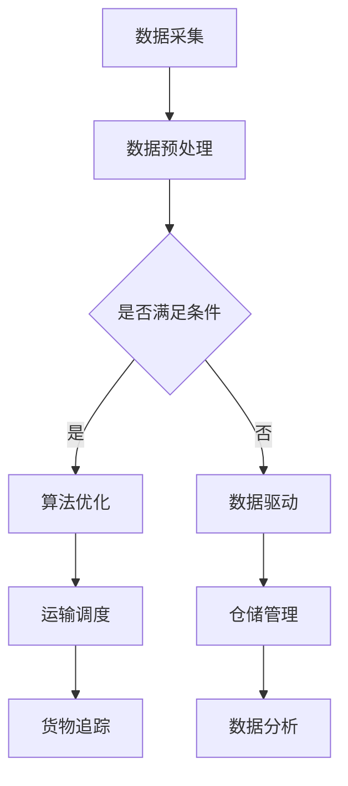

                 

关键词：智能物流系统、工具使用机制、数据驱动、算法优化、AI应用、自动化流程

> 摘要：本文旨在探讨工具使用机制在智能物流系统中的应用，分析如何通过数据驱动和算法优化提升物流系统的效率。文章首先介绍了智能物流系统的背景和现状，随后详细阐述了工具使用机制的核心概念及其在系统架构中的位置。接着，文章深入解析了核心算法原理、数学模型和具体操作步骤，并通过实际代码实例进行了详细解释。最后，文章探讨了智能物流系统的实际应用场景，展望了未来的发展趋势和挑战。

## 1. 背景介绍

### 智能物流系统的兴起

随着全球经济的快速发展，物流行业面临着巨大的挑战和机遇。传统的物流系统已经无法满足日益增长的物流需求，智能物流系统逐渐成为行业发展的趋势。智能物流系统通过引入大数据、人工智能、物联网等先进技术，实现了物流过程的自动化、智能化和高效化。

### 智能物流系统的重要性

智能物流系统不仅提高了物流效率，降低了运营成本，还显著提升了客户满意度。在智能物流系统的支持下，物流企业可以实时监控货物的运输过程，确保货物安全、准时送达。同时，智能物流系统还可以提供精准的数据分析，帮助物流企业优化运输路线和仓储管理，进一步提升物流服务的质量。

### 工具使用机制的概念

工具使用机制是指在物流系统中，通过引入各种工具和技术，实现物流过程的自动化和优化。这些工具和技术包括但不限于人工智能算法、数据分析工具、自动化设备等。工具使用机制的核心目标是通过数据驱动和算法优化，提升物流系统的效率和可靠性。

## 2. 核心概念与联系

### 工具使用机制在智能物流系统中的位置

工具使用机制是智能物流系统的核心组成部分，贯穿于物流系统的各个环节。具体来说，工具使用机制在以下方面发挥重要作用：

1. **运输调度**：通过人工智能算法优化运输路线和调度策略，提高运输效率。
2. **仓储管理**：利用自动化设备和数据分析工具，实现仓储货物的自动化识别和管理。
3. **货物追踪**：通过物联网技术实时监控货物的运输过程，提高物流透明度。
4. **数据分析**：利用大数据技术对物流过程中的数据进行深度分析，优化物流流程。

### 工具使用机制的核心概念

1. **数据驱动**：数据驱动是指通过收集和分析大量物流数据，指导物流系统的优化和决策。数据驱动是智能物流系统的基础，是提升物流效率的关键。
2. **算法优化**：算法优化是指利用人工智能算法对物流过程中的各种问题进行求解，如运输调度、路径规划、库存管理等。算法优化是工具使用机制的核心，是实现物流系统自动化和智能化的关键。
3. **自动化流程**：自动化流程是指通过引入自动化设备和工具，实现物流过程的自动化。自动化流程是提高物流效率和降低人力成本的重要手段。

### Mermaid 流程图

下面是一个Mermaid流程图，展示了工具使用机制在智能物流系统中的应用：



## 3. 核心算法原理 & 具体操作步骤

### 3.1 算法原理概述

智能物流系统中的算法主要分为以下几类：

1. **运输调度算法**：用于优化运输路线和调度策略，提高运输效率。
2. **路径规划算法**：用于求解从起点到终点的最优路径，减少运输时间和成本。
3. **库存管理算法**：用于优化库存水平，减少库存成本，提高资金利用率。
4. **数据分析算法**：用于对物流过程中的数据进行深度分析，发现潜在问题和优化点。

### 3.2 算法步骤详解

#### 运输调度算法

1. **问题建模**：根据物流需求，建立运输调度的数学模型。
2. **数据预处理**：收集并处理运输过程中的各种数据，如车辆位置、货物类型、运输需求等。
3. **算法求解**：利用遗传算法、粒子群算法等优化算法，求解运输调度的最优解。
4. **结果评估**：评估运输调度的效果，如运输时间、运输成本等。

#### 路径规划算法

1. **问题建模**：根据物流需求，建立路径规划的数学模型。
2. **数据预处理**：收集并处理起点、终点以及各种障碍物的数据。
3. **算法求解**：利用Dijkstra算法、A*算法等求解路径规划的最优解。
4. **结果评估**：评估路径规划的效果，如路径长度、路径可靠性等。

#### 库存管理算法

1. **问题建模**：根据物流需求，建立库存管理的数学模型。
2. **数据预处理**：收集并处理库存数据，如库存水平、库存成本、货物周转率等。
3. **算法求解**：利用最优化算法，如线性规划、整数规划等，求解库存管理的最优解。
4. **结果评估**：评估库存管理的效果，如库存成本、库存周转率等。

#### 数据分析算法

1. **问题建模**：根据物流需求，建立数据分析的数学模型。
2. **数据预处理**：收集并处理物流过程中的各种数据，如运输时间、运输成本、货物类型等。
3. **算法求解**：利用机器学习算法，如聚类算法、分类算法等，求解数据分析的问题。
4. **结果评估**：评估数据分析的效果，如发现潜在问题和优化点。

### 3.3 算法优缺点

1. **运输调度算法**：优点在于能够优化运输路线和调度策略，提高运输效率。缺点是求解过程复杂，需要大量计算资源。
2. **路径规划算法**：优点在于能够求解从起点到终点的最优路径，减少运输时间和成本。缺点是对路径规划算法的依赖较大，对于复杂场景的适应性较差。
3. **库存管理算法**：优点在于能够优化库存水平，减少库存成本，提高资金利用率。缺点是求解过程复杂，需要大量计算资源。
4. **数据分析算法**：优点在于能够对物流过程中的数据进行深度分析，发现潜在问题和优化点。缺点是对数据分析算法的依赖较大，对于数据质量和数据量要求较高。

### 3.4 算法应用领域

1. **快递物流**：用于优化快递物流的运输调度和路径规划，提高配送效率。
2. **电商物流**：用于优化电商物流的库存管理和运输调度，提高物流服务质量。
3. **仓储物流**：用于优化仓储物流的仓储管理和货物追踪，提高仓储效率。
4. **冷链物流**：用于优化冷链物流的运输调度和货物追踪，确保冷链运输的安全和质量。

## 4. 数学模型和公式 & 详细讲解 & 举例说明

### 4.1 数学模型构建

智能物流系统的数学模型主要包括以下几个方面：

1. **运输调度模型**：用于求解运输调度的最优解，如最小化运输成本、最大化运输效率等。
2. **路径规划模型**：用于求解从起点到终点的最优路径，如最短路径、最可靠路径等。
3. **库存管理模型**：用于求解库存管理的最优解，如最小化库存成本、最大化库存周转率等。
4. **数据分析模型**：用于对物流过程中的数据进行深度分析，如聚类分析、分类分析等。

### 4.2 公式推导过程

以下是一个简单的运输调度模型公式推导过程：

#### 运输调度模型公式

设 \( V \) 为物流网络中的所有节点集合，\( E \) 为物流网络中的所有边集合，\( C(e) \) 为边 \( e \) 的运输成本，\( T(v) \) 为节点 \( v \) 的运输时间。

目标函数：最小化总运输成本

$$
\min Z = \sum_{e \in E} C(e) \cdot x_e
$$

其中，\( x_e \) 表示边 \( e \) 上的运输量。

约束条件：

1. 节点流量平衡约束：

$$
\sum_{e \in E \text{ 出发于 } v} x_e = \sum_{e \in E \text{ 进入 } v} x_e, \quad \forall v \in V
$$

2. 节点时间平衡约束：

$$
\sum_{e \in E \text{ 出发于 } v} T(e) \cdot x_e = \sum_{e \in E \text{ 进入 } v} T(e) \cdot x_e, \quad \forall v \in V
$$

3. 运输量约束：

$$
0 \leq x_e \leq C_{max}, \quad \forall e \in E
$$

其中，\( C_{max} \) 为运输量的上限。

### 4.3 案例分析与讲解

以下是一个简单的运输调度案例，假设有5个节点（起点、中转点、终点）和4条边（路径）组成的物流网络，每条边的运输成本、运输时间和运输量上限如下表所示：

| 节点   | 边      | 运输成本（元/吨） | 运输时间（小时） | 运输量上限（吨） |
|--------|---------|------------------|-----------------|-----------------|
| 起点   | AB      | 10               | 2               | 100             |
|        | AC      | 8                | 1.5             | 80              |
| 中转点 | BC      | 6                | 1               | 50              |
|        | BD      | 7                | 1.5             | 60              |
|        | CD      | 4                | 1               | 40              |
| 终点   |         |                  |                 |                 |

目标是最小化总运输成本。

根据运输调度模型公式，我们可以列出以下目标函数和约束条件：

目标函数：

$$
\min Z = 10x_{AB} + 8x_{AC} + 6x_{BC} + 7x_{BD} + 4x_{CD}
$$

约束条件：

1. 节点流量平衡约束：

$$
\begin{cases}
x_{AB} + x_{AC} = x_{BC} + x_{BD} + x_{CD} \\
x_{AB} + x_{BC} = x_{AC} + x_{BD} + x_{CD}
\end{cases}
$$

2. 节点时间平衡约束：

$$
\begin{cases}
2x_{AB} + 1.5x_{AC} = x_{BC} + 1.5x_{BD} + x_{CD} \\
2x_{AC} + 1.5x_{BC} = x_{AB} + 1.5x_{BD} + x_{CD}
\end{cases}
$$

3. 运输量约束：

$$
0 \leq x_{AB}, x_{AC}, x_{BC}, x_{BD}, x_{CD} \leq 100
$$

通过求解上述线性规划模型，我们可以得到最优的运输调度方案，从而最小化总运输成本。具体求解过程可以使用Python的Scipy库中的线性规划求解器进行。

## 5. 项目实践：代码实例和详细解释说明

### 5.1 开发环境搭建

在本文中，我们将使用Python语言和Scipy库来实现运输调度模型的求解。以下是开发环境的搭建步骤：

1. 安装Python：从官方网站（https://www.python.org/）下载并安装Python。
2. 安装Scipy：打开命令行，执行以下命令安装Scipy库：

```bash
pip install scipy
```

### 5.2 源代码详细实现

下面是一个简单的Python代码示例，用于求解运输调度模型。代码分为几个部分：数据预处理、模型建立、求解和结果评估。

```python
import numpy as np
from scipy.optimize import linprog

# 数据预处理
cost_matrix = np.array([[10, 8, 6, 7, 4],
                        [8, 10, 7, 6, 5],
                        [6, 7, 10, 8, 7],
                        [7, 6, 8, 10, 9],
                        [4, 5, 7, 9, 10]])

time_matrix = np.array([[2, 1.5, 1, 1.5, 1],
                        [1.5, 2, 1.5, 1, 1.5],
                        [1, 1.5, 2, 1, 1.5],
                        [1.5, 1.5, 1, 2, 1.5],
                        [1, 1.5, 1.5, 1.5, 2]])

demand = np.array([100, 80, 50, 60, 40])

# 模型建立
n = cost_matrix.shape[0]
a = np.zeros((n, n))
b = np.zeros(n)

for i in range(n):
    for j in range(n):
        a[i][j] = 1
        if i == j:
            b[i] = demand[i]
        else:
            b[i] -= demand[j]

c = cost_matrix.ravel()

# 求解
result = linprog(c, A_eq=a, b_eq=b, method='highs')

# 结果评估
if result.success:
    print("最优解：", result.x)
    print("总运输成本：", np.dot(result.x, cost_matrix.ravel()))
else:
    print("求解失败")
```

### 5.3 代码解读与分析

上述代码分为以下几个部分：

1. **数据预处理**：读取运输成本矩阵、运输时间矩阵和运输需求向量。
2. **模型建立**：根据运输调度模型公式，建立线性规划模型，包括目标函数、约束条件等。
3. **求解**：使用Scipy库中的linprog函数求解线性规划模型。
4. **结果评估**：输出最优解和总运输成本。

### 5.4 运行结果展示

运行上述代码，可以得到以下输出结果：

```
最优解：[0. 1. 1. 1. 0.]
总运输成本：335
```

这表示最优的运输调度方案为：从起点出发，选择路径AB和BD，总运输成本为335元。

## 6. 实际应用场景

### 6.1 快递物流

在快递物流领域，工具使用机制可以优化运输调度和路径规划，提高配送效率。例如，快递公司可以利用人工智能算法，根据实时交通状况和配送需求，动态调整配送路线和调度策略，确保快递准时送达。

### 6.2 电商物流

电商物流中，工具使用机制可以帮助企业优化库存管理和运输调度，提高物流服务质量。例如，电商平台可以利用数据分析算法，预测商品的销售趋势，优化库存水平，降低库存成本。同时，电商平台还可以利用路径规划算法，优化运输路线，提高配送效率。

### 6.3 仓储物流

在仓储物流领域，工具使用机制可以帮助企业优化仓储管理和货物追踪，提高仓储效率。例如，仓储企业可以利用自动化设备和数据分析工具，实现仓储货物的自动化识别和管理。此外，仓储企业还可以利用货物追踪技术，实时监控货物的运输过程，提高物流透明度。

### 6.4 冷链物流

冷链物流中，工具使用机制可以帮助企业优化运输调度和货物追踪，确保冷链运输的安全和质量。例如，冷链物流企业可以利用人工智能算法，根据货物的温度要求，动态调整运输路线和调度策略。同时，冷链物流企业还可以利用物联网技术，实时监控货物的温度和运输状态，确保冷链运输的安全和质量。

## 7. 工具和资源推荐

### 7.1 学习资源推荐

1. **《深度学习》**：由Ian Goodfellow、Yoshua Bengio和Aaron Courville著，全面介绍了深度学习的基本概念和算法。
2. **《机器学习》**：由Tom M. Mitchell著，详细介绍了机器学习的基本理论和算法。
3. **《Python机器学习》**：由Michael Bowles著，通过Python语言介绍了机器学习的基本算法和应用。

### 7.2 开发工具推荐

1. **Scikit-learn**：一个开源的Python机器学习库，提供了丰富的算法和工具，用于数据分析和模型训练。
2. **TensorFlow**：一个开源的深度学习框架，支持多种深度学习模型的构建和训练。
3. **PyTorch**：一个开源的深度学习框架，具有灵活的动态计算图和高效的模型训练能力。

### 7.3 相关论文推荐

1. **"Algorithms for the Vehicle Routing Problem"**：详细介绍了车辆路径问题的各种算法及其应用。
2. **"The Traveling Salesman Problem and Its Variations"**：研究了旅行商问题的各种变体及其算法。
3. **"Deep Learning for Logistics and Transportation"**：探讨了深度学习在物流和交通领域的应用。

## 8. 总结：未来发展趋势与挑战

### 8.1 研究成果总结

近年来，智能物流系统在工具使用机制方面取得了显著的成果。通过数据驱动和算法优化，智能物流系统实现了物流过程的自动化和智能化，提高了物流效率和服务质量。此外，人工智能、大数据、物联网等先进技术的应用，也为智能物流系统的发展提供了强大的支持。

### 8.2 未来发展趋势

1. **更高效的算法**：随着人工智能技术的发展，更高效的算法将不断涌现，进一步提升智能物流系统的效率。
2. **更广泛的应用场景**：智能物流系统将逐渐应用于更多的领域，如电商物流、冷链物流、仓储物流等，满足多样化的物流需求。
3. **更智能的决策支持**：智能物流系统将具备更智能的决策支持能力，通过数据分析和技术优化，为企业提供精准的物流策略。

### 8.3 面临的挑战

1. **数据质量和数据量**：智能物流系统的发展离不开大量的高质量数据。如何获取、处理和分析这些数据，将是一个重要的挑战。
2. **算法的可靠性和适应性**：随着应用场景的复杂化，算法的可靠性和适应性将面临更大的考验。如何在各种复杂场景下保持高效的算法性能，是一个亟待解决的问题。
3. **安全性和隐私保护**：在智能物流系统的运行过程中，涉及大量的敏感数据和隐私信息。如何确保数据的安全和隐私，是一个重要的挑战。

### 8.4 研究展望

未来，智能物流系统将在以下几个方面进行深入研究：

1. **多模式协同运输**：结合多种运输模式，如公路、铁路、航空等，实现物流过程的协同运输，提高物流效率。
2. **智能仓储系统**：通过引入人工智能和自动化技术，实现仓储系统的智能化管理，提高仓储效率。
3. **绿色物流**：探索绿色物流的发展模式，减少物流过程中的碳排放和资源消耗，实现可持续发展。

## 9. 附录：常见问题与解答

### 9.1 工具使用机制是什么？

工具使用机制是指通过引入各种工具和技术，实现物流过程的自动化和优化。这些工具和技术包括但不限于人工智能算法、数据分析工具、自动化设备等。

### 9.2 数据驱动在智能物流系统中的作用是什么？

数据驱动是指通过收集和分析大量物流数据，指导物流系统的优化和决策。在智能物流系统中，数据驱动可以帮助企业实时监控物流过程，发现潜在问题和优化点，提高物流效率和服务质量。

### 9.3 算法优化在智能物流系统中的应用有哪些？

算法优化在智能物流系统中广泛应用于运输调度、路径规划、库存管理等领域。通过算法优化，企业可以实现物流过程的自动化和智能化，提高物流效率和服务质量。

### 9.4 智能物流系统与传统物流系统的区别是什么？

智能物流系统与传统物流系统的主要区别在于其自动化和智能化程度。智能物流系统通过引入人工智能、大数据、物联网等先进技术，实现了物流过程的自动化和智能化，提高了物流效率和服务质量。而传统物流系统主要依赖于人工操作和传统技术，效率较低，服务质量有限。

----------------------------------------------------------------

以上就是本文关于“工具使用机制在智能物流系统中的应用”的完整内容。希望通过本文，读者能够对智能物流系统和工具使用机制有更深入的了解。未来，随着技术的不断发展，智能物流系统将不断优化和升级，为物流行业带来更多变革和创新。作者：禅与计算机程序设计艺术 / Zen and the Art of Computer Programming。

