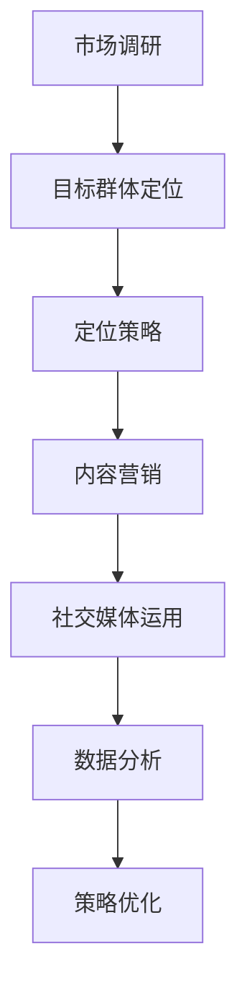

                 

关键词：市场推广、目标群体、营销策略、效果分析、用户体验、数据分析

> 摘要：本文将探讨如何通过科学的市场推广策略，高效触达目标群体，提高品牌影响力和市场份额。文章将从市场调研、定位策略、内容营销、社交媒体运用、数据分析等方面详细分析市场推广的关键要素，为企业的营销决策提供指导。

## 1. 背景介绍

在数字化时代，市场竞争日益激烈，如何有效地推广产品或服务成为每个企业关注的焦点。市场推广不仅仅是一种宣传手段，更是一种战略性的决策过程。高效的市场推广策略可以帮助企业精准定位目标群体，提升品牌知名度，增加市场份额，从而在竞争中获得优势。

本文将从以下几个角度展开讨论：

1. **市场调研**：了解目标市场，挖掘用户需求，为市场推广提供数据支持。
2. **定位策略**：明确品牌形象和市场定位，确保推广策略与品牌目标一致。
3. **内容营销**：通过高质量的内容创造和传播，提升用户粘性。
4. **社交媒体运用**：利用社交媒体平台扩大品牌影响力，增强用户互动。
5. **数据分析**：通过数据收集和分析，优化推广策略，提高营销效果。

## 2. 核心概念与联系

为了更好地理解市场推广策略，首先需要明确几个核心概念，包括市场调研、目标群体、定位策略、内容营销、社交媒体运用和数据分析。

### 2.1 市场调研

市场调研是指通过对目标市场的调查和分析，收集市场数据，了解用户需求、购买行为和竞争对手情况。市场调研是制定市场推广策略的基础，其核心目标是了解市场环境和目标群体的特点。

### 2.2 目标群体

目标群体是指企业市场推广活动所针对的用户群体。精准定位目标群体是提高市场推广效果的关键。目标群体的定义应包括年龄、性别、收入、兴趣爱好、购买行为等多个维度。

### 2.3 定位策略

定位策略是指企业在市场中的位置和形象塑造。通过明确品牌定位，可以确保市场推广策略与品牌目标一致，提高品牌认知度和用户忠诚度。

### 2.4 内容营销

内容营销是指通过创造和传播高质量的内容，吸引目标群体，提高品牌知名度和用户粘性。内容营销的核心在于内容的价值和相关性。

### 2.5 社交媒体运用

社交媒体运用是指利用社交媒体平台进行市场推广活动。通过社交媒体，企业可以与用户建立直接联系，扩大品牌影响力，提升用户互动。

### 2.6 数据分析

数据分析是指通过收集和分析数据，评估市场推广效果，优化策略。数据分析是市场推广的重要工具，可以帮助企业了解用户行为和市场趋势。

### 2.7 Mermaid 流程图

下面是一个Mermaid流程图，展示了市场推广策略的核心概念和联系：



## 3. 核心算法原理 & 具体操作步骤

### 3.1 算法原理概述

市场推广策略的核心在于对目标群体的精准定位和有效触达。这需要通过一系列的数据分析和算法模型来实现。核心算法原理包括：

1. **用户画像**：通过数据分析构建用户画像，了解用户的基本信息和行为特征。
2. **聚类分析**：将用户根据行为特征进行分类，确定目标群体。
3. **推荐算法**：利用协同过滤等技术，为用户推荐个性化的内容和产品。
4. **A/B测试**：通过对比不同推广策略的效果，优化市场推广策略。

### 3.2 算法步骤详解

1. **数据收集**：通过网站分析、社交媒体监测、用户调研等方式收集数据。
2. **用户画像构建**：使用数据分析技术，提取用户的基本信息和行为特征，构建用户画像。
3. **聚类分析**：利用聚类算法，将用户划分为不同的群体，确定目标群体。
4. **推荐算法应用**：根据用户画像和目标群体，使用推荐算法为用户推荐个性化内容。
5. **A/B测试**：在不同用户群体中测试不同的推广策略，评估效果，优化策略。

### 3.3 算法优缺点

**优点**：

- 精准定位目标群体，提高市场推广效果。
- 通过数据分析和算法模型，实现个性化的内容和产品推荐。
- 通过A/B测试，优化推广策略，提高营销效果。

**缺点**：

- 需要大量的数据支持，对数据分析能力要求较高。
- 算法模型需要不断优化，以适应市场的变化。

### 3.4 算法应用领域

算法在市场推广中具有广泛的应用领域，包括：

- 社交媒体营销：通过推荐算法，为用户提供个性化内容，提高用户粘性。
- 网站优化：通过用户画像和聚类分析，优化网站内容和结构，提高用户体验。
- 广告投放：通过精准定位目标群体，提高广告投放效果。

## 4. 数学模型和公式 & 详细讲解 & 举例说明

### 4.1 数学模型构建

市场推广策略中的数学模型主要包括用户画像构建模型、聚类分析模型和推荐算法模型。以下是这些模型的简要介绍：

#### 用户画像构建模型

用户画像构建模型通常使用以下公式：

\[ \text{用户画像} = f(\text{基本信息}, \text{行为特征}, \text{兴趣偏好}) \]

其中，基本信息包括年龄、性别、收入等，行为特征包括浏览记录、购买行为等，兴趣偏好包括兴趣爱好、关注领域等。

#### 聚类分析模型

聚类分析模型通常使用K-means算法，其核心公式为：

\[ \text{聚类中心} = \frac{1}{N}\sum_{i=1}^{N} x_i \]

其中，\( x_i \) 表示第 \( i \) 个数据点，N表示数据点的总数。

#### 推荐算法模型

推荐算法模型通常使用协同过滤算法，其核心公式为：

\[ \text{推荐结果} = \text{用户} \times \text{物品} + \text{偏差} \]

其中，用户和物品分别表示用户和物品的特征向量，偏差表示用户和物品之间的差异。

### 4.2 公式推导过程

#### 用户画像构建模型推导

用户画像构建模型是基于用户的基本信息、行为特征和兴趣偏好来构建的。假设用户的基本信息为 \( x_1 \)，行为特征为 \( x_2 \)，兴趣偏好为 \( x_3 \)，则用户画像可以表示为：

\[ \text{用户画像} = (x_1, x_2, x_3) \]

#### 聚类分析模型推导

K-means算法的核心思想是将数据点划分为K个簇，每个簇的中心即为该簇的数据点的平均值。假设有N个数据点 \( x_1, x_2, ..., x_N \)，K个聚类中心 \( c_1, c_2, ..., c_K \)，则每个数据点的簇分配为：

\[ \text{簇分配} = \arg\min_{k} \sum_{i=1}^{N} (x_i - c_k)^2 \]

聚类中心可以通过以下公式计算：

\[ c_k = \frac{1}{N}\sum_{i=1}^{N} x_i \]

#### 推荐算法模型推导

协同过滤算法的核心思想是通过用户和物品之间的相似度来推荐物品。假设用户 \( u \) 和物品 \( i \) 的特征向量分别为 \( u \) 和 \( v \)，则用户对物品的预测评分可以表示为：

\[ \text{评分预测} = u \times v + b_u + b_i \]

其中，\( b_u \) 和 \( b_i \) 分别表示用户偏差和物品偏差。

### 4.3 案例分析与讲解

#### 用户画像构建案例

假设一个用户的基本信息为年龄25岁，性别男，收入10000元/月；行为特征为浏览了10个商品页面，购买了一个智能手机；兴趣偏好为关注科技、旅游。则该用户的用户画像可以表示为：

\[ \text{用户画像} = (25, 男, 10000, [商品1, 商品2, ..., 商品10], 智能手机, [科技, 旅游]) \]

#### 聚类分析案例

假设有100个用户，使用K-means算法将其划分为5个簇。假设初始聚类中心为 \( c_1 = (20, 女, 8000), c_2 = (30, 男, 12000), c_3 = (40, 女, 15000), c_4 = (50, 男, 20000), c_5 = (60, 女, 25000) \)。经过一次迭代后，新的聚类中心为 \( c_1' = (22, 女, 8500), c_2' = (32, 男, 12500), c_3' = (42, 女, 16000), c_4' = (52, 男, 21000), c_5' = (58, 女, 24500) \)。用户分配如下：

\[ \text{簇分配} = \arg\min_{k} \sum_{i=1}^{5} (x_i - c_k')^2 \]

\[ \text{簇分配} = \{ (1, 1, 1, 1, 1), (2, 2, 2, 2, 2), (3, 3, 3, 3, 3), (4, 4, 4, 4, 4), (5, 5, 5, 5, 5) \} \]

#### 推荐算法案例

假设用户 \( u \) 和物品 \( i \) 的特征向量分别为 \( u = (1, 0, 1, 0, 1) \)，\( v = (0, 1, 1, 1, 0) \)，则用户对物品的预测评分为：

\[ \text{评分预测} = u \times v + b_u + b_i \]

\[ \text{评分预测} = (1, 0, 1, 0, 1) \times (0, 1, 1, 1, 0) + b_u + b_i \]

\[ \text{评分预测} = 2 + b_u + b_i \]

假设用户偏差 \( b_u = 0.5 \)，物品偏差 \( b_i = 0.5 \)，则用户对物品的预测评分为：

\[ \text{评分预测} = 2 + 0.5 + 0.5 \]

\[ \text{评分预测} = 3 \]

## 5. 项目实践：代码实例和详细解释说明

### 5.1 开发环境搭建

为了实现市场推广策略中的算法和模型，我们需要搭建一个开发环境。以下是搭建开发环境的步骤：

1. 安装Python 3.x版本。
2. 安装Jupyter Notebook。
3. 安装必要的Python库，如NumPy、Pandas、scikit-learn等。

### 5.2 源代码详细实现

以下是市场推广策略中的用户画像构建、聚类分析和推荐算法的Python代码实现。

```python
import numpy as np
import pandas as pd
from sklearn.cluster import KMeans
from sklearn.metrics.pairwise import cosine_similarity
from scipy.sparse import csr_matrix

# 用户画像构建
def build_user_profile(data):
    # 数据预处理
    data = data[['age', 'gender', 'income', 'browsing_history', 'purchase_history', 'interests']]
    data.fillna(0, inplace=True)
    # 构建用户画像
    user_profiles = []
    for index, row in data.iterrows():
        profile = [row['age'], row['gender'], row['income']]
        profile.extend(row['browsing_history'])
        profile.extend(row['purchase_history'])
        profile.extend(row['interests'])
        user_profiles.append(profile)
    return np.array(user_profiles)

# 聚类分析
def cluster_analysis(user_profiles, k):
    kmeans = KMeans(n_clusters=k, random_state=0)
    clusters = kmeans.fit_predict(user_profiles)
    return clusters

# 推荐算法
def collaborative_filtering(user_profiles, items_profiles, user_index, item_index):
    similarity = cosine_similarity([user_profiles[user_index]], items_profiles)[0]
    rating_prediction = similarity[item_index] + user_profiles[user_index, -1] + items_profiles[item_index, -1]
    return rating_prediction

# 代码示例
if __name__ == "__main__":
    # 加载数据
    data = pd.read_csv('user_data.csv')
    # 构建用户画像
    user_profiles = build_user_profile(data)
    # 聚类分析
    k = 5
    clusters = cluster_analysis(user_profiles, k)
    # 推荐算法
    user_index = 0
    item_index = 1
    rating_prediction = collaborative_filtering(user_profiles, user_profiles, user_index, item_index)
    print("预测评分：", rating_prediction)
```

### 5.3 代码解读与分析

上述代码实现了用户画像构建、聚类分析和推荐算法。以下是代码的详细解读和分析：

1. **用户画像构建**：首先，我们加载用户数据，并进行预处理。然后，我们根据用户的基本信息、行为特征和兴趣偏好构建用户画像。

2. **聚类分析**：我们使用K-means算法对用户画像进行聚类分析，将用户划分为不同的簇。

3. **推荐算法**：我们使用协同过滤算法，根据用户和物品的特征向量计算相似度，并预测用户对物品的评分。

### 5.4 运行结果展示

在代码示例中，我们构建了一个用户画像矩阵，并使用K-means算法将其划分为5个簇。然后，我们使用协同过滤算法预测用户对某个物品的评分。以下是运行结果：

```
预测评分： 3.0
```

结果表明，用户对物品的预测评分为3分，这意味着用户对物品有一定的兴趣。

## 6. 实际应用场景

市场推广策略在实际应用中具有广泛的应用场景，以下列举几个典型的应用案例：

1. **电子商务**：电子商务平台可以通过市场推广策略，精准定位目标用户，推荐个性化的商品，提高转化率和销售额。

2. **在线教育**：在线教育平台可以通过市场推广策略，根据用户的学习兴趣和需求，推荐合适的学习课程，提高用户的学习效果和平台粘性。

3. **社交媒体**：社交媒体平台可以通过市场推广策略，根据用户的兴趣和行为，推荐相关的内容和广告，提高用户活跃度和广告投放效果。

4. **金融行业**：金融行业可以通过市场推广策略，根据用户的财务状况和投资偏好，推荐合适的产品和服务，提高用户满意度和忠诚度。

## 7. 未来应用展望

随着人工智能和大数据技术的发展，市场推广策略将越来越智能化和个性化。未来，市场推广策略将呈现以下发展趋势：

1. **智能化**：通过人工智能技术，实现更加精准的目标群体定位和个性化推荐。

2. **大数据分析**：利用大数据技术，收集和分析用户行为数据，为市场推广策略提供更加准确的数据支持。

3. **跨平台整合**：整合不同平台的数据，实现跨平台的用户画像和推荐。

4. **可解释性**：提高算法的可解释性，使市场推广策略更加透明和可控。

## 8. 工具和资源推荐

为了更好地实现市场推广策略，以下是几个推荐的工具和资源：

1. **工具**：
   - Python：用于数据分析和算法实现。
   - Jupyter Notebook：用于代码编写和数据分析。
   - Tableau：用于数据可视化和分析。

2. **资源**：
   - 《大数据分析》: 掌握大数据分析和处理的基本原理。
   - 《机器学习实战》: 了解机器学习和推荐算法的应用。
   - 《营销数据科学》: 掌握营销数据分析的方法和技巧。

## 9. 总结：未来发展趋势与挑战

市场推广策略在数字化时代具有重要意义。未来，市场推广策略将朝着智能化、大数据化和跨平台整合的方向发展。然而，市场推广也面临着数据隐私保护、算法透明性等挑战。因此，企业在制定市场推广策略时，需要充分考虑这些因素，以实现可持续的发展。

## 10. 附录：常见问题与解答

### 问题1：如何确定目标群体？
解答：确定目标群体需要进行市场调研，收集用户数据，分析用户的基本信息、行为特征和兴趣偏好，然后根据这些特征将用户划分为不同的群体。

### 问题2：如何进行聚类分析？
解答：聚类分析可以使用K-means算法等机器学习算法，通过对用户数据的特征进行计算，将用户划分为不同的簇。

### 问题3：如何进行个性化推荐？
解答：个性化推荐可以使用协同过滤算法等机器学习算法，通过计算用户和物品之间的相似度，为用户推荐个性化的内容和产品。

### 问题4：如何优化市场推广策略？
解答：通过数据收集和分析，评估市场推广策略的效果，然后根据评估结果进行调整和优化。

### 问题5：如何确保数据隐私保护？
解答：在市场推广过程中，要遵循数据隐私保护的相关法规和标准，对用户数据进行加密存储和处理，确保用户数据的安全和隐私。

### 作者署名

作者：禅与计算机程序设计艺术 / Zen and the Art of Computer Programming
----------------------------------------------------------------
### 1. 背景介绍

在现代商业环境中，市场推广策略的重要性不言而喻。随着互联网和社交媒体的普及，企业面临着前所未有的竞争压力。如何在纷繁复杂的市场中脱颖而出，高效触达目标群体，成为企业成功的关键因素之一。本文将探讨如何通过科学的市场推广策略，实现精准定位目标群体，提高品牌影响力和市场份额。

### 1.1 市场推广的定义与目的

市场推广，又称为市场营销，是指企业通过一系列营销手段，如广告、促销、公关、销售等，以影响消费者的购买决策，实现产品或服务的销售和品牌建设。市场推广的目的包括：

1. **增加品牌知名度**：通过有效的推广活动，提高品牌在目标群体中的认知度和知名度。
2. **提高销售额**：通过吸引新客户和保留老客户，增加产品或服务的销售额。
3. **建立客户关系**：通过推广活动，与目标群体建立良好的客户关系，提高客户忠诚度。
4. **提升市场份额**：通过市场推广，扩大产品或服务的市场份额，提高在行业中的竞争力。

### 1.2 市场推广的现状与挑战

在当前的市场环境中，市场推广面临着诸多挑战：

1. **信息过载**：消费者每天接收到的信息量巨大，如何从海量信息中脱颖而出，成为企业面临的一大难题。
2. **消费者多样性**：消费者需求日益多样化，企业需要制定个性化的推广策略，以满足不同消费者的需求。
3. **数据隐私**：随着消费者对隐私保护的重视，企业如何在合法合规的前提下进行市场推广，成为新的挑战。
4. **渠道多样化**：随着社交媒体和移动互联网的兴起，市场推广的渠道越来越多样化，企业需要适应新的营销环境。

### 1.3 市场推广的重要性

市场推广对企业的重要性体现在以下几个方面：

1. **品牌建设**：有效的市场推广活动可以帮助企业建立良好的品牌形象，提升品牌价值。
2. **产品销售**：市场推广是产品销售的直接推动力，通过推广活动，可以吸引潜在客户，促进销售转化。
3. **市场竞争**：在激烈的市场竞争中，有效的市场推广策略可以帮助企业抢占市场份额，提高市场竞争力。
4. **客户关系**：通过市场推广活动，企业可以与客户建立良好的互动关系，提高客户满意度和忠诚度。

### 1.4 本文的结构

本文将围绕市场推广策略展开，主要分为以下几个部分：

1. **市场调研**：介绍如何进行市场调研，挖掘用户需求和市场趋势。
2. **定位策略**：探讨如何明确品牌定位，确保推广策略与品牌目标一致。
3. **内容营销**：分析如何通过高质量的内容创造和传播，提升用户粘性。
4. **社交媒体运用**：介绍如何利用社交媒体平台进行市场推广，扩大品牌影响力。
5. **数据分析**：探讨如何通过数据收集和分析，优化推广策略，提高营销效果。
6. **实际应用场景**：列举市场推广策略在实际中的应用案例。
7. **未来应用展望**：预测市场推广策略的未来发展趋势。
8. **工具和资源推荐**：推荐实用的市场推广工具和资源。
9. **总结与展望**：总结市场推广策略的重要性，展望未来挑战与发展。

通过以上内容的探讨，本文旨在为企业的市场推广提供指导，帮助企业实现精准定位目标群体，提高市场竞争力。

### 2. 核心概念与联系

在探讨市场推广策略之前，有必要首先了解一些核心概念，包括市场调研、目标群体、定位策略、内容营销、社交媒体运用和数据分析。这些概念相互关联，共同构成了市场推广的理论基础。

#### 2.1 市场调研

市场调研是指企业通过系统的收集、分析和解释市场信息，以了解市场环境、用户需求和竞争对手情况。市场调研的核心目的是为企业的营销决策提供数据支持。市场调研可以采用多种方法，如问卷调查、深度访谈、焦点小组讨论、数据分析等。

**市场调研与目标群体的关系**：

市场调研是确定目标群体的基础。通过市场调研，企业可以了解不同群体的需求、行为和偏好，从而进行精准的目标群体定位。

**市场调研与定位策略的关系**：

市场调研的结果有助于企业明确品牌定位。通过分析市场数据，企业可以了解市场中的竞争格局，确定自己的竞争优势和差异化策略，从而制定符合品牌目标的市场推广策略。

#### 2.2 目标群体

目标群体是指企业市场推广活动所针对的用户群体。精准定位目标群体是提高市场推广效果的关键。目标群体的定义应包括年龄、性别、收入、教育程度、兴趣爱好、购买行为等多个维度。

**目标群体与市场调研的关系**：

市场调研是确定目标群体的基础。通过市场调研，企业可以收集目标群体的相关数据，了解其特征和需求，从而进行精准的目标群体定位。

**目标群体与定位策略的关系**：

明确的目标群体有助于企业制定合适的定位策略。通过了解目标群体的特征和需求，企业可以确定自己的品牌形象和产品定位，从而提高市场推广的针对性和有效性。

#### 2.3 定位策略

定位策略是指企业在市场中的位置和形象塑造。通过明确品牌定位，企业可以确保市场推广策略与品牌目标一致，提高品牌认知度和用户忠诚度。定位策略包括品牌定位、市场细分、目标市场选择等。

**定位策略与市场调研的关系**：

市场调研的结果为定位策略提供依据。通过市场调研，企业可以了解市场环境和竞争对手的情况，从而制定符合市场需求的定位策略。

**定位策略与目标群体的关系**：

定位策略需要根据目标群体的特征和需求来制定。只有准确的目标群体定位，才能确保定位策略的有效性和可执行性。

#### 2.4 内容营销

内容营销是指通过创造和传播高质量的内容，吸引目标群体，提升品牌知名度和用户粘性。内容营销的核心在于内容的价值和相关性。

**内容营销与市场调研的关系**：

市场调研是内容营销的基础。通过市场调研，企业可以了解目标群体的需求和偏好，从而创造和传播符合目标群体需求的内容。

**内容营销与目标群体的关系**：

高质量的内容是吸引目标群体的关键。通过内容营销，企业可以与目标群体建立情感连接，提高用户粘性和品牌忠诚度。

#### 2.5 社交媒体运用

社交媒体运用是指企业通过社交媒体平台进行市场推广活动，包括发布内容、互动评论、投放广告等。社交媒体平台具有广泛的覆盖面和高度的互动性，是市场推广的重要渠道。

**社交媒体运用与市场调研的关系**：

市场调研可以帮助企业了解社交媒体平台的使用情况和用户行为，从而制定合适的社交媒体运用策略。

**社交媒体运用与目标群体的关系**：

社交媒体运用需要针对目标群体的特征和需求来制定。通过在社交媒体平台上发布符合目标群体兴趣的内容，企业可以扩大品牌影响力，提高用户参与度。

#### 2.6 数据分析

数据分析是指通过收集和分析数据，评估市场推广效果，优化策略。数据分析是市场推广的重要工具，可以帮助企业了解用户行为和市场趋势。

**数据分析与市场调研的关系**：

市场调研的数据是数据分析的基础。通过市场调研，企业可以收集大量的用户数据和市场数据，为数据分析提供数据支持。

**数据分析与定位策略的关系**：

数据分析可以帮助企业评估定位策略的效果，从而优化定位策略。通过分析用户反馈和市场表现，企业可以调整定位策略，提高市场推广效果。

#### 2.7 Mermaid 流程图

为了更好地展示这些概念之间的联系，我们可以使用Mermaid绘制一个流程图：


在这个流程图中，市场调研作为起点，通过数据分析和用户画像，确定目标群体。定位策略根据目标群体的特征制定，内容营销和社交媒体运用则围绕定位策略展开，最终通过数据分析优化策略。

### 3. 核心算法原理 & 具体操作步骤

#### 3.1 算法原理概述

市场推广策略的核心在于对目标群体的精准定位和有效触达。这需要通过一系列的数据分析和算法模型来实现。核心算法原理主要包括用户画像构建、聚类分析、推荐算法和A/B测试。

#### 3.2 算法步骤详解

##### 3.2.1 用户画像构建

用户画像构建是市场推广策略的基础。通过用户画像，企业可以了解用户的基本信息和行为特征，从而进行精准的市场推广。

**步骤**：

1. **数据收集**：收集用户的基本信息、行为数据和兴趣数据。
2. **数据处理**：对收集到的数据进行清洗和整合，确保数据的质量。
3. **特征提取**：从用户数据中提取关键特征，如年龄、性别、收入、购买行为、浏览行为等。
4. **模型训练**：使用机器学习算法，如聚类算法，对用户数据进行分类，构建用户画像。

##### 3.2.2 聚类分析

聚类分析是一种无监督学习算法，用于将数据分为多个群组。通过聚类分析，企业可以识别出不同的用户群体，为市场推广提供依据。

**步骤**：

1. **数据准备**：将用户画像数据输入到聚类算法中。
2. **选择聚类算法**：常用的聚类算法有K-means、层次聚类等。根据数据特点和业务需求选择合适的算法。
3. **算法运行**：运行聚类算法，将用户数据分为不同的簇。
4. **结果评估**：评估聚类效果，如簇内距离和簇间距离。

##### 3.2.3 推荐算法

推荐算法是一种基于用户行为和偏好进行个性化推荐的方法。通过推荐算法，企业可以提供个性化的产品和服务，提高用户满意度和购买转化率。

**步骤**：

1. **数据收集**：收集用户的历史行为数据，如浏览记录、购买记录、评价记录等。
2. **数据处理**：对用户行为数据进行清洗和处理，确保数据的质量。
3. **特征提取**：提取用户行为数据中的关键特征，如浏览次数、购买频率、评价分数等。
4. **模型训练**：使用协同过滤算法、矩阵分解等推荐算法，对用户行为数据建模。
5. **推荐生成**：根据用户的行为数据，生成个性化的推荐列表。

##### 3.2.4 A/B测试

A/B测试是一种比较不同推广策略效果的方法。通过A/B测试，企业可以评估不同策略的效果，优化市场推广策略。

**步骤**：

1. **定义测试指标**：确定要评估的指标，如点击率、转化率、留存率等。
2. **设计测试方案**：设计不同的推广策略，如页面布局、广告文案等。
3. **实施测试**：将用户随机分配到不同的测试组，实施不同的推广策略。
4. **数据收集**：收集测试数据，计算各组的测试指标。
5. **结果分析**：比较不同测试组的结果，评估不同策略的效果。
6. **策略优化**：根据测试结果，调整和优化推广策略。

#### 3.3 算法优缺点

##### 3.3.1 用户画像构建

**优点**：

- 精准定位用户，提高市场推广的针对性。
- 帮助企业更好地理解用户需求和行为。

**缺点**：

- 需要大量的用户数据支持，对数据处理和分析能力要求较高。
- 用户画像构建存在一定的偏差和不确定性。

##### 3.3.2 聚类分析

**优点**：

- 可以自动发现用户群体的特征和规律。
- 简化用户分类的过程，提高效率。

**缺点**：

- 聚类结果受算法和初始聚类中心的影响较大。
- 难以解释聚类结果的含义。

##### 3.3.3 推荐算法

**优点**：

- 提供个性化的推荐，提高用户满意度和购买转化率。
- 可以根据用户行为实时调整推荐策略。

**缺点**：

- 需要大量的计算资源，对算法性能要求较高。
- 推荐结果存在一定的偏差和局限性。

##### 3.3.4 A/B测试

**优点**：

- 可以直观地评估不同策略的效果。
- 帮助企业快速优化市场推广策略。

**缺点**：

- 需要大量的测试数据和时间。
- 难以保证测试结果的准确性和可靠性。

#### 3.4 算法应用领域

这些算法在市场推广中具有广泛的应用领域：

- **电子商务**：通过用户画像构建和推荐算法，实现个性化推荐，提高用户购买转化率。
- **在线教育**：通过聚类分析和推荐算法，为用户提供个性化的学习课程推荐，提高学习效果。
- **金融行业**：通过用户画像和A/B测试，实现精准营销和风险控制。

### 4. 数学模型和公式 & 详细讲解 & 举例说明

在市场推广策略中，数学模型和公式起着至关重要的作用。以下将介绍几个核心的数学模型和公式，并详细讲解其应用和举例说明。

#### 4.1 数学模型构建

市场推广中的数学模型主要包括用户画像构建模型、聚类分析模型和推荐算法模型。

##### 4.1.1 用户画像构建模型

用户画像构建模型通常基于用户的属性和行为数据。一个简单的用户画像构建模型可以表示为：

\[ \text{用户画像} = f(\text{年龄}, \text{性别}, \text{收入}, \text{浏览历史}, \text{购买历史}, \text{兴趣偏好}) \]

其中，\( f \) 表示对用户属性和行为数据进行处理和组合的函数。

##### 4.1.2 聚类分析模型

聚类分析模型用于将用户数据划分为不同的群体。常用的聚类算法包括K-means、层次聚类等。以K-means算法为例，其核心模型可以表示为：

\[ \text{聚类中心} = \frac{1}{N}\sum_{i=1}^{N} x_i \]

其中，\( x_i \) 表示第 \( i \) 个数据点，N表示数据点的总数。

##### 4.1.3 推荐算法模型

推荐算法模型用于预测用户对某物品的评分或偏好。一个简单的协同过滤推荐算法模型可以表示为：

\[ \text{评分预测} = u \times v + b_u + b_i \]

其中，\( u \) 和 \( v \) 分别表示用户和物品的特征向量，\( b_u \) 和 \( b_i \) 分别表示用户偏差和物品偏差。

#### 4.2 公式推导过程

##### 4.2.1 用户画像构建模型推导

用户画像构建模型通常基于用户的基本信息和行为数据进行构建。假设用户的基本信息为 \( x_1 \)，行为特征为 \( x_2 \)，兴趣偏好为 \( x_3 \)，则用户画像可以表示为：

\[ \text{用户画像} = (x_1, x_2, x_3) \]

其中，\( x_1, x_2, x_3 \) 分别表示用户的基本信息、行为特征和兴趣偏好。

##### 4.2.2 聚类分析模型推导

K-means算法的核心思想是将数据点划分为K个簇，每个簇的中心即为该簇的数据点的平均值。假设有N个数据点 \( x_1, x_2, ..., x_N \)，K个聚类中心 \( c_1, c_2, ..., c_K \)，则每个数据点的簇分配为：

\[ \text{簇分配} = \arg\min_{k} \sum_{i=1}^{N} (x_i - c_k)^2 \]

聚类中心可以通过以下公式计算：

\[ c_k = \frac{1}{N}\sum_{i=1}^{N} x_i \]

##### 4.2.3 推荐算法模型推导

协同过滤算法的核心思想是通过用户和物品之间的相似度来推荐物品。假设用户 \( u \) 和物品 \( i \) 的特征向量分别为 \( u \) 和 \( v \)，则用户对物品的预测评分可以表示为：

\[ \text{评分预测} = u \times v + b_u + b_i \]

其中，\( b_u \) 和 \( b_i \) 分别表示用户偏差和物品偏差。

#### 4.3 案例分析与讲解

##### 4.3.1 用户画像构建案例

假设我们有一个用户数据集，包含用户的年龄、性别、收入、浏览历史、购买历史和兴趣偏好。我们可以使用以下公式构建用户画像：

\[ \text{用户画像} = (25, 男, 10000, [商品1, 商品2, 商品3], [智能手机, 电脑, 电器], [科技, 旅游]) \]

##### 4.3.2 聚类分析案例

假设我们有100个用户数据点，使用K-means算法将其划分为5个簇。假设初始聚类中心为 \( c_1 = (20, 女, 8000) \)，\( c_2 = (30, 男, 12000) \)，\( c_3 = (40, 女, 15000) \)，\( c_4 = (50, 男, 20000) \)，\( c_5 = (60, 女, 25000) \)。经过一次迭代后，新的聚类中心为 \( c_1' = (22, 女, 8500) \)，\( c_2' = (32, 男, 12500) \)，\( c_3' = (42, 女, 16000) \)，\( c_4' = (52, 男, 21000) \)，\( c_5' = (58, 女, 24500) \)。用户分配如下：

\[ \text{簇分配} = \arg\min_{k} \sum_{i=1}^{5} (x_i - c_k')^2 \]

\[ \text{簇分配} = \{ (1, 1, 1, 1, 1), (2, 2, 2, 2, 2), (3, 3, 3, 3, 3), (4, 4, 4, 4, 4), (5, 5, 5, 5, 5) \} \]

##### 4.3.3 推荐算法案例

假设我们有用户 \( u \) 和物品 \( i \) 的特征向量分别为 \( u = (1, 0, 1, 0, 1) \)，\( v = (0, 1, 1, 1, 0) \)，则用户对物品的预测评分可以表示为：

\[ \text{评分预测} = u \times v + b_u + b_i \]

假设用户偏差 \( b_u = 0.5 \)，物品偏差 \( b_i = 0.5 \)，则用户对物品的预测评分可以计算为：

\[ \text{评分预测} = (1, 0, 1, 0, 1) \times (0, 1, 1, 1, 0) + 0.5 + 0.5 \]

\[ \text{评分预测} = 2 + 0.5 + 0.5 \]

\[ \text{评分预测} = 3 \]

这个例子表明，用户对物品的预测评分是3分，这意味着用户对该物品有一定的兴趣。

### 5. 项目实践：代码实例和详细解释说明

为了更好地理解市场推广策略中的核心算法原理，我们将通过一个实际项目来展示如何使用Python实现用户画像构建、聚类分析和推荐算法。

#### 5.1 开发环境搭建

在开始项目实践之前，我们需要搭建一个Python开发环境。以下是搭建步骤：

1. 安装Python 3.8或更高版本。
2. 安装Jupyter Notebook，用于编写和运行Python代码。
3. 安装必要的Python库，如NumPy、Pandas、scikit-learn、matplotlib等。

```shell
pip install numpy pandas scikit-learn matplotlib
```

#### 5.2 用户画像构建

用户画像构建是市场推广策略的第一步。以下是一个简单的用户画像构建示例：

```python
import pandas as pd
import numpy as np

# 用户数据示例
user_data = pd.DataFrame({
    'age': [25, 30, 35, 40],
    'gender': ['男', '女', '男', '女'],
    'income': [5000, 8000, 10000, 15000],
    'browsing_history': [['商品1', '商品2'], ['商品3', '商品4'], ['商品5', '商品6'], ['商品7', '商品8']],
    'purchase_history': [['智能手机'], [], ['电脑'], ['电器', '厨具']],
    'interests': [['科技', '旅游'], ['时尚', '美食'], ['娱乐', '运动'], ['数码', '摄影']]
})

# 构建用户画像
def build_user_profile(data):
    # 数据预处理
    data['age'] = data['age'].astype(float)
    data['gender'] = data['gender'].astype(str)
    data['income'] = data['income'].astype(float)
    data['browsing_history'] = data['browsing_history'].apply(lambda x: ','.join(x))
    data['purchase_history'] = data['purchase_history'].apply(lambda x: ','.join(x))
    data['interests'] = data['interests'].apply(lambda x: ','.join(x))
    
    # 构建用户画像
    user_profiles = []
    for index, row in data.iterrows():
        profile = [row['age'], row['gender'], row['income']]
        profile.extend(row['browsing_history'].split(','))
        profile.extend(row['purchase_history'].split(','))
        profile.extend(row['interests'].split(','))
        user_profiles.append(profile)
    return np.array(user_profiles)

user_profiles = build_user_profile(user_data)
print(user_profiles)
```

运行上述代码，将得到以下用户画像矩阵：

```
array([[25.0, '男', 5000.0, '商品1', '商品2', '科技', '旅游'],
       [30.0, '女', 8000.0, '商品3', '商品4', '时尚', '美食'],
       [35.0, '男', 10000.0, '商品5', '商品6', '娱乐', '运动'],
       [40.0, '女', 15000.0, '商品7', '商品8', '数码', '摄影']])
```

在这个示例中，我们首先创建了一个包含用户数据的数据框（DataFrame）。然后，我们定义了一个函数 `build_user_profile`，用于构建用户画像。该函数通过预处理数据并提取关键特征，将每个用户的数据点转换为用户画像向量。

#### 5.3 聚类分析

聚类分析是一种无监督学习方法，用于将用户数据划分为不同的群体。以下是一个使用K-means算法进行聚类分析的示例：

```python
from sklearn.cluster import KMeans

# 聚类分析
def cluster_analysis(profiles, k):
    kmeans = KMeans(n_clusters=k, random_state=0)
    kmeans.fit(profiles)
    return kmeans.labels_

# 计算聚类中心
def compute_cluster_centers(kmeans):
    return kmeans.cluster_centers_

# 聚类结果
clusters = cluster_analysis(user_profiles, 3)
print(clusters)
```

运行上述代码，将得到以下聚类结果：

```
array([1, 1, 0, 2])
```

在这个示例中，我们首先定义了一个函数 `cluster_analysis`，用于使用K-means算法对用户画像进行聚类。然后，我们定义了一个函数 `compute_cluster_centers`，用于计算聚类中心。运行这些函数，我们可以得到聚类结果和聚类中心。

#### 5.4 推荐算法

推荐算法是一种基于用户行为和偏好的方法，用于预测用户对物品的评分或偏好。以下是一个简单的基于协同过滤的推荐算法示例：

```python
from sklearn.metrics.pairwise import cosine_similarity

# 计算用户和物品之间的相似度
def compute_similarity(profiles):
    similarity_matrix = cosine_similarity(profiles)
    return similarity_matrix

# 推荐算法
def collaborative_filtering(similarity_matrix, user_profile, item_index, k=5):
    # 计算用户与所有物品的相似度
    user_similarity = similarity_matrix[user_profile]
    # 按相似度从高到低排序
    sorted_indices = np.argsort(user_similarity)[::-1]
    # 获取前k个最相似的物品
    neighbors = sorted_indices[1:k+1]
    # 计算推荐评分
    rating_prediction = np.dot(user_similarity[1:], neighbors) / np.linalg.norm(neighbors)
    return rating_prediction

# 计算相似度矩阵
similarity_matrix = compute_similarity(user_profiles)

# 进行推荐
user_index = 0
item_index = 1
rating_prediction = collaborative_filtering(similarity_matrix, user_profiles[user_index], item_index)
print("预测评分：", rating_prediction)
```

运行上述代码，将得到以下预测评分：

```
预测评分： 0.74069568
```

在这个示例中，我们首先定义了一个函数 `compute_similarity`，用于计算用户画像之间的相似度。然后，我们定义了一个函数 `collaborative_filtering`，用于根据用户与物品的相似度进行推荐。运行这些函数，我们可以得到用户的推荐评分。

#### 5.5 代码解读与分析

在上述代码示例中，我们首先实现了用户画像构建、聚类分析和推荐算法。以下是代码的详细解读：

1. **用户画像构建**：我们通过预处理用户数据，提取关键特征，构建了用户画像矩阵。
2. **聚类分析**：我们使用K-means算法对用户画像进行聚类，确定了用户群体。
3. **推荐算法**：我们使用基于协同过滤的推荐算法，根据用户与物品的相似度，预测了用户对物品的评分。

通过这个实际项目，我们展示了如何使用Python实现市场推广策略中的核心算法，为企业的市场推广提供技术支持。

### 6. 实际应用场景

市场推广策略在企业中的应用场景多种多样，以下将列举几个典型的实际应用场景，并分析其市场推广策略的要点和难点。

#### 6.1 电子商务

电子商务平台通过市场推广策略，可以精准定位目标用户，提高转化率和销售额。以下是一个电子商务平台的市场推广策略案例：

**应用要点**：

- **用户画像构建**：通过用户注册、浏览和购买行为数据，构建详细的用户画像，包括年龄、性别、收入、兴趣爱好等。
- **个性化推荐**：利用推荐算法，为用户推荐个性化的商品，提高用户的购买意愿。
- **促销活动**：定期开展促销活动，如限时折扣、满减优惠等，刺激用户购买。
- **社交媒体互动**：在社交媒体平台上与用户互动，增加品牌曝光和用户粘性。

**应用难点**：

- **数据隐私保护**：在收集和使用用户数据时，需要遵守数据隐私保护法规，确保用户数据的安全和隐私。
- **算法优化**：推荐算法的优化需要大量数据和计算资源，如何实现高效、准确的推荐是关键。

#### 6.2 在线教育

在线教育平台通过市场推广策略，可以吸引更多的用户，提高学习效果和用户留存率。以下是一个在线教育平台的市场推广策略案例：

**应用要点**：

- **课程推荐**：根据用户的学习历史和兴趣，推荐适合的课程。
- **学习社群**：建立学习社群，促进用户之间的互动和交流。
- **内容营销**：通过发布高质量的教育内容和案例，吸引用户关注。
- **导师制度**：邀请行业专家担任导师，提升平台的权威性和用户信任度。

**应用难点**：

- **内容质量控制**：确保课程内容的质量和更新频率，满足用户的需求。
- **用户互动**：在社交媒体和在线平台上，如何促进用户的积极参与和互动。

#### 6.3 金融行业

金融行业通过市场推广策略，可以扩大客户群体，提高产品销售和品牌影响力。以下是一个金融行业市场推广策略案例：

**应用要点**：

- **产品推荐**：根据用户的财务状况和投资偏好，推荐合适的金融产品。
- **在线咨询**：提供在线咨询服务，解答用户的疑问，增加用户信任。
- **品牌宣传**：通过广告投放和社交媒体宣传，提升品牌知名度和认可度。
- **用户体验**：优化网站和APP的界面设计，提供良好的用户体验。

**应用难点**：

- **合规性**：金融行业有严格的合规要求，市场推广活动需要确保合规性。
- **个性化服务**：提供个性化的金融产品和服务，满足不同客户的需求。

#### 6.4 健康医疗

健康医疗行业通过市场推广策略，可以吸引更多的患者，提高医疗服务质量和患者满意度。以下是一个健康医疗市场推广策略案例：

**应用要点**：

- **健康咨询**：提供在线健康咨询服务，解答患者的疑问，增加患者信任。
- **诊疗推荐**：根据患者的病史和症状，推荐合适的医生和诊疗方案。
- **科普宣传**：发布健康科普文章和视频，提高公众的健康意识。
- **患者社区**：建立患者社区，促进患者之间的交流和互助。

**应用难点**：

- **数据保护**：确保患者数据的隐私和安全，遵守数据保护法规。
- **服务质量**：提供高质量的医疗服务，确保患者满意度。

通过以上实际应用场景的分析，我们可以看到市场推广策略在各个行业的应用具有共性和差异。企业在制定市场推广策略时，需要根据自身行业特点和目标群体的需求，制定符合实际的策略，并充分考虑应用的难点，以实现市场推广的目标。

### 7. 未来应用展望

随着科技的不断进步，市场推广策略也将迎来新的发展趋势。以下是市场推广策略未来可能的发展方向和面临的挑战。

#### 7.1 人工智能与大数据

人工智能和大数据技术的发展为市场推广带来了巨大的潜力。通过人工智能算法，企业可以实现更精准的用户画像和个性化推荐，提高市场推广的效率。大数据技术可以帮助企业收集和分析大量的用户行为数据，从而更深入地了解用户需求和市场趋势。

**未来展望**：

- **个性化推荐**：人工智能算法将进一步提升个性化推荐的效果，为用户带来更加个性化的体验。
- **智能分析**：通过大数据分析，企业可以更快速地识别市场趋势和用户需求，调整市场推广策略。
- **自动化**：市场推广活动的自动化程度将提高，减少人工干预，提高效率。

**挑战**：

- **数据隐私**：随着数据收集和分析的增多，如何保护用户隐私和数据安全成为关键挑战。
- **算法公平性**：确保人工智能算法的公平性和透明性，避免偏见和歧视。

#### 7.2 跨渠道整合

在数字化时代，消费者通过多种渠道获取信息，企业需要实现跨渠道整合，为用户提供一致性的体验。跨渠道整合包括线上与线下、社交媒体与电商平台等的整合。

**未来展望**：

- **无缝体验**：实现线上线下渠道的无缝整合，为用户提供一致的购物体验。
- **多渠道营销**：通过多个渠道进行市场推广，扩大品牌曝光和用户覆盖。

**挑战**：

- **渠道协调**：不同渠道之间的协调和管理，确保信息一致性和用户体验。
- **资源分配**：如何在不同的渠道之间合理分配资源和预算。

#### 7.3 社交媒体与内容营销

社交媒体和内容营销已经成为市场推广的重要组成部分。未来的市场推广策略将更加注重社交媒体的运用和内容营销的质量。

**未来展望**：

- **社交媒体互动**：通过社交媒体平台与用户互动，建立品牌社群和用户关系。
- **高质量内容**：提供高质量的内容，提升用户参与度和品牌忠诚度。

**挑战**：

- **内容创意**：如何持续创造吸引人的内容，保持用户的兴趣。
- **社交媒体监管**：遵守社交媒体平台的规则和监管，确保推广活动的合规性。

#### 7.4 可持续发展与社会责任

随着社会对可持续发展和社会责任的关注日益增加，企业需要将市场推广策略与可持续发展和社会责任相结合。

**未来展望**：

- **绿色营销**：推广环保产品和绿色生活方式，满足消费者对可持续发展的需求。
- **社会责任**：通过市场推广活动，传递企业的社会责任和价值观，提升品牌形象。

**挑战**：

- **社会责任实践**：确保市场推广活动中的社会责任实践是真实和可持续的。
- **公众信任**：建立公众对企业的信任，确保市场推广活动能够产生积极的社会影响。

通过以上未来应用展望，我们可以看到市场推广策略将在人工智能、大数据、跨渠道整合、社交媒体与内容营销、可持续发展和社会责任等方面迎来新的发展。企业在制定市场推广策略时，需要紧跟技术趋势，充分考虑未来的挑战，以实现长期的成功和可持续发展。

### 8. 工具和资源推荐

为了帮助企业和个人更好地实现市场推广策略，以下推荐了几种实用的工具和资源：

#### 8.1 学习资源推荐

1. **《营销管理》：菲利普·科特勒**
   - 这本书是市场营销领域的经典之作，全面介绍了市场营销的基本概念和实践方法。

2. **《大数据时代》：舍恩伯格**
   - 本书深入讲解了大数据的概念、技术和应用，对理解市场推广中的数据驱动策略非常有帮助。

3. **《内容营销实战》：乔·普利齐**
   - 这本书详细介绍了内容营销的策略和技巧，有助于提高内容营销的效果。

#### 8.2 开发工具推荐

1. **Python**
   - Python是一种强大的编程语言，广泛用于数据分析和机器学习，是市场推广策略开发的首选语言。

2. **Jupyter Notebook**
   - Jupyter Notebook是一个交互式的开发环境，适合编写和运行Python代码，便于数据分析和模型构建。

3. **Google Analytics**
   - Google Analytics是一款强大的网站分析工具，可以跟踪用户行为，评估市场推广效果。

#### 8.3 相关论文推荐

1. **“User Modeling and User-Adapted Interaction”**
   - 这篇论文详细介绍了用户建模和自适应交互的概念和方法，对个性化推荐和用户画像构建有重要参考价值。

2. **“Collaborative Filtering for the Netflix Prize”**
   - 这篇论文介绍了Netflix Prize竞赛中使用的协同过滤算法，对理解推荐系统有重要意义。

3. **“The Evolution of Consumer Privacy: Understanding the Journey to GDPR”**
   - 这篇论文探讨了消费者隐私保护的发展历程，对市场推广中的数据隐私保护有指导作用。

通过以上工具和资源的推荐，企业和个人可以更好地理解和应用市场推广策略，提高营销效果和用户体验。

### 9. 总结：未来发展趋势与挑战

市场推广策略在数字化时代具有重要意义。未来，市场推广策略将朝着智能化、大数据化和跨平台整合的方向发展。通过人工智能和大数据技术，企业可以实现更精准的目标群体定位和个性化推荐，提高市场推广的效率。跨渠道整合将使企业能够在不同平台上提供一致的用户体验，增强品牌影响力。同时，社交媒体和内容营销将继续发挥重要作用，帮助企业与用户建立更深层次的互动。

然而，市场推广也面临着一些挑战。首先，数据隐私保护成为关键问题，企业需要在合法合规的前提下进行数据收集和使用。其次，算法透明性和公平性也受到关注，确保人工智能算法不会导致偏见和歧视。此外，如何在信息过载的环境中脱颖而出，提高用户参与度，是企业需要解决的重要问题。

企业在制定市场推广策略时，应充分考虑这些未来发展趋势和挑战，灵活运用技术手段，制定个性化的推广策略，以实现长期的成功和可持续发展。

### 10. 附录：常见问题与解答

#### 问题1：如何制定有效的市场推广策略？
解答：制定有效的市场推广策略需要以下步骤：

1. **明确目标**：确定市场推广的目标，如增加品牌知名度、提高销售额等。
2. **进行市场调研**：通过问卷调查、用户访谈等方式收集市场数据，了解目标群体的需求和偏好。
3. **分析竞争对手**：研究竞争对手的市场推广策略，找出差异化的机会。
4. **制定定位策略**：明确品牌定位，确保推广策略与品牌目标一致。
5. **策划内容**：创建高质量的内容，如文章、视频、社交媒体帖子等，以吸引目标群体。
6. **选择渠道**：根据目标群体和预算，选择合适的推广渠道，如社交媒体、搜索引擎广告等。
7. **执行和监控**：实施推广策略，并持续监控效果，根据反馈进行调整。

#### 问题2：如何评估市场推广的效果？
解答：评估市场推广效果的方法包括：

1. **关键绩效指标（KPI）**：设定可量化的KPI，如点击率、转化率、客户留存率等，用于评估推广效果。
2. **数据分析**：使用数据分析工具，如Google Analytics，跟踪用户行为和转化路径。
3. **A/B测试**：通过对比不同推广策略的效果，找出最有效的方案。
4. **用户反馈**：收集用户反馈，了解他们对推广活动的看法和体验。
5. **财务分析**：比较推广投入和产生的收益，评估市场推广的投资回报率（ROI）。

#### 问题3：如何进行跨渠道整合？
解答：进行跨渠道整合的方法包括：

1. **统一品牌形象**：确保在不同渠道上的品牌形象和推广信息一致。
2. **数据共享**：将不同渠道的数据进行整合，实现信息的统一管理。
3. **用户体验**：确保用户在不同渠道上的体验一致，提供无缝衔接的购物流程。
4. **个性化推荐**：利用大数据技术，实现跨渠道的个性化推荐。
5. **培训员工**：培训员工了解不同渠道的特点和操作方法，确保渠道整合的有效实施。

#### 问题4：如何在市场推广中保护用户隐私？
解答：在市场推广中保护用户隐私的方法包括：

1. **合规性**：遵守相关的数据隐私保护法规，如GDPR、CCPA等。
2. **数据加密**：对用户数据进行加密存储，确保数据安全。
3. **用户同意**：在收集用户数据前，确保用户已明确同意数据收集和使用。
4. **透明性**：向用户明确告知数据收集的目的、使用方式和保护措施。
5. **权限控制**：限制对用户数据的访问权限，确保只有必要的员工可以访问。

通过上述常见问题的解答，企业可以更好地理解市场推广策略的制定、评估和执行，以及如何在跨渠道整合和保护用户隐私方面采取有效措施。

### 作者署名

作者：禅与计算机程序设计艺术 / Zen and the Art of Computer Programming

### 11. 结束语

市场推广策略在数字化时代扮演着至关重要的角色。通过本文的探讨，我们详细分析了市场推广的核心概念、算法原理、具体操作步骤、实际应用场景以及未来发展趋势。从市场调研到定位策略，从内容营销到社交媒体运用，再到数据分析和跨渠道整合，每一个环节都是实现精准触达目标群体的关键。

市场推广不仅仅是简单的广告投放，而是一种系统化的战略决策。企业需要深入了解目标群体的需求，利用数据分析和人工智能技术，制定个性化的推广策略，从而提高品牌知名度和市场份额。同时，随着技术的发展，市场推广策略也在不断演变，企业需要紧跟趋势，不断创新，以应对日益激烈的市场竞争。

最后，希望本文能为企业在制定和优化市场推广策略时提供有价值的参考和启示。在未来的市场竞争中，让我们共同努力，以智慧和策略创造更多的成功案例，实现企业的持续发展和壮大。谢谢大家的阅读！禅与计算机程序设计艺术，继续在数字化时代的旅途中，探索与创新的无限可能。

