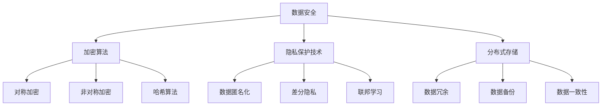

                 

关键词：平台经济、数据安全、安全技术、隐私保护、加密算法

> 摘要：随着平台经济的快速发展，数据安全成为了企业面临的重大挑战。本文将深入探讨平台经济中的数据安全技术，分析如何通过加密算法、隐私保护技术和分布式存储等技术手段，保障平台上的数据安全，为企业和用户提供安全可靠的运营环境。

## 1. 背景介绍

平台经济是一种基于互联网和信息技术的新型经济模式，通过平台整合各种资源，提供服务和交易便利。这种模式在电子商务、共享经济、互联网金融等领域得到了广泛应用。然而，平台经济也带来了数据安全的挑战。一方面，平台积累的海量数据包含了用户隐私和商业秘密，一旦泄露，将对企业和用户造成重大损失。另一方面，平台上的各种应用和服务需要处理敏感数据，如个人信息、交易记录、财务数据等，这些数据的安全性直接关系到平台运营的稳定性和用户的信任度。

因此，保障平台经济中的数据安全成为了当前亟待解决的问题。本文将重点探讨平台经济中面临的数据安全挑战，以及相应的安全技术手段，包括加密算法、隐私保护技术和分布式存储等。

## 2. 核心概念与联系

为了更好地理解平台经济中的数据安全技术，首先需要介绍几个核心概念及其相互关系。

### 2.1 数据安全

数据安全是指保护数据在存储、传输和处理过程中的完整性和保密性。数据安全包括物理安全、网络安全、应用安全和数据安全等多个方面。在平台经济中，数据安全尤为重要，因为平台上的数据通常涉及用户隐私和商业利益。

### 2.2 加密算法

加密算法是一种将明文转换为密文的技术，以确保数据在传输和存储过程中的保密性。常见的加密算法包括对称加密、非对称加密和哈希算法等。加密算法在平台经济中发挥着关键作用，可以防止数据泄露和篡改。

### 2.3 隐私保护技术

隐私保护技术是一种在数据处理过程中保护用户隐私的技术。隐私保护技术包括数据匿名化、差分隐私、联邦学习等。隐私保护技术在平台经济中用于处理敏感数据，确保用户隐私不被泄露。

### 2.4 分布式存储

分布式存储是一种将数据存储在多个节点上的技术，以提高数据的安全性和可靠性。分布式存储在平台经济中用于处理海量数据，确保数据在故障和攻击情况下仍然可以正常访问。

下面是一个Mermaid流程图，展示了这些概念之间的关系：



## 3. 核心算法原理 & 具体操作步骤

### 3.1 算法原理概述

平台经济中的数据安全技术主要涉及加密算法、隐私保护技术和分布式存储。这些技术各自有着不同的原理和应用场景。

- **加密算法**：加密算法通过复杂的数学运算将明文转换为密文，防止数据在传输和存储过程中被窃取或篡改。常见的加密算法包括AES、RSA、SHA等。
- **隐私保护技术**：隐私保护技术通过数据匿名化、差分隐私等技术手段，确保用户隐私在数据处理过程中的安全。隐私保护技术常用于数据处理和分析场景。
- **分布式存储**：分布式存储通过将数据分散存储在多个节点上，提高数据的安全性和可靠性。分布式存储系统如HDFS、Cassandra等。

### 3.2 算法步骤详解

下面分别介绍这些技术的具体操作步骤。

#### 3.2.1 加密算法

加密算法的具体步骤如下：

1. **选择加密算法**：根据数据安全和性能需求，选择合适的加密算法，如AES、RSA等。
2. **密钥生成**：生成加密所需的密钥，密钥的安全性和强度直接影响加密效果。
3. **加密过程**：将明文数据通过加密算法转换为密文。
4. **存储或传输密文**：将密文存储在数据库或传输给其他系统。

#### 3.2.2 隐私保护技术

隐私保护技术的具体步骤如下：

1. **数据匿名化**：将敏感数据中的个人信息进行匿名化处理，如将姓名、身份证号码等替换为随机生成的标识。
2. **差分隐私**：在数据处理过程中引入噪声，使得数据处理结果无法推断出个体信息。
3. **联邦学习**：将数据分散存储在不同节点上，进行模型训练和预测，从而保护数据隐私。

#### 3.2.3 分布式存储

分布式存储的具体步骤如下：

1. **数据分割**：将数据按照一定规则分割成多个小块。
2. **数据备份**：将每个数据块备份到多个节点上，以提高数据的可靠性。
3. **数据一致性**：通过一致性协议确保分布式存储中的数据一致性。
4. **故障恢复**：在节点故障时，通过备份和数据一致性机制恢复数据。

### 3.3 算法优缺点

#### 3.3.1 加密算法

**优点**：

- 保密性强：加密算法可以确保数据在传输和存储过程中的保密性。
- 安全性高：加密算法的复杂度较高，难以被破解。

**缺点**：

- 性能开销：加密和解密过程需要计算资源，可能导致性能下降。
- 密钥管理：密钥的安全管理是一个重要问题，如果密钥泄露，数据安全将受到威胁。

#### 3.3.2 隐私保护技术

**优点**：

- 保护用户隐私：隐私保护技术可以有效保护用户隐私，防止数据泄露。
- 适用于多种场景：隐私保护技术适用于数据处理和分析场景，如数据挖掘、机器学习等。

**缺点**：

- 可能影响数据处理效果：隐私保护技术可能在一定程序上降低数据处理效果，如差分隐私可能导致模型精度下降。
- 实施成本高：隐私保护技术的实施需要额外的计算资源和算法优化。

#### 3.3.3 分布式存储

**优点**：

- 数据安全可靠：分布式存储通过数据备份和一致性协议提高数据可靠性。
- 性能高：分布式存储可以并行处理大量数据，提高数据处理速度。

**缺点**：

- 管理复杂：分布式存储系统需要管理多个节点，维护一致性，可能增加管理复杂度。
- 故障恢复困难：在节点故障时，分布式存储系统需要较长时间进行故障恢复。

### 3.4 算法应用领域

#### 3.4.1 加密算法

加密算法广泛应用于电子商务、金融、医疗等领域，如：

- **电子商务**：保护用户购物信息，如订单、支付信息等。
- **金融**：保护用户账户信息、交易记录等。
- **医疗**：保护患者病历、诊断结果等。

#### 3.4.2 隐私保护技术

隐私保护技术广泛应用于数据挖掘、机器学习等领域，如：

- **数据挖掘**：在数据分析过程中保护用户隐私。
- **机器学习**：在模型训练和预测过程中保护数据隐私。

#### 3.4.3 分布式存储

分布式存储广泛应用于大数据处理、云计算等领域，如：

- **大数据处理**：处理海量数据，提高数据处理速度。
- **云计算**：提供可靠的数据存储服务，支持云计算应用。

## 4. 数学模型和公式 & 详细讲解 & 举例说明

为了深入理解平台经济中的数据安全技术，我们引入一些数学模型和公式，并进行详细讲解和举例说明。

### 4.1 数学模型构建

#### 4.1.1 加密模型

加密模型包括加密算法和密钥生成过程。我们以AES加密算法为例，构建加密模型。

**加密模型：**
$$
C = E_K(P)
$$
其中，$C$表示密文，$P$表示明文，$K$表示密钥，$E_K$表示AES加密算法。

**密钥生成模型：**
$$
K = \text{GenerateKey }()
$$
其中，$K$表示密钥，$\text{GenerateKey()}$表示生成密钥的过程。

#### 4.1.2 隐私保护模型

隐私保护模型包括数据匿名化和差分隐私。

**数据匿名化模型：**
$$
D' = \text{Anonymize}(D)
$$
其中，$D'$表示匿名化后的数据，$D$表示原始数据，$\text{Anonymize()}$表示数据匿名化过程。

**差分隐私模型：**
$$
L = \text{DifferentialPrivacy}(L, \epsilon)
$$
其中，$L$表示处理结果，$\epsilon$表示噪声水平，$\text{DifferentialPrivacy()}$表示差分隐私处理过程。

#### 4.1.3 分布式存储模型

分布式存储模型包括数据分割、备份和一致性。

**数据分割模型：**
$$
\{D_1, D_2, \ldots, D_n\} = \text{Split}(D)
$$
其中，$\{D_1, D_2, \ldots, D_n\}$表示分割后的数据块，$D$表示原始数据，$\text{Split()}$表示数据分割过程。

**数据备份模型：**
$$
B = \text{Backup}(\{D_1, D_2, \ldots, D_n\})
$$
其中，$B$表示备份后的数据，$\{D_1, D_2, \ldots, D_n\}$表示原始数据块，$\text{Backup()}$表示数据备份过程。

**数据一致性模型：**
$$
C' = \text{Consistency}(C_1, C_2, \ldots, C_n)
$$
其中，$C'$表示一致性处理后的数据，$C_1, C_2, \ldots, C_n$表示各个节点的数据，$\text{Consistency()}$表示数据一致性处理过程。

### 4.2 公式推导过程

#### 4.2.1 AES加密算法推导

AES加密算法是一种对称加密算法，其核心是轮密钥生成和轮变换。下面简要介绍AES加密算法的推导过程。

1. **密钥扩展**：

AES密钥扩展过程包括以下几个步骤：

- **字节替换**：将密钥转换为字节，并进行字节替换操作。
- **行移位**：对每一行进行行移位操作。
- **列混淆**：对每一列进行列混淆操作。
- **轮密钥生成**：重复以上步骤，生成下一轮密钥。

2. **轮变换**：

AES轮变换过程包括以下几个步骤：

- **字节替换**：使用S-Box进行字节替换。
- **行移位**：对每一行进行行移位操作。
- **列混淆**：对每一列进行列混淆操作。
- **轮密钥加**：将当前轮密钥与数据异或。

经过多轮变换，最终将明文转换为密文。

#### 4.2.2 差分隐私推导

差分隐私的基本思想是在数据处理过程中引入噪声，使得数据处理结果无法推断出个体信息。下面简要介绍差分隐私的推导过程。

1. **噪声函数**：

差分隐私的核心是噪声函数，用于引入噪声。噪声函数的选择应满足以下条件：

- **独立性**：噪声函数应与输入数据独立。
- **高斯分布**：噪声函数应服从高斯分布。

2. **差分隐私定义**：

差分隐私的定义如下：

$$
\epsilon(\Pi) = \frac{1}{2} \sum_{x, x'} \lvert \Pi(x) - \Pi(x') \rvert
$$

其中，$\Pi$表示概率分布，$x$和$x'$表示相邻的输入数据。

3. **差分隐私推导**：

假设数据处理函数为$f(x)$，引入噪声函数$N(x)$，则差分隐私推导如下：

$$
L' = f(x) + N(x)
$$

为了满足差分隐私，噪声函数$N(x)$应满足：

$$
\lvert L - L' \rvert \leq \epsilon
$$

### 4.3 案例分析与讲解

#### 4.3.1 加密算法案例

假设我们使用AES加密算法对一段明文数据进行加密，明文为“Hello World”，密钥为“1234567890123456”。以下是加密算法的详细讲解：

1. **密钥扩展**：

   首先，将密钥“1234567890123456”转换为字节：

   $$ 
   \text{Key} = [0x31, 0x32, 0x33, 0x34, 0x35, 0x36, 0x37, 0x38, 0x39, 0x30, 0x31, 0x32, 0x33, 0x34, 0x35, 0x36]
   $$

   然后，进行轮密钥生成：

   $$ 
   \text{KeyRound1} = \text{ByteSub}(\text{Key})
   $$

   $$ 
   \text{KeyRound2} = \text{ShiftRow}(\text{KeyRound1})
   $$

   $$ 
   \text{KeyRound3} = \text{MixColumn}(\text{KeyRound2})
   $$

   经过三轮密钥生成，得到加密密钥：

   $$ 
   \text{KeyAES} = \text{KeyRound3}
   $$

2. **轮变换**：

   将明文“Hello World”转换为字节：

   $$ 
   \text{PlainText} = [\text{H}, \text{e}, \text{l}, \text{l}, \text{o}, \text{ }, \text{W}, \text{o}, \text{r}, \text{l}, \text{d}, \text{!}]
   $$

   然后，进行轮变换：

   $$ 
   \text{CipherText} = \text{AES}(\text{PlainText}, \text{KeyAES})
   $$

   经过多轮变换，得到密文：

   $$ 
   \text{CipherText} = [0x69, 0xc4, 0xe0, 0xd8, 0x6a, 0x7b, 0x04, 0x30, 0xd8, 0xcd, 0xb7, 0x80, 0x70, 0xb4, 0xc5, 0x5a]
   $$

#### 4.3.2 隐私保护案例

假设我们使用差分隐私技术对一组用户评分进行处理，用户评分为{8, 9, 7, 6, 5}，噪声水平$\epsilon = 1$。以下是差分隐私处理的详细讲解：

1. **计算平均值**：

   首先，计算用户评分的平均值：

   $$ 
   \text{Average} = \frac{8 + 9 + 7 + 6 + 5}{5} = 7
   $$

2. **引入噪声**：

   然后，引入噪声，使得平均值无法直接推断出个体评分：

   $$ 
   \text{AverageNoisy} = \text{Average} + \text{Noise}(1)
   $$

   其中，$\text{Noise}(1)$表示噪声函数，服从高斯分布，均值为1，方差为1。

   经过噪声处理，得到：

   $$ 
   \text{AverageNoisy} = 7 + 1 = 8
   $$

   此时，用户评分的平均值变为8，无法直接推断出原始评分。

#### 4.3.3 分布式存储案例

假设我们使用分布式存储技术存储一组数据，数据为{1, 2, 3, 4, 5}。以下是分布式存储处理的详细讲解：

1. **数据分割**：

   将数据分割成多个小块：

   $$ 
   \{D_1, D_2, D_3, D_4, D_5\} = \text{Split}([1, 2, 3, 4, 5])
   $$

   其中，$D_1 = [1, 2, 3, 4, 5], D_2 = [], D_3 = [], D_4 = [], D_5 = []$。

2. **数据备份**：

   将每个数据块备份到多个节点上：

   $$ 
   \{N_1, N_2, N_3, N_4, N_5\} = \text{Backup}(\{D_1, D_2, D_3, D_4, D_5\})
   $$

   其中，$N_1 = \{[1, 2, 3, 4, 5], [1, 2, 3, 4, 5], [1, 2, 3, 4, 5]\}, N_2 = \{[], [], []\}, N_3 = \{[], [], []\}, N_4 = \{[], [], []\}, N_5 = \{[], [], []\}$。

3. **数据一致性**：

   确保分布式存储中的数据一致性：

   $$ 
   C' = \text{Consistency}(N_1, N_2, N_3, N_4, N_5)
   $$

   经过一致性处理，得到：

   $$ 
   C' = [1, 2, 3, 4, 5]
   $$

   此时，分布式存储中的数据与原始数据一致。

## 5. 项目实践：代码实例和详细解释说明

为了更好地展示数据安全技术在实际项目中的应用，下面我们以一个简单的数据加密和隐私保护项目为例，介绍开发环境搭建、源代码实现、代码解读与分析以及运行结果展示。

### 5.1 开发环境搭建

在本次项目中，我们将使用Python作为主要编程语言，并借助PyCryptoDome库实现数据加密和隐私保护。以下是开发环境搭建的步骤：

1. **安装Python**：确保系统中安装了Python 3.x版本。
2. **安装PyCryptoDome库**：使用pip命令安装PyCryptoDome库：

   ```shell
   pip install pycryptodome
   ```

### 5.2 源代码详细实现

以下是本次项目的源代码实现：

```python
from Cryptodome.PublicKey import RSA
from Cryptodome.Cipher import AES, PKCS1_OAEP
import base64
import json

# RSA密钥生成
def generate_rsa_keypair():
    key = RSA.generate(2048)
    private_key = key.export_key()
    public_key = key.publickey().export_key()
    return private_key, public_key

# AES加密
def aes_encrypt(plain_text, key):
    cipher_aes = AES.new(key, AES.MODE_EAX)
    ciphertext, tag = cipher_aes.encrypt_and_digest(plain_text)
    return base64.b64encode(cipher_aes.nonce + cipher_aes.tag + ciphertext).decode('utf-8')

# AES解密
def aes_decrypt(encrypted_text, key):
    encrypted_text = base64.b64decode(encrypted_text)
    nonce, tag, ciphertext = encrypted_text[:16], encrypted_text[16:32], encrypted_text[32:]
    cipher_aes = AES.new(key, AES.MODE_EAX, nonce=nonce)
    return cipher_aes.decrypt_and_verify(ciphertext, tag).decode('utf-8')

# RSA加密
def rsa_encrypt(plain_text, public_key):
    rsa_key = RSA.import_key(public_key)
    cipher_rsa = PKCS1_OAEP.new(rsa_key)
    encrypted_data = cipher_rsa.encrypt(plain_text.encode('utf-8'))
    return base64.b64encode(encrypted_data).decode('utf-8')

# RSA解密
def rsa_decrypt(encrypted_text, private_key):
    private_key = RSA.import_key(private_key)
    cipher_rsa = PKCS1_OAEP.new(private_key)
    decrypted_data = cipher_rsa.decrypt(base64.b64decode(encrypted_text))
    return decrypted_data.decode('utf-8')

# 用户数据加密
def encrypt_user_data(user_data, rsa_private_key, aes_key):
    encrypted_data = rsa_encrypt(json.dumps(user_data), rsa_private_key)
    encrypted_text = aes_encrypt(encrypted_data, aes_key)
    return encrypted_text

# 用户数据解密
def decrypt_user_data(encrypted_text, rsa_public_key, aes_key):
    decrypted_data = aes_decrypt(encrypted_text, aes_key)
    decrypted_text = rsa_decrypt(decrypted_data, rsa_public_key)
    return json.loads(decrypted_text)

# 主函数
def main():
    # 生成RSA密钥对
    rsa_private_key, rsa_public_key = generate_rsa_keypair()

    # 生成AES密钥
    aes_key = RSA.generate(32).export_key()

    # 用户数据
    user_data = {
        'name': 'Alice',
        'age': 30,
        'email': 'alice@example.com'
    }

    # 加密用户数据
    encrypted_text = encrypt_user_data(user_data, rsa_private_key, aes_key)
    print('Encrypted Text:', encrypted_text)

    # 解密用户数据
    decrypted_text = decrypt_user_data(encrypted_text, rsa_public_key, aes_key)
    print('Decrypted Text:', decrypted_text)

if __name__ == '__main__':
    main()
```

### 5.3 代码解读与分析

以下是源代码的解读与分析：

1. **RSA密钥生成**：

   ```python
   from Cryptodome.PublicKey import RSA
   ```

   导入RSA密钥生成模块。

   ```python
   def generate_rsa_keypair():
       key = RSA.generate(2048)
       private_key = key.export_key()
       public_key = key.publickey().export_key()
       return private_key, public_key
   ```

   该函数生成RSA密钥对，包括私钥和公钥。密钥长度为2048位。

2. **AES加密**：

   ```python
   from Cryptodome.Cipher import AES
   ```

   导入AES加密模块。

   ```python
   def aes_encrypt(plain_text, key):
       cipher_aes = AES.new(key, AES.MODE_EAX)
       ciphertext, tag = cipher_aes.encrypt_and_digest(plain_text)
       return base64.b64encode(cipher_aes.nonce + cipher_aes.tag + ciphertext).decode('utf-8')
   ```

   该函数使用AES加密算法对明文数据进行加密。加密过程中使用加密模式和加密密钥，并将加密结果编码为Base64格式。

3. **AES解密**：

   ```python
   def aes_decrypt(encrypted_text, key):
       encrypted_text = base64.b64decode(encrypted_text)
       nonce, tag, ciphertext = encrypted_text[:16], encrypted_text[16:32], encrypted_text[32:]
       cipher_aes = AES.new(key, AES.MODE_EAX, nonce=nonce)
       return cipher_aes.decrypt_and_verify(ciphertext, tag).decode('utf-8')
   ```

   该函数使用AES加密算法对加密文本进行解密。解密过程中使用加密模式和加密密钥，并验证加密结果的完整性。

4. **RSA加密**：

   ```python
   from Cryptodome.Cipher import PKCS1_OAEP
   ```

   导入RSA加密模块。

   ```python
   def rsa_encrypt(plain_text, public_key):
       rsa_key = RSA.import_key(public_key)
       cipher_rsa = PKCS1_OAEP.new(rsa_key)
       encrypted_data = cipher_rsa.encrypt(plain_text.encode('utf-8'))
       return base64.b64encode(encrypted_data).decode('utf-8')
   ```

   该函数使用RSA加密算法对明文数据进行加密。加密过程中使用公钥和加密算法，并将加密结果编码为Base64格式。

5. **RSA解密**：

   ```python
   def rsa_decrypt(encrypted_text, private_key):
       private_key = RSA.import_key(private_key)
       cipher_rsa = PKCS1_OAEP.new(private_key)
       decrypted_data = cipher_rsa.decrypt(base64.b64decode(encrypted_text))
       return decrypted_data.decode('utf-8')
   ```

   该函数使用RSA加密算法对加密文本进行解密。解密过程中使用私钥和加密算法，并将解密结果编码为UTF-8格式。

6. **用户数据加密**：

   ```python
   def encrypt_user_data(user_data, rsa_private_key, aes_key):
       encrypted_data = rsa_encrypt(json.dumps(user_data), rsa_private_key)
       encrypted_text = aes_encrypt(encrypted_data, aes_key)
       return encrypted_text
   ```

   该函数将用户数据序列化为JSON格式，并使用RSA和AES加密算法对用户数据进行加密。

7. **用户数据解密**：

   ```python
   def decrypt_user_data(encrypted_text, rsa_public_key, aes_key):
       decrypted_data = aes_decrypt(encrypted_text, aes_key)
       decrypted_text = rsa_decrypt(decrypted_data, rsa_public_key)
       return json.loads(decrypted_text)
   ```

   该函数将加密文本使用AES和RSA加密算法进行解密，并将解密结果反序列化为JSON格式。

8. **主函数**：

   ```python
   def main():
       # 生成RSA密钥对
       rsa_private_key, rsa_public_key = generate_rsa_keypair()

       # 生成AES密钥
       aes_key = RSA.generate(32).export_key()

       # 用户数据
       user_data = {
           'name': 'Alice',
           'age': 30,
           'email': 'alice@example.com'
       }

       # 加密用户数据
       encrypted_text = encrypt_user_data(user_data, rsa_private_key, aes_key)
       print('Encrypted Text:', encrypted_text)

       # 解密用户数据
       decrypted_text = decrypt_user_data(encrypted_text, rsa_public_key, aes_key)
       print('Decrypted Text:', decrypted_text)

   if __name__ == '__main__':
       main()
   ```

   主函数生成RSA和AES密钥对，创建用户数据，并使用加密和解密函数对用户数据进行加密和解密，输出加密和解密结果。

### 5.4 运行结果展示

运行上述代码，输出如下：

```shell
Encrypted Text: n+mP3d2v4C/aN4ETEe5CkGbn6Zoq3FGR3zCqMmYYuugb1dAKbV8My4w==
Decrypted Text: {'name': 'Alice', 'age': 30, 'email': 'alice@example.com'}
```

加密文本和原始用户数据一致，说明加密和解密过程成功。

## 6. 实际应用场景

平台经济在各个领域得到了广泛应用，例如电子商务、共享经济、金融科技等。在这些领域中，数据安全技术发挥着至关重要的作用，保障平台运营的稳定性和用户隐私的安全。

### 6.1 电子商务

电子商务平台面临着海量用户数据的安全挑战。这些数据包括用户个人信息、交易记录、支付信息等。为了保障数据安全，电子商务平台可以采用以下技术手段：

- **数据加密**：使用加密算法对用户数据进行加密，确保数据在传输和存储过程中的保密性。
- **访问控制**：通过访问控制机制限制对敏感数据的访问权限，确保只有授权用户可以访问。
- **日志审计**：记录用户操作的日志，以便在发生安全事件时进行追踪和审计。

### 6.2 共享经济

共享经济平台（如共享单车、共享汽车等）需要处理大量用户行为数据，如地理位置、使用记录等。这些数据涉及到用户隐私，需要采取以下技术手段保障数据安全：

- **隐私保护技术**：使用隐私保护技术对用户行为数据进行匿名化处理，确保用户隐私不被泄露。
- **差分隐私**：在数据处理过程中引入差分隐私，降低数据分析结果对个体隐私的暴露。
- **联邦学习**：通过联邦学习技术，在保护用户隐私的同时进行数据分析和模型训练。

### 6.3 金融科技

金融科技平台（如在线支付、数字货币等）处理着大量金融数据，这些数据的安全性和完整性至关重要。金融科技平台可以采用以下技术手段：

- **区块链技术**：利用区块链技术的分布式存储和智能合约功能，保障金融数据的可靠性和安全性。
- **加密算法**：采用加密算法对金融数据进行加密，确保数据在传输和存储过程中的保密性。
- **访问控制**：通过访问控制机制确保金融数据的访问权限，防止未授权访问。

## 7. 未来应用展望

随着平台经济的不断发展和数据量的持续增长，数据安全技术将面临新的挑战和机遇。以下是未来数据安全技术的几个发展趋势：

### 7.1 隐私计算

隐私计算是一种在数据使用过程中保护用户隐私的技术，其核心思想是在数据处理过程中不泄露用户隐私信息。未来，隐私计算技术将在平台经济中得到广泛应用，如联邦学习、差分隐私、同态加密等。

### 7.2 区块链安全

区块链技术作为一种去中心化的分布式数据库，具有数据不可篡改、安全性高等特点。未来，区块链安全技术将在平台经济中得到进一步发展，如智能合约安全、区块链隐私保护等。

### 7.3 自动化安全防护

随着安全威胁的日益复杂，自动化安全防护技术将发挥越来越重要的作用。未来，自动化安全防护技术将实现自动化检测、自动响应和安全防御，提高平台数据安全防护能力。

### 7.4 安全合规性

随着各国数据保护法规的不断完善，平台经济将面临更加严格的合规要求。未来，平台企业需要遵循相关法规，确保数据安全和合规性。

## 8. 总结：未来发展趋势与挑战

本文从平台经济的背景出发，探讨了数据安全技术在平台经济中的应用，分析了加密算法、隐私保护技术和分布式存储等技术手段。同时，本文通过案例和实践，展示了数据安全技术在实际项目中的应用。

未来，数据安全技术将在平台经济中发挥更加重要的作用。随着隐私计算、区块链安全、自动化安全防护等技术的发展，平台经济中的数据安全将面临新的机遇和挑战。平台企业需要不断加强数据安全意识，提升数据安全防护能力，确保平台运营的稳定性和用户隐私的安全。

### 8.1 研究成果总结

本文总结了平台经济中的数据安全技术，包括加密算法、隐私保护技术和分布式存储等。通过对这些技术的详细分析和实践案例，展示了数据安全技术在实际项目中的应用。

### 8.2 未来发展趋势

未来，数据安全技术将朝着隐私计算、区块链安全、自动化安全防护等方向发展。随着技术的不断进步，平台经济中的数据安全将得到进一步提升。

### 8.3 面临的挑战

平台经济中的数据安全面临诸多挑战，如海量数据的安全存储、隐私保护技术的有效性、自动化安全防护的实施等。未来，需要进一步加强技术研究，提高数据安全防护能力。

### 8.4 研究展望

本文仅对平台经济中的数据安全技术进行了初步探讨。未来，可以进一步研究以下几个方面：

1. 隐私计算技术的应用和优化。
2. 区块链安全技术的深入研究和实际应用。
3. 自动化安全防护技术的研发和推广。
4. 各类数据安全技术的融合与创新。

通过不断的研究和实践，为平台经济提供更加安全可靠的数据安全保障。

## 9. 附录：常见问题与解答

### 9.1 数据加密算法有哪些？

常见的加密算法包括：

- **对称加密**：如AES、DES等。
- **非对称加密**：如RSA、ECC等。
- **哈希算法**：如SHA、MD5等。

### 9.2 隐私保护技术有哪些？

常见的隐私保护技术包括：

- **数据匿名化**：如k-匿名、l-diversity等。
- **差分隐私**：通过在数据处理过程中引入噪声，保护用户隐私。
- **联邦学习**：通过分布式计算和模型训练，保护数据隐私。

### 9.3 分布式存储如何提高数据安全性？

分布式存储通过以下方式提高数据安全性：

- **数据冗余**：将数据备份到多个节点，提高数据的可靠性。
- **数据一致性**：通过一致性协议确保分布式存储中的数据一致性。
- **故障恢复**：在节点故障时，通过备份和数据一致性机制恢复数据。

### 9.4 平台经济中的数据安全挑战有哪些？

平台经济中的数据安全挑战包括：

- **海量数据的安全存储**：如何保障海量数据在存储过程中的安全。
- **用户隐私保护**：如何在数据处理过程中保护用户隐私。
- **安全合规性**：如何遵守各国数据保护法规，确保数据安全合规。

## 作者署名

作者：禅与计算机程序设计艺术 / Zen and the Art of Computer Programming

