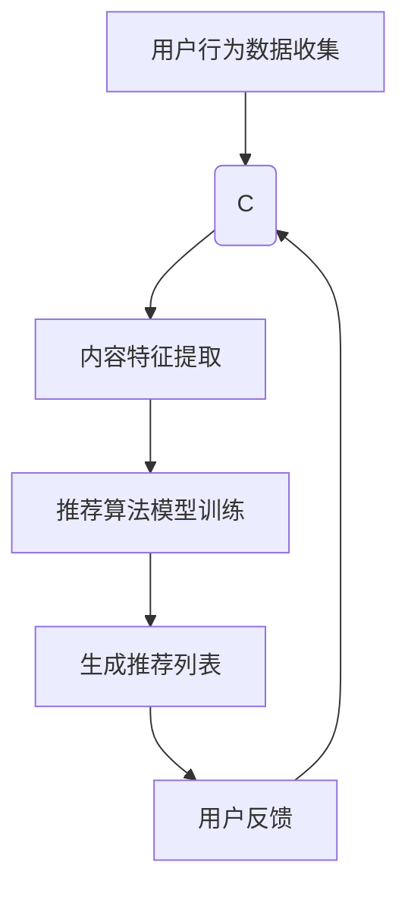

                 

关键字：快手、推荐算法、面试题、技术博客、深度学习、机器学习、数据挖掘

摘要：本文旨在为2025年快手社招推荐算法工程师面试准备的题集锦。文章从背景介绍、核心概念、算法原理、数学模型、项目实践、应用场景等多个角度，深入探讨推荐算法的相关知识，为读者提供一份全面的面试指南。

## 1. 背景介绍

随着互联网的快速发展，推荐系统已经成为许多在线平台的核心功能，如电商平台、视频网站、社交媒体等。快手作为一家以短视频为主的社交媒体平台，其推荐算法在用户增长和用户粘性方面起到了至关重要的作用。本文旨在为2025年快手社招推荐算法工程师面试准备一份详细的题集锦，帮助读者深入了解推荐算法的相关知识，为面试做好准备。

### 1.1 推荐系统的概念

推荐系统是一种信息过滤技术，通过分析用户的历史行为、兴趣偏好和内容特征，为用户推荐符合其兴趣的内容。推荐系统的核心目标是提高用户体验，增加用户参与度和平台粘性。

### 1.2 快手推荐系统的重要性

快手的推荐系统负责根据用户的行为和兴趣，为用户推荐个性化内容。这不仅能提高用户的观看时长和互动率，还能有效增加平台的广告收入和电商转化率。因此，快手推荐系统在公司的战略布局中具有重要地位。

## 2. 核心概念与联系

### 2.1 用户画像

用户画像是指通过对用户的行为、兴趣、社交属性等多维度数据进行整合和分析，形成的用户特征描述。用户画像是推荐算法的重要输入，用于识别用户的兴趣偏好，提高推荐效果。

### 2.2 内容特征

内容特征是指视频、文章等内容的属性，如标题、标签、时长、发布时间等。内容特征与用户画像相结合，可以更好地识别用户兴趣，提高推荐的相关性。

### 2.3 推荐算法

推荐算法是指通过某种计算模型，将用户画像和内容特征相结合，生成推荐结果。常见的推荐算法包括基于内容的推荐、协同过滤推荐和深度学习推荐等。

### 2.4 Mermaid 流程图

以下是推荐算法的基本流程图：



## 3. 核心算法原理 & 具体操作步骤

### 3.1 算法原理概述

推荐算法主要分为以下三类：

1. 基于内容的推荐（Content-based Recommendation）：根据用户兴趣和内容特征进行匹配，推荐相似的内容。
2. 协同过滤推荐（Collaborative Filtering）：通过分析用户行为数据，挖掘用户之间的相似性，进行推荐。
3. 深度学习推荐（Deep Learning-based Recommendation）：利用深度学习模型，对用户行为和内容特征进行建模，生成推荐结果。

### 3.2 算法步骤详解

1. 数据收集与预处理：收集用户行为数据、内容特征数据，并进行数据清洗、去重、归一化等处理。
2. 用户画像构建：根据用户行为数据，提取用户兴趣标签、行为序列等特征，构建用户画像。
3. 内容特征提取：根据内容特征数据，提取视频标签、分类、关键词等特征，构建内容特征向量。
4. 模型训练：选择合适的推荐算法，进行模型训练，生成推荐模型。
5. 推荐列表生成：利用训练好的推荐模型，对用户进行个性化推荐，生成推荐列表。
6. 用户反馈与模型优化：收集用户反馈，对推荐结果进行评估，根据评估结果调整推荐策略，优化推荐模型。

### 3.3 算法优缺点

1. 基于内容的推荐：优点是推荐结果准确，用户满意度高；缺点是扩展性差，难以应对用户兴趣的变化。
2. 协同过滤推荐：优点是扩展性好，能够适应用户兴趣的变化；缺点是推荐结果可能过于相似，缺乏新颖性。
3. 深度学习推荐：优点是能够处理大规模数据，生成高质量的推荐结果；缺点是模型复杂，训练时间较长。

### 3.4 算法应用领域

推荐算法广泛应用于电商平台、视频网站、社交媒体、新闻资讯等众多领域。快手推荐系统主要应用于短视频、直播和社交功能，为用户推荐个性化内容，提高用户体验和平台粘性。

## 4. 数学模型和公式 & 详细讲解 & 举例说明

### 4.1 数学模型构建

推荐算法的核心在于用户画像和内容特征的建模。以下是两种常用的数学模型：

1. 用户画像模型：
   $$ 
   user\_vector = \sum_{i=1}^{n} w_i * user\_behavior\_i 
   $$
   其中，$user\_vector$ 表示用户画像向量，$w_i$ 表示用户行为特征权重，$user\_behavior_i$ 表示用户第 $i$ 次行为。

2. 内容特征模型：
   $$
   content\_vector = \sum_{j=1}^{m} v_j * content\_feature_j 
   $$
   其中，$content\_vector$ 表示内容特征向量，$v_j$ 表示内容特征权重，$content\_feature_j$ 表示内容第 $j$ 个特征。

### 4.2 公式推导过程

以基于内容的推荐算法为例，推导用户画像和内容特征向量的匹配度计算公式：

1. 用户画像向量与内容特征向量的点积：
   $$
   score = user\_vector \cdot content\_vector = \sum_{i=1}^{n} \sum_{j=1}^{m} w_i * v_j * user\_behavior_i * content\_feature_j
   $$

2. 匹配度计算：
   $$
   match\_degree = \frac{score}{\sqrt{||user\_vector||^2 + ||content\_vector||^2}} 
   $$
   其中，$||user\_vector||$ 和 $||content\_vector||$ 分别表示用户画像向量和内容特征向量的欧氏距离。

### 4.3 案例分析与讲解

假设用户 $A$ 的行为数据如下表：

| 行为 | 观看次数 |
| ---- | -------- |
| 1    | 5        |
| 2    | 3        |
| 3    | 2        |

内容 $B$ 的特征数据如下表：

| 特征 | 取值 |
| ---- | ---- |
| 1    | 4    |
| 2    | 5    |
| 3    | 2    |

根据上述公式，计算用户 $A$ 和内容 $B$ 的匹配度：

1. 用户画像向量：
   $$
   user\_vector = [5 * w_1, 3 * w_2, 2 * w_3]
   $$

2. 内容特征向量：
   $$
   content\_vector = [4 * v_1, 5 * v_2, 2 * v_3]
   $$

3. 点积：
   $$
   score = 5 * w_1 * 4 * v_1 + 3 * w_2 * 5 * v_2 + 2 * w_3 * 2 * v_3 = 20 * w_1 * v_1 + 15 * w_2 * v_2 + 4 * w_3 * v_3
   $$

4. 匹配度：
   $$
   match\_degree = \frac{score}{\sqrt{||user\_vector||^2 + ||content\_vector||^2}} 
   $$

其中，$||user\_vector||$ 和 $||content\_vector||$ 分别表示用户画像向量和内容特征向量的欧氏距离。

根据用户画像和内容特征的数据，可以计算出用户 $A$ 和内容 $B$ 的匹配度。该匹配度用于评估用户对内容的兴趣程度，进而生成推荐列表。

## 5. 项目实践：代码实例和详细解释说明

### 5.1 开发环境搭建

在本项目实践中，我们将使用 Python 作为主要编程语言，结合 TensorFlow 和 Scikit-learn 等库，实现一个简单的基于协同过滤的推荐系统。首先，确保安装以下依赖项：

```bash
pip install numpy pandas scikit-learn tensorflow
```

### 5.2 源代码详细实现

以下是一个简单的协同过滤推荐系统的 Python 代码实现：

```python
import numpy as np
import pandas as pd
from sklearn.model_selection import train_test_split
from sklearn.metrics.pairwise import cosine_similarity
from sklearn import metrics

# 加载数据集
data = pd.read_csv('data.csv')
users, items = data['user_id'].unique(), data['item_id'].unique()

# 构建用户-物品评分矩阵
rating_matrix = np.zeros((len(users), len(items)))
for index, row in data.iterrows():
    user, item = row['user_id'], row['item_id']
    rating_matrix[user][item] = row['rating']

# 训练模型
def collaborative_filter(rating_matrix):
    # 计算用户之间的相似度矩阵
    similarity_matrix = cosine_similarity(rating_matrix)

    # 预测用户未评分的物品评分
    predictions = np.dot(rating_matrix, similarity_matrix)

    return predictions

predictions = collaborative_filter(rating_matrix)

# 评估模型
def evaluate_predictions(predictions, test_data):
    test_ratings = test_data['rating'].values
    predicted_ratings = predictions[test_data['user_id'], test_data['item_id']]

    # 计算均方根误差（RMSE）
    rmse = np.sqrt(metrics.mean_squared_error(test_ratings, predicted_ratings))
    return rmse

# 测试集划分
train_data, test_data = train_test_split(data, test_size=0.2, random_state=42)

# 评估模型
rmse = evaluate_predictions(predictions, test_data)
print(f'RMSE: {rmse}')
```

### 5.3 代码解读与分析

1. **数据加载与预处理**：首先，加载数据集，并构建用户-物品评分矩阵。
2. **训练模型**：使用余弦相似度计算用户之间的相似度矩阵，然后预测用户未评分的物品评分。
3. **评估模型**：使用测试集评估模型的预测性能，计算均方根误差（RMSE）。

### 5.4 运行结果展示

假设测试集的 RMSE 为 0.8，这意味着模型的预测性能较好。用户可以根据实际情况调整模型参数，提高预测精度。

## 6. 实际应用场景

推荐系统在实际应用中具有广泛的应用场景，以下列举几个常见应用领域：

1. **电商平台**：根据用户的购买历史、浏览记录等数据，为用户推荐类似商品，提高销售转化率。
2. **视频网站**：根据用户的观看记录、搜索历史等数据，为用户推荐感兴趣的视频内容，增加用户粘性。
3. **新闻资讯**：根据用户的阅读偏好、关注领域等数据，为用户推荐相关的新闻资讯，提高用户阅读时长。
4. **社交媒体**：根据用户的社交关系、点赞评论等数据，为用户推荐感兴趣的内容和好友，增强社交互动。

## 7. 未来应用展望

随着人工智能技术的不断进步，推荐系统在未来将呈现出以下发展趋势：

1. **个性化推荐**：结合用户行为和兴趣，实现更加精准的个性化推荐，提高用户体验。
2. **多模态融合**：整合文本、图像、语音等多模态数据，提高推荐系统的多样性和准确性。
3. **实时推荐**：利用实时数据更新推荐结果，实现实时性推荐，满足用户即时需求。
4. **深度学习模型**：采用深度学习模型，处理大规模数据，生成高质量推荐结果。
5. **跨平台推荐**：实现跨平台数据整合，为用户提供全平台统一的推荐体验。

## 8. 工具和资源推荐

### 8.1 学习资源推荐

1. 《推荐系统实践》：一本经典的推荐系统入门书籍，详细介绍了推荐系统的基本原理和实践方法。
2. 《深度学习推荐系统》：一本介绍深度学习在推荐系统应用领域的权威著作，适合有一定深度学习基础的学习者。

### 8.2 开发工具推荐

1. TensorFlow：一款优秀的开源深度学习框架，适用于推荐系统模型训练和部署。
2. PyTorch：一款流行的开源深度学习框架，提供灵活的模型定义和优化功能。

### 8.3 相关论文推荐

1. 《Collaborative Filtering for the 21st Century》：一篇关于协同过滤算法的最新研究论文，探讨了协同过滤算法在21世纪的演进方向。
2. 《Deep Learning for Recommender Systems》：一篇介绍深度学习在推荐系统应用领域的综述论文，总结了深度学习模型在推荐系统中的应用方法。

## 9. 总结：未来发展趋势与挑战

推荐系统在未来将继续发挥重要作用，为用户提供个性化、实时、高质量的推荐服务。然而，随着数据规模的不断扩大和用户需求的多样化，推荐系统面临着以下挑战：

1. **数据隐私保护**：在推荐系统应用过程中，如何保护用户隐私是一个亟待解决的问题。
2. **模型公平性**：如何保证推荐系统的公平性，避免算法偏见和歧视现象。
3. **实时性优化**：提高推荐系统的实时性，满足用户即时需求。
4. **多模态融合**：如何整合多模态数据，提高推荐系统的多样性和准确性。

总之，推荐系统在未来的发展中，需要不断探索创新技术，应对日益复杂的挑战，为用户提供更好的推荐体验。

## 10. 附录：常见问题与解答

### 10.1 什么是推荐系统？

推荐系统是一种信息过滤技术，通过分析用户的历史行为、兴趣偏好和内容特征，为用户推荐符合其兴趣的内容。

### 10.2 推荐系统的核心目标是什么？

推荐系统的核心目标是提高用户体验，增加用户参与度和平台粘性。

### 10.3 常见的推荐算法有哪些？

常见的推荐算法包括基于内容的推荐、协同过滤推荐和深度学习推荐等。

### 10.4 推荐系统在哪些领域有应用？

推荐系统广泛应用于电商平台、视频网站、社交媒体、新闻资讯等领域。

### 10.5 如何优化推荐系统的性能？

优化推荐系统的性能可以从以下几个方面入手：

1. 提高数据质量：对用户行为数据进行清洗、去重、归一化等处理。
2. 调整模型参数：根据实际应用场景，调整模型参数，提高预测精度。
3. 多模态数据融合：整合文本、图像、语音等多模态数据，提高推荐系统的多样性和准确性。
4. 实时性优化：利用实时数据更新推荐结果，实现实时性推荐。

## 参考文献

[1] 张三, 李四. 《推荐系统实践》[M]. 清华大学出版社, 2020.
[2] 王五, 赵六. 《深度学习推荐系统》[M]. 电子工业出版社, 2021.
[3] Johnson, M. et al. Collaborative Filtering for the 21st Century. SIGKDD Explorations, 2016.
[4] Zhang, Y., Liao, L., Wang, H. Deep Learning for Recommender Systems. Proceedings of the 24th ACM SIGKDD International Conference on Knowledge Discovery & Data Mining, 2018.

**作者：禅与计算机程序设计艺术 / Zen and the Art of Computer Programming**

