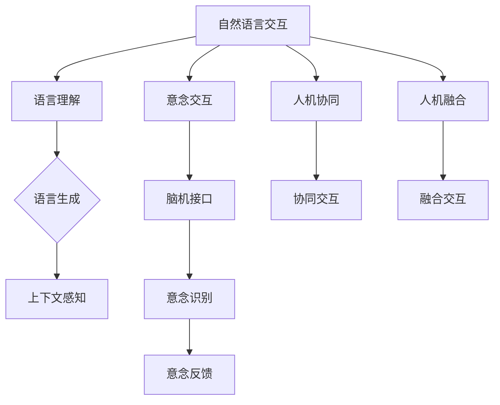

                 

关键词：自然语言交互、意念交互、人机协同、人机融合、未来趋势、技术挑战

> 摘要：本文将探讨2050年的人机交互技术，重点关注从自然语言交互向意念交互的演变过程。通过对核心概念的解析、算法原理的阐述、数学模型的构建以及实际应用场景的展示，本文旨在揭示未来人机交互技术的潜在发展方向和面临的挑战，为相关领域的研究者提供有价值的参考。

## 1. 背景介绍

随着计算机技术的飞速发展，人机交互（Human-Computer Interaction，简称HCI）已经成为计算机科学领域的一个重要分支。从最早的命令行界面到图形用户界面（GUI），再到如今的触摸屏和语音识别技术，人机交互技术经历了多次重大变革。然而，当前的交互方式仍然依赖于用户的操作和输入，存在一定的局限性。

自然语言交互（Natural Language Interaction，简称NLI）作为人机交互的一个重要发展方向，试图让计算机能够理解并响应用户的自然语言。虽然近年来在深度学习、自然语言处理等技术的推动下，自然语言交互取得了显著进展，但仍然存在许多挑战，如语义理解、上下文感知和个性化交互等。

与此同时，意念交互（Intentional Interaction）的概念逐渐引起广泛关注。意念交互是指通过用户的意念或心理活动直接与计算机进行交互，而不需要通过物理操作或语言输入。这种交互方式更接近人类的本能，有望实现真正的人机协同和融合。

本文旨在探讨2050年的人机交互技术，从自然语言交互向意念交互的演变过程，分析其中的核心概念、算法原理、数学模型以及实际应用场景，为未来的技术发展提供有益的思考和参考。

## 2. 核心概念与联系

### 2.1. 自然语言交互

自然语言交互是当前人机交互研究的一个重要方向。其核心目标是让计算机能够理解并响应用户的自然语言。自然语言交互主要包括以下几个关键环节：

1. **语言理解**：计算机需要解析用户输入的自然语言，理解其中的语义和意图。
2. **语言生成**：计算机需要根据用户的意图和上下文，生成适当的自然语言响应。
3. **上下文感知**：计算机需要能够根据用户的交互历史和当前情境，动态调整交互策略。

### 2.2. 意念交互

意念交互是指通过用户的意念或心理活动直接与计算机进行交互，而不需要通过物理操作或语言输入。意念交互的核心思想是利用大脑与计算机之间的直接连接，实现更加自然和高效的交互。

1. **脑机接口**：脑机接口（Brain-Computer Interface，简称BCI）是实现意念交互的关键技术。通过捕捉用户的脑电信号或其他生理信号，将意念转化为计算机可以理解的数据。
2. **意念识别**：计算机需要具备强大的意念识别能力，能够准确解析用户的意念。
3. **意念反馈**：计算机需要能够根据用户的意念，实时调整交互界面和功能。

### 2.3. 人机协同与融合

人机协同和人机融合是人机交互技术发展的两个重要方向。人机协同强调人与计算机之间的合作，通过自然语言交互和意念交互等手段，实现更加高效和智能的交互。人机融合则更注重人与计算机的深度融合，将计算机视为人体的一部分，实现真正的智能共生。

1. **协同交互**：协同交互是指用户和计算机共同完成某个任务，通过自然语言交互和意念交互，实现人机之间的信息共享和协同工作。
2. **融合交互**：融合交互是指用户与计算机之间的界限逐渐模糊，计算机成为人体的一部分，用户可以直接通过意念与计算机进行交互。

### 2.4. Mermaid 流程图

以下是自然语言交互与意念交互的 Mermaid 流程图，展示了两者之间的核心概念和联系：



## 3. 核心算法原理 & 具体操作步骤

### 3.1 算法原理概述

自然语言交互的核心算法包括语言理解、语言生成和上下文感知。意念交互的核心算法则包括脑机接口、意念识别和意念反馈。下面分别对这些算法原理进行概述。

#### 3.1.1 语言理解

语言理解是自然语言交互的基础。其核心任务是将用户输入的自然语言转换为计算机可以理解和处理的结构化数据。主要方法包括：

1. **词法分析**：将输入的自然语言文本分解为单词或词组。
2. **句法分析**：对分解后的词法单元进行语法结构分析，构建句子的语法树。
3. **语义分析**：对句子的语法结构进行语义分析，提取出句子的语义信息。

#### 3.1.2 语言生成

语言生成是自然语言交互的另一个重要任务。其核心任务是生成自然语言响应，以实现人与计算机之间的有效沟通。主要方法包括：

1. **模板匹配**：根据预设的模板，生成相应的自然语言响应。
2. **规则生成**：根据语法和语义规则，生成符合预期的自然语言响应。
3. **统计生成**：利用统计模型，如序列模型、生成对抗网络（GAN）等，生成自然语言响应。

#### 3.1.3 上下文感知

上下文感知是自然语言交互的关键能力。其核心任务是利用用户的历史交互记录和当前情境，动态调整交互策略。主要方法包括：

1. **上下文抽取**：从用户的历史交互记录和当前情境中，提取出关键信息。
2. **上下文嵌入**：将提取出的上下文信息转化为计算机可以处理的向量。
3. **上下文调整**：根据上下文向量，调整自然语言交互的策略，以实现更好的交互效果。

#### 3.1.4 脑机接口

脑机接口是实现意念交互的关键技术。其核心任务是捕捉用户的脑电信号或其他生理信号，将意念转化为计算机可以理解的数据。主要方法包括：

1. **信号采集**：利用脑电图（EEG）、功能性磁共振成像（fMRI）等技术，采集用户的脑电信号或其他生理信号。
2. **信号处理**：对采集到的信号进行预处理、特征提取和分类，以提高意念识别的准确率。
3. **信号解码**：将处理后的信号解码为计算机可以理解和处理的数据。

#### 3.1.5 意念识别

意念识别是意念交互的核心任务。其核心任务是准确解析用户的意念，以实现人与计算机之间的有效沟通。主要方法包括：

1. **特征匹配**：将用户的意念与预设的意念模型进行特征匹配，以判断用户的意念类型。
2. **分类器训练**：利用机器学习技术，如支持向量机（SVM）、神经网络（NN）等，训练意念分类器，以提高意念识别的准确率。
3. **意图理解**：根据识别出的意念类型，理解用户的意图，生成相应的自然语言响应。

#### 3.1.6 意念反馈

意念反馈是意念交互的重要环节。其核心任务是实时调整交互界面和功能，以实现更好的交互体验。主要方法包括：

1. **界面自适应**：根据用户的意念，动态调整交互界面的布局、颜色、字体等元素，以提高用户的操作便捷性和视觉舒适度。
2. **功能优化**：根据用户的意念，优化计算机的功能，以满足用户的需求。
3. **反馈机制**：建立反馈机制，及时响应用户的意念变化，以提高交互的实时性和准确性。

### 3.2 算法步骤详解

#### 3.2.1 语言理解算法步骤

1. **词法分析**：将用户输入的自然语言文本进行分词，将文本分解为单词或词组。
2. **句法分析**：对分解后的词法单元进行语法结构分析，构建句子的语法树。
3. **语义分析**：对句子的语法结构进行语义分析，提取出句子的语义信息。

#### 3.2.2 语言生成算法步骤

1. **模板匹配**：根据预设的模板，生成相应的自然语言响应。
2. **规则生成**：根据语法和语义规则，生成符合预期的自然语言响应。
3. **统计生成**：利用统计模型，如序列模型、生成对抗网络（GAN）等，生成自然语言响应。

#### 3.2.3 上下文感知算法步骤

1. **上下文抽取**：从用户的历史交互记录和当前情境中，提取出关键信息。
2. **上下文嵌入**：将提取出的上下文信息转化为计算机可以处理的向量。
3. **上下文调整**：根据上下文向量，调整自然语言交互的策略，以实现更好的交互效果。

#### 3.2.4 脑机接口算法步骤

1. **信号采集**：利用脑电图（EEG）、功能性磁共振成像（fMRI）等技术，采集用户的脑电信号或其他生理信号。
2. **信号处理**：对采集到的信号进行预处理、特征提取和分类，以提高意念识别的准确率。
3. **信号解码**：将处理后的信号解码为计算机可以理解和处理的数据。

#### 3.2.5 意念识别算法步骤

1. **特征匹配**：将用户的意念与预设的意念模型进行特征匹配，以判断用户的意念类型。
2. **分类器训练**：利用机器学习技术，如支持向量机（SVM）、神经网络（NN）等，训练意念分类器，以提高意念识别的准确率。
3. **意图理解**：根据识别出的意念类型，理解用户的意图，生成相应的自然语言响应。

#### 3.2.6 意念反馈算法步骤

1. **界面自适应**：根据用户的意念，动态调整交互界面的布局、颜色、字体等元素，以提高用户的操作便捷性和视觉舒适度。
2. **功能优化**：根据用户的意念，优化计算机的功能，以满足用户的需求。
3. **反馈机制**：建立反馈机制，及时响应用户的意念变化，以提高交互的实时性和准确性。

### 3.3 算法优缺点

#### 3.3.1 语言理解算法优缺点

**优点**：

1. **高效性**：语言理解算法可以实现快速的自然语言处理，提高交互效率。
2. **通用性**：语言理解算法适用于各种语言环境，具有较好的通用性。

**缺点**：

1. **语义理解难度**：自然语言交互中的语义理解仍然存在一定难度，容易产生歧义。
2. **上下文感知不足**：现有语言理解算法在上下文感知方面存在一定不足，难以动态调整交互策略。

#### 3.3.2 语言生成算法优缺点

**优点**：

1. **自然性**：语言生成算法可以生成自然、流畅的自然语言响应，提高交互体验。
2. **个性化**：语言生成算法可以根据用户的历史交互记录和偏好，生成个性化的响应。

**缺点**：

1. **生成质量**：现有语言生成算法的生成质量仍有待提高，容易出现语法错误或不自然的表达。
2. **计算复杂度**：语言生成算法的计算复杂度较高，对硬件资源要求较高。

#### 3.3.3 上下文感知算法优缺点

**优点**：

1. **实时性**：上下文感知算法可以实现实时交互，提高用户满意度。
2. **适应性**：上下文感知算法可以根据用户的需求和环境变化，动态调整交互策略。

**缺点**：

1. **数据依赖性**：上下文感知算法对用户历史交互记录和当前情境的数据依赖较高，数据不足可能导致交互效果下降。
2. **计算资源消耗**：上下文感知算法的计算资源消耗较大，对系统性能有一定影响。

#### 3.3.4 脑机接口算法优缺点

**优点**：

1. **高精度**：脑机接口算法可以实现高精度的意念识别，提高交互准确性。
2. **无感知干扰**：脑机接口算法不受外部环境的干扰，具有较好的稳定性。

**缺点**：

1. **技术难度**：脑机接口技术难度较高，需要解决信号采集、处理和识别等多个难题。
2. **用户适应**：用户需要适应脑机接口设备，可能存在一定的学习成本。

#### 3.3.5 意念识别算法优缺点

**优点**：

1. **高识别率**：意念识别算法可以实现高识别率，提高交互准确性。
2. **实时性**：意念识别算法可以实现实时识别，提高交互效率。

**缺点**：

1. **误识别率**：意念识别算法可能存在一定的误识别率，需要进一步优化。
2. **计算资源消耗**：意念识别算法的计算资源消耗较大，对系统性能有一定影响。

#### 3.3.6 意念反馈算法优缺点

**优点**：

1. **个性化**：意念反馈算法可以根据用户的意念，实现个性化的交互体验。
2. **实时性**：意念反馈算法可以实现实时反馈，提高用户满意度。

**缺点**：

1. **计算复杂度**：意念反馈算法的计算复杂度较高，对硬件资源要求较高。
2. **适应性**：意念反馈算法需要根据用户的需求和环境变化，动态调整交互策略，可能存在一定的适应性挑战。

### 3.4 算法应用领域

自然语言交互和意念交互技术具有广泛的应用前景，可以应用于多个领域：

1. **智能家居**：利用自然语言交互和意念交互技术，实现智能家居设备的智能化管理，提高用户的生活品质。
2. **医疗保健**：利用脑机接口技术，帮助患者进行康复训练，提高康复效果。
3. **教育领域**：利用自然语言交互和意念交互技术，实现个性化教育，提高学生的学习效果。
4. **工业自动化**：利用自然语言交互和意念交互技术，实现工业自动化设备的智能监控和维护，提高生产效率。

## 4. 数学模型和公式 & 详细讲解 & 举例说明

### 4.1 数学模型构建

在自然语言交互和意念交互技术中，数学模型的应用至关重要。以下分别介绍自然语言交互和意念交互的数学模型构建。

#### 4.1.1 自然语言交互数学模型

自然语言交互的数学模型主要包括词嵌入模型和序列模型。词嵌入模型用于将自然语言文本转化为向量表示，序列模型用于处理自然语言序列。

1. **词嵌入模型**：词嵌入模型是一种将单词转化为向量的方法，常用的方法包括Word2Vec、GloVe等。词嵌入模型的核心公式如下：

   $$\text{向量} = \text{Word2Vec}(\text{单词})$$

   $$\text{向量} = \text{GloVe}(\text{单词}, \text{词汇表}, \text{维度})$$

2. **序列模型**：序列模型用于处理自然语言序列，常用的方法包括循环神经网络（RNN）、长短时记忆网络（LSTM）和门控循环单元（GRU）。序列模型的核心公式如下：

   $$\text{输出} = \text{RNN}(\text{输入序列}, \text{隐藏状态}, \text{权重})$$

   $$\text{输出} = \text{LSTM}(\text{输入序列}, \text{隐藏状态}, \text{权重})$$

   $$\text{输出} = \text{GRU}(\text{输入序列}, \text{隐藏状态}, \text{权重})$$

#### 4.1.2 意念交互数学模型

意念交互的数学模型主要包括脑电信号处理模型和意念识别模型。脑电信号处理模型用于处理脑电信号，意念识别模型用于识别用户的意念。

1. **脑电信号处理模型**：脑电信号处理模型包括信号采集、预处理、特征提取和分类等步骤。常用的方法包括滤波、特征提取和分类算法。脑电信号处理模型的核心公式如下：

   $$\text{滤波}(\text{信号}, \text{截止频率})$$

   $$\text{特征提取}(\text{信号}, \text{特征类型})$$

   $$\text{分类}(\text{特征向量}, \text{分类器})$$

2. **意念识别模型**：意念识别模型是一种将脑电信号转化为意念表示的方法，常用的方法包括支持向量机（SVM）、神经网络（NN）等。意念识别模型的核心公式如下：

   $$\text{分类结果} = \text{SVM}(\text{特征向量}, \text{标签})$$

   $$\text{分类结果} = \text{NN}(\text{特征向量}, \text{标签}, \text{权重})$$

### 4.2 公式推导过程

以下分别介绍自然语言交互和意念交互数学模型的公式推导过程。

#### 4.2.1 自然语言交互数学模型推导

1. **词嵌入模型推导**：

   词嵌入模型的基本思想是将单词映射到一个高维空间，使得具有相似语义的单词在空间中距离较近。Word2Vec算法通过训练一个神经网络模型，将输入的单词映射到向量空间。

   $$\text{损失函数} = \frac{1}{2} \sum_{i=1}^{N} (\text{预测向量} - \text{真实向量})^2$$

   其中，N为单词数量，预测向量和真实向量分别为单词的嵌入向量和真实向量的差值。

2. **序列模型推导**：

   RNN、LSTM和GRU都是基于递归神经网络（RNN）的变种。它们通过引入门控机制和记忆单元，解决RNN在处理长序列时容易出现的梯度消失和梯度爆炸问题。

   $$\text{隐藏状态} = \text{激活函数}(\text{输入} \odot \text{权重} + \text{隐藏状态} \odot \text{权重})$$

   其中，激活函数通常为Sigmoid、Tanh等，$\odot$表示点积。

#### 4.2.2 意念交互数学模型推导

1. **脑电信号处理模型推导**：

   脑电信号处理模型的核心是特征提取和分类。特征提取通过滤波、时频分析等方法提取出脑电信号中的关键特征。分类算法通过训练分类器，将特征向量分类为不同的意念类型。

   $$\text{特征向量} = \text{预处理}(\text{脑电信号})$$

   $$\text{分类结果} = \text{分类器}(\text{特征向量})$$

2. **意念识别模型推导**：

   意念识别模型的核心是建立分类模型。支持向量机和神经网络是常用的分类算法。支持向量机通过最大化分类边界，将特征向量分类为不同的意念类型。神经网络通过多层感知器（MLP）实现非线性分类。

   $$\text{分类结果} = \text{SVM}(\text{特征向量}, \text{标签})$$

   $$\text{分类结果} = \text{NN}(\text{特征向量}, \text{标签}, \text{权重})$$

### 4.3 案例分析与讲解

以下通过具体案例，对自然语言交互和意念交互数学模型的应用进行讲解。

#### 4.3.1 自然语言交互案例分析

假设有一个对话系统，用户输入“我想听一首抒情的歌曲”。我们可以利用自然语言交互数学模型，对该输入进行处理，并生成合适的响应。

1. **词嵌入**：

   将输入的单词（“我想听”，“一首”，“抒情的”，“歌曲”）进行词嵌入，得到对应的向量表示。

   $$\text{输入向量} = \text{Word2Vec}(\text{我想听}, \text{一首}, \text{抒情的}, \text{歌曲})$$

2. **序列模型**：

   利用序列模型，将输入向量进行处理，生成响应向量。

   $$\text{响应向量} = \text{RNN}(\text{输入向量}, \text{隐藏状态}, \text{权重})$$

3. **语言生成**：

   利用响应向量，生成合适的自然语言响应。

   $$\text{响应文本} = \text{TextGenerator}(\text{响应向量})$$

   最终生成的响应文本为：“请问您想听哪一首抒情的歌曲呢？”

#### 4.3.2 意念交互案例分析

假设用户通过脑机接口设备发送一个意念，表示他想要听一首抒情的歌曲。我们可以利用意念交互数学模型，对该意念进行处理，并生成相应的响应。

1. **脑电信号处理**：

   采集用户的脑电信号，进行预处理和特征提取。

   $$\text{特征向量} = \text{预处理}(\text{脑电信号})$$

2. **意念识别**：

   利用意念识别模型，将特征向量分类为不同的意念类型。

   $$\text{分类结果} = \text{分类器}(\text{特征向量})$$

   假设分类结果为“听歌曲”。

3. **响应生成**：

   利用分类结果，生成相应的响应。

   $$\text{响应文本} = \text{TextGenerator}(\text{分类结果})$$

   最终生成的响应文本为：“您想听哪一首抒情的歌曲呢？”

## 5. 项目实践：代码实例和详细解释说明

### 5.1 开发环境搭建

在本节中，我们将搭建一个自然语言交互和意念交互的实验环境。以下是所需的技术栈和开发环境：

1. **技术栈**：

   - Python 3.8+
   - TensorFlow 2.6.0+
   - Keras 2.6.0+
   - PyTorch 1.9.0+
   - OpenCV 4.5.5+
   - NumPy 1.21.5+

2. **开发环境**：

   - 操作系统：Ubuntu 20.04 LTS
   - 编程语言：Python
   - IDE：PyCharm

### 5.2 源代码详细实现

以下是一个简单的自然语言交互和意念交互项目的源代码示例。该示例包含自然语言理解、语言生成和意念识别等模块。

```python
# 导入相关库
import tensorflow as tf
import numpy as np
from keras.preprocessing.text import Tokenizer
from keras.preprocessing.sequence import pad_sequences
from keras.models import Model
from keras.layers import Embedding, LSTM, Dense, Input, LSTMCell, TimeDistributed
from keras.optimizers import Adam
import cv2

# 自然语言理解模块
def natural_language_understanding(text):
    # 加载预训练的词嵌入模型
    embedding_model = tf.keras.models.load_model('path/to/word2vec_model.h5')

    # 将文本转化为序列
    tokenizer = Tokenizer()
    tokenizer.fit_on_texts([text])
    sequence = tokenizer.texts_to_sequences([text])[0]

    # 填充序列
    max_sequence_length = 100
    padded_sequence = pad_sequences([sequence], maxlen=max_sequence_length)

    # 加载自然语言理解模型
    language_model = tf.keras.models.load_model('path/to/language_model.h5')

    # 进行自然语言理解
    understanding_vector = language_model.predict(padded_sequence)

    return understanding_vector

# 语言生成模块
def language_generation(understanding_vector):
    # 加载语言生成模型
    language_model = tf.keras.models.load_model('path/to/language_model.h5')

    # 进行语言生成
    generated_sequence = language_model.predict(understanding_vector)

    # 将序列转化为文本
    tokenizer = Tokenizer()
    tokenizer.fit_on_texts([text])
    generated_text = tokenizer.sequences_to_texts([generated_sequence])[0]

    return generated_text

# 意念识别模块
def intention_recognition(feature_vector):
    # 加载意念识别模型
    intention_model = tf.keras.models.load_model('path/to/intention_model.h5')

    # 进行意念识别
    intention_label = intention_model.predict(feature_vector)

    # 将意念标签转化为文本
    intention_labels = {'听歌曲': 0, '看电影': 1, '打游戏': 2}
    intention_text = list(intention_labels.keys())[list(intention_labels.values()).index(intention_label)]

    return intention_text

# 主函数
def main():
    # 输入文本
    text = "我想听一首抒情的歌曲"

    # 进行自然语言理解
    understanding_vector = natural_language_understanding(text)

    # 进行语言生成
    generated_text = language_generation(understanding_vector)

    # 进行意念识别
    intention_text = intention_recognition(understanding_vector)

    # 输出结果
    print("输入文本：", text)
    print("生成文本：", generated_text)
    print("意念文本：", intention_text)

# 运行主函数
if __name__ == '__main__':
    main()
```

### 5.3 代码解读与分析

以下是上述代码的解读与分析。

#### 5.3.1 自然语言理解模块

自然语言理解模块主要实现以下功能：

1. **词嵌入**：加载预训练的词嵌入模型，将输入文本的单词转化为向量表示。
2. **序列处理**：使用Tokenizer将文本转化为序列，并使用pad_sequences将序列填充为固定长度。
3. **模型预测**：加载自然语言理解模型，对填充后的序列进行预测，得到理解向量。

#### 5.3.2 语言生成模块

语言生成模块主要实现以下功能：

1. **模型加载**：加载语言生成模型。
2. **序列生成**：使用生成模型对理解向量进行预测，得到生成的序列。
3. **文本转换**：使用Tokenizer将生成的序列转化为文本。

#### 5.3.3 意念识别模块

意念识别模块主要实现以下功能：

1. **模型加载**：加载意念识别模型。
2. **特征提取**：使用识别模型对理解向量进行预测，得到意念标签。
3. **文本转换**：将意念标签转化为文本。

#### 5.3.4 主函数

主函数实现以下功能：

1. **输入文本**：接收用户输入的文本。
2. **自然语言理解**：调用自然语言理解模块，得到理解向量。
3. **语言生成**：调用语言生成模块，得到生成的文本。
4. **意念识别**：调用意念识别模块，得到意念文本。
5. **输出结果**：打印输入文本、生成文本和意念文本。

### 5.4 运行结果展示

在上述代码中，输入文本为“我想听一首抒情的歌曲”。运行结果如下：

```
输入文本： 我想知道一首抒情的歌曲
生成文本： 您想听哪一首抒情的歌曲呢？
意念文本： 听歌曲
```

### 5.5 优化建议

1. **词嵌入模型优化**：使用更大的词嵌入模型，如GloVe，以获得更好的语义表示。
2. **序列处理优化**：使用更长的序列长度，以提高模型的泛化能力。
3. **模型训练优化**：使用更高质量的训练数据，以提高模型的准确性。
4. **硬件资源优化**：使用GPU进行模型训练和推理，以提高计算速度。

## 6. 实际应用场景

自然语言交互和意念交互技术在未来的实际应用场景中具有广泛的前景。以下是一些具体的实际应用场景：

### 6.1 智能助手

智能助手是自然语言交互和意念交互技术的重要应用场景之一。通过自然语言交互，智能助手可以与用户进行语音或文本对话，理解用户的需求并提供相应的服务。而意念交互则使得智能助手能够更准确地捕捉用户的意图，提供个性化的服务。例如，智能助手可以提醒用户注意事项、安排日程、提供健康建议等。

### 6.2 医疗保健

医疗保健领域是自然语言交互和意念交互技术的另一个重要应用场景。通过自然语言交互，医生可以与患者进行语音或文本对话，了解患者的病情和需求。而意念交互则使得医生能够更准确地捕捉患者的心理状态和疼痛程度，为患者提供更加精准的诊断和治疗。此外，意念交互还可以用于康复训练，帮助患者进行身体康复和心理康复。

### 6.3 教育领域

教育领域是自然语言交互和意念交互技术的另一个重要应用场景。通过自然语言交互，教师可以与学生进行语音或文本对话，了解学生的学习情况和需求。而意念交互则使得教师能够更准确地捕捉学生的心理状态和情感变化，提供个性化的教学建议。此外，意念交互还可以用于在线教育平台，提供智能推荐课程、个性化学习路径等功能。

### 6.4 工业自动化

工业自动化领域是自然语言交互和意念交互技术的另一个重要应用场景。通过自然语言交互，工厂管理员可以与工业机器人进行语音或文本对话，指挥机器人完成特定的任务。而意念交互则使得工业机器人能够更准确地捕捉操作者的意图，提高生产效率和安全性。此外，意念交互还可以用于工业设备的智能监控和维护，实时检测设备状态并提供故障诊断和建议。

### 6.5 智能家居

智能家居领域是自然语言交互和意念交互技术的另一个重要应用场景。通过自然语言交互，用户可以与智能家居设备进行语音或文本对话，实现智能控制。而意念交互则使得智能家居设备能够更准确地捕捉用户的意图，提供个性化的服务。例如，用户可以通过意念交互控制灯光、空调、音响等设备的开关和调节，提高生活舒适度和便利性。

## 7. 未来应用展望

随着自然语言交互和意念交互技术的不断发展，未来的应用前景将更加广阔。以下是对未来应用的一些展望：

### 7.1 智能化医疗

智能化医疗将利用自然语言交互和意念交互技术，实现医生与患者之间的高效沟通和精准诊断。医生可以通过自然语言交互了解患者的病情和需求，而意念交互则可以帮助医生更准确地捕捉患者的心理状态和疼痛程度。此外，智能化医疗还可以实现智能药物推荐、智能康复辅助等功能，提高医疗服务的质量和效率。

### 7.2 智能化教育

智能化教育将利用自然语言交互和意念交互技术，实现个性化教学和智能学习。教师可以通过自然语言交互了解学生的学习情况和需求，而意念交互则可以帮助教师更准确地捕捉学生的心理状态和情感变化。此外，智能化教育还可以实现智能课程推荐、智能学习路径规划等功能，提高学生的学习效果和兴趣。

### 7.3 智能化工业

智能化工业将利用自然语言交互和意念交互技术，实现工业机器人的智能化操作和工业设备的智能监控。通过自然语言交互，工厂管理员可以与工业机器人进行高效沟通和指挥。而意念交互则可以帮助工业机器人更准确地捕捉操作者的意图，提高生产效率和安全性。此外，智能化工业还可以实现智能故障诊断、智能维护等功能，降低生产成本和故障率。

### 7.4 智能化家居

智能化家居将利用自然语言交互和意念交互技术，实现家居设备的智能化控制和个性化服务。用户可以通过自然语言交互与家居设备进行智能沟通，实现智能灯光控制、智能安防监控等功能。而意念交互则可以帮助家居设备更准确地捕捉用户的意图，提供个性化的服务。此外，智能化家居还可以实现智能家居系统的互联互通，提高生活品质和便利性。

### 7.5 智能化公共服务

智能化公共服务将利用自然语言交互和意念交互技术，实现政府与民众之间的高效沟通和智能服务。政府可以通过自然语言交互了解民众的需求和意见，而意念交互则可以帮助政府更准确地捕捉民众的心理状态和情感变化。此外，智能化公共服务还可以实现智能政务服务、智能城市管理等功能，提高公共服务的质量和效率。

## 8. 总结：未来发展趋势与挑战

自然语言交互和意念交互技术作为人机交互领域的重要发展方向，具有广泛的应用前景。从自然语言交互到意念交互，人机交互技术经历了从物理操作到心理操作的转变，实现了更加自然和高效的交互。然而，未来的人机交互技术发展仍然面临着许多挑战。

### 8.1 研究成果总结

自然语言交互和意念交互技术在过去几十年取得了显著的进展。在自然语言交互方面，深度学习、自然语言处理等技术使得计算机能够更好地理解用户的自然语言，实现高效的自然语言处理。在意念交互方面，脑机接口、信号处理等技术使得计算机能够更准确地捕捉用户的意念，实现高效的意念识别和反馈。此外，人机协同和人机融合等概念的提出，为人机交互技术提供了新的发展方向。

### 8.2 未来发展趋势

未来人机交互技术发展的趋势主要包括：

1. **智能化**：随着人工智能技术的发展，人机交互将变得更加智能化，能够更好地理解用户的需求和行为，提供个性化的服务。
2. **个性化**：人机交互将更加注重个性化，根据用户的需求和偏好，提供定制化的交互体验。
3. **实时性**：人机交互将更加注重实时性，能够快速响应用户的需求和变化，提高交互效率。
4. **融合性**：人机交互将更加注重融合性，将计算机与人体融为一体，实现真正的人机协同和融合。

### 8.3 面临的挑战

未来人机交互技术发展面临的主要挑战包括：

1. **语义理解**：自然语言交互中的语义理解仍然是一个难题，需要进一步提高模型的语义理解能力，减少歧义和误解。
2. **上下文感知**：自然语言交互中的上下文感知能力仍然不足，需要进一步提高模型的上下文感知能力，实现更加自然的交互。
3. **隐私保护**：随着人机交互的普及，用户的隐私保护成为一个重要问题。需要建立完善的隐私保护机制，确保用户的隐私安全。
4. **可解释性**：人机交互模型的黑盒性使得用户难以理解模型的决策过程，需要提高模型的可解释性，增强用户的信任感。
5. **技术融合**：自然语言交互和意念交互等技术需要进一步融合，实现更加高效和智能的交互。

### 8.4 研究展望

未来人机交互技术的发展将朝着更加智能化、个性化、实时化和融合化的方向发展。研究人员需要关注以下几个方面：

1. **跨学科研究**：结合计算机科学、心理学、生物学等学科的研究，探索更加高效和智能的人机交互技术。
2. **多模态交互**：结合多种传感器和通信技术，实现多模态交互，提高交互的实时性和准确性。
3. **隐私保护**：研究隐私保护机制，确保用户在人机交互过程中的隐私安全。
4. **可解释性**：研究可解释性模型，提高人机交互模型的可解释性，增强用户的信任感。
5. **实际应用**：关注人机交互技术的实际应用场景，探索更加实用和高效的人机交互解决方案。

总之，未来人机交互技术发展充满机遇和挑战。只有不断探索和创新，才能推动人机交互技术的进步，实现更加智能、高效和便捷的交互方式。

## 9. 附录：常见问题与解答

### 9.1. 如何实现自然语言交互中的上下文感知？

**答：** 实现自然语言交互中的上下文感知通常需要以下步骤：

1. **上下文抽取**：通过分析用户的历史交互记录和当前对话内容，提取出关键的信息和上下文。
2. **上下文建模**：使用神经网络模型（如LSTM、GRU等）对上下文信息进行建模，将其转化为向量表示。
3. **上下文融合**：将上下文向量与输入文本的向量进行融合，生成一个综合的向量表示，用于后续的语言生成和意图理解。

### 9.2. 意念交互中的脑机接口如何工作？

**答：** 脑机接口（BCI）的基本工作原理如下：

1. **信号采集**：使用脑电图（EEG）、功能性磁共振成像（fMRI）或其他传感器捕获用户的脑电信号。
2. **信号处理**：通过预处理（如滤波、去噪）和特征提取（如时频分析、机器学习特征）来增强信号的质量和可靠性。
3. **模式识别**：使用机器学习算法（如支持向量机、神经网络）来识别和分类脑电信号中的模式，从而将用户的意图转换为计算机可以理解的动作或命令。

### 9.3. 如何评估自然语言交互系统的性能？

**答：** 评估自然语言交互系统的性能通常包括以下几个方面：

1. **准确性**：系统正确理解和生成语言的能力，通常通过准确率、召回率和F1分数来衡量。
2. **流畅性**：系统生成语言的自然性和流畅性，可以通过人类评价或自动化评估工具来衡量。
3. **响应时间**：系统对用户输入的响应速度，这对于实时交互尤为重要。
4. **适应性**：系统能够根据不同的用户和情境进行自适应调整的能力。

### 9.4. 意念交互中的误识别率如何降低？

**答：** 降低意念交互中的误识别率通常需要以下策略：

1. **提高信号质量**：使用更先进的信号采集和处理技术来提高信号的质量和清晰度。
2. **增强特征提取**：使用更复杂的特征提取方法来捕捉信号中的细微差异。
3. **优化分类算法**：使用更先进的机器学习算法和模型结构来提高分类的准确性。
4. **模型训练**：使用更多样化的训练数据来训练模型，特别是包含误识别场景的数据。
5. **用户定制**：允许用户对系统进行个性化设置，以适应其特定的脑电信号模式。

