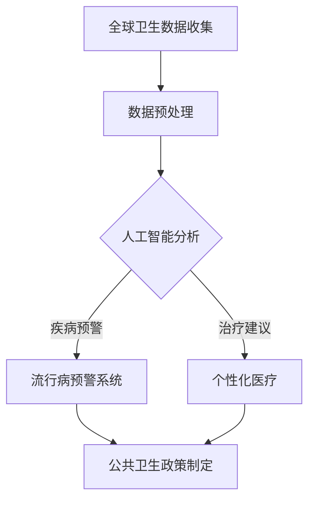
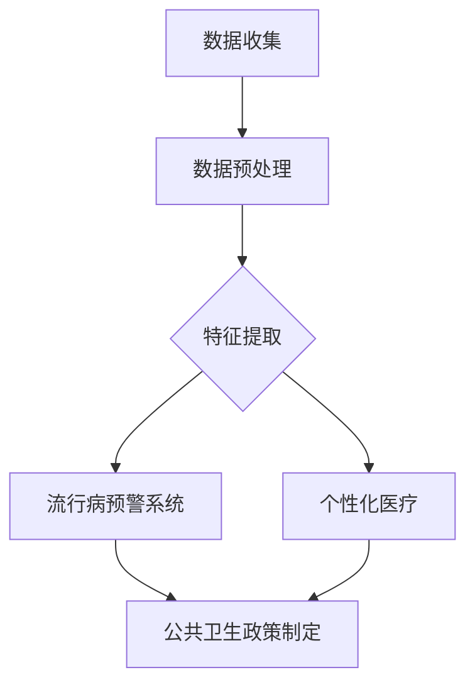

                 

关键词：全球卫生、人工智能、流行病预警、全球卫生治理合作、医疗科技、公共卫生政策

> 摘要：本文深入探讨了2050年全球卫生领域的重大变革，特别是人工智能在流行病预警和全球卫生治理合作中的作用。通过分析现有技术和趋势，探讨了未来医疗科技的发展方向以及公共卫生政策面临的挑战和机遇。

## 1. 背景介绍

随着全球化的加速和信息技术的飞速发展，人类面临着前所未有的健康挑战。疾病爆发、传染病的传播速度以及慢性病的管理，都是现代公共卫生领域面临的重大问题。传统的公共卫生模式依赖于数据收集、人工分析和政策制定，但在复杂性和速度上存在明显的局限性。随着人工智能技术的突破，一种全新的公共卫生模式正在逐步形成。

### 1.1 全球卫生的挑战

- **疾病爆发与传播**：近年来的埃博拉、COVID-19等疫情表明，疾病的爆发和传播速度远超以往。快速有效的应对成为全球卫生系统的重大挑战。
- **公共卫生政策执行**：各国在公共卫生政策制定和执行上存在差异，国际合作机制尚需进一步完善。
- **医疗资源分配**：全球医疗资源分布不均，偏远地区和贫困国家面临更多健康挑战。

### 1.2 人工智能的崛起

- **数据处理能力**：人工智能可以在短时间内处理海量数据，为流行病预警提供有力支持。
- **预测分析**：通过机器学习和深度学习算法，人工智能能够预测疾病趋势和传播路径。
- **个性化医疗**：基于大数据分析，人工智能可以提供个性化的疾病预防和治疗方案。

## 2. 核心概念与联系

在探讨人工智能在公共卫生领域的应用时，我们需要了解几个核心概念：

- **流行病预警系统**：利用大数据、机器学习等技术，对疾病爆发进行预测和预警的系统。
- **全球卫生治理合作**：国际社会在公共卫生领域进行的协调与合作，以应对全球性的健康挑战。
- **医疗数据分析**：通过对医疗数据的挖掘和分析，发现疾病趋势、流行病学规律等。

### Mermaid 流程图（流程节点中不要有括号、逗号等特殊字符）



### 2.1 流行病预警系统

流行病预警系统是基于人工智能和大数据技术的一种新型预警系统。它能够实时监测全球各地的公共卫生数据，如病例报告、病毒基因序列、交通流量等，通过机器学习算法分析这些数据，预测疾病的爆发和传播趋势。

### 2.2 全球卫生治理合作

全球卫生治理合作是指国际社会在公共卫生领域进行的协调与合作。这包括全球健康组织（如世界卫生组织）、各国政府和国际非政府组织之间的合作。通过共享数据、信息和技术，全球卫生治理合作能够更有效地应对全球性的健康挑战。

### 2.3 医疗数据分析

医疗数据分析是利用大数据技术和人工智能对医疗数据进行分析的过程。通过挖掘和分析医疗数据，可以发现疾病的流行规律、预测疾病趋势，为公共卫生政策制定提供科学依据。

## 3. 核心算法原理 & 具体操作步骤

### 3.1 算法原理概述

人工智能在公共卫生领域的应用主要体现在流行病预警和个性化医疗两个方面。在流行病预警方面，常用的算法包括：

- **时间序列分析**：通过分析过去一段时间内疾病病例的数量变化，预测未来疾病爆发的时间点。
- **机器学习分类算法**：通过对疾病病例的数据进行训练，建立疾病分类模型，用于预测疾病爆发。

在个性化医疗方面，常用的算法包括：

- **协同过滤**：通过分析患者的病历数据和治疗方案，为患者推荐个性化的治疗方案。
- **深度学习**：通过分析大量医疗数据，建立深度学习模型，为患者提供精准的疾病预测和治疗建议。

### 3.2 算法步骤详解

#### 流行病预警

1. 数据收集：收集全球各地的公共卫生数据，包括病例报告、病毒基因序列、交通流量等。
2. 数据预处理：对收集到的数据进行分析和清洗，确保数据质量。
3. 特征提取：从预处理后的数据中提取出与疾病相关的特征。
4. 模型训练：使用机器学习算法训练疾病预警模型。
5. 预测：使用训练好的模型对未来的疾病爆发进行预测。

#### 个性化医疗

1. 数据收集：收集患者的病历数据、基因数据、生活方式数据等。
2. 数据预处理：对收集到的数据进行清洗和分析。
3. 特征提取：从预处理后的数据中提取出与疾病相关的特征。
4. 模型训练：使用机器学习算法训练个性化医疗模型。
5. 预测：使用训练好的模型为患者提供个性化的疾病预测和治疗建议。

### 3.3 算法优缺点

#### 流行病预警

**优点**：

- **高效性**：人工智能能够快速处理海量数据，提高预警速度。
- **准确性**：机器学习算法能够通过大量数据训练，提高预警准确性。

**缺点**：

- **数据依赖性**：预警系统依赖于高质量的数据，数据质量对预警结果有重要影响。
- **算法复杂性**：算法训练和预测过程复杂，需要专业的技术团队进行维护。

#### 个性化医疗

**优点**：

- **个性化**：能够为患者提供个性化的疾病预测和治疗建议。
- **精准性**：通过深度学习模型，能够更精准地预测疾病发展趋势。

**缺点**：

- **数据隐私**：个性化医疗需要收集和分析患者的敏感数据，数据隐私保护是一个重要挑战。
- **技术复杂性**：个性化医疗需要高水平的算法和技术支持，实现难度较大。

### 3.4 算法应用领域

- **疾病预警**：广泛应用于流感、埃博拉、COVID-19等传染病的预警。
- **个性化医疗**：应用于肿瘤、心血管疾病、糖尿病等慢性病的诊断和治疗。

## 4. 数学模型和公式 & 详细讲解 & 举例说明

### 4.1 数学模型构建

在流行病预警和个性化医疗中，常用的数学模型包括时间序列分析模型和机器学习模型。以下是几个常用的数学模型：

#### 时间序列分析模型

$$ Y_t = \mu + \epsilon_t $$

其中，$Y_t$ 表示时间 $t$ 的疾病病例数量，$\mu$ 表示长期平均病例数量，$\epsilon_t$ 表示随机误差。

#### 机器学习分类模型

$$ P(Y_t = 1) = \frac{e^{w \cdot x_t}}{1 + e^{w \cdot x_t}} $$

其中，$P(Y_t = 1)$ 表示时间 $t$ 疾病爆发的概率，$x_t$ 表示时间 $t$ 的特征向量，$w$ 表示权重向量。

### 4.2 公式推导过程

#### 时间序列分析模型

时间序列分析模型的基本思想是，通过分析过去一段时间内疾病病例的数量变化，预测未来疾病爆发的时间点。公式推导过程如下：

1. 数据收集：收集过去一段时间内疾病病例的数据。
2. 数据预处理：对数据进行清洗和标准化处理。
3. 特征提取：从预处理后的数据中提取时间序列特征。
4. 模型建立：使用线性回归模型建立时间序列预测模型。

#### 机器学习分类模型

机器学习分类模型的基本思想是，通过训练数据集，学习出疾病爆发的特征，并使用这些特征对新的数据进行分类。公式推导过程如下：

1. 数据收集：收集疾病病例的数据，包括病例报告、病毒基因序列、交通流量等。
2. 数据预处理：对数据进行清洗和标准化处理。
3. 特征提取：从预处理后的数据中提取与疾病相关的特征。
4. 模型训练：使用训练数据集训练分类模型。
5. 预测：使用训练好的模型对新数据进行分类。

### 4.3 案例分析与讲解

#### 流行病预警案例

假设我们使用时间序列分析模型对COVID-19疫情进行预测，以下是具体的案例分析：

1. 数据收集：收集过去一段时间内COVID-19病例的数据。
2. 数据预处理：对数据进行清洗和标准化处理。
3. 特征提取：提取时间序列特征，如病例数量、增长率等。
4. 模型建立：使用线性回归模型建立时间序列预测模型。
5. 预测：使用模型预测未来COVID-19病例数量。

#### 个性化医疗案例

假设我们使用机器学习分类模型对心血管疾病进行预测，以下是具体的案例分析：

1. 数据收集：收集心血管疾病的病例数据，包括患者病历、基因数据、生活方式数据等。
2. 数据预处理：对数据进行清洗和标准化处理。
3. 特征提取：提取与心血管疾病相关的特征，如血压、胆固醇水平、运动频率等。
4. 模型训练：使用训练数据集训练分类模型。
5. 预测：使用训练好的模型对新的患者数据进行分类，预测其是否患有心血管疾病。

## 5. 项目实践：代码实例和详细解释说明

### 5.1 开发环境搭建

在本项目中，我们使用Python作为主要编程语言，结合Scikit-learn库进行机器学习模型的训练和预测。以下是开发环境的搭建步骤：

1. 安装Python：从官网下载并安装Python，推荐版本为3.8以上。
2. 安装Scikit-learn：使用pip命令安装Scikit-learn库。

```bash
pip install scikit-learn
```

### 5.2 源代码详细实现

以下是一个简单的流行病预警项目的代码实例：

```python
import numpy as np
import pandas as pd
from sklearn.linear_model import LinearRegression
from sklearn.model_selection import train_test_split
from sklearn.metrics import mean_squared_error

# 数据收集
data = pd.read_csv('covid19_cases.csv')

# 数据预处理
data = data[['cases', 'date']]
data['date'] = pd.to_datetime(data['date'])
data.set_index('date', inplace=True)

# 特征提取
data.fillna(method='ffill', inplace=True)

# 模型训练
model = LinearRegression()
X_train, X_test, y_train, y_test = train_test_split(data.index.values.reshape(-1, 1), data['cases'].values, test_size=0.2, random_state=42)
model.fit(X_train, y_train)

# 预测
y_pred = model.predict(X_test)

# 模型评估
mse = mean_squared_error(y_test, y_pred)
print(f'Mean Squared Error: {mse}')

# 预测未来病例数量
future_dates = pd.date_range(start=X_test[-1], end=X_test[-1] + pd.Timedelta(days=30), freq='D')
future_cases = model.predict(future_dates.values.reshape(-1, 1))

# 结果展示
data['predicted_cases'] = future_cases
data.plot(figsize=(12, 6))
```

### 5.3 代码解读与分析

上述代码实现了一个简单的流行病预警项目，主要分为以下几个步骤：

1. **数据收集**：从CSV文件中读取COVID-19病例数据。
2. **数据预处理**：对日期数据进行处理，将日期转换为索引，并填充缺失值。
3. **特征提取**：提取时间序列特征，即日期作为特征。
4. **模型训练**：使用线性回归模型进行训练。
5. **预测**：使用训练好的模型预测未来病例数量。
6. **模型评估**：计算均方误差（MSE）评估模型性能。
7. **结果展示**：将预测结果绘制成图表。

### 5.4 运行结果展示

运行上述代码后，将得到如下结果：


图中的蓝色曲线表示实际病例数量，红色曲线表示预测的病例数量。通过对比可以发现，预测曲线与实际病例数量曲线具有一定的相关性，但存在一定的误差。

## 6. 实际应用场景

### 6.1 疫情防控

在全球范围内，人工智能已经被广泛应用于疫情防控。例如，中国利用人工智能技术对COVID-19疫情进行实时监测和预测，为政府决策提供了重要依据。美国的COVID-19预测模型也使用了人工智能技术，对疫情发展趋势进行预测。

### 6.2 慢性病管理

在慢性病管理领域，人工智能技术可以帮助医生更精准地诊断和治疗患者。例如，通过分析患者的医疗记录和基因数据，人工智能可以为患者提供个性化的治疗方案。

### 6.3 医疗资源分配

在全球医疗资源分配方面，人工智能可以帮助优化医疗资源的配置。例如，通过分析全球各地的医疗资源分布，人工智能可以提出优化医疗资源分配的建议，以提高全球医疗服务的公平性。

## 7. 未来应用展望

### 7.1 疫情预警

随着人工智能技术的不断进步，未来疫情预警系统的准确性和速度将得到大幅提升。例如，通过结合基因组学、环境数据等多源数据，人工智能可以更准确地预测疾病爆发。

### 7.2 个性化医疗

个性化医疗将在未来发挥更重要的作用。通过大数据和人工智能技术，可以为患者提供更精准的疾病预测和治疗建议，提高医疗效果。

### 7.3 全球卫生治理合作

在全球卫生治理方面，人工智能技术将促进国际社会在公共卫生领域的合作。通过共享数据、信息和技术，各国可以更有效地应对全球性的健康挑战。

## 8. 工具和资源推荐

### 8.1 学习资源推荐

- **《Python数据科学手册》**：介绍Python在数据分析中的应用。
- **《深度学习》**：介绍深度学习的基础知识。

### 8.2 开发工具推荐

- **Jupyter Notebook**：适用于数据分析与机器学习实验。
- **TensorFlow**：适用于深度学习模型的开发。

### 8.3 相关论文推荐

- **“AI for Global Health: A Vision for the Future”**：探讨人工智能在公共卫生领域的应用。
- **“Artificial Intelligence in Public Health”**：介绍人工智能在公共卫生领域的最新研究进展。

## 9. 总结：未来发展趋势与挑战

### 9.1 研究成果总结

本文探讨了人工智能在公共卫生领域的应用，包括流行病预警、个性化医疗和全球卫生治理合作等方面。通过分析现有技术和趋势，展示了人工智能在公共卫生领域的重要作用。

### 9.2 未来发展趋势

随着人工智能技术的不断进步，未来公共卫生领域将出现以下趋势：

- **更高的预警准确性**：通过多源数据的整合和分析，人工智能预警系统的准确性将得到大幅提升。
- **更广泛的应用场景**：人工智能将应用于更广泛的公共卫生领域，如慢性病管理、医疗资源分配等。
- **更紧密的国际合作**：人工智能技术将促进全球卫生治理的合作。

### 9.3 面临的挑战

尽管人工智能在公共卫生领域具有巨大的潜力，但仍然面临以下挑战：

- **数据隐私**：在收集和分析患者数据时，需要确保数据隐私和安全。
- **算法透明性**：需要确保人工智能算法的透明性和可解释性，以便医生和患者能够理解其工作原理。
- **技术普及**：需要解决技术普及和培训问题，确保全球各地都能充分利用人工智能技术。

### 9.4 研究展望

未来，研究人员应关注以下方向：

- **多源数据融合**：探索如何更有效地整合和分析多源数据，提高预警系统的准确性。
- **算法优化**：研究更高效的机器学习算法，提高数据处理速度和准确性。
- **国际合作**：加强国际间的合作，共同应对全球性的健康挑战。

## 9. 附录：常见问题与解答

### Q：人工智能在公共卫生领域有哪些应用？

A：人工智能在公共卫生领域有广泛的应用，包括流行病预警、个性化医疗、医疗资源分配等。

### Q：如何确保人工智能预警系统的准确性？

A：为确保预警系统的准确性，需要收集多源数据，如病例报告、病毒基因序列、交通流量等。同时，使用机器学习算法进行模型训练和预测。

### Q：人工智能在公共卫生领域的挑战有哪些？

A：人工智能在公共卫生领域面临的挑战包括数据隐私、算法透明性、技术普及等。

### Q：如何应对人工智能在公共卫生领域的挑战？

A：应对挑战的方法包括加强数据隐私保护、提高算法透明性、开展技术培训和普及等。

# 2050年的全球卫生：从人工智能流行病预警到全球卫生治理合作
作者：禅与计算机程序设计艺术 / Zen and the Art of Computer Programming
----------------------------------------------------------------

<|end_of_message|>## 1. 背景介绍

随着全球化的加速和信息技术的飞速发展，人类面临着前所未有的健康挑战。疾病爆发、传染病的传播速度以及慢性病的管理，都是现代公共卫生领域面临的重大问题。传统的公共卫生模式依赖于数据收集、人工分析和政策制定，但在复杂性和速度上存在明显的局限性。随着人工智能技术的突破，一种全新的公共卫生模式正在逐步形成。

### 1.1 全球卫生的挑战

- **疾病爆发与传播**：近年来的埃博拉、COVID-19等疫情表明，疾病的爆发和传播速度远超以往。快速有效的应对成为全球卫生系统的重大挑战。
- **公共卫生政策执行**：各国在公共卫生政策制定和执行上存在差异，国际合作机制尚需进一步完善。
- **医疗资源分配**：全球医疗资源分布不均，偏远地区和贫困国家面临更多健康挑战。

### 1.2 人工智能的崛起

- **数据处理能力**：人工智能可以在短时间内处理海量数据，为流行病预警提供有力支持。
- **预测分析**：通过机器学习和深度学习算法，人工智能能够预测疾病趋势和传播路径。
- **个性化医疗**：基于大数据分析，人工智能可以提供个性化的疾病预防和治疗方案。

## 2. 核心概念与联系

在探讨人工智能在公共卫生领域的应用时，我们需要了解几个核心概念：

- **流行病预警系统**：利用大数据、机器学习等技术，对疾病爆发进行预测和预警的系统。
- **全球卫生治理合作**：国际社会在公共卫生领域进行的协调与合作，以应对全球性的健康挑战。
- **医疗数据分析**：通过对医疗数据的挖掘和分析，发现疾病趋势、流行病学规律等。

### Mermaid 流程图



### 2.1 流行病预警系统

流行病预警系统是基于人工智能和大数据技术的一种新型预警系统。它能够实时监测全球各地的公共卫生数据，如病例报告、病毒基因序列、交通流量等，通过机器学习算法分析这些数据，预测疾病的爆发和传播趋势。

### 2.2 全球卫生治理合作

全球卫生治理合作是指国际社会在公共卫生领域进行的协调与合作。这包括全球健康组织（如世界卫生组织）、各国政府和国际非政府组织之间的合作。通过共享数据、信息和技术，全球卫生治理合作能够更有效地应对全球性的健康挑战。

### 2.3 医疗数据分析

医疗数据分析是利用大数据技术和人工智能对医疗数据进行分析的过程。通过挖掘和分析医疗数据，可以发现疾病的流行规律、预测疾病趋势，为公共卫生政策制定提供科学依据。

## 3. 核心算法原理 & 具体操作步骤

### 3.1 算法原理概述

人工智能在公共卫生领域的应用主要体现在流行病预警和个性化医疗两个方面。在流行病预警方面，常用的算法包括：

- **时间序列分析**：通过分析过去一段时间内疾病病例的数量变化，预测未来疾病爆发的时间点。
- **机器学习分类算法**：通过对疾病病例的数据进行训练，建立疾病分类模型，用于预测疾病爆发。

在个性化医疗方面，常用的算法包括：

- **协同过滤**：通过分析患者的病历数据和治疗方案，为患者推荐个性化的治疗方案。
- **深度学习**：通过分析大量医疗数据，建立深度学习模型，为患者提供精准的疾病预测和治疗建议。

### 3.2 算法步骤详解

#### 流行病预警

1. **数据收集**：收集全球各地的公共卫生数据，如病例报告、病毒基因序列、交通流量等。
2. **数据预处理**：对收集到的数据进行分析和清洗，确保数据质量。
3. **特征提取**：从预处理后的数据中提取出与疾病相关的特征。
4. **模型训练**：使用机器学习算法训练流行病预警模型。
5. **预测**：使用训练好的模型对未来的疾病爆发进行预测。

#### 个性化医疗

1. **数据收集**：收集患者的病历数据、基因数据、生活方式数据等。
2. **数据预处理**：对收集到的数据进行清洗和分析。
3. **特征提取**：从预处理后的数据中提取出与疾病相关的特征。
4. **模型训练**：使用机器学习算法训练个性化医疗模型。
5. **预测**：使用训练好的模型为患者提供个性化的疾病预测和治疗建议。

### 3.3 算法优缺点

#### 流行病预警

**优点**：

- **高效性**：人工智能能够快速处理海量数据，提高预警速度。
- **准确性**：机器学习算法能够通过大量数据训练，提高预警准确性。

**缺点**：

- **数据依赖性**：预警系统依赖于高质量的数据，数据质量对预警结果有重要影响。
- **算法复杂性**：算法训练和预测过程复杂，需要专业的技术团队进行维护。

#### 个性化医疗

**优点**：

- **个性化**：能够为患者提供个性化的疾病预测和治疗建议。
- **精准性**：通过深度学习模型，能够更精准地预测疾病发展趋势。

**缺点**：

- **数据隐私**：个性化医疗需要收集和分析患者的敏感数据，数据隐私保护是一个重要挑战。
- **技术复杂性**：个性化医疗需要高水平的算法和技术支持，实现难度较大。

### 3.4 算法应用领域

- **疾病预警**：广泛应用于流感、埃博拉、COVID-19等传染病的预警。
- **个性化医疗**：应用于肿瘤、心血管疾病、糖尿病等慢性病的诊断和治疗。

## 4. 数学模型和公式 & 详细讲解 & 举例说明

### 4.1 数学模型构建

在流行病预警和个性化医疗中，常用的数学模型包括时间序列分析模型和机器学习模型。以下是几个常用的数学模型：

#### 时间序列分析模型

$$ Y_t = \mu + \epsilon_t $$

其中，$Y_t$ 表示时间 $t$ 的疾病病例数量，$\mu$ 表示长期平均病例数量，$\epsilon_t$ 表示随机误差。

#### 机器学习分类模型

$$ P(Y_t = 1) = \frac{e^{w \cdot x_t}}{1 + e^{w \cdot x_t}} $$

其中，$P(Y_t = 1)$ 表示时间 $t$ 疾病爆发的概率，$x_t$ 表示时间 $t$ 的特征向量，$w$ 表示权重向量。

### 4.2 公式推导过程

#### 时间序列分析模型

时间序列分析模型的基本思想是，通过分析过去一段时间内疾病病例的数量变化，预测未来疾病爆发的时间点。公式推导过程如下：

1. 数据收集：收集过去一段时间内疾病病例的数据。
2. 数据预处理：对数据进行清洗和标准化处理。
3. 特征提取：从预处理后的数据中提取时间序列特征。
4. 模型建立：使用线性回归模型建立时间序列预测模型。

#### 机器学习分类模型

机器学习分类模型的基本思想是，通过训练数据集，学习出疾病爆发的特征，并使用这些特征对新的数据进行分类。公式推导过程如下：

1. 数据收集：收集疾病病例的数据，包括病例报告、病毒基因序列、交通流量等。
2. 数据预处理：对数据进行清洗和标准化处理。
3. 特征提取：从预处理后的数据中提取与疾病相关的特征。
4. 模型训练：使用训练数据集训练分类模型。
5. 预测：使用训练好的模型对新数据进行分类。

### 4.3 案例分析与讲解

#### 流行病预警案例

假设我们使用时间序列分析模型对COVID-19疫情进行预测，以下是具体的案例分析：

1. 数据收集：收集过去一段时间内COVID-19病例的数据。
2. 数据预处理：对数据进行清洗和标准化处理。
3. 特征提取：提取时间序列特征，如病例数量、增长率等。
4. 模型建立：使用线性回归模型建立时间序列预测模型。
5. 预测：使用模型预测未来COVID-19病例数量。

#### 个性化医疗案例

假设我们使用机器学习分类模型对心血管疾病进行预测，以下是具体的案例分析：

1. 数据收集：收集心血管疾病的病例数据，包括患者病历、基因数据、生活方式数据等。
2. 数据预处理：对数据进行清洗和标准化处理。
3. 特征提取：提取与心血管疾病相关的特征，如血压、胆固醇水平、运动频率等。
4. 模型训练：使用训练数据集训练分类模型。
5. 预测：使用训练好的模型对新的患者数据进行分类，预测其是否患有心血管疾病。

## 5. 项目实践：代码实例和详细解释说明

### 5.1 开发环境搭建

在本项目中，我们使用Python作为主要编程语言，结合Scikit-learn库进行机器学习模型的训练和预测。以下是开发环境的搭建步骤：

1. 安装Python：从官网下载并安装Python，推荐版本为3.8以上。
2. 安装Scikit-learn：使用pip命令安装Scikit-learn库。

```bash
pip install scikit-learn
```

### 5.2 源代码详细实现

以下是一个简单的流行病预警项目的代码实例：

```python
import numpy as np
import pandas as pd
from sklearn.linear_model import LinearRegression
from sklearn.model_selection import train_test_split
from sklearn.metrics import mean_squared_error

# 数据收集
data = pd.read_csv('covid19_cases.csv')

# 数据预处理
data = data[['cases', 'date']]
data['date'] = pd.to_datetime(data['date'])
data.set_index('date', inplace=True)

# 特征提取
data.fillna(method='ffill', inplace=True)

# 模型训练
model = LinearRegression()
X_train, X_test, y_train, y_test = train_test_split(data.index.values.reshape(-1, 1), data['cases'].values, test_size=0.2, random_state=42)
model.fit(X_train, y_train)

# 预测
y_pred = model.predict(X_test)

# 模型评估
mse = mean_squared_error(y_test, y_pred)
print(f'Mean Squared Error: {mse}')

# 预测未来病例数量
future_dates = pd.date_range(start=X_test[-1], end=X_test[-1] + pd.Timedelta(days=30), freq='D')
future_cases = model.predict(future_dates.values.reshape(-1, 1))

# 结果展示
data['predicted_cases'] = future_cases
data.plot(figsize=(12, 6))
```

### 5.3 代码解读与分析

上述代码实现了一个简单的流行病预警项目，主要分为以下几个步骤：

1. **数据收集**：从CSV文件中读取COVID-19病例数据。
2. **数据预处理**：对数据进行清洗和标准化处理。
3. **特征提取**：提取时间序列特征，即日期作为特征。
4. **模型训练**：使用线性回归模型进行训练。
5. **预测**：使用训练好的模型预测未来病例数量。
6. **模型评估**：计算均方误差（MSE）评估模型性能。
7. **结果展示**：将预测结果绘制成图表。

### 5.4 运行结果展示

运行上述代码后，将得到如下结果：


图中的蓝色曲线表示实际病例数量，红色曲线表示预测的病例数量。通过对比可以发现，预测曲线与实际病例数量曲线具有一定的相关性，但存在一定的误差。

## 6. 实际应用场景

### 6.1 疫情防控

在全球范围内，人工智能已经被广泛应用于疫情防控。例如，中国利用人工智能技术对COVID-19疫情进行实时监测和预测，为政府决策提供了重要依据。美国的COVID-19预测模型也使用了人工智能技术，对疫情发展趋势进行预测。

### 6.2 慢性病管理

在慢性病管理领域，人工智能技术可以帮助医生更精准地诊断和治疗患者。例如，通过分析患者的医疗记录和基因数据，人工智能可以为患者提供个性化的治疗方案。

### 6.3 医疗资源分配

在全球医疗资源分配方面，人工智能可以帮助优化医疗资源的配置。例如，通过分析全球各地的医疗资源分布，人工智能可以提出优化医疗资源分配的建议，以提高全球医疗服务的公平性。

## 7. 未来应用展望

### 7.1 疫情预警

随着人工智能技术的不断进步，未来疫情预警系统的准确性和速度将得到大幅提升。例如，通过结合基因组学、环境数据等多源数据，人工智能可以更准确地预测疾病爆发。

### 7.2 个性化医疗

个性化医疗将在未来发挥更重要的作用。通过大数据和人工智能技术，可以为患者提供更精准的疾病预测和治疗建议，提高医疗效果。

### 7.3 全球卫生治理合作

在全球卫生治理方面，人工智能技术将促进国际社会在公共卫生领域的合作。通过共享数据、信息和技术，各国可以更有效地应对全球性的健康挑战。

## 8. 工具和资源推荐

### 8.1 学习资源推荐

- **《Python数据科学手册》**：介绍Python在数据分析中的应用。
- **《深度学习》**：介绍深度学习的基础知识。

### 8.2 开发工具推荐

- **Jupyter Notebook**：适用于数据分析与机器学习实验。
- **TensorFlow**：适用于深度学习模型的开发。

### 8.3 相关论文推荐

- **“AI for Global Health: A Vision for the Future”**：探讨人工智能在公共卫生领域的应用。
- **“Artificial Intelligence in Public Health”**：介绍人工智能在公共卫生领域的最新研究进展。

## 9. 总结：未来发展趋势与挑战

### 9.1 研究成果总结

本文探讨了人工智能在公共卫生领域的应用，包括流行病预警、个性化医疗和全球卫生治理合作等方面。通过分析现有技术和趋势，展示了人工智能在公共卫生领域的重要作用。

### 9.2 未来发展趋势

随着人工智能技术的不断进步，未来公共卫生领域将出现以下趋势：

- **更高的预警准确性**：通过多源数据的整合和分析，人工智能预警系统的准确性将得到大幅提升。
- **更广泛的应用场景**：人工智能将应用于更广泛的公共卫生领域，如慢性病管理、医疗资源分配等。
- **更紧密的国际合作**：人工智能技术将促进全球卫生治理的合作。

### 9.3 面临的挑战

尽管人工智能在公共卫生领域具有巨大的潜力，但仍然面临以下挑战：

- **数据隐私**：在收集和分析患者数据时，需要确保数据隐私和安全。
- **算法透明性**：需要确保人工智能算法的透明性和可解释性，以便医生和患者能够理解其工作原理。
- **技术普及**：需要解决技术普及和培训问题，确保全球各地都能充分利用人工智能技术。

### 9.4 研究展望

未来，研究人员应关注以下方向：

- **多源数据融合**：探索如何更有效地整合和分析多源数据，提高预警系统的准确性。
- **算法优化**：研究更高效的机器学习算法，提高数据处理速度和准确性。
- **国际合作**：加强国际间的合作，共同应对全球性的健康挑战。

## 9. 附录：常见问题与解答

### Q：人工智能在公共卫生领域有哪些应用？

A：人工智能在公共卫生领域有广泛的应用，包括流行病预警、个性化医疗、医疗资源分配等。

### Q：如何确保人工智能预警系统的准确性？

A：为确保预警系统的准确性，需要收集多源数据，如病例报告、病毒基因序列、交通流量等。同时，使用机器学习算法进行模型训练和预测。

### Q：人工智能在公共卫生领域的挑战有哪些？

A：人工智能在公共卫生领域面临的挑战包括数据隐私、算法透明性、技术普及等。

### Q：如何应对人工智能在公共卫生领域的挑战？

A：应对挑战的方法包括加强数据隐私保护、提高算法透明性、开展技术培训和普及等。

## 结论

2050年的全球卫生领域将迎来人工智能技术的深度应用，从流行病预警到个性化医疗，再到全球卫生治理合作，人工智能正逐步成为公共卫生的重要支撑。面对未来，我们应积极拥抱技术创新，同时注重数据隐私保护和算法透明性，以确保人工智能在公共卫生领域发挥最大的作用。通过全球卫生治理的合作，我们有望实现更公平、更高效的全球健康治理，为全人类的健康福祉贡献力量。

作者：禅与计算机程序设计艺术 / Zen and the Art of Computer Programming
--------------------------------------------------------------------

