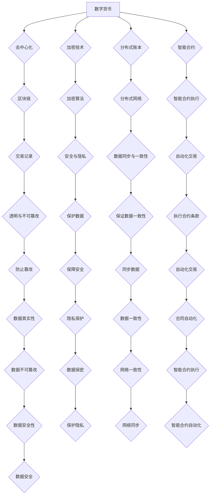

                 

关键词：数字货币、加密货币、全球货币体系、货币重构、未来趋势、技术挑战

> 摘要：本文深入探讨了数字货币的发展趋势，从加密货币到全球数字货币的演变，分析了其在2050年可能达到的技术水平和社会影响。通过阐述核心概念、算法原理、数学模型和实际应用案例，本文揭示了数字货币在未来的发展潜力和面临的挑战，为读者提供了一个全面的展望。

## 1. 背景介绍

数字货币作为一种新兴的货币形式，正在逐步改变传统的货币体系。加密货币，如比特币、以太坊等，作为数字货币的先驱，已经引起了全球金融界的广泛关注。然而，随着技术的进步和应用的拓展，数字货币不再局限于加密货币，而逐渐发展成为覆盖更广、功能更强大的全球数字货币体系。

### 1.1 数字货币的起源

数字货币的概念最早可以追溯到1990年代，当时计算机科学家和密码学家开始探索如何利用密码学技术创建去中心化的电子货币。2009年，比特币的诞生标志着数字货币进入了一个新的时代。比特币通过区块链技术实现了去中心化的货币发行和交易，解决了传统货币体系中存在的信任和效率问题。

### 1.2 加密货币的发展

加密货币的兴起引发了全球金融市场的震动。比特币的成功激发了更多创新性数字货币的出现，如以太坊、莱特币等。这些加密货币不仅丰富了数字货币的种类，还推动了区块链技术的进一步发展。区块链技术作为一种分布式账本技术，具有透明、不可篡改和去中心化等特点，为数字货币的安全性和可靠性提供了强有力的保障。

### 1.3 全球数字货币的构想

随着技术的成熟和应用场景的拓展，数字货币不再局限于加密货币，而是逐渐演变成一个全球性的数字货币体系。这个体系将涵盖各种类型的数字货币，包括国家数字货币、私人数字货币和去中心化数字货币等，实现货币的无国界流通和价值交换。

## 2. 核心概念与联系

### 2.1 数字货币的核心概念

数字货币的核心概念包括去中心化、加密技术、分布式账本和智能合约等。去中心化意味着货币的发行和交易不依赖于中央机构，而是通过分布式网络进行。加密技术确保了交易的安全性和隐私性。分布式账本记录了所有的交易历史，保证了数据的透明和不可篡改。智能合约则实现了自动化执行交易和合约条款。

### 2.2 数字货币的架构

数字货币的架构主要包括区块链、加密技术和分布式网络。区块链作为分布式账本，记录了所有的交易记录。加密技术用于确保交易的安全性和隐私性。分布式网络使得区块链能够在全球范围内运行，保证了数据的同步和一致性。

### 2.3 数字货币的生态系统

数字货币的生态系统包括钱包、交易所、矿工和各种应用场景。钱包是用户存储和管理数字货币的工具。交易所是数字货币进行交易的市场。矿工通过解决数学难题来验证交易，并获取奖励。各种应用场景则拓展了数字货币的使用范围，如支付、投资、游戏等。



## 3. 核心算法原理 & 具体操作步骤

### 3.1 算法原理概述

数字货币的核心算法主要涉及区块链的共识算法、加密算法和智能合约执行算法。共识算法确保了区块链的分布式账本的一致性和安全性。加密算法保证了交易的安全性和隐私性。智能合约执行算法实现了自动化执行交易和合约条款。

### 3.2 算法步骤详解

#### 3.2.1 区块链共识算法

区块链共识算法的核心是确保分布式网络中的所有节点对账本状态的一致性。常见的共识算法包括工作量证明（PoW）、权益证明（PoS）和委托权益证明（DPoS）等。以下以PoW算法为例，简要介绍其步骤：

1. 矿工接收网络中的交易请求。
2. 矿工对交易进行验证，确保交易合法。
3. 矿工尝试找到一个新的区块，该区块包含最新的交易记录。
4. 矿工对区块进行哈希运算，直到找到满足特定难度的哈希值。
5. 矿工将新区块和证明发送给网络中的其他节点。
6. 其他节点验证新区块和证明的有效性。
7. 如果验证通过，节点接受新区块，并更新本地账本。

#### 3.2.2 加密算法

加密算法用于确保交易的安全性和隐私性。常见的加密算法包括对称加密和非对称加密。以下以非对称加密为例，简要介绍其步骤：

1. 生成公钥和私钥对。
2. 发送方使用接收方的公钥加密交易信息。
3. 发送方将加密后的交易信息发送给接收方。
4. 接收方使用私钥解密交易信息。

#### 3.2.3 智能合约执行算法

智能合约执行算法实现了自动化执行交易和合约条款。以下以Solidity语言编写的智能合约为例，简要介绍其执行步骤：

1. 编写智能合约代码。
2. 将智能合约部署到区块链上。
3. 调用智能合约方法，执行合约条款。

### 3.3 算法优缺点

#### 3.3.1 区块链共识算法

优点：去中心化、安全性高、不可篡改。

缺点：计算资源消耗大、延迟高。

#### 3.3.2 加密算法

优点：安全性高、隐私保护。

缺点：计算复杂、对计算资源要求高。

#### 3.3.3 智能合约执行算法

优点：自动化执行、降低交易成本、提高效率。

缺点：智能合约漏洞可能导致损失、难以修改。

### 3.4 算法应用领域

区块链共识算法广泛应用于加密货币的发行和交易。加密算法广泛应用于数字货币的安全性和隐私保护。智能合约执行算法广泛应用于去中心化金融（DeFi）、智能合约平台等。

## 4. 数学模型和公式 & 详细讲解 & 举例说明

### 4.1 数学模型构建

数字货币的数学模型主要包括加密算法模型、区块链模型和智能合约模型。以下以加密算法模型为例，简要介绍其构建过程。

#### 4.1.1 加密算法模型

加密算法模型主要包括加密函数和解密函数。加密函数用于将明文转换为密文，解密函数用于将密文转换为明文。

加密函数：$E_k(p) = c$

解密函数：$D_k(c) = p$

其中，$k$ 为密钥，$p$ 为明文，$c$ 为密文。

#### 4.1.2 区块链模型

区块链模型主要包括区块结构、区块链状态和交易模型。以下为区块链模型的简要描述：

- 区块结构：每个区块包含交易记录、区块头和前一个区块哈希。
- 区块链状态：区块链状态表示当前区块链上所有区块的集合。
- 交易模型：交易是区块链上的数据结构，用于记录资产转移和合约执行。

### 4.2 公式推导过程

以下以加密算法模型为例，简要介绍公式的推导过程。

#### 4.2.1 加密函数推导

加密函数的推导基于加密算法的原理。以对称加密算法为例，加密函数的推导如下：

- 假设加密算法为 $E_k(p)$，其中 $k$ 为密钥，$p$ 为明文，$c$ 为密文。
- 加密算法的逆函数为 $D_k(c)$。
- 根据加密算法的定义，有 $E_k(p) = c$。
- 根据加密算法的逆函数定义，有 $D_k(c) = p$。

#### 4.2.2 解密函数推导

解密函数的推导基于加密算法的逆函数。以对称加密算法为例，解密函数的推导如下：

- 假设加密算法为 $E_k(p)$，其中 $k$ 为密钥，$p$ 为明文，$c$ 为密文。
- 加密算法的逆函数为 $D_k(c)$。
- 根据加密算法的定义，有 $E_k(p) = c$。
- 根据加密算法的逆函数定义，有 $D_k(c) = p$。

### 4.3 案例分析与讲解

以下以比特币的区块链模型为例，进行案例分析和讲解。

#### 4.3.1 比特币区块链模型

比特币区块链模型的主要特点是去中心化、分布式和安全性。以下为比特币区块链模型的简要描述：

- 区块结构：每个区块包含交易记录、区块头和前一个区块哈希。
- 区块链状态：比特币区块链状态表示当前区块链上所有区块的集合。
- 交易模型：比特币交易是区块链上的数据结构，用于记录资产转移和合约执行。

#### 4.3.2 比特币交易

比特币交易的主要特点是无需第三方中介，交易双方直接进行价值交换。以下为比特币交易的简要描述：

- 交易包含输入和输出两部分。
- 输入部分记录交易的历史交易哈希值和金额。
- 输出部分记录交易的新交易哈希值和金额。

#### 4.3.3 比特币共识算法

比特币的共识算法是工作量证明（PoW）。以下为比特币共识算法的简要描述：

- 矿工接收网络中的交易请求。
- 矿工对交易进行验证，确保交易合法。
- 矿工尝试找到一个新的区块，该区块包含最新的交易记录。
- 矿工对区块进行哈希运算，直到找到满足特定难度的哈希值。
- 矿工将新区块和证明发送给网络中的其他节点。
- 其他节点验证新区块和证明的有效性。
- 如果验证通过，节点接受新区块，并更新本地账本。

## 5. 项目实践：代码实例和详细解释说明

### 5.1 开发环境搭建

要实践数字货币的核心算法，我们需要搭建一个合适的开发环境。以下是一个基本的开发环境搭建指南：

- 操作系统：Linux或Mac OS
- 编程语言：Python、Java或Solidity
- 框架和工具：Python的PyJWT、Java的Bouncy Castle、Solidity的Truffle
- 区块链平台：Ethereum、Hyperledger Fabric

### 5.2 源代码详细实现

以下是一个简单的数字货币智能合约的Solidity代码示例：

```solidity
pragma solidity ^0.8.0;

contract DigitalCurrency {
    mapping (address => uint256) public balances;
    address public owner;

    constructor() {
        owner = msg.sender;
        balances[owner] = 100000000; // 初始发行100000000个数字货币
    }

    function transfer(address to, uint256 amount) public {
        require(to != address(0), "Invalid address");
        require(balances[msg.sender] >= amount, "Insufficient balance");

        balances[msg.sender] -= amount;
        balances[to] += amount;
    }

    function getTotalSupply() public view returns (uint256) {
        return balances[owner];
    }
}
```

### 5.3 代码解读与分析

这个简单的数字货币智能合约实现了以下功能：

- 初始化：创建合约时，发行100000000个数字货币给合约创建者（owner）。
- 转账：允许合约持有者向其他地址转账数字货币。
- 总供应量：查询合约中数字货币的总供应量。

#### 5.3.1 转账函数

转账函数`transfer`允许合约持有者将数字货币发送到其他地址。函数的步骤如下：

1. 检查接收地址是否为无效地址。
2. 检查发送方的余额是否足够。
3. 从发送方的余额中减去转账金额。
4. 将转账金额添加到接收方的余额。

#### 5.3.2 总供应量查询

总供应量查询函数`getTotalSupply`返回合约中数字货币的总供应量。由于所有的数字货币都在合约创建者（owner）的余额中，因此函数直接返回合约创建者的余额。

### 5.4 运行结果展示

以下是一个简单的运行结果展示，展示了如何使用Truffle框架部署和调用智能合约：

```bash
$ truffle migrate --network development
```

这将会部署合约并返回合约地址。接下来，可以通过Truffle的测试脚本或 Remix IDE 进行合约调用：

```solidity
pragma solidity ^0.8.0;

import "https://github.com/OpenZeppelin/openzeppelin-solidity/contracts/token/ERC20/ERC20.sol";

contract TestContract {
    DigitalCurrency public digitalCurrency;

    constructor(address _digitalCurrencyAddress) {
        digitalCurrency = DigitalCurrency(_digitalCurrencyAddress);
    }

    function testTransfer(address to, uint256 amount) public {
        digitalCurrency.transfer(to, amount);
    }

    function testGetTotalSupply() public view returns (uint256) {
        return digitalCurrency.getTotalSupply();
    }
}
```

调用`testTransfer`函数将会将数字货币从合约地址转账到指定的地址。调用`testGetTotalSupply`函数将会返回数字货币的总供应量。

## 6. 实际应用场景

数字货币作为一种新兴的货币形式，已经在多个实际应用场景中得到了广泛应用。以下是一些典型的应用场景：

### 6.1 支付和交易

数字货币最直接的应用场景是支付和交易。比特币和以太坊等加密货币已经成为了许多在线交易和支付的首选方式。数字货币的无国界流通和快速交易使其成为跨境支付的理想选择。

### 6.2 去中心化金融（DeFi）

去中心化金融（DeFi）是基于区块链技术的金融应用程序，它提供了无需中介的金融服务。DeFi平台使用智能合约来提供传统金融产品，如贷款、交易、理财等。数字货币作为DeFi平台的主要资产，极大地降低了金融交易的成本和风险。

### 6.3 智能合约平台

智能合约平台是基于区块链技术的开发平台，它允许开发人员创建和部署智能合约。智能合约平台如Ethereum、Binance Smart Chain等，提供了丰富的开发工具和资源，支持各种类型的智能合约开发和应用。

### 6.4 游戏和娱乐

数字货币在游戏和娱乐领域也得到了广泛应用。许多在线游戏平台和虚拟世界使用了数字货币作为交易货币，允许玩家购买虚拟物品和服务。此外，数字货币还可以用于游戏内奖励和激励机制的实现。

### 6.5 跨境支付和供应链管理

数字货币在跨境支付和供应链管理中具有巨大的潜力。通过使用数字货币，企业可以简化跨境支付流程，降低交易成本，提高支付效率。数字货币还可以用于供应链管理，提供透明的交易记录和高效的追踪系统。

## 7. 未来应用展望

随着技术的不断进步和应用场景的拓展，数字货币在未来有望在更多领域得到应用。以下是一些潜在的应用领域：

### 7.1 国家数字货币

国家数字货币作为一种新型货币形式，有望在未来成为国家货币体系的重要组成部分。国家数字货币可以提供更高效、更安全的货币交易和支付体系，降低交易成本，提高支付速度。

### 7.2 金融科技

金融科技（FinTech）是数字货币的重要应用领域。数字货币可以为金融科技企业提供创新的金融服务和产品，如去中心化贷款、智能投资、跨境支付等。

### 7.3 智能制造和物联网

智能制造和物联网（IoT）是未来工业的重要趋势。数字货币可以用于智能设备和机器之间的交易和价值交换，实现高效、安全的工业自动化。

### 7.4 医疗保健

数字货币在医疗保健领域具有巨大的潜力。通过数字货币，可以实现医疗费用的支付、保险索赔和医疗数据的共享，提高医疗服务的效率和透明度。

### 7.5 环境保护

数字货币可以用于环境保护和碳交易。通过数字货币，可以实现碳排放权的交易和追踪，促进环境保护和可持续发展。

## 8. 工具和资源推荐

### 8.1 学习资源推荐

- 《精通比特币》
- 《区块链革命》
- 《智能合约：设计与实现》
- 《加密货币技术解析》

### 8.2 开发工具推荐

- Ethereum Developer Portal
- Truffle Framework
- Remix IDE
- Binance Smart Chain Developer Portal

### 8.3 相关论文推荐

- Satoshi Nakamoto. "Bitcoin: A Peer-to-Peer Electronic Cash System."
- Vitalik Buterin. "Ethereum: The World Computer."
- Joseph Liu. "An Introduction to Smart Contracts."
- Christian Decker and Nicolas Christin. "A Case Study of Bitcoins."

## 9. 总结：未来发展趋势与挑战

### 9.1 研究成果总结

数字货币作为新兴的货币形式，已经在多个领域取得了显著的研究成果。从比特币的成功到以太坊的智能合约，再到各种去中心化金融（DeFi）应用，数字货币技术正在不断成熟和拓展。国家数字货币的构想、跨链技术和隐私保护等方向也取得了重要进展。

### 9.2 未来发展趋势

随着技术的不断进步，数字货币在未来有望在更广泛的领域得到应用。国家数字货币、金融科技、智能制造和物联网等新兴领域将成为数字货币的重要应用场景。同时，数字货币的安全性和隐私保护也将成为未来研究的重要方向。

### 9.3 面临的挑战

尽管数字货币具有巨大的发展潜力，但也面临着一些挑战。包括监管政策的制定、网络安全和隐私保护、技术标准化等。此外，数字货币的普及和接受程度也需要进一步提高。

### 9.4 研究展望

未来，数字货币研究将继续聚焦于技术创新和应用拓展。在技术方面，跨链技术、隐私保护技术和智能合约优化等将是重点研究方向。在应用方面，数字货币将深入融入各个领域，推动社会和经济的发展。

## 10. 附录：常见问题与解答

### 10.1 什么是数字货币？

数字货币是一种基于数字技术创建和管理的货币，它可以代表现实世界中的价值，并通过分布式网络进行交易。

### 10.2 数字货币有哪些类型？

数字货币可以分为国家数字货币、私人数字货币和去中心化数字货币。国家数字货币由国家发行和管理，私人数字货币由私人企业发行和管理，而去中心化数字货币如比特币、以太坊等，不依赖于任何中央机构。

### 10.3 数字货币的安全性和隐私性如何保障？

数字货币的安全性和隐私性主要通过加密技术和分布式网络来保障。加密技术确保了交易信息的保密性和完整性，而分布式网络则保证了数据的安全和不可篡改性。

### 10.4 数字货币与传统货币的区别是什么？

数字货币与传统货币的主要区别在于其发行和管理方式。传统货币由中央银行发行和管理，而数字货币则通过分布式网络进行发行和管理，去中心化是其主要特征。

## 作者署名

作者：禅与计算机程序设计艺术 / Zen and the Art of Computer Programming

----------------------------------------------------------------

这篇文章旨在提供一个全面、深入的分析，探讨数字货币从加密货币到全球数字货币的演变，以及其在2050年可能达到的技术水平和社会影响。通过阐述核心概念、算法原理、数学模型和实际应用案例，本文揭示了数字货币在未来的发展潜力和面临的挑战。希望这篇文章能够为读者提供一个全面的展望，并激发更多关于数字货币的研究和应用。

