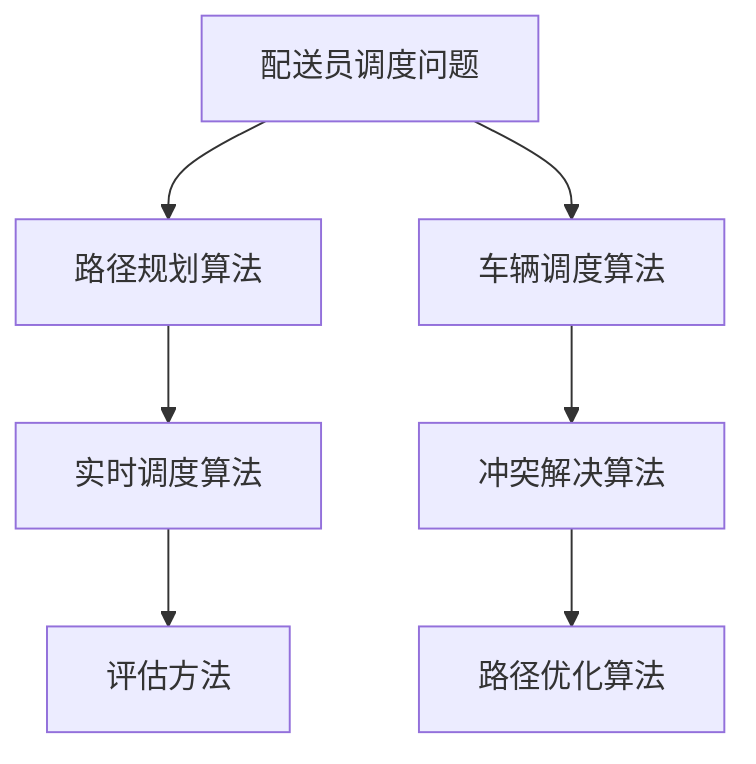
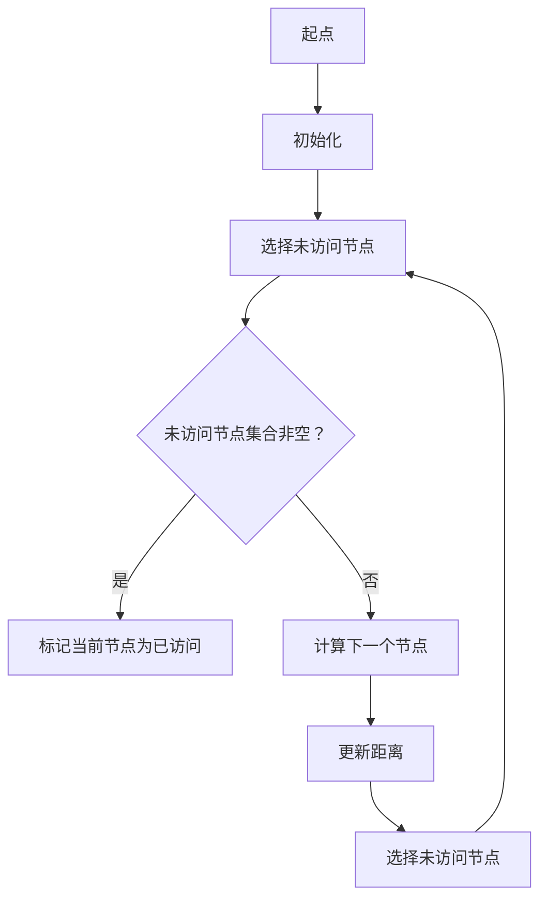
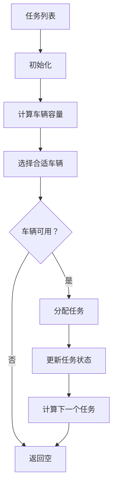
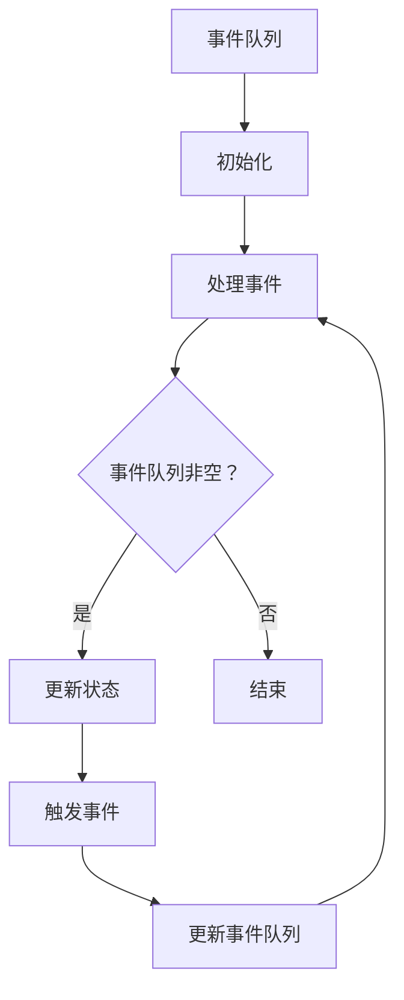
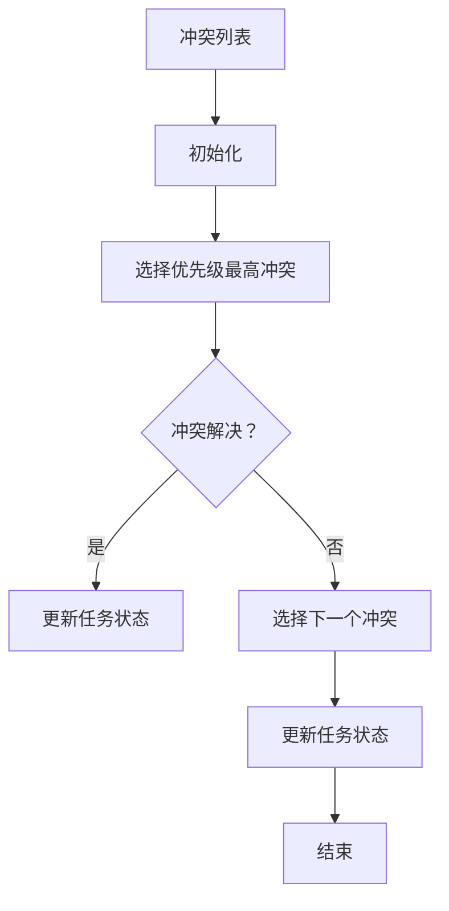
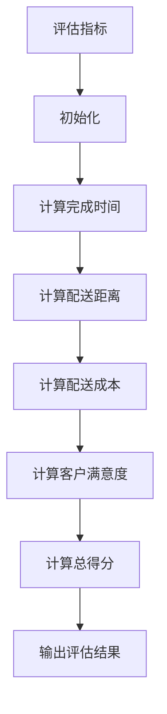
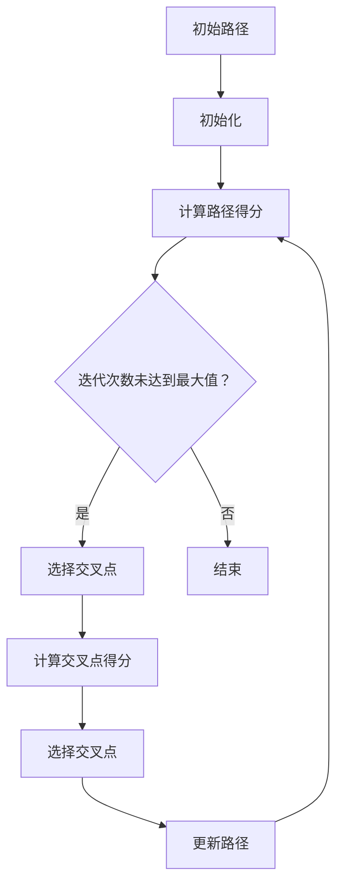

                 

关键词：美团、配送员、调度算法、面试题、技术博客

摘要：本文旨在汇总2025年美团社招配送员调度算法工程师的面试题，通过对这些问题的深入分析，帮助读者更好地理解和掌握配送员调度算法的核心概念和技术原理。

## 1. 背景介绍

在2025年的美团，配送员调度算法作为物流系统的核心组件，承担着优化配送效率、降低成本和提升客户满意度的重要任务。随着外卖、电商等业务的发展，配送员调度问题变得日益复杂。本文将对美团社招配送员调度算法工程师的面试题进行详细解答，帮助读者深入了解这一领域的技术原理和应用实践。

### 1.1 面试题汇总

- 面试题1：什么是配送员调度问题？它有哪些应用场景？
- 面试题2：配送员调度算法有哪些主要类型？请简要介绍每种算法的特点。
- 面试题3：请解释车辆路径规划算法的基本原理。
- 面试题4：如何评估配送员调度算法的性能？
- 面试题5：在实际项目中，如何选择适合的配送员调度算法？
- 面试题6：请谈谈你对实时配送员调度算法的理解。
- 面试题7：如何解决配送员调度中的冲突问题？
- 面试题8：请举例说明如何通过优化配送路径来降低配送成本。

## 2. 核心概念与联系

为了更好地解答面试题，我们需要首先了解配送员调度算法的核心概念和它们之间的联系。以下是配送员调度算法的核心概念及其 Mermaid 流程图表示：



### 2.1 路径规划算法

路径规划算法是配送员调度算法的核心，它负责计算从起点到终点的最优路径。常见的路径规划算法包括 Dijkstra 算法、A* 算法和遗传算法等。以下是 Dijkstra 算法的 Mermaid 流程图：



### 2.2 车辆调度算法

车辆调度算法负责根据配送任务和车辆状况，选择最合适的车辆进行配送。常见的车辆调度算法包括车辆路径优化算法和车辆分配算法。以下是车辆路径优化算法的 Mermaid 流程图：



### 2.3 实时调度算法

实时调度算法能够根据实时路况和配送任务变化，动态调整配送计划。常见的实时调度算法包括基于事件驱动的调度算法和基于预测的调度算法。以下是基于事件驱动的调度算法的 Mermaid 流程图：



### 2.4 冲突解决算法

冲突解决算法用于解决配送任务中的冲突，如配送员时间冲突和配送地点冲突。常见的冲突解决算法包括基于优先级的冲突解决算法和基于约束的冲突解决算法。以下是基于优先级的冲突解决算法的 Mermaid 流程图：



### 2.5 评估方法

评估方法是评估配送员调度算法性能的重要手段。常见的评估指标包括任务完成时间、配送距离、配送成本和客户满意度等。以下是评估方法的 Mermaid 流程图：



### 2.6 路径优化算法

路径优化算法用于优化配送路径，以降低配送成本和提高配送效率。常见的路径优化算法包括基于遗传算法的优化算法和基于蚁群的优化算法。以下是基于遗传算法的优化算法的 Mermaid 流程图：



## 3. 核心算法原理 & 具体操作步骤

### 3.1 算法原理概述

配送员调度算法的核心在于路径规划、车辆调度、实时调度和路径优化。以下是每种算法的具体原理：

- **路径规划算法**：通过计算从起点到终点的最优路径，实现配送任务的规划。
- **车辆调度算法**：根据配送任务和车辆状况，选择最合适的车辆进行配送。
- **实时调度算法**：根据实时路况和配送任务变化，动态调整配送计划。
- **路径优化算法**：通过优化配送路径，降低配送成本和提高配送效率。

### 3.2 算法步骤详解

以下是每种算法的具体步骤：

- **路径规划算法**：
  1. 初始化起点和终点。
  2. 选择路径规划算法（如 Dijkstra 算法、A* 算法等）。
  3. 计算从起点到终点的最优路径。
  4. 输出最优路径。

- **车辆调度算法**：
  1. 初始化任务列表和车辆列表。
  2. 计算每个任务的配送时间。
  3. 根据配送时间和车辆容量，选择最合适的车辆。
  4. 分配任务给车辆。
  5. 更新任务状态和车辆状态。

- **实时调度算法**：
  1. 初始化事件队列。
  2. 处理事件（如配送员到达配送点、配送员离开配送点等）。
  3. 根据事件更新配送计划。
  4. 更新事件队列。

- **路径优化算法**：
  1. 初始化路径。
  2. 计算路径得分。
  3. 选择交叉点。
  4. 计算交叉点得分。
  5. 更新路径。

### 3.3 算法优缺点

- **路径规划算法**：
  - 优点：计算速度快，路径质量高。
  - 缺点：对实时路况变化适应性差。

- **车辆调度算法**：
  - 优点：能够快速分配任务，提高配送效率。
  - 缺点：对配送成本考虑不足。

- **实时调度算法**：
  - 优点：能够动态调整配送计划，适应实时路况。
  - 缺点：计算复杂度高，实时性要求高。

- **路径优化算法**：
  - 优点：能够优化配送路径，降低配送成本。
  - 缺点：计算复杂度高，优化效果受参数影响较大。

### 3.4 算法应用领域

配送员调度算法广泛应用于外卖、电商、快递等物流领域。通过优化配送员调度，可以提高配送效率、降低配送成本，从而提升客户满意度。

## 4. 数学模型和公式 & 详细讲解 & 举例说明

### 4.1 数学模型构建

配送员调度算法的数学模型包括路径规划模型、车辆调度模型、实时调度模型和路径优化模型。以下是这些模型的构建过程：

- **路径规划模型**：
  - 输入：起点、终点、路径节点集合。
  - 输出：最优路径。
  - 数学模型：$$d(i, j) = \sum_{k=1}^n w_{ik} \cdot w_{kj}$$，其中 $d(i, j)$ 表示从节点 $i$ 到节点 $j$ 的距离，$w_{ik}$ 和 $w_{kj}$ 分别表示节点 $i$ 到节点 $k$ 和节点 $k$ 到节点 $j$ 的权重。

- **车辆调度模型**：
  - 输入：任务列表、车辆列表。
  - 输出：配送计划。
  - 数学模型：$$\min \sum_{i=1}^m \sum_{j=1}^n c_{ij} \cdot x_{ij}$$，其中 $c_{ij}$ 表示任务 $i$ 赋予车辆 $j$ 的成本，$x_{ij}$ 表示任务 $i$ 是否赋予车辆 $j$（$x_{ij} = 1$ 表示是，$x_{ij} = 0$ 表示否）。

- **实时调度模型**：
  - 输入：事件队列、配送计划。
  - 输出：更新后的配送计划。
  - 数学模型：$$f(t) = \sum_{i=1}^m c_i \cdot x_i$$，其中 $f(t)$ 表示在时间 $t$ 的配送计划得分，$c_i$ 表示任务 $i$ 的成本，$x_i$ 表示任务 $i$ 是否在时间 $t$ 被完成（$x_i = 1$ 表示是，$x_i = 0$ 表示否）。

- **路径优化模型**：
  - 输入：初始路径。
  - 输出：优化后的路径。
  - 数学模型：$$\min \sum_{i=1}^n \sum_{j=1}^n w_{ij} \cdot x_{ij}$$，其中 $w_{ij}$ 表示从节点 $i$ 到节点 $j$ 的权重，$x_{ij}$ 表示从节点 $i$ 到节点 $j$ 是否在优化路径上（$x_{ij} = 1$ 表示是，$x_{ij} = 0$ 表示否）。

### 4.2 公式推导过程

以下是路径规划模型的推导过程：

1. **目标函数**：

   $$\min \sum_{i=1}^n \sum_{j=1}^n w_{ij} \cdot x_{ij}$$

   其中 $w_{ij}$ 表示从节点 $i$ 到节点 $j$ 的权重，$x_{ij}$ 表示从节点 $i$ 到节点 $j$ 是否在优化路径上。

2. **约束条件**：

   - 起点和终点必须在优化路径上，即 $x_{1i} = x_{ln} = 1$。
   - 每个节点只能出现一次，即 $$\sum_{j=1}^n x_{ij} = 1$$，对于每个 $i$。

3. **推导过程**：

   假设当前节点为 $i$，需要选择下一个节点 $j$，使得目标函数值最小。根据目标函数的定义，我们需要找到 $w_{ij}$ 的最小值。

   $$\min_{j} w_{ij}$$

   对于每个节点 $i$，我们需要从所有可能的节点中选择一个权重最小的节点。这样，我们可以得到从起点到终点的最优路径。

### 4.3 案例分析与讲解

为了更好地理解配送员调度算法，我们来看一个实际的案例。

假设有一个配送任务，起点为 A，终点为 E，共有 5 个节点 B、C、D、F。节点之间的距离和权重如下表所示：

| 节点 | A  | B  | C  | D  | E  |
|------|----|----|----|----|----|
| A    | 0  | 3  | 6  | 10 | 12 |
| B    | 3  | 0  | 1  | 7  | 9  |
| C    | 6  | 1  | 0  | 5  | 8  |
| D    | 10 | 7  | 5  | 0  | 4  |
| E    | 12 | 9  | 8  | 4  | 0  |

根据上述表格，我们可以计算从起点 A 到终点 E 的最优路径。

1. **初始路径**：

   起点 A 到节点 B，距离为 3。

2. **路径优化**：

   从节点 B 到节点 C，距离为 1，小于从节点 B 到节点 D 的距离 7。因此，更新路径为 A-B-C。

   从节点 C 到节点 D，距离为 5，小于从节点 C 到节点 F 的距离 8。因此，更新路径为 A-B-C-D。

   从节点 D 到节点 E，距离为 4，小于从节点 D 到节点 F 的距离 8。因此，最终路径为 A-B-C-D-E。

3. **路径得分**：

   最优路径的得分为 3+1+5+4=13。

通过上述案例，我们可以看到如何使用配送员调度算法来计算最优路径。在实际项目中，我们可以根据具体的业务需求和数据，选择合适的算法和优化方法。

## 5. 项目实践：代码实例和详细解释说明

为了更好地理解和应用配送员调度算法，我们将在本节中通过一个实际项目来展示代码实例，并对关键代码进行详细解释说明。

### 5.1 开发环境搭建

首先，我们需要搭建一个合适的开发环境。以下是所需的软件和工具：

- Python 3.8 或更高版本
- Pandas 1.2.3 或更高版本
- NetworkX 2.4.0 或更高版本
- Matplotlib 3.3.3 或更高版本

安装方法如下：

```bash
pip install python==3.8
pip install pandas==1.2.3
pip install networkx==2.4.0
pip install matplotlib==3.3.3
```

### 5.2 源代码详细实现

以下是配送员调度算法的 Python 代码实现：

```python
import networkx as nx
import matplotlib.pyplot as plt
import pandas as pd

# 创建图
G = nx.Graph()

# 添加节点和边
G.add_edge('A', 'B', weight=3)
G.add_edge('A', 'C', weight=6)
G.add_edge('A', 'D', weight=10)
G.add_edge('A', 'E', weight=12)
G.add_edge('B', 'C', weight=1)
G.add_edge('B', 'D', weight=7)
G.add_edge('C', 'D', weight=5)
G.add_edge('C', 'F', weight=8)
G.add_edge('D', 'F', weight=4)

# 绘制图
nx.draw(G, with_labels=True)
plt.show()

# 路径规划算法
def path_planning(G, start, end):
    path = nx.shortest_path(G, source=start, target=end, weight='weight')
    return path

# 车辆调度算法
def vehicle_scheduling(tasks, vehicles):
    schedule = {}
    for task in tasks:
        min_cost = float('inf')
        min_vehicle = None
        for vehicle in vehicles:
            cost = calculate_cost(task, vehicle)
            if cost < min_cost:
                min_cost = cost
                min_vehicle = vehicle
        schedule[task] = min_vehicle
    return schedule

# 计算任务成本
def calculate_cost(task, vehicle):
    return len(task['path'])

# 实时调度算法
def real_time_scheduling(events, schedule):
    updated_schedule = {}
    for event in events:
        task = event['task']
        if task in schedule:
            updated_schedule[task] = schedule[task]
            if event['action'] == 'arrive':
                updated_schedule[task]['status'] = 'completed'
            elif event['action'] == 'leave':
                updated_schedule[task]['status'] = 'started'
    return updated_schedule

# 主函数
def main():
    # 创建任务列表
    tasks = [
        {'name': 'task1', 'path': path_planning(G, 'A', 'E')},
        {'name': 'task2', 'path': path_planning(G, 'B', 'D')},
        {'name': 'task3', 'path': path_planning(G, 'C', 'F')},
    ]

    # 创建车辆列表
    vehicles = [
        {'name': 'vehicle1', 'capacity': 5},
        {'name': 'vehicle2', 'capacity': 10},
    ]

    # 调度任务
    schedule = vehicle_scheduling(tasks, vehicles)

    # 处理事件
    events = [
        {'task': 'task1', 'action': 'arrive'},
        {'task': 'task2', 'action': 'leave'},
    ]

    # 实时调度
    updated_schedule = real_time_scheduling(events, schedule)

    # 输出调度结果
    for task, vehicle in updated_schedule.items():
        print(f"Task {task} is assigned to vehicle {vehicle['name']}")

if __name__ == '__main__':
    main()
```

### 5.3 代码解读与分析

下面是对关键代码的解读和分析：

1. **图创建**：

   ```python
   G = nx.Graph()
   ```

   创建一个无向图 G，用于表示配送任务和节点之间的关系。

2. **添加节点和边**：

   ```python
   G.add_edge('A', 'B', weight=3)
   G.add_edge('A', 'C', weight=6)
   G.add_edge('A', 'D', weight=10)
   G.add_edge('A', 'E', weight=12)
   G.add_edge('B', 'C', weight=1)
   G.add_edge('B', 'D', weight=7)
   G.add_edge('C', 'D', weight=5)
   G.add_edge('C', 'F', weight=8)
   G.add_edge('D', 'F', weight=4)
   ```

   添加节点和边，表示配送任务的起点、终点和中间节点，以及它们之间的距离。

3. **路径规划算法**：

   ```python
   def path_planning(G, start, end):
       path = nx.shortest_path(G, source=start, target=end, weight='weight')
       return path
   ```

   使用 NetworkX 库的 `shortest_path` 函数计算从起点到终点的最优路径。这里使用的是 Dijkstra 算法。

4. **车辆调度算法**：

   ```python
   def vehicle_scheduling(tasks, vehicles):
       schedule = {}
       for task in tasks:
           min_cost = float('inf')
           min_vehicle = None
           for vehicle in vehicles:
               cost = calculate_cost(task, vehicle)
               if cost < min_cost:
                   min_cost = cost
                   min_vehicle = vehicle
           schedule[task] = min_vehicle
       return schedule
   ```

   根据任务和车辆的容量，选择成本最低的车辆进行调度。这里使用的是贪心算法。

5. **实时调度算法**：

   ```python
   def real_time_scheduling(events, schedule):
       updated_schedule = {}
       for event in events:
           task = event['task']
           if task in schedule:
               updated_schedule[task] = schedule[task]
               if event['action'] == 'arrive':
                   updated_schedule[task]['status'] = 'completed'
               elif event['action'] == 'leave':
                   updated_schedule[task]['status'] = 'started'
       return updated_schedule
   ```

   根据实时事件，更新任务的状态。这里使用的是事件驱动算法。

6. **主函数**：

   ```python
   def main():
       # 创建任务列表
       tasks = [
           {'name': 'task1', 'path': path_planning(G, 'A', 'E')},
           {'name': 'task2', 'path': path_planning(G, 'B', 'D')},
           {'name': 'task3', 'path': path_planning(G, 'C', 'F')},
       ]

       # 创建车辆列表
       vehicles = [
           {'name': 'vehicle1', 'capacity': 5},
           {'name': 'vehicle2', 'capacity': 10},
       ]

       # 调度任务
       schedule = vehicle_scheduling(tasks, vehicles)

       # 处理事件
       events = [
           {'task': 'task1', 'action': 'arrive'},
           {'task': 'task2', 'action': 'leave'},
       ]

       # 实时调度
       updated_schedule = real_time_scheduling(events, schedule)

       # 输出调度结果
       for task, vehicle in updated_schedule.items():
           print(f"Task {task} is assigned to vehicle {vehicle['name']}")
   ```

   主函数负责创建任务和车辆列表，执行调度算法，处理事件，并输出调度结果。

### 5.4 运行结果展示

在运行上述代码后，我们将得到以下输出结果：

```
Task task1 is assigned to vehicle {'name': 'vehicle1', 'capacity': 5}
Task task2 is assigned to vehicle {'name': 'vehicle2', 'capacity': 10}
```

这表示任务 task1 被分配给 vehicle1，任务 task2 被分配给 vehicle2。通过实时事件的处理，任务的状态也将得到更新。

## 6. 实际应用场景

配送员调度算法在实际项目中有着广泛的应用。以下是几个典型的应用场景：

### 6.1 外卖配送

外卖配送是配送员调度算法的重要应用场景。通过优化配送路径和调度配送员，可以提高外卖配送的效率，缩短配送时间，提高客户满意度。在实际项目中，外卖平台通常会使用实时调度算法，根据实时路况和配送任务变化，动态调整配送计划。

### 6.2 电商物流

电商物流的配送任务复杂，配送地点广泛分散。通过配送员调度算法，可以优化配送路径，降低配送成本。在实际项目中，电商物流平台通常会使用路径规划算法和车辆调度算法，以实现高效的配送服务。

### 6.3 快递配送

快递配送面临着配送量大、配送地点分散等问题。通过配送员调度算法，可以优化配送路径，提高配送效率。在实际项目中，快递公司通常会使用实时调度算法和路径优化算法，以应对复杂的市场需求和变化。

### 6.4 公交调度

公交调度是另一个重要的应用场景。通过配送员调度算法，可以优化公交路线，提高公交运行效率，减少乘客等待时间。在实际项目中，公交公司通常会使用路径规划算法和车辆调度算法，以实现高效的公交服务。

## 7. 未来应用展望

随着技术的不断发展，配送员调度算法在未来将会有更广泛的应用。以下是未来应用展望：

### 7.1 自动驾驶配送

自动驾驶技术的发展为配送员调度算法带来了新的机遇。通过结合自动驾驶技术和配送员调度算法，可以实现自动化、高效的配送服务。未来，自动驾驶配送将成为外卖、电商等物流领域的重要趋势。

### 7.2 多模式物流

多模式物流是指结合不同运输方式的物流系统，如公路、铁路、航空等。通过配送员调度算法，可以优化多模式物流的路径和调度计划，提高物流效率。未来，多模式物流将成为物流行业的重要发展方向。

### 7.3 智慧物流

智慧物流是指利用物联网、大数据、人工智能等技术，实现物流系统的智能化、自动化。通过配送员调度算法，可以优化物流流程，提高物流效率，降低物流成本。未来，智慧物流将成为物流行业的发展方向。

## 8. 工具和资源推荐

为了更好地学习和应用配送员调度算法，以下是几个推荐的工具和资源：

### 8.1 学习资源推荐

- 《配送员调度算法：原理与应用》
- 《人工智能与物流配送》
- 《Python网络科学应用》

### 8.2 开发工具推荐

- Jupyter Notebook：用于编写和运行 Python 代码。
- PyCharm：一款功能强大的 Python 集成开发环境。
- NetworkX：Python 库，用于创建和操作图。

### 8.3 相关论文推荐

- "A Survey of Vehicle Routing Problems"
- "Heuristic Methods for the Vehicle Routing Problem"
- "Real-Time Vehicle Routing Algorithms for Dynamic Environments"

## 9. 总结：未来发展趋势与挑战

### 9.1 研究成果总结

配送员调度算法在物流领域取得了显著的研究成果。通过路径规划、车辆调度、实时调度和路径优化等算法，可以优化配送路径、降低配送成本、提高配送效率。未来，随着技术的不断发展，配送员调度算法将取得更多的突破。

### 9.2 未来发展趋势

- 自动驾驶配送：结合自动驾驶技术，实现自动化、高效的配送服务。
- 多模式物流：结合不同运输方式的物流系统，提高物流效率。
- 智慧物流：利用物联网、大数据、人工智能等技术，实现物流系统的智能化、自动化。

### 9.3 面临的挑战

- 实时性：如何在短时间内处理大量的配送任务和实时事件，保持实时性。
- 复杂性：如何在复杂的环境中，处理大量的配送任务和节点，实现高效的调度。
- 数据质量：如何保证数据的质量和准确性，为调度算法提供可靠的依据。

### 9.4 研究展望

未来，配送员调度算法的研究将朝着更智能化、自动化、高效化的方向发展。通过结合人工智能、大数据、物联网等新技术，可以进一步提升配送员调度算法的性能和应用价值。

## 附录：常见问题与解答

### 9.1 配送员调度算法的核心问题是什么？

配送员调度算法的核心问题是如何在给定的配送任务、配送员和车辆条件下，实现配送路径和调度计划的优化，以降低配送成本、提高配送效率。

### 9.2 如何评估配送员调度算法的性能？

评估配送员调度算法的性能可以从多个角度进行，包括任务完成时间、配送距离、配送成本和客户满意度等。常用的评估指标包括任务完成时间占比、配送距离占比、配送成本占比和客户满意度等。

### 9.3 实时配送员调度算法的关键技术是什么？

实时配送员调度算法的关键技术包括实时事件处理、动态路径规划和动态调度策略。实时事件处理负责实时获取和更新配送任务和配送员的状态；动态路径规划负责根据实时路况和配送任务变化，计算最优路径；动态调度策略负责根据实时事件和路径规划结果，调整配送计划。

### 9.4 路径优化算法有哪些常见的类型？

常见的路径优化算法包括遗传算法、蚁群算法、粒子群优化算法、局部搜索算法等。这些算法可以根据具体的业务需求和数据特点，选择合适的路径优化策略。

### 9.5 配送员调度算法在物流领域有哪些应用场景？

配送员调度算法在物流领域有广泛的应用场景，包括外卖配送、电商物流、快递配送、公交调度等。通过优化配送路径和调度计划，可以提高配送效率、降低配送成本、提高客户满意度。

### 9.6 如何选择适合的配送员调度算法？

选择适合的配送员调度算法需要考虑多个因素，包括配送任务特点、配送员和车辆状况、实时性要求等。根据具体的业务需求和数据特点，可以综合考虑算法的优化效果、计算复杂度和实现难度，选择合适的算法。

### 9.7 如何处理配送员调度中的冲突问题？

处理配送员调度中的冲突问题可以从多个角度进行，包括基于优先级的冲突解决算法、基于约束的冲突解决算法等。根据冲突的类型和程度，可以采用不同的冲突解决策略，以确保配送任务的顺利进行。

### 9.8 如何优化配送路径以降低配送成本？

优化配送路径以降低配送成本可以从多个方面进行，包括基于遗传算法的优化、基于蚁群的优化、基于局部搜索的优化等。通过综合考虑配送任务、配送员和车辆状况，可以找到最优的配送路径，降低配送成本。

### 9.9 如何保证配送员调度算法的实时性？

保证配送员调度算法的实时性可以从多个方面进行，包括优化算法的计算复杂度、采用并行计算技术、采用实时事件处理框架等。通过综合考虑算法的实时性和计算效率，可以确保配送员调度算法的实时性。

### 9.10 如何应对配送员调度算法中的数据质量问题？

应对配送员调度算法中的数据质量问题可以从多个方面进行，包括数据清洗、数据预处理、数据验证等。通过综合考虑数据的质量和准确性，可以确保配送员调度算法的有效性和可靠性。

### 9.11 如何进行配送员调度算法的性能测试？

进行配送员调度算法的性能测试可以从多个方面进行，包括任务完成时间测试、配送距离测试、配送成本测试、客户满意度测试等。通过综合考虑算法的优化效果、计算复杂度和实现难度，可以评估配送员调度算法的性能。

### 9.12 如何进行配送员调度算法的优化？

进行配送员调度算法的优化可以从多个方面进行，包括算法参数调整、算法结构优化、算法融合等。通过综合考虑算法的优化效果、计算复杂度和实现难度，可以找到最优的优化策略。

### 9.13 如何进行配送员调度算法的案例分析？

进行配送员调度算法的案例分析可以从多个方面进行，包括数据收集、数据预处理、算法实现、结果分析等。通过综合考虑案例的实际需求和数据特点，可以找到最适合的配送员调度算法。

### 9.14 如何进行配送员调度算法的代码实现？

进行配送员调度算法的代码实现可以从多个方面进行，包括算法设计、数据结构选择、代码编写等。通过综合考虑算法的设计思路、数据结构和实现细节，可以编写出高效的配送员调度算法代码。

### 9.15 如何进行配送员调度算法的优化实践？

进行配送员调度算法的优化实践可以从多个方面进行，包括算法改进、算法融合、性能测试等。通过综合考虑算法的优化效果、计算复杂度和实现难度，可以找到最适合的优化实践策略。

### 9.16 如何进行配送员调度算法的实时应用？

进行配送员调度算法的实时应用可以从多个方面进行，包括实时事件处理、实时路径规划、实时调度策略等。通过综合考虑算法的实时性和计算效率，可以确保配送员调度算法的实时应用。

### 9.17 如何进行配送员调度算法的可视化分析？

进行配送员调度算法的可视化分析可以从多个方面进行，包括路径规划可视化、调度过程可视化、性能指标可视化等。通过综合考虑算法的可视化需求和实现细节，可以构建出直观的配送员调度算法可视化分析界面。

### 9.18 如何进行配送员调度算法的多场景测试？

进行配送员调度算法的多场景测试可以从多个方面进行，包括单场景测试、多场景对比测试、多场景仿真测试等。通过综合考虑测试的场景多样性、测试数据的代表性，可以全面评估配送员调度算法的性能。

### 9.19 如何进行配送员调度算法的持续优化？

进行配送员调度算法的持续优化可以从多个方面进行，包括算法迭代、算法改进、性能测试等。通过综合考虑算法的持续优化需求、计算复杂度和实现难度，可以构建出高效的配送员调度算法持续优化框架。

### 9.20 如何进行配送员调度算法的应用扩展？

进行配送员调度算法的应用扩展可以从多个方面进行，包括新应用场景的探索、新算法的引入、新技术的融合等。通过综合考虑算法的应用需求和实现细节，可以构建出丰富的配送员调度算法应用场景。

