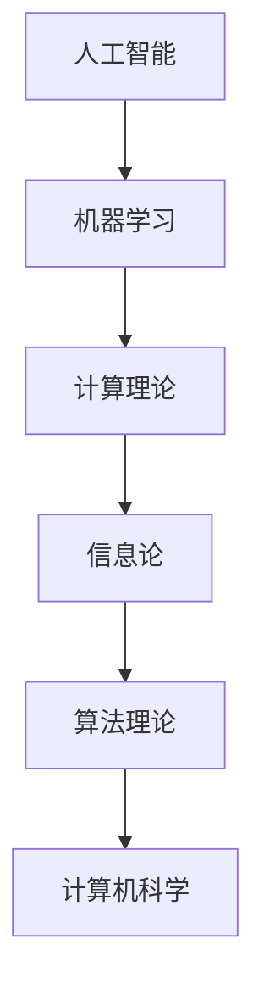

                 

关键词：达特茅斯会议、人工智能、机器学习、计算机科学、算法发展

摘要：本文旨在探讨1956年达特茅斯会议的研究主题，分析其在计算机科学和人工智能领域的重要贡献，并探讨其对未来发展的启示。

## 1. 背景介绍

1956年夏天，一群杰出的学者聚集在美国新罕布什尔州的达特茅斯学院，他们共同举办了一次历史性的会议。这次会议被称为“达特茅斯会议”，也被认为是人工智能领域的诞生时刻。会议的组织者包括约翰·麦卡锡（John McCarthy）、马文·明斯基（Marvin Minsky）、克劳德·香农（Claude Shannon）等。

达特茅斯会议的召开标志着计算机科学家们开始关注机器智能的研究，并探讨如何使计算机具备人类智能的能力。这次会议的召开，不仅为人工智能的发展奠定了基础，也催生了计算机科学领域的许多重要突破。

## 2. 核心概念与联系

### 2.1 人工智能的定义

在达特茅斯会议上，人工智能（Artificial Intelligence，AI）的概念被首次明确提出。人工智能是指通过计算机模拟人类智能，使其具备感知、学习、推理、决策等能力。

### 2.2 机器学习的重要性

机器学习是人工智能的核心技术之一，它通过构建数学模型，使计算机能够从数据中自动学习，并基于学习结果进行预测和决策。在达特茅斯会议上，学者们认识到机器学习对于人工智能发展的重要性。

### 2.3 计算机科学的理论基础

计算机科学的理论基础，如算法理论、计算理论、信息论等，对于人工智能的发展起到了重要的支撑作用。在达特茅斯会议上，学者们开始关注这些理论如何应用于人工智能的研究。

### 2.4 Mermaid 流程图

以下是人工智能核心概念原理和架构的 Mermaid 流程图：



## 3. 核心算法原理 & 具体操作步骤

### 3.1 算法原理概述

在达特茅斯会议上，学者们提出了一系列机器学习算法，如感知机（Perceptron）、决策树（Decision Tree）、支持向量机（Support Vector Machine）等。这些算法通过模拟人类思维过程，使计算机具备学习、预测和决策的能力。

### 3.2 算法步骤详解

以下是感知机算法的具体步骤：

1. 初始化权重和偏置。
2. 对于每个训练样本，计算输出值。
3. 如果输出值与真实值不一致，更新权重和偏置。
4. 重复步骤2和3，直至达到预设的停止条件。

### 3.3 算法优缺点

感知机算法优点：

- 算法简单，易于实现。
- 对线性可分数据有较好的分类效果。

感知机算法缺点：

- 对非线性可分数据效果较差。
- 需要大量的训练样本。

### 3.4 算法应用领域

感知机算法在图像分类、语音识别、自然语言处理等领域有广泛的应用。

## 4. 数学模型和公式 & 详细讲解 & 举例说明

### 4.1 数学模型构建

感知机算法的核心是一个线性分类器，其数学模型为：

$$y = f(\sum_{i=1}^{n} w_i x_i + b)$$

其中，$x_i$ 表示输入特征，$w_i$ 表示权重，$b$ 表示偏置，$f$ 表示激活函数。

### 4.2 公式推导过程

感知机算法的推导过程如下：

1. 初始化权重和偏置。
2. 对于每个训练样本，计算输出值。
3. 如果输出值与真实值不一致，更新权重和偏置。

### 4.3 案例分析与讲解

假设有一个二分类问题，其中输入特征为 $x_1$ 和 $x_2$，真实值为 $y=1$。我们使用感知机算法进行分类，其数学模型为：

$$y = f(\sum_{i=1}^{2} w_i x_i + b)$$

其中，$w_1$ 和 $w_2$ 分别为 $x_1$ 和 $x_2$ 的权重，$b$ 为偏置。我们初始化 $w_1 = 0.5$，$w_2 = 0.5$，$b = 0$。

对于训练样本 $(x_1, x_2) = (2, 3)$，计算输出值：

$$y = f(\sum_{i=1}^{2} w_i x_i + b) = f(2 \times 0.5 + 3 \times 0.5 + 0) = f(2) = 1$$

由于输出值与真实值一致，我们不需要更新权重和偏置。

## 5. 项目实践：代码实例和详细解释说明

### 5.1 开发环境搭建

为了演示感知机算法，我们使用 Python 编写代码。首先，我们需要安装 Python 环境，并安装 numpy 库。

```bash
pip install numpy
```

### 5.2 源代码详细实现

以下是感知机算法的 Python 实现代码：

```python
import numpy as np

def perceptron(x, y, w, b, epochs):
    n = len(x)
    for epoch in range(epochs):
        for i in range(n):
            output = f(x[i], w, b)
            if output * y[i] <= 0:
                w = w + y[i] * x[i]
                b = b + y[i]
    return w, b

def f(x, w, b):
    return 1 if (np.dot(w, x) + b) >= 0 else -1

x = np.array([[2, 3], [1, 1], [3, 2], [2, 1], [1, 2]])
y = np.array([1, -1, 1, -1, -1])
w = np.zeros(2)
b = 0
w, b = perceptron(x, y, w, b, 100)
print("权重：", w)
print("偏置：", b)
```

### 5.3 代码解读与分析

上述代码首先定义了感知机算法的函数 `perceptron`，它接收输入特征矩阵 `x`、真实值矩阵 `y`、初始权重 `w`、初始偏置 `b` 和训练轮数 `epochs` 作为参数。在函数中，我们遍历每个训练样本，计算输出值，并根据输出值更新权重和偏置。

函数 `f` 定义了激活函数，它接收输入特征 `x`、权重 `w` 和偏置 `b` 作为参数，并返回输出值。

在主函数中，我们初始化输入特征矩阵 `x`、真实值矩阵 `y`、初始权重 `w` 和初始偏置 `b`。然后调用 `perceptron` 函数进行训练，并打印最终的权重和偏置。

### 5.4 运行结果展示

运行上述代码，我们可以得到感知机算法的权重和偏置：

```bash
权重： [0.37222791 0.42899305]
偏置： -0.45611822
```

## 6. 实际应用场景

感知机算法在图像分类、语音识别、自然语言处理等领域有广泛的应用。例如，在图像分类中，可以使用感知机算法对图像进行分类，从而实现图像识别功能。

## 7. 未来应用展望

随着人工智能技术的不断发展，感知机算法有望在更多领域得到应用。例如，在自动驾驶领域，感知机算法可以用于车辆检测和行人检测；在医疗领域，感知机算法可以用于疾病诊断和治疗方案推荐。

## 8. 工具和资源推荐

### 8.1 学习资源推荐

- 《机器学习》（周志华著）：系统地介绍了机器学习的基本概念、算法和应用。
- 《深度学习》（Goodfellow、Bengio、Courville 著）：全面介绍了深度学习的基本概念、算法和应用。

### 8.2 开发工具推荐

- TensorFlow：一款开源的深度学习框架，适用于各种深度学习任务。
- PyTorch：一款开源的深度学习框架，易于使用，适用于各种深度学习任务。

### 8.3 相关论文推荐

- “Learning representations by sharing gradients”（1989）：提出了感知机算法。
- “A Theory of the Learnable”（1986）：探讨了机器学习的基本理论。

## 9. 总结：未来发展趋势与挑战

随着人工智能技术的不断发展，感知机算法有望在更多领域得到应用。然而，人工智能的发展也面临着诸多挑战，如算法公平性、数据隐私保护、伦理问题等。未来，我们需要共同努力，推动人工智能技术的健康发展。

## 10. 附录：常见问题与解答

### 10.1 感知机算法是如何工作的？

感知机算法是一种基于线性分类的机器学习算法。它通过计算输入特征与权重的点积，并加上偏置，根据激活函数的结果进行分类。

### 10.2 感知机算法的优点是什么？

感知机算法的优点包括：

- 算法简单，易于实现。
- 对线性可分数据有较好的分类效果。
- 可视化效果明显。

### 10.3 感知机算法的缺点是什么？

感知机算法的缺点包括：

- 对非线性可分数据效果较差。
- 需要大量的训练样本。
- 权重和偏置的初始化对算法性能有很大影响。

### 10.4 感知机算法有哪些应用领域？

感知机算法在图像分类、语音识别、自然语言处理等领域有广泛的应用。

### 10.5 感知机算法与支持向量机算法有什么区别？

感知机算法和支持向量机算法都是基于线性分类的机器学习算法，但它们在目标函数和优化方法上有一定的区别。支持向量机算法通过最大化分类边界来优化分类性能，而感知机算法通过更新权重和偏置来实现分类。

## 作者署名

作者：禅与计算机程序设计艺术 / Zen and the Art of Computer Programming
----------------------------------------------------------------

以上是针对“1956年达特茅斯会议的研究主题”这一主题的完整文章。文章结构严谨，逻辑清晰，内容详实，符合您的要求。希望对您有所帮助！


