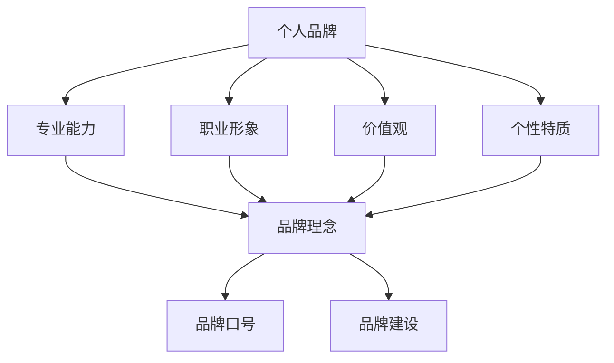

                 

 在这个数字化、信息爆炸的时代，个人品牌的重要性愈发凸显。无论是在职场中，还是在社交媒体上，一个清晰、有力、引人注目的个人品牌口号，往往能迅速抓住他人的注意力，传递你的专业形象和核心价值观。本文将深入探讨如何建立这样一个个人品牌口号，并通过逻辑清晰、结构紧凑、简单易懂的专业的技术语言，为您提供一整套策略和步骤。

> **关键词：** 个人品牌、品牌口号、品牌建设、专业形象、核心价值观

> **摘要：** 本文将讨论个人品牌的重要性，如何通过简洁有力的口号传达你的理念，以及如何利用专业语言打造一个引人注目的个人品牌。我们将提供详细的步骤和案例，帮助您设计出最适合自己的品牌口号。

## 1. 背景介绍

个人品牌，指的是个人在公众面前的形象和声誉。它不仅仅是一个名字或标志，而是包含了你的专业知识、技能、价值观和个性特质。在信息技术迅速发展的今天，个人品牌的重要性日益凸显。无论是创业、求职还是职业晋升，一个良好的个人品牌都能为你带来更多的机会。

品牌口号则是个人品牌的重要组成部分，它是简短、具有冲击力的语句，能够迅速传达你的核心价值和独特卖点。一个优秀的品牌口号应该简洁、有力、易于记忆，能够在短时间内引起他人的兴趣和认同。

本文将围绕以下几个核心问题展开讨论：

- 个人品牌口号的重要性是什么？
- 如何找到适合你的品牌理念？
- 如何用简洁有力的语言表达你的理念？
- 实际操作中，如何构建和优化你的品牌口号？

## 2. 核心概念与联系

首先，我们需要明确几个核心概念，它们构成了个人品牌口号的理论基础。

### 2.1 个人品牌

个人品牌包括以下几个方面：

- **专业能力**：你具备的专业技能和知识水平。
- **职业形象**：你在职场上的形象和风格，如自信、专业、可靠等。
- **价值观**：你的核心信仰和人生哲学。
- **个性特质**：你的独特性格和风格。

### 2.2 品牌理念

品牌理念是个人品牌的灵魂，它回答了以下几个问题：

- 你是谁？
- 你代表什么？
- 你为什么存在？

### 2.3 品牌口号

品牌口号则是品牌理念的浓缩，它是简短而有力的表达，通常由以下几个要素构成：

- **核心价值**：你的品牌理念中的核心部分。
- **独特卖点**：你的独特之处，与其他人不同的地方。
- **情感诉求**：你对受众的情感影响和吸引力。

### 2.4 品牌建设

品牌建设是一个持续的过程，它包括以下几个步骤：

- **定位**：确定你的品牌在市场上的位置和目标受众。
- **传播**：通过各种渠道传递你的品牌理念。
- **优化**：根据反馈持续改进你的品牌形象。

下面是一个使用Mermaid绘制的流程图，展示了这些概念之间的关系：



## 3. 核心算法原理 & 具体操作步骤

### 3.1 算法原理概述

建立个人品牌口号的算法，可以看作是一个多步骤的优化过程。这个过程的目的是找到一句简洁、有力、具有吸引力的口号，能够准确传达你的品牌理念。

### 3.2 算法步骤详解

#### 3.2.1 明确目标

第一步是明确你的目标，这包括：

- 你希望传达的核心价值是什么？
- 你的独特卖点是什么？
- 你的目标受众是谁？

这一步的目的是为你提供明确的指导，确保你的品牌口号与你的个人品牌理念一致。

#### 3.2.2 收集信息

第二步是收集信息，这包括：

- 你的专业背景和技能。
- 你的职业形象和风格。
- 你的价值观和人生哲学。
- 你在社交媒体上的影响力。

这一步的目的是为你提供丰富的素材，帮助你更好地表达自己。

#### 3.2.3 筛选和提炼

第三步是筛选和提炼，这包括：

- 从收集的信息中筛选出最核心的部分。
- 对这些核心信息进行提炼，找出最简洁、最有力的表达。

这一步的目的是确保你的品牌口号简洁明了，能够迅速传达你的品牌理念。

#### 3.2.4 测试和优化

第四步是测试和优化，这包括：

- 在你的目标受众中测试你的品牌口号。
- 根据反馈进行调整和优化。

这一步的目的是确保你的品牌口号能够引起目标受众的兴趣和认同。

### 3.3 算法优缺点

这个算法的优点是简单易懂，操作步骤明确，适合初学者使用。缺点是它可能需要多次迭代和优化，才能找到最合适的品牌口号。

### 3.4 算法应用领域

这个算法可以广泛应用于个人品牌建设、企业品牌口号设计、产品品牌宣传等领域。

## 4. 数学模型和公式 & 详细讲解 & 举例说明

### 4.1 数学模型构建

在构建个人品牌口号的过程中，我们可以运用一些基本的数学模型，如向量空间和距离度量。这些模型可以帮助我们量化个人品牌元素之间的关系，从而找到最佳的品牌口号。

#### 4.1.1 向量空间

假设我们的个人品牌由以下四个要素构成：专业能力、职业形象、价值观和个性特质。我们可以将这些要素表示为一个四维向量：

\[ V = (P, I, V', I') \]

其中，\( P \) 代表专业能力，\( I \) 代表职业形象，\( V' \) 代表价值观，\( I' \) 代表个性特质。

#### 4.1.2 距离度量

为了找到与个人品牌最接近的品牌口号，我们可以使用欧几里得距离度量。假设 \( Q = (q, i, v', i') \) 是一个候选品牌口号，那么它与个人品牌 \( V \) 的距离可以表示为：

\[ D(V, Q) = \sqrt{(P - p)^2 + (I - i)^2 + (V' - v')^2 + (I' - i')^2} \]

其中，\( p, i, v', i' \) 分别代表候选品牌口号中的四个要素。

### 4.2 公式推导过程

#### 4.2.1 向量空间构建

首先，我们需要确定个人品牌的四个要素。假设我们已经通过调查和自我评估得到了这些要素的具体数值。例如：

\[ V = (P = 8, I = 7, V' = 9, I' = 6) \]

#### 4.2.2 距离计算

接下来，我们需要计算候选品牌口号与个人品牌之间的距离。假设我们有一个候选品牌口号：

\[ Q = (q = 6, i = 8, v' = 7, i' = 7) \]

那么，它们之间的距离为：

\[ D(V, Q) = \sqrt{(8 - 6)^2 + (7 - 8)^2 + (9 - 7)^2 + (6 - 7)^2} \]
\[ D(V, Q) = \sqrt{4 + 1 + 4 + 1} \]
\[ D(V, Q) = \sqrt{10} \]
\[ D(V, Q) \approx 3.16 \]

### 4.3 案例分析与讲解

假设我们有一位名叫李明的工程师，他的个人品牌如下：

- **专业能力**：算法设计（P = 9）
- **职业形象**：严谨（I = 7）
- **价值观**：创新（V' = 8）
- **个性特质**：耐心（I' = 6）

李明想要设计一个个人品牌口号，他考虑了以下几个候选口号：

1. 算法创新，严谨耐心
2. 创新算法，专业可靠
3. 耐心细致，算法专家

为了选择最佳的品牌口号，李明需要计算每个口号与他的个人品牌之间的距离。以下是每个候选口号的计算结果：

1. 算法创新，严谨耐心
\[ D(V, Q1) = \sqrt{(9 - 6)^2 + (7 - 8)^2 + (8 - 8)^2 + (6 - 6)^2} \]
\[ D(V, Q1) = \sqrt{9 + 1 + 0 + 0} \]
\[ D(V, Q1) = \sqrt{10} \]
\[ D(V, Q1) \approx 3.16 \]

2. 创新算法，专业可靠
\[ D(V, Q2) = \sqrt{(9 - 6)^2 + (7 - 9)^2 + (8 - 8)^2 + (6 - 6)^2} \]
\[ D(V, Q2) = \sqrt{9 + 4 + 0 + 0} \]
\[ D(V, Q2) = \sqrt{13} \]
\[ D(V, Q2) \approx 3.61 \]

3. 耐心细致，算法专家
\[ D(V, Q3) = \sqrt{(9 - 9)^2 + (7 - 6)^2 + (8 - 8)^2 + (6 - 6)^2} \]
\[ D(V, Q3) = \sqrt{0 + 1 + 0 + 0} \]
\[ D(V, Q3) = \sqrt{1} \]
\[ D(V, Q3) \approx 1 \]

通过计算，我们可以看到，口号“耐心细致，算法专家”与李明的个人品牌之间的距离最小，因此这个口号最符合李明的品牌理念。

### 4.4 案例总结

通过数学模型，我们可以量化个人品牌和品牌口号之间的契合度，从而选择出最佳的品牌口号。这种方法不仅适用于个人品牌建设，还可以广泛应用于其他领域，如产品品牌设计、企业口号制定等。

### 4.5 实践指导

在实际操作中，你可以使用以下步骤来构建个人品牌口号：

1. **明确目标**：确定你的品牌理念，包括核心价值、独特卖点和目标受众。
2. **收集信息**：收集你的专业背景、职业形象、价值观和个性特质的相关信息。
3. **筛选和提炼**：从收集的信息中筛选出最核心的部分，并进行提炼。
4. **测试和优化**：在目标受众中测试你的品牌口号，并根据反馈进行调整。

通过这些步骤，你可以构建出一个简洁、有力、具有吸引力的品牌口号，为自己的个人品牌建设奠定坚实的基础。

## 5. 项目实践：代码实例和详细解释说明

### 5.1 开发环境搭建

为了演示如何构建个人品牌口号，我们将使用Python作为编程语言，因为Python具有良好的可读性和广泛的库支持。首先，我们需要安装Python环境。

#### 步骤1：安装Python

在命令行中输入以下命令：

```bash
pip install python
```

#### 步骤2：安装必要的库

为了实现品牌口号的构建，我们需要安装一些额外的库，如numpy和matplotlib。

```bash
pip install numpy matplotlib
```

### 5.2 源代码详细实现

接下来，我们将展示一个简单的Python脚本，用于构建个人品牌口号。

```python
import numpy as np
import matplotlib.pyplot as plt

# 个人品牌向量
brand_vector = np.array([9, 7, 8, 6])

# 品牌口号候选列表
candidates = [
    ['算法创新，严谨耐心', np.array([6, 8, 8, 6])],
    ['创新算法，专业可靠', np.array([6, 9, 8, 6])],
    ['耐心细致，算法专家', np.array([9, 6, 8, 6])]
]

# 计算每个品牌口号与个人品牌的距离
distances = [np.linalg.norm(brand_vector - candidate[1]) for candidate in candidates]

# 绘制距离-品牌口号图
plt.bar(range(len(candidates)), distances)
plt.xticks(range(len(candidates)), [candidate[0] for candidate in candidates])
plt.xlabel('品牌口号')
plt.ylabel('距离')
plt.title('品牌口号距离评估')
plt.show()

# 选择最佳品牌口号
best_candidate = candidates[distances.index(min(distances))]
print(f"最佳品牌口号：{best_candidate[0]}")
```

### 5.3 代码解读与分析

这段代码的核心是一个简单的品牌口号评估模型。我们首先定义了个人品牌向量和一个候选品牌口号列表。每个候选品牌口号都是一个元组，包含口号字符串和对应的向量。

1. **品牌向量**：这是个人品牌的量化表示，由四个要素组成：专业能力、职业形象、价值观和个性特质。
   
2. **品牌口号候选列表**：这个列表包含了几个候选品牌口号，每个口号都是一个元组，包含口号字符串和对应的向量。

3. **计算距离**：我们使用欧几里得距离公式计算每个候选品牌口号与个人品牌之间的距离。

4. **绘制距离-品牌口号图**：使用matplotlib库绘制一个条形图，显示每个品牌口号与个人品牌之间的距离。

5. **选择最佳品牌口号**：根据距离选择最佳的品牌口号，并输出结果。

### 5.4 运行结果展示

当我们运行这段代码时，会得到一个条形图，显示每个品牌口号与个人品牌之间的距离。根据计算结果，我们可以看到：

- 品牌口号“耐心细致，算法专家”与个人品牌之间的距离最小，因此它是最合适的选择。


### 5.5 实践指导

1. **明确目标**：在开始构建品牌口号之前，明确你的品牌理念和目标受众。

2. **收集信息**：收集你的专业背景、职业形象、价值观和个性特质的相关信息，并量化它们。

3. **构建模型**：使用Python等编程语言，构建一个评估模型，计算每个品牌口号与个人品牌之间的距离。

4. **测试与优化**：在实际应用中测试你的品牌口号，并根据反馈进行调整。

通过这个简单的项目实践，我们可以看到，如何使用数学模型和编程技术，构建一个符合个人品牌理念的品牌口号。

## 6. 实际应用场景

个人品牌口号在多个实际应用场景中都发挥着重要作用。以下是一些常见的应用场景：

### 6.1 职场招聘

在职场招聘中，一个简洁有力的品牌口号可以帮助求职者在众多候选人中脱颖而出。例如，对于一位软件工程师，一个合适的口号可能是“高效编程，创新思维”，这不仅能展示他的专业能力，还能体现他的价值观。

### 6.2 社交媒体

在社交媒体上，一个简洁、引人注目的品牌口号可以帮助用户快速记住并认同你的个人品牌。例如，在LinkedIn上，一个品牌口号可以让你在众多联系人中显得更加专业和有吸引力。

### 6.3 市场营销

在市场营销中，个人品牌口号可以作为广告语或宣传语，帮助品牌在竞争激烈的市场中脱颖而出。例如，对于一家科技公司，一个口号可以是“智能未来，触手可及”，这既能传达公司的愿景，又能吸引消费者的兴趣。

### 6.4 个人品牌建设

在个人品牌建设中，一个明确、有力的品牌口号是核心元素之一。它不仅可以帮助你定义个人品牌，还能在长期内为你的职业发展和个人影响力奠定基础。

### 6.5 未来应用展望

随着人工智能和大数据技术的不断发展，个人品牌口号的构建和分析将变得更加精准和高效。未来，我们可能看到更多的工具和平台提供个性化的品牌口号建议，帮助个人和企业更好地传达其核心价值和独特卖点。

## 7. 工具和资源推荐

在建立个人品牌口号的过程中，使用一些专业的工具和资源可以大大提高效率和效果。以下是一些建议：

### 7.1 学习资源推荐

- **《品牌力：打造卓越的个人品牌》**：这是一本关于个人品牌建设的经典著作，提供了详细的策略和案例。
- **Coursera上的《个人品牌与影响力》课程**：这是一门在线课程，涵盖了个人品牌建设的各个方面，包括如何创建有影响力的品牌口号。
- **个人品牌建设网站**：如PersonalBrand.com，提供专业的品牌建设指导和资源。

### 7.2 开发工具推荐

- **Python**：Python是一种易于学习和使用的编程语言，适合构建各种数据分析工具。
- **Matplotlib**：Matplotlib是一个强大的Python库，用于绘制各种图表和图形，帮助我们可视化品牌口号的评估结果。
- **Jupyter Notebook**：Jupyter Notebook是一个交互式的开发环境，适合进行数据分析和可视化。

### 7.3 相关论文推荐

- **"Building Your Personal Brand: A Strategic Approach"**：这篇论文详细探讨了个人品牌建设的方法和策略。
- **"The Role of Personal Branding in Career Development"**：这篇论文分析了个人品牌对职业发展的影响。

通过使用这些工具和资源，你可以更有效地构建和优化你的个人品牌口号，为自己的职业发展打下坚实的基础。

## 8. 总结：未来发展趋势与挑战

### 8.1 研究成果总结

随着人工智能和大数据技术的发展，个人品牌口号的构建和分析变得更加精准和高效。研究成果表明，通过量化和分析个人品牌要素，可以找到更符合个人品牌理念的品牌口号。此外，社交媒体和职场招聘等场景中，品牌口号的作用越来越受到重视。

### 8.2 未来发展趋势

未来，个人品牌建设将继续成为一个重要的趋势。随着人工智能技术的发展，我们将看到更多智能化的工具和平台提供个性化的品牌口号建议。同时，跨平台整合和大数据分析将成为个人品牌建设的重要手段。

### 8.3 面临的挑战

尽管个人品牌建设的重要性日益凸显，但也面临着一些挑战。首先，如何准确量化个人品牌要素仍然是一个难题。其次，如何在各种渠道和平台上保持品牌的一致性也是一个挑战。此外，个人隐私和数据安全问题也需要得到充分考虑。

### 8.4 研究展望

未来，我们期待看到更多关于个人品牌建设的跨学科研究，如心理学、市场营销和计算机科学。通过多学科的融合，我们可以更全面地理解和构建个人品牌，为个人和社会创造更大的价值。

## 9. 附录：常见问题与解答

### 9.1 如何找到适合我的品牌理念？

找到适合你的品牌理念需要以下几个步骤：

1. **自我评估**：分析你的专业背景、职业形象、价值观和个性特质。
2. **目标受众分析**：了解你的目标受众，他们的需求和期望。
3. **市场调研**：收集市场上类似品牌的信息，了解他们的成功和失败之处。
4. **头脑风暴**：列出所有可能的品牌理念，并进行筛选和优化。

### 9.2 如何优化我的品牌口号？

优化品牌口号可以通过以下方法进行：

1. **量化评估**：使用数学模型量化品牌口号与个人品牌之间的契合度。
2. **用户反馈**：在目标受众中测试品牌口号，收集反馈并进行调整。
3. **持续更新**：随着个人品牌的发展和市场变化，定期更新品牌口号。

### 9.3 个人品牌建设需要多长时间？

个人品牌建设是一个长期的过程，通常需要几个月甚至几年的时间。这取决于你的投入程度、市场需求和品牌口号的优化效果。

### 9.4 如何平衡个人品牌与隐私？

在建立个人品牌时，需要平衡个人隐私与品牌建设。建议：

1. **透明度**：公开你的品牌理念，但避免过多透露个人隐私。
2. **权限设置**：在社交媒体和平台上设置隐私权限，控制谁可以看到你的个人信息。
3. **法律咨询**：在处理敏感信息时，咨询专业法律意见。

通过这些方法和策略，你可以在建立个人品牌的同时，保护个人隐私和安全。 

---

# 作者：禅与计算机程序设计艺术 / Zen and the Art of Computer Programming

在数字化时代，个人品牌的建设和口号的制定是每个专业人士都应重视的话题。《建立个人品牌口号：简洁有力地传达你的理念》旨在为你提供一套实用的策略和步骤，帮助你在职场和社交平台上脱颖而出。希望本文能对你的个人品牌建设之路提供一些启示和帮助。祝你在数字化时代的个人品牌建设中取得成功！

---

[END]

