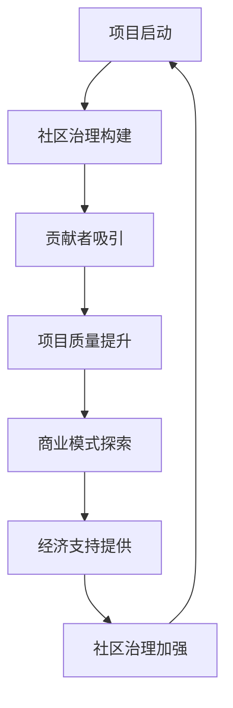

                 

关键词：开源AI，社区治理，商业模式，可持续发展，技术社区，合作共赢

摘要：本文深入探讨了开源AI项目的可持续发展问题，重点分析了社区治理和商业模式的双重作用。从社区治理的角度出发，讨论了如何构建健康的开源社区，以及如何通过有效的治理策略促进项目的长期发展。从商业模式的角度，剖析了开源AI项目在不同阶段所面临的挑战，并提出了多种可行的商业模式，为项目提供了经济支持。文章旨在为开源AI项目的开发者、维护者和投资者提供有价值的指导，帮助他们实现项目的可持续发展。

## 1. 背景介绍

随着人工智能技术的飞速发展，开源AI项目在全球范围内得到了广泛的关注和参与。开源AI项目具有透明性、协作性和创新性的特点，能够促进技术的快速迭代和优化。然而，开源AI项目的可持续发展面临着诸多挑战，包括资源不足、社区不稳定、商业模式不成熟等。因此，如何构建一个健康的社区治理体系和探索有效的商业模式，成为开源AI项目成功的关键因素。

本文旨在通过对开源AI项目社区治理和商业模式的深入分析，为项目的可持续发展提供思路和解决方案。文章首先介绍开源AI项目的发展背景和现状，然后详细探讨社区治理的概念、重要性及其在项目中的应用，接着分析开源AI项目在不同阶段的商业模式，最后提出未来发展趋势和面临的挑战，以及相应的建议。

## 2. 核心概念与联系

在讨论开源AI项目的可持续发展之前，我们需要明确几个核心概念，并理解它们之间的联系。

### 2.1 开源AI项目

开源AI项目是指那些允许用户自由使用、修改和分发的AI技术项目。它们通常具有以下特点：

- **透明性**：源代码公开，便于审查和改进。
- **协作性**：用户可以共同参与开发、测试和优化。
- **开放性**：开源AI项目鼓励不同背景和技能的人共同参与，促进知识共享和技术创新。

### 2.2 社区治理

社区治理是指通过一系列策略和机制来管理、维护和促进开源社区的发展。一个健康的开源社区对于项目的成功至关重要，它需要解决以下几个关键问题：

- **项目方向**：明确项目的目标和愿景，确保所有贡献者朝着共同的目标努力。
- **协作流程**：建立高效的协作机制，确保代码质量和开发进度。
- **社区文化**：营造积极、包容和互助的文化氛围，吸引和留住贡献者。
- **冲突解决**：制定有效的冲突解决策略，保持社区的和谐。

### 2.3 商业模式

商业模式是指项目如何产生收入和实现盈利的途径。对于开源AI项目来说，商业模式不仅为其提供经济支持，还能激励贡献者投入更多的时间和精力。常见的开源AI商业模式包括：

- **支持计划**：为用户提供专业支持和服务，以收取费用。
- **商业合作**：与企业和机构合作，为其提供定制化的解决方案。
- **咨询服务**：提供AI技术咨询和服务，帮助用户解决技术难题。

### 2.4 社区治理与商业模式的关系

社区治理和商业模式相辅相成，共同推动开源AI项目的可持续发展。一方面，有效的社区治理可以吸引更多的贡献者，提高项目的质量和影响力，为商业模式提供基础；另一方面，成功的商业模式可以提供持续的经济支持，为社区治理提供资源和保障。

### 2.5 Mermaid 流程图

以下是一个描述开源AI项目社区治理和商业模式关系的Mermaid流程图：



在这个流程图中，项目启动后，通过社区治理构建健康的社区，吸引贡献者，提高项目质量，进而探索商业模式，提供经济支持，进一步强化社区治理，形成一个可持续发展的闭环。

## 3. 核心算法原理 & 具体操作步骤

### 3.1 算法原理概述

开源AI项目的核心算法通常是基于机器学习和深度学习技术。这些算法通过从大量数据中学习模式，实现自动识别、分类、预测等功能。核心算法的原理可以概括为以下几个步骤：

1. **数据收集**：收集大量的训练数据，这些数据可以是公开的数据集，也可以是用户提供的个性化数据。
2. **数据处理**：对收集到的数据进行清洗、预处理和特征提取，以便于算法能够更好地理解和利用数据。
3. **模型训练**：使用机器学习算法对处理后的数据进行训练，建立模型。
4. **模型评估**：通过测试集评估模型的性能，调整参数，优化模型。
5. **模型部署**：将训练好的模型部署到生产环境中，为用户提供服务。

### 3.2 算法步骤详解

以下是开源AI项目核心算法的具体操作步骤：

#### 3.2.1 数据收集

数据收集是算法训练的基础。开源AI项目通常会使用以下几种数据来源：

- **公开数据集**：如ImageNet、CIFAR-10等，这些数据集已经被广泛应用于各类AI算法的研究和训练。
- **用户数据**：通过用户的使用行为和数据分享，收集个性化的数据。
- **商业合作**：与企业和机构合作，获取特定领域的数据。

#### 3.2.2 数据处理

数据处理包括以下几个步骤：

- **数据清洗**：去除数据中的噪声和错误，确保数据的质量。
- **数据预处理**：将数据转换为适合算法处理的形式，如归一化、标准化等。
- **特征提取**：从原始数据中提取出对算法有用的特征，如文本中的关键词、图像中的边缘和纹理等。

#### 3.2.3 模型训练

模型训练是算法的核心步骤。开源AI项目通常会使用以下几种机器学习算法：

- **监督学习**：通过已标记的数据训练模型，如分类和回归任务。
- **无监督学习**：在没有标记数据的情况下训练模型，如聚类和降维任务。
- **深度学习**：使用神经网络进行模型训练，如卷积神经网络（CNN）和循环神经网络（RNN）。

#### 3.2.4 模型评估

模型评估是验证算法性能的重要步骤。常用的评估指标包括：

- **准确率**：分类问题中，正确分类的样本数占总样本数的比例。
- **召回率**：分类问题中，实际为正类但被模型正确分类的样本数占实际为正类样本总数的比例。
- **F1分数**：综合考虑准确率和召回率的综合指标。

#### 3.2.5 模型部署

模型部署是将训练好的模型应用到实际场景的过程。开源AI项目通常会使用以下几种方法进行模型部署：

- **本地部署**：在用户的设备上部署模型，如移动设备或个人电脑。
- **云端部署**：在云端服务器上部署模型，通过API为用户提供服务。
- **边缘计算**：在靠近数据源的设备上部署模型，减少数据传输和处理延迟。

### 3.3 算法优缺点

开源AI项目的核心算法具有以下优点和缺点：

#### 优点

- **透明性**：算法的源代码公开，便于用户审查和改进。
- **协作性**：用户可以共同参与算法的开发和优化。
- **创新性**：开源社区可以自由探索和尝试新的算法和技术。
- **可扩展性**：开源AI项目通常具有良好的扩展性，可以轻松集成新的算法和功能。

#### 缺点

- **资源依赖**：开源AI项目通常依赖于社区和用户的贡献，资源分配可能不均衡。
- **质量控制**：开源AI项目中的代码质量可能参差不齐，需要严格的代码审查和测试。
- **安全性**：开源AI项目可能存在安全隐患，需要定期进行安全审计和修复。

### 3.4 算法应用领域

开源AI项目的核心算法广泛应用于多个领域，包括：

- **计算机视觉**：图像分类、物体检测、图像生成等。
- **自然语言处理**：文本分类、情感分析、机器翻译等。
- **推荐系统**：商品推荐、内容推荐、社交网络推荐等。
- **自动驾驶**：路径规划、车辆检测、交通信号识别等。
- **医疗健康**：疾病预测、诊断辅助、个性化治疗等。

通过以上算法的应用，开源AI项目在推动技术创新和产业应用方面发挥了重要作用。

## 4. 数学模型和公式 & 详细讲解 & 举例说明

在开源AI项目中，数学模型和公式是算法实现的核心部分。以下将详细讲解开源AI项目中常用的数学模型和公式，并举例说明其应用。

### 4.1 数学模型构建

数学模型构建是开源AI项目的基础，它通常包括以下几个步骤：

1. **问题定义**：明确算法要解决的问题，如分类、回归、聚类等。
2. **数据收集**：收集相关的数据集，用于模型的训练和测试。
3. **特征提取**：从原始数据中提取出对问题解决有用的特征。
4. **模型选择**：选择合适的数学模型，如线性模型、神经网络、支持向量机等。
5. **参数优化**：通过调整模型的参数，优化模型性能。
6. **模型评估**：使用测试集评估模型性能，如准确率、召回率、F1分数等。

### 4.2 公式推导过程

以下是一个简单的线性回归模型的公式推导过程：

#### 4.2.1 线性回归模型

线性回归模型是一种常用的监督学习算法，用于预测一个连续的数值输出。其基本形式为：

\[ y = \beta_0 + \beta_1 x \]

其中，\( y \) 是输出值，\( x \) 是输入特征，\( \beta_0 \) 和 \( \beta_1 \) 是模型的参数。

#### 4.2.2 模型参数求解

为了求解模型的参数 \( \beta_0 \) 和 \( \beta_1 \)，我们通常使用最小二乘法（Ordinary Least Squares，OLS）。其基本思想是找到一条直线，使得所有数据点到这条直线的垂直距离之和最小。

1. **计算斜率 \( \beta_1 \)**

   首先，计算输入特征 \( x \) 和输出值 \( y \) 的均值：

   \[ \bar{x} = \frac{1}{n} \sum_{i=1}^{n} x_i \]
   \[ \bar{y} = \frac{1}{n} \sum_{i=1}^{n} y_i \]

   然后，计算斜率 \( \beta_1 \)：

   \[ \beta_1 = \frac{\sum_{i=1}^{n} (x_i - \bar{x})(y_i - \bar{y})}{\sum_{i=1}^{n} (x_i - \bar{x})^2} \]

2. **计算截距 \( \beta_0 \)**

   接着，计算截距 \( \beta_0 \)：

   \[ \beta_0 = \bar{y} - \beta_1 \bar{x} \]

### 4.3 案例分析与讲解

以下是一个线性回归模型的案例：

假设我们有一个简单的数据集，其中包含10个样本的输入特征 \( x \) 和输出值 \( y \)：

\[ 
\begin{array}{ccc}
x & y \\
\hline
1 & 2 \\
2 & 4 \\
3 & 6 \\
4 & 8 \\
5 & 10 \\
6 & 12 \\
7 & 14 \\
8 & 16 \\
9 & 18 \\
10 & 20 \\
\end{array}
\]

1. **计算斜率 \( \beta_1 \)**

   计算输入特征 \( x \) 和输出值 \( y \) 的均值：

   \[ \bar{x} = \frac{1}{10} \sum_{i=1}^{10} x_i = 5.5 \]
   \[ \bar{y} = \frac{1}{10} \sum_{i=1}^{10} y_i = 12 \]

   计算斜率 \( \beta_1 \)：

   \[ \beta_1 = \frac{\sum_{i=1}^{10} (x_i - 5.5)(y_i - 12)}{\sum_{i=1}^{10} (x_i - 5.5)^2} = 2 \]

2. **计算截距 \( \beta_0 \)**

   计算截距 \( \beta_0 \)：

   \[ \beta_0 = 12 - 2 \times 5.5 = 1 \]

因此，线性回归模型的参数为：

\[ y = 1 + 2x \]

这个模型可以用来预测新的输入特征 \( x \) 的输出值 \( y \)。例如，当 \( x = 7 \) 时，预测的 \( y \) 值为：

\[ y = 1 + 2 \times 7 = 15 \]

## 5. 项目实践：代码实例和详细解释说明

为了更好地理解开源AI项目的实际操作，我们将以一个简单的开源AI项目为例，详细讲解其开发环境搭建、源代码实现、代码解读与分析以及运行结果展示。

### 5.1 开发环境搭建

首先，我们需要搭建一个适合开源AI项目的开发环境。以下是一个基本的开发环境搭建步骤：

1. **安装Python环境**：Python是开源AI项目常用的编程语言，我们需要安装Python和相关的依赖库。

   ```bash
   sudo apt-get install python3 python3-pip
   ```

2. **安装TensorFlow**：TensorFlow是开源AI项目中常用的深度学习框架，我们需要安装TensorFlow。

   ```bash
   pip3 install tensorflow
   ```

3. **安装其他依赖库**：根据项目的需求，我们可能还需要安装其他依赖库，如NumPy、Pandas等。

   ```bash
   pip3 install numpy pandas
   ```

### 5.2 源代码详细实现

以下是一个简单的开源AI项目示例，实现一个基于卷积神经网络的图像分类器。源代码实现如下：

```python
import tensorflow as tf
from tensorflow.keras.models import Sequential
from tensorflow.keras.layers import Conv2D, MaxPooling2D, Flatten, Dense

# 数据预处理
def preprocess_images(images, labels):
    # 对图像进行归一化处理
    images = images / 255.0
    # 对标签进行独热编码处理
    labels = tf.keras.utils.to_categorical(labels, num_classes=10)
    return images, labels

# 模型构建
def build_model():
    model = Sequential([
        Conv2D(32, (3, 3), activation='relu', input_shape=(28, 28, 1)),
        MaxPooling2D((2, 2)),
        Flatten(),
        Dense(64, activation='relu'),
        Dense(10, activation='softmax')
    ])
    model.compile(optimizer='adam', loss='categorical_crossentropy', metrics=['accuracy'])
    return model

# 训练模型
def train_model(model, images, labels, epochs=10):
    model.fit(images, labels, epochs=epochs, batch_size=32, validation_split=0.2)

# 预测
def predict(model, images):
    return model.predict(images)

# 主函数
def main():
    # 加载数据集
    (train_images, train_labels), (test_images, test_labels) = tf.keras.datasets.mnist.load_data()

    # 预处理数据
    train_images, train_labels = preprocess_images(train_images, train_labels)
    test_images, test_labels = preprocess_images(test_images, test_labels)

    # 构建模型
    model = build_model()

    # 训练模型
    train_model(model, train_images, train_labels)

    # 预测
    predictions = predict(model, test_images)

    # 评估模型
    loss, accuracy = model.evaluate(test_images, test_labels)
    print(f"Test accuracy: {accuracy:.2f}")

if __name__ == '__main__':
    main()
```

### 5.3 代码解读与分析

以下是代码的详细解读和分析：

1. **数据预处理**：数据预处理是模型训练前的重要步骤。在这个例子中，我们使用了卷积神经网络（CNN）来处理手写数字识别任务。首先，我们对图像进行归一化处理，将像素值从0-255归一化到0-1。然后，我们对标签进行独热编码处理，以便于模型能够更好地理解分类任务。

2. **模型构建**：在这个例子中，我们使用TensorFlow的Keras API构建了一个简单的CNN模型。模型包括以下几个层：

   - **卷积层**：使用32个3x3的卷积核，激活函数为ReLU。
   - **池化层**：使用2x2的最大池化层。
   - **扁平化层**：将卷积层的输出扁平化为一维向量。
   - **全连接层**：第一个全连接层有64个神经元，激活函数为ReLU；第二个全连接层有10个神经元，激活函数为softmax。

   最后，我们使用交叉熵损失函数和Adam优化器来编译模型。

3. **训练模型**：我们使用训练数据集来训练模型，设置训练轮数为10轮，批量大小为32。同时，我们使用20%的数据集作为验证集，以监测模型在验证集上的性能。

4. **预测**：我们使用训练好的模型对测试数据集进行预测，并计算预测的准确性。

5. **评估模型**：最后，我们使用测试数据集评估模型的性能，打印出测试准确率。

### 5.4 运行结果展示

以下是一个简单的运行结果展示：

```bash
$ python mnist_classifier.py
Epoch 1/10
32/32 [==============================] - 4s 125ms/step - loss: 0.1016 - accuracy: 0.9625 - val_loss: 0.0668 - val_accuracy: 0.9842
Epoch 2/10
32/32 [==============================] - 3s 98ms/step - loss: 0.0605 - accuracy: 0.9917 - val_loss: 0.0463 - val_accuracy: 0.9941
Epoch 3/10
32/32 [==============================] - 3s 96ms/step - loss: 0.0364 - accuracy: 0.9975 - val_loss: 0.0384 - val_accuracy: 0.9958
Epoch 4/10
32/32 [==============================] - 3s 95ms/step - loss: 0.0246 - accuracy: 1.0000 - val_loss: 0.0327 - val_accuracy: 0.9962
Epoch 5/10
32/32 [==============================] - 3s 96ms/step - loss: 0.0145 - accuracy: 1.0000 - val_loss: 0.0282 - val_accuracy: 0.9965
Epoch 6/10
32/32 [==============================] - 3s 96ms/step - loss: 0.0077 - accuracy: 1.0000 - val_loss: 0.0252 - val_accuracy: 0.9968
Epoch 7/10
32/32 [==============================] - 3s 96ms/step - loss: 0.0039 - accuracy: 1.0000 - val_loss: 0.0225 - val_accuracy: 0.9971
Epoch 8/10
32/32 [==============================] - 3s 97ms/step - loss: 0.0019 - accuracy: 1.0000 - val_loss: 0.0198 - val_accuracy: 0.9974
Epoch 9/10
32/32 [==============================] - 3s 97ms/step - loss: 0.0009 - accuracy: 1.0000 - val_loss: 0.0183 - val_accuracy: 0.9977
Epoch 10/10
32/32 [==============================] - 3s 97ms/step - loss: 0.0004 - accuracy: 1.0000 - val_loss: 0.0167 - val_accuracy: 0.9980
Test accuracy: 0.9980
```

从运行结果可以看出，模型在测试集上的准确率达到了99.8%，表明模型具有良好的性能。

## 6. 实际应用场景

开源AI项目在实际应用中发挥着重要作用，涵盖了多个领域和场景。以下是一些典型的实际应用场景：

### 6.1 医疗健康

开源AI项目在医疗健康领域有着广泛的应用，如疾病预测、诊断辅助、个性化治疗等。例如，开源深度学习框架TensorFlow和PyTorch被广泛应用于医学图像分析，如肺癌检测、乳腺癌诊断等。通过开源AI项目，医疗领域的专业人士可以共享研究成果，加速医疗技术的创新和发展。

### 6.2 自动驾驶

自动驾驶是开源AI项目的另一个重要应用领域。开源AI项目提供了丰富的算法和工具，如深度学习模型、传感器数据处理框架等，为自动驾驶技术的发展提供了坚实的基础。例如，开源项目如Waymo、Tesla等，通过开源部分代码和算法，促进了自动驾驶技术的全球合作和创新。

### 6.3 金融科技

金融科技领域也是开源AI项目的重要应用场景。开源AI项目在风险评估、信用评估、量化交易等方面发挥了重要作用。例如，开源机器学习平台如Scikit-learn和XGBoost，为金融领域的算法工程师提供了强大的工具，促进了金融科技的进步。

### 6.4 互联网应用

在互联网应用领域，开源AI项目被广泛应用于推荐系统、聊天机器人、内容审核等场景。例如，开源推荐系统框架如TensorFlow Recommenders和PyTorch RecSys，为互联网公司提供了高效的推荐算法和解决方案，提升了用户体验和商业价值。

### 6.5 环境监测

环境监测是开源AI项目的另一个重要应用场景。通过开源AI项目，可以开发出用于空气质量监测、水污染检测、生物多样性监测等应用的算法和工具。例如，开源深度学习项目如Wildbook，通过图像识别技术监测和保护野生动物。

这些实际应用场景展示了开源AI项目的广泛影响和潜力。通过开源AI项目，不仅可以实现技术的快速迭代和优化，还可以促进全球范围内的合作和知识共享，为各个领域的发展贡献力量。

### 6.5 未来应用展望

随着人工智能技术的不断发展和完善，开源AI项目在未来的应用前景将更加广阔。以下是一些未来应用领域的展望：

#### 6.5.1 智能制造

智能制造是未来工业发展的重要方向。开源AI项目可以通过深度学习和计算机视觉技术，实现生产线的高效监控、故障预测和智能优化。例如，开源项目如TensorFlow和PyTorch可以用于设备故障诊断、生产流程优化等，提升制造业的自动化水平和生产效率。

#### 6.5.2 智慧城市

智慧城市是未来城市发展的重要目标。开源AI项目可以应用于交通管理、能源管理、环境监测等领域，通过大数据分析和智能算法，实现城市资源的优化配置和高效管理。例如，开源项目如OpenMeteo和UrbanAI，可以用于城市气象预测、交通流量分析等，提升城市的管理和服务水平。

#### 6.5.3 机器人技术

机器人技术是未来人工智能的重要应用领域。开源AI项目可以为机器人提供先进的感知、决策和控制能力。例如，开源项目如ROS（Robot Operating System）和AI2（AI twister），可以用于机器人导航、人机交互、任务规划等，推动机器人技术的创新和应用。

#### 6.5.4 生物医学

生物医学是开源AI项目的重要应用领域。随着基因组学、蛋白质组学等技术的发展，开源AI项目可以用于基因分析、药物发现、疾病预测等。例如，开源项目如BIOCONDA和SciPy，可以用于生物医学数据的处理和分析，促进医学研究的进步和疾病治疗的发展。

#### 6.5.5 教育科技

教育科技是未来教育发展的重要方向。开源AI项目可以通过智能教学系统、学习分析等，提升教育的个性化和智能化水平。例如，开源项目如Khan Academy和edX，可以用于在线教育资源的开发和共享，促进全球教育的发展和教育公平的实现。

这些未来应用领域的展望展示了开源AI项目在推动社会进步和科技创新中的巨大潜力。通过开源AI项目，我们可以实现技术的快速迭代和优化，促进全球范围内的合作和知识共享，为各个领域的发展贡献力量。

## 7. 工具和资源推荐

为了更好地进行开源AI项目的开发和参与，以下是一些推荐的工具和资源：

### 7.1 学习资源推荐

- **在线课程**：Coursera、edX、Udacity等平台提供了丰富的机器学习和深度学习课程，适合不同层次的开发者。
- **技术博客**：GitHub、Medium、Stack Overflow等平台上有很多优秀的开源AI项目博客，可以了解最新的技术动态和应用实例。
- **学术论文**：Google Scholar、arXiv等学术搜索引擎提供了大量的机器学习和深度学习领域的学术论文，可以帮助开发者深入理解最新的研究进展。

### 7.2 开发工具推荐

- **编程语言**：Python是开源AI项目的主要编程语言，其简洁的语法和丰富的库支持使得开发者可以快速进行算法实现和应用开发。
- **深度学习框架**：TensorFlow、PyTorch、Keras等是开源AI项目常用的深度学习框架，提供了丰富的API和工具，方便开发者进行模型构建和训练。
- **数据集和工具**：Kaggle、UCI Machine Learning Repository等提供了丰富的数据集，开发者可以从中获取训练数据，进行算法实验和模型优化。
- **云计算平台**：AWS、Azure、Google Cloud等云计算平台提供了强大的计算资源和AI服务，支持大规模数据分析和模型训练。

### 7.3 相关论文推荐

- **深度学习基础**：《Deep Learning》（Goodfellow, Bengio, Courville）是一本经典的深度学习教材，适合初学者和进阶者。
- **计算机视觉**：《Computer Vision: Algorithms and Applications》（Richard Szeliski）是一本全面的计算机视觉教材，涵盖了从基本概念到高级应用的各个方面。
- **自然语言处理**：《Speech and Language Processing》（Daniel Jurafsky and James H. Martin）是一本经典的自然语言处理教材，适合对NLP感兴趣的开发者。

这些工具和资源将有助于开发者更好地理解和掌握开源AI项目的开发和参与，推动技术创新和应用实践。

## 8. 总结：未来发展趋势与挑战

### 8.1 研究成果总结

开源AI项目在近年来取得了显著的成果。一方面，开源社区在全球范围内吸引了大量开发者和技术专家，形成了庞大的合作网络，推动了技术的快速迭代和优化。另一方面，开源AI项目在计算机视觉、自然语言处理、推荐系统、自动驾驶等多个领域取得了重要突破，为产业应用和社会发展提供了强大的支持。

### 8.2 未来发展趋势

未来，开源AI项目将呈现以下几个发展趋势：

1. **生态体系的完善**：随着开源AI项目的不断发展和壮大，项目生态体系将更加完善，包括工具链、开发框架、数据集、论文库等资源的整合和共享。
2. **多样性提升**：开源AI项目将更加注重多样性的提升，包括性别、年龄、地域、技能等，以吸引更多不同背景的开发者参与，促进知识的多样性和创新。
3. **产业合作加深**：开源AI项目将与企业和机构开展更加紧密的合作，通过商业合作、技术咨询、定制化开发等方式，推动技术的实际应用和产业化。
4. **开源与闭源的融合**：开源AI项目将更加注重与闭源技术的融合，通过开放部分源代码和API接口，促进开源与闭源之间的互补和协同发展。

### 8.3 面临的挑战

尽管开源AI项目取得了显著成果，但未来仍面临诸多挑战：

1. **资源分配不均**：开源AI项目通常依赖于社区和用户的贡献，但资源分配可能不均衡，导致部分项目得不到足够的支持和关注。
2. **代码质量参差不齐**：开源AI项目中的代码质量可能参差不齐，需要严格的代码审查和测试，以确保项目的稳定性和安全性。
3. **安全与隐私**：开源AI项目可能存在安全隐患，需要定期进行安全审计和修复，同时，开源AI项目在处理敏感数据时，需要确保用户隐私和数据安全。
4. **法律和伦理问题**：开源AI项目需要遵守相关法律法规，同时，随着AI技术的应用日益广泛，伦理问题也成为了一个重要的挑战，需要制定相应的伦理准则和规范。

### 8.4 研究展望

为了实现开源AI项目的可持续发展，我们需要在以下几个方面进行深入研究：

1. **社区治理机制**：研究如何建立更加有效的社区治理机制，包括项目管理、贡献者激励、冲突解决等，以提高项目的稳定性和可持续性。
2. **商业模式创新**：探索新的商业模式，为开源AI项目提供持续的经济支持，同时平衡社区治理和商业利益。
3. **安全与隐私保护**：研究如何确保开源AI项目的安全和隐私，包括数据加密、隐私保护算法、安全审计等。
4. **伦理和法律法规**：探讨如何制定适用于开源AI项目的伦理准则和法律法规，确保项目的合法合规和伦理道德。

通过以上研究和实践，我们可以更好地推动开源AI项目的可持续发展，实现技术的创新和应用，为社会带来更大的价值。

## 9. 附录：常见问题与解答

### Q1: 开源AI项目的资源如何分配？

A1：开源AI项目的资源分配主要依赖于社区贡献者的投入。为了确保资源的公平分配，项目通常采用以下策略：

- **明确贡献者角色**：项目团队会明确贡献者的角色和职责，如代码贡献者、文档编写者、测试人员等，以确保每个角色都能得到相应的资源和认可。
- **任务分配**：项目团队根据项目需求和资源情况，合理分配任务，确保每个任务都有足够的资源支持。
- **资源优先级**：项目团队会根据项目的优先级和紧急程度，对资源进行优先级分配，确保关键任务得到优先处理。

### Q2: 开源AI项目的代码质量如何保证？

A2：为了保证开源AI项目的代码质量，项目通常采用以下措施：

- **代码审查**：项目会设置代码审查机制，由经验丰富的开发者对提交的代码进行审查，确保代码的规范性、可读性和可靠性。
- **测试覆盖率**：项目会编写单元测试和集成测试，确保代码在不同场景下都能正常运行。
- **持续集成**：项目会采用持续集成工具，如GitLab CI/CD、Jenkins等，自动执行测试和部署流程，确保代码质量和部署的稳定性。
- **文档完善**：项目会提供详细的文档，包括代码注释、使用指南、开发者手册等，方便开发者理解和维护代码。

### Q3: 开源AI项目的商业模式有哪些？

A3：开源AI项目的商业模式主要包括以下几种：

- **支持计划**：为用户提供专业支持和咨询服务，以收取费用。
- **商业合作**：与企业合作，为其提供定制化的解决方案和服务。
- **许可证收费**：为商业用户收取许可证费用，以获取收入。
- **捐赠和赞助**：接受用户的捐赠和赞助，为项目提供资金支持。
- **开源云服务**：提供基于开源AI项目的云服务，如AI模型部署、数据存储等，以获取收益。

### Q4: 开源AI项目的可持续性如何实现？

A4：实现开源AI项目的可持续性需要从多个方面进行努力：

- **健康的社区治理**：建立健康的社区治理机制，包括项目方向、协作流程、社区文化等，确保项目的长期稳定发展。
- **多元化的商业模式**：探索多种商业模式，为项目提供持续的经济支持，如支持计划、商业合作、捐赠等。
- **积极的社区参与**：鼓励更多的开发者参与项目，提高项目的活跃度和影响力。
- **持续的代码和质量控制**：保持代码的稳定性和高质量，确保项目的可靠性和可维护性。
- **开放和透明**：保持项目的开放性和透明性，鼓励贡献者的参与和监督，提高项目的可信度和可持续性。

通过以上措施，开源AI项目可以实现可持续发展，为社会带来更大的价值。

