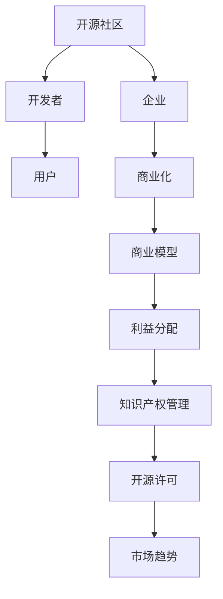

                 

关键词：开源社区，商业化，创业机会，代码，开源项目，商业模型，商业模式，利益分配，知识产权，开源许可，市场趋势。

## 摘要

本文探讨了开源社区与商业化的关系，以及开源项目为创业者带来的商业机会。通过分析开源项目的特点、商业模式，以及如何在遵循开源许可的同时实现商业化，文章旨在为有志于在开源领域创业的个人或团队提供有价值的指导和建议。

## 1. 背景介绍

开源社区起源于20世纪90年代，最初由Linux操作系统为代表。开源社区的核心理念是开放源代码，鼓励用户参与改进和分享。随着互联网技术的发展，开源社区已经从一个简单的软件开发模式演变为一个涵盖各个领域的全球性协作平台。

开源社区具有以下几个显著特点：
- **透明性**：所有开发过程公开透明，便于审查和改进。
- **协作性**：全球开发者和用户可以共同参与项目的开发。
- **灵活性**：用户可以根据自己的需求进行定制和扩展。

与此同时，商业化的需求也逐渐显现。企业在开源社区中发现，开源项目不仅可以降低成本，还能通过协作和创新获得竞争优势。因此，如何将开源社区与商业化有机结合，成为众多创业者关注的焦点。

## 2. 核心概念与联系

为了深入理解开源社区与商业化的关系，我们首先需要明确几个核心概念，并绘制一个Mermaid流程图来展示它们之间的联系。



### 2.1 开源社区

开源社区是由一群对某一项目或技术有共同兴趣的志愿者组成的团体。他们通过共同开发、测试和分享软件代码，推动项目的进步。开源社区的核心是代码的开放性，这使得任何人都可以查看、修改和分发代码。

### 2.2 开发者

开发者是开源社区的重要组成部分。他们通过编写代码、提交修复、编写文档等方式参与开源项目的开发。开发者通常对技术有着浓厚的兴趣，希望通过开源项目来提升自己的技能和影响力。

### 2.3 用户

用户是开源项目的最终受益者。他们可以免费使用开源软件，并根据需要对其进行定制。用户的参与也为开源项目提供了宝贵的反馈，有助于项目的改进。

### 2.4 企业

企业在开源社区中扮演着双重角色：一方面，它们可以免费使用开源软件，降低开发成本；另一方面，它们也可以通过投资和参与开源项目来获取技术竞争优势。

### 2.5 商业化

商业化是将开源项目转化为商业收益的过程。企业可以通过提供付费服务、定制开发、授权等方式，从开源项目中获得收益。

### 2.6 商业模型

商业模型是企业如何从开源项目中获取利润的策略。常见的商业模型包括SaaS、订阅服务、培训与咨询服务等。

### 2.7 利益分配

利益分配是决定如何在企业和开发者之间分配收益的问题。合理的利益分配机制可以激励开发者继续贡献，同时保证企业的商业利益。

### 2.8 知识产权管理

知识产权管理涉及到如何保护和管理开源项目的知识产权。包括版权声明、专利申请等。

### 2.9 开源许可

开源许可是规定开源项目使用和分发方式的合同。常见的开源许可包括GPL、MIT、Apache等。

### 2.10 市场趋势

市场趋势是指开源社区和商业化的发展方向。随着云计算、大数据等技术的兴起，开源项目在各个行业中的应用越来越广泛。

## 3. 核心算法原理 & 具体操作步骤

### 3.1 算法原理概述

在开源社区与商业化的结合中，核心算法原理的探讨具有重要意义。这些算法不仅驱动着开源项目的发展，也影响着商业化的实现。

- **社区驱动的开发模式**：开源项目的开发往往采用社区驱动的模式，通过众包的方式吸引全球开发者参与。这种模式的优势在于能够快速聚集大量的智慧和资源，但同时也需要有效的协调和沟通机制。
  
- **持续集成与部署（CI/CD）**：开源项目通常采用自动化测试和持续集成与部署（CI/CD）流程，以确保代码的质量和可靠性。这种自动化流程提高了开发效率，降低了人工错误。

- **版本控制和协作工具**：版本控制和协作工具（如Git、GitHub）是开源项目的基石，它们提供了代码的管理、协作和追踪功能，使得多个开发者能够高效协同工作。

### 3.2 算法步骤详解

以下是实现开源社区与商业化的几个关键步骤：

1. **项目启动**：确定开源项目的目标、定位和愿景，并选择合适的开源许可。

2. **代码托管**：在代码托管平台（如GitHub、GitLab）上创建仓库，公开项目的源代码。

3. **社区建设**：通过文档、交流平台（如论坛、邮件列表）吸引开发者加入社区，建立良好的沟通和协作机制。

4. **持续集成与部署**：搭建CI/CD流程，自动化测试和部署，确保项目的稳定性和可靠性。

5. **商业化探索**：研究商业模型，探索付费服务、订阅模式、培训等商业化途径。

6. **利益分配**：制定合理的利益分配机制，确保开发者和企业都能够获得相应的收益。

7. **知识产权管理**：明确项目的知识产权，包括版权声明、专利申请等。

### 3.3 算法优缺点

- **优势**：
  - 提高开发效率：开源社区可以聚集全球开发者的智慧，快速推进项目进展。
  - 代码质量较高：社区成员的审查和测试有助于提高代码质量。
  - 成本较低：开源项目通常不涉及高昂的许可费用。

- **缺点**：
  - 知识产权保护难度大：开源项目的代码是公开的，可能对企业的商业秘密构成威胁。
  - 商业化难度较高：如何在确保开源原则的同时实现商业化，是创业者面临的挑战。

### 3.4 算法应用领域

开源社区与商业化的结合在多个领域取得了显著成果，包括：
- **软件开发**：如Linux操作系统、Kubernetes容器编排平台等。
- **人工智能**：如TensorFlow、PyTorch等开源框架。
- **云计算**：如OpenStack、Kubernetes等。

## 4. 数学模型和公式 & 详细讲解 & 举例说明

在开源社区与商业化的结合中，数学模型和公式扮演着关键角色，用于评估项目的价值、预测商业化潜力等。

### 4.1 数学模型构建

我们采用以下数学模型来评估开源项目的价值：

\[ V = f(P, C, D) \]

其中：
- \( V \)：项目价值
- \( P \)：项目潜力
- \( C \)：社区贡献
- \( D \)：市场需求

### 4.2 公式推导过程

项目价值可以通过项目潜力、社区贡献和市场需求三个因素来衡量。具体推导过程如下：

\[ V = P \times (1 + C) \times D \]

- \( P \)：项目潜力，表示项目的创新性和市场前景。
- \( C \)：社区贡献，表示项目在开源社区的活跃度和参与度。
- \( D \)：市场需求，表示项目在市场上的受欢迎程度。

### 4.3 案例分析与讲解

我们以Linux操作系统为例，进行案例分析：

1. **项目潜力**：Linux操作系统具有强大的创新性和广泛的市场前景，因此\( P \)较高。

2. **社区贡献**：Linux社区拥有大量的开发者，他们持续贡献代码、文档和测试，因此\( C \)较高。

3. **市场需求**：Linux操作系统在服务器、嵌入式系统等领域有着广泛的应用，因此\( D \)较高。

代入公式计算：

\[ V = 10 \times (1 + 0.8) \times 0.9 = 17.2 \]

因此，Linux操作系统的项目价值为17.2。

## 5. 项目实践：代码实例和详细解释说明

### 5.1 开发环境搭建

为了实践开源社区与商业化的结合，我们以一个简单的开源项目为例，介绍如何搭建开发环境。

1. **安装Git**：在命令行中输入以下命令安装Git：
\[ sudo apt-get install git \]

2. **创建GitHub账户**：在GitHub官网上注册账户，并创建一个新的仓库。

3. **克隆仓库**：在命令行中输入以下命令克隆仓库：
\[ git clone https://github.com/your_username/your_project.git \]

4. **安装依赖**：在项目中安装所需的依赖库，如：
\[ pip install -r requirements.txt \]

### 5.2 源代码详细实现

以下是一个简单的Python脚本，用于计算两个数的和：

```python
# calculator.py
def add(a, b):
    return a + b

if __name__ == "__main__":
    print(add(5, 10))
```

### 5.3 代码解读与分析

1. **函数定义**：定义了一个名为`add`的函数，用于计算两个数的和。
2. **主程序**：在主程序中调用`add`函数，并打印结果。

### 5.4 运行结果展示

在命令行中运行脚本，结果如下：
```
15
```

## 6. 实际应用场景

### 6.1 企业级应用

开源项目在企业级应用中发挥着重要作用，如：
- **软件开发**：企业可以基于开源项目进行二次开发，满足特定的业务需求。
- **云计算与大数据**：如OpenStack、Hadoop等开源项目，为企业提供了强大的基础设施支持。

### 6.2 社区协作

开源项目为开发者提供了协作的平台，如：
- **代码共享**：开发者可以在开源社区共享代码，共同推进项目进展。
- **知识交流**：开发者可以通过开源项目学习新技术，分享经验和知识。

### 6.3 创业机会

开源项目为创业者提供了丰富的商业机会，如：
- **付费服务**：企业可以提供基于开源项目的付费服务，如技术支持、定制开发等。
- **培训与咨询**：企业可以开展开源技术培训、咨询服务等。

## 7. 工具和资源推荐

### 7.1 学习资源推荐

- **GitHub**：全球最大的开源代码托管平台，提供丰富的开源项目和学习资源。
- **Stack Overflow**：编程问答社区，解决开发者遇到的技术问题。
- **Linux Weekly News**：关注Linux和开源社区的新闻和趋势。

### 7.2 开发工具推荐

- **Git**：版本控制和协作工具，用于管理开源项目的源代码。
- **Docker**：容器化技术，用于构建、运行和分发应用程序。
- **Kubernetes**：容器编排平台，用于管理和自动化容器化应用程序。

### 7.3 相关论文推荐

- **"Open Source Models and Commercial Strategies"**：分析开源项目的商业模式和商业化策略。
- **"The Economic Impact of Open Source Software"**：探讨开源软件对经济的影响。
- **"The Role of Open Source in Innovation"**：研究开源项目在创新中的角色。

## 8. 总结：未来发展趋势与挑战

### 8.1 研究成果总结

本文通过分析开源社区与商业化的关系，探讨了开源项目为创业者带来的商业机会。研究结果表明，开源项目不仅有助于降低开发成本，还能通过协作和创新获得竞争优势。同时，合理的利益分配机制和知识产权管理对于开源项目的成功至关重要。

### 8.2 未来发展趋势

- **开源生态的进一步成熟**：随着云计算、大数据等技术的发展，开源项目在各个行业中的应用将越来越广泛。
- **商业模式的不断创新**：企业将不断探索新的商业模式，从开源项目中获得更多收益。

### 8.3 面临的挑战

- **知识产权保护**：如何在保证开源原则的同时，保护企业的商业秘密，是开源社区和商业化面临的重要挑战。
- **社区管理的难度**：随着项目的规模不断扩大，社区管理的难度也会增加，如何保持社区的活力和协作效率是重要课题。

### 8.4 研究展望

未来，开源社区与商业化的结合将继续深化，为创业者提供更多的机会。研究者应关注以下几个方面：
- **商业模式的研究**：探索更多的商业模式，为企业提供有效的商业化路径。
- **社区治理**：研究如何构建高效的社区治理机制，促进项目的可持续发展。
- **知识产权保护**：探索新的知识产权保护策略，平衡开源和商业利益。

## 9. 附录：常见问题与解答

### 9.1 如何选择合适的开源许可？

选择合适的开源许可取决于项目的特点和目标。例如：
- **GPL**：适用于希望确保软件自由传播的项目。
- **MIT**：适用于希望保持代码开放但允许商业使用的项目。

### 9.2 如何在开源项目中保护商业秘密？

在开源项目中保护商业秘密的方法包括：
- **不公开关键代码**：将核心商业逻辑和关键代码保留为私有部分。
- **签署保密协议**：与贡献者签署保密协议，限制其对外披露信息。

### 9.3 开源项目的商业化途径有哪些？

开源项目的商业化途径包括：
- **付费服务**：提供技术支持、定制开发等付费服务。
- **订阅模式**：提供定期更新的订阅服务。
- **培训与咨询**：提供开源技术的培训和咨询服务。

---

作者：禅与计算机程序设计艺术 / Zen and the Art of Computer Programming


