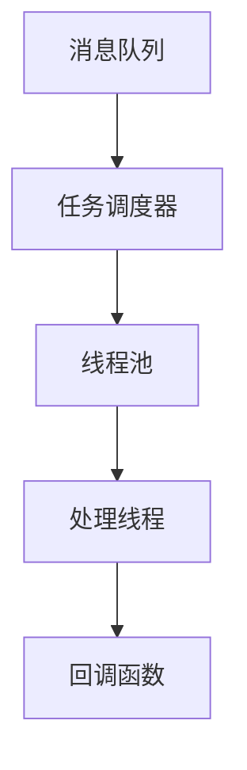

                 

关键词：异步处理、并发编程、性能优化、消息队列、回调机制

> 摘要：本文详细探讨了异步处理技术在现代计算机系统中的重要性，介绍了异步处理的核心概念、实现原理以及优化策略。通过案例分析和实际应用场景的探讨，本文为读者提供了异步处理技术的全面了解，并为未来的发展趋势和面临的挑战提供了展望。

## 1. 背景介绍

在计算机科学领域，异步处理是一种允许程序执行独立任务的能力，这些任务可以同时运行而不必等待一个任务的完成。随着计算机系统复杂性的增加和数据处理需求的增长，异步处理技术已经成为提高系统性能、降低延迟和提升用户体验的关键。传统的同步编程模型依赖于任务之间的顺序执行，这往往会导致资源浪费和性能瓶颈。相比之下，异步处理通过充分利用计算机的多核处理能力和并行执行机制，实现了更高效的任务调度和资源利用。

异步处理技术在多个领域都有广泛应用，例如Web开发中的异步API调用、实时数据处理系统、分布式系统中的任务调度和消息传递等。异步处理不仅可以提高系统的响应速度和吞吐量，还可以减少线程切换和锁竞争等性能问题。然而，异步处理也带来了一些挑战，如异步调用的回调地狱、消息传递的可靠性和一致性等。因此，深入理解异步处理技术的实现与优化策略对于开发高性能和高可靠性的计算机系统至关重要。

## 2. 核心概念与联系

### 2.1 异步处理的基本概念

异步处理的核心在于“异步”，即任务之间的执行不需要按照顺序进行，而是可以独立并发执行。在异步处理模型中，任务通常通过事件或消息进行调度和协调。以下是一些关键概念：

- **事件循环**：异步处理程序的核心是事件循环，它负责监听和处理事件。当一个事件发生时，事件循环将其分配给相应的处理函数。
- **回调函数**：在异步处理中，当某个操作完成时，会触发一个回调函数来处理结果。回调函数通常作为参数传递给异步操作，并在操作完成后调用。
- **非阻塞I/O**：异步处理允许I/O操作（如网络请求、文件读写）在操作未完成时立即返回，而不是阻塞线程等待操作完成。

### 2.2 异步处理的架构

异步处理架构通常包括以下几个关键组件：

- **消息队列**：消息队列用于存储和传递消息，确保消息的顺序和可靠性。
- **任务调度器**：任务调度器负责将消息从队列中取出并分配给可用的处理线程。
- **线程池**：线程池用于管理可重用的线程，以减少线程创建和销毁的开销。

以下是异步处理架构的Mermaid流程图：



### 2.3 并发编程与异步处理的区别

并发编程和异步处理虽然都涉及任务并行执行，但它们的核心目标是不同的：

- **并发编程**：并发编程旨在同时执行多个任务，这些任务可以是同步或异步的。例如，多线程编程允许多个任务在同一时间由多个CPU核心执行。
- **异步处理**：异步处理专注于任务间的非顺序执行，即使在某些任务仍在执行时，其他任务也可以继续进行。异步处理通常用于I/O密集型任务，如网络请求和文件操作。

## 3. 核心算法原理 & 具体操作步骤

### 3.1 算法原理概述

异步处理的核心算法主要涉及事件循环、回调函数和异步I/O操作。以下是一个异步处理算法的基本原理概述：

1. **事件监听**：程序初始化时，设置事件监听器，监听特定的事件。
2. **事件触发**：当事件发生时（例如，I/O操作完成或定时器触发），事件监听器被通知。
3. **回调执行**：事件监听器调用相应的回调函数，处理事件结果。
4. **任务调度**：对于长时间运行的任务，将其分解为多个子任务，并在事件循环中调度。

### 3.2 算法步骤详解

以下是一个异步处理算法的具体步骤：

1. **初始化事件循环**：
    ```python
    event_loop = EventLoop()
    ```

2. **注册事件监听器**：
    ```python
    def on_request_complete(request):
        process_request(request)

    event_loop.register_listener('request_complete', on_request_complete)
    ```

3. **启动事件循环**：
    ```python
    event_loop.run()
    ```

4. **异步I/O操作**：
    ```python
    async def fetch_data(url):
        response = await http.get(url)
        return response.text
    ```

5. **回调函数**：
    ```python
    def on_fetch_complete(url, data):
        print(f"Data fetched from {url}: {data}")
    ```

### 3.3 算法优缺点

异步处理算法的优点包括：

- **提高响应速度**：通过非阻塞I/O操作，可以减少线程阻塞时间，提高系统整体响应速度。
- **资源利用效率**：利用事件循环和线程池，可以减少线程创建和销毁的开销，提高资源利用效率。

异步处理算法的缺点包括：

- **代码复杂度**：异步处理通常涉及回调函数和异步I/O操作，增加了代码复杂度，可能导致代码难以维护。
- **调试难度**：异步处理的调试比同步编程更困难，因为任务之间的执行顺序不固定。

### 3.4 算法应用领域

异步处理算法广泛应用于以下领域：

- **Web开发**：通过异步处理，可以提高Web服务的吞吐量和响应速度。
- **实时数据处理**：在流处理系统中，异步处理可以确保数据的高效处理和实时分析。
- **分布式系统**：在分布式系统中，异步处理用于任务调度和消息传递，确保系统的可靠性和高性能。

## 4. 数学模型和公式 & 详细讲解 & 举例说明

### 4.1 数学模型构建

异步处理技术中的数学模型主要涉及以下几个方面：

1. **任务执行时间模型**：
    - 假设任务 \( T \) 的执行时间为 \( T_e \)。
    - 假设任务的平均执行时间为 \( \bar{T_e} \)。

2. **线程池规模模型**：
    - 假设线程池中线程的数量为 \( N \)。
    - 假设线程池的利用率率为 \( \eta \)。

3. **响应时间模型**：
    - 假设任务的响应时间为 \( T_r \)。
    - 假设系统的延迟为 \( L \)。

以下是这些模型的基本公式：

\[ T_e = \frac{T}{N} \]

\[ \bar{T_e} = \frac{\sum_{i=1}^{N} T_e(i)}{N} \]

\[ T_r = \bar{T_e} + L \]

### 4.2 公式推导过程

为了推导上述公式，我们首先需要了解异步处理中的基本概念。假设有一个任务 \( T \) 需要在线程池中执行，线程池中有 \( N \) 个线程。每个线程的执行时间 \( T_e(i) \) 可以表示为：

\[ T_e(i) = \frac{T}{N} \]

其中，\( T \) 是任务的执行时间，\( N \) 是线程池中线程的数量。由于每个线程独立执行任务，因此每个线程的平均执行时间 \( \bar{T_e} \) 可以表示为所有线程执行时间的平均值：

\[ \bar{T_e} = \frac{\sum_{i=1}^{N} T_e(i)}{N} \]

最后，任务的响应时间 \( T_r \) 是任务执行时间 \( \bar{T_e} \) 和系统的延迟 \( L \) 的总和：

\[ T_r = \bar{T_e} + L \]

### 4.3 案例分析与讲解

假设有一个需要处理的数据流，每秒钟产生 100 个任务，每个任务的执行时间为 0.1 秒。我们使用一个包含 10 个线程的线程池来处理这些任务，系统的延迟为 0.05 秒。

1. **任务执行时间模型**：

   根据上述模型，每个任务的执行时间为：

   \[ T_e = \frac{0.1}{10} = 0.01 \text{ 秒} \]

2. **线程池规模模型**：

   假设线程池的利用率为 80%，即每个线程平均有 80% 的时间在执行任务：

   \[ \eta = 0.8 \]

3. **响应时间模型**：

   根据上述模型，每个任务的响应时间为：

   \[ T_r = \bar{T_e} + L = 0.01 + 0.05 = 0.06 \text{ 秒} \]

通过这个例子，我们可以看到异步处理技术如何通过优化任务执行时间和线程池利用率来降低任务的响应时间。在实际应用中，我们可以根据具体情况调整线程池规模和利用

