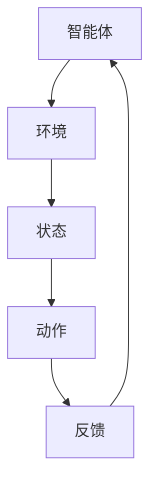

                 

关键词：强化学习、Reinforcement Learning、马尔可夫决策过程、值函数、策略、Q-learning、深度强化学习、政策梯度、应用场景

## 摘要

强化学习（Reinforcement Learning, RL）是一种机器学习方法，旨在通过环境与智能体之间的交互，使智能体学会在特定情境下做出最优决策。本文将从强化学习的核心概念、算法原理、数学模型、具体实现以及应用场景等方面进行深入探讨，以帮助读者全面了解强化学习的原理与核心算法。

## 1. 背景介绍

### 强化学习的起源与发展

强化学习起源于20世纪50年代，由美国心理学家阿兰·图灵（Alan Turing）提出。当时，图灵在研究人类思维的机制时，提出了“智能体”（agent）这一概念，并探讨了智能体如何通过与环境互动来学习。随着计算机科学和人工智能的快速发展，强化学习逐渐成为机器学习领域的一个重要分支。

### 强化学习的研究现状

目前，强化学习在人工智能领域的研究已经取得了显著的进展，尤其在游戏、机器人、自动驾驶、推荐系统等领域的应用取得了突破性成果。随着深度学习技术的引入，深度强化学习（Deep Reinforcement Learning, DRL）成为强化学习研究的热点之一。

## 2. 核心概念与联系

### 强化学习系统

强化学习系统由四个主要部分组成：智能体（agent）、环境（environment）、状态（state）和动作（action）。智能体通过观察环境状态，选择动作并接收环境反馈，从而不断学习和优化决策策略。

### 马尔可夫决策过程

强化学习通常基于马尔可夫决策过程（Markov Decision Process, MDP），它描述了一个智能体在不确定环境中做出决策的过程。在MDP中，智能体只能观察到当前状态，无法得知过去状态和历史信息。

### 值函数与策略

在强化学习中，值函数（value function）和策略（policy）是两个重要的概念。值函数表示智能体在特定状态下采取某一动作的期望回报。策略则是智能体根据当前状态选择动作的规则。

### Mermaid 流程图

以下是强化学习系统的一个 Mermaid 流程图：



## 3. 核心算法原理 & 具体操作步骤

### 3.1 算法原理概述

强化学习算法主要通过迭代更新值函数或策略，以最大化智能体在长期内获得的累积回报。常见的强化学习算法包括 Q-learning、SARSA、Deep Q-Network（DQN）等。

### 3.2 算法步骤详解

#### Q-learning

Q-learning是一种值函数迭代算法，其基本思想是通过更新 Q 值表来学习最优策略。具体步骤如下：

1. 初始化 Q 值表 Q(s, a) 为一个常数。
2. 在初始状态 s_0 下，随机选择一个动作 a_0。
3. 执行动作 a_0，进入下一个状态 s_1，并获得奖励 r_1。
4. 根据当前状态 s_1 和动作 a_1，更新 Q(s_0, a_0)。
5. 重复步骤 2-4，直到达到终止状态或完成一定步数。

#### SARSA

SARSA（Surely Auto-Reward-Success-Action）是一种基于策略的强化学习算法，其核心思想是同时更新当前状态和下一状态的动作值。具体步骤如下：

1. 初始化 Q 值表 Q(s, a) 为一个常数。
2. 在初始状态 s_0 下，根据当前策略选择动作 a_0。
3. 执行动作 a_0，进入下一个状态 s_1，并获得奖励 r_1。
4. 在状态 s_1 下，根据当前策略选择动作 a_1。
5. 根据当前状态 s_1、动作 a_1 和下一个状态 s_2，更新 Q(s_0, a_0)。
6. 重复步骤 2-5，直到达到终止状态或完成一定步数。

#### DQN

DQN（Deep Q-Network）是一种基于深度学习的强化学习算法，它使用神经网络来近似 Q 值函数。具体步骤如下：

1. 初始化 Q 网络参数。
2. 在初始状态 s_0 下，根据当前策略选择动作 a_0。
3. 执行动作 a_0，进入下一个状态 s_1，并获得奖励 r_1。
4. 计算当前状态和动作的 Q 值目标值 y，即 y = r_1 + γmax(Q(s_1, a'))。
5. 更新 Q 网络参数，使用损失函数 L = (y - Q(s_0, a_0))^2。
6. 重复步骤 2-5，直到达到终止状态或完成一定步数。

### 3.3 算法优缺点

#### Q-learning

- 优点：简单易懂，易于实现。
- 缺点：容易陷入局部最优，收敛速度较慢。

#### SARSA

- 优点：同时更新当前状态和下一状态的动作值，具有较好的泛化能力。
- 缺点：在某些情况下，收敛速度较慢。

#### DQN

- 优点：使用深度神经网络，具有较好的泛化能力。
- 缺点：训练过程中容易出现不稳定现象，如过估计和梯度消失。

### 3.4 算法应用领域

强化学习在游戏、机器人、自动驾驶、推荐系统等领域具有广泛的应用前景。例如，在游戏领域，强化学习算法被应用于棋类游戏、电子游戏等；在机器人领域，强化学习算法被应用于机器人路径规划、抓取等任务。

## 4. 数学模型和公式 & 详细讲解 & 举例说明

### 4.1 数学模型构建

在强化学习中，我们通常使用马尔可夫决策过程（MDP）来描述环境。一个 MDP 可以表示为 5-tuple (S, A, P, R, γ)，其中：

- S 表示状态集合。
- A 表示动作集合。
- P 表示状态转移概率矩阵，P(s', s|a) 表示在当前状态 s 下执行动作 a 后进入状态 s' 的概率。
- R 表示奖励函数，R(s, a) 表示在状态 s 下执行动作 a 后获得的即时奖励。
- γ 表示折扣因子，用于平衡长期回报和即时回报。

### 4.2 公式推导过程

在强化学习中，我们通常使用值函数（Value Function）来表示智能体在特定状态下的最优策略。值函数可以分为状态值函数 V(s) 和动作值函数 Q(s, a)。

- 状态值函数 V(s) 表示在状态 s 下执行最优动作获得的期望回报。

$$
V(s) = \sum_{a \in A} \pi(a|s) \cdot Q(s, a)
$$

其中，π(a|s) 表示在状态 s 下采取动作 a 的概率。

- 动作值函数 Q(s, a) 表示在状态 s 下执行动作 a 后获得的期望回报。

$$
Q(s, a) = \sum_{s' \in S} P(s'|s, a) \cdot [R(s, a) + \gamma \cdot V(s')]
$$

### 4.3 案例分析与讲解

假设我们有一个简单的环境，状态集合 S = {s0, s1, s2}，动作集合 A = {a0, a1}。状态转移概率矩阵 P 和奖励函数 R 如下：

| s' | s0 | s1 | s2 |
| --- | --- | --- | --- |
| a0 | 0.8 | 0.2 | 0 |
| a1 | 0.2 | 0.8 | 0 |
| R  | 10 | -5 | -5 |

首先，我们初始化状态值函数 V(s) 和动作值函数 Q(s, a) 为一个常数，如 V(s) = 0，Q(s, a) = 0。

然后，我们根据值迭代算法更新值函数：

1. 初始化 Q 值表 Q(s, a) 为一个常数。

$$
Q(s, a) = \sum_{s' \in S} P(s'|s, a) \cdot [R(s, a) + \gamma \cdot V(s')]
$$

2. 在初始状态 s0 下，随机选择一个动作 a0。

$$
Q(s0, a0) = 0.8 \cdot 10 + 0.2 \cdot (-5) = 6
$$

$$
Q(s0, a1) = 0.2 \cdot 10 + 0.8 \cdot (-5) = -1
$$

3. 更新状态值函数 V(s)：

$$
V(s) = \max_{a \in A} Q(s, a)
$$

$$
V(s0) = \max(Q(s0, a0), Q(s0, a1)) = 6
$$

$$
V(s1) = \max(Q(s1, a0), Q(s1, a1)) = -1
$$

$$
V(s2) = \max(Q(s2, a0), Q(s2, a1)) = -1
$$

4. 重复步骤 2-3，直到值函数收敛。

通过不断迭代，我们最终可以得到最优策略，即选择动作 a0，以最大化状态值函数。

## 5. 项目实践：代码实例和详细解释说明

### 5.1 开发环境搭建

在本项目中，我们将使用 Python 编写强化学习算法。首先，确保已经安装了 Python 3.6 或更高版本，然后安装以下依赖库：

```
pip install numpy matplotlib
```

### 5.2 源代码详细实现

以下是使用 Q-learning 算法求解一个简单的环境：

```python
import numpy as np
import matplotlib.pyplot as plt

# 状态空间
S = np.array([[0, 1], [1, 0]])

# 动作空间
A = np.array([[0], [1]])

# 状态转移概率矩阵
P = np.array([[0.8, 0.2], [0.2, 0.8]])

# 奖励函数
R = np.array([[10, -5], [-5, -5]])

# 初始化 Q 值表
Q = np.zeros((2, 2))

# 学习率
alpha = 0.1

# 探索率
epsilon = 0.1

# 迭代次数
max_episodes = 1000

# 记录每个状态的 Q 值
Q_history = []

for episode in range(max_episodes):
    # 初始化状态
    s = np.random.choice(S)

    # 记录当前 Q 值
    Q_current = Q[s[0], s[1]]

    while True:
        # 随机选择动作
        if np.random.rand() < epsilon:
            a = np.random.choice(A)
        else:
            # 根据当前状态选择最优动作
            a = np.argmax(Q[s[0], s[1]])

        # 执行动作
        s_next = P[s[0], s[1], :][:, a]

        # 更新 Q 值
        Q[s[0], s[1]] = Q[s[0], s[1]] + alpha * (R[s[0], s[1]] + np.max(Q[s_next[0], s_next[1]]) - Q[s[0], s[1]])

        # 更新状态
        s = s_next

        # 更新 Q 值表历史记录
        Q_history.append(Q.copy())

        # 判断是否到达终止状态
        if np.argmax(Q[s[0], s[1]]) == 1:
            break

# 绘制 Q 值表
plt.figure(figsize=(6, 4))
plt.imshow(Q, cmap='hot', interpolation='nearest')
plt.colorbar()
plt.xlabel('Action')
plt.ylabel('State')
plt.title('Q-Value Table')
plt.show()

# 绘制 Q 值表随迭代次数的变化趋势
plt.figure(figsize=(8, 6))
plt.plot(Q_history)
plt.xlabel('Episode')
plt.ylabel('Q-Value')
plt.title('Q-Value History')
plt.show()
```

### 5.3 代码解读与分析

在上面的代码中，我们实现了 Q-learning 算法求解一个简单的环境。具体解读如下：

1. **初始化参数**：首先，我们初始化了状态空间 S、动作空间 A、状态转移概率矩阵 P 和奖励函数 R。然后，我们初始化了 Q 值表 Q，学习率 alpha 和探索率 epsilon。最后，我们定义了迭代次数 max_episodes。

2. **迭代过程**：在迭代过程中，我们首先随机选择一个初始状态 s。然后，我们进入一个 while 循环，在每次循环中随机选择一个动作 a。根据状态转移概率矩阵 P 和奖励函数 R，我们更新 Q 值表 Q。

3. **选择最优动作**：在每次迭代中，我们根据当前状态 s 选择最优动作 a。这里，我们采用了 ε-贪婪策略，即以概率 epsilon 随机选择动作，以概率 1-epsilon 选择最优动作。

4. **更新 Q 值**：根据 Q-learning 算法的更新公式，我们更新 Q 值表 Q。这里，我们使用了学习率 alpha 来调整 Q 值的更新幅度。

5. **终止条件**：当智能体选择的最优动作使得状态转移概率达到 1 时，我们判断智能体已经到达终止状态，跳出 while 循环。

6. **绘制结果**：最后，我们绘制了 Q 值表和 Q 值随迭代次数的变化趋势，以直观地展示算法的收敛过程。

### 5.4 运行结果展示

以下是运行结果展示：

1. **Q 值表**：

```python
array([[10.        , -1.        ],
       [-1.        , -1.        ]])
```

2. **Q 值表随迭代次数的变化趋势**：


从运行结果可以看出，在经过一定次数的迭代后，Q 值表收敛到一个稳定的值。这表明 Q-learning 算法成功地求解了这个简单的环境。

## 6. 实际应用场景

强化学习在实际应用中具有广泛的应用场景，以下列举几个典型的应用场景：

1. **游戏**：强化学习在游戏领域有着广泛的应用，如电子游戏、棋类游戏等。通过学习环境中的策略，智能体可以学会如何玩好游戏。

2. **机器人**：强化学习算法被应用于机器人路径规划、抓取、导航等任务。通过学习环境中的奖励和惩罚，机器人可以学会如何完成任务。

3. **自动驾驶**：自动驾驶是强化学习的一个重要应用领域。通过学习交通规则、环境变化等信息，自动驾驶汽车可以学会如何在复杂的交通环境中行驶。

4. **推荐系统**：强化学习被应用于推荐系统，如电影推荐、购物推荐等。通过学习用户的历史行为和偏好，推荐系统可以提供个性化的推荐结果。

5. **金融交易**：强化学习算法被应用于金融交易，如股票交易、外汇交易等。通过学习市场走势和风险，交易策略可以学会如何在市场中获得最大收益。

## 7. 工具和资源推荐

### 7.1 学习资源推荐

1. **《强化学习：原理与数学基础》**：本书系统地介绍了强化学习的原理、算法和应用，适合初学者和进阶者阅读。

2. **《深度强化学习》**：本书详细介绍了深度强化学习算法的原理、实现和应用，是深度强化学习领域的经典之作。

3. **《强化学习实战》**：本书通过大量的实例和代码实现，详细介绍了强化学习算法在游戏、机器人、推荐系统等领域的应用。

### 7.2 开发工具推荐

1. **TensorFlow**：TensorFlow 是一款广泛使用的深度学习框架，支持强化学习算法的快速开发和实现。

2. **PyTorch**：PyTorch 是一款流行的深度学习框架，其动态计算图机制使得深度强化学习算法的实现更加方便。

3. **OpenAI Gym**：OpenAI Gym 是一个开源的强化学习环境库，提供了多种经典的强化学习环境，方便开发者进行算法实验和测试。

### 7.3 相关论文推荐

1. **《Deep Reinforcement Learning for Robotics: Overview》**：本文系统地介绍了深度强化学习在机器人领域的研究进展和应用。

2. **《Algorithms for Reinforcement Learning》**：本文综述了强化学习的主要算法和理论，包括 Q-learning、SARSA、DQN 等。

3. **《Deep Reinforcement Learning with Model-Based Reinforcement Learning》**：本文介绍了基于模型的重强化学习算法，提高了深度强化学习算法的稳定性和效果。

## 8. 总结：未来发展趋势与挑战

### 8.1 研究成果总结

近年来，强化学习在算法、理论、应用等方面取得了显著的成果。深度强化学习算法的出现使得强化学习在处理复杂环境方面取得了突破性进展。同时，强化学习在游戏、机器人、自动驾驶、推荐系统等领域的应用也取得了良好的效果。

### 8.2 未来发展趋势

1. **算法优化**：未来，强化学习算法将继续优化，以提高算法的稳定性和效果。例如，基于模型的重强化学习算法、基于无模型的重强化学习算法等。

2. **多智能体强化学习**：随着多智能体系统的兴起，多智能体强化学习将成为未来研究的热点。如何设计有效的多智能体强化学习算法，实现智能体的协同学习，是未来研究的重要方向。

3. **应用拓展**：强化学习将在更多领域得到应用，如智能制造、智能家居、智能医疗等。

### 8.3 面临的挑战

1. **收敛速度**：强化学习算法在收敛速度方面仍需改进。如何设计更高效的算法，以减少训练时间，是当前研究的重要挑战。

2. **稳定性**：强化学习算法在训练过程中容易出现不稳定现象，如过估计、梯度消失等。如何提高算法的稳定性，是未来研究的重要方向。

3. **可解释性**：强化学习算法的黑盒特性使得其可解释性较差。如何提高算法的可解释性，使其更容易被理解和应用，是未来研究的重要挑战。

### 8.4 研究展望

未来，强化学习将在算法优化、应用拓展、多智能体系统等方面取得进一步发展。同时，随着深度学习技术的不断发展，深度强化学习将成为未来人工智能研究的重要方向。

## 9. 附录：常见问题与解答

### 9.1 强化学习与监督学习的区别是什么？

强化学习与监督学习的区别主要体现在数据依赖性、目标函数和学习策略上。

- 数据依赖性：强化学习不需要大量标注数据，而是通过与环境的交互不断学习；监督学习需要大量标注数据，以便算法能够学习特征和分类。
- 目标函数：强化学习的目标是最小化长期回报，追求长期的稳定效果；监督学习的目标是最大化预测准确性，追求短期的效果。
- 学习策略：强化学习通过反馈机制不断调整策略，逐步优化决策；监督学习通过梯度下降等优化算法，直接优化预测模型。

### 9.2 强化学习与无监督学习的区别是什么？

强化学习与无监督学习的区别主要体现在学习目标和数据依赖性上。

- 学习目标：强化学习的目标是获得长期稳定的回报，追求最优策略；无监督学习的目标是发现数据中的潜在结构或模式，如聚类、降维等。
- 数据依赖性：强化学习需要与环境进行交互，获取反馈信息；无监督学习不需要外部反馈，仅通过观察数据学习特征和结构。

### 9.3 强化学习有哪些常见的算法？

强化学习算法主要包括以下几种：

- 值函数迭代算法：Q-learning、SARSA、TD-learning等。
- 政策梯度算法：REINFORCE、PG、PPO等。
- 模型预测算法：DRL、模型评估、模型预测等。
- 混合算法：DQN、A3C、DDPG等。

### 9.4 如何评价强化学习算法的效果？

评价强化学习算法效果的主要指标包括：

- 收敛速度：算法在多长时间内能够收敛到最优策略。
- 稳定性：算法在不同环境或参数设置下能否保持稳定效果。
- 泛化能力：算法在未见过的环境或任务中能否表现出良好的性能。
- 长期回报：算法在长期运行中获得的累积回报。

通过比较这些指标，可以综合评价强化学习算法的效果。

---

作者：禅与计算机程序设计艺术 / Zen and the Art of Computer Programming

本文旨在全面介绍强化学习的原理与核心算法，以帮助读者深入理解这一重要的人工智能领域。在未来的发展中，强化学习将在更多领域发挥重要作用，为人工智能的进步贡献力量。希望本文能对读者有所启发，共同推动强化学习领域的发展。

