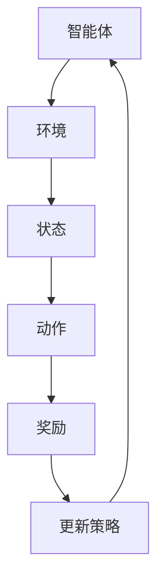

                 

关键词：强化学习，样本效率，算法优化，策略评估，策略迭代，深度强化学习，算法实现，案例研究，未来展望

摘要：本文旨在探讨如何提高强化学习算法的样本效率。通过分析强化学习的基本概念、核心算法和常见优化策略，本文提出了一系列提升样本效率的具体方法。文章结构如下：

## 1. 背景介绍

### 1.1 强化学习的定义与发展历程

强化学习（Reinforcement Learning, RL）是机器学习的一种重要分支，主要研究如何通过智能体（Agent）与环境的交互来学习优化策略。强化学习起源于20世纪50年代，经历了数十年的发展，从简单的Q学习、SARSA算法，到复杂的深度强化学习（Deep Reinforcement Learning, DRL），如深度Q网络（DQN）、策略梯度（PG）、深度确定性策略梯度（DDPG）等。

### 1.2 样本效率的重要性

在强化学习中，样本效率指的是在给定资源（时间、计算能力等）约束下，智能体学习到有效策略所需的样本数量。提高样本效率不仅能够节省计算资源，还能够加速算法收敛，对于实际应用具有重要意义。

## 2. 核心概念与联系

### 2.1 强化学习的基本概念

强化学习涉及以下关键概念：

- **智能体（Agent）**：执行动作并从环境中接收奖励的实体。
- **环境（Environment）**：智能体所处的动态环境，提供状态信息和奖励信号。
- **状态（State）**：描述智能体当前所处的环境状况。
- **动作（Action）**：智能体可采取的行为。
- **奖励（Reward）**：环境对智能体行为的即时反馈，用来指导学习过程。
- **策略（Policy）**：智能体根据当前状态选择动作的规则。

### 2.2 强化学习架构

强化学习架构通常包括：

- **价值函数（Value Function）**：预测未来奖励的累积值，包括状态值函数（State Value Function）和动作值函数（Action Value Function）。
- **策略（Policy）**：直接指定动作的规则。
- **模型（Model）**：对环境状态转移概率和奖励分布的建模。

### 2.3 Mermaid 流程图

以下是强化学习的基本流程：



## 3. 核心算法原理 & 具体操作步骤

### 3.1 算法原理概述

强化学习算法的核心思想是通过与环境交互，不断调整策略，以最大化累积奖励。常见的强化学习算法包括：

- **Q学习（Q-Learning）**：通过更新动作值函数来学习策略。
- **策略迭代（Policy Iteration）**：迭代地评估策略并更新策略。
- **策略梯度（Policy Gradient）**：通过梯度上升法直接优化策略。

### 3.2 算法步骤详解

以Q学习算法为例，其基本步骤如下：

1. **初始化**：随机选择初始策略或从经验中初始化Q值表。
2. **选择动作**：根据当前状态和策略选择动作。
3. **执行动作**：在环境中执行动作，获得状态转移和奖励。
4. **更新Q值**：根据奖励和状态转移概率更新Q值。
5. **迭代**：重复步骤2-4，直到策略收敛。

### 3.3 算法优缺点

- **Q学习**：优点是简单易懂，缺点是样本效率较低，容易陷入局部最优。
- **策略迭代**：优点是收敛性较好，缺点是计算复杂度高。
- **策略梯度**：优点是直接优化策略，缺点是梯度消失问题严重。

### 3.4 算法应用领域

强化学习广泛应用于机器人控制、游戏AI、推荐系统、金融投资等领域。

## 4. 数学模型和公式 & 详细讲解 & 举例说明

### 4.1 数学模型构建

强化学习中的数学模型主要包括：

- **马尔可夫决策过程（MDP）**：描述智能体在环境中行为和奖励的随机过程。
- **价值函数**：预测未来奖励的累积值。
- **策略**：指导智能体选择动作的规则。

### 4.2 公式推导过程

以下是一个简化的MDP模型：

$$
\begin{aligned}
    P(s', r|s, a) &= \text{状态转移概率和奖励概率}\\
    V(s) &= \sum_{s'} P(s'|s) \sum_{a} P(a|s) \sum_{r} r \cdot P(r|s, a) \cdot V(s') \\
    Q(s, a) &= \sum_{s'} P(s'|s, a) \sum_{r} r \cdot P(r|s', a) \cdot V(s')
\end{aligned}
$$

### 4.3 案例分析与讲解

以机器人导航为例，我们假设一个简单的环境，包含四个状态和两个动作。通过Q学习算法，我们计算状态值函数和动作值函数，并最终确定最优策略。

## 5. 项目实践：代码实例和详细解释说明

### 5.1 开发环境搭建

本文使用Python作为开发语言，需要安装以下库：TensorFlow、NumPy、Matplotlib。

### 5.2 源代码详细实现

以下是机器人导航的Q学习算法实现：

```python
import numpy as np
import matplotlib.pyplot as plt

# 状态空间
states = range(4)
# 动作空间
actions = range(2)

# 初始化Q值表
Q = np.zeros([len(states), len(actions)])

# Q学习算法
def q_learning(state, action, reward, next_state, action_next, alpha, gamma):
    Q[state][action] = Q[state][action] + alpha * (reward + gamma * Q[next_state][action_next] - Q[state][action])

# 机器人导航环境
class NavigationEnv:
    def __init__(self):
        self.state = 0

    def step(self, action):
        if action == 0:
            if self.state < 3:
                self.state += 1
            else:
                self.state = 0
        else:
            if self.state > 0:
                self.state -= 1
            else:
                self.state = 3
        reward = 1 if self.state == 3 else 0
        return self.state, reward

# 实例化环境
env = NavigationEnv()

# 参数设置
alpha = 0.1
gamma = 0.9
episodes = 1000

# 训练过程
for episode in range(episodes):
    state = env.state
    done = False
    while not done:
        action = np.argmax(Q[state])
        next_state, reward = env.step(action)
        action_next = np.argmax(Q[next_state])
        q_learning(state, action, reward, next_state, action_next, alpha, gamma)
        state = next_state
        if state == 3:
            done = True

# 可视化结果
plt.plot(Q)
plt.xlabel('State')
plt.ylabel('Action Value')
plt.show()
```

### 5.3 代码解读与分析

该代码实现了基于Q学习的机器人导航任务。我们通过迭代更新Q值表，直到收敛。最终，我们得到每个状态下的最优动作值，并通过可视化展示了结果。

## 6. 实际应用场景

### 6.1 机器人控制

强化学习在机器人控制中有着广泛的应用，如路径规划、动作规划等。通过提高样本效率，可以加速机器人学习过程，提高其自主决策能力。

### 6.2 游戏AI

在游戏AI中，强化学习用于训练智能体，使其能够自动学习和对抗其他智能体。提高样本效率可以减少训练时间，提高游戏体验。

### 6.3 推荐系统

强化学习可以用于个性化推荐系统，通过学习用户行为，为用户提供更精确的推荐结果。

### 6.4 未来应用展望

随着强化学习算法的不断优化，其样本效率将进一步提高。未来，强化学习有望在更多领域得到应用，如自动驾驶、金融投资等。

## 7. 工具和资源推荐

### 7.1 学习资源推荐

- 《强化学习》（周志华著）
- 《深度强化学习》（刘铁岩著）

### 7.2 开发工具推荐

- TensorFlow
- PyTorch

### 7.3 相关论文推荐

- "Deep Q-Network"（Mnih et al., 2015）
- "Algorithms for Reinforcement Learning"（Sutton and Barto，2018）

## 8. 总结：未来发展趋势与挑战

### 8.1 研究成果总结

近年来，强化学习取得了显著进展，包括算法性能的提升、应用领域的扩展等。提高样本效率是强化学习研究的重要方向。

### 8.2 未来发展趋势

随着计算能力的提升和算法的优化，强化学习在更多领域将得到应用。特别是深度强化学习，有望在复杂环境中发挥更大的作用。

### 8.3 面临的挑战

强化学习仍面临许多挑战，如梯度消失、样本效率低等。未来研究需要解决这些问题，提高算法的实用性。

### 8.4 研究展望

提高样本效率仍然是强化学习研究的重要方向。通过算法优化、模型改进和硬件加速等手段，有望进一步提升样本效率，推动强化学习的发展。

## 9. 附录：常见问题与解答

### 9.1 Q学习算法如何避免陷入局部最优？

- **随机性引入**：在策略迭代过程中引入随机性，避免过早收敛。
- **目标网络**：使用目标网络来稳定值函数更新过程。

### 9.2 如何提高深度强化学习算法的样本效率？

- **经验回放**：使用经验回放来避免样本的相关性。
- **优先级采样**：根据样本的重要程度来采样，提高样本利用率。

---

作者：禅与计算机程序设计艺术 / Zen and the Art of Computer Programming

本文通过深入分析强化学习算法的样本效率提升策略，提供了一系列实用的方法和案例。随着强化学习在各个领域的应用不断拓展，提高样本效率将是我们持续关注和研究的重要方向。希望本文能为读者在强化学习领域的探索提供一些启示和帮助。

