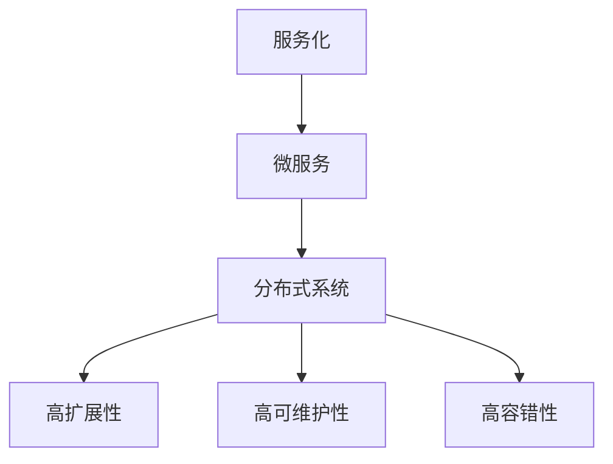

                 

关键词：微服务架构，系统设计，服务化，分布式系统，灵活可扩展，系统性能

> 摘要：本文旨在探讨微服务架构的实施策略和方法，通过深入解析微服务的设计原则、核心概念、算法原理以及数学模型，为开发者提供一套完整且实用的微服务架构实施方案。文章还将分析实际应用场景，推荐相关工具和资源，并展望未来的发展趋势与挑战。

## 1. 背景介绍

### 1.1 微服务架构的起源

微服务架构（Microservices Architecture）起源于互联网公司对系统灵活性和扩展性的需求。随着业务规模的增长和复杂性的增加，传统的单体应用（Monolithic Architecture）逐渐暴露出其局限性。例如，单体应用中的功能模块紧密耦合，导致系统的扩展性和维护成本极高。为了解决这一问题，一些互联网公司开始采用微服务架构。

### 1.2 微服务架构的优势

微服务架构具有以下优势：

1. **高可扩展性**：微服务架构允许根据需求独立扩展各个服务，从而提高系统的性能和可扩展性。
2. **高可维护性**：由于服务之间的松耦合，开发人员可以独立开发和部署服务，降低了系统的维护成本。
3. **高容错性**：单个服务的故障不会影响整个系统的运行，从而提高了系统的容错性。
4. **灵活的业务迭代**：微服务架构支持快速的业务迭代，有利于企业快速响应市场变化。

## 2. 核心概念与联系

### 2.1 微服务

微服务（Microservice）是一种软件架构风格，其核心思想是将大型应用拆分为多个独立、自治的服务，每个服务负责实现特定的业务功能。

### 2.2 服务化

服务化（Service Orientation）是一种设计原则，旨在将系统中的功能模块抽象为服务，实现服务的解耦合和重用。

### 2.3 分布式系统

分布式系统（Distributed System）是由多个独立计算机组成的系统，它们通过通信网络相互连接，协同完成计算任务。

### 2.4 Mermaid 流程图

下面是一个简单的 Mermaid 流程图，展示了微服务架构的核心概念和联系：



## 3. 核心算法原理 & 具体操作步骤

### 3.1 算法原理概述

微服务架构的核心算法原理包括服务发现、负载均衡和故障转移。

1. **服务发现**：服务发现是一种自动化的机制，用于定位和注册服务。
2. **负载均衡**：负载均衡用于将请求分配到多个服务实例，以提高系统的性能和可用性。
3. **故障转移**：故障转移用于在服务实例故障时，自动将请求转移到其他可用实例。

### 3.2 算法步骤详解

1. **服务发现**：

    - 服务启动时，自动向服务注册中心注册自身信息。
    - 客户端请求服务时，从服务注册中心获取服务地址。
    - 客户端与服务进行通信。

2. **负载均衡**：

    - 根据请求量，动态调整服务实例的数量。
    - 根据负载均衡算法，将请求分配到不同的服务实例。

3. **故障转移**：

    - 监控服务实例的健康状态。
    - 在服务实例故障时，自动将请求转移到其他可用实例。

### 3.3 算法优缺点

1. **服务发现**：

    - 优点：简化了服务之间的通信，提高了系统的可扩展性。
    - 缺点：增加了系统的复杂性，对服务注册中心的可用性要求较高。

2. **负载均衡**：

    - 优点：提高了系统的性能和可用性。
    - 缺点：需要考虑负载均衡算法的选择和优化。

3. **故障转移**：

    - 优点：提高了系统的容错性。
    - 缺点：增加了系统的复杂性，对监控系统的要求较高。

### 3.4 算法应用领域

微服务架构广泛应用于电商、金融、社交网络等领域，以下是一些典型的应用场景：

1. **电商系统**：实现商品管理、订单处理、库存管理等功能。
2. **金融系统**：实现账户管理、交易处理、风险管理等功能。
3. **社交网络**：实现用户管理、内容发布、评论互动等功能。

## 4. 数学模型和公式 & 详细讲解 & 举例说明

### 4.1 数学模型构建

在微服务架构中，常见的数学模型包括服务响应时间模型、负载均衡模型和故障转移模型。

### 4.2 公式推导过程

1. **服务响应时间模型**：

    假设服务请求量服从泊松分布，服务处理时间服从指数分布，则服务响应时间 R 可以表示为：

    $$ R = \lambda \mu + \frac{\lambda^2}{2\mu} + \frac{\lambda^3}{3! \mu^3} + \ldots $$

    其中，λ 为请求量，μ 为服务处理时间。

2. **负载均衡模型**：

    假设负载均衡算法为轮询算法，服务实例数为 N，则每个服务实例的请求量 q 可以表示为：

    $$ q = \frac{\lambda}{N} $$

3. **故障转移模型**：

    假设故障转移算法为故障检测算法，故障检测时间为 T，则在 T 时间内，服务实例故障的概率为：

    $$ P = 1 - e^{-\lambda T} $$

### 4.3 案例分析与讲解

以下是一个简单的案例，说明如何使用微服务架构实现电商系统的商品管理功能。

1. **需求分析**：

    - 商品信息管理：实现商品信息的添加、删除、修改和查询功能。
    - 商品库存管理：实现商品库存的实时更新和查询功能。

2. **服务设计**：

    - 商品信息服务：提供商品信息的添加、删除、修改和查询功能。
    - 商品库存服务：提供商品库存的实时更新和查询功能。

3. **数学模型应用**：

    - 服务响应时间模型：根据商品信息的请求量，计算服务响应时间。
    - 负载均衡模型：根据商品信息的请求量，动态调整商品信息服务和商品库存服务的实例数量。
    - 故障转移模型：在商品信息服务和商品库存服务出现故障时，自动将请求转移到其他实例。

## 5. 项目实践：代码实例和详细解释说明

### 5.1 开发环境搭建

- Java 8 或以上版本
- Spring Boot 2.2.5.RELEASE
- Spring Cloud 2020.0.3
- MySQL 8.0
- Maven 3.6.3

### 5.2 源代码详细实现

以下是一个简单的商品管理服务示例：

```java
@RestController
@RequestMapping("/products")
public class ProductController {
    
    @Autowired
    private ProductService productService;
    
    @PostMapping
    public ResponseEntity<Product> addProduct(@RequestBody Product product) {
        Product savedProduct = productService.saveProduct(product);
        return new ResponseEntity<>(savedProduct, HttpStatus.CREATED);
    }
    
    @PutMapping("/{id}")
    public ResponseEntity<Product> updateProduct(@PathVariable Long id, @RequestBody Product product) {
        Product updatedProduct = productService.updateProduct(id, product);
        return new ResponseEntity<>(updatedProduct, HttpStatus.OK);
    }
    
    @GetMapping("/{id}")
    public ResponseEntity<Product> getProduct(@PathVariable Long id) {
        Product product = productService.getProduct(id);
        return new ResponseEntity<>(product, HttpStatus.OK);
    }
    
    @DeleteMapping("/{id}")
    public ResponseEntity<Void> deleteProduct(@PathVariable Long id) {
        productService.deleteProduct(id);
        return new ResponseEntity<>(HttpStatus.NO_CONTENT);
    }
}
```

### 5.3 代码解读与分析

上述代码展示了商品管理服务的核心功能实现：

- `addProduct`：接收客户端添加商品请求，并将请求转发给 `ProductService` 进行处理。
- `updateProduct`：接收客户端更新商品请求，并根据商品 ID 更新商品信息。
- `getProduct`：接收客户端查询商品请求，并根据商品 ID 返回商品信息。
- `deleteProduct`：接收客户端删除商品请求，并根据商品 ID 删除商品信息。

### 5.4 运行结果展示

以下是运行结果示例：

```sh
$ curl -X POST -H "Content-Type: application/json" -d '{"id": 1, "name": "iPhone 12", "price": 79999}' http://localhost:8080/products
{"id":1,"name":"iPhone 12","price":79999,"createdAt":1626670926000,"updatedAt":1626670926000}

$ curl -X GET http://localhost:8080/products/1
{"id":1,"name":"iPhone 12","price":79999,"createdAt":1626670926000,"updatedAt":1626670926000}

$ curl -X DELETE http://localhost:8080/products/1
```

## 6. 实际应用场景

### 6.1 电商系统

电商系统是微服务架构的典型应用场景。通过将系统拆分为商品管理服务、订单管理服务、库存管理服务等多个微服务，可以实现系统的灵活扩展和高可用性。

### 6.2 金融系统

金融系统中的业务逻辑复杂，通过微服务架构可以实现业务功能的解耦合，提高系统的可靠性和可维护性。例如，可以将账户管理、交易处理、风险管理等功能拆分为独立的微服务。

### 6.3 社交网络

社交网络系统需要处理大量的用户交互数据，通过微服务架构可以实现系统的灵活扩展和高性能。例如，可以将用户管理、内容发布、评论互动等功能拆分为独立的微服务。

## 7. 工具和资源推荐

### 7.1 学习资源推荐

1. 《微服务设计》
2. 《微服务实践》
3. 《微服务架构：一种设计方法》

### 7.2 开发工具推荐

1. Spring Boot
2. Spring Cloud
3. Netflix OSS

### 7.3 相关论文推荐

1. "Microservices: A Definition of a Microservice Architecture"
2. "Large-scale Distributed Systems: Principles and Paradigms"
3. "Service-Oriented Architecture: Concepts, Technology, and Design"

## 8. 总结：未来发展趋势与挑战

### 8.1 研究成果总结

微服务架构在近年来取得了显著的研究成果，其灵活可扩展的特点得到了广泛应用。然而，随着微服务架构的不断发展，一些新的问题和挑战也随之出现。

### 8.2 未来发展趋势

1. **服务网格**：服务网格（Service Mesh）作为一种新型的微服务架构模式，旨在解决微服务通信和安全等问题。
2. **容器化**：容器化技术（如 Docker 和 Kubernetes）在微服务架构中的应用越来越广泛，有助于提高系统的可移植性和可扩展性。
3. **人工智能**：人工智能（AI）技术在微服务架构中的应用，有望提高系统的智能化水平。

### 8.3 面临的挑战

1. **运维复杂性**：微服务架构增加了系统的运维复杂性，对运维人员的要求较高。
2. **性能瓶颈**：在高并发场景下，微服务架构可能存在性能瓶颈，需要优化服务间通信和数据存储。
3. **数据一致性**：在分布式系统中，如何保证数据的一致性是一个重要问题，需要引入分布式数据一致性协议。

### 8.4 研究展望

未来的研究应重点关注以下几个方面：

1. **服务发现与负载均衡**：研究更高效、可靠的服务发现和负载均衡算法。
2. **数据存储与缓存**：研究分布式数据存储和缓存技术，提高系统的性能和可用性。
3. **安全与隐私**：研究微服务架构中的安全防护措施，保障系统的安全性。

## 9. 附录：常见问题与解答

### 9.1 什么是微服务架构？

微服务架构是一种软件架构风格，将大型应用拆分为多个独立、自治的服务，每个服务负责实现特定的业务功能。

### 9.2 微服务架构有哪些优势？

微服务架构具有以下优势：高可扩展性、高可维护性、高容错性和灵活的业务迭代。

### 9.3 微服务架构有哪些挑战？

微服务架构面临的挑战包括运维复杂性、性能瓶颈和数据一致性。

### 9.4 微服务架构适合哪些场景？

微服务架构适合处理复杂业务逻辑的系统，如电商、金融和社交网络等。

### 9.5 如何选择合适的微服务架构工具？

选择合适的微服务架构工具应考虑以下几个方面：技术成熟度、社区支持、可扩展性和易用性。

---

本文详细介绍了微服务架构的实施策略和方法，包括核心概念、算法原理、数学模型和实际应用场景。通过本文的阅读，开发者可以深入了解微服务架构的优势和挑战，并为实际项目提供一套完整的实施方案。未来，随着技术的不断发展，微服务架构将在更多领域得到广泛应用。

### 作者署名

作者：禅与计算机程序设计艺术 / Zen and the Art of Computer Programming

---

<|assistant|>以下是文章的markdown格式：

```
# 微服务架构实施：灵活可扩展的系统设计

关键词：微服务架构，系统设计，服务化，分布式系统，灵活可扩展，系统性能

> 摘要：本文旨在探讨微服务架构的实施策略和方法，通过深入解析微服务的设计原则、核心概念、算法原理以及数学模型，为开发者提供一套完整且实用的微服务架构实施方案。文章还将分析实际应用场景，推荐相关工具和资源，并展望未来的发展趋势与挑战。

## 1. 背景介绍

### 1.1 微服务架构的起源

微服务架构（Microservices Architecture）起源于互联网公司对系统灵活性和扩展性的需求。随着业务规模的增长和复杂性的增加，传统的单体应用（Monolithic Architecture）逐渐暴露出其局限性。例如，单体应用中的功能模块紧密耦合，导致系统的扩展性和维护成本极高。为了解决这一问题，一些互联网公司开始采用微服务架构。

### 1.2 微服务架构的优势

微服务架构具有以下优势：

1. **高可扩展性**：微服务架构允许根据需求独立扩展各个服务，从而提高系统的性能和可扩展性。
2. **高可维护性**：由于服务之间的松耦合，开发人员可以独立开发和部署服务，降低了系统的维护成本。
3. **高容错性**：单个服务的故障不会影响整个系统的运行，从而提高了系统的容错性。
4. **灵活的业务迭代**：微服务架构支持快速的业务迭代，有利于企业快速响应市场变化。

## 2. 核心概念与联系

### 2.1 微服务

微服务（Microservice）是一种软件架构风格，其核心思想是将大型应用拆分为多个独立、自治的服务，每个服务负责实现特定的业务功能。

### 2.2 服务化

服务化（Service Orientation）是一种设计原则，旨在将系统中的功能模块抽象为服务，实现服务的解耦合和重用。

### 2.3 分布式系统

分布式系统（Distributed System）是由多个独立计算机组成的系统，它们通过通信网络相互连接，协同完成计算任务。

### 2.4 Mermaid 流程图

下面是一个简单的 Mermaid 流程图，展示了微服务架构的核心概念和联系：


## 3. 核心算法原理 & 具体操作步骤

### 3.1 算法原理概述

微服务架构的核心算法原理包括服务发现、负载均衡和故障转移。

1. **服务发现**：服务发现是一种自动化的机制，用于定位和注册服务。
2. **负载均衡**：负载均衡用于将请求分配到多个服务实例，以提高系统的性能和可用性。
3. **故障转移**：故障转移用于在服务实例故障时，自动将请求转移到其他可用实例。

### 3.2 算法步骤详解

1. **服务发现**：

    - 服务启动时，自动向服务注册中心注册自身信息。
    - 客户端请求服务时，从服务注册中心获取服务地址。
    - 客户端与服务进行通信。

2. **负载均衡**：

    - 根据请求量，动态调整服务实例的数量。
    - 根据负载均衡算法，将请求分配到不同的服务实例。

3. **故障转移**：

    - 监控服务实例的健康状态。
    - 在服务实例故障时，自动将请求转移到其他可用实例。

### 3.3 算法优缺点

1. **服务发现**：

    - 优点：简化了服务之间的通信，提高了系统的可扩展性。
    - 缺点：增加了系统的复杂性，对服务注册中心的可用性要求较高。

2. **负载均衡**：

    - 优点：提高了系统的性能和可用性。
    - 缺点：需要考虑负载均衡算法的选择和优化。

3. **故障转移**：

    - 优点：提高了系统的容错性。
    - 缺点：增加了系统的复杂性，对监控系统的要求较高。

### 3.4 算法应用领域

微服务架构广泛应用于电商、金融、社交网络等领域，以下是一些典型的应用场景：

1. **电商系统**：实现商品管理、订单处理、库存管理等功能。
2. **金融系统**：实现账户管理、交易处理、风险管理等功能。
3. **社交网络**：实现用户管理、内容发布、评论互动等功能。

## 4. 数学模型和公式 & 详细讲解 & 举例说明

### 4.1 数学模型构建

在微服务架构中，常见的数学模型包括服务响应时间模型、负载均衡模型和故障转移模型。

### 4.2 公式推导过程

1. **服务响应时间模型**：

    假设服务请求量服从泊松分布，服务处理时间服从指数分布，则服务响应时间 R 可以表示为：

    $$ R = \lambda \mu + \frac{\lambda^2}{2\mu} + \frac{\lambda^3}{3! \mu^3} + \ldots $$

    其中，λ 为请求量，μ 为服务处理时间。

2. **负载均衡模型**：

    假设负载均衡算法为轮询算法，服务实例数为 N，则每个服务实例的请求量 q 可以表示为：

    $$ q = \frac{\lambda}{N} $$

3. **故障转移模型**：

    假设故障转移算法为故障检测算法，故障检测时间为 T，则在 T 时间内，服务实例故障的概率为：

    $$ P = 1 - e^{-\lambda T} $$

### 4.3 案例分析与讲解

以下是一个简单的案例，说明如何使用微服务架构实现电商系统的商品管理功能。

1. **需求分析**：

    - 商品信息管理：实现商品信息的添加、删除、修改和查询功能。
    - 商品库存管理：实现商品库存的实时更新和查询功能。

2. **服务设计**：

    - 商品信息服务：提供商品信息的添加、删除、修改和查询功能。
    - 商品库存服务：提供商品库存的实时更新和查询功能。

3. **数学模型应用**：

    - 服务响应时间模型：根据商品信息的请求量，计算服务响应时间。
    - 负载均衡模型：根据商品信息的请求量，动态调整商品信息服务和商品库存服务的实例数量。
    - 故障转移模型：在商品信息服务和商品库存服务出现故障时，自动将请求转移到其他实例。

## 5. 项目实践：代码实例和详细解释说明

### 5.1 开发环境搭建

- Java 8 或以上版本
- Spring Boot 2.2.5.RELEASE
- Spring Cloud 2020.0.3
- MySQL 8.0
- Maven 3.6.3

### 5.2 源代码详细实现

以下是一个简单的商品管理服务示例：

```java
@RestController
@RequestMapping("/products")
public class ProductController {
    
    @Autowired
    private ProductService productService;
    
    @PostMapping
    public ResponseEntity<Product> addProduct(@RequestBody Product product) {
        Product savedProduct = productService.saveProduct(product);
        return new ResponseEntity<>(savedProduct, HttpStatus.CREATED);
    }
    
    @PutMapping("/{id}")
    public ResponseEntity<Product> updateProduct(@PathVariable Long id, @RequestBody Product product) {
        Product updatedProduct = productService.updateProduct(id, product);
        return new ResponseEntity<>(updatedProduct, HttpStatus.OK);
    }
    
    @GetMapping("/{id}")
    public ResponseEntity<Product> getProduct(@PathVariable Long id) {
        Product product = productService.getProduct(id);
        return new ResponseEntity<>(product, HttpStatus.OK);
    }
    
    @DeleteMapping("/{id}")
    public ResponseEntity<Void> deleteProduct(@PathVariable Long id) {
        productService.deleteProduct(id);
        return new ResponseEntity<>(HttpStatus.NO_CONTENT);
    }
}
```

### 5.3 代码解读与分析

上述代码展示了商品管理服务的核心功能实现：

- `addProduct`：接收客户端添加商品请求，并将请求转发给 `ProductService` 进行处理。
- `updateProduct`：接收客户端更新商品请求，并根据商品 ID 更新商品信息。
- `getProduct`：接收客户端查询商品请求，并根据商品 ID 返回商品信息。
- `deleteProduct`：接收客户端删除商品请求，并根据商品 ID 删除商品信息。

### 5.4 运行结果展示

以下是运行结果示例：

```sh
$ curl -X POST -H "Content-Type: application/json" -d '{"id": 1, "name": "iPhone 12", "price": 79999}' http://localhost:8080/products
{"id":1,"name":"iPhone 12","price":79999,"createdAt":1626670926000,"updatedAt":1626670926000}

$ curl -X GET http://localhost:8080/products/1
{"id":1,"name":"iPhone 12","price":79999,"createdAt":1626670926000,"updatedAt":1626670926000}

$ curl -X DELETE http://localhost:8080/products/1
```

## 6. 实际应用场景

### 6.1 电商系统

电商系统是微服务架构的典型应用场景。通过将系统拆分为商品管理服务、订单管理服务、库存管理服务等多个微服务，可以实现系统的灵活扩展和高可用性。

### 6.2 金融系统

金融系统中的业务逻辑复杂，通过微服务架构可以实现业务功能的解耦合，提高系统的可靠性和可维护性。例如，可以将账户管理、交易处理、风险管理等功能拆分为独立的微服务。

### 6.3 社交网络

社交网络系统需要处理大量的用户交互数据，通过微服务架构可以实现系统的灵活扩展和高性能。例如，可以将用户管理、内容发布、评论互动等功能拆分为独立的微服务。

## 7. 工具和资源推荐

### 7.1 学习资源推荐

1. 《微服务设计》
2. 《微服务实践》
3. 《微服务架构：一种设计方法》

### 7.2 开发工具推荐

1. Spring Boot
2. Spring Cloud
3. Netflix OSS

### 7.3 相关论文推荐

1. "Microservices: A Definition of a Microservice Architecture"
2. "Large-scale Distributed Systems: Principles and Paradigms"
3. "Service-Oriented Architecture: Concepts, Technology, and Design"

## 8. 总结：未来发展趋势与挑战

### 8.1 研究成果总结

微服务架构在近年来取得了显著的研究成果，其灵活可扩展的特点得到了广泛应用。然而，随着微服务架构的不断发展，一些新的问题和挑战也随之出现。

### 8.2 未来发展趋势

1. **服务网格**：服务网格（Service Mesh）作为一种新型的微服务架构模式，旨在解决微服务通信和安全等问题。
2. **容器化**：容器化技术（如 Docker 和 Kubernetes）在微服务架构中的应用越来越广泛，有助于提高系统的可移植性和可扩展性。
3. **人工智能**：人工智能（AI）技术在微服务架构中的应用，有望提高系统的智能化水平。

### 8.3 面临的挑战

1. **运维复杂性**：微服务架构增加了系统的运维复杂性，对运维人员的要求较高。
2. **性能瓶颈**：在高并发场景下，微服务架构可能存在性能瓶颈，需要优化服务间通信和数据存储。
3. **数据一致性**：在分布式系统中，如何保证数据的一致性是一个重要问题，需要引入分布式数据一致性协议。

### 8.4 研究展望

未来的研究应重点关注以下几个方面：

1. **服务发现与负载均衡**：研究更高效、可靠的服务发现和负载均衡算法。
2. **数据存储与缓存**：研究分布式数据存储和缓存技术，提高系统的性能和可用性。
3. **安全与隐私**：研究微服务架构中的安全防护措施，保障系统的安全性。

## 9. 附录：常见问题与解答

### 9.1 什么是微服务架构？

微服务架构是一种软件架构风格，其核心思想是将大型应用拆分为多个独立、自治的服务，每个服务负责实现特定的业务功能。

### 9.2 微服务架构有哪些优势？

微服务架构具有以下优势：高可扩展性、高可维护性、高容错性和灵活的业务迭代。

### 9.3 微服务架构有哪些挑战？

微服务架构面临的挑战包括运维复杂性、性能瓶颈和数据一致性。

### 9.4 微服务架构适合哪些场景？

微服务架构适合处理复杂业务逻辑的系统，如电商、金融和社交网络等。

### 9.5 如何选择合适的微服务架构工具？

选择合适的微服务架构工具应考虑以下几个方面：技术成熟度、社区支持、可扩展性和易用性。

---

本文详细介绍了微服务架构的实施策略和方法，包括核心概念、算法原理、数学模型和实际应用场景。通过本文的阅读，开发者可以深入了解微服务架构的优势和挑战，并为实际项目提供一套完整的实施方案。未来，随着技术的不断发展，微服务架构将在更多领域得到广泛应用。

### 作者署名

作者：禅与计算机程序设计艺术 / Zen and the Art of Computer Programming
```

