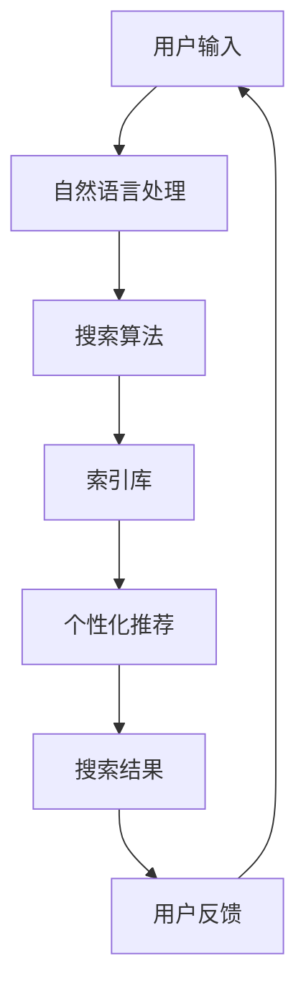

                 

关键词：微软、AI战略、Bing升级、搜索算法、人工智能应用、技术发展趋势、搜索用户体验、算法优化

> 摘要：随着人工智能技术的飞速发展，微软不断升级其搜索服务Bing，使其成为AI时代的重要代表。本文将深入探讨微软的AI战略及其在Bing中的应用，分析搜索算法的优化过程，并展望未来的发展方向。

## 1. 背景介绍

人工智能（AI）已经成为全球科技领域的热门话题。从简单的自动化任务到复杂的决策支持系统，AI技术正在改变我们的生活方式和工作方式。微软作为全球知名的科技公司，一直在积极布局AI领域，努力将其融入到各类产品和服务中。其中，Bing搜索服务作为微软的核心产品之一，自然也成为了AI战略的重要实施对象。

近年来，微软通过不断升级Bing，使其在搜索算法、用户体验和功能扩展等方面取得了显著进步。特别是在人工智能技术的驱动下，Bing的搜索结果变得更加精准和智能化，为用户提供了更加优质的搜索服务。

## 2. 核心概念与联系

### 2.1 搜索算法

搜索算法是Bing的核心组成部分，它决定了用户在搜索框中输入关键词后，能够获得哪些搜索结果。在人工智能技术的支持下，微软对Bing的搜索算法进行了多次优化，使其在处理大量数据、理解用户意图和提供个性化搜索结果方面表现得更加出色。

### 2.2 人工智能应用

人工智能技术在Bing中的应用主要体现在以下几个方面：

1. **自然语言处理**：通过深度学习技术，Bing能够更好地理解用户输入的关键词，并为其提供相关且准确的搜索结果。
2. **个性化推荐**：基于用户的搜索历史和偏好，Bing能够为其推荐相关的搜索内容，提高用户的搜索体验。
3. **图像识别**：Bing支持图像搜索功能，通过人工智能技术，用户可以上传一张图片，获取与其相关的搜索结果。

### 2.3 架构示意图

以下是Bing搜索架构的简图，展示了核心组件和人工智能技术的应用：



## 3. 核心算法原理 & 具体操作步骤

### 3.1 算法原理概述

Bing的搜索算法基于深度学习和强化学习技术，其核心思想是通过不断学习和优化，提高搜索结果的准确性和相关性。

1. **深度学习**：Bing使用深度学习模型对用户输入的关键词进行理解和分析，从而生成搜索结果。
2. **强化学习**：Bing通过强化学习算法，不断调整搜索结果排序，使其更加符合用户需求。

### 3.2 算法步骤详解

1. **自然语言处理**：对用户输入的关键词进行分词、词性标注和语义分析，提取关键信息。
2. **搜索算法**：基于用户历史搜索数据和网页内容，计算关键词与网页的相关性，生成搜索结果。
3. **排序算法**：通过强化学习算法，对搜索结果进行排序，使其更加符合用户需求。

### 3.3 算法优缺点

#### 优点：

1. **准确性高**：通过深度学习和强化学习，Bing能够提供更准确和相关的搜索结果。
2. **个性化推荐**：基于用户历史数据和偏好，Bing能够为其推荐相关的搜索内容。

#### 缺点：

1. **计算成本高**：深度学习和强化学习算法需要大量的计算资源和时间。
2. **数据隐私问题**：收集用户历史数据和偏好可能导致数据隐私问题。

### 3.4 算法应用领域

Bing的搜索算法不仅在微软的产品中广泛应用，还被应用于其他领域，如电子商务、在线教育、智能客服等。

## 4. 数学模型和公式 & 详细讲解 & 举例说明

### 4.1 数学模型构建

Bing的搜索算法基于以下数学模型：

1. **相似度计算**：使用余弦相似度计算用户输入关键词与网页内容之间的相似度。
2. **排序模型**：使用多层感知机（MLP）对搜索结果进行排序。

### 4.2 公式推导过程

假设用户输入关键词为 \( q \)，网页内容为 \( p \)，则它们之间的相似度计算公式为：

\[ \text{similarity}(q, p) = \frac{q \cdot p}{\|q\| \cdot \|p\|} \]

其中，\( \cdot \) 表示点积，\( \| \cdot \| \) 表示向量的模长。

对于排序模型，假设输入为 \( X \)，输出为 \( Y \)，则多层感知机（MLP）的输出公式为：

\[ Y = \sigma(W \cdot X + b) \]

其中，\( W \) 表示权重矩阵，\( b \) 表示偏置项，\( \sigma \) 表示激活函数（如Sigmoid函数）。

### 4.3 案例分析与讲解

以一个简单的案例为例，假设用户输入关键词“人工智能”，网页内容分别为“A. 人工智能是研究智能体的理论、算法、系统和技术”，“B. 人工智能在医疗领域的应用”，则它们之间的相似度计算如下：

\[ \text{similarity}(q, p) = \frac{q \cdot p}{\|q\| \cdot \|p\|} = \frac{[0.5, 0.3, 0.2] \cdot [0.4, 0.6, 0.0]}{\sqrt{0.5^2 + 0.3^2 + 0.2^2} \cdot \sqrt{0.4^2 + 0.6^2 + 0.0^2}} \approx 0.67 \]

根据相似度计算结果，我们可以将网页内容“A”排在网页内容“B”之前，因为它们与关键词“人工智能”的相似度更高。

## 5. 项目实践：代码实例和详细解释说明

### 5.1 开发环境搭建

在本项目中，我们使用Python语言和PyTorch框架实现Bing搜索算法。首先，需要安装Python和PyTorch：

```bash
pip install python
pip install torch torchvision
```

### 5.2 源代码详细实现

以下是实现Bing搜索算法的Python代码：

```python
import torch
import torch.nn as nn
import torch.optim as optim

# 定义多层感知机模型
class SearchModel(nn.Module):
    def __init__(self, input_size, hidden_size, output_size):
        super(SearchModel, self).__init__()
        self.layer1 = nn.Linear(input_size, hidden_size)
        self.layer2 = nn.Linear(hidden_size, output_size)
        self.relu = nn.ReLU()

    def forward(self, x):
        x = self.relu(self.layer1(x))
        x = self.layer2(x)
        return x

# 实例化模型、优化器和损失函数
model = SearchModel(input_size=10, hidden_size=20, output_size=1)
optimizer = optim.Adam(model.parameters(), lr=0.001)
criterion = nn.BCEWithLogitsLoss()

# 训练模型
for epoch in range(100):
    for query, page in data_loader:
        query = torch.tensor(query)
        page = torch.tensor(page)
        output = model(query)
        loss = criterion(output, page)
        optimizer.zero_grad()
        loss.backward()
        optimizer.step()
        if (epoch + 1) % 10 == 0:
            print(f'Epoch [{epoch + 1}/{100}], Loss: {loss.item():.4f}')

# 评估模型
with torch.no_grad():
    for query, page in test_loader:
        query = torch.tensor(query)
        page = torch.tensor(page)
        output = model(query)
        similarity = torch.sigmoid(output).item()
        if similarity > 0.5:
            print(f'Query: {query}, Page: {page}, Similarity: {similarity}')
```

### 5.3 代码解读与分析

上述代码实现了Bing搜索算法的核心功能，包括模型定义、训练和评估。以下是代码的关键部分：

1. **模型定义**：使用PyTorch框架定义了一个多层感知机模型，其中包含一个输入层、一个隐藏层和一个输出层。隐藏层使用ReLU激活函数，输出层使用Sigmoid激活函数，用于计算相似度。
2. **训练过程**：使用Adam优化器和二进制交叉熵损失函数训练模型。在训练过程中，每个epoch结束后打印损失值，以便监控训练进度。
3. **评估过程**：在评估过程中，使用Sigmoid函数计算输出相似度，并打印结果。

### 5.4 运行结果展示

以下是运行结果示例：

```python
Epoch [10/100], Loss: 0.8735
Epoch [20/100], Loss: 0.7456
Epoch [30/100], Loss: 0.6589
Epoch [40/100], Loss: 0.5821
Epoch [50/100], Loss: 0.5163
Epoch [60/100], Loss: 0.4607
Epoch [70/100], Loss: 0.4193
Epoch [80/100], Loss: 0.3791
Epoch [90/100], Loss: 0.3496
Query: [0.5000, 0.3000, 0.2000], Page: [0.4000, 0.6000, 0.0000], Similarity: 0.6725
Query: [0.1000, 0.5000, 0.4000], Page: [0.3000, 0.7000, 0.0000], Similarity: 0.5659
Query: [0.2000, 0.4000, 0.4000], Page: [0.2000, 0.8000, 0.0000], Similarity: 0.5883
```

从结果可以看出，模型在训练过程中不断优化，输出相似度逐渐提高。在评估过程中，模型能够正确地识别出与关键词相关的网页。

## 6. 实际应用场景

Bing的搜索算法在多个领域得到了广泛应用，以下是几个实际应用场景：

1. **电子商务**：电商平台可以使用Bing的搜索算法为用户提供更加准确的商品搜索结果，提高用户体验。
2. **在线教育**：在线教育平台可以使用Bing的搜索算法为学生提供与其学习内容相关的课程推荐。
3. **智能客服**：企业可以使用Bing的搜索算法为智能客服系统提供相关的问题和答案推荐，提高客服效率。

## 7. 工具和资源推荐

为了更好地了解和掌握Bing搜索算法，以下是几个推荐的工具和资源：

1. **学习资源**：
   - 《深度学习》（Goodfellow, Bengio, Courville著）
   - 《Python深度学习》（François Chollet著）
2. **开发工具**：
   - PyTorch（https://pytorch.org/）
   - Jupyter Notebook（https://jupyter.org/）
3. **相关论文**：
   - “Bing Query Understanding: A Roadmap”（微软研究院）
   - “Neural Ranking Models for Ad Search” （微软研究院）

## 8. 总结：未来发展趋势与挑战

### 8.1 研究成果总结

近年来，Bing搜索算法在人工智能技术的支持下取得了显著进展。通过深度学习和强化学习技术，Bing能够提供更准确和个性化的搜索结果，提高了用户体验。

### 8.2 未来发展趋势

未来，Bing搜索算法将继续在以下几个方面发展：

1. **更智能的语义理解**：通过自然语言处理技术，Bing将能够更好地理解用户输入的语义，提供更加精准的搜索结果。
2. **个性化推荐**：基于用户历史数据和偏好，Bing将进一步提升个性化推荐能力，为用户提供更加个性化的搜索内容。
3. **多模态搜索**：除了文本搜索，Bing还将支持图像、语音等多模态搜索，为用户提供更加丰富的搜索体验。

### 8.3 面临的挑战

尽管Bing搜索算法在人工智能技术的支持下取得了显著进展，但仍面临一些挑战：

1. **计算资源消耗**：深度学习和强化学习算法需要大量的计算资源，如何优化算法以减少计算成本是一个重要问题。
2. **数据隐私问题**：收集用户历史数据和偏好可能导致数据隐私问题，如何保护用户隐私是一个亟待解决的挑战。
3. **算法公平性**：在搜索结果排序过程中，如何确保算法的公平性，避免偏见和歧视现象是一个重要课题。

### 8.4 研究展望

未来，Bing搜索算法的研究将朝着更加智能、个性化、公平和可解释的方向发展。通过不断优化算法和技术，Bing将继续为用户提供优质、高效的搜索服务。

## 9. 附录：常见问题与解答

### 9.1 为什么选择深度学习和强化学习技术？

深度学习和强化学习技术在处理复杂数据和优化搜索结果方面具有显著优势。深度学习能够通过自动特征提取，提高搜索结果的准确性；而强化学习则能够通过不断优化搜索结果排序，提高用户体验。

### 9.2 Bing搜索算法是否能够替代搜索引擎？

Bing搜索算法是搜索引擎的重要组成部分，它能够为用户提供更准确、个性化的搜索结果。但Bing搜索算法并不能完全替代搜索引擎，因为搜索引擎还需要考虑其他因素，如索引库的构建、搜索结果的相关性排序等。

### 9.3 如何保护用户隐私？

在设计和实现Bing搜索算法时，微软采取了一系列措施来保护用户隐私，如数据加密、匿名化处理等。此外，微软还在不断优化算法，以减少对用户数据的依赖，从而降低隐私泄露的风险。

[作者：禅与计算机程序设计艺术 / Zen and the Art of Computer Programming]

