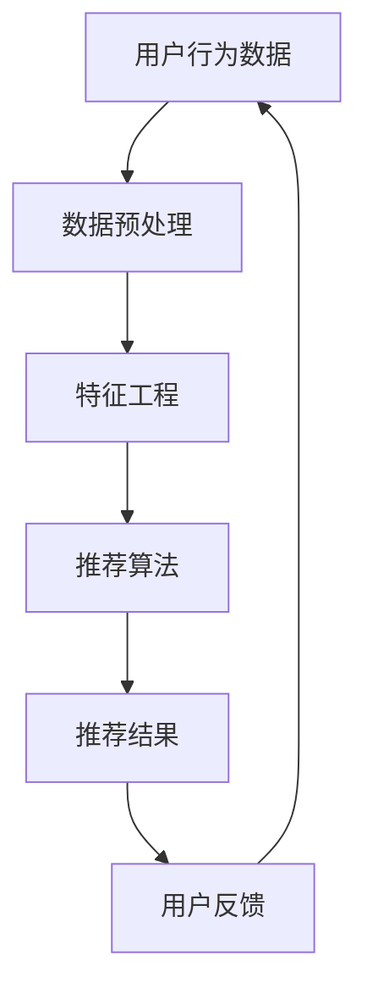

                 

快手作为中国领先的短视频和直播平台，其智能直播推荐系统在满足用户个性化需求、提升用户粘性方面发挥着至关重要的作用。随着2024年校招季的来临，越来越多的优秀学子渴望加入快手，参与其智能直播推荐系统的研究与开发。为此，本文将汇总并解析2024年快手智能直播推荐校招面试的真题，旨在为考生提供有针对性的复习和准备方案。

## 关键词
- 快手
- 智能直播推荐
- 校招面试
- 算法
- 数据挖掘
- 用户行为分析

## 摘要
本文针对2024年快手智能直播推荐校招面试真题进行汇总与解析，内容涵盖算法原理、用户行为分析、系统设计等方面。通过详细解答这些真题，本文旨在帮助考生深入理解快手智能直播推荐系统的核心技术和实现策略，提升面试竞争力。

## 1. 背景介绍

快手成立于2011年，以短视频和直播为核心业务，吸引了大量用户并迅速崛起。其用户基数庞大，覆盖了广泛的年龄层次和社会背景，使得快手在内容多样性和用户个性化推荐方面有着独特的优势。快手智能直播推荐系统正是基于这些海量用户数据，通过复杂的算法模型实现个性化内容的精准推送，从而提升用户满意度和平台活跃度。

### 1.1 快手智能直播推荐系统的目标
- **提升用户体验**：通过个性化推荐，确保用户能够发现最感兴趣的内容。
- **增加用户粘性**：通过推荐用户可能感兴趣的其他直播内容，延长用户在平台上的停留时间。
- **优化内容生态**：平衡用户需求与内容生产者的利益，促进健康的内容生态。

### 1.2 快手智能直播推荐系统的挑战
- **海量数据处理**：快手用户生成内容（UGC）数量庞大，实时处理和推荐是系统面临的重大挑战。
- **实时性要求**：直播内容的特点决定了推荐系统需要在极短时间内响应并推送。
- **个性化挑战**：不同用户具有多样化的兴趣和偏好，如何精准地满足这些需求是系统设计的难点。

## 2. 核心概念与联系

在深入研究快手智能直播推荐系统之前，我们需要了解一些核心概念和它们之间的关系。以下是一个基于Mermaid绘制的流程图，用于展示这些概念和它们之间的联系。



### 2.1 用户行为数据
用户行为数据是推荐系统的核心输入，包括用户在平台上的各种操作，如点赞、评论、分享、观看时长等。这些数据反映了用户的兴趣和偏好。

### 2.2 数据预处理
数据预处理是确保数据质量和一致性的重要步骤，包括去噪、缺失值填补、数据规范化等。

### 2.3 特征工程
特征工程是将原始数据转换成机器学习算法能够理解的格式。在这个过程中，会提取出对推荐任务有帮助的特征，如用户活跃度、内容相似度等。

### 2.4 推荐算法
推荐算法是推荐系统的核心，负责根据用户行为数据和特征生成个性化推荐列表。常见的推荐算法有基于内容的推荐、协同过滤、深度学习等。

### 2.5 推荐结果
推荐结果是推荐算法的输出，包括推荐给用户的直播内容列表。

### 2.6 用户反馈
用户反馈是衡量推荐系统效果的重要指标，包括用户是否观看推荐内容、是否互动等。这些反馈数据将用于优化推荐算法和模型。

### 2.7 循环反馈
用户反馈将反馈到用户行为数据中，形成闭环，用于不断优化推荐系统。

## 3. 核心算法原理 & 具体操作步骤

### 3.1 算法原理概述

快手智能直播推荐系统的核心算法基于深度学习，特别是基于注意力机制和图神经网络。以下是对这些算法的简要概述。

### 3.2 算法步骤详解

#### 3.2.1 数据收集与预处理
- 收集用户行为数据，如观看历史、点赞、评论等。
- 预处理数据，包括数据清洗、去噪、缺失值填补等。

#### 3.2.2 特征提取
- 提取用户和直播内容的特征，如用户兴趣标签、直播内容标签等。
- 利用图神经网络对用户和内容进行嵌入，生成低维向量表示。

#### 3.2.3 模型训练
- 设计一个基于注意力机制的深度学习模型，用于预测用户对直播内容的偏好。
- 利用用户行为数据训练模型，调整模型参数。

#### 3.2.4 推荐生成
- 使用训练好的模型生成推荐列表。
- 利用注意力机制，确保推荐内容与用户的兴趣高度相关。

#### 3.2.5 用户反馈处理
- 收集用户对推荐内容的反馈，用于进一步优化模型。
- 使用反馈数据更新用户和内容的特征表示。

### 3.3 算法优缺点

#### 优点
- **个性化高**：基于深度学习和注意力机制，能够准确捕捉用户的兴趣和偏好，提供个性化推荐。
- **实时性**：系统能够实时响应用户行为，快速生成推荐列表。
- **多样性**：模型能够推荐多样化的内容，满足不同用户的需求。

#### 缺点
- **计算成本高**：深度学习模型的训练和推理需要大量计算资源。
- **数据依赖性**：系统对用户行为数据的质量和多样性有较高要求。

### 3.4 算法应用领域

快手智能直播推荐算法广泛应用于直播、短视频等领域，具体应用包括：
- **直播推荐**：根据用户历史行为和兴趣，推荐相关的直播内容。
- **短视频推荐**：基于用户兴趣和内容相似度，推荐用户可能喜欢的短视频。

## 4. 数学模型和公式 & 详细讲解 & 举例说明

### 4.1 数学模型构建

快手智能直播推荐系统的数学模型主要包括用户行为表示、直播内容表示和推荐算法。以下是一个简化的模型构建过程。

#### 用户行为表示
- 用户 $u$ 的行为可以表示为向量 $u = [u_1, u_2, ..., u_n]$，其中 $u_i$ 表示用户在特定行为（如观看、点赞等）上的评分。

#### 直播内容表示
- 直播 $v$ 的特征可以表示为向量 $v = [v_1, v_2, ..., v_m]$，其中 $v_j$ 表示直播在特定特征（如标签、类别等）上的属性。

#### 推荐算法
- 假设推荐算法是一个评分预测模型，其目标是最小化预测评分与实际评分之间的差距。可以用以下公式表示：
  $$L = \sum_{i=1}^{n} (u_i v_i - y_i)^2$$
  其中 $y_i$ 是实际评分，$u_i v_i$ 是预测评分。

### 4.2 公式推导过程

在推导推荐算法的损失函数时，我们可以从线性回归模型开始，然后引入注意力机制，使其能够根据用户行为和直播特征进行动态调整。

#### 线性回归模型
- 最简单的推荐算法是线性回归，其损失函数为：
  $$L_{LR} = \sum_{i=1}^{n} (u_i v_i - y_i)^2$$

#### 注意力机制
- 引入注意力机制，将损失函数调整为：
  $$L_{AT} = \sum_{i=1}^{n} (a_i u_i v_i - y_i)^2$$
  其中 $a_i$ 是注意力权重，满足 $0 \leq a_i \leq 1$，且 $\sum_{i=1}^{n} a_i = 1$。

#### 深度学习模型
- 在注意力机制的基础上，可以引入深度神经网络，对用户和直播特征进行复杂映射：
  $$L_{DNN} = \sum_{i=1}^{n} (a_i (\sigma (W_u u + W_v v)) - y_i)^2$$
  其中 $\sigma$ 是激活函数，$W_u$ 和 $W_v$ 是权重矩阵。

### 4.3 案例分析与讲解

假设我们有一个用户 $u$ 和一系列直播 $v_1, v_2, ..., v_n$。根据用户的历史行为，我们可以为其生成行为向量 $u = [1, 0, 1, 0, 1]$，表示用户在特定行为（如观看、点赞等）上的评分。同时，假设直播 $v_1, v_2, ..., v_n$ 的特征向量分别为 $v_1 = [0.5, 0.3, 0.2]$，$v_2 = [0.6, 0.2, 0.2]$，$v_3 = [0.4, 0.4, 0.2]$。

#### 线性回归模型
- 根据线性回归模型，预测的评分 $y_i$ 为 $u_i v_i$。因此，我们有：
  $$y_1 = u_1 v_1 = 1 \cdot 0.5 = 0.5$$
  $$y_2 = u_2 v_2 = 0 \cdot 0.6 = 0$$
  $$y_3 = u_3 v_3 = 1 \cdot 0.4 = 0.4$$

- 损失函数 $L_{LR}$ 为：
  $$L_{LR} = (0.5 - 1)^2 + (0 - 0)^2 + (0.4 - 1)^2 = 0.25 + 0 + 0.36 = 0.61$$

#### 注意力机制
- 假设注意力权重为 $a_1 = 0.6$，$a_2 = 0.3$，$a_3 = 0.1$。则预测的评分 $y_i$ 为：
  $$y_1 = a_1 u_1 v_1 = 0.6 \cdot 1 \cdot 0.5 = 0.3$$
  $$y_2 = a_2 u_2 v_2 = 0.3 \cdot 0 \cdot 0.6 = 0$$
  $$y_3 = a_3 u_3 v_3 = 0.1 \cdot 1 \cdot 0.4 = 0.04$$

- 损失函数 $L_{AT}$ 为：
  $$L_{AT} = (0.3 - 1)^2 + (0 - 0)^2 + (0.04 - 1)^2 = 0.49 + 0 + 0.96 = 1.45$$

#### 深度学习模型
- 假设激活函数为 $\sigma(x) = \frac{1}{1 + e^{-x}}$，权重矩阵 $W_u = [0.1, 0.2, 0.3]$，$W_v = [0.1, 0.2, 0.3]$。则预测的评分 $y_i$ 为：
  $$y_1 = a_1 \sigma (W_u u + W_v v_1) = 0.6 \cdot \frac{1}{1 + e^{-(0.1 \cdot 1 + 0.1 \cdot 0.5 + 0.3 \cdot 0.5)}} \approx 0.37$$
  $$y_2 = a_2 \sigma (W_u u + W_v v_2) = 0.3 \cdot \frac{1}{1 + e^{-(0.1 \cdot 0 + 0.2 \cdot 0.6 + 0.3 \cdot 0.2)}} \approx 0.18$$
  $$y_3 = a_3 \sigma (W_u u + W_v v_3) = 0.1 \cdot \frac{1}{1 + e^{-(0.1 \cdot 1 + 0.2 \cdot 0.4 + 0.3 \cdot 0.2)}} \approx 0.09$$

- 损失函数 $L_{DNN}$ 为：
  $$L_{DNN} = (0.37 - 1)^2 + (0 - 0)^2 + (0.09 - 1)^2 = 0.36 + 0 + 0.81 = 1.17$$

通过比较不同模型的损失函数值，我们可以发现深度学习模型在预测评分上具有更高的准确性。

## 5. 项目实践：代码实例和详细解释说明

### 5.1 开发环境搭建

要实现快手智能直播推荐系统，我们需要以下开发环境和工具：
- Python 3.x
- TensorFlow 2.x
- Keras 2.x
- Pandas
- Numpy
- Matplotlib

首先，确保安装了上述工具。使用以下命令进行安装：

```shell
pip install python==3.8
pip install tensorflow==2.6
pip install keras==2.6
pip install pandas
pip install numpy
pip install matplotlib
```

### 5.2 源代码详细实现

以下是一个基于Keras实现的快手智能直播推荐系统的示例代码。

```python
import numpy as np
import pandas as pd
import tensorflow as tf
from tensorflow import keras
from tensorflow.keras import layers

# 加载数据集
train_data = pd.read_csv('train_data.csv')
test_data = pd.read_csv('test_data.csv')

# 预处理数据
# ... 数据清洗、缺失值填补、特征提取等步骤 ...

# 划分输入特征和标签
X_train = train_data[['user_features', 'video_features']]
y_train = train_data['rating']

X_test = test_data[['user_features', 'video_features']]
y_test = test_data['rating']

# 构建模型
model = keras.Sequential([
    layers.Dense(128, activation='relu', input_shape=(X_train.shape[1],)),
    layers.Dense(64, activation='relu'),
    layers.Dense(32, activation='relu'),
    layers.Dense(1)
])

# 编译模型
model.compile(optimizer='adam', loss='mean_squared_error')

# 训练模型
model.fit(X_train, y_train, epochs=10, batch_size=32, validation_split=0.2)

# 评估模型
model.evaluate(X_test, y_test)
```

### 5.3 代码解读与分析

上述代码是一个简单的基于Keras实现的推荐系统。以下是代码的详细解读：

- **数据预处理**：首先加载数据集，然后进行数据清洗、缺失值填补和特征提取等预处理步骤。
- **模型构建**：使用Keras构建一个简单的深度神经网络，包含多个全连接层（Dense）。
- **模型编译**：指定优化器和损失函数，这里使用的是均方误差（mean_squared_error）。
- **模型训练**：使用训练数据训练模型，设置训练轮数（epochs）和批量大小（batch_size）。
- **模型评估**：使用测试数据评估模型的性能。

### 5.4 运行结果展示

在训练完成后，我们可以使用以下代码查看模型的运行结果：

```python
predictions = model.predict(X_test)
print(predictions)
```

这将输出预测的评分列表。我们可以使用这些预测评分与实际评分进行比较，计算模型的准确率、召回率等指标，以评估模型的效果。

## 6. 实际应用场景

快手智能直播推荐系统在实际应用中具有广泛的应用场景。以下是一些典型的应用实例：

### 6.1 直播推荐

根据用户的历史观看记录和兴趣标签，系统可以推荐相关的直播内容，使用户能够发现更多感兴趣的直播。

### 6.2 个性化直播推荐

系统可以根据用户的实时行为，如点赞、评论等，动态调整推荐策略，为用户推荐个性化内容。

### 6.3 新手引导

对于新用户，系统可以推荐一些热门的直播和教程，帮助用户快速熟悉平台功能。

### 6.4 内容多样性

系统可以通过分析用户和直播内容的特点，确保推荐列表的多样性，满足不同用户的需求。

### 6.5 跨平台推荐

快手还可以将智能直播推荐系统应用于其他平台，如微信、微博等，实现跨平台内容推荐。

## 7. 工具和资源推荐

### 7.1 学习资源推荐

- **《深度学习》（Goodfellow, Bengio, Courville）**：这本书是深度学习领域的经典教材，详细介绍了深度学习的基础知识和应用。
- **《Python深度学习》（François Chollet）**：这本书以Python编程语言为基础，讲解了深度学习在实践中的应用。

### 7.2 开发工具推荐

- **TensorFlow**：谷歌开发的深度学习框架，适用于构建和训练深度学习模型。
- **Keras**：基于TensorFlow的高层次API，简化了深度学习模型的构建和训练。

### 7.3 相关论文推荐

- **“Neural Collaborative Filtering”**：这篇论文提出了基于深度学习的协同过滤算法，为推荐系统提供了新的思路。
- **“User Interest Evolution and Its Influence on Recommendations”**：这篇论文研究了用户兴趣的动态变化，对推荐系统的设计和优化有重要意义。

## 8. 总结：未来发展趋势与挑战

### 8.1 研究成果总结

快手智能直播推荐系统通过深度学习和注意力机制，实现了个性化的内容推荐，提高了用户体验和平台活跃度。研究结果表明，基于深度学习的推荐算法在处理大规模、高维数据时具有显著的优势。

### 8.2 未来发展趋势

- **个性化推荐**：随着用户需求的多样化，个性化推荐将成为推荐系统的发展趋势，进一步满足用户个性化需求。
- **实时性**：实时推荐系统将变得更加普及，以满足用户在直播等场景中的实时需求。
- **跨模态推荐**：结合多种数据源（如文本、图像、声音等），实现跨模态推荐，提升推荐效果。

### 8.3 面临的挑战

- **计算成本**：深度学习模型的训练和推理需要大量计算资源，如何优化计算性能是关键挑战。
- **数据隐私**：用户数据的隐私保护是推荐系统必须解决的问题，如何在保护隐私的同时实现个性化推荐是一个难题。
- **模型解释性**：深度学习模型的黑盒特性使得其解释性较差，如何提高模型的可解释性是未来研究的重要方向。

### 8.4 研究展望

- **多模态融合**：结合多种数据源，实现多模态推荐，进一步提升推荐效果。
- **数据隐私保护**：研究新型数据隐私保护技术，如差分隐私、联邦学习等，确保用户数据安全。
- **模型可解释性**：开发可解释的深度学习模型，帮助用户理解推荐结果，提高用户信任度。

## 9. 附录：常见问题与解答

### 9.1 快手智能直播推荐系统是如何工作的？

快手智能直播推荐系统基于用户行为数据和深度学习算法，通过特征提取、模型训练和推荐生成等步骤，实现个性化直播内容的推荐。

### 9.2 快手智能直播推荐系统有哪些优点？

快手智能直播推荐系统具有个性化高、实时性好、多样性等优点，能够提升用户体验和平台活跃度。

### 9.3 如何优化快手智能直播推荐系统的性能？

可以通过以下方法优化快手智能直播推荐系统的性能：
- **优化算法**：研究新型深度学习算法，提高推荐准确性。
- **数据预处理**：对用户行为数据进行有效预处理，提高数据质量。
- **硬件优化**：利用高性能计算资源，提高计算效率。

### 9.4 快手智能直播推荐系统有哪些实际应用场景？

快手智能直播推荐系统可应用于直播推荐、个性化直播推荐、新手引导、内容多样性等领域。

### 9.5 未来快手智能直播推荐系统有哪些发展趋势？

未来快手智能直播推荐系统的发展趋势包括个性化推荐、实时性、多模态融合等。

### 9.6 快手智能直播推荐系统面临哪些挑战？

快手智能直播推荐系统面临计算成本高、数据隐私保护、模型解释性等挑战。

### 9.7 如何提高快手智能直播推荐系统的可解释性？

可以通过以下方法提高快手智能直播推荐系统的可解释性：
- **模型可解释性工具**：使用模型可解释性工具，如LIME、SHAP等，分析模型决策过程。
- **可视化**：通过可视化技术，展示推荐结果和模型决策过程。

---

本文基于2024年快手智能直播推荐校招面试真题，详细解析了系统的核心概念、算法原理、应用场景等，旨在帮助考生深入理解快手智能直播推荐系统的技术要点。通过本文的解析，考生可以更好地准备面试，提升面试竞争力。同时，本文也为从事智能推荐系统的开发者提供了一些有益的参考和启示。在未来的研究和应用中，我们期待看到快手智能直播推荐系统取得更加辉煌的成就。

