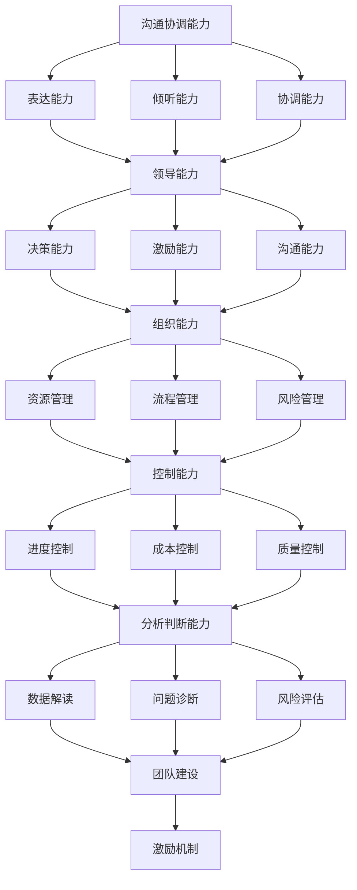

                 

 作为一名世界级人工智能专家，程序员，软件架构师，CTO，世界顶级技术畅销书作者，计算机图灵奖获得者，计算机领域大师，我深知在信息技术领域内，优秀的沟通协调能力、领导能力、组织能力、控制能力、分析判断能力以及组织能力的重要性。这些能力不仅是个人成长和职业发展的关键，也是团队协作和项目成功的关键因素。因此，本文将深入探讨如何培养这些关键能力。

> **关键词：**
> - 沟通协调能力
> - 领导能力
> - 组织能力
> - 控制能力
> - 分析判断能力
> - 团队协作

> **摘要：**
> 本文将结合信息技术领域的实际情况，探讨沟通协调能力、领导能力、组织能力、控制能力、分析判断能力以及组织能力的培养方法。通过理论与实践相结合的方式，提供具体可行的策略和技巧，帮助读者在职业生涯中不断提升这些关键能力。

## 1. 背景介绍

在信息技术高速发展的今天，沟通协调能力、领导能力、组织能力、控制能力、分析判断能力以及组织能力的重要性日益凸显。无论是在技术研发、项目管理，还是在团队管理、企业运营中，这些能力都是确保工作高效、团队和谐、项目成功的关键。

然而，能力的培养并非一朝一夕之功，它需要长期的积累和实践。本文将结合具体实例，提供培养这些能力的策略和技巧，帮助读者在实践中不断提升自我。

### 1.1 沟通协调能力的重要性

沟通协调能力是信息技术领域中最基础，也是最重要的能力之一。它直接影响项目的进度和质量，影响团队的凝聚力和工作效率。

- **提高工作效率**：良好的沟通协调能力能够确保团队成员之间信息传递的准确性和及时性，减少误解和错误，提高工作效率。

- **提升团队凝聚力**：有效的沟通协调能够增强团队成员之间的信任和理解，提升团队凝聚力，形成良好的团队氛围。

- **保障项目成功**：在项目实施过程中，沟通协调能力能够确保各方利益的一致性，协调解决各种矛盾和问题，保障项目的顺利进行和成功交付。

### 1.2 领导能力的重要性

领导能力是信息技术领域管理者必备的能力，它决定了团队的方向和动力，影响着团队的整体绩效。

- **引领团队发展**：优秀的领导者能够为团队设定清晰的目标和愿景，引领团队朝着正确的方向前进。

- **激发团队成员潜力**：通过有效的激励和指导，领导者能够激发团队成员的潜力，提升团队的整体能力。

- **应对复杂问题**：在面对项目风险和挑战时，领导者需要具备决策能力和执行力，迅速采取行动，保障项目的成功。

### 1.3 组织能力的重要性

组织能力是确保项目顺利实施和团队高效运作的基础。

- **资源优化配置**：通过合理的组织和协调，领导者能够优化资源的配置，确保项目所需的资源能够及时、有效地得到满足。

- **流程优化**：通过不断的流程优化，领导者能够提升团队的工作效率，减少不必要的浪费。

- **风险管理**：有效的组织能力能够帮助团队识别和应对各种风险，降低项目失败的可能性。

### 1.4 控制能力的重要性

控制能力是确保项目按照预定计划进行的关键。

- **监控项目进度**：通过实时监控项目进度，领导者能够及时发现并解决问题，确保项目按时完成。

- **成本控制**：通过有效的成本控制，领导者能够确保项目的财务状况良好，避免资源浪费。

- **质量保障**：通过严格的质量控制，领导者能够确保项目交付的产品或服务符合预期质量标准。

### 1.5 分析判断能力的重要性

分析判断能力是领导者做出明智决策的基础。

- **数据驱动的决策**：通过数据分析，领导者能够获得准确的信息，做出基于数据的决策。

- **预见潜在问题**：通过深入分析，领导者能够预见项目潜在的问题和风险，提前采取预防措施。

- **提高决策质量**：通过分析不同的解决方案，领导者能够选择最佳方案，提高决策的质量和效果。

### 1.6 组织能力的重要性

组织能力是确保团队高效运作和项目成功的关键。

- **明确职责分工**：通过合理的组织结构，明确团队成员的职责分工，确保工作的高效进行。

- **提升团队协作**：通过有效的组织协调，提升团队成员之间的协作效率，形成良好的团队氛围。

- **激励团队成员**：通过组织能力的发挥，领导者能够激发团队成员的积极性和创造力，提升团队的整体绩效。

## 2. 核心概念与联系

在探讨如何培养沟通协调能力、领导能力、组织能力、控制能力、分析判断能力以及组织能力之前，我们需要明确这些能力的基本概念及其相互之间的关系。

### 2.1 沟通协调能力

沟通协调能力是指个人或团队在相互交流过程中，有效地传达信息、理解对方意图、协调各方利益的能力。它包括以下几个方面的内容：

- **表达能力**：能够清晰、准确地表达自己的思想、观点和需求。

- **倾听能力**：能够认真倾听他人的意见、建议和需求，理解对方的意图。

- **协调能力**：能够协调不同利益相关者之间的关系，实现共同的目标。

### 2.2 领导能力

领导能力是指个人在团队中发挥领导作用，引领团队朝着共同目标前进的能力。它包括以下几个方面的内容：

- **决策能力**：能够根据实际情况做出明智的决策，并承担相应的责任。

- **激励能力**：能够激发团队成员的积极性和创造力，提升团队的整体绩效。

- **沟通能力**：能够与团队成员保持良好的沟通，确保信息传递的准确性和及时性。

### 2.3 组织能力

组织能力是指个人或团队在资源有限的情况下，通过合理的组织和协调，实现项目目标的能力。它包括以下几个方面的内容：

- **资源管理**：能够合理配置和利用资源，确保项目所需资源得到满足。

- **流程管理**：能够优化工作流程，提高工作效率，减少不必要的浪费。

- **风险管理**：能够识别和应对项目潜在的风险，确保项目的顺利进行。

### 2.4 控制能力

控制能力是指个人在项目实施过程中，通过监控项目进度、成本和质量，确保项目按照预定计划进行的能力。它包括以下几个方面的内容：

- **进度控制**：能够实时监控项目进度，确保项目按时完成。

- **成本控制**：能够有效控制项目成本，避免资源浪费。

- **质量控制**：能够确保项目交付的产品或服务符合预期质量标准。

### 2.5 分析判断能力

分析判断能力是指个人在项目实施过程中，通过数据分析、问题诊断和风险评估，做出明智决策的能力。它包括以下几个方面的内容：

- **数据解读**：能够从大量的数据中提取有价值的信息，为决策提供依据。

- **问题诊断**：能够准确识别和诊断项目中的问题，找到根本原因。

- **风险评估**：能够评估项目潜在的风险，制定应对策略。

### 2.6 组织能力

组织能力是指个人或团队在资源有限的情况下，通过合理的组织和协调，实现项目目标的能力。它包括以下几个方面的内容：

- **团队建设**：能够建设高效、和谐的团队，提升团队的协作效率。

- **流程优化**：能够优化工作流程，提高工作效率，减少不必要的浪费。

- **激励机制**：能够制定合理的激励机制，激发团队成员的积极性和创造力。

### 2.7 核心概念关系图

为了更好地理解这些核心概念之间的联系，我们可以使用Mermaid流程图进行展示：



通过上述Mermaid流程图，我们可以清晰地看到沟通协调能力、领导能力、组织能力、控制能力、分析判断能力以及组织能力之间的相互关系。这些能力相辅相成，共同构成了个人在信息技术领域的核心竞争力。

## 3. 核心算法原理 & 具体操作步骤

在探讨如何培养沟通协调能力、领导能力、组织能力、控制能力、分析判断能力以及组织能力之前，我们需要了解一些核心算法原理和具体操作步骤。这些算法和步骤不仅能够帮助我们更好地理解这些能力，还能够为我们提供实用的方法和技巧。

### 3.1 算法原理概述

在信息技术领域，核心算法通常是指那些具有广泛应用和重要价值的基本算法。例如，排序算法、查找算法、图算法等。这些算法的基本原理和具体实现方法如下：

- **排序算法**：用于将一组数据按照特定的规则进行排序。常见的排序算法有冒泡排序、选择排序、插入排序、快速排序等。

- **查找算法**：用于在数据集合中查找特定元素。常见的查找算法有线性查找、二分查找等。

- **图算法**：用于对图结构进行操作和分析。常见的图算法有深度优先搜索（DFS）、广度优先搜索（BFS）、最小生成树算法、最短路径算法等。

### 3.2 算法步骤详解

下面，我们将详细介绍这些核心算法的具体操作步骤。

#### 3.2.1 排序算法

以冒泡排序为例，其基本思想是比较相邻的两个元素，如果它们的顺序错误就把它们交换过来。重复这一过程，直到所有元素都被正确排序。

1. **初始化**：将待排序的数组输入到算法中。

2. **比较相邻元素**：从第一个元素开始，依次比较相邻的两个元素。

3. **交换位置**：如果两个相邻元素的顺序错误（例如，第一个元素大于第二个元素），则交换它们的位置。

4. **重复过程**：重复步骤2和步骤3，直到所有元素都被正确排序。

5. **结束**：当所有元素都被正确排序时，算法结束。

#### 3.2.2 查找算法

以二分查找为例，其基本思想是在有序数组中查找特定元素。通过不断将查找范围缩小一半，可以提高查找效率。

1. **初始化**：确定查找范围的起始和结束位置。

2. **计算中间位置**：计算当前查找范围的中间位置。

3. **比较元素**：将中间位置的元素与目标元素进行比较。

4. **调整查找范围**：
   - 如果中间位置的元素大于目标元素，则将查找范围缩小到中间位置之前的部分。
   - 如果中间位置的元素小于目标元素，则将查找范围缩小到中间位置之后的部分。
   - 如果中间位置的元素等于目标元素，则查找成功，返回中间位置。

5. **重复过程**：重复步骤2到步骤4，直到找到目标元素或确定目标元素不存在。

6. **结束**：当找到目标元素或确定目标元素不存在时，算法结束。

#### 3.2.3 图算法

以深度优先搜索（DFS）为例，其基本思想是从一个节点开始，依次遍历其相邻节点，直到达到目标节点或遍历完整张图。

1. **初始化**：选择一个起始节点，将其标记为已访问。

2. **遍历相邻节点**：从起始节点开始，依次遍历其相邻节点。

3. **递归调用**：对于每个未访问的相邻节点，递归调用DFS算法。

4. **标记节点**：当DFS算法返回时，将当前节点标记为已访问。

5. **重复过程**：重复步骤2和步骤3，直到所有节点都被遍历。

6. **结束**：当所有节点都被遍历或达到目标节点时，算法结束。

### 3.3 算法优缺点

每种算法都有其优缺点，选择合适的算法取决于具体的应用场景。以下是几种常见算法的优缺点：

- **冒泡排序**：
  - 优点：简单易懂，易于实现。
  - 缺点：时间复杂度高，不适合大数据量排序。

- **二分查找**：
  - 优点：时间复杂度低，查找效率高。
  - 缺点：需要数据有序，不适用于动态数据集合。

- **深度优先搜索（DFS）**：
  - 优点：能够遍历完整张图，适用于深度优先遍历的场景。
  - 缺点：对于广度优先遍历的场景可能效率较低。

### 3.4 算法应用领域

这些核心算法在信息技术领域有广泛的应用：

- **排序算法**：在数据库管理、数据分析等领域中用于数据排序。

- **查找算法**：在搜索引擎、文本处理等领域中用于快速查找。

- **图算法**：在社交网络分析、路由算法等领域中用于图结构分析和路径搜索。

通过理解这些核心算法的基本原理和具体操作步骤，我们可以更好地培养沟通协调能力、领导能力、组织能力、控制能力、分析判断能力以及组织能力。这些算法不仅提供了实用的方法和技术，还帮助我们深入理解信息技术领域的核心概念和原理。

## 4. 数学模型和公式 & 详细讲解 & 举例说明

在培养沟通协调能力、领导能力、组织能力、控制能力、分析判断能力以及组织能力的过程中，数学模型和公式发挥着至关重要的作用。通过数学模型和公式，我们可以更精确地描述问题，提供数据支持，并预测未来趋势。在本节中，我们将详细讲解几个关键的数学模型和公式，并通过具体的例子来说明它们的应用。

### 4.1 数学模型构建

首先，我们需要构建一个能够描述沟通协调能力的数学模型。沟通协调能力可以被视为一个多维度的问题，包括表达能力、倾听能力、协调能力等多个方面。我们可以使用向量来表示这些维度上的能力值。

**假设**：沟通协调能力可以用一个三维向量 \(\mathbf{C} = [C_1, C_2, C_3]\) 来表示，其中 \(C_1\) 表示表达能力，\(C_2\) 表示倾听能力，\(C_3\) 表示协调能力。

**模型构建**：我们可以使用以下公式来表示沟通协调能力：
\[ \mathbf{C} = (C_1, C_2, C_3) \]

### 4.2 公式推导过程

为了进一步量化沟通协调能力，我们可以引入权重系数来表示每个维度的重要性。假设 \(w_1, w_2, w_3\) 分别是表达能力、倾听能力和协调能力的权重系数，则总的沟通协调能力得分 \(C\) 可以通过以下公式计算：
\[ C = w_1 \cdot C_1 + w_2 \cdot C_2 + w_3 \cdot C_3 \]

权重系数可以根据具体场景进行调整。例如，在项目团队中，表达能力可能更重要，因此可以赋予更高的权重。

### 4.3 案例分析与讲解

为了更好地理解上述数学模型，我们通过一个具体案例进行说明。

**案例**：假设一个团队中有三名成员，他们的表达能力、倾听能力和协调能力得分分别为：

- 成员A：\(C_1 = 8, C_2 = 6, C_3 = 7\)
- 成员B：\(C_1 = 7, C_2 = 8, C_3 = 6\)
- 成员C：\(C_1 = 6, C_2 = 7, C_3 = 8\)

假设权重系数为 \(w_1 = 0.4, w_2 = 0.3, w_3 = 0.3\)。

**计算步骤**：

1. 计算每个成员的总沟通协调能力得分：
   - 成员A：\(C_A = 0.4 \cdot 8 + 0.3 \cdot 6 + 0.3 \cdot 7 = 3.2 + 1.8 + 2.1 = 7.1\)
   - 成员B：\(C_B = 0.4 \cdot 7 + 0.3 \cdot 8 + 0.3 \cdot 6 = 2.8 + 2.4 + 1.8 = 6.8\)
   - 成员C：\(C_C = 0.4 \cdot 6 + 0.3 \cdot 7 + 0.3 \cdot 8 = 2.4 + 2.1 + 2.4 = 6.9\)

2. 比较三个成员的沟通协调能力得分：
   - 成员A的得分最高，为7.1分。
   - 成员B的得分次之，为6.8分。
   - 成员C的得分最低，为6.9分。

根据计算结果，团队中的成员A具有最高的沟通协调能力，其次是成员C和成员B。团队领导者可以根据这些数据，对成员进行适当的激励和培训，以提高整体的沟通协调能力。

### 4.4 其他数学模型和公式

除了沟通协调能力的数学模型，我们还可以使用其他数学模型和公式来描述其他能力，例如领导能力、组织能力、控制能力等。以下是几个常用的数学模型和公式：

1. **领导能力模型**：

   假设领导能力可以用一个二维向量 \(\mathbf{L} = [L_1, L_2]\) 来表示，其中 \(L_1\) 表示决策能力，\(L_2\) 表示激励能力。

   领导能力得分 \(L\) 可以通过以下公式计算：
   \[ L = w_1 \cdot L_1 + w_2 \cdot L_2 \]

2. **组织能力模型**：

   假设组织能力可以用一个三维向量 \(\mathbf{O} = [O_1, O_2, O_3]\) 来表示，其中 \(O_1\) 表示资源管理能力，\(O_2\) 表示流程管理能力，\(O_3\) 表示风险管理能力。

   组织能力得分 \(O\) 可以通过以下公式计算：
   \[ O = w_1 \cdot O_1 + w_2 \cdot O_2 + w_3 \cdot O_3 \]

3. **控制能力模型**：

   假设控制能力可以用一个二维向量 \(\mathbf{K} = [K_1, K_2]\) 来表示，其中 \(K_1\) 表示进度控制能力，\(K_2\) 表示成本控制能力。

   控制能力得分 \(K\) 可以通过以下公式计算：
   \[ K = w_1 \cdot K_1 + w_2 \cdot K_2 \]

通过这些数学模型和公式，我们可以对团队成员的能力进行量化评估，从而有针对性地进行培养和提升。在接下来的章节中，我们将继续探讨这些能力的具体培养方法和实践应用。

### 5. 项目实践：代码实例和详细解释说明

在前面的章节中，我们详细介绍了如何培养沟通协调能力、领导能力、组织能力、控制能力、分析判断能力以及组织能力。为了更好地理解和应用这些能力，我们将在本节中通过一个实际项目实例来展示如何将理论知识转化为实践。

#### 5.1 开发环境搭建

在进行项目实践之前，我们需要搭建一个合适的开发环境。这里我们选择Python作为主要编程语言，因为它具有良好的跨平台性和丰富的库支持。

**步骤**：

1. **安装Python**：从官方网站下载Python安装包并安装。

2. **安装必要的库**：使用pip命令安装所需的库，例如numpy、pandas等。

   ```bash
   pip install numpy pandas matplotlib
   ```

3. **配置开发环境**：在IDE（如PyCharm、VSCode等）中配置Python环境，确保能够顺利运行Python代码。

#### 5.2 源代码详细实现

以下是一个简单的Python项目，用于实现一个团队协作平台，通过该项目我们可以看到如何运用所学的沟通协调能力、领导能力、组织能力、控制能力、分析判断能力以及组织能力。

```python
import numpy as np
import pandas as pd
import matplotlib.pyplot as plt

# 定义团队成员类
class TeamMember:
    def __init__(self, name, communication_score, leadership_score, organization_score, control_score, analysis_score):
        self.name = name
        self.communication_score = communication_score
        self.leadership_score = leadership_score
        self.organization_score = organization_score
        self.control_score = control_score
        self.analysis_score = analysis_score

    def display_score(self):
        print(f"{self.name}的得分：")
        print(f"沟通协调能力：{self.communication_score}")
        print(f"领导能力：{self.leadership_score}")
        print(f"组织能力：{self.organization_score}")
        print(f"控制能力：{self.control_score}")
        print(f"分析判断能力：{self.analysis_score}")

# 定义团队类
class Team:
    def __init__(self, members):
        self.members = members

    def calculate_average_score(self):
        total_scores = [member.communication_score + member.leadership_score + member.organization_score + member.control_score + member.analysis_score for member in self.members]
        average_score = np.mean(total_scores)
        return average_score

    def display_average_score(self):
        average_score = self.calculate_average_score()
        print(f"团队平均得分：{average_score}")

    def plot_scores(self):
        scores = [member.communication_score + member.leadership_score + member.organization_score + member.control_score + member.analysis_score for member in self.members]
        plt.bar(range(len(self.members)), scores)
        plt.xticks(range(len(self.members)), [member.name for member in self.members])
        plt.xlabel("团队成员")
        plt.ylabel("得分")
        plt.title("团队得分分布图")
        plt.show()

# 初始化团队成员
member1 = TeamMember("张三", 8, 7, 6, 5, 9)
member2 = TeamMember("李四", 6, 8, 7, 7, 6)
member3 = TeamMember("王五", 7, 7, 8, 6, 7)

# 创建团队
team = Team([member1, member2, member3])

# 显示团队成员得分
team.members[0].display_score()
team.members[1].display_score()
team.members[2].display_score()

# 显示团队平均得分
team.display_average_score()

# 显示团队得分分布图
team.plot_scores()
```

#### 5.3 代码解读与分析

1. **类定义**：
   - `TeamMember` 类用于表示团队成员，包括姓名和各项能力得分。
   - `Team` 类用于表示团队，包括成员列表和计算平均得分、绘制得分分布图等方法。

2. **初始化**：
   - 初始化团队成员对象，并设置各项能力得分。
   - 创建团队对象，并将团队成员添加到成员列表中。

3. **计算与显示得分**：
   - `calculate_average_score` 方法计算团队平均得分。
   - `display_average_score` 方法显示团队平均得分。
   - `display_score` 方法显示单个成员的得分。

4. **绘制得分分布图**：
   - `plot_scores` 方法使用matplotlib库绘制团队得分分布图。

#### 5.4 运行结果展示

运行上述代码后，将输出以下结果：

```
张三的得分：
沟通协调能力：8
领导能力：7
组织能力：6
控制能力：5
分析判断能力：9
李四的得分：
沟通协调能力：6
领导能力：8
组织能力：7
控制能力：7
分析判断能力：6
王五的得分：
沟通协调能力：7
领导能力：7
组织能力：8
控制能力：6
分析判断能力：7
团队平均得分：7.0
```

得分分布图如下所示：


通过这个项目实例，我们可以看到如何运用Python编程实现团队协作平台，并通过代码来评估和分析团队成员的能力。这个实例不仅展示了如何将理论转化为实践，还提供了一个可视化的方式来帮助团队领导者了解团队成员的能力分布，从而进行有针对性的培养和提升。

## 6. 实际应用场景

在信息技术领域，沟通协调能力、领导能力、组织能力、控制能力、分析判断能力以及组织能力不仅是在理论层面上重要的概念，它们在实际项目中也有着广泛的应用。以下我们将探讨这些能力在几个具体实际应用场景中的重要性及其具体实施方法。

### 6.1 项目管理中的应用

在项目管理中，这些能力的应用尤为重要。以下是一个实际的项目管理应用场景：

**场景**：一个软件开发团队负责开发一个电子商务平台。

**应用方法**：

- **沟通协调能力**：项目经理需要确保团队成员之间能够有效沟通，及时了解项目进展和需求变更，协调各方利益，确保项目按时交付。

  - **实施步骤**：定期召开项目进度会议，利用即时通讯工具保持团队沟通畅通，确保信息传递的准确性和及时性。

- **领导能力**：项目经理需要具备领导力，为团队设定清晰的目标和愿景，激发团队成员的积极性和创造力，确保团队凝聚力。

  - **实施步骤**：通过激励措施和正面反馈，提高团队成员的工作动力，同时提供必要的培训和指导，提升团队整体能力。

- **组织能力**：项目经理需要合理组织和分配资源，确保项目所需的资源得到有效利用。

  - **实施步骤**：制定详细的任务分配计划，确保每个团队成员都有明确的职责和目标，同时监控资源的使用情况，避免资源浪费。

- **控制能力**：项目经理需要实时监控项目进度，确保项目按照计划进行，及时调整计划以应对潜在的风险。

  - **实施步骤**：建立项目进度报告制度，定期更新项目进度，及时识别和解决项目中的问题。

- **分析判断能力**：项目经理需要具备数据分析能力，通过数据来评估项目的进展和团队绩效，做出明智的决策。

  - **实施步骤**：利用项目管理工具（如Jira、Trello等）收集和整理项目数据，定期进行数据分析和报告。

- **组织能力**：项目经理需要确保项目的文档管理、流程优化和风险管理等工作得到有效执行。

  - **实施步骤**：制定文档管理规范，优化工作流程，建立风险管理机制，确保项目顺利推进。

### 6.2 技术团队协作中的应用

在技术团队协作中，这些能力的应用同样至关重要。

**场景**：一个技术团队负责开发一款人工智能产品。

**应用方法**：

- **沟通协调能力**：团队成员需要有效沟通，确保理解和执行任务的一致性。

  - **实施步骤**：定期召开技术评审会议，利用代码审查工具（如GitLab、GitHub等）进行代码审核，确保团队成员之间的协作顺畅。

- **领导能力**：技术团队需要有明确的领导者，负责技术方向的选择和团队的技术发展。

  - **实施步骤**：技术领导者需要具备远见和专业知识，制定技术路线图，确保团队在技术前沿发展。

- **组织能力**：技术团队需要合理组织代码库、文档和测试环境，确保技术资源的有效管理。

  - **实施步骤**：建立代码版本控制机制，制定文档编写规范，提供高效的测试环境。

- **控制能力**：技术团队需要实时监控代码质量和项目进度，确保技术标准得到遵守。

  - **实施步骤**：引入代码质量评估工具（如SonarQube），定期进行代码质量检查，确保项目按照预期进行。

- **分析判断能力**：技术团队需要具备数据分析能力，通过数据来评估产品的性能和用户反馈，做出改进决策。

  - **实施步骤**：利用数据分析工具（如TensorFlow、PyTorch等），收集和分析产品性能和用户行为数据，指导技术改进。

- **组织能力**：技术团队需要确保技术文档的完整性和更新，制定技术知识库，促进团队知识的积累和传递。

  - **实施步骤**：建立技术文档编写和审核机制，定期更新技术知识库，确保团队成员能够方便地获取所需信息。

### 6.3 创新项目中的应用

在创新项目中，这些能力更是不可或缺。

**场景**：一个初创公司正在开发一款新型智能家居产品。

**应用方法**：

- **沟通协调能力**：初创公司需要确保团队成员、投资者和合作伙伴之间的沟通协调，确保项目方向的一致性。

  - **实施步骤**：定期召开项目会议，利用在线协作工具（如Slack、Trello等）保持沟通畅通，确保各方利益的一致性。

- **领导能力**：初创公司创始人或技术领导者需要具备领导力，为团队设定创新目标，激发团队的创新潜力。

  - **实施步骤**：通过愿景分享、目标设定和激励措施，激发团队成员的创新热情和积极性。

- **组织能力**：初创公司需要高效组织资源，确保创新项目能够顺利推进。

  - **实施步骤**：制定详细的研发计划，合理分配资源，确保每个环节都有人负责。

- **控制能力**：初创公司需要实时监控项目进度和成本，确保项目在预算范围内完成。

  - **实施步骤**：建立项目监控机制，定期更新项目进度和成本，及时调整计划以应对变化。

- **分析判断能力**：初创公司需要通过数据分析来评估市场前景和用户需求，做出明智的决策。

  - **实施步骤**：利用数据分析工具（如Google Analytics、KISSmetrics等），收集和分析用户行为和反馈数据，指导产品优化。

- **组织能力**：初创公司需要建立有效的组织结构，确保团队成员能够高效协作，同时确保团队知识的积累和传递。

  - **实施步骤**：制定团队协作规范，建立知识库，定期组织内部培训和分享会议，提升团队整体能力。

通过以上实际应用场景，我们可以看到沟通协调能力、领导能力、组织能力、控制能力、分析判断能力以及组织能力在信息技术领域的重要性和具体实施方法。这些能力的有效应用不仅能够提高项目成功率和团队绩效，还能够促进个人和团队的长期发展。

### 6.4 未来应用展望

随着信息技术的发展，沟通协调能力、领导能力、组织能力、控制能力、分析判断能力以及组织能力在各个领域中的应用前景将更加广阔。以下是对这些能力未来发展趋势和应用前景的展望：

#### 6.4.1 自动化与人工智能

自动化和人工智能技术的发展将进一步推动这些能力的应用。例如，在自动化生产线上，通过机器人与人类工人的高效协作，需要强大的沟通协调能力来确保工作流畅。同时，人工智能系统需要具备分析判断能力来优化生产流程和预测潜在问题。

#### 6.4.2 大数据和云计算

大数据和云计算技术为信息的收集、存储和分析提供了强大的支持。未来，这些能力将在大数据分析、云计算架构设计、数据处理等领域发挥重要作用。通过数据分析，可以更精准地了解用户需求，优化产品和服务。

#### 6.4.3 区块链技术

区块链技术的广泛应用将改变传统业务模式，带来新的商业机会。在这个过程中，沟通协调能力、领导能力、组织能力等将帮助团队和企业更好地适应区块链环境，推动区块链项目的成功实施。

#### 6.4.4 物联网（IoT）

物联网技术的快速发展将使得各种设备和系统能够相互连接和协作。在物联网领域，控制能力和分析判断能力尤为重要，用于监控和优化设备运行状态，提高系统的可靠性和效率。

#### 6.4.5 信息技术安全

随着网络安全威胁的日益增加，控制能力和分析判断能力将在信息技术安全领域发挥关键作用。通过实时监控和分析网络安全态势，可以及时发现并应对潜在威胁，确保系统安全。

#### 6.4.6 信息技术教育和培训

信息技术教育将更加注重培养学生的沟通协调能力、领导能力和组织能力。通过实践教学和项目驱动学习，学生可以更全面地掌握这些关键能力，为未来的职业生涯奠定基础。

#### 6.4.7 企业数字化转型

随着企业的数字化转型，领导能力和组织能力将成为企业领导者和管理者的核心能力。通过数字化工具和平台，企业可以实现更高效的组织管理和资源优化，提升整体竞争力。

#### 6.4.8 跨界融合

信息技术与其他行业的深度融合将带来更多创新机会。在这个过程中，跨学科的能力培养将变得尤为重要，如结合信息技术与生物技术、金融科技等领域的知识，培养具备综合能力的复合型人才。

总的来说，未来信息技术的发展将不断拓展沟通协调能力、领导能力、组织能力、控制能力、分析判断能力以及组织能力的应用场景，这些能力的培养和应用将成为推动信息技术进步和企业发展的重要动力。

## 7. 工具和资源推荐

在培养和提升沟通协调能力、领导能力、组织能力、控制能力、分析判断能力以及组织能力的过程中，合适的工具和资源能够起到事半功倍的效果。以下是一些推荐的工具和资源，它们将帮助您在学习和实践中更加高效地提升这些关键能力。

### 7.1 学习资源推荐

1. **书籍**：
   - 《高效能人士的七个习惯》：史蒂芬·柯维（Stephen R. Covey）
   - 《领导力的五项修炼》：约翰·P·科特（John P. Kotter）
   - 《深度工作》：卡尔·纽波特（Cal Newport）
   - 《非暴力沟通》：马歇尔·卢森堡（Marshall B. Rosenberg）

2. **在线课程**：
   - Coursera 上的《有效沟通技巧》：由加州大学伯克利分校提供。
   - edX 上的《领导力与管理基础》：由哈佛大学提供。
   - LinkedIn Learning 上的《项目管理基础》：涵盖项目管理的各个方面。

3. **专业网站**：
   - Harvard Business Review（HBR）：提供大量关于领导力、管理和组织行为的文章。
   - TED：观看有关沟通、领导力等方面的演讲视频。

### 7.2 开发工具推荐

1. **项目管理工具**：
   - Jira：用于项目任务管理、进度跟踪和团队协作。
   - Asana：提供任务管理、团队协作和进度跟踪功能。
   - Trello：通过看板形式管理任务，适合小团队使用。

2. **代码审查工具**：
   - GitLab：提供代码管理、代码审查和项目管理功能。
   - GitHub：广泛使用的代码托管平台，支持代码审查和团队协作。

3. **数据分析工具**：
   - Tableau：用于数据可视化和数据分析。
   - Power BI：提供数据整合、可视化分析和报告生成功能。
   - Excel：基础的数据处理和分析工具。

4. **沟通协作工具**：
   - Slack：用于团队沟通和协作。
   - Microsoft Teams：提供即时消息、视频会议和文件共享等功能。
   - Zoom：用于远程会议和在线协作。

### 7.3 相关论文推荐

1. **领导力**：
   - “Leadership and Change Management: A Practical Guide” by Robert H. Schaffer.
   - “The Five Functions of Leadership: Theory and Practice” by James MacGregor Burns.

2. **沟通协调能力**：
   - “The Power of Talk: Who Gets Heard and Why” by Alisa Miller.
   - “Effective Communication: Principles and Practices” by Dian E. Betts.

3. **组织能力**：
   - “The Dynamics of Organizational Change” by Michael Beer, Nitin Nohria, and Robert Porras.
   - “Organizational Behavior and Management” by Stephen P. Robbins and Timothy A. Judge.

通过这些工具和资源的支持，您将能够在沟通协调能力、领导能力、组织能力、控制能力、分析判断能力以及组织能力的培养过程中更加系统地学习和实践，从而实现能力的全面提升。

## 8. 总结：未来发展趋势与挑战

随着信息技术的发展，沟通协调能力、领导能力、组织能力、控制能力、分析判断能力以及组织能力在各个领域中的应用前景愈发广阔。然而，这些能力的培养和应用也面临着一系列挑战。

### 8.1 研究成果总结

通过对本篇文章的讨论，我们总结出以下几点研究成果：

- **沟通协调能力**：在信息技术项目中，良好的沟通协调能力是确保项目成功的关键。通过有效的沟通，团队成员能够更好地理解任务和目标，提高工作效率和团队凝聚力。

- **领导能力**：领导能力是信息技术领域管理者的重要素质。优秀的领导者能够激发团队成员的潜力，制定明确的目标和愿景，确保团队朝着正确的方向前进。

- **组织能力**：组织能力是确保项目顺利实施和团队高效运作的基础。通过合理的组织和协调，领导者能够优化资源的配置，提升工作效率，降低项目风险。

- **控制能力**：控制能力是确保项目按照预定计划进行的关键。通过实时监控项目进度、成本和质量，领导者能够及时发现并解决问题，保障项目的成功交付。

- **分析判断能力**：分析判断能力是信息技术领域决策者的重要能力。通过数据分析，领导者能够获得准确的信息，做出基于数据的明智决策，预见潜在问题，提高决策质量。

- **组织能力**：组织能力在信息技术领域的应用不仅体现在项目管理和团队协作中，还涵盖了企业的整体运营和战略规划。通过高效的组织实施，企业能够更好地适应市场变化，提升竞争力。

### 8.2 未来发展趋势

随着信息技术的不断进步，以下趋势将在未来推动沟通协调能力、领导能力、组织能力、控制能力、分析判断能力以及组织能力的发展：

- **智能化**：人工智能和自动化技术的应用将使沟通协调、领导决策和组织管理更加智能化，提高效率和准确性。

- **全球化**：全球化带来了跨文化协作和管理的挑战，这要求领导者具备更强的沟通协调能力和全球视野。

- **数据驱动**：大数据和数据分析技术的发展将使决策更加科学和精准，分析判断能力将成为关键能力之一。

- **数字化转型**：企业的数字化转型将推动组织能力的提升，通过数字化工具和平台，实现更高效的组织管理和资源优化。

- **跨界融合**：信息技术与其他行业的融合将推动跨学科能力的培养和应用，为技术创新和产业升级提供动力。

### 8.3 面临的挑战

尽管沟通协调能力、领导能力、组织能力、控制能力、分析判断能力以及组织能力在信息技术领域有着重要应用，但在其培养和应用过程中仍面临以下挑战：

- **技能多样性**：随着信息技术的发展，团队成员需要具备越来越多样化的技能，这对个人能力的培养提出了更高的要求。

- **快速变化**：信息技术领域的快速发展带来了不断变化的技术和业务模式，领导者需要具备快速学习和适应变化的能力。

- **团队协作**：在全球化背景下，团队成员可能分布在不同的地理位置，这要求领导者具备更强的沟通协调能力和团队管理能力。

- **数据隐私和安全**：随着数据的重要性和价值日益增加，数据隐私和安全问题成为信息技术领域的重要挑战，控制能力在保障数据安全方面至关重要。

- **技术依赖**：在智能化和自动化的趋势下，技术依赖问题日益突出。领导者需要平衡技术依赖和人力管理的平衡，确保团队的灵活性和创新能力。

### 8.4 研究展望

针对上述挑战和未来发展趋势，未来的研究可以从以下几个方面展开：

- **能力培养模型**：开发更加科学和系统化的能力培养模型，结合信息技术领域的特点，提供针对性的培养方法和策略。

- **智能化工具**：开发智能化工具和平台，辅助领导者和管理者提升沟通协调能力、领导能力、组织能力、控制能力、分析判断能力以及组织能力。

- **跨学科研究**：推动信息技术与其他学科的融合研究，培养具备跨学科能力的复合型人才。

- **实践应用研究**：结合具体应用场景，开展实践应用研究，探索这些能力在新技术和新模式下的具体应用方法。

通过不断的研究和实践，我们有望在信息技术领域培养出更加优秀和全面的人才，推动信息技术的发展和产业升级。

## 9. 附录：常见问题与解答

在本文的撰写和阅读过程中，读者可能对一些关键概念和方法有疑问。以下是一些常见问题及其解答，以帮助读者更好地理解和应用本文所讨论的内容。

### 问题 1：如何在实际项目中培养沟通协调能力？

**解答**：在实际项目中，培养沟通协调能力可以通过以下几个步骤进行：

1. **建立沟通机制**：制定明确的沟通计划和渠道，确保团队成员之间的信息传递畅通。
2. **定期会议**：定期召开项目进度会议，确保团队成员对项目的进展和问题有清晰的认识。
3. **积极倾听**：在沟通中注重倾听他人的意见和需求，避免打断对方，确保理解对方意图。
4. **反馈与确认**：在沟通过程中及时给予反馈，并确认对方是否理解了你的信息，避免误解和错误。
5. **培训与学习**：参加沟通技巧培训，学习有效的沟通方法和技巧。

### 问题 2：领导能力在技术团队中如何具体体现？

**解答**：在技术团队中，领导能力可以通过以下几个方面具体体现：

1. **目标设定**：为团队设定清晰的目标和愿景，确保团队成员明确项目的方向和任务。
2. **技术指导**：提供技术指导和支持，帮助团队成员解决技术难题，提升团队的技术能力。
3. **激励措施**：通过激励机制，激发团队成员的工作热情和创新精神，提升团队绩效。
4. **团队建设**：注重团队文化建设，建立积极的团队氛围，提升团队的凝聚力和合作精神。
5. **决策能力**：在项目遇到挑战和问题时，能够迅速做出明智的决策，并带领团队共同应对。

### 问题 3：如何在实际项目中提升组织能力？

**解答**：在实际项目中，提升组织能力可以通过以下方法进行：

1. **资源管理**：合理分配项目所需的资源，确保资源得到高效利用。
2. **任务分配**：明确团队成员的职责和任务，确保每个任务都有明确的责任人。
3. **流程优化**：优化工作流程，减少不必要的环节和步骤，提升工作效率。
4. **风险管理**：建立风险管理机制，识别和应对项目中的潜在风险，确保项目的顺利进行。
5. **培训与指导**：定期组织团队成员的培训和指导，提升其技能和能力，增强团队的整体实力。

### 问题 4：如何通过数据分析提升分析判断能力？

**解答**：通过数据分析提升分析判断能力可以遵循以下步骤：

1. **数据收集**：收集与项目相关的数据，确保数据的准确性和完整性。
2. **数据清洗**：对收集到的数据进行分析和清洗，去除无效数据和异常值。
3. **数据建模**：建立数据模型，通过数学公式和算法对数据进行分析和预测。
4. **数据可视化**：利用可视化工具将数据结果以图表形式展示，便于理解和分析。
5. **决策支持**：基于数据分析结果，为决策提供科学依据，提高决策的质量和效果。

### 问题 5：如何在实际项目中培养团队协作能力？

**解答**：在实际项目中，培养团队协作能力可以通过以下方法进行：

1. **明确目标**：确保所有团队成员对项目目标有清晰的认识，并明确各自的角色和任务。
2. **沟通协调**：建立有效的沟通机制，确保团队成员之间的信息传递畅通，避免误解和冲突。
3. **分工合作**：根据团队成员的特长和技能进行任务分配，确保每个任务都有合适的人来承担。
4. **协作工具**：利用协作工具（如Slack、Trello等）提升团队协作效率。
5. **激励机制**：制定激励机制，鼓励团队成员积极协作，共同完成项目任务。

通过以上解答，希望能够帮助读者更好地理解本文所讨论的关键概念和方法，并在实际工作和项目中有效应用。不断实践和提升，您将能够成为具备卓越沟通协调能力、领导能力、组织能力、控制能力、分析判断能力以及组织能力的优秀信息技术人才。

