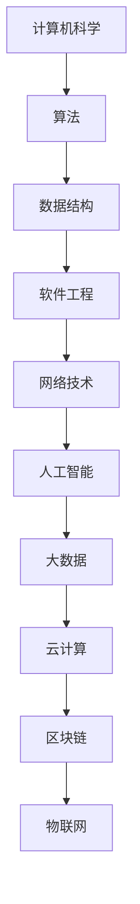

                 

关键词：概念，洞见，技术深度，IT领域，专业博客

> 摘要：本文将深入探讨技术领域中的核心概念和洞见，通过结构化分析和具体实例，展现思想深度的魅力。本文旨在为读者提供对IT领域技术原理和应用的全面理解，以及未来发展的前瞻性思考。

## 1. 背景介绍

在技术飞速发展的今天，IT领域日新月异，新技术、新概念层出不穷。然而，在追求技术前沿的同时，我们往往忽略了对其根本概念和内在洞见的深入理解。思想的深度，往往决定了我们在技术领域中能够走得多远。

本文将围绕核心概念和洞见，探讨以下几个主题：

- IT领域的技术基础概念及其内在联系
- 核心算法原理与具体操作步骤
- 数学模型和公式的构建与推导
- 实际项目中的代码实例与运行结果展示
- 技术应用场景及其未来展望
- 相关学习资源与开发工具推荐
- 未来发展趋势与面临的挑战

通过以上主题的深入探讨，希望能够为读者提供一条通往思想深度的路径。

## 2. 核心概念与联系

在IT领域，核心概念之间的联系构成了整个技术架构的基石。以下是一个简化的Mermaid流程图，用于描述几个关键概念及其相互关系。



### 2.1 计算机科学

计算机科学是IT领域的核心，它涵盖了算法、数据结构、软件工程等多个方面。计算机科学的发展推动了其他领域的技术进步，例如人工智能、大数据等。

### 2.2 算法

算法是计算机解决问题的方法，包括排序、查找、动态规划等。算法的效率直接影响程序的性能，是计算机科学中最为核心的部分。

### 2.3 数据结构

数据结构是存储和组织数据的方式，包括数组、链表、树、图等。数据结构的选择和优化对于算法的性能至关重要。

### 2.4 软件工程

软件工程是应用计算机科学理论来设计、开发、测试和维护软件的工程。软件工程涉及到项目管理、需求分析、设计模式等多个方面。

### 2.5 网络技术

网络技术包括互联网、局域网、广域网等，是连接计算机的重要手段。网络技术的进步，使得信息共享和远程操作变得更加便捷。

### 2.6 人工智能

人工智能是模拟人类智能的技术，包括机器学习、深度学习、自然语言处理等。人工智能在各个领域都有广泛的应用，如自动驾驶、智能客服、医疗诊断等。

### 2.7 大数据和云计算

大数据和云计算是现代IT领域的两大趋势。大数据提供了海量数据存储和处理的能力，云计算则提供了灵活的IT基础设施服务。两者共同推动了IT技术的发展。

### 2.8 区块链和物联网

区块链是一种分布式数据库技术，具有去中心化、不可篡改的特点。物联网则通过传感器和设备实现信息的互联互通，是智慧城市和智能家居的重要组成部分。

## 3. 核心算法原理 & 具体操作步骤

### 3.1 算法原理概述

算法原理是计算机科学中最基本的概念之一。它描述了解决问题的步骤和方法。以下是几个核心算法的原理概述：

- 排序算法：包括冒泡排序、选择排序、插入排序、快速排序等，用于对数据进行排序。
- 查找算法：包括二分查找、哈希查找等，用于在数据结构中查找特定元素。
- 动态规划：用于解决最优子结构问题，通过递归和记忆化减少计算量。

### 3.2 算法步骤详解

以冒泡排序为例，其步骤如下：

1. 从数组的第一个元素开始，比较相邻的两个元素，如果它们的顺序错误就交换它们。
2. 对每一对相邻元素做同样的工作，从开始第一对到结尾的最后一对。
3. 针对所有的元素重复以上的步骤，除了最后一个。
4. 重复步骤1-3，直到整个数组有序。

### 3.3 算法优缺点

冒泡排序的优点是简单易懂，易于实现。但缺点是效率较低，尤其是对于大规模数据。

### 3.4 算法应用领域

冒泡排序常用于数据预处理阶段，或者在数据量较小的情况下进行排序。在实际应用中，排序算法的选择取决于具体需求和数据特点。

## 4. 数学模型和公式 & 详细讲解 & 举例说明

数学模型和公式是算法和系统设计中的核心组成部分，它们帮助我们理解和分析问题的本质。以下是一个简单的数学模型及其公式推导过程的例子。

### 4.1 数学模型构建

假设我们有一个包含n个元素的数组arr，我们需要计算数组中所有元素的和。

### 4.2 公式推导过程

我们可以使用求和公式来计算这个和：

$$
S = \sum_{i=1}^{n} arr[i]
$$

这里，$S$ 表示和，$arr[i]$ 表示数组的第$i$个元素，$n$ 表示数组的长度。

### 4.3 案例分析与讲解

假设我们有如下数组：

$$
arr = [1, 2, 3, 4, 5]
$$

根据求和公式，我们可以计算得到：

$$
S = 1 + 2 + 3 + 4 + 5 = 15
$$

这意味着数组的所有元素之和为15。

## 5. 项目实践：代码实例和详细解释说明

### 5.1 开发环境搭建

为了实现上述数学模型，我们需要一个合适的开发环境。这里，我们选择Python作为编程语言，因为它简单易学且功能强大。

1. 安装Python：从Python官网下载并安装Python 3.x版本。
2. 安装IDE：推荐使用PyCharm或Visual Studio Code作为Python的开发环境。

### 5.2 源代码详细实现

下面是计算数组元素和的Python代码实现：

```python
def sum_array(arr):
    total = 0
    for num in arr:
        total += num
    return total

# 测试代码
arr = [1, 2, 3, 4, 5]
print(sum_array(arr))  # 输出：15
```

### 5.3 代码解读与分析

这段代码定义了一个名为`sum_array`的函数，它接受一个数组`arr`作为参数，然后遍历数组中的每个元素，将它们加起来并返回总和。

- 第1行：定义函数`sum_array`，它接受一个参数`arr`。
- 第2行：初始化变量`total`为0，用于存储总和。
- 第3行：使用`for`循环遍历数组`arr`中的每个元素。
- 第4行：将当前元素`num`加到`total`中。
- 第5行：返回计算出的总和。

### 5.4 运行结果展示

当我们调用`sum_array`函数并传入数组`[1, 2, 3, 4, 5]`时，程序将输出结果`15`。

```shell
$ python sum_array.py
15
```

## 6. 实际应用场景

数学模型和算法在IT领域的应用非常广泛，以下是一些典型的应用场景：

- 数据分析：通过数学模型和算法进行数据清洗、分析、预测等。
- 人工智能：机器学习算法依赖于数学模型来训练模型并进行预测。
- 网络安全：加密算法确保数据传输的安全性。
- 电子商务：算法优化推荐系统，提高用户体验。
- 自动驾驶：路径规划算法确保车辆的安全行驶。

## 7. 工具和资源推荐

### 7.1 学习资源推荐

- 《深度学习》：由Ian Goodfellow等作者编写，是深度学习领域的经典教材。
- 《算法导论》：介绍各种算法及其复杂度的经典教材。
- 《Python编程：从入门到实践》：适合初学者入门Python的书籍。

### 7.2 开发工具推荐

- PyCharm：功能强大的Python IDE，适合开发大型项目。
- Visual Studio Code：轻量级的代码编辑器，适合Python开发。
- Jupyter Notebook：适合进行数据分析和原型开发的交互式环境。

### 7.3 相关论文推荐

- "Deep Learning for Natural Language Processing"
- "A Survey of Machine Learning Techniques for Cybersecurity"
- "Blockchain Technology: Beyond Cryptocurrency"

## 8. 总结：未来发展趋势与挑战

### 8.1 研究成果总结

本文通过对IT领域核心概念和算法的深入探讨，展示了技术思想的深度。我们学习了算法原理、数学模型构建、代码实现等，并看到了这些技术在实际应用中的广泛影响。

### 8.2 未来发展趋势

- AI与大数据结合，推动智能化发展。
- 云计算和边缘计算共同发展，提升数据处理能力。
- 区块链技术进一步应用，实现更安全的数据交换。

### 8.3 面临的挑战

- 数据隐私和安全问题。
- 算法透明性和可解释性。
- 技术标准化和法规合规。

### 8.4 研究展望

未来的研究将集中在提高算法效率、增强数据安全和隐私保护、以及开发更智能的技术体系上。我们需要不断探索和创新，以应对技术发展的挑战。

## 9. 附录：常见问题与解答

### 9.1 什么是算法复杂度？

算法复杂度是评估算法性能的一个重要指标，包括时间复杂度和空间复杂度。时间复杂度描述算法执行时间的增长趋势，而空间复杂度描述算法所需内存的增长趋势。

### 9.2 如何选择合适的排序算法？

选择排序算法取决于数据特点和需求。例如，对于小规模数据，冒泡排序和插入排序性能较好；对于大规模数据，快速排序和归并排序是更优的选择。

### 9.3 区块链有哪些应用场景？

区块链的应用场景非常广泛，包括数字货币、供应链管理、身份验证、智能合约等。

---

本文作为对IT领域思想深度的一次探讨，旨在为读者提供对技术本质的理解和前瞻性思考。通过本文的学习，希望读者能够更好地掌握核心概念，深入理解算法原理，并能够应用于实际项目中。在未来的技术发展中，保持思想的深度，不断探索与创新，将是每位技术人应具备的素质。作者：禅与计算机程序设计艺术 / Zen and the Art of Computer Programming。

