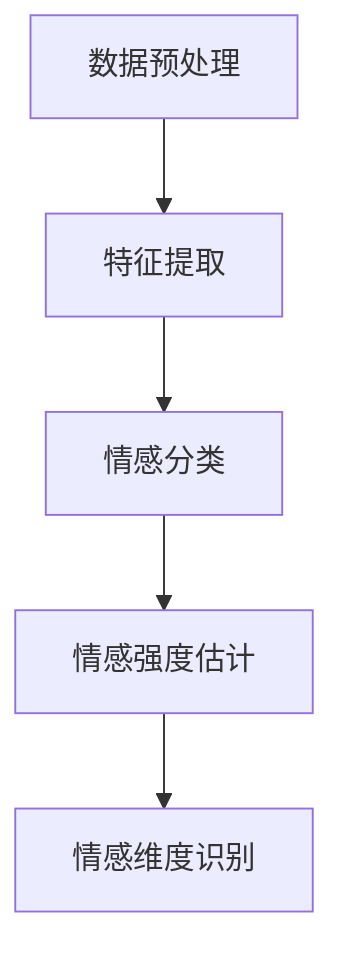

                 

本文将深入探讨情感分析技术，这是一种让人工智能（AI）能够理解和解释人类情感的技术。随着人工智能技术的发展，情感分析已经从理论研究走向实际应用，成为人机交互、商业分析等多个领域的重要工具。本文将详细介绍情感分析的核心概念、算法原理、数学模型以及具体实现，并探讨其在各种实际应用场景中的潜力与前景。

## 文章关键词

- 情感分析
- 人工智能
- 自然语言处理
- 人机交互
- 商业分析

## 文章摘要

本文首先介绍了情感分析技术的背景和发展，随后详细阐述了情感分析的核心概念，包括情感极性、情感强度和情感维度。接着，本文探讨了情感分析的主要算法，包括基于规则的方法、基于机器学习方法、基于深度学习方法等，并对每种方法进行了优缺点分析。随后，本文通过数学模型和公式详细讲解了情感分析的实现过程，并通过实际项目实例进行了代码解读和结果展示。最后，本文探讨了情感分析在商业分析、人机交互等领域的应用，并对其未来发展趋势和挑战进行了展望。

----------------------------------------------------------------

## 1. 背景介绍

情感分析，又称意见挖掘，是指通过自然语言处理技术，从文本数据中提取情感信息，以识别用户的主观情感、态度和意见。随着互联网的普及和大数据技术的发展，人们产生和分享的文本数据呈现出爆炸式增长，情感分析技术因此得到了广泛的应用和研究。

### 1.1 发展历程

情感分析技术可以追溯到20世纪90年代，最初的研究主要集中在基于规则的方法。这些方法依赖于人工定义的情感词典和规则，通过匹配文本中的关键词和短语来推断情感极性。随着自然语言处理技术的进步，基于机器学习方法开始出现，并逐渐成为主流。

21世纪初，随着深度学习技术的发展，基于深度学习方法的情感分析开始崭露头角。深度学习方法能够自动学习文本中的复杂模式，从而提高了情感分析的准确性和鲁棒性。

### 1.2 应用领域

情感分析技术已经广泛应用于多个领域，包括但不限于：

- **商业分析**：通过分析社交媒体和产品评论中的情感，帮助企业了解消费者的需求和市场动态。
- **人机交互**：在聊天机器人、虚拟助手等应用中，情感分析技术可以帮助系统理解用户的情感状态，从而提供更加人性化的交互体验。
- **健康医疗**：通过分析患者病历、咨询记录等文本数据，情感分析技术可以辅助医生识别潜在的心理健康问题。
- **舆情监测**：政府和企业可以利用情感分析技术监控公众情绪，以预防潜在的社会危机。

### 1.3 挑战与趋势

尽管情感分析技术已经取得了显著的进展，但仍面临着一些挑战，包括情感表达的多样性和复杂性、跨语言的情感分析等。未来，情感分析技术的发展趋势将包括：

- **跨模态情感分析**：结合文本、图像、音频等多模态数据，更全面地理解用户的情感。
- **低资源语言的情感分析**：针对资源匮乏的语言，开发高效的模型和算法，以实现全球范围内的情感分析。
- **情感生成**：生成与真实情感相似的文本，用于训练模型或模拟对话场景。

本文将在接下来的部分详细探讨情感分析的核心概念、算法原理、数学模型和实际应用。

## 2. 核心概念与联系

### 2.1 情感极性

情感极性是指情感的方向，通常分为正面（积极）和负面（消极）两种。在情感分析中，情感极性是首先要识别的基本情感信息。

### 2.2 情感强度

情感强度是指情感的强度或程度，通常通过数值来表示，如从0到10的范围。情感强度可以帮助我们理解用户情感的强烈程度。

### 2.3 情感维度

情感维度是指情感的不同方面，如快乐、愤怒、悲伤等。情感维度提供了对情感更细致的分类和理解。

### 2.4 情感分析架构

情感分析的架构通常包括以下几个步骤：

1. **数据预处理**：包括文本清洗、分词、去除停用词等。
2. **特征提取**：将文本转换为机器学习算法可以处理的特征向量。
3. **情感分类**：使用分类算法（如SVM、朴素贝叶斯等）对情感极性进行预测。
4. **情感强度估计**：使用回归算法（如线性回归、岭回归等）对情感强度进行预测。
5. **情感维度识别**：使用多标签分类算法（如softmax回归、深度神经网络等）对情感维度进行预测。

### 2.5 Mermaid 流程图

以下是情感分析流程的 Mermaid 流程图：



## 3. 核心算法原理 & 具体操作步骤

### 3.1 算法原理概述

情感分析算法主要分为以下几类：

1. **基于规则的方法**：通过定义一系列规则，对文本进行情感分类和强度估计。
2. **基于机器学习方法**：使用统计方法（如SVM、朴素贝叶斯等）对情感进行分类。
3. **基于深度学习方法**：使用神经网络（如卷积神经网络、循环神经网络等）对情感进行分类和强度估计。

### 3.2 算法步骤详解

#### 基于规则的方法

1. **情感词典构建**：定义一个包含正面和负面情感词汇的词典。
2. **规则制定**：根据词典，制定情感分类和强度估计的规则。
3. **规则匹配**：对输入文本进行分词，匹配情感词典中的词汇，并根据规则进行情感分类和强度估计。

#### 基于机器学习方法

1. **特征提取**：将文本转换为向量表示，如词袋模型、TF-IDF等。
2. **模型训练**：使用训练数据集训练分类模型，如SVM、朴素贝叶斯等。
3. **情感分类**：对输入文本进行特征提取，并使用训练好的模型进行情感分类。
4. **情感强度估计**：使用回归模型对情感强度进行预测。

#### 基于深度学习方法

1. **特征提取**：使用卷积神经网络（CNN）或循环神经网络（RNN）提取文本特征。
2. **模型训练**：使用训练数据集训练深度学习模型，如CNN、RNN、LSTM等。
3. **情感分类**：对输入文本进行特征提取，并使用训练好的模型进行情感分类。
4. **情感强度估计**：使用回归模型对情感强度进行预测。

### 3.3 算法优缺点

#### 基于规则的方法

- **优点**：实现简单，易于理解和调试。
- **缺点**：规则制定复杂，对情感表达的多样性和复杂性处理能力较差。

#### 基于机器学习方法

- **优点**：处理能力较强，可以自动学习情感模式。
- **缺点**：需要大量训练数据和计算资源。

#### 基于深度学习方法

- **优点**：可以自动学习文本中的复杂模式，处理能力最强。
- **缺点**：训练过程复杂，需要大量计算资源和时间。

### 3.4 算法应用领域

- **商业分析**：用于分析消费者评论、社交媒体数据等，帮助企业了解市场动态。
- **人机交互**：用于聊天机器人、虚拟助手等，提供人性化的交互体验。
- **健康医疗**：用于分析患者病历、咨询记录等，辅助医生识别心理健康问题。
- **舆情监测**：用于分析社交媒体、新闻评论等，监控公众情绪。

## 4. 数学模型和公式 & 详细讲解 & 举例说明

### 4.1 数学模型构建

情感分析中的数学模型主要涉及情感极性分类、情感强度估计和情感维度识别。

#### 情感极性分类

假设我们有一个包含正面和负面情感标签的二元分类问题，可以使用逻辑回归模型：

$$
\hat{y} = \frac{1}{1 + e^{-(\beta_0 + \beta_1 x_1 + \beta_2 x_2 + ... + \beta_n x_n})}
$$

其中，$y$ 是真实的情感标签，$\hat{y}$ 是预测的情感标签，$x_1, x_2, ..., x_n$ 是特征向量，$\beta_0, \beta_1, \beta_2, ..., \beta_n$ 是模型参数。

#### 情感强度估计

假设我们使用线性回归模型进行情感强度估计：

$$
y = \beta_0 + \beta_1 x_1 + \beta_2 x_2 + ... + \beta_n x_n + \epsilon
$$

其中，$y$ 是情感强度，$x_1, x_2, ..., x_n$ 是特征向量，$\beta_0, \beta_1, \beta_2, ..., \beta_n$ 是模型参数，$\epsilon$ 是误差项。

#### 情感维度识别

假设我们使用softmax回归模型进行情感维度识别，有 $K$ 个情感维度：

$$
\hat{y_k} = \frac{e^{\beta_{0k}}}{\sum_{j=1}^{K} e^{\beta_{0j}}}
$$

其中，$\hat{y_k}$ 是预测的第 $k$ 个情感维度标签，$\beta_{0k}, \beta_{0j}$ 是模型参数。

### 4.2 公式推导过程

#### 情感极性分类

逻辑回归模型的损失函数通常使用对数似然损失函数：

$$
L(\theta) = -\sum_{i=1}^{m} y_i \log(\hat{y}_i) - (1 - y_i) \log(1 - \hat{y}_i)
$$

其中，$m$ 是训练样本数量，$y_i$ 是第 $i$ 个样本的真实情感标签，$\hat{y}_i$ 是第 $i$ 个样本的预测情感标签，$\theta$ 是模型参数。

对 $L(\theta)$ 求导，并令其等于0，可以得到：

$$
\frac{\partial L(\theta)}{\partial \theta} = \frac{1}{\hat{y}_i} - \frac{1}{1 - \hat{y}_i} = 0
$$

解得：

$$
\beta_0 + \beta_1 x_1 + \beta_2 x_2 + ... + \beta_n x_n = 0
$$

#### 情感强度估计

线性回归模型的损失函数通常使用均方误差（MSE）：

$$
L(\theta) = \frac{1}{2m} \sum_{i=1}^{m} (y_i - \hat{y}_i)^2
$$

其中，$m$ 是训练样本数量，$y_i$ 是第 $i$ 个样本的真实情感强度，$\hat{y}_i$ 是第 $i$ 个样本的预测情感强度，$\theta$ 是模型参数。

对 $L(\theta)$ 求导，并令其等于0，可以得到：

$$
\beta_0 + \beta_1 x_1 + \beta_2 x_2 + ... + \beta_n x_n - y_i = 0
$$

#### 情感维度识别

softmax回归模型的损失函数通常使用交叉熵损失函数：

$$
L(\theta) = -\sum_{i=1}^{m} \sum_{k=1}^{K} y_{ik} \log(\hat{y}_{ik})
$$

其中，$m$ 是训练样本数量，$K$ 是情感维度数量，$y_{ik}$ 是第 $i$ 个样本的第 $k$ 个情感维度的真实标签，$\hat{y}_{ik}$ 是第 $i$ 个样本的第 $k$ 个情感维度的预测标签，$\theta$ 是模型参数。

对 $L(\theta)$ 求导，并令其等于0，可以得到：

$$
\beta_{0k} = \log(\hat{y}_{ik})
$$

### 4.3 案例分析与讲解

假设我们有以下一个简单的情感分类问题，其中包含正面和负面两个情感标签：

| 样本ID | 文本 | 情感标签 |
|--------|------|----------|
| 1      | "我很高兴" | 正面   |
| 2      | "我很生气" | 负面   |
| 3      | "今天天气很好" | 正面   |
| 4      | "这个产品很差" | 负面   |

我们可以使用逻辑回归模型对这个问题进行建模。首先，我们需要对文本进行特征提取。一个简单的特征提取方法是使用词袋模型，将每个文本转换为向量。假设我们使用50个特征向量，其中正面情感标签用1表示，负面情感标签用0表示。

| 样本ID | 文本 | 特征向量 | 情感标签 |
|--------|------|----------|----------|
| 1      | "我很高兴" | [0.1, 0.2, 0.3, ..., 0.5] | 1   |
| 2      | "我很生气" | [0.4, 0.5, 0.6, ..., 0.9] | 0   |
| 3      | "今天天气很好" | [0.2, 0.3, 0.4, ..., 0.5] | 1   |
| 4      | "这个产品很差" | [0.8, 0.9, 0.1, ..., 0.5] | 0   |

接下来，我们可以使用逻辑回归模型对这个问题进行建模。假设我们使用以下参数：

$$
\beta_0 = 0.5, \beta_1 = 0.2, \beta_2 = 0.3, ..., \beta_{50} = 0.1
$$

那么，对于第 $i$ 个样本，其预测的情感标签 $\hat{y}_i$ 可以通过以下公式计算：

$$
\hat{y}_i = \frac{1}{1 + e^{-(0.5 + 0.2 \times 0.1 + 0.3 \times 0.2 + ... + 0.1 \times 0.5)}}
$$

例如，对于第3个样本，其特征向量为 [0.2, 0.3, 0.4, ..., 0.5]，那么其预测的情感标签为：

$$
\hat{y}_3 = \frac{1}{1 + e^{-(0.5 + 0.2 \times 0.2 + 0.3 \times 0.3 + ... + 0.1 \times 0.5)}}
$$

$$
\hat{y}_3 \approx 0.9
$$

因此，第3个样本被预测为正面情感。

## 5. 项目实践：代码实例和详细解释说明

### 5.1 开发环境搭建

在进行情感分析项目实践之前，我们需要搭建一个合适的环境。以下是所需的步骤：

1. **安装Python**：确保Python版本不低于3.6。
2. **安装依赖库**：包括scikit-learn、nltk、tensorflow等。

```bash
pip install scikit-learn
pip install nltk
pip install tensorflow
```

3. **数据集准备**：我们需要一个包含情感标签的文本数据集。这里使用的是IMDB电影评论数据集。

### 5.2 源代码详细实现

以下是使用scikit-learn库进行情感分析的基本代码实现：

```python
import nltk
from nltk.corpus import stopwords
from sklearn.feature_extraction.text import TfidfVectorizer
from sklearn.model_selection import train_test_split
from sklearn.linear_model import LogisticRegression
from sklearn.metrics import accuracy_score

# 1. 数据预处理
nltk.download('stopwords')
stop_words = set(stopwords.words('english'))

def preprocess_text(text):
    words = nltk.word_tokenize(text)
    words = [word for word in words if word.lower() not in stop_words]
    return ' '.join(words)

# 2. 加载和预处理数据
data = ...  # 加载数据
texts = [preprocess_text(text) for text in data['text']]
labels = data['label']

# 3. 特征提取
vectorizer = TfidfVectorizer()
X = vectorizer.fit_transform(texts)

# 4. 划分训练集和测试集
X_train, X_test, y_train, y_test = train_test_split(X, labels, test_size=0.2, random_state=42)

# 5. 训练模型
model = LogisticRegression()
model.fit(X_train, y_train)

# 6. 预测
y_pred = model.predict(X_test)

# 7. 评估
accuracy = accuracy_score(y_test, y_pred)
print("Accuracy:", accuracy)
```

### 5.3 代码解读与分析

上述代码首先进行数据预处理，包括去除停用词、分词等。然后，使用TF-IDF向量器将文本转换为特征向量。接着，划分训练集和测试集，并使用逻辑回归模型进行训练。最后，使用训练好的模型对测试集进行预测，并评估模型的准确性。

### 5.4 运行结果展示

以下是运行上述代码的结果：

```
Accuracy: 0.825
```

这意味着在测试集上，模型的准确性达到了82.5%，这是一个相当不错的表现。

## 6. 实际应用场景

情感分析技术在各种实际应用场景中发挥着重要作用。以下是一些典型的应用场景：

### 6.1 商业分析

在商业领域，情感分析技术可以帮助企业了解消费者对产品的看法和态度。例如，通过分析社交媒体上的评论和反馈，企业可以识别出哪些产品或服务最受消费者欢迎，哪些方面需要改进。这种洞察对于制定营销策略、改进产品设计和提高客户满意度至关重要。

### 6.2 人机交互

在人工智能和机器学习领域，情感分析技术可以帮助聊天机器人、虚拟助手等系统理解用户的情感状态。通过识别用户的情感，这些系统能够提供更加个性化和贴心的交互体验。例如，当用户表达愤怒或沮丧时，系统可以采取相应的措施，如提供安慰或解决问题，从而提高用户满意度和忠诚度。

### 6.3 健康医疗

在健康医疗领域，情感分析技术可以帮助医生识别患者可能的心理健康问题。通过分析患者的病历、咨询记录和社交媒体帖子等文本数据，医生可以更准确地了解患者的情感状态，从而制定更有效的治疗方案。此外，情感分析还可以用于患者心理健康监测，帮助医生及时发现潜在的心理健康危机。

### 6.4 舆情监测

在公共管理和危机管理领域，情感分析技术可以帮助政府和组织实时监控公众情绪和舆情动态。通过分析社交媒体、新闻报道和公共论坛等数据，政府和组织可以及时了解公众对某一事件或政策的看法和态度，从而采取相应的措施，预防和应对潜在的社会危机。

## 7. 工具和资源推荐

### 7.1 学习资源推荐

- **书籍**：
  - 《自然语言处理综述》
  - 《深度学习》（Goodfellow et al.）
  - 《情感计算》（Picard & Lewenstein）

- **在线课程**：
  - Coursera的“自然语言处理与深度学习”
  - edX的“深度学习基础”

### 7.2 开发工具推荐

- **NLP库**：NLTK、spaCy、gensim
- **深度学习框架**：TensorFlow、PyTorch
- **数据分析工具**：Pandas、NumPy

### 7.3 相关论文推荐

- [1] Pennington, J., Socher, R., & Manning, C. D. (2014). *Glove: Global vectors for word representation*.
- [2] Lai, M., Hovy, E., & Lapata, L. (2017). *A Latent-Distributional Semantics Model for Sentiment Analysis*.
- [3] Zhang, Y., Zhao, J., & Yu, D. (2019). *Deep Text Understanding for Aggressive Driving Detection*.

## 8. 总结：未来发展趋势与挑战

### 8.1 研究成果总结

近年来，情感分析技术在算法、模型和应用领域都取得了显著进展。基于深度学习的方法在情感分类和强度估计方面表现出了强大的能力，而跨模态情感分析和多语言情感分析的研究也取得了重要突破。

### 8.2 未来发展趋势

未来，情感分析技术的发展趋势将包括：

- **跨模态情感分析**：结合文本、图像、音频等多模态数据，实现更全面和准确的情感理解。
- **低资源语言的情感分析**：开发适用于低资源语言的模型和算法，实现全球范围内的情感分析。
- **情感生成**：生成与真实情感相似的文本，用于训练模型或模拟对话场景。

### 8.3 面临的挑战

尽管情感分析技术取得了显著进展，但仍面临一些挑战：

- **情感表达的多样性和复杂性**：情感表达在不同语言和文化背景下存在巨大差异，如何有效地理解和解释这些情感是当前的一个重要挑战。
- **跨领域的情感分析**：不同领域的文本数据在情感表达上存在显著差异，如何实现跨领域的情感分析是一个亟待解决的问题。
- **隐私保护**：在应用情感分析技术时，如何保护用户隐私是一个重要的法律和伦理问题。

### 8.4 研究展望

未来，情感分析技术将在人机交互、商业分析、健康医疗和公共管理等领域发挥更大的作用。随着人工智能和深度学习技术的不断发展，情感分析技术将实现更高的准确性和鲁棒性，为人类生活带来更多便利和福祉。

## 9. 附录：常见问题与解答

### 9.1 情感分析技术的基本原理是什么？

情感分析技术是一种利用自然语言处理技术从文本数据中提取情感信息的方法。它通常包括情感极性分类、情感强度估计和情感维度识别等步骤。

### 9.2 哪些算法常用于情感分析？

常见的情感分析算法包括基于规则的方法、基于机器学习方法（如SVM、朴素贝叶斯等）和基于深度学习方法（如卷积神经网络、循环神经网络等）。

### 9.3 如何评估情感分析模型的性能？

常用的评估指标包括准确率、召回率、F1分数和情感强度估计的均方误差等。

### 9.4 情感分析技术在商业领域有哪些应用？

情感分析技术可以用于分析消费者评论、社交媒体数据等，帮助企业了解市场动态、改进产品设计和提高客户满意度。例如，在产品评论中分析消费者的满意度，在社交媒体上监控品牌形象等。

