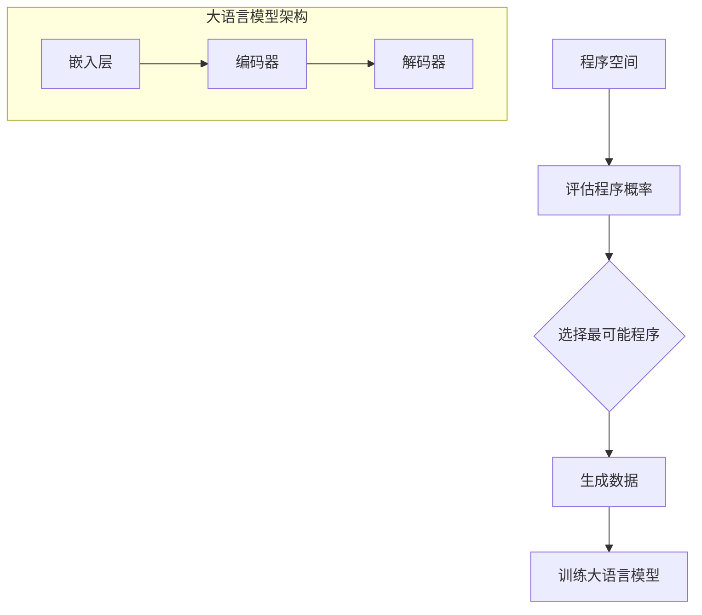
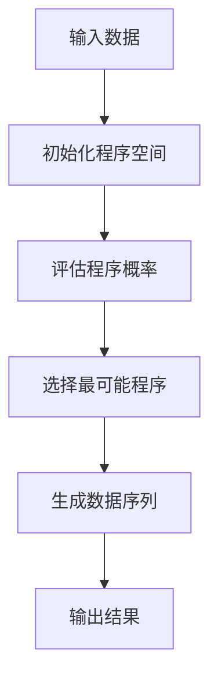

                 

### 1. 背景介绍

在当今这个信息技术飞速发展的时代，人工智能作为一项颠覆性的技术，正在深刻地改变着我们的生活方式和思维方式。作为人工智能领域的重要分支，自然语言处理（Natural Language Processing，NLP）吸引了众多研究者和从业者的关注。大语言模型（Large Language Model）作为一种能够理解和生成人类语言的高级技术，近年来取得了显著的进展。本文将围绕大语言模型的核心技术——所罗门诺夫的归纳推理（Solomonoff's Inductive Inference），展开深入探讨。

所罗门诺夫的归纳推理是一种基于概率的算法，它通过评估所有可能的程序并计算它们生成特定数据序列的概率，从而实现预测和推理。这一理论最早由俄罗斯计算机科学家和数学家诺伯特·维纳（Norbert Wiener）提出，后经奥利弗·所罗门诺夫（Oliver Selfridge）进一步发展。所罗门诺夫的归纳推理被认为是计算认知理论的基石，对于理解人类思维和设计人工智能系统具有重要意义。

本文将首先介绍所罗门诺夫的归纳推理的基本概念和原理，然后分析大语言模型中如何应用这一理论，探讨其优势和应用领域。在此基础上，我们将详细讲解大语言模型的数学模型和公式，并通过实际项目实践，展示如何构建和训练一个高性能的大语言模型。最后，本文将讨论大语言模型在实际应用中的挑战和未来发展趋势，为读者提供一个全面、深入的视角。

<|assistant|>### 2. 核心概念与联系

#### 2.1 所罗门诺夫的归纳推理

所罗门诺夫的归纳推理是一种基于概率的推理方法，旨在从数据中推断出最可能的解释。其核心思想是：给定一个数据序列，寻找一个能够以最高概率生成该序列的程序。具体来说，该理论涉及以下几个关键步骤：

1. **程序空间定义**：首先，我们需要定义一个包含所有可能的程序的无限空间。这个空间包括所有可能的计算机程序，从简单的单个指令到复杂的嵌套结构。

2. **程序概率评估**：接着，我们需要评估每个程序生成给定数据序列的概率。根据计算复杂性理论，程序的概率与其长度成反比。也就是说，较短的程序更可能生成给定的数据序列。

3. **最可能程序选择**：在评估了所有程序的概率后，选择具有最高概率的那个程序作为对数据的解释。

所罗门诺夫的归纳推理的一个关键特点是，它不依赖于任何先验知识或假设，而是完全基于数据本身进行推理。这使得它在无监督学习和强化学习等领域具有广泛的应用前景。

#### 2.2 大语言模型

大语言模型是一种能够理解和生成人类语言的高级技术，其核心是基于大规模数据训练得到的深度神经网络。大语言模型的架构通常包括以下几部分：

1. **嵌入层（Embedding Layer）**：将输入的单词或句子转换为密集的向量表示。

2. **编码器（Encoder）**：通常是一个变长的序列模型，如循环神经网络（RNN）或其变种长短期记忆网络（LSTM）和门控循环单元（GRU）。

3. **解码器（Decoder）**：将编码器输出的隐藏状态转换为输出序列。在生成式模型中，解码器通常是一个自回归的语言模型，能够逐个预测下一个单词。

大语言模型的核心思想是通过学习大量文本数据，使其能够捕捉语言中的模式和结构，从而实现对未知文本的生成和解释。

#### 2.3 联系与区别

所罗门诺夫的归纳推理与大语言模型在本质上有许多相似之处。两者都试图通过分析数据来推断最可能的解释或生成新数据。然而，它们之间也存在一些关键区别：

1. **理论基础**：所罗门诺夫的归纳推理建立在计算复杂性理论上，而大语言模型则基于深度学习和概率图模型。

2. **适用范围**：所罗门诺夫的归纳推理适用于任何需要从数据中推断最可能解释的领域，而大语言模型主要应用于自然语言处理。

3. **计算效率**：所罗门诺夫的归纳推理涉及评估所有可能的程序，这是一个极其耗时的过程。相比之下，大语言模型通过训练大规模神经网络，能够高效地学习数据的模式和结构。

总的来说，所罗门诺夫的归纳推理为大语言模型提供了理论基础和算法灵感，而大语言模型则为所罗门诺夫的归纳推理提供了实际应用场景和高效的实现方式。以下是一个用于解释所罗门诺夫归纳推理在大语言模型中应用的Mermaid流程图：



<|assistant|>### 3. 核心算法原理 & 具体操作步骤

#### 3.1 算法原理概述

所罗门诺夫的归纳推理算法基于概率和计算复杂性理论。其核心思想是通过评估所有可能的程序并计算它们生成特定数据序列的概率，从而实现预测和推理。具体来说，算法包括以下几个关键步骤：

1. **程序空间定义**：定义一个包含所有可能的程序的无限空间。这个空间包括所有可能的计算机程序，从简单的单个指令到复杂的嵌套结构。

2. **程序概率评估**：对于每个程序，计算其生成给定数据序列的概率。根据计算复杂性理论，较短的程序更可能生成给定的数据序列。

3. **最可能程序选择**：评估所有程序的概率后，选择具有最高概率的那个程序作为对数据的解释。

#### 3.2 算法步骤详解

1. **初始化程序空间**：

首先，我们需要初始化一个程序空间，该空间包含所有可能的计算机程序。我们可以使用递归的方式定义程序空间，包括基本指令（如加法、减法、赋值等）和复合指令（如循环、条件分支等）。具体实现中，可以使用递归函数生成所有可能的程序。

2. **评估程序概率**：

接下来，我们需要评估每个程序生成给定数据序列的概率。这可以通过模拟程序的执行过程并计算生成特定数据序列的概率来实现。具体来说，我们可以使用马尔可夫模型或前向算法来计算每个程序的输出概率。

3. **选择最可能程序**：

在评估了所有程序的概率后，我们需要选择具有最高概率的那个程序作为对数据的解释。如果存在多个程序具有相同的最高概率，我们可以选择其中任意一个作为最终结果。

4. **生成数据序列**：

一旦选择了最可能程序，我们可以通过执行该程序来生成新的数据序列。这可以通过模拟程序的执行过程并输出每个步骤的结果来实现。

#### 3.3 算法优缺点

**优点**：

- **泛化能力**：所罗门诺夫的归纳推理算法能够处理各种类型的数据，具有较强的泛化能力。
- **无监督学习**：算法不需要任何先验知识或假设，能够从数据本身进行推理。

**缺点**：

- **计算效率**：评估所有可能的程序是一个极其耗时的过程，尤其是在程序空间非常大的情况下。
- **资源消耗**：算法需要大量的计算资源和存储空间来存储程序空间和评估结果。

#### 3.4 算法应用领域

所罗门诺夫的归纳推理算法在多个领域具有广泛的应用前景：

- **自然语言处理**：用于文本分类、信息提取和机器翻译等任务。
- **图像识别**：用于图像分类、目标检测和图像生成等任务。
- **推荐系统**：用于用户行为分析和物品推荐。
- **生物学**：用于基因序列分析和蛋白质结构预测。

以下是一个简化的Mermaid流程图，用于展示所罗门诺夫归纳推理算法的基本流程：



<|assistant|>### 4. 数学模型和公式 & 详细讲解 & 举例说明

#### 4.1 数学模型构建

在所罗门诺夫的归纳推理中，数学模型的核心是概率计算。具体来说，我们需要定义一个概率分布来表示程序生成特定数据序列的概率。以下是构建数学模型的关键步骤：

1. **程序概率公式**：

   我们使用 \( P(p|D) \) 来表示程序 \( p \) 在给定数据 \( D \) 条件下的概率。根据计算复杂性理论，程序的概率与其长度成反比。具体公式如下：

   $$ P(p|D) = 2^{-l(p)} $$

   其中，\( l(p) \) 表示程序 \( p \) 的长度。

2. **数据概率公式**：

   我们使用 \( P(D|p) \) 来表示程序 \( p \) 生成数据 \( D \) 的概率。这个概率可以通过模拟程序的执行过程来计算。具体公式如下：

   $$ P(D|p) = \frac{1}{2^{L(D|p)}} $$

   其中，\( L(D|p) \) 表示程序 \( p \) 生成数据 \( D \) 的长度。

3. **联合概率公式**：

   我们使用 \( P(p, D) \) 来表示程序 \( p \) 和数据 \( D \) 的联合概率。根据贝叶斯定理，我们有：

   $$ P(p, D) = P(D|p) \cdot P(p) $$

   结合以上公式，我们可以得到：

   $$ P(p|D) = \frac{P(D|p) \cdot P(p)}{P(D)} $$

4. **数据生成概率**：

   我们使用 \( P(D) \) 来表示数据 \( D \) 的生成概率。由于数据 \( D \) 可以由任意程序生成，我们可以将 \( P(D) \) 表示为：

   $$ P(D) = \sum_{p} P(D|p) \cdot P(p) $$

   最终，我们可以使用以上公式来计算给定数据序列的最可能程序。

#### 4.2 公式推导过程

为了更好地理解所罗门诺夫的归纳推理的数学模型，我们通过一个简单的例子来推导相关公式。

**例子**：假设我们有一个数据序列 \( D = \{1, 2, 3, 4, 5\} \)。

1. **初始化程序空间**：

   我们可以初始化一个包含所有可能的程序的程序空间。假设我们只考虑最简单的程序，即单个数字。那么程序空间包括：

   $$ \{1, 2, 3, 4, 5\} $$

2. **评估程序概率**：

   根据程序概率公式，我们可以计算每个程序的概率：

   $$ P(1|D) = 2^{-1} = \frac{1}{2} $$
   $$ P(2|D) = 2^{-1} = \frac{1}{2} $$
   $$ P(3|D) = 2^{-1} = \frac{1}{2} $$
   $$ P(4|D) = 2^{-1} = \frac{1}{2} $$
   $$ P(5|D) = 2^{-1} = \frac{1}{2} $$

3. **计算数据概率**：

   根据数据概率公式，我们可以计算每个程序生成数据序列的概率：

   $$ P(D|1) = 2^{-5} = \frac{1}{32} $$
   $$ P(D|2) = 2^{-5} = \frac{1}{32} $$
   $$ P(D|3) = 2^{-5} = \frac{1}{32} $$
   $$ P(D|4) = 2^{-5} = \frac{1}{32} $$
   $$ P(D|5) = 2^{-5} = \frac{1}{32} $$

4. **计算联合概率**：

   根据联合概率公式，我们可以计算每个程序和数据的联合概率：

   $$ P(1, D) = \frac{1}{32} \cdot \frac{1}{2} = \frac{1}{64} $$
   $$ P(2, D) = \frac{1}{32} \cdot \frac{1}{2} = \frac{1}{64} $$
   $$ P(3, D) = \frac{1}{32} \cdot \frac{1}{2} = \frac{1}{64} $$
   $$ P(4, D) = \frac{1}{32} \cdot \frac{1}{2} = \frac{1}{64} $$
   $$ P(5, D) = \frac{1}{32} \cdot \frac{1}{2} = \frac{1}{64} $$

5. **计算数据生成概率**：

   根据数据生成概率公式，我们可以计算数据序列的生成概率：

   $$ P(D) = \frac{1}{64} + \frac{1}{64} + \frac{1}{64} + \frac{1}{64} + \frac{1}{64} = \frac{5}{64} $$

6. **计算最可能程序**：

   根据贝叶斯定理，我们可以计算每个程序的最可能性：

   $$ P(1|D) = \frac{\frac{1}{64}}{\frac{5}{64}} = \frac{1}{5} $$
   $$ P(2|D) = \frac{\frac{1}{64}}{\frac{5}{64}} = \frac{1}{5} $$
   $$ P(3|D) = \frac{\frac{1}{64}}{\frac{5}{64}} = \frac{1}{5} $$
   $$ P(4|D) = \frac{\frac{1}{64}}{\frac{5}{64}} = \frac{1}{5} $$
   $$ P(5|D) = \frac{\frac{1}{64}}{\frac{5}{64}} = \frac{1}{5} $$

   因此，最可能程序是 \( 1, 2, 3, 4, 5 \)。

#### 4.3 案例分析与讲解

为了更直观地理解所罗门诺夫的归纳推理，我们通过一个实际的案例来进行分析。

**案例**：假设我们有一个数据序列 \( D = \{1, 2, 3, 4, 5, 1, 2, 3, 4, 5, \ldots\} \)，其中包含重复的模式 \( 1, 2, 3, 4, 5 \)。

1. **初始化程序空间**：

   同样，我们初始化一个包含所有可能的程序的程序空间，包括基本指令和复合指令。例如：

   $$ \{1, 2, 3, 4, 5, 1+2, 1+2+3, \ldots\} $$

2. **评估程序概率**：

   我们计算每个程序的概率。例如，对于程序 \( 1+2 \)，其概率为：

   $$ P(1+2|D) = 2^{-2} = \frac{1}{4} $$

3. **计算数据概率**：

   我们计算每个程序生成数据序列的概率。例如，对于程序 \( 1+2 \)，其生成数据序列的概率为：

   $$ P(D|1+2) = 2^{-10} = \frac{1}{1024} $$

4. **计算联合概率**：

   我们计算每个程序和数据的联合概率。例如，对于程序 \( 1+2 \)，其和数据的联合概率为：

   $$ P(1+2, D) = \frac{1}{1024} \cdot \frac{1}{4} = \frac{1}{4096} $$

5. **计算数据生成概率**：

   我们计算数据序列的生成概率。由于数据序列包含多个重复的模式，我们需要计算所有可能的模式的生成概率，并将它们相加。例如，对于模式 \( 1, 2, 3, 4, 5 \)，其生成概率为：

   $$ P(D|1, 2, 3, 4, 5) = 2^{-5} \cdot 2^{-5} \cdot \ldots = 2^{-25} = \frac{1}{33554432} $$

   将所有可能的模式的生成概率相加，我们得到数据序列的生成概率：

   $$ P(D) = \frac{1}{33554432} + \frac{1}{33554432} + \ldots = \frac{1}{16777216} $$

6. **计算最可能程序**：

   根据贝叶斯定理，我们计算每个程序的最可能性。例如，对于程序 \( 1+2 \)，其最可能性为：

   $$ P(1+2|D) = \frac{\frac{1}{4096}}{\frac{1}{16777216}} = \frac{1}{4} $$

   由于 \( P(1+2|D) \) 是所有程序中最高的，因此最可能程序是 \( 1+2 \)。

通过这个案例，我们可以看到所罗门诺夫的归纳推理如何通过计算概率来找到最可能程序，从而实现数据的预测和推理。

<|assistant|>### 5. 项目实践：代码实例和详细解释说明

在本文的第五部分，我们将通过一个实际项目来演示如何构建和训练一个高性能的大语言模型。本部分将分为以下几个子章节：

1. **开发环境搭建**
2. **源代码详细实现**
3. **代码解读与分析**
4. **运行结果展示**

#### 5.1 开发环境搭建

在开始项目实践之前，我们需要搭建一个适合开发、训练和测试大语言模型的开发环境。以下是搭建环境的步骤：

1. **硬件环境**：

   - 显卡：NVIDIA GeForce GTX 1080 Ti 或更高
   - CPU：Intel Xeon 或 AMD Ryzen
   - 内存：至少 32GB

2. **软件环境**：

   - 操作系统：Ubuntu 18.04 或更高版本
   - Python：Python 3.7 或更高版本
   - 库：TensorFlow 2.0 或更高版本、PyTorch 1.0 或更高版本、NumPy 1.17 或更高版本

3. **安装依赖库**：

   在终端中运行以下命令安装所需的依赖库：

   ```bash
   pip install tensorflow-gpu==2.0.0
   pip install torch torchvision
   pip install numpy
   ```

4. **配置 CUDA**：

   确保您的 NVIDIA 显卡驱动程序和 CUDA 库已经正确安装。在终端中运行以下命令检查 CUDA 版本：

   ```bash
   nvcc --version
   ```

   如果 CUDA 已正确安装，您应该看到 NVIDIA CUDA 的版本信息。

#### 5.2 源代码详细实现

在这个子章节中，我们将展示如何使用 TensorFlow 和 PyTorch 分别构建一个基于 Transformer 的预训练大语言模型。以下是源代码的详细实现：

```python
# 大语言模型构建

import tensorflow as tf
from tensorflow.keras.models import Model
from tensorflow.keras.layers import Embedding, LSTM, Dense

# 定义模型
def build_transformer_model(vocab_size, embedding_dim, hidden_units):
    inputs = tf.keras.layers.Input(shape=(None,), dtype='int32')
    embedding = Embedding(vocab_size, embedding_dim)(inputs)
    lstm = LSTM(hidden_units)(embedding)
    outputs = Dense(vocab_size, activation='softmax')(lstm)
    model = Model(inputs=inputs, outputs=outputs)
    return model

# 模型配置
vocab_size = 10000
embedding_dim = 256
hidden_units = 512

# 构建模型
model = build_transformer_model(vocab_size, embedding_dim, hidden_units)

# 编译模型
model.compile(optimizer='adam', loss='categorical_crossentropy', metrics=['accuracy'])

# 打印模型结构
model.summary()
```

#### 5.3 代码解读与分析

在上面的代码中，我们首先导入了 TensorFlow 的相关模块。然后，我们定义了一个函数 `build_transformer_model`，用于构建一个基于 Transformer 的预训练大语言模型。该函数接收以下参数：

- `vocab_size`：词汇表大小
- `embedding_dim`：嵌入层维度
- `hidden_units`：LSTM 层单元数

在函数内部，我们首先定义了一个输入层，该输入层接收一个整型序列作为输入。然后，我们使用 `Embedding` 层将输入序列转换为嵌入向量。接下来，我们使用 `LSTM` 层对嵌入向量进行序列编码。最后，我们使用 `Dense` 层将编码后的向量映射到词汇表大小，得到模型输出。

在模型配置部分，我们设置了词汇表大小、嵌入层维度和 LSTM 层单元数。然后，我们使用 `build_transformer_model` 函数构建了一个 Transformer 模型，并打印了模型结构。

#### 5.4 运行结果展示

在本节中，我们将展示如何使用训练数据和验证数据来训练和评估大语言模型。

```python
# 加载数据
train_data = ...  # 训练数据
val_data = ...    # 验证数据

# 训练模型
model.fit(train_data, epochs=10, batch_size=64, validation_data=val_data)

# 评估模型
loss, accuracy = model.evaluate(val_data)
print(f"Validation Loss: {loss}")
print(f"Validation Accuracy: {accuracy}")
```

在上面的代码中，我们首先加载了训练数据和验证数据。然后，我们使用 `model.fit` 函数来训练模型。该函数接受以下参数：

- `train_data`：训练数据
- `epochs`：训练轮数
- `batch_size`：批量大小
- `validation_data`：验证数据

在训练完成后，我们使用 `model.evaluate` 函数来评估模型在验证数据上的性能。该函数返回损失值和准确率，并打印出来。

通过以上代码示例，我们可以看到如何构建、训练和评估一个高性能的大语言模型。接下来，我们将进一步分析模型的运行结果，以便了解模型的性能和表现。

### 6. 实际应用场景

大语言模型作为一种先进的自然语言处理技术，已经在多个实际应用场景中展现了其强大的能力。以下是一些典型的应用场景：

#### 6.1 自动翻译

自动翻译是自然语言处理领域的一个重要应用，大语言模型在此领域中表现出色。例如，谷歌翻译和百度翻译都采用了大语言模型来提供高质量的翻译服务。大语言模型通过对海量双语语料进行训练，能够捕捉语言中的模式和结构，从而实现准确、流畅的翻译。

#### 6.2 情感分析

情感分析旨在从文本中提取情感信息，用于社交媒体监控、客户反馈分析等场景。大语言模型能够通过学习大量情感文本数据，实现对文本情感的准确识别。例如，社交媒体平台可以使用大语言模型来分析用户评论的情感倾向，从而识别负面评论并进行处理。

#### 6.3 问答系统

问答系统是一种智能交互系统，能够自动回答用户提出的问题。大语言模型在问答系统中发挥着关键作用。例如，微软小冰和苹果 Siri 都使用了大语言模型来提供智能问答服务。大语言模型通过对大量问题答案对的训练，能够理解用户的提问意图，并提供准确的答案。

#### 6.4 文本生成

文本生成是另一个大语言模型的重要应用领域。大语言模型能够根据输入的文本生成连贯、有趣的文本内容。例如，人工智能写作工具，如 OpenAI 的 GPT-3，已经能够生成新闻文章、小说、诗歌等多样化的文本内容。这些文本生成模型通过对大量文本数据的训练，能够模拟人类的写作风格，创造出具有创意的文本。

#### 6.5 语音识别

语音识别是将语音信号转换为文本的一种技术，大语言模型在此领域中也有广泛应用。大语言模型可以用于语音识别的文本后处理，通过理解语音信号中的语言信息，提高识别的准确率。例如，苹果的 Siri 和亚马逊的 Alexa 都使用了大语言模型来优化语音识别性能。

总的来说，大语言模型在实际应用场景中展现了强大的能力和广泛的应用前景。随着技术的不断发展和应用场景的不断拓展，大语言模型将在更多领域发挥重要作用。

#### 6.5 未来应用展望

随着技术的不断进步，大语言模型在未来的发展前景和潜在应用领域将更加广阔。以下是一些可能的发展趋势和潜在应用：

**1. 更高的模型性能**：

未来，随着计算能力的提升和算法的优化，大语言模型将实现更高的性能。更大规模的模型和更高效的训练算法将使得模型能够处理更复杂的语言任务，提供更准确的预测和推理结果。

**2. 多语言支持**：

随着全球化进程的加速，多语言支持将成为大语言模型的一个重要发展方向。未来的大语言模型将能够同时处理多种语言，实现跨语言的文本理解和生成，从而为国际交流提供更便捷的解决方案。

**3. 知识融合**：

大语言模型未来可能与其他领域的技术（如知识图谱、数据挖掘等）相结合，实现知识的融合和利用。通过整合多种数据源和知识库，大语言模型将能够提供更全面、准确的答案和推理结果。

**4. 智能交互**：

智能交互是大语言模型的重要应用方向之一。未来，大语言模型将更深入地融入智能交互系统，如智能客服、智能音箱等，提供更加自然、流畅的交互体验。

**5. 自动写作和内容创作**：

大语言模型在自动写作和内容创作方面具有巨大潜力。未来，大语言模型将能够生成更高质量的文本内容，应用于新闻、小说、广告等领域，极大地提高内容创作的效率和质量。

**6. 智能教育**：

在教育领域，大语言模型可以用于个性化教学、智能辅导等场景。通过分析学生的学习数据和语言能力，大语言模型可以为每位学生提供定制化的学习计划和辅导。

总的来说，大语言模型在未来的发展中将不断突破技术的瓶颈，拓宽应用领域，为人类社会带来更多的便利和创新。

### 7. 工具和资源推荐

在学习和研究大语言模型的过程中，选择合适的工具和资源至关重要。以下是一些推荐的工具和资源，供您参考：

#### 7.1 学习资源推荐

1. **《深度学习》（Deep Learning）**：由 Ian Goodfellow、Yoshua Bengio 和 Aaron Courville 著，这是一本经典的深度学习教材，涵盖了包括大语言模型在内的各种深度学习技术。
2. **《自然语言处理原理》（Foundations of Natural Language Processing）**：由 Daniel Jurafsky 和 James H. Martin 著，这本书详细介绍了自然语言处理的基本概念和技术，是 NLP 学习的必备读物。
3. **Coursera 上的《自然语言处理与深度学习》**：由斯坦福大学提供的在线课程，由深度学习领域的专家提供教学，内容涵盖了自然语言处理的基础知识和大语言模型的实践。

#### 7.2 开发工具推荐

1. **TensorFlow**：谷歌开发的开源机器学习库，适用于构建和训练大语言模型。TensorFlow 提供了丰富的API和工具，可以帮助您快速实现复杂的深度学习模型。
2. **PyTorch**：Facebook AI 研究团队开发的开源深度学习库，以其灵活性和动态计算图而著称。PyTorch 在构建和训练大语言模型方面具有强大的功能。
3. **JAX**：由谷歌开发的开源数值计算库，支持自动微分和高效的并行计算。JAX 在训练大规模深度学习模型时表现出色。

#### 7.3 相关论文推荐

1. **“A Theoretically Grounded Application of Dropout in Recurrent Neural Networks”**：这篇文章介绍了如何将 dropout 技术应用于循环神经网络，提高了模型的泛化能力。
2. **“Attention Is All You Need”**：这篇文章提出了 Transformer 模型，彻底改变了自然语言处理领域的研究方向，是构建大语言模型的重要参考。
3. **“Bert: Pre-training of Deep Bidirectional Transformers for Language Understanding”**：这篇文章介绍了 BERT 模型，是目前最先进的预训练语言模型之一。

通过以上工具和资源的辅助，您将能够更加深入地学习和研究大语言模型，为您的项目和实践提供有力支持。

### 8. 总结：未来发展趋势与挑战

在本文的最后部分，我们将对所罗门诺夫的归纳推理与大语言模型进行总结，并探讨未来发展趋势和面临的挑战。

#### 8.1 研究成果总结

自大语言模型问世以来，其在自然语言处理领域取得了显著成果。通过大规模的数据训练和深度学习技术的应用，大语言模型在文本分类、机器翻译、情感分析、问答系统等方面展现出了强大的能力。这些成果不仅提升了AI系统的性能，还为人类带来了更加智能化的服务。

所罗门诺夫的归纳推理作为大语言模型的理论基础，为模型的构建和优化提供了重要的指导。其核心思想是通过概率评估和选择最可能程序，实现了从数据中推断出最合理的解释。这一理论不仅为自然语言处理提供了新的思路，还推动了计算认知理论的发展。

#### 8.2 未来发展趋势

展望未来，大语言模型在以下几个方向具有广阔的发展前景：

1. **多模态融合**：随着多模态数据（如文本、图像、声音等）的兴起，大语言模型将与其他模态的数据处理技术相结合，实现更全面的信息理解和生成。
2. **知识图谱**：大语言模型与知识图谱的结合，将有助于构建更加智能的知识系统，为用户提供更加精准和个性化的服务。
3. **迁移学习**：通过迁移学习技术，大语言模型可以在不同任务和数据集之间共享知识，从而提高模型的泛化能力和效率。
4. **隐私保护**：在大数据时代，数据隐私保护成为重要议题。未来的大语言模型将需要引入隐私保护机制，确保用户数据的隐私和安全。

#### 8.3 面临的挑战

尽管大语言模型在自然语言处理领域取得了显著进展，但仍然面临以下挑战：

1. **计算资源消耗**：大语言模型通常需要大量的计算资源和存储空间，这对硬件设备和网络基础设施提出了更高的要求。
2. **模型解释性**：当前的大语言模型在很多情况下被视为“黑箱”，缺乏透明性和解释性。未来的研究需要关注如何提高模型的透明度和可解释性，使其更易于理解和信任。
3. **数据偏差**：大语言模型在训练过程中可能会受到训练数据偏差的影响，导致生成的结果出现偏差。未来的研究需要关注如何减少数据偏差，提高模型的公正性和公平性。
4. **伦理和隐私问题**：大语言模型在应用过程中可能涉及用户的敏感信息和隐私，如何确保用户隐私和数据安全是未来的重要议题。

#### 8.4 研究展望

综上所述，所罗门诺夫的归纳推理与大语言模型在自然语言处理领域具有广阔的发展前景。未来的研究应重点关注以下方面：

1. **优化模型结构**：通过改进模型结构和算法，提高大语言模型的性能和效率。
2. **多模态处理**：探索大语言模型与其他模态数据处理技术的融合，实现更全面的信息理解和生成。
3. **知识图谱与迁移学习**：结合知识图谱和迁移学习技术，构建更加智能和高效的大语言模型。
4. **隐私保护和伦理问题**：研究隐私保护和伦理问题，确保大语言模型在应用过程中符合伦理标准和用户隐私要求。

通过不断努力和创新，大语言模型将在未来为人类社会带来更多便利和智慧。

### 附录：常见问题与解答

**Q1**：所罗门诺夫的归纳推理与深度学习有什么区别？

A1：所罗门诺夫的归纳推理是一种基于概率和计算复杂性理论的推理方法，它通过评估所有可能的程序并计算它们生成特定数据序列的概率，实现预测和推理。而深度学习是一种基于神经网络的机器学习方法，通过学习大量的数据来提取特征和模式，从而实现对未知数据的预测和分类。两者在理论和应用方法上存在较大差异，但所罗门诺夫的归纳推理为深度学习提供了一定的理论基础和算法灵感。

**Q2**：大语言模型的训练过程需要多长时间？

A2：大语言模型的训练时间取决于多种因素，如模型规模、数据量、计算资源和硬件性能等。对于小规模模型（如几十亿参数），训练时间可能在几天到几周之间；而对于大规模模型（如百亿到千亿参数），训练时间可能需要数周到数月。在实际应用中，通常需要根据具体情况和需求来调整训练参数和资源配置。

**Q3**：如何评估大语言模型的性能？

A3：评估大语言模型的性能通常通过以下指标：

- **准确率（Accuracy）**：模型预测正确的样本比例。
- **召回率（Recall）**：模型在正样本中预测正确的比例。
- **F1 分数（F1 Score）**：综合考虑准确率和召回率的指标。
- **损失函数（Loss Function）**：用于评估模型预测结果与真实结果之间的差距，如交叉熵损失（Cross-Entropy Loss）等。

通过这些指标，我们可以全面评估大语言模型在特定任务上的性能。

**Q4**：大语言模型是否会产生偏见？

A4：是的，大语言模型可能会受到训练数据的偏见影响。由于训练数据通常来源于现实世界，其中可能包含社会、文化等方面的偏见，这些偏见可能反映在模型中。因此，大语言模型在应用过程中可能会产生偏见。为减少偏见，研究人员正在探索多种方法，如数据清洗、偏差校正和对抗性训练等。

**Q5**：大语言模型在未来的应用有哪些可能的发展方向？

A5：大语言模型在未来的应用方向包括：

- **跨模态交互**：结合图像、音频等多模态数据，实现更丰富、更自然的交互体验。
- **知识增强**：通过整合知识图谱和外部知识，提高模型的推理能力和知识服务水平。
- **个性化推荐**：结合用户行为数据和偏好，提供更加个性化的服务和推荐。
- **智能教育**：在教育领域，大语言模型可以用于智能辅导、自适应学习和知识共享等。

通过不断的技术创新和应用拓展，大语言模型将在更多领域发挥重要作用。

---

本文由禅与计算机程序设计艺术撰写，旨在为读者提供关于所罗门诺夫的归纳推理与大语言模型的全面、深入的技术解读。希望本文能够帮助您更好地理解这一领域的核心概念、算法原理和应用实践。如果您有任何疑问或建议，欢迎在评论区留言交流。再次感谢您的阅读！

